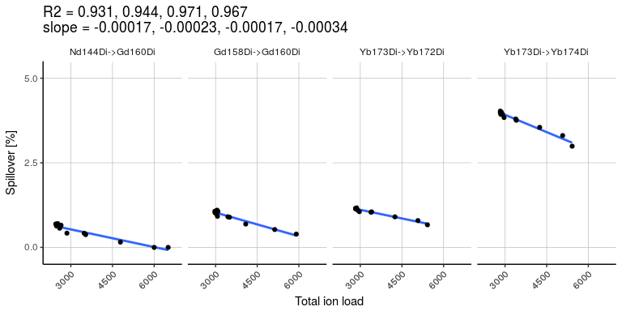
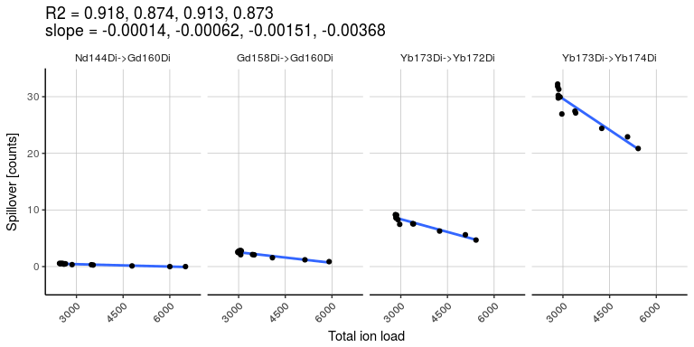

# Saturation effect
Helena L Crowell et al.  

# Aim

Support of our hypothesis that the difference observed in spillover between single-stained beads and multiplexed-stained cells is due to the difference in total ion load, with high loads leading to detector saturation effects (Figure 2, D+E). 

# Procedure

To simulate higher ion loads, we succesively increased amount of barcoding. In the script below, we plot the spillover in percent and absolute counts for the indicated relationships assessed on cells stained with increasing amount of barcoding reagents and identical antibody concentration. A linear model was fitted to each relationship, and increasing ion loads could be associated with a progressive decrease of spillover.


```r
# load required packages
library(flowCore)
library(ggplot2)
library(matrixStats)
library(reshape2)
# source helpers
source('plotting-wrappers.R')

# read in titration series
fcs_path <- '../data/Figure_2-3/BC_titration'
fcs_files <- list.files(fcs_path, '.fcs', full.names=TRUE)
ffs <- lapply(fcs_files, read.FCS)

# get expressions for each group
cd36 <- lapply(ffs[grep("CD36.fcs", fcs_files)], exprs)
cd15 <- lapply(ffs[grep("CD15.fcs", fcs_files)], exprs)
cd3  <- lapply(ffs[grep("CD3.fcs",  fcs_files)], exprs)
es <- list(cd36, cd15, cd3)

# get indicies of channels that may receive spill
chs <- colnames(ffs[[1]])
ms <- get_ms(chs)
mets <- get_mets(chs)
spill_cols <- CATALYST:::get_spill_cols(ms, mets)
ss_ms <- c(144, 158, 173)

# get interaction labels
interactions <- sapply(ss_ms, function(i) {
    j <- which(ms == i)
    from <- chs[j]
    to <- chs[spill_cols[[j]]]
    paste0(from, '->', to)
})

# get total ion loads, spill counts & percentage
loads <- lapply(es, function(i) sapply(i, 
    function(j) median(rowSums(j[, !is.na(ms)]))))
counts <- sapply(seq_along(es), function(i) {
    data <- es[[i]]
    cols <- spill_cols[[which(ms == ss_ms[i])]]
    unlist(sapply(seq_along(data), function(j)
        colMedians(data[[j]][, cols])))
})
spill <- sapply(seq_along(es), function(i) {
    data <- es[[i]]
    idx <- which(ms == ss_ms[i])
    unlist(sapply(seq_along(data), function(j)
        colMedians(data[[j]][, spill_cols[[idx]]] / data[[j]][, idx])))
})

# reformat for plotting
for (i in seq_along(counts)) {
    rownames(counts[[i]]) <- rownames(spill[[i]]) <- interactions[[i]]
    colnames(counts[[i]]) <- colnames(spill[[i]]) <- loads[[i]]
}
df <- data.frame(melt(counts)[-4], melt(spill)[3])
colnames(df) <- c("interaction", "load", "count", "spill")
df$spill <- df$spill * 100
fil <- df$interaction %in% c(
    "Yb173Di->Yb174Di", "Yb173Di->Yb172Di", 
    "Gd158Di->Gd160Di", "Nd144Di->Gd160Di")
df <- df[fil, ]

# fit linear model for load vs. spill %/count
fits <- sapply(c("spill", "count"), function(data) {
    lapply(unique(df$interaction), function(interaction) {
        inds <- df$interaction == interaction
        summary(lm(df[inds, data] ~ df[inds, "load"]))
    })
})
# get R-squared & slopes
R2 <- apply(fits, 2, function(i) sapply(i, function(fit) fit$r.squared))
R2 <- apply(R2, 2, function(r2) paste(sprintf("%.5s", round(r2, 3)), collapse=", "))
beta <- apply(fits, 2, function(i) sapply(i, function(fit) fit$coefficients[2]))
beta <- apply(beta, 2, function(b) paste(sprintf("%.8s", round(b, 5)), collapse=", "))

plot_load_vs_spill(df, y="spill", 
    R2=R2["spill"], beta=beta["spill"], ylab="Spillover [%]",
    yscale=scale_y_continuous(limits=c(-.5, 5.5), breaks=seq(-2.5,5,2.5), expand=c(0,0)))

plot_load_vs_spill(df, y="count", 
    R2=R2["count"], beta=beta["count"], ylab="Spillover [counts]",
    yscale=scale_y_continuous(limits=c(-5, 35), breaks=seq(0,30,10), expand=c(0,0)))
```


