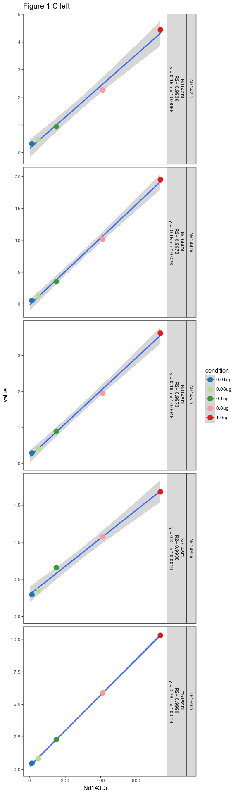
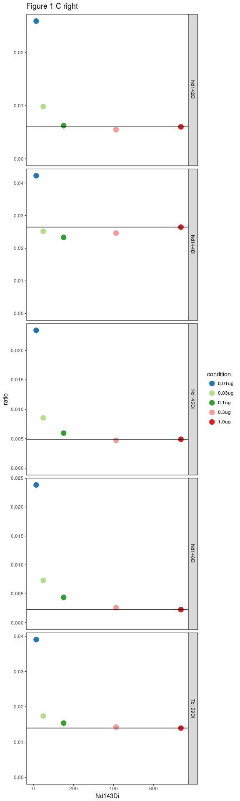

# Spillover linearity
Stephane Chevrier & Vito Zanotelli, et al.  

# Aim
This notebook looks a the linearity of spillover using a dilution series of CD44 (143Nd) stained PBMCs gated for single cells.

## load libraries

```r
library(data.table)
library(dplyr)
```

```
## 
## Attaching package: 'dplyr'
```

```
## The following objects are masked from 'package:data.table':
## 
##     between, first, last
```

```
## The following objects are masked from 'package:stats':
## 
##     filter, lag
```

```
## The following objects are masked from 'package:base':
## 
##     intersect, setdiff, setequal, union
```

```r
library(dtplyr)
library(ggplot2)
library(flowCore)
library(RColorBrewer)
```

## Set the variables

```r
fol = '../data/Figure_1/CD44_Titration/'
metal_emit = 'Nd143Di'
metal_receiv = c('Nd142Di','Nd144Di','Nd145Di','Nd146Di','Tb159Di')
rev_xy = T
```

### Generate some colors

```r
#generate a panel of color > 11

qual_col_pals = brewer.pal.info[brewer.pal.info$category == 'qual',]
col_vector = unlist(mapply(brewer.pal, qual_col_pals$maxcolors, rownames(qual_col_pals)))
col_list = c(18,19,20,21,22,23,24,25,26,27,15,12)
```

## Load the fcs files and calculate medians

```r
loadandsummarize <- function(fn, fol){
  dat = read.FCS(file.path(fol,fn)) %>%
    exprs()%>%
    apply(2, mean) %>%
    t() %>%
    as.data.table()
  return(dat)
}


fns = list.files(fol, pattern='*.FCS')
names(fns) <- fns

rawdat = lapply(fns, function(x) loadandsummarize(x, fol)) %>%
  rbindlist(idcol='condition')
```


```r
dat = melt(rawdat,id.vars = c('condition', metal_emit), measure.vars =metal_receiv )
dat[, variable:=factor(variable, levels=metal_receiv)]
# split the condition variable 

dat[ , condition := gsub('.FCS','',gsub('.*_','',condition))]

dat[, unique(condition)]
```

```
## [1] "0.01ug" "0.03ug" "0.1ug"  "0.3ug"  "1.0ug"
```

```r
x_group = metal_emit
y_group = 'value'

# 


dat[, r2 := format(summary(lm(get(y_group) ~ get(x_group)))$r.squared, digits = 4),by=variable]
dat[, icpt := format(summary(lm(get(y_group) ~ get(x_group)))$coefficients[1,1], digits = 2),by=variable]
dat[, slope := format(summary(lm(get(y_group) ~ get(x_group)))$coefficients[2,1], digits = 2),by=variable]
dat[, ratio:= get(y_group) /get(x_group)]

dat[,plotVar := paste(variable,'\nR2=', r2, '\n','y =',icpt,'+ x *',slope)]

p = ggplot(dat,aes_string(x=x_group,y=y_group,color='condition'))+
  facet_grid(variable+plotVar~.,scale='free_y')+
  theme(strip.text.x = element_text(size = 10))+
  geom_smooth(method = "lm",aes(group=variable),fullrange=T)+
  geom_point(size=4)+
  scale_color_manual(values = col_vector[col_list])+
  expand_limits(x=0,y=0)+
  theme_bw()+
  theme(
    panel.grid.major=element_blank(),
    panel.grid.minor=element_blank())+
  ggtitle('Figure 1 C left')
p
```

<!-- -->


```r
p = ggplot(dat,aes_string(x=x_group,y='ratio',color='condition'))+
  facet_grid(variable~.,scale='free_y')+
  theme(strip.text.x = element_text(size = 10))+
  #geom_smooth(method = "lm",aes(group=variable),fullrange=T)+
  geom_point(size=4)+
  scale_color_manual(values = col_vector[col_list])+
    geom_hline(data=dat[condition=='1.0ug',], aes(yintercept =ratio))+
  expand_limits(x=0,y=0)+
  theme_bw()+
  theme(
    panel.grid.major=element_blank(),
    panel.grid.minor=element_blank())+
  ggtitle('Figure 1 C right')
p
```

<!-- -->

