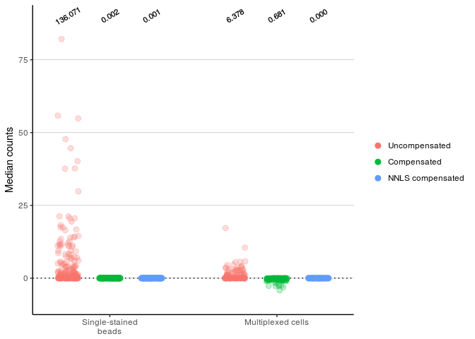

# Assessment of compensation accuracy

# Aim

To quantify the accuracy of our compensation appraoch, we compute median counts in each channel potentially affected by spillover for uncompensated data, compensated data, and NNLS-compensated data obtained upon analyses of single-stained beads and multiplexed-stained PBMCs (Figure 2, C). For each dataset, the average sum of squares is shown on top of the graph.

# Approach 

For multiplexed-staining, cells were stained with two panels (referred to as *even* and *odd* in this script) where half of the channels were left empty to enable spillover assessment in absence of staining.


```r
# load required packages
library(CATALYST)
library(flowCore)
library(ggplot2)
library(matrixStats)
library(reshape2)
# source helpers
source('plotting-wrappers.R')

# read in single-stained beads
fcs_path <- '../data/Figure_S3/bead replicates/CyTOF-A_170606_beads.fcs'
ss_beads <- read.FCS(fcs_path)

# read in spillover matrix
load('../data/Figure_S3/SMs.RData')
sm <- SMs$`CyTOF-A_170606`

# compensate
ss_beads_comped_flow <- compCytof(ss_beads, sm, method="flow")
ss_beads_comped_nnls <- compCytof(ss_beads, sm, method="nnls")

# deconvolute
ss_ms <- c(141:156, 158:176)
res_ss_beads <- assignPrelim(ss_beads, ss_ms, verbose=FALSE)

# read in separation cutoffs & apply
sep_cutoffs <- read.table('../data/Figure_S3/sep_cutoffs.txt', check.names=FALSE)
cutoffs <- sep_cutoffs$`CyTOF-A_170606`
res_ss_beads <- applyCutoffs(res_ss_beads, mhl_cutoff=25, cutoffs)

# get indices of channels expected to receive spill
chs <- colnames(ss_beads)
ms <- get_ms(chs)
mets <- get_mets(chs)
spill_cols <- CATALYST:::get_spill_cols(ms, mets)

# helper to get medians
get_meds <- function(ff) {
    unlist(sapply(ss_ms, function(id) {
        inds <- bc_ids(res_ss_beads) == id
        cols <- spill_cols[[which(ms == id)]]
        apply(exprs(ff[inds, cols]), 2, median)
    }))
}
# compute medians before & upon compensation
uncomped <- get_meds(ss_beads)
comped_flow <- get_meds(ss_beads_comped_flow)
comped_nnls <- get_meds(ss_beads_comped_nnls)
df_ss_beads <- data.frame(uncomped, comped_flow, comped_nnls)

# read in multiplexed cells
fcs_path <- '../data/Figure_2-3/even_odd/gates_files'
fcs_files <- list.files(fcs_path, ".fcs", full.names=TRUE)
fcs_files_even <- fcs_files[grep("even.fcs", fcs_files)]
fcs_files_odd  <- fcs_files[grep("odd.fcs",  fcs_files)]
ffs_even <- lapply(fcs_files_even, read.FCS)
ffs_odd  <- lapply(fcs_files_odd,  read.FCS)

# compensate
comped_flow_even <- lapply(ffs_even, compCytof, sm, method="flow")
comped_flow_odd  <- lapply(ffs_odd,  compCytof, sm, method="flow")

comped_nnls_even <- lapply(ffs_even, compCytof, sm, method="nnls")
comped_nnls_odd  <- lapply(ffs_odd,  compCytof, sm, method="nnls") 

# get indices of channels that could receive spill
chs <- colnames(ffs_even[[1]])
ms <- get_ms(chs)
mets <- get_mets(chs)
spill_cols <- CATALYST:::get_spill_cols(ms, mets)

# get masses stained for & read in panels
ms_even <- get_ms(gsub("170606", "", gsub(fcs_path, "", fcs_files_even)))
ms_odd  <- get_ms(gsub("170606", "", gsub(fcs_path, "", fcs_files_odd )))

csv_path <- '../data/Figure_2-3/even_odd'
csv_files <- list.files(csv_path, '.csv', full.names=TRUE)
panel_even <- read.csv2(csv_files[grep('panel_even', csv_files)], skip=1)$Column1
panel_odd  <- read.csv2(csv_files[grep('panel_odd',  csv_files)], skip=1)$Column1

# get masses that should be excluded
ex_even <- panel_even[!is.na(panel_even)]
ex_odd  <- panel_odd [!is.na(panel_odd )]

# helper to get medians
get_meds <- function(x) { 
    prefix <- switch(x, 
        uncomped = "ffs_",
        flow = "comped_flow_",
        nnls = "comped_nnls_")
    meds <- sapply(c("even", "odd"), function(panel) {
        ms_panel <- get(paste0("ms_", panel))
        ex_panel <- get(paste0("ex_", panel))
        data <- get(paste0(prefix, panel))
        sapply(seq_along(ms_panel), function (i) {
            # get indices of columns that could receive spill
            cols <- spill_cols[[which(ms == ms_panel[i])]]
            # use only those that should be empty
            cols <- cols[!ms[cols] %in% ex_panel]
            # exlude channels that are out of range
            cols <- cols[!ms[cols] > 176]
            colMedians(as.matrix(exprs(data[[i]][, cols])))
        })
    })
    as.numeric(unlist(meds))
}
# compute medians before & upon compensation
uncomped <- get_meds("uncomped")
comped_flow <- get_meds("flow")
comped_nnls <- get_meds("nnls")
df_mp_cells <- data.frame(uncomped, comped_flow, comped_nnls)

# compute MSEs
mse_ss_beads <- colSums(df_ss_beads^2) / nrow(df_ss_beads)
mse_mp_cells <- colSums(df_mp_cells^2) / nrow(df_mp_cells)
df_mse <- data.frame(x=c(1:3, 5:7), y=rep(90, 6), 
    mse=sprintf("%.03f", round(c(mse_ss_beads, mse_mp_cells), 5)))

# reformat & plot
df1 <- data.frame(x=rep(1:3, each=nrow(df_ss_beads)), melt(df_ss_beads))
df2 <- data.frame(x=rep(5:7, each=nrow(df_mp_cells)), melt(df_mp_cells))
plot_before_vs_after(rbind(df1, df2), df_mse)
```

<!-- -->
