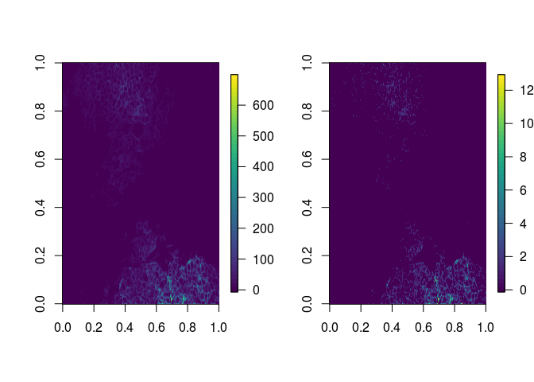
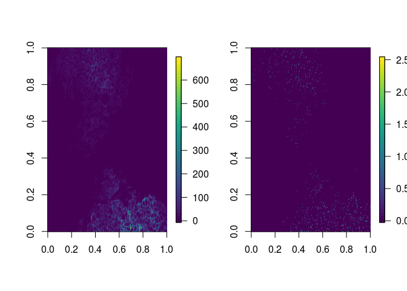

# .txt file image compensation
Vito Zanotelli et al.  
# Aim
This shows how to compensate a .txt file using CATALYST


```r
library(CATALYST)
library(data.table)
library(ggplot2)
library(flowCore)
library(dplyr)
```

```
## 
## Attaching package: 'dplyr'
```

```
## The following object is masked from 'package:flowCore':
## 
##     filter
```

```
## The following objects are masked from 'package:data.table':
## 
##     between, first, last
```

```
## The following objects are masked from 'package:stats':
## 
##     filter, lag
```

```
## The following objects are masked from 'package:base':
## 
##     intersect, setdiff, setequal, union
```

```r
library(dtplyr)
library(EBImage)
```

```
## 
## Attaching package: 'EBImage'
```

```
## The following object is masked from 'package:data.table':
## 
##     transpose
```

```r
library(fields)
```

```
## Loading required package: spam
```

```
## Loading required package: dotCall64
```

```
## Loading required package: grid
```

```
## Spam version 2.1-1 (2017-07-02) is loaded.
## Type 'help( Spam)' or 'demo( spam)' for a short introduction 
## and overview of this package.
## Help for individual functions is also obtained by adding the
## suffix '.spam' to the function name, e.g. 'help( chol.spam)'.
```

```
## 
## Attaching package: 'spam'
```

```
## The following object is masked from 'package:EBImage':
## 
##     display
```

```
## The following object is masked from 'package:flowCore':
## 
##     cleanup
```

```
## The following objects are masked from 'package:base':
## 
##     backsolve, forwardsolve
```

```
## Loading required package: maps
```

```r
library(viridis)
```

```
## Loading required package: viridisLite
```

```r
source('./spillover_imc_helpers.R')
```
## Set paths

```r
fn_sm = '../data/Figure_S5/paper_version_Spillover_Matrix_2_sm.csv'
fn_img = '../data/Figure_4/IMC_image/imc_example_image.txt'
fol_out = '../data/'
fn_out = 'imc_example_comp.txt'
```

## Read img
Fread is the fastest .csv reader I am aware of.

```r
img = fread(fn_img,sep = '\t')
```

```
## 
Read 0.0% of 296877 rows
Read 60.6% of 296877 rows
Read 296877 rows and 52 (of 52) columns from 0.087 GB file in 00:00:05
```

## visualize the img

### helper fkt

```r
normimg <- function(x){
  xmax = max(x)
  x = x/xmax
  x = EBImage::medianFilter(x, size=1)
  x = x*xmax
  return(x)
}
```


### Visualization

```r
par(mfrow=c(1,2))


col2img(img, 'CarbAnhyd(Er166Di)')  %>%
  normimg() %>%
  fields::image.plot(col=viridis(50))
  
col2img(img, '(Er167Di)')  %>%
  normimg() %>%
  fields::image.plot(col=viridis(50))
```

<!-- -->
## Compensate the image


```r
sm = read.csv(fn_sm, row.names = 1)

img_comp = comp_datimg(img, sm = sm)
```

```
## WARNING: Compensation is likely to be inaccurate.
##          Spill values for the following interactions
##          have not been estimated:
```

```
## Y -> Start_push, End_push, Pushes_duration, X, Y, Z
```

```
## Ru100Di -> Ru96Di, Ru98Di, Ru99Di, Ru101Di, Ru102Di, Ru104Di
```

```
## Ru101Di -> Ru96Di, Ru98Di, Ru99Di, Ru100Di, Ru102Di, Ru104Di
```

```
## Ru102Di -> Ru96Di, Ru98Di, Ru99Di, Ru100Di, Ru101Di, Ru104Di
```

```
## Ru104Di -> Ru96Di, Ru98Di, Ru99Di, Ru100Di, Ru101Di, Ru102Di
```

```
## La139Di -> Gd155Di
```

```
## Ir191Di -> Ir193Di
```

```
## Ir193Di -> Ir191Di
```

```
## Ru96Di -> Ru98Di, Ru99Di, Ru100Di, Ru101Di, Ru102Di, Ru104Di
```

```
## Ru98Di -> Ru96Di, Ru99Di, Ru100Di, Ru101Di, Ru102Di, Ru104Di
```

```
## Ru99Di -> Ru96Di, Ru98Di, Ru100Di, Ru101Di, Ru102Di, Ru104Di
```
### Visualization after compensation

```r
par(mfrow=c(1,2))
col2img(img_comp, 'CarbAnhyd(Er166Di)')   %>%
  normimg() %>%
  fields::image.plot(col=viridis(50))
  
col2img(img_comp, '(Er167Di)')  %>%
  normimg() %>%
  fields::image.plot(col=viridis(50))
```

<!-- -->
### Write the image file

fwrite is a fast way to write .txt files

```r
fwrite(img_comp, file=file.path(fol_out, fn_out),sep='\t')
```


```r
sessionInfo()
```

```
## R version 3.4.1 (2017-06-30)
## Platform: x86_64-pc-linux-gnu (64-bit)
## Running under: Ubuntu 14.04.5 LTS
## 
## Matrix products: default
## BLAS: /usr/lib/openblas-base/libblas.so.3
## LAPACK: /usr/lib/lapack/liblapack.so.3.0
## 
## locale:
##  [1] LC_CTYPE=en_US.UTF-8       LC_NUMERIC=C              
##  [3] LC_TIME=en_US.UTF-8        LC_COLLATE=en_US.UTF-8    
##  [5] LC_MONETARY=en_US.UTF-8    LC_MESSAGES=en_US.UTF-8   
##  [7] LC_PAPER=en_US.UTF-8       LC_NAME=C                 
##  [9] LC_ADDRESS=C               LC_TELEPHONE=C            
## [11] LC_MEASUREMENT=en_US.UTF-8 LC_IDENTIFICATION=C       
## 
## attached base packages:
## [1] grid      stats     graphics  grDevices utils     datasets  methods  
## [8] base     
## 
## other attached packages:
##  [1] stringi_1.1.5       viridis_0.4.0       viridisLite_0.2.0  
##  [4] fields_9.0          maps_3.2.0          spam_2.1-1         
##  [7] dotCall64_0.9-04    EBImage_4.18.3      dtplyr_0.0.2       
## [10] dplyr_0.7.4         flowCore_1.42.3     ggplot2_2.2.1      
## [13] data.table_1.10.4-1 CATALYST_1.1.5     
## 
## loaded via a namespace (and not attached):
##  [1] nlme_3.1-131        matrixStats_0.53.0  pbkrtest_0.4-7     
##  [4] RColorBrewer_1.1-2  httr_1.3.1          rprojroot_1.2      
##  [7] tools_3.4.1         backports_1.1.1     R6_2.2.2           
## [10] lazyeval_0.2.0      BiocGenerics_0.22.1 mgcv_1.8-22        
## [13] colorspace_1.3-2    nnet_7.3-12         gridExtra_2.3      
## [16] compiler_3.4.1      graph_1.54.0        quantreg_5.33      
## [19] Biobase_2.36.2      SparseM_1.77        plotly_4.7.1       
## [22] sandwich_2.4-0      scales_0.5.0        DEoptimR_1.0-8     
## [25] nnls_1.4            mvtnorm_1.0-6       robustbase_0.92-7  
## [28] stringr_1.2.0       digest_0.6.15       tiff_0.1-5         
## [31] fftwtools_0.9-8     minqa_1.2.4         rmarkdown_1.6      
## [34] rrcov_1.4-3         jpeg_0.1-8          pkgconfig_2.0.1    
## [37] htmltools_0.3.6     lme4_1.1-14         plotrix_3.7        
## [40] htmlwidgets_1.0     rlang_0.1.2         shiny_1.0.5        
## [43] bindr_0.1           zoo_1.8-0           jsonlite_1.5       
## [46] gtools_3.5.0        car_2.1-5           magrittr_1.5       
## [49] Matrix_1.2-11       Rcpp_0.12.15        munsell_0.4.3      
## [52] abind_1.4-5         multcomp_1.4-8      yaml_2.1.16        
## [55] MASS_7.3-47         plyr_1.8.4          parallel_3.4.1     
## [58] lattice_0.20-35     splines_3.4.1       locfit_1.5-9.1     
## [61] knitr_1.17          corpcor_1.6.9       reshape2_1.4.3     
## [64] codetools_0.2-15    stats4_3.4.1        glue_1.1.1         
## [67] drc_3.0-1           evaluate_0.10.1     png_0.1-7          
## [70] nloptr_1.0.4        httpuv_1.3.5        MatrixModels_0.4-1 
## [73] gtable_0.2.0        purrr_0.2.3         tidyr_0.7.1        
## [76] assertthat_0.2.0    mime_0.5            xtable_1.8-2       
## [79] survival_2.41-3     pcaPP_1.9-72        tibble_1.3.4       
## [82] bindrcpp_0.2        cluster_2.0.6       TH.data_1.0-8
```
