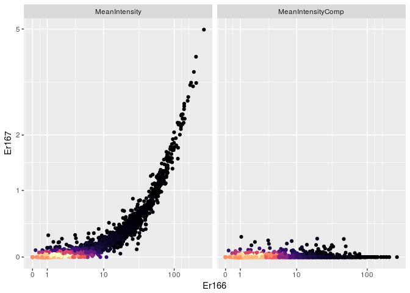
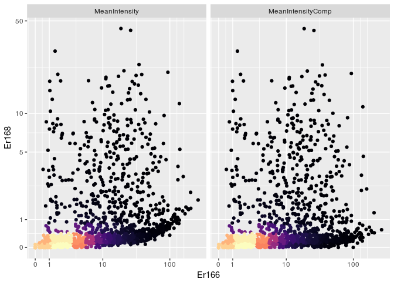
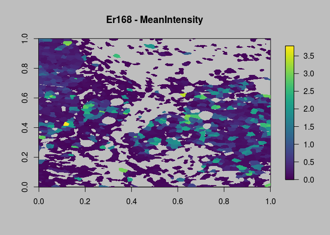
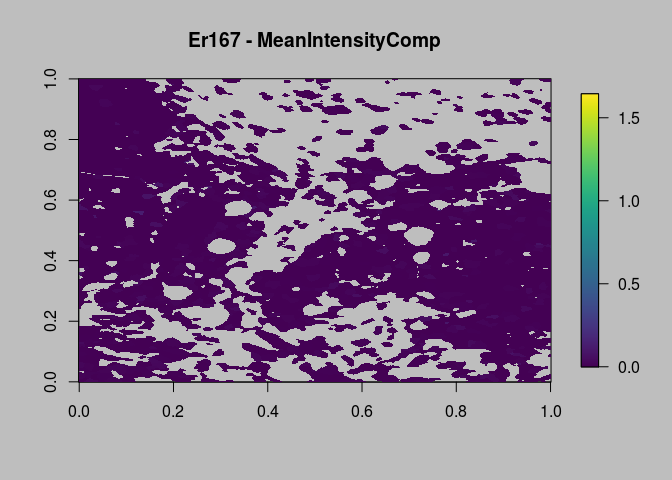
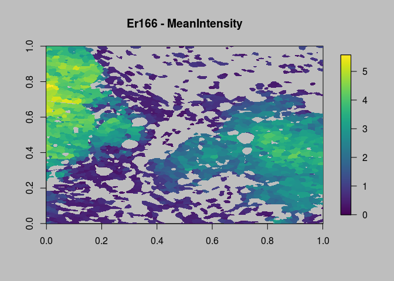

# Analysis and compensation of CellProfiller output
Vito Zanotelli et al.  
01/12/2016  
# Aim
This script visualizes and compensates some CellProfiller output.

## Load the required libraries


## Settings


```r
# input files: paths to your input and output folder
fn_cells = '../data/Figure_4/IMC_image/cpoutput/MyExpt_Cells.csv'
fn_image = '../data/Figure_4/IMC_image/cpoutput//MyExpt_Image.csv'
fn_sm = '../data/Figure_S5/paper_version_Spillover_Matrix_2_sm.csv'
fol_cpout= '../data/Figure_4/IMC_image/cpoutput/'
out_folder = '../data/Figure_4/IMC_image/R'


## a pannel file with has columns:
# - 'main': 0, 1: should the channel be used? needs to be used if e.g. muliple ab are used in one channel in which case only 1 can be main
# - 'clean_target': a nice name of the channel - needs to be UNIQUE!

fn_pannel = '../data/Figure_4/IMC_image/imc_example_pannel.csv'
col_metal = 'Metal Tag'
col_main = 'main'
col_channel_label= 'Target'
fn_fullstack_meta = '../data/Figure_4/IMC_image/analysis/imc_example_image_a0_full.csv'

cp_idvars = c('ImageNumber', 'ObjectNumber')

# Wich CP measurements should be kept?
cp_measurevars = c('IntegratedIntensity','MeanIntensity','MedianIntensity')
```

## small helper functions


```r
getInfoFromString<- function(name,sep='_',strPos=2,censorStr='.fcs'){
  tp <- gsub(censorStr,'',strsplit(name,sep)[[1]][strPos])
  tp <- paste(tp,collapse = sep)
  return(tp)
}

getInfoFromFileList <- function(fileList,sep='_',strPos=2,censorStr='.fcs'){
  condDict = sapply(fileList,function(file){getInfoFromString(file,sep,strPos,censorStr)})
  names(condDict) <- fileList
  return(condDict)
}
```

## Script
Reads in the data

```r
cells <- fread(fn_cells,header = T)
```
## Reshape the data into the long format and extract information from the variable name

```r
measurevar = colnames(cells)[grep(paste(paste0(cp_measurevars,'_'),collapse='|'), colnames(cells), ignore.case=TRUE)]
cells_long = melt.data.table(cells, id.vars =cp_idvars , variable.factor = F,measure.vars = measurevar)


cells_long[,':='(
  measuretype=getInfoFromFileList(.BY,sep = '_', strPos = 1),
  measure=getInfoFromFileList(.BY,sep = '_', strPos = 2),
  stack=getInfoFromFileList(.BY,sep = '_', strPos = 3),
  channelnr=as.numeric(getInfoFromFileList(.BY,sep = '_', strPos = 4, censorStr = 'c'))
), by=variable]
```


## Load the pannel data


```r
###############################################
### load dat_pannel information to name channels ###
###############################################

dat_pannel <- fread(fn_pannel,header = T)
setnames(dat_pannel, col_metal, 'metal')

stack_meta <- read.csv(fn_fullstack_meta,header = F, stringsAsFactors = F)
stack_meta = as.data.table(list('metal'=stack_meta[,1], 'channelnr'=1:nrow(stack_meta)))

dat_pannel <- merge(dat_pannel[main==1, ], stack_meta, by='metal')
setnames(dat_pannel,col_channel_label, 'channelname')

dat_pannel[, metal_catalyst := paste0(metal, 'Di')]
```

## Load the image meta data

```r
###############################################
### load image meta data                    ###
###############################################

dat_image <- fread(fn_image,header = T,stringsAsFactors = F)
# This is actually correct!: , ,
# optionally one could extract more information from the filename here, e.g. conditions, timepoints, slidenr etc.
dat_image[, condition := as.character(.BY),by=FileName_FullStack]
```

## Filter out unecessary data and clear up

```r
idcols = colnames(cells_long)[!colnames(cells_long) %in% c('measure', 'value', 'variable', 'measuretype')]
dat = dcast.data.table(cells_long, formula = paste0(paste(idcols, collapse = '+'), '~', 'measure'), value.var = 'value')


# add the channel information to the dat: I recommend however to not do this, but keep these tables seperate and merge them in as needed
#dat = merge(dat, dat_pannel[main == 1,list(channelnr, channelname)], by='channelnr')
#dat = merge(dat, dat_image[,list(ImageNumber, condition)], by = 'ImageNumber')

cells = NULL
cells_long = NULL
```


# Compensate the mean intensities

```r
# read the spillover matrix
sm = as.matrix(read.csv(fn_sm, row.names = 1))
metavars = c('ImageNumber','ObjectNumber', 'stack')


# Bring the data into the right format
tdat <- dat %>%
  subset(stack=='FullStack') %>%
  merge(dat_pannel, by='channelnr') %>%
  dcast.data.table(paste0(paste(metavars, collapse = '+'), ' ~ metal_catalyst'),value.var = 'MeanIntensity')


# Compensate and add the new measurement back to the main data
dat = tdat %>%
  dplyr::select(-one_of(metavars)) %>%
  data.matrix() %>%
  flowCore::flowFrame() %>%
  compCytof(sm, method='nnls') %>%
  exprs() %>%
  as.data.table() %>%
  cbind(dplyr::select(tdat, one_of(metavars))) %>%
  melt.data.table(id.vars = metavars, value.name = 'MeanIntensityComp', variable.name= 'metal_catalyst') %>%
  merge(dat_pannel[, .(metal_catalyst, channelnr)], by='metal_catalyst') %>%
  dplyr::select(-metal_catalyst) %>%
  merge(dat, by=c(metavars, 'channelnr'), all=T)
```

```
## WARNING: Compensation is likely to be inaccurate.
##          Spill values for the following interactions
##          have not been estimated:
```

```
## La139Di -> Gd155Di
```

```r
rm(tdat)
```

## Define helper functions to do the scatter plots

```r
base_breaks <- function(n = 10){
  function(x) {
    c(0,axisTicks(asinh(range(x, na.rm = TRUE)/2), log = TRUE, n = n))
  }
}
asinh2_trans = function() trans_new("asinh2_trans", function(x) asinh(x/2), function(x) sinh(x)*2, breaks = base_breaks())


plot_compscatter <- function(x_var, y_var){
  
  stackord = c('Uncompensated'='FullStack', 'NNLS compensated'= 'CompStack')
  metavars = c('ImageNumber','ObjectNumber', 'metal')
  p = dat %>%
    subset(stack %in% 'FullStack') %>%
    merge(dat_pannel[metal %in% c(x_var, y_var), ], by='channelnr') %>%
    melt.data.table(id.vars = metavars, variable.name = 'measurement',measure.vars = c('MeanIntensity','MeanIntensityComp')) %>%
    dcast('ImageNumber+ObjectNumber+measurement~ metal') %>%
    mutate(d = densCols(get(x_var),get(y_var), colramp = colorRampPalette((viridis::magma(100))))) %>%
    ggplot(aes(x=get(x_var), y=get(y_var), color=d))+
    facet_grid(.~measurement)+
    xlab(x_var)+
    ylab(y_var)+
    geom_point()+
    scale_color_identity()+
    scale_x_continuous(trans ="asinh2" )+
    scale_y_continuous(trans ="asinh2" )
  return(p)
}
```

## Plot the scatter plots

```r
x_var = "Er166"
y_var = "Er167"

p = plot_compscatter( "Er166", "Er167")
print(p)
```

<!-- -->

```r
p = plot_compscatter( "Er166", "Er168")
print(p)
```

<!-- -->

```r
#ggsave(p, filename = file.path(out_folder, paste0('scatterplot_',x_var,'vs', y_var,'.pdf')))
```

These reproduce Fig. 4 A


# Generation of mask images

Load all the masks

```r
read_img_from_fn <- function(fn, basefolder){
  fn = file.path(basefolder, fn)
  return(list(tiff::readTIFF(fn,as.is = T)))
}


dat_image[, mask := lapply(ObjectsFileName_Cells,function(fn) read_img_from_fn(fn, basefolder = fol_cpout))]
```

## Define helper functions

```r
map_values_on_mask <- function(mask, objectids, values){
  # strategy: make a vector where position = objectid +1
  # vector map the values and reshape to an image
  value_vec = numeric(max(mask)+1)
  value_vec[] = NaN
  value_vec[objectids+1] = values
  maskimg_long = value_vec[c(mask)+1]
  maskimg = matrix(maskimg_long, nrow=nrow(mask), ncol = ncol(mask))
  return(maskimg)
}


get_maskimg <- function(dat, dat_image, metal_name, imagenumber, value_var, stack, pannel){
  p_imagnr = imagenumber
  p_channel = channel
  p_stack = stack
  mask = dat_image[ImageNumber == p_imagnr, mask][[1]]
  tdat = dat %>%
    filter(ImageNumber==p_imagnr, stack==p_stack) %>%
    merge(pannel[metal == metal_name,], by='channelnr', all=F) 
  
  objectids = tdat[, ObjectNumber]
  values = tdat[, get(value_var)]
  maskimg = map_values_on_mask(mask, objectids, values)
  return(maskimg)
}

plot_img <- function(maskimg, zlim=NULL, bg_col='grey', scale_dist=20, scale_xy=c(0.7,0.1), cmap=viridis::viridis(n=1024), title=NULL, transf=function(x) x){
  par(bg=bg_col)
  if (is.null(zlim)){
    zlim = c(min(maskimg, na.rm = T), max(maskimg, na.rm = T))
  }
  zlim = transf(zlim)
  maskimg = transf(maskimg)
  image.plot(maskimg, zlim=zlim,col = cmap)
  if (!is.null(title)){
    title(title)
  }
}

plot_multi_image <- function(dat, dat_image, panmel, metal, vars, imagenumber, stack='FullStack', transf=function(x) x, zoom=NULL){
  stackdat <- data.table('vars'=vars)
  stackdat[, maskimg:= lapply(vars, function(v) get_maskimg(dat, dat_image,stack=stack, metal_name = metal, imagenumber = img_number, value_var=v, pannel = dat_pannel))]
  if (!is.null(zoom)){
    stackdat[, maskimg:= lapply(maskimg, function(m) m[zoom[1]:zoom[2], zoom[3]:zoom[4]])]
    
  }
  stackdat[, ':='(
    cmax = max(sapply(maskimg, function(x) max(x, na.rm=T))),
    cmin = min(sapply(maskimg, function(x) min(x, na.rm=T))))
    ]
  stackdat[, plot_img(maskimg[[1]], zlim=c(cmin[1],cmax[1]), title=paste(metal, .BY[[1]], sep=' - '), transf = transf), by=vars]
  return(stackdat)
}
```

## Plot the masks

An overview over the whole image

```r
metal = 'Er168'
img_number =1
vars = c('MeanIntensity', 'MeanIntensityComp')

x =plot_multi_image(dat, dat_image, panmel = dat_pannel, metal='Er168', vars=vars, imagenumber = img_number, transf=function(x) asinh(x/2))
```

<!-- --><!-- -->

```r
plot_multi_image(dat, dat_image, panmel = dat_pannel, metal='Er167', vars=vars, imagenumber = img_number, transf=function(x) asinh(x/2))
```

<!-- --><!-- --><div data-pagedtable="false">
  <script data-pagedtable-source type="application/json">
{"columns":[{"label":["vars"],"name":[1],"type":["chr"],"align":["left"]},{"label":["maskimg"],"name":[2],"type":["list"],"align":["right"]},{"label":["cmax"],"name":[3],"type":["dbl"],"align":["right"]},{"label":["cmin"],"name":[4],"type":["dbl"],"align":["right"]}],"data":[{"1":"MeanIntensity","2":"<dbl [469 × 633]>","3":"4.97784","4":"0"},{"1":"MeanIntensityComp","2":"<dbl [469 × 633]>","3":"4.97784","4":"0"}],"options":{"columns":{"min":{},"max":[10]},"rows":{"min":[10],"max":[10]},"pages":{}}}
  </script>
</div>

```r
plot_multi_image(dat, dat_image, panmel = dat_pannel, metal='Er166', vars=vars, imagenumber = img_number, transf=function(x) asinh(x/2))
```

<!-- --><!-- --><div data-pagedtable="false">
  <script data-pagedtable-source type="application/json">
{"columns":[{"label":["vars"],"name":[1],"type":["chr"],"align":["left"]},{"label":["maskimg"],"name":[2],"type":["list"],"align":["right"]},{"label":["cmax"],"name":[3],"type":["dbl"],"align":["right"]},{"label":["cmin"],"name":[4],"type":["dbl"],"align":["right"]}],"data":[{"1":"MeanIntensity","2":"<dbl [469 × 633]>","3":"262.7214","4":"0"},{"1":"MeanIntensityComp","2":"<dbl [469 × 633]>","3":"262.7214","4":"0"}],"options":{"columns":{"min":{},"max":[10]},"rows":{"min":[10],"max":[10]},"pages":{}}}
  </script>
</div>

Approximate plot of the regions used in the paper

```r
metal = 'Er168'
img_number =1
vars = c('MeanIntensity', 'MeanIntensityComp')

plot_multi_image(dat, dat_image, panmel = dat_pannel, metal='Er166', vars=vars, imagenumber = img_number, zoom=c(10,100,400,540))
```

<!-- --><!-- --><div data-pagedtable="false">
  <script data-pagedtable-source type="application/json">
{"columns":[{"label":["vars"],"name":[1],"type":["chr"],"align":["left"]},{"label":["maskimg"],"name":[2],"type":["list"],"align":["right"]},{"label":["cmax"],"name":[3],"type":["dbl"],"align":["right"]},{"label":["cmin"],"name":[4],"type":["dbl"],"align":["right"]}],"data":[{"1":"MeanIntensity","2":"<dbl [91 × 141]>","3":"262.7214","4":"1.491632"},{"1":"MeanIntensityComp","2":"<dbl [91 × 141]>","3":"262.7214","4":"1.491632"}],"options":{"columns":{"min":{},"max":[10]},"rows":{"min":[10],"max":[10]},"pages":{}}}
  </script>
</div>

```r
plot_multi_image(dat, dat_image, panmel = dat_pannel, metal='Er167', vars=vars, imagenumber = img_number, zoom=c(10,100,400,540))
```

<!-- --><!-- --><div data-pagedtable="false">
  <script data-pagedtable-source type="application/json">
{"columns":[{"label":["vars"],"name":[1],"type":["chr"],"align":["left"]},{"label":["maskimg"],"name":[2],"type":["list"],"align":["right"]},{"label":["cmax"],"name":[3],"type":["dbl"],"align":["right"]},{"label":["cmin"],"name":[4],"type":["dbl"],"align":["right"]}],"data":[{"1":"MeanIntensity","2":"<dbl [91 × 141]>","3":"4.97784","4":"0"},{"1":"MeanIntensityComp","2":"<dbl [91 × 141]>","3":"4.97784","4":"0"}],"options":{"columns":{"min":{},"max":[10]},"rows":{"min":[10],"max":[10]},"pages":{}}}
  </script>
</div>

```r
plot_multi_image(dat, dat_image, panmel = dat_pannel, metal='Er168', vars=vars, imagenumber = img_number, zoom=c(10,100,400,540))
```

<!-- --><!-- --><div data-pagedtable="false">
  <script data-pagedtable-source type="application/json">
{"columns":[{"label":["vars"],"name":[1],"type":["chr"],"align":["left"]},{"label":["maskimg"],"name":[2],"type":["list"],"align":["right"]},{"label":["cmax"],"name":[3],"type":["dbl"],"align":["right"]},{"label":["cmin"],"name":[4],"type":["dbl"],"align":["right"]}],"data":[{"1":"MeanIntensity","2":"<dbl [91 × 141]>","3":"11.89712","4":"0"},{"1":"MeanIntensityComp","2":"<dbl [91 × 141]>","3":"11.89712","4":"0"}],"options":{"columns":{"min":{},"max":[10]},"rows":{"min":[10],"max":[10]},"pages":{}}}
  </script>
</div>
This more or less corresponds to Fig 4 C

## Save the mask images
For later visualization in e.g. ImageJ

```r
channel= chan = 'Er168Di'
img_number =1

save_maskimg <- function(img, maxval, stack, chan){
  img =(img+1)/(maxval+1)
  img[is.na(img)] = 0
  
  print(maxval)
  print(1/maxval)
  print(sum(img >1))
  img[img >1] = 1

  tiff::writeTIFF(img, file.path(out_folder, paste0('mask_', stack,'_',chan,'_max',maxval, '.tiff')), reduce=TRUE, bits.per.sample = 16)
}

get_and_save_maskimg <- function(metal, img_number, vars, dat, dat_image, pannel, stack='FullStack'){
  stackdat <- data.table('vars'=vars)
  stackdat[, maskimg:= lapply(vars, function(v) get_maskimg(dat, dat_image,stack=stack, metal_name = metal, imagenumber = img_number, value_var=v, pannel = dat_pannel))]
  
  maxval = ceiling( stackdat[, max(sapply(maskimg, function(x) max(x, na.rm=T)))])
  
  stackdat[, save_maskimg(maskimg[[1]], maxval, .BY[[1]], metal), by=vars]
  return(maxval)
  
}


get_and_save_maskimg(
  metal='Er166',
  img_number=1,
  vars=c('MeanIntensity', 'MeanIntensityComp'),
  dat=dat,
  dat_image=dat_image,
  pannel=dat_pannel
)
```

```
## [1] 263
## [1] 0.003802281
## [1] 0
## [1] 263
## [1] 0.003802281
## [1] 0
```

```
## [1] 263
```

```r
get_and_save_maskimg(
  metal='Er167',
  img_number=1,
  vars=c('MeanIntensity', 'MeanIntensityComp'),
  dat=dat,
  dat_image=dat_image,
    pannel=dat_pannel
)
```

```
## [1] 5
## [1] 0.2
## [1] 0
## [1] 5
## [1] 0.2
## [1] 0
```

```
## [1] 5
```

```r
get_and_save_maskimg(
  metal='Er168',
  img_number=1,
  vars=c('MeanIntensity', 'MeanIntensityComp'),
  dat=dat,
  dat_image=dat_image,
    pannel=dat_pannel
)
```

```
## [1] 44
## [1] 0.02272727
## [1] 0
## [1] 44
## [1] 0.02272727
## [1] 0
```

```
## [1] 44
```
