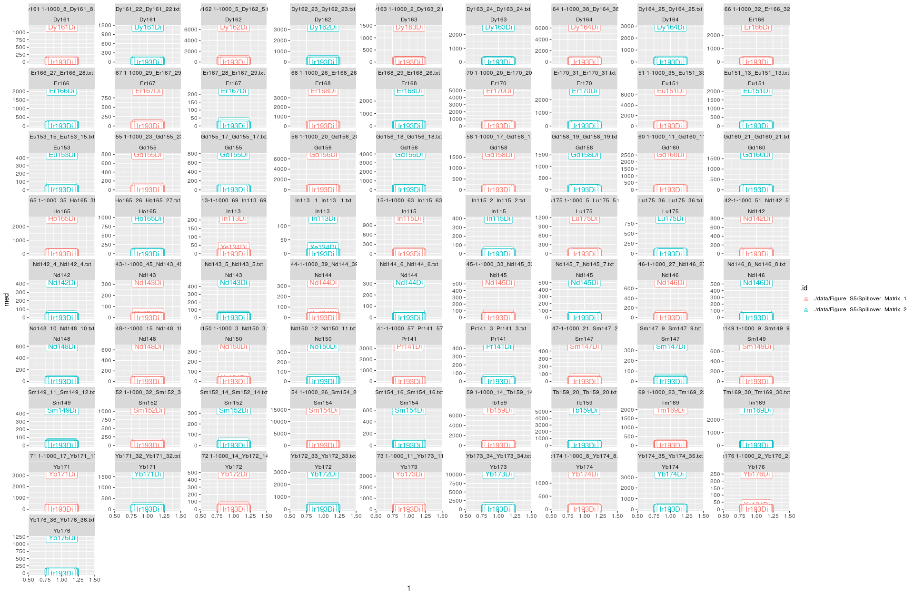
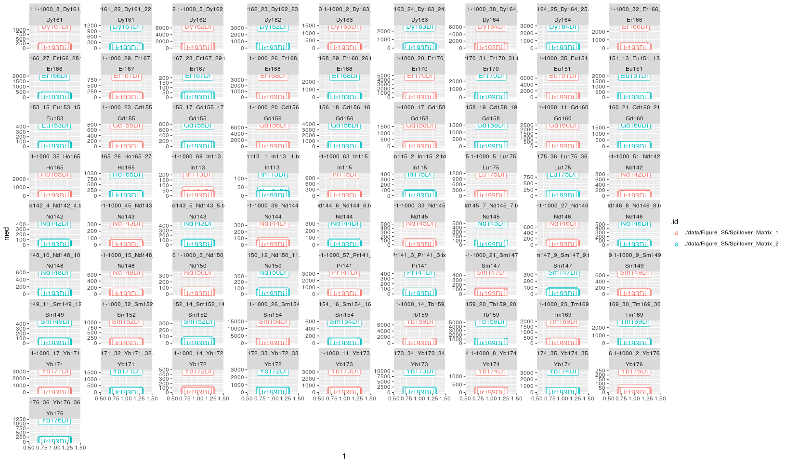
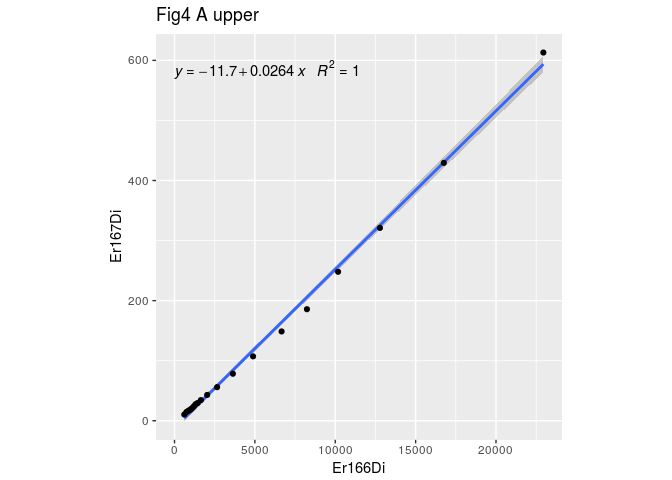
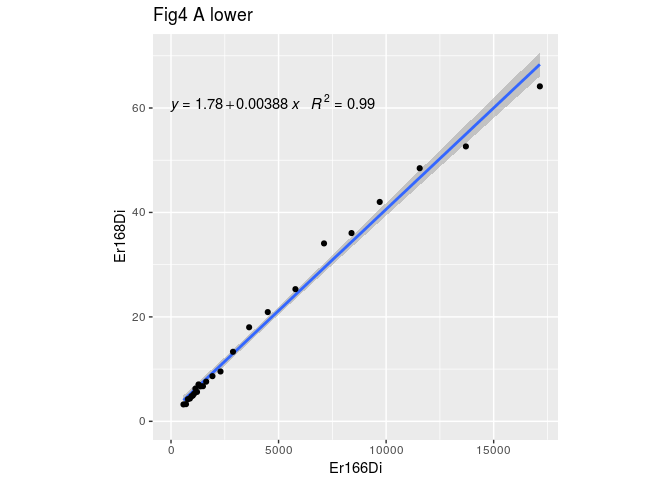

# Spillover estimation IMC
Vito Zanotelli et al.  

# Aim
This script shows how to estimate spillover from single metal spots on an agarose coated slide.
Each spot should be imaged with a single acquisition. The name of the acquisition should be the metal that is used:
E.g. PanormaA_1_Yb176_23.txt

When run with the example data it reproduces the spillover estimation shown in Fig S5A as well as Fig 4A

# Script
## load all libraries

```r
library(CATALYST)
library(data.table)
library(ggplot2)
library(flowCore)
library(dplyr)
library(dtplyr)
library(stringr)
library(ggpmisc)

source('spillover_imc_helpers.R')
```


## setup the configuration variables

```r
# list of folders that contain each a complete single stain acquisition (e.g. in case that one wants to run and compare multiple single stains from different days)
fols_ss = c('../data/Figure_S5/Spillover_Matrix_2','../data/Figure_S5/Spillover_Matrix_1' )

# output folder
fol_out = '../data/Figure_S5/'
# name prefix for all output
prefix ='paper_version_'
```


## load single stains
### Data loading

```r
# load the data
list_img_ss <-lapply(fols_ss, load_ss_fol)
names(list_img_ss) <- fols_ss
```

### Adapt the column names to be recognized metal names by CATALYST 
CATALYST needs to have the metal names in the format (METAL)(MASS)Di

```r
list_img_ss = lapply(list_img_ss, function(x) lapply(x, fixnames))
dats_raw = lapply(list_img_ss, imglist2dat)
```


### Extract the single stain masses from the acquisition name
This needs to be changed in case a different naming scheme is used!

```r
for (dat in dats_raw){
  dat[, metal:= strsplit(.BY[[1]], '_')[[1]][3],by=file]
  dat[, mass:= as.numeric(str_extract_all(.BY[[1]], "[0-9]+")[[1]]),by=metal]
}
```

## Visualization of the raw data
In the following section the raw data is visualized

### Calculate per-file medians

```r
dats_raw_sum = rbindlist(lapply(dats_raw, calc_file_medians),idcol = T)
```


### Visualize per-file medians
Plots the median of the data. It is recommended to have >200 counts for all the channels.
This is also a good plot to check if the metal spots really contain the correct metal!

```r
dats_raw_sum %>%
  ggplot(aes(x=1, y=med, color=.id))+
  facet_wrap(~file+metal, scales = 'free_y')+
  geom_label(aes(label=variable), size=4)
```

<!-- -->


###  Optional data bining

If the median per-pixel intensities are to low, it could be worth to sum up some consecuteive pixels to get a better accuracy for the estimation
(here not the case). This is valid because for segmentation based quantitative image analysis usually anyways pixels are aggregated. If the binning is choosen to big, there is however a potential accumulation of background noise.


```r
# defines over how many pixels the aggregation should happen
# 1 = no aggregation
npixelbin = 1

dats_agg <- lapply(dats_raw, function(x) aggregate_pixels(x, n=npixelbin))
dats_agg_sum = rbindlist(lapply(dats_agg, calc_file_medians), idcol = T)
```


### Visualize per-file medians after binning
The intensities increase according to the aggregation factor

```r
dats_agg_sum %>%
  ggplot(aes(x=1, y=med, color=.id))+
  facet_wrap(~file+metal, scales = 'free_y')+
  geom_label(aes(label=variable))
```

<!-- -->

## CATALYST based compensation


## estimate the spillover
To estimate the spillover, the (aggregated) pixel values are first debarcoded using CATALYST, treating them like single cells. This step acts as a quality filter to remove background/noisy/weak pixels as well as pixels with artefacts (e.g. specles with strong signal in many channels).
If the true metal was correctly encoded in the filename, the 'remove_incorrect_bc' option will check the debarcoding and remove events assigned to the wrong barcode.

Then this identified, strong single stain pixels will be used for the spillover estimation.


```r
res = lapply(dats_agg, function(x) re_from_dat(x,
                                               ss_ms=x[!is.na(mass), unique(mass)],
                                               minevents = 40,
                                              correct_bc = x[ , unique(mass)]))
```

```
## Debarcoding data...
```

```
##  o ordering
```

```
##  o classifying events
```

```
## Normalizing...
```

```
## Computing deltas...
```

```
## Computing counts and yields...
```

```
## Debarcoding data...
```

```
##  o ordering
```

```
##  o classifying events
```

```
## Normalizing...
```

```
## Computing deltas...
```

```
## Computing counts and yields...
```

```r
sms = lapply(res, function(x) computeSpillmat(x))
```

### save the spillover matrices


```r
for (i in seq_along(sms)){
  outname = file.path(fol_out, paste0(prefix, basename(fols_ss[i]),'_sm.csv'))
  write.csv(sms[[i]],file = outname)
}
```


### Visualization of the spillover matrix


```r
for (i in seq_along(sms)){
  print(names(dats_agg)[i])
  ss_ms = dats_agg[[i]][!is.na(mass), unique(mass)]
  p = CATALYST::plotSpillmat(ss_ms,sms[[i]])
  print(p)
}
```

```
## [1] "../data/Figure_S5/Spillover_Matrix_2"
```

```
## We recommend that you use the dev version of ggplot2 with `ggplotly()`
## Install it with: `devtools::install_github('hadley/ggplot2')`
```

```
## [1] "../data/Figure_S5/Spillover_Matrix_1"
```

```
## We recommend that you use the dev version of ggplot2 with `ggplotly()`
## Install it with: `devtools::install_github('hadley/ggplot2')`
```


### Some quality indicators

Here we calculate e.g. number of debarcoded events/metal, median levels of highest signal and second highest signal


```r
for (i in seq_along(res)){
  
  dat = dats_agg[[i]]
  re = res[[i]]
  
  name = names(dats_agg)[i]
  tdat = dat %>%
    mutate(bcid = bc_ids(re)) %>%
    filter(bcid != '0') %>%
    dplyr::select(-c(Start_push, End_push, Pushes_duration,   X , Y  ,Z)) %>%
  melt.data.table(id.vars = c('metal', 'mass','file', 'bcid')) %>%
  do(data.table(.)[, list(med=median(value), n=.N), by=.(variable, metal, mass, bcid,file)]) 
  
  
  # find the highest metal, second highest metal
  sumdat = tdat[ , .(
    highestvariable = variable[med == max(med)],
    highestmed = max(med),
    secondhighestvariable = variable[med == sort(med,partial=length(med)-1)[length(med)-1]],
    secondhighestmed = sort(med,partial=length(med)-1)[length(med)-1],
    n=max(n)
  )  ,by=.( mass, bcid,file)]
  
  print(sumdat)
}
```

```
##     mass bcid                  file highestvariable highestmed
##  1:  161  161 Dy161_22_Dy161_22.txt         Dy161Di  1109.7640
##  2:  162  162 Dy162_23_Dy162_23.txt         Dy162Di  3015.7125
##  3:  163  163 Dy163_24_Dy163_24.txt         Dy163Di  1798.3760
##  4:  164  164 Dy164_25_Dy164_25.txt         Dy164Di  1802.0540
##  5:  166  166 Er166_27_Er166_28.txt         Er166Di  1441.3340
##  6:  167  167 Er167_28_Er167_29.txt         Er167Di   215.1805
##  7:  168  168 Er168_29_Er168_26.txt         Er168Di  2653.7640
##  8:  170  170 Er170_31_Er170_31.txt         Er170Di  2236.7715
##  9:  151  151 Eu151_13_Eu151_13.txt         Eu151Di  1754.1270
## 10:  153  153 Eu153_15_Eu153_15.txt         Eu153Di   403.4180
## 11:  155  155 Gd155_17_Gd155_17.txt         Gd155Di   742.6380
## 12:  156  156 Gd156_18_Gd156_18.txt         Gd156Di  2997.2870
## 13:  158  158 Gd158_19_Gd158_19.txt         Gd158Di  1395.1280
## 14:  160  160 Gd160_21_Gd160_21.txt         Gd160Di  1522.2955
## 15:  165  165 Ho165_26_Ho165_27.txt         Ho165Di   920.2120
## 16:  113  113 In113 _1_In113 _1.txt         In113Di   126.6970
## 17:  115  115   In115_2_In115_2.txt         In115Di   394.2880
## 18:  175  175 Lu175_36_Lu175_36.txt         Lu175Di   881.7790
## 19:  142  142   Nd142_4_Nd142_4.txt         Nd142Di   402.3390
## 20:  143  143   Nd143_5_Nd143_5.txt         Nd143Di   428.3170
## 21:  144  144   Nd144_6_Nd144_6.txt         Nd144Di   302.4250
## 22:  145  145   Nd145_7_Nd145_7.txt         Nd145Di   477.7375
## 23:  146  146   Nd146_8_Nd146_8.txt         Nd146Di   507.3850
## 24:  148  148 Nd148_10_Nd148_10.txt         Nd148Di   565.2830
## 25:  150  150 Nd150_12_Nd150_11.txt         Nd150Di   341.7270
## 26:  141  141   Pr141_3_Pr141_3.txt         Pr141Di   419.5940
## 27:  147  147   Sm147_9_Sm147_9.txt         Sm147Di   331.3000
## 28:  149  149 Sm149_11_Sm149_12.txt         Sm149Di   441.1240
## 29:  152  152 Sm152_14_Sm152_14.txt         Sm152Di   320.9630
## 30:  154  154 Sm154_16_Sm154_16.txt         Sm154Di   573.2780
## 31:  159  159 Tb159_20_Tb159_20.txt         Tb159Di  4409.5370
## 32:  169  169 Tm169_30_Tm169_30.txt         Tm169Di  2223.8580
## 33:  171  171 Yb171_32_Yb171_32.txt         Yb171Di  1617.8235
## 34:  172  172 Yb172_33_Yb172_33.txt         Yb172Di  2806.0560
## 35:  173  173 Yb173_34_Yb173_34.txt         Yb173Di  9597.2620
## 36:  174  174 Yb174_35_Yb174_35.txt         Yb174Di  3189.1600
## 37:  176  176 Yb176_36_Yb176_36.txt         Yb176Di  1206.7530
##     mass bcid                  file highestvariable highestmed
##     secondhighestvariable secondhighestmed    n
##  1:               Dy162Di          37.1340 2099
##  2:               Dy163Di         155.6930 1672
##  3:               Dy164Di          39.8785 1364
##  4:               Dy163Di          53.3440 1369
##  5:               Er167Di          31.3440 1764
##  6:               Xe134Di          22.4670 1580
##  7:               Xe134Di          22.1150 2106
##  8:               Xe134Di          23.0950 1622
##  9:               Xe134Di          23.5330 1662
## 10:               Xe134Di          23.2200 1549
## 11:               Xe134Di          23.2530 1386
## 12:               Gd158Di          30.4060 1825
## 13:               Xe134Di          23.3770 1924
## 14:               Xe134Di          21.9825 1842
## 15:               Xe134Di          23.2470 1851
## 16:               Xe134Di          22.8440 2173
## 17:               Xe134Di          23.4320 2146
## 18:               Xe134Di          22.8570 1755
## 19:               Xe134Di          22.9730 2050
## 20:               Xe134Di          23.0280 1950
## 21:               Xe134Di          23.1250 2031
## 22:               Xe134Di          22.9400 1964
## 23:               Xe134Di          23.2380 1921
## 24:               Xe134Di          22.7230 1917
## 25:               Xe134Di          22.1410 1830
## 26:               Xe134Di          23.2100 2085
## 27:               Xe134Di          23.2020 1667
## 28:               Xe134Di          23.0970 1669
## 29:               Xe134Di          23.6500 2021
## 30:               Xe134Di          23.3350 1559
## 31:               Xe134Di          22.9790 1807
## 32:               Xe134Di          22.7480 1787
## 33:               Yb172Di          78.1975 1776
## 34:               Yb173Di         141.9775 2126
## 35:               Yb174Di         518.0950 2111
## 36:               Lu175Di          45.2390 2081
## 37:               Xe134Di          29.4240 1967
##     secondhighestvariable secondhighestmed    n
##     mass bcid                         file highestvariable highestmed
##  1:  161  161   Dy161 1-1000_8_Dy161_8.txt         Dy161Di  1147.3080
##  2:  162  162   Dy162 1-1000_5_Dy162_5.txt         Dy162Di  4895.8560
##  3:  163  163   Dy163 1-1000_2_Dy163_2.txt         Dy163Di  1273.5295
##  4:  164  164 Dy164 1-1000_38_Dy164_38.txt         Dy164Di  4910.8550
##  5:  166  166 Er166 1-1000_32_Er166_32.txt         Er166Di  2528.1040
##  6:  167  167 Er167 1-1000_29_Er167_29.txt         Er167Di   937.2280
##  7:  168  168 Er168 1-1000_26_Er168_26.txt         Er168Di  2506.9690
##  8:  170  170 Er170 1-1000_20_Er170_20.txt         Er170Di  4391.6370
##  9:  151  151 Eu151 1-1000_35_Eu151_33.txt         Eu151Di  3720.9410
## 10:  155  155 Gd155 1-1000_23_Gd155_23.txt         Gd155Di   761.2090
## 11:  156  156 Gd156 1-1000_20_Gd156_20.txt         Gd156Di  4964.9460
## 12:  158  158 Gd158 1-1000_17_Gd158_17.txt         Gd158Di  1392.6410
## 13:  160  160 Gd160 1-1000_11_Gd160_11.txt         Gd160Di  2128.4835
## 14:  165  165 Ho165 1-1000_35_Ho165_35.txt         Ho165Di  2438.3550
## 15:  113  113 In113-1-1000_69_In113_69.txt         In113Di   207.0635
## 16:  115  115 In115-1-1000_63_In115_63.txt         In115Di  1090.3785
## 17:  175  175   Lu175 1-1000_5_Lu175_5.txt         Lu175Di  1131.8815
## 18:  142  142 Nd142-1-1000_51_Nd142_51.txt         Nd142Di   712.2020
## 19:  143  143 Nd143-1-1000_45_Nd143_45.txt         Nd143Di   304.5370
## 20:  144  144 Nd144-1-1000_39_Nd144_39.txt         Nd144Di   324.8335
## 21:  145  145 Nd145-1-1000_33_Nd145_33.txt         Nd145Di   478.7090
## 22:  146  146 Nd146-1-1000_27_Nd146_27.txt         Nd146Di   663.6640
## 23:  148  148 Nd148-1-1000_15_Nd148_15.txt         Nd148Di   623.8740
## 24:  150  150   Nd150 1-1000_3_Nd150_3.txt         Nd150Di   337.7510
## 25:  141  141 Pr141-1-1000_57_Pr141_57.txt         Pr141Di  1395.6980
## 26:  147  147 Sm147-1-1000_21_Sm147_21.txt         Sm147Di   444.2800
## 27:  149  149   Sm149 1-1000_9_Sm149_9.txt         Sm149Di   675.8370
## 28:  152  152 Sm152 1-1000_32_Sm152_30.txt         Sm152Di   746.5320
## 29:  154  154 Sm154 1-1000_26_Sm154_26.txt         Sm154Di 11233.0860
## 30:  159  159 Tb159 1-1000_14_Tb159_14.txt         Tb159Di  5500.1415
## 31:  169  169 Tm169 1-1000_23_Tm169_23.txt         Tm169Di  1821.1860
## 32:  171  171 Yb171 1-1000_17_Yb171_17.txt         Yb171Di  2780.9450
## 33:  172  172 Yb172 1-1000_14_Yb172_14.txt         Yb172Di   441.4430
## 34:  173  173 Yb173 1-1000_11_Yb173_11.txt         Yb173Di  2807.6440
## 35:  174  174   Yb174 1-1000_8_Yb174_8.txt         Yb174Di  1283.1080
## 36:  176  176   Yb176 1-1000_2_Yb176_2.txt         Yb176Di   246.3335
##     mass bcid                         file highestvariable highestmed
##     secondhighestvariable secondhighestmed    n
##  1:               Xe134Di          36.5140 1455
##  2:               Dy163Di         230.6610 1369
##  3:               Xe134Di          35.1475 1332
##  4:               Dy163Di         139.2250 1573
##  5:               Er167Di          46.4460 1693
##  6:               Xe134Di          36.7105 1366
##  7:               Xe134Di          36.0990 1615
##  8:               Er168Di          45.9750 1571
##  9:               Xe134Di          38.4240 1055
## 10:               Xe134Di          37.8250 1494
## 11:               Gd158Di          50.0530 1137
## 12:               Xe134Di          37.5270 1406
## 13:               Xe134Di          37.1175 1492
## 14:               Xe134Di          36.2460 1453
## 15:               Xe134Di          39.0960 1676
## 16:               Xe134Di          38.0030 1724
## 17:               Xe134Di          34.3415 1596
## 18:               Xe134Di          38.0030 1169
## 19:               Xe134Di          38.6080 1523
## 20:               Xe134Di          37.8795 1498
## 21:               Xe134Di          36.8570 1481
## 22:               Xe134Di          37.9930 1408
## 23:               Xe134Di          37.1490 1347
## 24:               Xe134Di          36.0965 1154
## 25:               Xe134Di          37.4610 1341
## 26:               Xe134Di          37.7060 1469
## 27:               Xe134Di          36.5760 1370
## 28:               Xe134Di          39.1100 1324
## 29:               Sm152Di          83.4245 1002
## 30:               Xe134Di          37.3970 1430
## 31:               Xe134Di          35.7210 1639
## 32:               Yb172Di         122.7280 1335
## 33:               Xe134Di          35.8690 1497
## 34:               Yb174Di         106.1450 1579
## 35:               Xe134Di          34.7950 1549
## 36:               Xe134Di          33.1450 1696
##     secondhighestvariable secondhighestmed    n
```


```r
res_uncor = lapply(dats_agg, function(x) re_from_dat(x,
                                               ss_ms=x[!is.na(mass), unique(mass)],
                                               minevents = 40,
                                              correct_bc = NULL ))
```

```
## Debarcoding data...
```

```
##  o ordering
```

```
##  o classifying events
```

```
## Normalizing...
```

```
## Computing deltas...
```

```
## Computing counts and yields...
```

```
## Debarcoding data...
```

```
##  o ordering
```

```
##  o classifying events
```

```
## Normalizing...
```

```
## Computing deltas...
```

```
## Computing counts and yields...
```

```r
sms_uncor = lapply(res_uncor, function(x) computeSpillmat(x))
```

Assure that the results are exactly the same when ensuring that now debarcoding error happened by using the annotation from the file names:


```r
ndig = 8
for (i in seq_along(sms)){
print('all equal?')
print(all(round(sms_uncor[[i]], digits=ndig) == round(sms[[i]],digits = ndig)))
#diffmat = abs(round(sms_uncor[[i]], digits=ndig)-round(sms[[i]],digits = ndig))/round(sms[[i]],digits = ndig)
#match(T,diffmat > 0.01)
}
```

```
## [1] "all equal?"
## [1] TRUE
## [1] "all equal?"
## [1] TRUE
```
-> The results are exactly equal. Thus just debarcoding - without using any information about where the pixels actually belong - seems to be a vaild option to estimate the spillover.


## The plot below reproduces plots to check the linearity of spillover

### Define a helper function


```r
plot_binplot <- function(imgs, fn, x_var, y_var, perc=0.99, nbins=100, fkt=median){
    # This function makes a 'quantile' binning, binning the data in nbins that contain an equal number of events.
    dat = copy(imgs[[fn]])
    print(dat)
    #dat[, bins:= cut(get(x_var), seq(0, quantile(get(x_var),perc),length.out = nbins), right=T, include.lowest = T)]
    dat = subset(dat, get(x_var) < quantile(get(x_var),perc))
    dat[, bins:=  ntile(get(x_var), nbins)]
    x = melt.data.table(dat, id.vars = 'bins')
    x = x[, .(binmean=fkt(value)), by=.(bins, variable)]
    x = dcast.data.table(x[!is.na(bins),], 'bins~variable', value.var='binmean')
    
    ggplot(x, aes(x=get(x_var), y=get(y_var))) +
        geom_smooth(method = 'lm', alpha =0.5)+
        geom_point()+
        xlab(x_var) +
        ylab(y_var)+
        expand_limits(x=0, y=0)+
           stat_poly_eq(formula=as.formula('y~x'), aes(label = paste(..eq.label.., ..rr.label.., sep = "~~~")), 
                parse = TRUE) +  
        theme(aspect.ratio=1)
    
}
```
Plot the spillover relationships

```r
pltimgs=list_img_ss[[1]]
fn = "Er166_27_Er166_28.txt"
x_var = "Er166Di"
y_var= "Er167Di"
p = plot_binplot(pltimgs, fn, x_var, y_var, perc=0.95, nbins=20, fkt = median)
```

```
##       Start_push End_push Pushes_duration   X Y    Z In113Di In115Di
##    1:       1660     2043             384   0 0    0       0       0
##    2:       2045     2428             384   1 0    1       0       0
##    3:       2431     2814             384   2 0    2       0       0
##    4:       2816     3199             384   3 0    3       0       0
##    5:       3201     3584             384   4 0    4       0       0
##   ---                                                               
## 2402:    1382774  1383157             384 396 5 2401       0       0
## 2403:    1383159  1383542             384 397 5 2402       0       0
## 2404:    1383544  1383927             384 398 5 2403       0       0
## 2405:    1383930  1384313             384 399 5 2404       0       0
## 2406:    1384315  1384698             384 400 5 2405       0       0
##       Xe134Di Pr141Di Nd142Di Nd143Di Nd144Di Nd145Di Nd146Di Sm147Di
##    1:  32.000       0       0       0       0       0       0       0
##    2:  18.506       0       0       1       0       0       0       0
##    3:  23.065       0       0       0       0       0       0       0
##    4:  29.621       0       0       0       0       0       0       0
##    5:  18.144       0       0       0       0       0       0       0
##   ---                                                                
## 2402:  21.337       0       0       0       0       0       0       0
## 2403:  22.105       0       0       0       0       0       0       0
## 2404:  23.917       0       0       0       0       0       0       0
## 2405:  22.266       0       0       0       0       0       0       0
## 2406:  20.005       0       0       0       0       0       0       0
##       Nd148Di Sm149Di Nd150Di Eu151Di Sm152Di Eu153Di Sm154Di Gd155Di
##    1:   0.000       0       0       0   0.000       0       1       0
##    2:   0.000       0       0       0   0.000       0       0       0
##    3:   0.000       1       0       0   0.000       0       0       0
##    4:   0.000       0       0       0   0.000       0       1       0
##    5:   1.058       0       0       0   0.000       0       0       1
##   ---                                                                
## 2402:   2.898       0       0       0   0.000       0       1       0
## 2403:   0.000       0       0       0   0.000       0       0       0
## 2404:   0.000       0       0       0   1.131       2       0       0
## 2405:   1.524       0       0       0   0.000       0       0       0
## 2406:   0.000       1       0       0   1.000       0       0       0
##       Gd156Di Gd158Di Tb159Di Gd160Di Dy161Di Dy162Di Dy163Di Dy164Di
##    1:       0   0.000       0       0   0.000       0   0.000   4.618
##    2:       0   0.000       0       0   0.000       1   1.000   4.521
##    3:       0   1.000       0       0   0.000       0   3.065   2.000
##    4:       0   1.180       1       0   0.000       0   0.000   3.750
##    5:       0   1.276       0       0   0.000       1   4.000  15.766
##   ---                                                                
## 2402:       0   3.499       2       0   1.353       1   5.099  32.052
## 2403:       0   2.000       0       0   0.000       0   1.000   3.585
## 2404:       0   2.000       0       1   0.000       0   1.000   7.071
## 2405:       0   0.000       0       0   0.000       0   8.616   8.621
## 2406:       0   0.000       0       0   0.000       0   5.002   8.045
##       Ho165Di   Er166Di  Er167Di Er168Di Tm169Di Er170Di Yb171Di Yb172Di
##    1:   2.000  4757.041  123.252  12.372   3.244   3.000       1   1.000
##    2:   8.119  8007.379  209.744  31.421   4.768   6.002       2   0.000
##    3:   8.276  6830.498  170.436  31.394   2.146   6.904       1   4.000
##    4:   4.168  9136.946  214.540  23.801   5.000   1.000       5   1.000
##    5:  22.731 20290.826  581.442  60.367   9.161  23.758       3   4.088
##   ---                                                                   
## 2402:  28.985 35741.191 1149.217 102.131  18.504  33.121       5   5.000
## 2403:   8.827  9192.140  225.310  58.329   9.109  11.873       3   1.000
## 2404:  11.552 11778.282  257.285  50.587   6.915  14.153       3   4.121
## 2405:   9.070 12018.466  319.036  45.265   8.310  14.985       5   4.000
## 2406:   7.000 12698.520  301.212  47.145   7.751  12.037       4   4.792
##       Yb173Di Yb174Di Lu175Di Yb176Di Ir191Di Ir193Di
##    1:       1   2.000       1       0       0       0
##    2:       1   1.000       0       0       0       0
##    3:       0   0.000       0       0       0       1
##    4:       0   0.000       0       0       0       0
##    5:       0   0.000       1       0       0       0
##   ---                                                
## 2402:       1   1.000       2       0       0       0
## 2403:       0   1.000       0       1       0       0
## 2404:       2   2.392       0       0       0       0
## 2405:       1   1.000       1       0       0       0
## 2406:       0   0.000       2       0       0       0
```

```
## Warning in melt.data.table(dat, id.vars = "bins"):
## 'measure.vars' [Start_push, End_push, Pushes_duration, X, ...] are not all
## of the same type. By order of hierarchy, the molten data value column will
## be of type 'double'. All measure variables not of type 'double' will be
## coerced to. Check DETAILS in ?melt.data.table for more on coercion.
```

```r
p= p+ggtitle('Fig4 A upper')
print(p)
```

<!-- -->

```r
fn ="Er166_27_Er166_28.txt"
x_var = "Er166Di"
y_var= "Er168Di"

p = plot_binplot(pltimgs, fn, x_var, y_var, perc=0.9, nbins=25, fkt = median)
```

```
##       Start_push End_push Pushes_duration   X Y    Z In113Di In115Di
##    1:       1660     2043             384   0 0    0       0       0
##    2:       2045     2428             384   1 0    1       0       0
##    3:       2431     2814             384   2 0    2       0       0
##    4:       2816     3199             384   3 0    3       0       0
##    5:       3201     3584             384   4 0    4       0       0
##   ---                                                               
## 2402:    1382774  1383157             384 396 5 2401       0       0
## 2403:    1383159  1383542             384 397 5 2402       0       0
## 2404:    1383544  1383927             384 398 5 2403       0       0
## 2405:    1383930  1384313             384 399 5 2404       0       0
## 2406:    1384315  1384698             384 400 5 2405       0       0
##       Xe134Di Pr141Di Nd142Di Nd143Di Nd144Di Nd145Di Nd146Di Sm147Di
##    1:  32.000       0       0       0       0       0       0       0
##    2:  18.506       0       0       1       0       0       0       0
##    3:  23.065       0       0       0       0       0       0       0
##    4:  29.621       0       0       0       0       0       0       0
##    5:  18.144       0       0       0       0       0       0       0
##   ---                                                                
## 2402:  21.337       0       0       0       0       0       0       0
## 2403:  22.105       0       0       0       0       0       0       0
## 2404:  23.917       0       0       0       0       0       0       0
## 2405:  22.266       0       0       0       0       0       0       0
## 2406:  20.005       0       0       0       0       0       0       0
##       Nd148Di Sm149Di Nd150Di Eu151Di Sm152Di Eu153Di Sm154Di Gd155Di
##    1:   0.000       0       0       0   0.000       0       1       0
##    2:   0.000       0       0       0   0.000       0       0       0
##    3:   0.000       1       0       0   0.000       0       0       0
##    4:   0.000       0       0       0   0.000       0       1       0
##    5:   1.058       0       0       0   0.000       0       0       1
##   ---                                                                
## 2402:   2.898       0       0       0   0.000       0       1       0
## 2403:   0.000       0       0       0   0.000       0       0       0
## 2404:   0.000       0       0       0   1.131       2       0       0
## 2405:   1.524       0       0       0   0.000       0       0       0
## 2406:   0.000       1       0       0   1.000       0       0       0
##       Gd156Di Gd158Di Tb159Di Gd160Di Dy161Di Dy162Di Dy163Di Dy164Di
##    1:       0   0.000       0       0   0.000       0   0.000   4.618
##    2:       0   0.000       0       0   0.000       1   1.000   4.521
##    3:       0   1.000       0       0   0.000       0   3.065   2.000
##    4:       0   1.180       1       0   0.000       0   0.000   3.750
##    5:       0   1.276       0       0   0.000       1   4.000  15.766
##   ---                                                                
## 2402:       0   3.499       2       0   1.353       1   5.099  32.052
## 2403:       0   2.000       0       0   0.000       0   1.000   3.585
## 2404:       0   2.000       0       1   0.000       0   1.000   7.071
## 2405:       0   0.000       0       0   0.000       0   8.616   8.621
## 2406:       0   0.000       0       0   0.000       0   5.002   8.045
##       Ho165Di   Er166Di  Er167Di Er168Di Tm169Di Er170Di Yb171Di Yb172Di
##    1:   2.000  4757.041  123.252  12.372   3.244   3.000       1   1.000
##    2:   8.119  8007.379  209.744  31.421   4.768   6.002       2   0.000
##    3:   8.276  6830.498  170.436  31.394   2.146   6.904       1   4.000
##    4:   4.168  9136.946  214.540  23.801   5.000   1.000       5   1.000
##    5:  22.731 20290.826  581.442  60.367   9.161  23.758       3   4.088
##   ---                                                                   
## 2402:  28.985 35741.191 1149.217 102.131  18.504  33.121       5   5.000
## 2403:   8.827  9192.140  225.310  58.329   9.109  11.873       3   1.000
## 2404:  11.552 11778.282  257.285  50.587   6.915  14.153       3   4.121
## 2405:   9.070 12018.466  319.036  45.265   8.310  14.985       5   4.000
## 2406:   7.000 12698.520  301.212  47.145   7.751  12.037       4   4.792
##       Yb173Di Yb174Di Lu175Di Yb176Di Ir191Di Ir193Di
##    1:       1   2.000       1       0       0       0
##    2:       1   1.000       0       0       0       0
##    3:       0   0.000       0       0       0       1
##    4:       0   0.000       0       0       0       0
##    5:       0   0.000       1       0       0       0
##   ---                                                
## 2402:       1   1.000       2       0       0       0
## 2403:       0   1.000       0       1       0       0
## 2404:       2   2.392       0       0       0       0
## 2405:       1   1.000       1       0       0       0
## 2406:       0   0.000       2       0       0       0
```

```
## Warning in melt.data.table(dat, id.vars = "bins"):
## 'measure.vars' [Start_push, End_push, Pushes_duration, X, ...] are not all
## of the same type. By order of hierarchy, the molten data value column will
## be of type 'double'. All measure variables not of type 'double' will be
## coerced to. Check DETAILS in ?melt.data.table for more on coercion.
```

```r
p= p+ggtitle('Fig4 A lower')
print(p)
```

<!-- -->
-> This reproduces Fig 4A


```r
sessionInfo()
```

```
## R version 3.4.1 (2017-06-30)
## Platform: x86_64-pc-linux-gnu (64-bit)
## Running under: Ubuntu 14.04.5 LTS
## 
## Matrix products: default
## BLAS: /usr/lib/openblas-base/libblas.so.3
## LAPACK: /usr/lib/lapack/liblapack.so.3.0
## 
## locale:
##  [1] LC_CTYPE=en_US.UTF-8       LC_NUMERIC=C              
##  [3] LC_TIME=en_US.UTF-8        LC_COLLATE=en_US.UTF-8    
##  [5] LC_MONETARY=en_US.UTF-8    LC_MESSAGES=en_US.UTF-8   
##  [7] LC_PAPER=en_US.UTF-8       LC_NAME=C                 
##  [9] LC_ADDRESS=C               LC_TELEPHONE=C            
## [11] LC_MEASUREMENT=en_US.UTF-8 LC_IDENTIFICATION=C       
## 
## attached base packages:
## [1] stats     graphics  grDevices utils     datasets  methods   base     
## 
## other attached packages:
## [1] stringi_1.1.5       ggpmisc_0.2.16      stringr_1.2.0      
## [4] dtplyr_0.0.2        dplyr_0.7.4         flowCore_1.42.3    
## [7] ggplot2_2.2.1       data.table_1.10.4-1 CATALYST_1.1.5     
## 
## loaded via a namespace (and not attached):
##  [1] Biobase_2.36.2      httr_1.3.1          tidyr_0.7.1        
##  [4] viridisLite_0.2.0   jsonlite_1.5        splines_3.4.1      
##  [7] gtools_3.5.0        shiny_1.0.5         assertthat_0.2.0   
## [10] stats4_3.4.1        yaml_2.1.16         robustbase_0.92-7  
## [13] backports_1.1.1     lattice_0.20-35     quantreg_5.33      
## [16] glue_1.1.1          digest_0.6.15       RColorBrewer_1.1-2 
## [19] minqa_1.2.4         colorspace_1.3-2    sandwich_2.4-0     
## [22] httpuv_1.3.5        htmltools_0.3.6     Matrix_1.2-11      
## [25] plyr_1.8.4          pcaPP_1.9-72        pkgconfig_2.0.1    
## [28] SparseM_1.77        xtable_1.8-2        purrr_0.2.3        
## [31] corpcor_1.6.9       mvtnorm_1.0-6       scales_0.5.0       
## [34] lme4_1.1-14         MatrixModels_0.4-1  tibble_1.3.4       
## [37] mgcv_1.8-22         car_2.1-5           TH.data_1.0-8      
## [40] nnet_7.3-12         BiocGenerics_0.22.1 lazyeval_0.2.0     
## [43] pbkrtest_0.4-7      mime_0.5            survival_2.41-3    
## [46] magrittr_1.5        evaluate_0.10.1     nlme_3.1-131       
## [49] MASS_7.3-47         graph_1.54.0        tools_3.4.1        
## [52] matrixStats_0.53.0  multcomp_1.4-8      plotly_4.7.1       
## [55] munsell_0.4.3       cluster_2.0.6       plotrix_3.7        
## [58] bindrcpp_0.2        compiler_3.4.1      rlang_0.1.2        
## [61] grid_3.4.1          nloptr_1.0.4        drc_3.0-1          
## [64] htmlwidgets_1.0     crosstalk_1.0.0     labeling_0.3       
## [67] rmarkdown_1.6       gtable_0.2.0        codetools_0.2-15   
## [70] polynom_1.3-9       reshape2_1.4.3      rrcov_1.4-3        
## [73] R6_2.2.2            gridExtra_2.3       nnls_1.4           
## [76] zoo_1.8-0           knitr_1.17          bindr_0.1          
## [79] rprojroot_1.2       parallel_3.4.1      Rcpp_0.12.15       
## [82] DEoptimR_1.0-8
```
