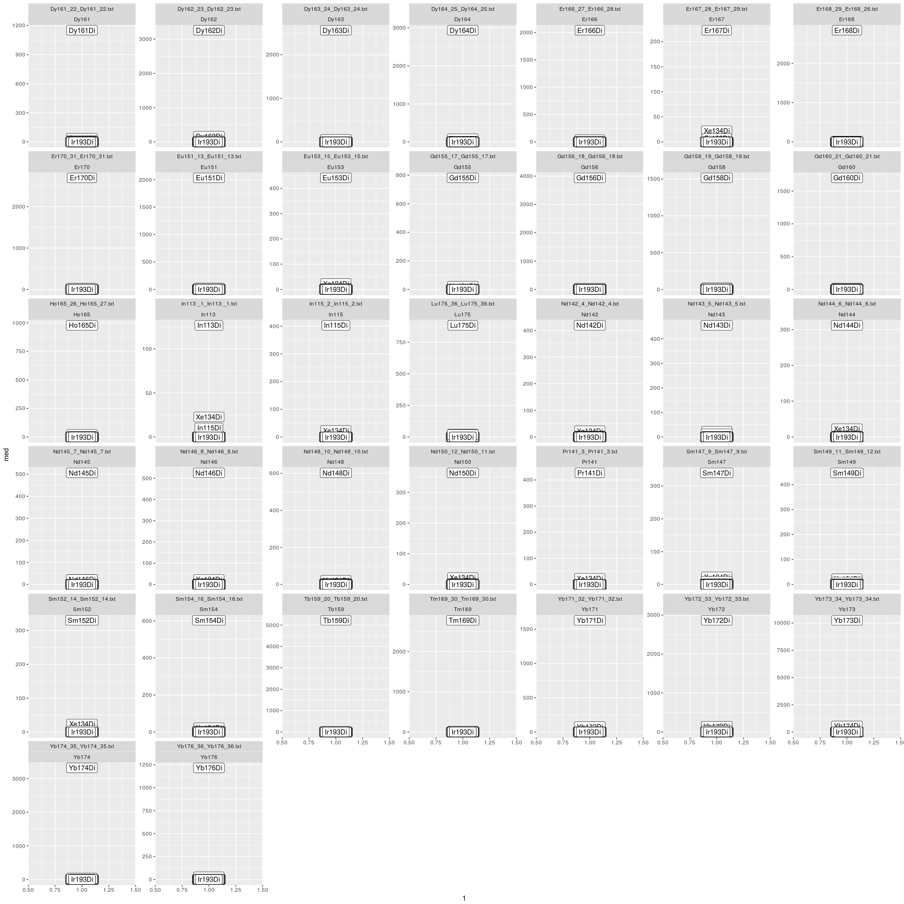

# Aim
This script shows how to estimate spillover from single metal spots on an agarose coated slide.
This short script illustrates how the helper function 'estimate_sm_from_imc_txtfol' can be used to estimate a spillover matrix from a folder containing all acquisitions 
in .txt format in one single function call.


```r
library(CATALYST)
library(data.table)
library(ggplot2)
library(flowCore)
library(dplyr)
library(dtplyr)
library(stringr)
library(ggpmisc)
source('spillover_imc_helpers.R')
```


## setup the configuration variables

```r
# a folder containing a complete single stain acquisition
fol_ss = '../data/Figure_S5/Spillover_Matrix_2'
```
Example for estimation of the spillover matrix from a folder of single stains
with single stains parsed from naming: xxx_x_metal_x.txt? (E.g. Dy161 1-1000_8_Dy161_8.txt)

```r
#' estimate_sm_from_imc_txtfol
#' Estimates spillover directly from a folder containing IMC .txt files
#'
#' @param fol_ss folder containing .txt acquisitions of IMC single stains
#' @param ssmetals_from_fn logical, Are the single stains correctly named xxx_x_metal_x.txt? (E.g. Dy161 1-1000_8_Dy161_8.txt
#' @param ssmetals Vector of masses of the single stains used. Required if ssmetals_from_file_fn is False
#' @param fn2ssmetal Optional: a named vector mapping the filenames to the single stain metal used (e.g. if it cannot be parsed from the filename)
#' @param remove_incorrect_bc Remove barcodes not matching the filename single stain annotation (requires either ssmetals_from_fn=T or fn2ssmetal )
#' @param minevents Minimal number of events (after debarcoding) that need to be present in a single stain in order that a spillover estimation is performed
#' @param bin_n_pixels Optional: integer, bin n consecutive pixels. Can be used if the intensities per pixel are to low (e.g. <200 counts)
#' @param ... Optional parameters will be passed to CATALYST::computeSpillmat 
res = estimate_sm_from_imc_txtfol(fol_ss, ssmetals_from_fn=T)
```

```
## Debarcoding data...
```

```
##  o ordering
```

```
##  o classifying events
```

```
## Normalizing...
```

```
## Computing deltas...
```

```
## Computing counts and yields...
```
Plot of the spillover matrix estimated
(1:10000 is just to circumvent the requirement of the plotSpillmat function to have single stain masses provided)

```r
CATALYST::plotSpillmat(1:10000,res[['sm']])
```

```
## We recommend that you use the dev version of ggplot2 with `ggplotly()`
## Install it with: `devtools::install_github('hadley/ggplot2')`
```

<!--html_preserve--><div id="71c7702b394e" style="width:720px;height:720px;" class="plotly html-widget"></div>
<script type="application/json" data-for="71c7702b394e">{"x":{"data":[{"x":[1,2,3,4,5,6,7,8,9,10,11,12,13,14,15,16,17,18,19,20,21,22,23,24,25,26,27,28,29,30,31,32,33,34,35,36,37,38,39,40],"y":[1,2,3,4,5,6,7,8,9,10,11,12,13,14,15,16,17,18,19,20,21,22,23,24,25,26,27,28,29,30,31,32,33,34,35,36,37,38,39,40],"z":[[0,0,0,0,0,0,0,0,0,0,0,0,0,0,0,0,0,0,0,0,0,0,0,0,0,0,0,0,0,0,0,0,0,0,0,0,0,0,0,0],[0,0,0,0,0,0,0,0,0,0,0,0,0,0,0,0,0,0,0,0,0,0,0,0,0,0,0,0,0,0,0,0,0,0,0,0,0,0,0,0],[0,0,0,0,0,0,0,0,0,0,0,0,0,0,0,0,0,0,0,0,0,0,0,0,0,0,0,0,0,0,0,0,0,0,0.000556858294599198,0.00322956560733831,0.000867626261311677,1,0,0],[0,0,0,0,0,0,0,0,0,0,0,0,0,0,0,0,0,0,0,0,0,0,0,0,0,0,0,0,0,0,0,0,0,0,0,0.000858265872780073,1,0.0211690842537242,0,0],[0,0,0,0,0,0,0,0,0,0,0,0,0,0,0,0,0,0,0,0,0,0,0,0,0,0,0,0,0,0,0,0,0.000562485945483767,0.0016536043859189,0.00401956396381974,1,0.0143519402996713,0.00434114185423067,0,0],[0,0,0,0,0,0,0,0,0,0,0,0,0,0,0,0,0,0,0,0,0,0,0,0,0,0,0,0,0,0,0,0.000781605991813631,0.00374570263721051,0.0158071658906892,1,0.0539558343030528,0,0.00316033669127094,0,0],[0,0,0,0,0,0,0,0,0,0,0,0,0,0,0,0,0,0,0,0,0,0,0,0,0,0,0,0,0,0,0,0.000934426520802012,0.00911915619844665,1,0.0516122528745299,0.012275769649912,0,0.00166151860849554,0,0],[0,0,0,0,0,0,0,0,0,0,0,0,0,0,0,0,0,0,0,0,0,0,0,0,0,0,0,0,0,0,0,0.00179418762708121,1,0.0494817816105505,0.00373452696975435,0.00403130870320361,0,0.00102501908734817,0,0],[0,0,0,0,0,0,0,0,0,0,0,0,0,0,0,0,0,0,0,0,0,0,0,0,0,0.00028057317921764,0,0.00680069303079949,0.00564195760634753,0.0103374395043604,0.00136994233296986,1,0.00937143754246143,0,0,0,0,0,0,0],[0,0,0,0,0,0,0,0,0,0,0,0,0,0,0,0,0,0,0,0,0,0,0,0,0,0,0,0,0,0.000924183187961916,1,0.00869082042812881,0,0,0,0,0,0,0,0],[0,0,0,0,0,0,0,0,0,0,0,0,0,0,0,0,0,0,0,0,0,0,0,0,0,0,0,0.00311911340953044,0.00682589907403048,1,0.00676664054122895,0.00350512210487028,0,0,0,0,0,0,0,0],[0,0,0,0,0,0,0,0,0,0,0,0,0,0,0,0,0,0,0,0,0,0,0,0,0,0,0,0.00946131516978135,1,0.0315308493450329,0,0,0,0,0,0,0,0,0,0],[0,0,0,0,0,0,0,0,0,0,0,0,0,0,0,0,0,0,0,0,0,0,0,0,0,0.000518914015034241,0.000804923936915674,1,0.0209280567947898,0.00458043536412703,0,0.00100158756514938,0,0,0,0,0,0,0,0],[0,0,0,0,0,0,0,0,0,0,0,0,0,0,0,0,0,0,0,0,0,0,0,0,0,0.000722858766806674,1,0.00432403097064512,0,0,0,0,0,0,0,0,0,0,0,0],[0,0,0,0,0,0,0,0,0,0,0,0,0,0,0,0,0,0,0,0,0,0.000500809927283497,0.0050044433371081,0.00839360693199472,0.0288606460670394,1,0.0058624309734559,0,0,0,0,0,0,0,0,0,0,0,0,0],[0,0,0,0,0,0,0,0,0,0,0,0,0,0,0,0,0,0,0,0,0,0.000307304637160558,0.00378434198606431,0.0128888830158899,1,0.0226369358810397,0,0,0,0,0,0,0,0,0,0,0,0,0,0],[0,0,0,0,0,0,0,0,0,0,0,0,0,0,0,0,0,0,0,0,0,0.000663459324333152,0.0156943056407384,1,0.0514571965112628,0.00959140505226162,0,0,0,0,0,0,0,0,0,0,0,0,0,0],[0,0,0,0,0,0,0,0,0,0,0,0,0,0,0,0,0,0,0,0,0,0.00256054805209808,1,0.0332792569206314,0.010433413507184,0.00664119558324839,0,0,0,0,0,0,0,0,0,0,0,0,0,0],[0,0,0,0,0,0,0,0,0,0,0,0,0,0,0,0,0,0.000824347830408404,0.00143871293993854,0.00650818066916124,0.000899272135334803,1,0.00436854261618428,0,0,0,0,0,0,0,0,0,0,0,0,0,0,0.000593801186184239,0,0],[0,0,0,0,0,0,0,0,0,0,0,0,0,0,0,0,0,0,0,0.000705090895079817,1,0.00544492832717156,0,0,0,0,0,0,0,0,0,0,0,0,0,0,0.000389515136763618,0,0,0],[0,0,0,0,0,0,0,0,0,0,0,0,0,0,0,0,0,0.000857899923976094,0.00252117989545762,1,0.00455007933419572,0.0081155608040384,0,0,0,0,0,0,0,0,0,0,0,0,0,0.000772282569595152,0,0,0,0],[0,0,0,0,0,0,0,0,0,0,0,0,0,0,0,0,0.00062707942148997,0.00948843484571277,1,0.0096674492470791,0,0.00296023081357194,0,0,0,0,0,0,0,0,0,0,0,0.000843268408159721,0,0,0,0,0,0],[0,0,0,0,0,0,0,0,0,0,0,0,0,0,0,0,0,1,0.00479995997270049,0,0,0,0,0,0,0,0,0,0,0,0,0,0.000466419742821532,0,0,0,0,0,0,0],[0,0,0,0,0,0,0,0,0,0.000764616297768616,0.000837129666134994,0.00130243077731507,0,0,0.00756561275990739,0,1,0.00428425763811733,0,0,0,0,0,0,0,0,0,0,0,0,0,0,0,0,0,0,0,0,0,0],[0,0,0,0,0,0,0,0,0,0,0,0,0,0.00730190597867181,0.00117775560707163,1,0.00428968039233126,0,0,0,0,0,0,0,0,0,0,0,0,0,0,0,0,0,0,0,0,0,0,0],[0,0,0,0,0,0,0,0,0,0,0,0,0,0,1,0.00369604306484085,0.00823510150622135,0,0,0,0,0,0,0,0,0,0,0,0,0,0,0,0,0,0,0,0,0,0,0],[0,0,0,0,0,0,0,0,0,0,0,0,0.000848578887616313,1,0.00515091516196745,0.0095469359706313,0,0,0,0,0,0,0,0,0,0,0,0,0,0,0,0,0,0,0,0,0,0,0,0],[0,0,0,0,0.00489192324299649,0.00304036387212517,0.0069603168617993,0.00204696631978419,0.00401455475707006,0,0.00249026342717425,0,1,0.00384500194447352,0,0,0,0,0,0,0,0,0,0,0,0,0,0.00264845270873276,0,0,0,0,0,0,0,0,0,0,0,0],[0,0,0,0,0,0,0,0,0,0.00237098296211643,0.00928101952692117,1,0.0208755737126141,0,0.0058362636240279,0,0.00269347968488033,0,0,0,0,0,0,0,0,0,0,0,0,0,0,0,0,0,0,0,0,0,0,0],[0,0,0,0,0.00507656732670503,0.00234804305788429,0.00565276043973745,0.00218409281520827,0.00769163442327078,0,1,0.00399351623030289,0.00537633624630532,0,0,0,0,0,0,0,0,0,0,0,0,0.00280925316429702,0,0,0,0,0,0,0,0,0,0,0,0,0,0],[0,0,0,0,0,0,0,0,0,1,0.0281905038689287,0.00619505758306023,0.00110204929802729,0,0.00396543629499432,0,0.00257609129667555,0,0,0,0,0,0,0,0,0,0,0,0,0,0,0,0,0,0,0,0,0,0,0],[0,0,0,0,0.00197786961685699,0.00120025973620692,0.0036613942589338,0.00329991742489138,1,0.00324695473874178,0.00298701298701299,0,0,0,0,0,0,0,0,0,0,0,0,0.00250079638313294,0,0,0,0,0,0,0,0,0,0,0,0,0,0,0,0],[0,0,0,0,0.00293545118214707,0.00249087136663369,0.0141998945089631,1,0.0426249599982885,0,0.00176068143272128,0,0,0,0,0,0,0,0,0,0,0,0.00238557865373551,0,0,0,0,0,0,0,0,0,0,0,0,0,0,0,0,0],[0,0,0,0,0,0.00294127919450362,1,0.00755668319388493,0.00309823852955511,0,0,0,0,0,0,0,0,0,0,0,0,0.00179186135070447,0,0,0,0,0,0,0,0,0,0,0,0,0,0,0,0,0,0],[0,0,0,0,0.00959658715138023,1,0.0273936467860557,0.00294848502383965,0.00266372049625112,0,0,0,0,0,0,0,0,0,0,0,0.00210826399332045,0,0,0,0,0,0,0,0,0,0,0,0,0,0,0,0,0,0,0],[0,0,0,0,1,0.00701583716898631,0.00362727080115805,0,0,0,0,0,0,0,0,0,0,0,0,0.00182801356259083,0,0,0,0,0,0,0,0,0,0,0,0,0,0,0,0,0,0,0,0],[0,0,0,1,0.00218471789830138,0,0,0,0,0,0,0,0,0,0,0,0,0,0,0,0,0,0,0,0,0,0,0,0,0,0,0,0,0,0,0,0,0,0,0],[0,0,0,0,0,0,0,0,0,0,0,0,0,0,0,0,0,0,0,0,0,0,0,0,0,0,0,0,0,0,0,0,0,0,0,0,0,0,0,0],[0,1,0,0,0,0,0,0,0,0,0,0,0,0,0,0,0,0,0,0,0,0,0,0,0,0,0,0,0,0,0,0,0,0,0,0,0,0,0,0],[1,0.0752853271444643,0,0,0,0,0,0,0,0,0,0,0,0,0,0,0,0,0,0,0,0,0,0,0,0,0,0,0,0,0,0,0,0,0,0,0,0,0,0]],"text":[["Spillover: 0.000%<br />Receiving: In113Di<br />Emitting: Ir193Di","Spillover: 0.000%<br />Receiving: In115Di<br />Emitting: Ir193Di","Spillover: 0.000%<br />Receiving: Xe134Di<br />Emitting: Ir193Di","Spillover: 0.000%<br />Receiving: Pr141Di<br />Emitting: Ir193Di","Spillover: 0.000%<br />Receiving: Nd142Di<br />Emitting: Ir193Di","Spillover: 0.000%<br />Receiving: Nd143Di<br />Emitting: Ir193Di","Spillover: 0.000%<br />Receiving: Nd144Di<br />Emitting: Ir193Di","Spillover: 0.000%<br />Receiving: Nd145Di<br />Emitting: Ir193Di","Spillover: 0.000%<br />Receiving: Nd146Di<br />Emitting: Ir193Di","Spillover: 0.000%<br />Receiving: Sm147Di<br />Emitting: Ir193Di","Spillover: 0.000%<br />Receiving: Nd148Di<br />Emitting: Ir193Di","Spillover: 0.000%<br />Receiving: Sm149Di<br />Emitting: Ir193Di","Spillover: 0.000%<br />Receiving: Nd150Di<br />Emitting: Ir193Di","Spillover: 0.000%<br />Receiving: Eu151Di<br />Emitting: Ir193Di","Spillover: 0.000%<br />Receiving: Sm152Di<br />Emitting: Ir193Di","Spillover: 0.000%<br />Receiving: Eu153Di<br />Emitting: Ir193Di","Spillover: 0.000%<br />Receiving: Sm154Di<br />Emitting: Ir193Di","Spillover: 0.000%<br />Receiving: Gd155Di<br />Emitting: Ir193Di","Spillover: 0.000%<br />Receiving: Gd156Di<br />Emitting: Ir193Di","Spillover: 0.000%<br />Receiving: Gd158Di<br />Emitting: Ir193Di","Spillover: 0.000%<br />Receiving: Tb159Di<br />Emitting: Ir193Di","Spillover: 0.000%<br />Receiving: Gd160Di<br />Emitting: Ir193Di","Spillover: 0.000%<br />Receiving: Dy161Di<br />Emitting: Ir193Di","Spillover: 0.000%<br />Receiving: Dy162Di<br />Emitting: Ir193Di","Spillover: 0.000%<br />Receiving: Dy163Di<br />Emitting: Ir193Di","Spillover: 0.000%<br />Receiving: Dy164Di<br />Emitting: Ir193Di","Spillover: 0.000%<br />Receiving: Ho165Di<br />Emitting: Ir193Di","Spillover: 0.000%<br />Receiving: Er166Di<br />Emitting: Ir193Di","Spillover: 0.000%<br />Receiving: Er167Di<br />Emitting: Ir193Di","Spillover: 0.000%<br />Receiving: Er168Di<br />Emitting: Ir193Di","Spillover: 0.000%<br />Receiving: Tm169Di<br />Emitting: Ir193Di","Spillover: 0.000%<br />Receiving: Er170Di<br />Emitting: Ir193Di","Spillover: 0.000%<br />Receiving: Yb171Di<br />Emitting: Ir193Di","Spillover: 0.000%<br />Receiving: Yb172Di<br />Emitting: Ir193Di","Spillover: 0.000%<br />Receiving: Yb173Di<br />Emitting: Ir193Di","Spillover: 0.000%<br />Receiving: Yb174Di<br />Emitting: Ir193Di","Spillover: 0.000%<br />Receiving: Lu175Di<br />Emitting: Ir193Di","Spillover: 0.000%<br />Receiving: Yb176Di<br />Emitting: Ir193Di","Spillover: 0.000%<br />Receiving: Ir191Di<br />Emitting: Ir193Di","Spillover: 0.000%<br />Receiving: Ir193Di<br />Emitting: Ir193Di"],["Spillover: 0.000%<br />Receiving: In113Di<br />Emitting: Ir191Di","Spillover: 0.000%<br />Receiving: In115Di<br />Emitting: Ir191Di","Spillover: 0.000%<br />Receiving: Xe134Di<br />Emitting: Ir191Di","Spillover: 0.000%<br />Receiving: Pr141Di<br />Emitting: Ir191Di","Spillover: 0.000%<br />Receiving: Nd142Di<br />Emitting: Ir191Di","Spillover: 0.000%<br />Receiving: Nd143Di<br />Emitting: Ir191Di","Spillover: 0.000%<br />Receiving: Nd144Di<br />Emitting: Ir191Di","Spillover: 0.000%<br />Receiving: Nd145Di<br />Emitting: Ir191Di","Spillover: 0.000%<br />Receiving: Nd146Di<br />Emitting: Ir191Di","Spillover: 0.000%<br />Receiving: Sm147Di<br />Emitting: Ir191Di","Spillover: 0.000%<br />Receiving: Nd148Di<br />Emitting: Ir191Di","Spillover: 0.000%<br />Receiving: Sm149Di<br />Emitting: Ir191Di","Spillover: 0.000%<br />Receiving: Nd150Di<br />Emitting: Ir191Di","Spillover: 0.000%<br />Receiving: Eu151Di<br />Emitting: Ir191Di","Spillover: 0.000%<br />Receiving: Sm152Di<br />Emitting: Ir191Di","Spillover: 0.000%<br />Receiving: Eu153Di<br />Emitting: Ir191Di","Spillover: 0.000%<br />Receiving: Sm154Di<br />Emitting: Ir191Di","Spillover: 0.000%<br />Receiving: Gd155Di<br />Emitting: Ir191Di","Spillover: 0.000%<br />Receiving: Gd156Di<br />Emitting: Ir191Di","Spillover: 0.000%<br />Receiving: Gd158Di<br />Emitting: Ir191Di","Spillover: 0.000%<br />Receiving: Tb159Di<br />Emitting: Ir191Di","Spillover: 0.000%<br />Receiving: Gd160Di<br />Emitting: Ir191Di","Spillover: 0.000%<br />Receiving: Dy161Di<br />Emitting: Ir191Di","Spillover: 0.000%<br />Receiving: Dy162Di<br />Emitting: Ir191Di","Spillover: 0.000%<br />Receiving: Dy163Di<br />Emitting: Ir191Di","Spillover: 0.000%<br />Receiving: Dy164Di<br />Emitting: Ir191Di","Spillover: 0.000%<br />Receiving: Ho165Di<br />Emitting: Ir191Di","Spillover: 0.000%<br />Receiving: Er166Di<br />Emitting: Ir191Di","Spillover: 0.000%<br />Receiving: Er167Di<br />Emitting: Ir191Di","Spillover: 0.000%<br />Receiving: Er168Di<br />Emitting: Ir191Di","Spillover: 0.000%<br />Receiving: Tm169Di<br />Emitting: Ir191Di","Spillover: 0.000%<br />Receiving: Er170Di<br />Emitting: Ir191Di","Spillover: 0.000%<br />Receiving: Yb171Di<br />Emitting: Ir191Di","Spillover: 0.000%<br />Receiving: Yb172Di<br />Emitting: Ir191Di","Spillover: 0.000%<br />Receiving: Yb173Di<br />Emitting: Ir191Di","Spillover: 0.000%<br />Receiving: Yb174Di<br />Emitting: Ir191Di","Spillover: 0.000%<br />Receiving: Lu175Di<br />Emitting: Ir191Di","Spillover: 0.000%<br />Receiving: Yb176Di<br />Emitting: Ir191Di","Spillover: 0.000%<br />Receiving: Ir191Di<br />Emitting: Ir191Di","Spillover: 0.000%<br />Receiving: Ir193Di<br />Emitting: Ir191Di"],["Spillover: 0.000%<br />Receiving: In113Di<br />Emitting: Yb176Di","Spillover: 0.000%<br />Receiving: In115Di<br />Emitting: Yb176Di","Spillover: 0.000%<br />Receiving: Xe134Di<br />Emitting: Yb176Di","Spillover: 0.000%<br />Receiving: Pr141Di<br />Emitting: Yb176Di","Spillover: 0.000%<br />Receiving: Nd142Di<br />Emitting: Yb176Di","Spillover: 0.000%<br />Receiving: Nd143Di<br />Emitting: Yb176Di","Spillover: 0.000%<br />Receiving: Nd144Di<br />Emitting: Yb176Di","Spillover: 0.000%<br />Receiving: Nd145Di<br />Emitting: Yb176Di","Spillover: 0.000%<br />Receiving: Nd146Di<br />Emitting: Yb176Di","Spillover: 0.000%<br />Receiving: Sm147Di<br />Emitting: Yb176Di","Spillover: 0.000%<br />Receiving: Nd148Di<br />Emitting: Yb176Di","Spillover: 0.000%<br />Receiving: Sm149Di<br />Emitting: Yb176Di","Spillover: 0.000%<br />Receiving: Nd150Di<br />Emitting: Yb176Di","Spillover: 0.000%<br />Receiving: Eu151Di<br />Emitting: Yb176Di","Spillover: 0.000%<br />Receiving: Sm152Di<br />Emitting: Yb176Di","Spillover: 0.000%<br />Receiving: Eu153Di<br />Emitting: Yb176Di","Spillover: 0.000%<br />Receiving: Sm154Di<br />Emitting: Yb176Di","Spillover: 0.000%<br />Receiving: Gd155Di<br />Emitting: Yb176Di","Spillover: 0.000%<br />Receiving: Gd156Di<br />Emitting: Yb176Di","Spillover: 0.000%<br />Receiving: Gd158Di<br />Emitting: Yb176Di","Spillover: 0.000%<br />Receiving: Tb159Di<br />Emitting: Yb176Di","Spillover: 0.000%<br />Receiving: Gd160Di<br />Emitting: Yb176Di","Spillover: 0.000%<br />Receiving: Dy161Di<br />Emitting: Yb176Di","Spillover: 0.000%<br />Receiving: Dy162Di<br />Emitting: Yb176Di","Spillover: 0.000%<br />Receiving: Dy163Di<br />Emitting: Yb176Di","Spillover: 0.000%<br />Receiving: Dy164Di<br />Emitting: Yb176Di","Spillover: 0.000%<br />Receiving: Ho165Di<br />Emitting: Yb176Di","Spillover: 0.000%<br />Receiving: Er166Di<br />Emitting: Yb176Di","Spillover: 0.000%<br />Receiving: Er167Di<br />Emitting: Yb176Di","Spillover: 0.000%<br />Receiving: Er168Di<br />Emitting: Yb176Di","Spillover: 0.000%<br />Receiving: Tm169Di<br />Emitting: Yb176Di","Spillover: 0.000%<br />Receiving: Er170Di<br />Emitting: Yb176Di","Spillover: 0.000%<br />Receiving: Yb171Di<br />Emitting: Yb176Di","Spillover: 0.000%<br />Receiving: Yb172Di<br />Emitting: Yb176Di","Spillover: 0.056%<br />Receiving: Yb173Di<br />Emitting: Yb176Di","Spillover: 0.323%<br />Receiving: Yb174Di<br />Emitting: Yb176Di","Spillover: 0.087%<br />Receiving: Lu175Di<br />Emitting: Yb176Di","Spillover: 100.000%<br />Receiving: Yb176Di<br />Emitting: Yb176Di","Spillover: 0.000%<br />Receiving: Ir191Di<br />Emitting: Yb176Di","Spillover: 0.000%<br />Receiving: Ir193Di<br />Emitting: Yb176Di"],["Spillover: 0.000%<br />Receiving: In113Di<br />Emitting: Lu175Di","Spillover: 0.000%<br />Receiving: In115Di<br />Emitting: Lu175Di","Spillover: 0.000%<br />Receiving: Xe134Di<br />Emitting: Lu175Di","Spillover: 0.000%<br />Receiving: Pr141Di<br />Emitting: Lu175Di","Spillover: 0.000%<br />Receiving: Nd142Di<br />Emitting: Lu175Di","Spillover: 0.000%<br />Receiving: Nd143Di<br />Emitting: Lu175Di","Spillover: 0.000%<br />Receiving: Nd144Di<br />Emitting: Lu175Di","Spillover: 0.000%<br />Receiving: Nd145Di<br />Emitting: Lu175Di","Spillover: 0.000%<br />Receiving: Nd146Di<br />Emitting: Lu175Di","Spillover: 0.000%<br />Receiving: Sm147Di<br />Emitting: Lu175Di","Spillover: 0.000%<br />Receiving: Nd148Di<br />Emitting: Lu175Di","Spillover: 0.000%<br />Receiving: Sm149Di<br />Emitting: Lu175Di","Spillover: 0.000%<br />Receiving: Nd150Di<br />Emitting: Lu175Di","Spillover: 0.000%<br />Receiving: Eu151Di<br />Emitting: Lu175Di","Spillover: 0.000%<br />Receiving: Sm152Di<br />Emitting: Lu175Di","Spillover: 0.000%<br />Receiving: Eu153Di<br />Emitting: Lu175Di","Spillover: 0.000%<br />Receiving: Sm154Di<br />Emitting: Lu175Di","Spillover: 0.000%<br />Receiving: Gd155Di<br />Emitting: Lu175Di","Spillover: 0.000%<br />Receiving: Gd156Di<br />Emitting: Lu175Di","Spillover: 0.000%<br />Receiving: Gd158Di<br />Emitting: Lu175Di","Spillover: 0.000%<br />Receiving: Tb159Di<br />Emitting: Lu175Di","Spillover: 0.000%<br />Receiving: Gd160Di<br />Emitting: Lu175Di","Spillover: 0.000%<br />Receiving: Dy161Di<br />Emitting: Lu175Di","Spillover: 0.000%<br />Receiving: Dy162Di<br />Emitting: Lu175Di","Spillover: 0.000%<br />Receiving: Dy163Di<br />Emitting: Lu175Di","Spillover: 0.000%<br />Receiving: Dy164Di<br />Emitting: Lu175Di","Spillover: 0.000%<br />Receiving: Ho165Di<br />Emitting: Lu175Di","Spillover: 0.000%<br />Receiving: Er166Di<br />Emitting: Lu175Di","Spillover: 0.000%<br />Receiving: Er167Di<br />Emitting: Lu175Di","Spillover: 0.000%<br />Receiving: Er168Di<br />Emitting: Lu175Di","Spillover: 0.000%<br />Receiving: Tm169Di<br />Emitting: Lu175Di","Spillover: 0.000%<br />Receiving: Er170Di<br />Emitting: Lu175Di","Spillover: 0.000%<br />Receiving: Yb171Di<br />Emitting: Lu175Di","Spillover: 0.000%<br />Receiving: Yb172Di<br />Emitting: Lu175Di","Spillover: 0.000%<br />Receiving: Yb173Di<br />Emitting: Lu175Di","Spillover: 0.086%<br />Receiving: Yb174Di<br />Emitting: Lu175Di","Spillover: 100.000%<br />Receiving: Lu175Di<br />Emitting: Lu175Di","Spillover: 2.117%<br />Receiving: Yb176Di<br />Emitting: Lu175Di","Spillover: 0.000%<br />Receiving: Ir191Di<br />Emitting: Lu175Di","Spillover: 0.000%<br />Receiving: Ir193Di<br />Emitting: Lu175Di"],["Spillover: 0.000%<br />Receiving: In113Di<br />Emitting: Yb174Di","Spillover: 0.000%<br />Receiving: In115Di<br />Emitting: Yb174Di","Spillover: 0.000%<br />Receiving: Xe134Di<br />Emitting: Yb174Di","Spillover: 0.000%<br />Receiving: Pr141Di<br />Emitting: Yb174Di","Spillover: 0.000%<br />Receiving: Nd142Di<br />Emitting: Yb174Di","Spillover: 0.000%<br />Receiving: Nd143Di<br />Emitting: Yb174Di","Spillover: 0.000%<br />Receiving: Nd144Di<br />Emitting: Yb174Di","Spillover: 0.000%<br />Receiving: Nd145Di<br />Emitting: Yb174Di","Spillover: 0.000%<br />Receiving: Nd146Di<br />Emitting: Yb174Di","Spillover: 0.000%<br />Receiving: Sm147Di<br />Emitting: Yb174Di","Spillover: 0.000%<br />Receiving: Nd148Di<br />Emitting: Yb174Di","Spillover: 0.000%<br />Receiving: Sm149Di<br />Emitting: Yb174Di","Spillover: 0.000%<br />Receiving: Nd150Di<br />Emitting: Yb174Di","Spillover: 0.000%<br />Receiving: Eu151Di<br />Emitting: Yb174Di","Spillover: 0.000%<br />Receiving: Sm152Di<br />Emitting: Yb174Di","Spillover: 0.000%<br />Receiving: Eu153Di<br />Emitting: Yb174Di","Spillover: 0.000%<br />Receiving: Sm154Di<br />Emitting: Yb174Di","Spillover: 0.000%<br />Receiving: Gd155Di<br />Emitting: Yb174Di","Spillover: 0.000%<br />Receiving: Gd156Di<br />Emitting: Yb174Di","Spillover: 0.000%<br />Receiving: Gd158Di<br />Emitting: Yb174Di","Spillover: 0.000%<br />Receiving: Tb159Di<br />Emitting: Yb174Di","Spillover: 0.000%<br />Receiving: Gd160Di<br />Emitting: Yb174Di","Spillover: 0.000%<br />Receiving: Dy161Di<br />Emitting: Yb174Di","Spillover: 0.000%<br />Receiving: Dy162Di<br />Emitting: Yb174Di","Spillover: 0.000%<br />Receiving: Dy163Di<br />Emitting: Yb174Di","Spillover: 0.000%<br />Receiving: Dy164Di<br />Emitting: Yb174Di","Spillover: 0.000%<br />Receiving: Ho165Di<br />Emitting: Yb174Di","Spillover: 0.000%<br />Receiving: Er166Di<br />Emitting: Yb174Di","Spillover: 0.000%<br />Receiving: Er167Di<br />Emitting: Yb174Di","Spillover: 0.000%<br />Receiving: Er168Di<br />Emitting: Yb174Di","Spillover: 0.000%<br />Receiving: Tm169Di<br />Emitting: Yb174Di","Spillover: 0.000%<br />Receiving: Er170Di<br />Emitting: Yb174Di","Spillover: 0.056%<br />Receiving: Yb171Di<br />Emitting: Yb174Di","Spillover: 0.165%<br />Receiving: Yb172Di<br />Emitting: Yb174Di","Spillover: 0.402%<br />Receiving: Yb173Di<br />Emitting: Yb174Di","Spillover: 100.000%<br />Receiving: Yb174Di<br />Emitting: Yb174Di","Spillover: 1.435%<br />Receiving: Lu175Di<br />Emitting: Yb174Di","Spillover: 0.434%<br />Receiving: Yb176Di<br />Emitting: Yb174Di","Spillover: 0.000%<br />Receiving: Ir191Di<br />Emitting: Yb174Di","Spillover: 0.000%<br />Receiving: Ir193Di<br />Emitting: Yb174Di"],["Spillover: 0.000%<br />Receiving: In113Di<br />Emitting: Yb173Di","Spillover: 0.000%<br />Receiving: In115Di<br />Emitting: Yb173Di","Spillover: 0.000%<br />Receiving: Xe134Di<br />Emitting: Yb173Di","Spillover: 0.000%<br />Receiving: Pr141Di<br />Emitting: Yb173Di","Spillover: 0.000%<br />Receiving: Nd142Di<br />Emitting: Yb173Di","Spillover: 0.000%<br />Receiving: Nd143Di<br />Emitting: Yb173Di","Spillover: 0.000%<br />Receiving: Nd144Di<br />Emitting: Yb173Di","Spillover: 0.000%<br />Receiving: Nd145Di<br />Emitting: Yb173Di","Spillover: 0.000%<br />Receiving: Nd146Di<br />Emitting: Yb173Di","Spillover: 0.000%<br />Receiving: Sm147Di<br />Emitting: Yb173Di","Spillover: 0.000%<br />Receiving: Nd148Di<br />Emitting: Yb173Di","Spillover: 0.000%<br />Receiving: Sm149Di<br />Emitting: Yb173Di","Spillover: 0.000%<br />Receiving: Nd150Di<br />Emitting: Yb173Di","Spillover: 0.000%<br />Receiving: Eu151Di<br />Emitting: Yb173Di","Spillover: 0.000%<br />Receiving: Sm152Di<br />Emitting: Yb173Di","Spillover: 0.000%<br />Receiving: Eu153Di<br />Emitting: Yb173Di","Spillover: 0.000%<br />Receiving: Sm154Di<br />Emitting: Yb173Di","Spillover: 0.000%<br />Receiving: Gd155Di<br />Emitting: Yb173Di","Spillover: 0.000%<br />Receiving: Gd156Di<br />Emitting: Yb173Di","Spillover: 0.000%<br />Receiving: Gd158Di<br />Emitting: Yb173Di","Spillover: 0.000%<br />Receiving: Tb159Di<br />Emitting: Yb173Di","Spillover: 0.000%<br />Receiving: Gd160Di<br />Emitting: Yb173Di","Spillover: 0.000%<br />Receiving: Dy161Di<br />Emitting: Yb173Di","Spillover: 0.000%<br />Receiving: Dy162Di<br />Emitting: Yb173Di","Spillover: 0.000%<br />Receiving: Dy163Di<br />Emitting: Yb173Di","Spillover: 0.000%<br />Receiving: Dy164Di<br />Emitting: Yb173Di","Spillover: 0.000%<br />Receiving: Ho165Di<br />Emitting: Yb173Di","Spillover: 0.000%<br />Receiving: Er166Di<br />Emitting: Yb173Di","Spillover: 0.000%<br />Receiving: Er167Di<br />Emitting: Yb173Di","Spillover: 0.000%<br />Receiving: Er168Di<br />Emitting: Yb173Di","Spillover: 0.000%<br />Receiving: Tm169Di<br />Emitting: Yb173Di","Spillover: 0.078%<br />Receiving: Er170Di<br />Emitting: Yb173Di","Spillover: 0.375%<br />Receiving: Yb171Di<br />Emitting: Yb173Di","Spillover: 1.581%<br />Receiving: Yb172Di<br />Emitting: Yb173Di","Spillover: 100.000%<br />Receiving: Yb173Di<br />Emitting: Yb173Di","Spillover: 5.396%<br />Receiving: Yb174Di<br />Emitting: Yb173Di","Spillover: 0.000%<br />Receiving: Lu175Di<br />Emitting: Yb173Di","Spillover: 0.316%<br />Receiving: Yb176Di<br />Emitting: Yb173Di","Spillover: 0.000%<br />Receiving: Ir191Di<br />Emitting: Yb173Di","Spillover: 0.000%<br />Receiving: Ir193Di<br />Emitting: Yb173Di"],["Spillover: 0.000%<br />Receiving: In113Di<br />Emitting: Yb172Di","Spillover: 0.000%<br />Receiving: In115Di<br />Emitting: Yb172Di","Spillover: 0.000%<br />Receiving: Xe134Di<br />Emitting: Yb172Di","Spillover: 0.000%<br />Receiving: Pr141Di<br />Emitting: Yb172Di","Spillover: 0.000%<br />Receiving: Nd142Di<br />Emitting: Yb172Di","Spillover: 0.000%<br />Receiving: Nd143Di<br />Emitting: Yb172Di","Spillover: 0.000%<br />Receiving: Nd144Di<br />Emitting: Yb172Di","Spillover: 0.000%<br />Receiving: Nd145Di<br />Emitting: Yb172Di","Spillover: 0.000%<br />Receiving: Nd146Di<br />Emitting: Yb172Di","Spillover: 0.000%<br />Receiving: Sm147Di<br />Emitting: Yb172Di","Spillover: 0.000%<br />Receiving: Nd148Di<br />Emitting: Yb172Di","Spillover: 0.000%<br />Receiving: Sm149Di<br />Emitting: Yb172Di","Spillover: 0.000%<br />Receiving: Nd150Di<br />Emitting: Yb172Di","Spillover: 0.000%<br />Receiving: Eu151Di<br />Emitting: Yb172Di","Spillover: 0.000%<br />Receiving: Sm152Di<br />Emitting: Yb172Di","Spillover: 0.000%<br />Receiving: Eu153Di<br />Emitting: Yb172Di","Spillover: 0.000%<br />Receiving: Sm154Di<br />Emitting: Yb172Di","Spillover: 0.000%<br />Receiving: Gd155Di<br />Emitting: Yb172Di","Spillover: 0.000%<br />Receiving: Gd156Di<br />Emitting: Yb172Di","Spillover: 0.000%<br />Receiving: Gd158Di<br />Emitting: Yb172Di","Spillover: 0.000%<br />Receiving: Tb159Di<br />Emitting: Yb172Di","Spillover: 0.000%<br />Receiving: Gd160Di<br />Emitting: Yb172Di","Spillover: 0.000%<br />Receiving: Dy161Di<br />Emitting: Yb172Di","Spillover: 0.000%<br />Receiving: Dy162Di<br />Emitting: Yb172Di","Spillover: 0.000%<br />Receiving: Dy163Di<br />Emitting: Yb172Di","Spillover: 0.000%<br />Receiving: Dy164Di<br />Emitting: Yb172Di","Spillover: 0.000%<br />Receiving: Ho165Di<br />Emitting: Yb172Di","Spillover: 0.000%<br />Receiving: Er166Di<br />Emitting: Yb172Di","Spillover: 0.000%<br />Receiving: Er167Di<br />Emitting: Yb172Di","Spillover: 0.000%<br />Receiving: Er168Di<br />Emitting: Yb172Di","Spillover: 0.000%<br />Receiving: Tm169Di<br />Emitting: Yb172Di","Spillover: 0.093%<br />Receiving: Er170Di<br />Emitting: Yb172Di","Spillover: 0.912%<br />Receiving: Yb171Di<br />Emitting: Yb172Di","Spillover: 100.000%<br />Receiving: Yb172Di<br />Emitting: Yb172Di","Spillover: 5.161%<br />Receiving: Yb173Di<br />Emitting: Yb172Di","Spillover: 1.228%<br />Receiving: Yb174Di<br />Emitting: Yb172Di","Spillover: 0.000%<br />Receiving: Lu175Di<br />Emitting: Yb172Di","Spillover: 0.166%<br />Receiving: Yb176Di<br />Emitting: Yb172Di","Spillover: 0.000%<br />Receiving: Ir191Di<br />Emitting: Yb172Di","Spillover: 0.000%<br />Receiving: Ir193Di<br />Emitting: Yb172Di"],["Spillover: 0.000%<br />Receiving: In113Di<br />Emitting: Yb171Di","Spillover: 0.000%<br />Receiving: In115Di<br />Emitting: Yb171Di","Spillover: 0.000%<br />Receiving: Xe134Di<br />Emitting: Yb171Di","Spillover: 0.000%<br />Receiving: Pr141Di<br />Emitting: Yb171Di","Spillover: 0.000%<br />Receiving: Nd142Di<br />Emitting: Yb171Di","Spillover: 0.000%<br />Receiving: Nd143Di<br />Emitting: Yb171Di","Spillover: 0.000%<br />Receiving: Nd144Di<br />Emitting: Yb171Di","Spillover: 0.000%<br />Receiving: Nd145Di<br />Emitting: Yb171Di","Spillover: 0.000%<br />Receiving: Nd146Di<br />Emitting: Yb171Di","Spillover: 0.000%<br />Receiving: Sm147Di<br />Emitting: Yb171Di","Spillover: 0.000%<br />Receiving: Nd148Di<br />Emitting: Yb171Di","Spillover: 0.000%<br />Receiving: Sm149Di<br />Emitting: Yb171Di","Spillover: 0.000%<br />Receiving: Nd150Di<br />Emitting: Yb171Di","Spillover: 0.000%<br />Receiving: Eu151Di<br />Emitting: Yb171Di","Spillover: 0.000%<br />Receiving: Sm152Di<br />Emitting: Yb171Di","Spillover: 0.000%<br />Receiving: Eu153Di<br />Emitting: Yb171Di","Spillover: 0.000%<br />Receiving: Sm154Di<br />Emitting: Yb171Di","Spillover: 0.000%<br />Receiving: Gd155Di<br />Emitting: Yb171Di","Spillover: 0.000%<br />Receiving: Gd156Di<br />Emitting: Yb171Di","Spillover: 0.000%<br />Receiving: Gd158Di<br />Emitting: Yb171Di","Spillover: 0.000%<br />Receiving: Tb159Di<br />Emitting: Yb171Di","Spillover: 0.000%<br />Receiving: Gd160Di<br />Emitting: Yb171Di","Spillover: 0.000%<br />Receiving: Dy161Di<br />Emitting: Yb171Di","Spillover: 0.000%<br />Receiving: Dy162Di<br />Emitting: Yb171Di","Spillover: 0.000%<br />Receiving: Dy163Di<br />Emitting: Yb171Di","Spillover: 0.000%<br />Receiving: Dy164Di<br />Emitting: Yb171Di","Spillover: 0.000%<br />Receiving: Ho165Di<br />Emitting: Yb171Di","Spillover: 0.000%<br />Receiving: Er166Di<br />Emitting: Yb171Di","Spillover: 0.000%<br />Receiving: Er167Di<br />Emitting: Yb171Di","Spillover: 0.000%<br />Receiving: Er168Di<br />Emitting: Yb171Di","Spillover: 0.000%<br />Receiving: Tm169Di<br />Emitting: Yb171Di","Spillover: 0.179%<br />Receiving: Er170Di<br />Emitting: Yb171Di","Spillover: 100.000%<br />Receiving: Yb171Di<br />Emitting: Yb171Di","Spillover: 4.948%<br />Receiving: Yb172Di<br />Emitting: Yb171Di","Spillover: 0.373%<br />Receiving: Yb173Di<br />Emitting: Yb171Di","Spillover: 0.403%<br />Receiving: Yb174Di<br />Emitting: Yb171Di","Spillover: 0.000%<br />Receiving: Lu175Di<br />Emitting: Yb171Di","Spillover: 0.103%<br />Receiving: Yb176Di<br />Emitting: Yb171Di","Spillover: 0.000%<br />Receiving: Ir191Di<br />Emitting: Yb171Di","Spillover: 0.000%<br />Receiving: Ir193Di<br />Emitting: Yb171Di"],["Spillover: 0.000%<br />Receiving: In113Di<br />Emitting: Er170Di","Spillover: 0.000%<br />Receiving: In115Di<br />Emitting: Er170Di","Spillover: 0.000%<br />Receiving: Xe134Di<br />Emitting: Er170Di","Spillover: 0.000%<br />Receiving: Pr141Di<br />Emitting: Er170Di","Spillover: 0.000%<br />Receiving: Nd142Di<br />Emitting: Er170Di","Spillover: 0.000%<br />Receiving: Nd143Di<br />Emitting: Er170Di","Spillover: 0.000%<br />Receiving: Nd144Di<br />Emitting: Er170Di","Spillover: 0.000%<br />Receiving: Nd145Di<br />Emitting: Er170Di","Spillover: 0.000%<br />Receiving: Nd146Di<br />Emitting: Er170Di","Spillover: 0.000%<br />Receiving: Sm147Di<br />Emitting: Er170Di","Spillover: 0.000%<br />Receiving: Nd148Di<br />Emitting: Er170Di","Spillover: 0.000%<br />Receiving: Sm149Di<br />Emitting: Er170Di","Spillover: 0.000%<br />Receiving: Nd150Di<br />Emitting: Er170Di","Spillover: 0.000%<br />Receiving: Eu151Di<br />Emitting: Er170Di","Spillover: 0.000%<br />Receiving: Sm152Di<br />Emitting: Er170Di","Spillover: 0.000%<br />Receiving: Eu153Di<br />Emitting: Er170Di","Spillover: 0.000%<br />Receiving: Sm154Di<br />Emitting: Er170Di","Spillover: 0.000%<br />Receiving: Gd155Di<br />Emitting: Er170Di","Spillover: 0.000%<br />Receiving: Gd156Di<br />Emitting: Er170Di","Spillover: 0.000%<br />Receiving: Gd158Di<br />Emitting: Er170Di","Spillover: 0.000%<br />Receiving: Tb159Di<br />Emitting: Er170Di","Spillover: 0.000%<br />Receiving: Gd160Di<br />Emitting: Er170Di","Spillover: 0.000%<br />Receiving: Dy161Di<br />Emitting: Er170Di","Spillover: 0.000%<br />Receiving: Dy162Di<br />Emitting: Er170Di","Spillover: 0.000%<br />Receiving: Dy163Di<br />Emitting: Er170Di","Spillover: 0.028%<br />Receiving: Dy164Di<br />Emitting: Er170Di","Spillover: 0.000%<br />Receiving: Ho165Di<br />Emitting: Er170Di","Spillover: 0.680%<br />Receiving: Er166Di<br />Emitting: Er170Di","Spillover: 0.564%<br />Receiving: Er167Di<br />Emitting: Er170Di","Spillover: 1.034%<br />Receiving: Er168Di<br />Emitting: Er170Di","Spillover: 0.137%<br />Receiving: Tm169Di<br />Emitting: Er170Di","Spillover: 100.000%<br />Receiving: Er170Di<br />Emitting: Er170Di","Spillover: 0.937%<br />Receiving: Yb171Di<br />Emitting: Er170Di","Spillover: 0.000%<br />Receiving: Yb172Di<br />Emitting: Er170Di","Spillover: 0.000%<br />Receiving: Yb173Di<br />Emitting: Er170Di","Spillover: 0.000%<br />Receiving: Yb174Di<br />Emitting: Er170Di","Spillover: 0.000%<br />Receiving: Lu175Di<br />Emitting: Er170Di","Spillover: 0.000%<br />Receiving: Yb176Di<br />Emitting: Er170Di","Spillover: 0.000%<br />Receiving: Ir191Di<br />Emitting: Er170Di","Spillover: 0.000%<br />Receiving: Ir193Di<br />Emitting: Er170Di"],["Spillover: 0.000%<br />Receiving: In113Di<br />Emitting: Tm169Di","Spillover: 0.000%<br />Receiving: In115Di<br />Emitting: Tm169Di","Spillover: 0.000%<br />Receiving: Xe134Di<br />Emitting: Tm169Di","Spillover: 0.000%<br />Receiving: Pr141Di<br />Emitting: Tm169Di","Spillover: 0.000%<br />Receiving: Nd142Di<br />Emitting: Tm169Di","Spillover: 0.000%<br />Receiving: Nd143Di<br />Emitting: Tm169Di","Spillover: 0.000%<br />Receiving: Nd144Di<br />Emitting: Tm169Di","Spillover: 0.000%<br />Receiving: Nd145Di<br />Emitting: Tm169Di","Spillover: 0.000%<br />Receiving: Nd146Di<br />Emitting: Tm169Di","Spillover: 0.000%<br />Receiving: Sm147Di<br />Emitting: Tm169Di","Spillover: 0.000%<br />Receiving: Nd148Di<br />Emitting: Tm169Di","Spillover: 0.000%<br />Receiving: Sm149Di<br />Emitting: Tm169Di","Spillover: 0.000%<br />Receiving: Nd150Di<br />Emitting: Tm169Di","Spillover: 0.000%<br />Receiving: Eu151Di<br />Emitting: Tm169Di","Spillover: 0.000%<br />Receiving: Sm152Di<br />Emitting: Tm169Di","Spillover: 0.000%<br />Receiving: Eu153Di<br />Emitting: Tm169Di","Spillover: 0.000%<br />Receiving: Sm154Di<br />Emitting: Tm169Di","Spillover: 0.000%<br />Receiving: Gd155Di<br />Emitting: Tm169Di","Spillover: 0.000%<br />Receiving: Gd156Di<br />Emitting: Tm169Di","Spillover: 0.000%<br />Receiving: Gd158Di<br />Emitting: Tm169Di","Spillover: 0.000%<br />Receiving: Tb159Di<br />Emitting: Tm169Di","Spillover: 0.000%<br />Receiving: Gd160Di<br />Emitting: Tm169Di","Spillover: 0.000%<br />Receiving: Dy161Di<br />Emitting: Tm169Di","Spillover: 0.000%<br />Receiving: Dy162Di<br />Emitting: Tm169Di","Spillover: 0.000%<br />Receiving: Dy163Di<br />Emitting: Tm169Di","Spillover: 0.000%<br />Receiving: Dy164Di<br />Emitting: Tm169Di","Spillover: 0.000%<br />Receiving: Ho165Di<br />Emitting: Tm169Di","Spillover: 0.000%<br />Receiving: Er166Di<br />Emitting: Tm169Di","Spillover: 0.000%<br />Receiving: Er167Di<br />Emitting: Tm169Di","Spillover: 0.092%<br />Receiving: Er168Di<br />Emitting: Tm169Di","Spillover: 100.000%<br />Receiving: Tm169Di<br />Emitting: Tm169Di","Spillover: 0.869%<br />Receiving: Er170Di<br />Emitting: Tm169Di","Spillover: 0.000%<br />Receiving: Yb171Di<br />Emitting: Tm169Di","Spillover: 0.000%<br />Receiving: Yb172Di<br />Emitting: Tm169Di","Spillover: 0.000%<br />Receiving: Yb173Di<br />Emitting: Tm169Di","Spillover: 0.000%<br />Receiving: Yb174Di<br />Emitting: Tm169Di","Spillover: 0.000%<br />Receiving: Lu175Di<br />Emitting: Tm169Di","Spillover: 0.000%<br />Receiving: Yb176Di<br />Emitting: Tm169Di","Spillover: 0.000%<br />Receiving: Ir191Di<br />Emitting: Tm169Di","Spillover: 0.000%<br />Receiving: Ir193Di<br />Emitting: Tm169Di"],["Spillover: 0.000%<br />Receiving: In113Di<br />Emitting: Er168Di","Spillover: 0.000%<br />Receiving: In115Di<br />Emitting: Er168Di","Spillover: 0.000%<br />Receiving: Xe134Di<br />Emitting: Er168Di","Spillover: 0.000%<br />Receiving: Pr141Di<br />Emitting: Er168Di","Spillover: 0.000%<br />Receiving: Nd142Di<br />Emitting: Er168Di","Spillover: 0.000%<br />Receiving: Nd143Di<br />Emitting: Er168Di","Spillover: 0.000%<br />Receiving: Nd144Di<br />Emitting: Er168Di","Spillover: 0.000%<br />Receiving: Nd145Di<br />Emitting: Er168Di","Spillover: 0.000%<br />Receiving: Nd146Di<br />Emitting: Er168Di","Spillover: 0.000%<br />Receiving: Sm147Di<br />Emitting: Er168Di","Spillover: 0.000%<br />Receiving: Nd148Di<br />Emitting: Er168Di","Spillover: 0.000%<br />Receiving: Sm149Di<br />Emitting: Er168Di","Spillover: 0.000%<br />Receiving: Nd150Di<br />Emitting: Er168Di","Spillover: 0.000%<br />Receiving: Eu151Di<br />Emitting: Er168Di","Spillover: 0.000%<br />Receiving: Sm152Di<br />Emitting: Er168Di","Spillover: 0.000%<br />Receiving: Eu153Di<br />Emitting: Er168Di","Spillover: 0.000%<br />Receiving: Sm154Di<br />Emitting: Er168Di","Spillover: 0.000%<br />Receiving: Gd155Di<br />Emitting: Er168Di","Spillover: 0.000%<br />Receiving: Gd156Di<br />Emitting: Er168Di","Spillover: 0.000%<br />Receiving: Gd158Di<br />Emitting: Er168Di","Spillover: 0.000%<br />Receiving: Tb159Di<br />Emitting: Er168Di","Spillover: 0.000%<br />Receiving: Gd160Di<br />Emitting: Er168Di","Spillover: 0.000%<br />Receiving: Dy161Di<br />Emitting: Er168Di","Spillover: 0.000%<br />Receiving: Dy162Di<br />Emitting: Er168Di","Spillover: 0.000%<br />Receiving: Dy163Di<br />Emitting: Er168Di","Spillover: 0.000%<br />Receiving: Dy164Di<br />Emitting: Er168Di","Spillover: 0.000%<br />Receiving: Ho165Di<br />Emitting: Er168Di","Spillover: 0.312%<br />Receiving: Er166Di<br />Emitting: Er168Di","Spillover: 0.683%<br />Receiving: Er167Di<br />Emitting: Er168Di","Spillover: 100.000%<br />Receiving: Er168Di<br />Emitting: Er168Di","Spillover: 0.677%<br />Receiving: Tm169Di<br />Emitting: Er168Di","Spillover: 0.351%<br />Receiving: Er170Di<br />Emitting: Er168Di","Spillover: 0.000%<br />Receiving: Yb171Di<br />Emitting: Er168Di","Spillover: 0.000%<br />Receiving: Yb172Di<br />Emitting: Er168Di","Spillover: 0.000%<br />Receiving: Yb173Di<br />Emitting: Er168Di","Spillover: 0.000%<br />Receiving: Yb174Di<br />Emitting: Er168Di","Spillover: 0.000%<br />Receiving: Lu175Di<br />Emitting: Er168Di","Spillover: 0.000%<br />Receiving: Yb176Di<br />Emitting: Er168Di","Spillover: 0.000%<br />Receiving: Ir191Di<br />Emitting: Er168Di","Spillover: 0.000%<br />Receiving: Ir193Di<br />Emitting: Er168Di"],["Spillover: 0.000%<br />Receiving: In113Di<br />Emitting: Er167Di","Spillover: 0.000%<br />Receiving: In115Di<br />Emitting: Er167Di","Spillover: 0.000%<br />Receiving: Xe134Di<br />Emitting: Er167Di","Spillover: 0.000%<br />Receiving: Pr141Di<br />Emitting: Er167Di","Spillover: 0.000%<br />Receiving: Nd142Di<br />Emitting: Er167Di","Spillover: 0.000%<br />Receiving: Nd143Di<br />Emitting: Er167Di","Spillover: 0.000%<br />Receiving: Nd144Di<br />Emitting: Er167Di","Spillover: 0.000%<br />Receiving: Nd145Di<br />Emitting: Er167Di","Spillover: 0.000%<br />Receiving: Nd146Di<br />Emitting: Er167Di","Spillover: 0.000%<br />Receiving: Sm147Di<br />Emitting: Er167Di","Spillover: 0.000%<br />Receiving: Nd148Di<br />Emitting: Er167Di","Spillover: 0.000%<br />Receiving: Sm149Di<br />Emitting: Er167Di","Spillover: 0.000%<br />Receiving: Nd150Di<br />Emitting: Er167Di","Spillover: 0.000%<br />Receiving: Eu151Di<br />Emitting: Er167Di","Spillover: 0.000%<br />Receiving: Sm152Di<br />Emitting: Er167Di","Spillover: 0.000%<br />Receiving: Eu153Di<br />Emitting: Er167Di","Spillover: 0.000%<br />Receiving: Sm154Di<br />Emitting: Er167Di","Spillover: 0.000%<br />Receiving: Gd155Di<br />Emitting: Er167Di","Spillover: 0.000%<br />Receiving: Gd156Di<br />Emitting: Er167Di","Spillover: 0.000%<br />Receiving: Gd158Di<br />Emitting: Er167Di","Spillover: 0.000%<br />Receiving: Tb159Di<br />Emitting: Er167Di","Spillover: 0.000%<br />Receiving: Gd160Di<br />Emitting: Er167Di","Spillover: 0.000%<br />Receiving: Dy161Di<br />Emitting: Er167Di","Spillover: 0.000%<br />Receiving: Dy162Di<br />Emitting: Er167Di","Spillover: 0.000%<br />Receiving: Dy163Di<br />Emitting: Er167Di","Spillover: 0.000%<br />Receiving: Dy164Di<br />Emitting: Er167Di","Spillover: 0.000%<br />Receiving: Ho165Di<br />Emitting: Er167Di","Spillover: 0.946%<br />Receiving: Er166Di<br />Emitting: Er167Di","Spillover: 100.000%<br />Receiving: Er167Di<br />Emitting: Er167Di","Spillover: 3.153%<br />Receiving: Er168Di<br />Emitting: Er167Di","Spillover: 0.000%<br />Receiving: Tm169Di<br />Emitting: Er167Di","Spillover: 0.000%<br />Receiving: Er170Di<br />Emitting: Er167Di","Spillover: 0.000%<br />Receiving: Yb171Di<br />Emitting: Er167Di","Spillover: 0.000%<br />Receiving: Yb172Di<br />Emitting: Er167Di","Spillover: 0.000%<br />Receiving: Yb173Di<br />Emitting: Er167Di","Spillover: 0.000%<br />Receiving: Yb174Di<br />Emitting: Er167Di","Spillover: 0.000%<br />Receiving: Lu175Di<br />Emitting: Er167Di","Spillover: 0.000%<br />Receiving: Yb176Di<br />Emitting: Er167Di","Spillover: 0.000%<br />Receiving: Ir191Di<br />Emitting: Er167Di","Spillover: 0.000%<br />Receiving: Ir193Di<br />Emitting: Er167Di"],["Spillover: 0.000%<br />Receiving: In113Di<br />Emitting: Er166Di","Spillover: 0.000%<br />Receiving: In115Di<br />Emitting: Er166Di","Spillover: 0.000%<br />Receiving: Xe134Di<br />Emitting: Er166Di","Spillover: 0.000%<br />Receiving: Pr141Di<br />Emitting: Er166Di","Spillover: 0.000%<br />Receiving: Nd142Di<br />Emitting: Er166Di","Spillover: 0.000%<br />Receiving: Nd143Di<br />Emitting: Er166Di","Spillover: 0.000%<br />Receiving: Nd144Di<br />Emitting: Er166Di","Spillover: 0.000%<br />Receiving: Nd145Di<br />Emitting: Er166Di","Spillover: 0.000%<br />Receiving: Nd146Di<br />Emitting: Er166Di","Spillover: 0.000%<br />Receiving: Sm147Di<br />Emitting: Er166Di","Spillover: 0.000%<br />Receiving: Nd148Di<br />Emitting: Er166Di","Spillover: 0.000%<br />Receiving: Sm149Di<br />Emitting: Er166Di","Spillover: 0.000%<br />Receiving: Nd150Di<br />Emitting: Er166Di","Spillover: 0.000%<br />Receiving: Eu151Di<br />Emitting: Er166Di","Spillover: 0.000%<br />Receiving: Sm152Di<br />Emitting: Er166Di","Spillover: 0.000%<br />Receiving: Eu153Di<br />Emitting: Er166Di","Spillover: 0.000%<br />Receiving: Sm154Di<br />Emitting: Er166Di","Spillover: 0.000%<br />Receiving: Gd155Di<br />Emitting: Er166Di","Spillover: 0.000%<br />Receiving: Gd156Di<br />Emitting: Er166Di","Spillover: 0.000%<br />Receiving: Gd158Di<br />Emitting: Er166Di","Spillover: 0.000%<br />Receiving: Tb159Di<br />Emitting: Er166Di","Spillover: 0.000%<br />Receiving: Gd160Di<br />Emitting: Er166Di","Spillover: 0.000%<br />Receiving: Dy161Di<br />Emitting: Er166Di","Spillover: 0.000%<br />Receiving: Dy162Di<br />Emitting: Er166Di","Spillover: 0.000%<br />Receiving: Dy163Di<br />Emitting: Er166Di","Spillover: 0.052%<br />Receiving: Dy164Di<br />Emitting: Er166Di","Spillover: 0.080%<br />Receiving: Ho165Di<br />Emitting: Er166Di","Spillover: 100.000%<br />Receiving: Er166Di<br />Emitting: Er166Di","Spillover: 2.093%<br />Receiving: Er167Di<br />Emitting: Er166Di","Spillover: 0.458%<br />Receiving: Er168Di<br />Emitting: Er166Di","Spillover: 0.000%<br />Receiving: Tm169Di<br />Emitting: Er166Di","Spillover: 0.100%<br />Receiving: Er170Di<br />Emitting: Er166Di","Spillover: 0.000%<br />Receiving: Yb171Di<br />Emitting: Er166Di","Spillover: 0.000%<br />Receiving: Yb172Di<br />Emitting: Er166Di","Spillover: 0.000%<br />Receiving: Yb173Di<br />Emitting: Er166Di","Spillover: 0.000%<br />Receiving: Yb174Di<br />Emitting: Er166Di","Spillover: 0.000%<br />Receiving: Lu175Di<br />Emitting: Er166Di","Spillover: 0.000%<br />Receiving: Yb176Di<br />Emitting: Er166Di","Spillover: 0.000%<br />Receiving: Ir191Di<br />Emitting: Er166Di","Spillover: 0.000%<br />Receiving: Ir193Di<br />Emitting: Er166Di"],["Spillover: 0.000%<br />Receiving: In113Di<br />Emitting: Ho165Di","Spillover: 0.000%<br />Receiving: In115Di<br />Emitting: Ho165Di","Spillover: 0.000%<br />Receiving: Xe134Di<br />Emitting: Ho165Di","Spillover: 0.000%<br />Receiving: Pr141Di<br />Emitting: Ho165Di","Spillover: 0.000%<br />Receiving: Nd142Di<br />Emitting: Ho165Di","Spillover: 0.000%<br />Receiving: Nd143Di<br />Emitting: Ho165Di","Spillover: 0.000%<br />Receiving: Nd144Di<br />Emitting: Ho165Di","Spillover: 0.000%<br />Receiving: Nd145Di<br />Emitting: Ho165Di","Spillover: 0.000%<br />Receiving: Nd146Di<br />Emitting: Ho165Di","Spillover: 0.000%<br />Receiving: Sm147Di<br />Emitting: Ho165Di","Spillover: 0.000%<br />Receiving: Nd148Di<br />Emitting: Ho165Di","Spillover: 0.000%<br />Receiving: Sm149Di<br />Emitting: Ho165Di","Spillover: 0.000%<br />Receiving: Nd150Di<br />Emitting: Ho165Di","Spillover: 0.000%<br />Receiving: Eu151Di<br />Emitting: Ho165Di","Spillover: 0.000%<br />Receiving: Sm152Di<br />Emitting: Ho165Di","Spillover: 0.000%<br />Receiving: Eu153Di<br />Emitting: Ho165Di","Spillover: 0.000%<br />Receiving: Sm154Di<br />Emitting: Ho165Di","Spillover: 0.000%<br />Receiving: Gd155Di<br />Emitting: Ho165Di","Spillover: 0.000%<br />Receiving: Gd156Di<br />Emitting: Ho165Di","Spillover: 0.000%<br />Receiving: Gd158Di<br />Emitting: Ho165Di","Spillover: 0.000%<br />Receiving: Tb159Di<br />Emitting: Ho165Di","Spillover: 0.000%<br />Receiving: Gd160Di<br />Emitting: Ho165Di","Spillover: 0.000%<br />Receiving: Dy161Di<br />Emitting: Ho165Di","Spillover: 0.000%<br />Receiving: Dy162Di<br />Emitting: Ho165Di","Spillover: 0.000%<br />Receiving: Dy163Di<br />Emitting: Ho165Di","Spillover: 0.072%<br />Receiving: Dy164Di<br />Emitting: Ho165Di","Spillover: 100.000%<br />Receiving: Ho165Di<br />Emitting: Ho165Di","Spillover: 0.432%<br />Receiving: Er166Di<br />Emitting: Ho165Di","Spillover: 0.000%<br />Receiving: Er167Di<br />Emitting: Ho165Di","Spillover: 0.000%<br />Receiving: Er168Di<br />Emitting: Ho165Di","Spillover: 0.000%<br />Receiving: Tm169Di<br />Emitting: Ho165Di","Spillover: 0.000%<br />Receiving: Er170Di<br />Emitting: Ho165Di","Spillover: 0.000%<br />Receiving: Yb171Di<br />Emitting: Ho165Di","Spillover: 0.000%<br />Receiving: Yb172Di<br />Emitting: Ho165Di","Spillover: 0.000%<br />Receiving: Yb173Di<br />Emitting: Ho165Di","Spillover: 0.000%<br />Receiving: Yb174Di<br />Emitting: Ho165Di","Spillover: 0.000%<br />Receiving: Lu175Di<br />Emitting: Ho165Di","Spillover: 0.000%<br />Receiving: Yb176Di<br />Emitting: Ho165Di","Spillover: 0.000%<br />Receiving: Ir191Di<br />Emitting: Ho165Di","Spillover: 0.000%<br />Receiving: Ir193Di<br />Emitting: Ho165Di"],["Spillover: 0.000%<br />Receiving: In113Di<br />Emitting: Dy164Di","Spillover: 0.000%<br />Receiving: In115Di<br />Emitting: Dy164Di","Spillover: 0.000%<br />Receiving: Xe134Di<br />Emitting: Dy164Di","Spillover: 0.000%<br />Receiving: Pr141Di<br />Emitting: Dy164Di","Spillover: 0.000%<br />Receiving: Nd142Di<br />Emitting: Dy164Di","Spillover: 0.000%<br />Receiving: Nd143Di<br />Emitting: Dy164Di","Spillover: 0.000%<br />Receiving: Nd144Di<br />Emitting: Dy164Di","Spillover: 0.000%<br />Receiving: Nd145Di<br />Emitting: Dy164Di","Spillover: 0.000%<br />Receiving: Nd146Di<br />Emitting: Dy164Di","Spillover: 0.000%<br />Receiving: Sm147Di<br />Emitting: Dy164Di","Spillover: 0.000%<br />Receiving: Nd148Di<br />Emitting: Dy164Di","Spillover: 0.000%<br />Receiving: Sm149Di<br />Emitting: Dy164Di","Spillover: 0.000%<br />Receiving: Nd150Di<br />Emitting: Dy164Di","Spillover: 0.000%<br />Receiving: Eu151Di<br />Emitting: Dy164Di","Spillover: 0.000%<br />Receiving: Sm152Di<br />Emitting: Dy164Di","Spillover: 0.000%<br />Receiving: Eu153Di<br />Emitting: Dy164Di","Spillover: 0.000%<br />Receiving: Sm154Di<br />Emitting: Dy164Di","Spillover: 0.000%<br />Receiving: Gd155Di<br />Emitting: Dy164Di","Spillover: 0.000%<br />Receiving: Gd156Di<br />Emitting: Dy164Di","Spillover: 0.000%<br />Receiving: Gd158Di<br />Emitting: Dy164Di","Spillover: 0.000%<br />Receiving: Tb159Di<br />Emitting: Dy164Di","Spillover: 0.050%<br />Receiving: Gd160Di<br />Emitting: Dy164Di","Spillover: 0.500%<br />Receiving: Dy161Di<br />Emitting: Dy164Di","Spillover: 0.839%<br />Receiving: Dy162Di<br />Emitting: Dy164Di","Spillover: 2.886%<br />Receiving: Dy163Di<br />Emitting: Dy164Di","Spillover: 100.000%<br />Receiving: Dy164Di<br />Emitting: Dy164Di","Spillover: 0.586%<br />Receiving: Ho165Di<br />Emitting: Dy164Di","Spillover: 0.000%<br />Receiving: Er166Di<br />Emitting: Dy164Di","Spillover: 0.000%<br />Receiving: Er167Di<br />Emitting: Dy164Di","Spillover: 0.000%<br />Receiving: Er168Di<br />Emitting: Dy164Di","Spillover: 0.000%<br />Receiving: Tm169Di<br />Emitting: Dy164Di","Spillover: 0.000%<br />Receiving: Er170Di<br />Emitting: Dy164Di","Spillover: 0.000%<br />Receiving: Yb171Di<br />Emitting: Dy164Di","Spillover: 0.000%<br />Receiving: Yb172Di<br />Emitting: Dy164Di","Spillover: 0.000%<br />Receiving: Yb173Di<br />Emitting: Dy164Di","Spillover: 0.000%<br />Receiving: Yb174Di<br />Emitting: Dy164Di","Spillover: 0.000%<br />Receiving: Lu175Di<br />Emitting: Dy164Di","Spillover: 0.000%<br />Receiving: Yb176Di<br />Emitting: Dy164Di","Spillover: 0.000%<br />Receiving: Ir191Di<br />Emitting: Dy164Di","Spillover: 0.000%<br />Receiving: Ir193Di<br />Emitting: Dy164Di"],["Spillover: 0.000%<br />Receiving: In113Di<br />Emitting: Dy163Di","Spillover: 0.000%<br />Receiving: In115Di<br />Emitting: Dy163Di","Spillover: 0.000%<br />Receiving: Xe134Di<br />Emitting: Dy163Di","Spillover: 0.000%<br />Receiving: Pr141Di<br />Emitting: Dy163Di","Spillover: 0.000%<br />Receiving: Nd142Di<br />Emitting: Dy163Di","Spillover: 0.000%<br />Receiving: Nd143Di<br />Emitting: Dy163Di","Spillover: 0.000%<br />Receiving: Nd144Di<br />Emitting: Dy163Di","Spillover: 0.000%<br />Receiving: Nd145Di<br />Emitting: Dy163Di","Spillover: 0.000%<br />Receiving: Nd146Di<br />Emitting: Dy163Di","Spillover: 0.000%<br />Receiving: Sm147Di<br />Emitting: Dy163Di","Spillover: 0.000%<br />Receiving: Nd148Di<br />Emitting: Dy163Di","Spillover: 0.000%<br />Receiving: Sm149Di<br />Emitting: Dy163Di","Spillover: 0.000%<br />Receiving: Nd150Di<br />Emitting: Dy163Di","Spillover: 0.000%<br />Receiving: Eu151Di<br />Emitting: Dy163Di","Spillover: 0.000%<br />Receiving: Sm152Di<br />Emitting: Dy163Di","Spillover: 0.000%<br />Receiving: Eu153Di<br />Emitting: Dy163Di","Spillover: 0.000%<br />Receiving: Sm154Di<br />Emitting: Dy163Di","Spillover: 0.000%<br />Receiving: Gd155Di<br />Emitting: Dy163Di","Spillover: 0.000%<br />Receiving: Gd156Di<br />Emitting: Dy163Di","Spillover: 0.000%<br />Receiving: Gd158Di<br />Emitting: Dy163Di","Spillover: 0.000%<br />Receiving: Tb159Di<br />Emitting: Dy163Di","Spillover: 0.031%<br />Receiving: Gd160Di<br />Emitting: Dy163Di","Spillover: 0.378%<br />Receiving: Dy161Di<br />Emitting: Dy163Di","Spillover: 1.289%<br />Receiving: Dy162Di<br />Emitting: Dy163Di","Spillover: 100.000%<br />Receiving: Dy163Di<br />Emitting: Dy163Di","Spillover: 2.264%<br />Receiving: Dy164Di<br />Emitting: Dy163Di","Spillover: 0.000%<br />Receiving: Ho165Di<br />Emitting: Dy163Di","Spillover: 0.000%<br />Receiving: Er166Di<br />Emitting: Dy163Di","Spillover: 0.000%<br />Receiving: Er167Di<br />Emitting: Dy163Di","Spillover: 0.000%<br />Receiving: Er168Di<br />Emitting: Dy163Di","Spillover: 0.000%<br />Receiving: Tm169Di<br />Emitting: Dy163Di","Spillover: 0.000%<br />Receiving: Er170Di<br />Emitting: Dy163Di","Spillover: 0.000%<br />Receiving: Yb171Di<br />Emitting: Dy163Di","Spillover: 0.000%<br />Receiving: Yb172Di<br />Emitting: Dy163Di","Spillover: 0.000%<br />Receiving: Yb173Di<br />Emitting: Dy163Di","Spillover: 0.000%<br />Receiving: Yb174Di<br />Emitting: Dy163Di","Spillover: 0.000%<br />Receiving: Lu175Di<br />Emitting: Dy163Di","Spillover: 0.000%<br />Receiving: Yb176Di<br />Emitting: Dy163Di","Spillover: 0.000%<br />Receiving: Ir191Di<br />Emitting: Dy163Di","Spillover: 0.000%<br />Receiving: Ir193Di<br />Emitting: Dy163Di"],["Spillover: 0.000%<br />Receiving: In113Di<br />Emitting: Dy162Di","Spillover: 0.000%<br />Receiving: In115Di<br />Emitting: Dy162Di","Spillover: 0.000%<br />Receiving: Xe134Di<br />Emitting: Dy162Di","Spillover: 0.000%<br />Receiving: Pr141Di<br />Emitting: Dy162Di","Spillover: 0.000%<br />Receiving: Nd142Di<br />Emitting: Dy162Di","Spillover: 0.000%<br />Receiving: Nd143Di<br />Emitting: Dy162Di","Spillover: 0.000%<br />Receiving: Nd144Di<br />Emitting: Dy162Di","Spillover: 0.000%<br />Receiving: Nd145Di<br />Emitting: Dy162Di","Spillover: 0.000%<br />Receiving: Nd146Di<br />Emitting: Dy162Di","Spillover: 0.000%<br />Receiving: Sm147Di<br />Emitting: Dy162Di","Spillover: 0.000%<br />Receiving: Nd148Di<br />Emitting: Dy162Di","Spillover: 0.000%<br />Receiving: Sm149Di<br />Emitting: Dy162Di","Spillover: 0.000%<br />Receiving: Nd150Di<br />Emitting: Dy162Di","Spillover: 0.000%<br />Receiving: Eu151Di<br />Emitting: Dy162Di","Spillover: 0.000%<br />Receiving: Sm152Di<br />Emitting: Dy162Di","Spillover: 0.000%<br />Receiving: Eu153Di<br />Emitting: Dy162Di","Spillover: 0.000%<br />Receiving: Sm154Di<br />Emitting: Dy162Di","Spillover: 0.000%<br />Receiving: Gd155Di<br />Emitting: Dy162Di","Spillover: 0.000%<br />Receiving: Gd156Di<br />Emitting: Dy162Di","Spillover: 0.000%<br />Receiving: Gd158Di<br />Emitting: Dy162Di","Spillover: 0.000%<br />Receiving: Tb159Di<br />Emitting: Dy162Di","Spillover: 0.066%<br />Receiving: Gd160Di<br />Emitting: Dy162Di","Spillover: 1.569%<br />Receiving: Dy161Di<br />Emitting: Dy162Di","Spillover: 100.000%<br />Receiving: Dy162Di<br />Emitting: Dy162Di","Spillover: 5.146%<br />Receiving: Dy163Di<br />Emitting: Dy162Di","Spillover: 0.959%<br />Receiving: Dy164Di<br />Emitting: Dy162Di","Spillover: 0.000%<br />Receiving: Ho165Di<br />Emitting: Dy162Di","Spillover: 0.000%<br />Receiving: Er166Di<br />Emitting: Dy162Di","Spillover: 0.000%<br />Receiving: Er167Di<br />Emitting: Dy162Di","Spillover: 0.000%<br />Receiving: Er168Di<br />Emitting: Dy162Di","Spillover: 0.000%<br />Receiving: Tm169Di<br />Emitting: Dy162Di","Spillover: 0.000%<br />Receiving: Er170Di<br />Emitting: Dy162Di","Spillover: 0.000%<br />Receiving: Yb171Di<br />Emitting: Dy162Di","Spillover: 0.000%<br />Receiving: Yb172Di<br />Emitting: Dy162Di","Spillover: 0.000%<br />Receiving: Yb173Di<br />Emitting: Dy162Di","Spillover: 0.000%<br />Receiving: Yb174Di<br />Emitting: Dy162Di","Spillover: 0.000%<br />Receiving: Lu175Di<br />Emitting: Dy162Di","Spillover: 0.000%<br />Receiving: Yb176Di<br />Emitting: Dy162Di","Spillover: 0.000%<br />Receiving: Ir191Di<br />Emitting: Dy162Di","Spillover: 0.000%<br />Receiving: Ir193Di<br />Emitting: Dy162Di"],["Spillover: 0.000%<br />Receiving: In113Di<br />Emitting: Dy161Di","Spillover: 0.000%<br />Receiving: In115Di<br />Emitting: Dy161Di","Spillover: 0.000%<br />Receiving: Xe134Di<br />Emitting: Dy161Di","Spillover: 0.000%<br />Receiving: Pr141Di<br />Emitting: Dy161Di","Spillover: 0.000%<br />Receiving: Nd142Di<br />Emitting: Dy161Di","Spillover: 0.000%<br />Receiving: Nd143Di<br />Emitting: Dy161Di","Spillover: 0.000%<br />Receiving: Nd144Di<br />Emitting: Dy161Di","Spillover: 0.000%<br />Receiving: Nd145Di<br />Emitting: Dy161Di","Spillover: 0.000%<br />Receiving: Nd146Di<br />Emitting: Dy161Di","Spillover: 0.000%<br />Receiving: Sm147Di<br />Emitting: Dy161Di","Spillover: 0.000%<br />Receiving: Nd148Di<br />Emitting: Dy161Di","Spillover: 0.000%<br />Receiving: Sm149Di<br />Emitting: Dy161Di","Spillover: 0.000%<br />Receiving: Nd150Di<br />Emitting: Dy161Di","Spillover: 0.000%<br />Receiving: Eu151Di<br />Emitting: Dy161Di","Spillover: 0.000%<br />Receiving: Sm152Di<br />Emitting: Dy161Di","Spillover: 0.000%<br />Receiving: Eu153Di<br />Emitting: Dy161Di","Spillover: 0.000%<br />Receiving: Sm154Di<br />Emitting: Dy161Di","Spillover: 0.000%<br />Receiving: Gd155Di<br />Emitting: Dy161Di","Spillover: 0.000%<br />Receiving: Gd156Di<br />Emitting: Dy161Di","Spillover: 0.000%<br />Receiving: Gd158Di<br />Emitting: Dy161Di","Spillover: 0.000%<br />Receiving: Tb159Di<br />Emitting: Dy161Di","Spillover: 0.256%<br />Receiving: Gd160Di<br />Emitting: Dy161Di","Spillover: 100.000%<br />Receiving: Dy161Di<br />Emitting: Dy161Di","Spillover: 3.328%<br />Receiving: Dy162Di<br />Emitting: Dy161Di","Spillover: 1.043%<br />Receiving: Dy163Di<br />Emitting: Dy161Di","Spillover: 0.664%<br />Receiving: Dy164Di<br />Emitting: Dy161Di","Spillover: 0.000%<br />Receiving: Ho165Di<br />Emitting: Dy161Di","Spillover: 0.000%<br />Receiving: Er166Di<br />Emitting: Dy161Di","Spillover: 0.000%<br />Receiving: Er167Di<br />Emitting: Dy161Di","Spillover: 0.000%<br />Receiving: Er168Di<br />Emitting: Dy161Di","Spillover: 0.000%<br />Receiving: Tm169Di<br />Emitting: Dy161Di","Spillover: 0.000%<br />Receiving: Er170Di<br />Emitting: Dy161Di","Spillover: 0.000%<br />Receiving: Yb171Di<br />Emitting: Dy161Di","Spillover: 0.000%<br />Receiving: Yb172Di<br />Emitting: Dy161Di","Spillover: 0.000%<br />Receiving: Yb173Di<br />Emitting: Dy161Di","Spillover: 0.000%<br />Receiving: Yb174Di<br />Emitting: Dy161Di","Spillover: 0.000%<br />Receiving: Lu175Di<br />Emitting: Dy161Di","Spillover: 0.000%<br />Receiving: Yb176Di<br />Emitting: Dy161Di","Spillover: 0.000%<br />Receiving: Ir191Di<br />Emitting: Dy161Di","Spillover: 0.000%<br />Receiving: Ir193Di<br />Emitting: Dy161Di"],["Spillover: 0.000%<br />Receiving: In113Di<br />Emitting: Gd160Di","Spillover: 0.000%<br />Receiving: In115Di<br />Emitting: Gd160Di","Spillover: 0.000%<br />Receiving: Xe134Di<br />Emitting: Gd160Di","Spillover: 0.000%<br />Receiving: Pr141Di<br />Emitting: Gd160Di","Spillover: 0.000%<br />Receiving: Nd142Di<br />Emitting: Gd160Di","Spillover: 0.000%<br />Receiving: Nd143Di<br />Emitting: Gd160Di","Spillover: 0.000%<br />Receiving: Nd144Di<br />Emitting: Gd160Di","Spillover: 0.000%<br />Receiving: Nd145Di<br />Emitting: Gd160Di","Spillover: 0.000%<br />Receiving: Nd146Di<br />Emitting: Gd160Di","Spillover: 0.000%<br />Receiving: Sm147Di<br />Emitting: Gd160Di","Spillover: 0.000%<br />Receiving: Nd148Di<br />Emitting: Gd160Di","Spillover: 0.000%<br />Receiving: Sm149Di<br />Emitting: Gd160Di","Spillover: 0.000%<br />Receiving: Nd150Di<br />Emitting: Gd160Di","Spillover: 0.000%<br />Receiving: Eu151Di<br />Emitting: Gd160Di","Spillover: 0.000%<br />Receiving: Sm152Di<br />Emitting: Gd160Di","Spillover: 0.000%<br />Receiving: Eu153Di<br />Emitting: Gd160Di","Spillover: 0.000%<br />Receiving: Sm154Di<br />Emitting: Gd160Di","Spillover: 0.082%<br />Receiving: Gd155Di<br />Emitting: Gd160Di","Spillover: 0.144%<br />Receiving: Gd156Di<br />Emitting: Gd160Di","Spillover: 0.651%<br />Receiving: Gd158Di<br />Emitting: Gd160Di","Spillover: 0.090%<br />Receiving: Tb159Di<br />Emitting: Gd160Di","Spillover: 100.000%<br />Receiving: Gd160Di<br />Emitting: Gd160Di","Spillover: 0.437%<br />Receiving: Dy161Di<br />Emitting: Gd160Di","Spillover: 0.000%<br />Receiving: Dy162Di<br />Emitting: Gd160Di","Spillover: 0.000%<br />Receiving: Dy163Di<br />Emitting: Gd160Di","Spillover: 0.000%<br />Receiving: Dy164Di<br />Emitting: Gd160Di","Spillover: 0.000%<br />Receiving: Ho165Di<br />Emitting: Gd160Di","Spillover: 0.000%<br />Receiving: Er166Di<br />Emitting: Gd160Di","Spillover: 0.000%<br />Receiving: Er167Di<br />Emitting: Gd160Di","Spillover: 0.000%<br />Receiving: Er168Di<br />Emitting: Gd160Di","Spillover: 0.000%<br />Receiving: Tm169Di<br />Emitting: Gd160Di","Spillover: 0.000%<br />Receiving: Er170Di<br />Emitting: Gd160Di","Spillover: 0.000%<br />Receiving: Yb171Di<br />Emitting: Gd160Di","Spillover: 0.000%<br />Receiving: Yb172Di<br />Emitting: Gd160Di","Spillover: 0.000%<br />Receiving: Yb173Di<br />Emitting: Gd160Di","Spillover: 0.000%<br />Receiving: Yb174Di<br />Emitting: Gd160Di","Spillover: 0.000%<br />Receiving: Lu175Di<br />Emitting: Gd160Di","Spillover: 0.059%<br />Receiving: Yb176Di<br />Emitting: Gd160Di","Spillover: 0.000%<br />Receiving: Ir191Di<br />Emitting: Gd160Di","Spillover: 0.000%<br />Receiving: Ir193Di<br />Emitting: Gd160Di"],["Spillover: 0.000%<br />Receiving: In113Di<br />Emitting: Tb159Di","Spillover: 0.000%<br />Receiving: In115Di<br />Emitting: Tb159Di","Spillover: 0.000%<br />Receiving: Xe134Di<br />Emitting: Tb159Di","Spillover: 0.000%<br />Receiving: Pr141Di<br />Emitting: Tb159Di","Spillover: 0.000%<br />Receiving: Nd142Di<br />Emitting: Tb159Di","Spillover: 0.000%<br />Receiving: Nd143Di<br />Emitting: Tb159Di","Spillover: 0.000%<br />Receiving: Nd144Di<br />Emitting: Tb159Di","Spillover: 0.000%<br />Receiving: Nd145Di<br />Emitting: Tb159Di","Spillover: 0.000%<br />Receiving: Nd146Di<br />Emitting: Tb159Di","Spillover: 0.000%<br />Receiving: Sm147Di<br />Emitting: Tb159Di","Spillover: 0.000%<br />Receiving: Nd148Di<br />Emitting: Tb159Di","Spillover: 0.000%<br />Receiving: Sm149Di<br />Emitting: Tb159Di","Spillover: 0.000%<br />Receiving: Nd150Di<br />Emitting: Tb159Di","Spillover: 0.000%<br />Receiving: Eu151Di<br />Emitting: Tb159Di","Spillover: 0.000%<br />Receiving: Sm152Di<br />Emitting: Tb159Di","Spillover: 0.000%<br />Receiving: Eu153Di<br />Emitting: Tb159Di","Spillover: 0.000%<br />Receiving: Sm154Di<br />Emitting: Tb159Di","Spillover: 0.000%<br />Receiving: Gd155Di<br />Emitting: Tb159Di","Spillover: 0.000%<br />Receiving: Gd156Di<br />Emitting: Tb159Di","Spillover: 0.071%<br />Receiving: Gd158Di<br />Emitting: Tb159Di","Spillover: 100.000%<br />Receiving: Tb159Di<br />Emitting: Tb159Di","Spillover: 0.544%<br />Receiving: Gd160Di<br />Emitting: Tb159Di","Spillover: 0.000%<br />Receiving: Dy161Di<br />Emitting: Tb159Di","Spillover: 0.000%<br />Receiving: Dy162Di<br />Emitting: Tb159Di","Spillover: 0.000%<br />Receiving: Dy163Di<br />Emitting: Tb159Di","Spillover: 0.000%<br />Receiving: Dy164Di<br />Emitting: Tb159Di","Spillover: 0.000%<br />Receiving: Ho165Di<br />Emitting: Tb159Di","Spillover: 0.000%<br />Receiving: Er166Di<br />Emitting: Tb159Di","Spillover: 0.000%<br />Receiving: Er167Di<br />Emitting: Tb159Di","Spillover: 0.000%<br />Receiving: Er168Di<br />Emitting: Tb159Di","Spillover: 0.000%<br />Receiving: Tm169Di<br />Emitting: Tb159Di","Spillover: 0.000%<br />Receiving: Er170Di<br />Emitting: Tb159Di","Spillover: 0.000%<br />Receiving: Yb171Di<br />Emitting: Tb159Di","Spillover: 0.000%<br />Receiving: Yb172Di<br />Emitting: Tb159Di","Spillover: 0.000%<br />Receiving: Yb173Di<br />Emitting: Tb159Di","Spillover: 0.000%<br />Receiving: Yb174Di<br />Emitting: Tb159Di","Spillover: 0.039%<br />Receiving: Lu175Di<br />Emitting: Tb159Di","Spillover: 0.000%<br />Receiving: Yb176Di<br />Emitting: Tb159Di","Spillover: 0.000%<br />Receiving: Ir191Di<br />Emitting: Tb159Di","Spillover: 0.000%<br />Receiving: Ir193Di<br />Emitting: Tb159Di"],["Spillover: 0.000%<br />Receiving: In113Di<br />Emitting: Gd158Di","Spillover: 0.000%<br />Receiving: In115Di<br />Emitting: Gd158Di","Spillover: 0.000%<br />Receiving: Xe134Di<br />Emitting: Gd158Di","Spillover: 0.000%<br />Receiving: Pr141Di<br />Emitting: Gd158Di","Spillover: 0.000%<br />Receiving: Nd142Di<br />Emitting: Gd158Di","Spillover: 0.000%<br />Receiving: Nd143Di<br />Emitting: Gd158Di","Spillover: 0.000%<br />Receiving: Nd144Di<br />Emitting: Gd158Di","Spillover: 0.000%<br />Receiving: Nd145Di<br />Emitting: Gd158Di","Spillover: 0.000%<br />Receiving: Nd146Di<br />Emitting: Gd158Di","Spillover: 0.000%<br />Receiving: Sm147Di<br />Emitting: Gd158Di","Spillover: 0.000%<br />Receiving: Nd148Di<br />Emitting: Gd158Di","Spillover: 0.000%<br />Receiving: Sm149Di<br />Emitting: Gd158Di","Spillover: 0.000%<br />Receiving: Nd150Di<br />Emitting: Gd158Di","Spillover: 0.000%<br />Receiving: Eu151Di<br />Emitting: Gd158Di","Spillover: 0.000%<br />Receiving: Sm152Di<br />Emitting: Gd158Di","Spillover: 0.000%<br />Receiving: Eu153Di<br />Emitting: Gd158Di","Spillover: 0.000%<br />Receiving: Sm154Di<br />Emitting: Gd158Di","Spillover: 0.086%<br />Receiving: Gd155Di<br />Emitting: Gd158Di","Spillover: 0.252%<br />Receiving: Gd156Di<br />Emitting: Gd158Di","Spillover: 100.000%<br />Receiving: Gd158Di<br />Emitting: Gd158Di","Spillover: 0.455%<br />Receiving: Tb159Di<br />Emitting: Gd158Di","Spillover: 0.812%<br />Receiving: Gd160Di<br />Emitting: Gd158Di","Spillover: 0.000%<br />Receiving: Dy161Di<br />Emitting: Gd158Di","Spillover: 0.000%<br />Receiving: Dy162Di<br />Emitting: Gd158Di","Spillover: 0.000%<br />Receiving: Dy163Di<br />Emitting: Gd158Di","Spillover: 0.000%<br />Receiving: Dy164Di<br />Emitting: Gd158Di","Spillover: 0.000%<br />Receiving: Ho165Di<br />Emitting: Gd158Di","Spillover: 0.000%<br />Receiving: Er166Di<br />Emitting: Gd158Di","Spillover: 0.000%<br />Receiving: Er167Di<br />Emitting: Gd158Di","Spillover: 0.000%<br />Receiving: Er168Di<br />Emitting: Gd158Di","Spillover: 0.000%<br />Receiving: Tm169Di<br />Emitting: Gd158Di","Spillover: 0.000%<br />Receiving: Er170Di<br />Emitting: Gd158Di","Spillover: 0.000%<br />Receiving: Yb171Di<br />Emitting: Gd158Di","Spillover: 0.000%<br />Receiving: Yb172Di<br />Emitting: Gd158Di","Spillover: 0.000%<br />Receiving: Yb173Di<br />Emitting: Gd158Di","Spillover: 0.077%<br />Receiving: Yb174Di<br />Emitting: Gd158Di","Spillover: 0.000%<br />Receiving: Lu175Di<br />Emitting: Gd158Di","Spillover: 0.000%<br />Receiving: Yb176Di<br />Emitting: Gd158Di","Spillover: 0.000%<br />Receiving: Ir191Di<br />Emitting: Gd158Di","Spillover: 0.000%<br />Receiving: Ir193Di<br />Emitting: Gd158Di"],["Spillover: 0.000%<br />Receiving: In113Di<br />Emitting: Gd156Di","Spillover: 0.000%<br />Receiving: In115Di<br />Emitting: Gd156Di","Spillover: 0.000%<br />Receiving: Xe134Di<br />Emitting: Gd156Di","Spillover: 0.000%<br />Receiving: Pr141Di<br />Emitting: Gd156Di","Spillover: 0.000%<br />Receiving: Nd142Di<br />Emitting: Gd156Di","Spillover: 0.000%<br />Receiving: Nd143Di<br />Emitting: Gd156Di","Spillover: 0.000%<br />Receiving: Nd144Di<br />Emitting: Gd156Di","Spillover: 0.000%<br />Receiving: Nd145Di<br />Emitting: Gd156Di","Spillover: 0.000%<br />Receiving: Nd146Di<br />Emitting: Gd156Di","Spillover: 0.000%<br />Receiving: Sm147Di<br />Emitting: Gd156Di","Spillover: 0.000%<br />Receiving: Nd148Di<br />Emitting: Gd156Di","Spillover: 0.000%<br />Receiving: Sm149Di<br />Emitting: Gd156Di","Spillover: 0.000%<br />Receiving: Nd150Di<br />Emitting: Gd156Di","Spillover: 0.000%<br />Receiving: Eu151Di<br />Emitting: Gd156Di","Spillover: 0.000%<br />Receiving: Sm152Di<br />Emitting: Gd156Di","Spillover: 0.000%<br />Receiving: Eu153Di<br />Emitting: Gd156Di","Spillover: 0.063%<br />Receiving: Sm154Di<br />Emitting: Gd156Di","Spillover: 0.949%<br />Receiving: Gd155Di<br />Emitting: Gd156Di","Spillover: 100.000%<br />Receiving: Gd156Di<br />Emitting: Gd156Di","Spillover: 0.967%<br />Receiving: Gd158Di<br />Emitting: Gd156Di","Spillover: 0.000%<br />Receiving: Tb159Di<br />Emitting: Gd156Di","Spillover: 0.296%<br />Receiving: Gd160Di<br />Emitting: Gd156Di","Spillover: 0.000%<br />Receiving: Dy161Di<br />Emitting: Gd156Di","Spillover: 0.000%<br />Receiving: Dy162Di<br />Emitting: Gd156Di","Spillover: 0.000%<br />Receiving: Dy163Di<br />Emitting: Gd156Di","Spillover: 0.000%<br />Receiving: Dy164Di<br />Emitting: Gd156Di","Spillover: 0.000%<br />Receiving: Ho165Di<br />Emitting: Gd156Di","Spillover: 0.000%<br />Receiving: Er166Di<br />Emitting: Gd156Di","Spillover: 0.000%<br />Receiving: Er167Di<br />Emitting: Gd156Di","Spillover: 0.000%<br />Receiving: Er168Di<br />Emitting: Gd156Di","Spillover: 0.000%<br />Receiving: Tm169Di<br />Emitting: Gd156Di","Spillover: 0.000%<br />Receiving: Er170Di<br />Emitting: Gd156Di","Spillover: 0.000%<br />Receiving: Yb171Di<br />Emitting: Gd156Di","Spillover: 0.084%<br />Receiving: Yb172Di<br />Emitting: Gd156Di","Spillover: 0.000%<br />Receiving: Yb173Di<br />Emitting: Gd156Di","Spillover: 0.000%<br />Receiving: Yb174Di<br />Emitting: Gd156Di","Spillover: 0.000%<br />Receiving: Lu175Di<br />Emitting: Gd156Di","Spillover: 0.000%<br />Receiving: Yb176Di<br />Emitting: Gd156Di","Spillover: 0.000%<br />Receiving: Ir191Di<br />Emitting: Gd156Di","Spillover: 0.000%<br />Receiving: Ir193Di<br />Emitting: Gd156Di"],["Spillover: 0.000%<br />Receiving: In113Di<br />Emitting: Gd155Di","Spillover: 0.000%<br />Receiving: In115Di<br />Emitting: Gd155Di","Spillover: 0.000%<br />Receiving: Xe134Di<br />Emitting: Gd155Di","Spillover: 0.000%<br />Receiving: Pr141Di<br />Emitting: Gd155Di","Spillover: 0.000%<br />Receiving: Nd142Di<br />Emitting: Gd155Di","Spillover: 0.000%<br />Receiving: Nd143Di<br />Emitting: Gd155Di","Spillover: 0.000%<br />Receiving: Nd144Di<br />Emitting: Gd155Di","Spillover: 0.000%<br />Receiving: Nd145Di<br />Emitting: Gd155Di","Spillover: 0.000%<br />Receiving: Nd146Di<br />Emitting: Gd155Di","Spillover: 0.000%<br />Receiving: Sm147Di<br />Emitting: Gd155Di","Spillover: 0.000%<br />Receiving: Nd148Di<br />Emitting: Gd155Di","Spillover: 0.000%<br />Receiving: Sm149Di<br />Emitting: Gd155Di","Spillover: 0.000%<br />Receiving: Nd150Di<br />Emitting: Gd155Di","Spillover: 0.000%<br />Receiving: Eu151Di<br />Emitting: Gd155Di","Spillover: 0.000%<br />Receiving: Sm152Di<br />Emitting: Gd155Di","Spillover: 0.000%<br />Receiving: Eu153Di<br />Emitting: Gd155Di","Spillover: 0.000%<br />Receiving: Sm154Di<br />Emitting: Gd155Di","Spillover: 100.000%<br />Receiving: Gd155Di<br />Emitting: Gd155Di","Spillover: 0.480%<br />Receiving: Gd156Di<br />Emitting: Gd155Di","Spillover: 0.000%<br />Receiving: Gd158Di<br />Emitting: Gd155Di","Spillover: 0.000%<br />Receiving: Tb159Di<br />Emitting: Gd155Di","Spillover: 0.000%<br />Receiving: Gd160Di<br />Emitting: Gd155Di","Spillover: 0.000%<br />Receiving: Dy161Di<br />Emitting: Gd155Di","Spillover: 0.000%<br />Receiving: Dy162Di<br />Emitting: Gd155Di","Spillover: 0.000%<br />Receiving: Dy163Di<br />Emitting: Gd155Di","Spillover: 0.000%<br />Receiving: Dy164Di<br />Emitting: Gd155Di","Spillover: 0.000%<br />Receiving: Ho165Di<br />Emitting: Gd155Di","Spillover: 0.000%<br />Receiving: Er166Di<br />Emitting: Gd155Di","Spillover: 0.000%<br />Receiving: Er167Di<br />Emitting: Gd155Di","Spillover: 0.000%<br />Receiving: Er168Di<br />Emitting: Gd155Di","Spillover: 0.000%<br />Receiving: Tm169Di<br />Emitting: Gd155Di","Spillover: 0.000%<br />Receiving: Er170Di<br />Emitting: Gd155Di","Spillover: 0.047%<br />Receiving: Yb171Di<br />Emitting: Gd155Di","Spillover: 0.000%<br />Receiving: Yb172Di<br />Emitting: Gd155Di","Spillover: 0.000%<br />Receiving: Yb173Di<br />Emitting: Gd155Di","Spillover: 0.000%<br />Receiving: Yb174Di<br />Emitting: Gd155Di","Spillover: 0.000%<br />Receiving: Lu175Di<br />Emitting: Gd155Di","Spillover: 0.000%<br />Receiving: Yb176Di<br />Emitting: Gd155Di","Spillover: 0.000%<br />Receiving: Ir191Di<br />Emitting: Gd155Di","Spillover: 0.000%<br />Receiving: Ir193Di<br />Emitting: Gd155Di"],["Spillover: 0.000%<br />Receiving: In113Di<br />Emitting: Sm154Di","Spillover: 0.000%<br />Receiving: In115Di<br />Emitting: Sm154Di","Spillover: 0.000%<br />Receiving: Xe134Di<br />Emitting: Sm154Di","Spillover: 0.000%<br />Receiving: Pr141Di<br />Emitting: Sm154Di","Spillover: 0.000%<br />Receiving: Nd142Di<br />Emitting: Sm154Di","Spillover: 0.000%<br />Receiving: Nd143Di<br />Emitting: Sm154Di","Spillover: 0.000%<br />Receiving: Nd144Di<br />Emitting: Sm154Di","Spillover: 0.000%<br />Receiving: Nd145Di<br />Emitting: Sm154Di","Spillover: 0.000%<br />Receiving: Nd146Di<br />Emitting: Sm154Di","Spillover: 0.076%<br />Receiving: Sm147Di<br />Emitting: Sm154Di","Spillover: 0.084%<br />Receiving: Nd148Di<br />Emitting: Sm154Di","Spillover: 0.130%<br />Receiving: Sm149Di<br />Emitting: Sm154Di","Spillover: 0.000%<br />Receiving: Nd150Di<br />Emitting: Sm154Di","Spillover: 0.000%<br />Receiving: Eu151Di<br />Emitting: Sm154Di","Spillover: 0.757%<br />Receiving: Sm152Di<br />Emitting: Sm154Di","Spillover: 0.000%<br />Receiving: Eu153Di<br />Emitting: Sm154Di","Spillover: 100.000%<br />Receiving: Sm154Di<br />Emitting: Sm154Di","Spillover: 0.428%<br />Receiving: Gd155Di<br />Emitting: Sm154Di","Spillover: 0.000%<br />Receiving: Gd156Di<br />Emitting: Sm154Di","Spillover: 0.000%<br />Receiving: Gd158Di<br />Emitting: Sm154Di","Spillover: 0.000%<br />Receiving: Tb159Di<br />Emitting: Sm154Di","Spillover: 0.000%<br />Receiving: Gd160Di<br />Emitting: Sm154Di","Spillover: 0.000%<br />Receiving: Dy161Di<br />Emitting: Sm154Di","Spillover: 0.000%<br />Receiving: Dy162Di<br />Emitting: Sm154Di","Spillover: 0.000%<br />Receiving: Dy163Di<br />Emitting: Sm154Di","Spillover: 0.000%<br />Receiving: Dy164Di<br />Emitting: Sm154Di","Spillover: 0.000%<br />Receiving: Ho165Di<br />Emitting: Sm154Di","Spillover: 0.000%<br />Receiving: Er166Di<br />Emitting: Sm154Di","Spillover: 0.000%<br />Receiving: Er167Di<br />Emitting: Sm154Di","Spillover: 0.000%<br />Receiving: Er168Di<br />Emitting: Sm154Di","Spillover: 0.000%<br />Receiving: Tm169Di<br />Emitting: Sm154Di","Spillover: 0.000%<br />Receiving: Er170Di<br />Emitting: Sm154Di","Spillover: 0.000%<br />Receiving: Yb171Di<br />Emitting: Sm154Di","Spillover: 0.000%<br />Receiving: Yb172Di<br />Emitting: Sm154Di","Spillover: 0.000%<br />Receiving: Yb173Di<br />Emitting: Sm154Di","Spillover: 0.000%<br />Receiving: Yb174Di<br />Emitting: Sm154Di","Spillover: 0.000%<br />Receiving: Lu175Di<br />Emitting: Sm154Di","Spillover: 0.000%<br />Receiving: Yb176Di<br />Emitting: Sm154Di","Spillover: 0.000%<br />Receiving: Ir191Di<br />Emitting: Sm154Di","Spillover: 0.000%<br />Receiving: Ir193Di<br />Emitting: Sm154Di"],["Spillover: 0.000%<br />Receiving: In113Di<br />Emitting: Eu153Di","Spillover: 0.000%<br />Receiving: In115Di<br />Emitting: Eu153Di","Spillover: 0.000%<br />Receiving: Xe134Di<br />Emitting: Eu153Di","Spillover: 0.000%<br />Receiving: Pr141Di<br />Emitting: Eu153Di","Spillover: 0.000%<br />Receiving: Nd142Di<br />Emitting: Eu153Di","Spillover: 0.000%<br />Receiving: Nd143Di<br />Emitting: Eu153Di","Spillover: 0.000%<br />Receiving: Nd144Di<br />Emitting: Eu153Di","Spillover: 0.000%<br />Receiving: Nd145Di<br />Emitting: Eu153Di","Spillover: 0.000%<br />Receiving: Nd146Di<br />Emitting: Eu153Di","Spillover: 0.000%<br />Receiving: Sm147Di<br />Emitting: Eu153Di","Spillover: 0.000%<br />Receiving: Nd148Di<br />Emitting: Eu153Di","Spillover: 0.000%<br />Receiving: Sm149Di<br />Emitting: Eu153Di","Spillover: 0.000%<br />Receiving: Nd150Di<br />Emitting: Eu153Di","Spillover: 0.730%<br />Receiving: Eu151Di<br />Emitting: Eu153Di","Spillover: 0.118%<br />Receiving: Sm152Di<br />Emitting: Eu153Di","Spillover: 100.000%<br />Receiving: Eu153Di<br />Emitting: Eu153Di","Spillover: 0.429%<br />Receiving: Sm154Di<br />Emitting: Eu153Di","Spillover: 0.000%<br />Receiving: Gd155Di<br />Emitting: Eu153Di","Spillover: 0.000%<br />Receiving: Gd156Di<br />Emitting: Eu153Di","Spillover: 0.000%<br />Receiving: Gd158Di<br />Emitting: Eu153Di","Spillover: 0.000%<br />Receiving: Tb159Di<br />Emitting: Eu153Di","Spillover: 0.000%<br />Receiving: Gd160Di<br />Emitting: Eu153Di","Spillover: 0.000%<br />Receiving: Dy161Di<br />Emitting: Eu153Di","Spillover: 0.000%<br />Receiving: Dy162Di<br />Emitting: Eu153Di","Spillover: 0.000%<br />Receiving: Dy163Di<br />Emitting: Eu153Di","Spillover: 0.000%<br />Receiving: Dy164Di<br />Emitting: Eu153Di","Spillover: 0.000%<br />Receiving: Ho165Di<br />Emitting: Eu153Di","Spillover: 0.000%<br />Receiving: Er166Di<br />Emitting: Eu153Di","Spillover: 0.000%<br />Receiving: Er167Di<br />Emitting: Eu153Di","Spillover: 0.000%<br />Receiving: Er168Di<br />Emitting: Eu153Di","Spillover: 0.000%<br />Receiving: Tm169Di<br />Emitting: Eu153Di","Spillover: 0.000%<br />Receiving: Er170Di<br />Emitting: Eu153Di","Spillover: 0.000%<br />Receiving: Yb171Di<br />Emitting: Eu153Di","Spillover: 0.000%<br />Receiving: Yb172Di<br />Emitting: Eu153Di","Spillover: 0.000%<br />Receiving: Yb173Di<br />Emitting: Eu153Di","Spillover: 0.000%<br />Receiving: Yb174Di<br />Emitting: Eu153Di","Spillover: 0.000%<br />Receiving: Lu175Di<br />Emitting: Eu153Di","Spillover: 0.000%<br />Receiving: Yb176Di<br />Emitting: Eu153Di","Spillover: 0.000%<br />Receiving: Ir191Di<br />Emitting: Eu153Di","Spillover: 0.000%<br />Receiving: Ir193Di<br />Emitting: Eu153Di"],["Spillover: 0.000%<br />Receiving: In113Di<br />Emitting: Sm152Di","Spillover: 0.000%<br />Receiving: In115Di<br />Emitting: Sm152Di","Spillover: 0.000%<br />Receiving: Xe134Di<br />Emitting: Sm152Di","Spillover: 0.000%<br />Receiving: Pr141Di<br />Emitting: Sm152Di","Spillover: 0.000%<br />Receiving: Nd142Di<br />Emitting: Sm152Di","Spillover: 0.000%<br />Receiving: Nd143Di<br />Emitting: Sm152Di","Spillover: 0.000%<br />Receiving: Nd144Di<br />Emitting: Sm152Di","Spillover: 0.000%<br />Receiving: Nd145Di<br />Emitting: Sm152Di","Spillover: 0.000%<br />Receiving: Nd146Di<br />Emitting: Sm152Di","Spillover: 0.000%<br />Receiving: Sm147Di<br />Emitting: Sm152Di","Spillover: 0.000%<br />Receiving: Nd148Di<br />Emitting: Sm152Di","Spillover: 0.000%<br />Receiving: Sm149Di<br />Emitting: Sm152Di","Spillover: 0.000%<br />Receiving: Nd150Di<br />Emitting: Sm152Di","Spillover: 0.000%<br />Receiving: Eu151Di<br />Emitting: Sm152Di","Spillover: 100.000%<br />Receiving: Sm152Di<br />Emitting: Sm152Di","Spillover: 0.370%<br />Receiving: Eu153Di<br />Emitting: Sm152Di","Spillover: 0.824%<br />Receiving: Sm154Di<br />Emitting: Sm152Di","Spillover: 0.000%<br />Receiving: Gd155Di<br />Emitting: Sm152Di","Spillover: 0.000%<br />Receiving: Gd156Di<br />Emitting: Sm152Di","Spillover: 0.000%<br />Receiving: Gd158Di<br />Emitting: Sm152Di","Spillover: 0.000%<br />Receiving: Tb159Di<br />Emitting: Sm152Di","Spillover: 0.000%<br />Receiving: Gd160Di<br />Emitting: Sm152Di","Spillover: 0.000%<br />Receiving: Dy161Di<br />Emitting: Sm152Di","Spillover: 0.000%<br />Receiving: Dy162Di<br />Emitting: Sm152Di","Spillover: 0.000%<br />Receiving: Dy163Di<br />Emitting: Sm152Di","Spillover: 0.000%<br />Receiving: Dy164Di<br />Emitting: Sm152Di","Spillover: 0.000%<br />Receiving: Ho165Di<br />Emitting: Sm152Di","Spillover: 0.000%<br />Receiving: Er166Di<br />Emitting: Sm152Di","Spillover: 0.000%<br />Receiving: Er167Di<br />Emitting: Sm152Di","Spillover: 0.000%<br />Receiving: Er168Di<br />Emitting: Sm152Di","Spillover: 0.000%<br />Receiving: Tm169Di<br />Emitting: Sm152Di","Spillover: 0.000%<br />Receiving: Er170Di<br />Emitting: Sm152Di","Spillover: 0.000%<br />Receiving: Yb171Di<br />Emitting: Sm152Di","Spillover: 0.000%<br />Receiving: Yb172Di<br />Emitting: Sm152Di","Spillover: 0.000%<br />Receiving: Yb173Di<br />Emitting: Sm152Di","Spillover: 0.000%<br />Receiving: Yb174Di<br />Emitting: Sm152Di","Spillover: 0.000%<br />Receiving: Lu175Di<br />Emitting: Sm152Di","Spillover: 0.000%<br />Receiving: Yb176Di<br />Emitting: Sm152Di","Spillover: 0.000%<br />Receiving: Ir191Di<br />Emitting: Sm152Di","Spillover: 0.000%<br />Receiving: Ir193Di<br />Emitting: Sm152Di"],["Spillover: 0.000%<br />Receiving: In113Di<br />Emitting: Eu151Di","Spillover: 0.000%<br />Receiving: In115Di<br />Emitting: Eu151Di","Spillover: 0.000%<br />Receiving: Xe134Di<br />Emitting: Eu151Di","Spillover: 0.000%<br />Receiving: Pr141Di<br />Emitting: Eu151Di","Spillover: 0.000%<br />Receiving: Nd142Di<br />Emitting: Eu151Di","Spillover: 0.000%<br />Receiving: Nd143Di<br />Emitting: Eu151Di","Spillover: 0.000%<br />Receiving: Nd144Di<br />Emitting: Eu151Di","Spillover: 0.000%<br />Receiving: Nd145Di<br />Emitting: Eu151Di","Spillover: 0.000%<br />Receiving: Nd146Di<br />Emitting: Eu151Di","Spillover: 0.000%<br />Receiving: Sm147Di<br />Emitting: Eu151Di","Spillover: 0.000%<br />Receiving: Nd148Di<br />Emitting: Eu151Di","Spillover: 0.000%<br />Receiving: Sm149Di<br />Emitting: Eu151Di","Spillover: 0.085%<br />Receiving: Nd150Di<br />Emitting: Eu151Di","Spillover: 100.000%<br />Receiving: Eu151Di<br />Emitting: Eu151Di","Spillover: 0.515%<br />Receiving: Sm152Di<br />Emitting: Eu151Di","Spillover: 0.955%<br />Receiving: Eu153Di<br />Emitting: Eu151Di","Spillover: 0.000%<br />Receiving: Sm154Di<br />Emitting: Eu151Di","Spillover: 0.000%<br />Receiving: Gd155Di<br />Emitting: Eu151Di","Spillover: 0.000%<br />Receiving: Gd156Di<br />Emitting: Eu151Di","Spillover: 0.000%<br />Receiving: Gd158Di<br />Emitting: Eu151Di","Spillover: 0.000%<br />Receiving: Tb159Di<br />Emitting: Eu151Di","Spillover: 0.000%<br />Receiving: Gd160Di<br />Emitting: Eu151Di","Spillover: 0.000%<br />Receiving: Dy161Di<br />Emitting: Eu151Di","Spillover: 0.000%<br />Receiving: Dy162Di<br />Emitting: Eu151Di","Spillover: 0.000%<br />Receiving: Dy163Di<br />Emitting: Eu151Di","Spillover: 0.000%<br />Receiving: Dy164Di<br />Emitting: Eu151Di","Spillover: 0.000%<br />Receiving: Ho165Di<br />Emitting: Eu151Di","Spillover: 0.000%<br />Receiving: Er166Di<br />Emitting: Eu151Di","Spillover: 0.000%<br />Receiving: Er167Di<br />Emitting: Eu151Di","Spillover: 0.000%<br />Receiving: Er168Di<br />Emitting: Eu151Di","Spillover: 0.000%<br />Receiving: Tm169Di<br />Emitting: Eu151Di","Spillover: 0.000%<br />Receiving: Er170Di<br />Emitting: Eu151Di","Spillover: 0.000%<br />Receiving: Yb171Di<br />Emitting: Eu151Di","Spillover: 0.000%<br />Receiving: Yb172Di<br />Emitting: Eu151Di","Spillover: 0.000%<br />Receiving: Yb173Di<br />Emitting: Eu151Di","Spillover: 0.000%<br />Receiving: Yb174Di<br />Emitting: Eu151Di","Spillover: 0.000%<br />Receiving: Lu175Di<br />Emitting: Eu151Di","Spillover: 0.000%<br />Receiving: Yb176Di<br />Emitting: Eu151Di","Spillover: 0.000%<br />Receiving: Ir191Di<br />Emitting: Eu151Di","Spillover: 0.000%<br />Receiving: Ir193Di<br />Emitting: Eu151Di"],["Spillover: 0.000%<br />Receiving: In113Di<br />Emitting: Nd150Di","Spillover: 0.000%<br />Receiving: In115Di<br />Emitting: Nd150Di","Spillover: 0.000%<br />Receiving: Xe134Di<br />Emitting: Nd150Di","Spillover: 0.000%<br />Receiving: Pr141Di<br />Emitting: Nd150Di","Spillover: 0.489%<br />Receiving: Nd142Di<br />Emitting: Nd150Di","Spillover: 0.304%<br />Receiving: Nd143Di<br />Emitting: Nd150Di","Spillover: 0.696%<br />Receiving: Nd144Di<br />Emitting: Nd150Di","Spillover: 0.205%<br />Receiving: Nd145Di<br />Emitting: Nd150Di","Spillover: 0.401%<br />Receiving: Nd146Di<br />Emitting: Nd150Di","Spillover: 0.000%<br />Receiving: Sm147Di<br />Emitting: Nd150Di","Spillover: 0.249%<br />Receiving: Nd148Di<br />Emitting: Nd150Di","Spillover: 0.000%<br />Receiving: Sm149Di<br />Emitting: Nd150Di","Spillover: 100.000%<br />Receiving: Nd150Di<br />Emitting: Nd150Di","Spillover: 0.385%<br />Receiving: Eu151Di<br />Emitting: Nd150Di","Spillover: 0.000%<br />Receiving: Sm152Di<br />Emitting: Nd150Di","Spillover: 0.000%<br />Receiving: Eu153Di<br />Emitting: Nd150Di","Spillover: 0.000%<br />Receiving: Sm154Di<br />Emitting: Nd150Di","Spillover: 0.000%<br />Receiving: Gd155Di<br />Emitting: Nd150Di","Spillover: 0.000%<br />Receiving: Gd156Di<br />Emitting: Nd150Di","Spillover: 0.000%<br />Receiving: Gd158Di<br />Emitting: Nd150Di","Spillover: 0.000%<br />Receiving: Tb159Di<br />Emitting: Nd150Di","Spillover: 0.000%<br />Receiving: Gd160Di<br />Emitting: Nd150Di","Spillover: 0.000%<br />Receiving: Dy161Di<br />Emitting: Nd150Di","Spillover: 0.000%<br />Receiving: Dy162Di<br />Emitting: Nd150Di","Spillover: 0.000%<br />Receiving: Dy163Di<br />Emitting: Nd150Di","Spillover: 0.000%<br />Receiving: Dy164Di<br />Emitting: Nd150Di","Spillover: 0.000%<br />Receiving: Ho165Di<br />Emitting: Nd150Di","Spillover: 0.265%<br />Receiving: Er166Di<br />Emitting: Nd150Di","Spillover: 0.000%<br />Receiving: Er167Di<br />Emitting: Nd150Di","Spillover: 0.000%<br />Receiving: Er168Di<br />Emitting: Nd150Di","Spillover: 0.000%<br />Receiving: Tm169Di<br />Emitting: Nd150Di","Spillover: 0.000%<br />Receiving: Er170Di<br />Emitting: Nd150Di","Spillover: 0.000%<br />Receiving: Yb171Di<br />Emitting: Nd150Di","Spillover: 0.000%<br />Receiving: Yb172Di<br />Emitting: Nd150Di","Spillover: 0.000%<br />Receiving: Yb173Di<br />Emitting: Nd150Di","Spillover: 0.000%<br />Receiving: Yb174Di<br />Emitting: Nd150Di","Spillover: 0.000%<br />Receiving: Lu175Di<br />Emitting: Nd150Di","Spillover: 0.000%<br />Receiving: Yb176Di<br />Emitting: Nd150Di","Spillover: 0.000%<br />Receiving: Ir191Di<br />Emitting: Nd150Di","Spillover: 0.000%<br />Receiving: Ir193Di<br />Emitting: Nd150Di"],["Spillover: 0.000%<br />Receiving: In113Di<br />Emitting: Sm149Di","Spillover: 0.000%<br />Receiving: In115Di<br />Emitting: Sm149Di","Spillover: 0.000%<br />Receiving: Xe134Di<br />Emitting: Sm149Di","Spillover: 0.000%<br />Receiving: Pr141Di<br />Emitting: Sm149Di","Spillover: 0.000%<br />Receiving: Nd142Di<br />Emitting: Sm149Di","Spillover: 0.000%<br />Receiving: Nd143Di<br />Emitting: Sm149Di","Spillover: 0.000%<br />Receiving: Nd144Di<br />Emitting: Sm149Di","Spillover: 0.000%<br />Receiving: Nd145Di<br />Emitting: Sm149Di","Spillover: 0.000%<br />Receiving: Nd146Di<br />Emitting: Sm149Di","Spillover: 0.237%<br />Receiving: Sm147Di<br />Emitting: Sm149Di","Spillover: 0.928%<br />Receiving: Nd148Di<br />Emitting: Sm149Di","Spillover: 100.000%<br />Receiving: Sm149Di<br />Emitting: Sm149Di","Spillover: 2.088%<br />Receiving: Nd150Di<br />Emitting: Sm149Di","Spillover: 0.000%<br />Receiving: Eu151Di<br />Emitting: Sm149Di","Spillover: 0.584%<br />Receiving: Sm152Di<br />Emitting: Sm149Di","Spillover: 0.000%<br />Receiving: Eu153Di<br />Emitting: Sm149Di","Spillover: 0.269%<br />Receiving: Sm154Di<br />Emitting: Sm149Di","Spillover: 0.000%<br />Receiving: Gd155Di<br />Emitting: Sm149Di","Spillover: 0.000%<br />Receiving: Gd156Di<br />Emitting: Sm149Di","Spillover: 0.000%<br />Receiving: Gd158Di<br />Emitting: Sm149Di","Spillover: 0.000%<br />Receiving: Tb159Di<br />Emitting: Sm149Di","Spillover: 0.000%<br />Receiving: Gd160Di<br />Emitting: Sm149Di","Spillover: 0.000%<br />Receiving: Dy161Di<br />Emitting: Sm149Di","Spillover: 0.000%<br />Receiving: Dy162Di<br />Emitting: Sm149Di","Spillover: 0.000%<br />Receiving: Dy163Di<br />Emitting: Sm149Di","Spillover: 0.000%<br />Receiving: Dy164Di<br />Emitting: Sm149Di","Spillover: 0.000%<br />Receiving: Ho165Di<br />Emitting: Sm149Di","Spillover: 0.000%<br />Receiving: Er166Di<br />Emitting: Sm149Di","Spillover: 0.000%<br />Receiving: Er167Di<br />Emitting: Sm149Di","Spillover: 0.000%<br />Receiving: Er168Di<br />Emitting: Sm149Di","Spillover: 0.000%<br />Receiving: Tm169Di<br />Emitting: Sm149Di","Spillover: 0.000%<br />Receiving: Er170Di<br />Emitting: Sm149Di","Spillover: 0.000%<br />Receiving: Yb171Di<br />Emitting: Sm149Di","Spillover: 0.000%<br />Receiving: Yb172Di<br />Emitting: Sm149Di","Spillover: 0.000%<br />Receiving: Yb173Di<br />Emitting: Sm149Di","Spillover: 0.000%<br />Receiving: Yb174Di<br />Emitting: Sm149Di","Spillover: 0.000%<br />Receiving: Lu175Di<br />Emitting: Sm149Di","Spillover: 0.000%<br />Receiving: Yb176Di<br />Emitting: Sm149Di","Spillover: 0.000%<br />Receiving: Ir191Di<br />Emitting: Sm149Di","Spillover: 0.000%<br />Receiving: Ir193Di<br />Emitting: Sm149Di"],["Spillover: 0.000%<br />Receiving: In113Di<br />Emitting: Nd148Di","Spillover: 0.000%<br />Receiving: In115Di<br />Emitting: Nd148Di","Spillover: 0.000%<br />Receiving: Xe134Di<br />Emitting: Nd148Di","Spillover: 0.000%<br />Receiving: Pr141Di<br />Emitting: Nd148Di","Spillover: 0.508%<br />Receiving: Nd142Di<br />Emitting: Nd148Di","Spillover: 0.235%<br />Receiving: Nd143Di<br />Emitting: Nd148Di","Spillover: 0.565%<br />Receiving: Nd144Di<br />Emitting: Nd148Di","Spillover: 0.218%<br />Receiving: Nd145Di<br />Emitting: Nd148Di","Spillover: 0.769%<br />Receiving: Nd146Di<br />Emitting: Nd148Di","Spillover: 0.000%<br />Receiving: Sm147Di<br />Emitting: Nd148Di","Spillover: 100.000%<br />Receiving: Nd148Di<br />Emitting: Nd148Di","Spillover: 0.399%<br />Receiving: Sm149Di<br />Emitting: Nd148Di","Spillover: 0.538%<br />Receiving: Nd150Di<br />Emitting: Nd148Di","Spillover: 0.000%<br />Receiving: Eu151Di<br />Emitting: Nd148Di","Spillover: 0.000%<br />Receiving: Sm152Di<br />Emitting: Nd148Di","Spillover: 0.000%<br />Receiving: Eu153Di<br />Emitting: Nd148Di","Spillover: 0.000%<br />Receiving: Sm154Di<br />Emitting: Nd148Di","Spillover: 0.000%<br />Receiving: Gd155Di<br />Emitting: Nd148Di","Spillover: 0.000%<br />Receiving: Gd156Di<br />Emitting: Nd148Di","Spillover: 0.000%<br />Receiving: Gd158Di<br />Emitting: Nd148Di","Spillover: 0.000%<br />Receiving: Tb159Di<br />Emitting: Nd148Di","Spillover: 0.000%<br />Receiving: Gd160Di<br />Emitting: Nd148Di","Spillover: 0.000%<br />Receiving: Dy161Di<br />Emitting: Nd148Di","Spillover: 0.000%<br />Receiving: Dy162Di<br />Emitting: Nd148Di","Spillover: 0.000%<br />Receiving: Dy163Di<br />Emitting: Nd148Di","Spillover: 0.281%<br />Receiving: Dy164Di<br />Emitting: Nd148Di","Spillover: 0.000%<br />Receiving: Ho165Di<br />Emitting: Nd148Di","Spillover: 0.000%<br />Receiving: Er166Di<br />Emitting: Nd148Di","Spillover: 0.000%<br />Receiving: Er167Di<br />Emitting: Nd148Di","Spillover: 0.000%<br />Receiving: Er168Di<br />Emitting: Nd148Di","Spillover: 0.000%<br />Receiving: Tm169Di<br />Emitting: Nd148Di","Spillover: 0.000%<br />Receiving: Er170Di<br />Emitting: Nd148Di","Spillover: 0.000%<br />Receiving: Yb171Di<br />Emitting: Nd148Di","Spillover: 0.000%<br />Receiving: Yb172Di<br />Emitting: Nd148Di","Spillover: 0.000%<br />Receiving: Yb173Di<br />Emitting: Nd148Di","Spillover: 0.000%<br />Receiving: Yb174Di<br />Emitting: Nd148Di","Spillover: 0.000%<br />Receiving: Lu175Di<br />Emitting: Nd148Di","Spillover: 0.000%<br />Receiving: Yb176Di<br />Emitting: Nd148Di","Spillover: 0.000%<br />Receiving: Ir191Di<br />Emitting: Nd148Di","Spillover: 0.000%<br />Receiving: Ir193Di<br />Emitting: Nd148Di"],["Spillover: 0.000%<br />Receiving: In113Di<br />Emitting: Sm147Di","Spillover: 0.000%<br />Receiving: In115Di<br />Emitting: Sm147Di","Spillover: 0.000%<br />Receiving: Xe134Di<br />Emitting: Sm147Di","Spillover: 0.000%<br />Receiving: Pr141Di<br />Emitting: Sm147Di","Spillover: 0.000%<br />Receiving: Nd142Di<br />Emitting: Sm147Di","Spillover: 0.000%<br />Receiving: Nd143Di<br />Emitting: Sm147Di","Spillover: 0.000%<br />Receiving: Nd144Di<br />Emitting: Sm147Di","Spillover: 0.000%<br />Receiving: Nd145Di<br />Emitting: Sm147Di","Spillover: 0.000%<br />Receiving: Nd146Di<br />Emitting: Sm147Di","Spillover: 100.000%<br />Receiving: Sm147Di<br />Emitting: Sm147Di","Spillover: 2.819%<br />Receiving: Nd148Di<br />Emitting: Sm147Di","Spillover: 0.620%<br />Receiving: Sm149Di<br />Emitting: Sm147Di","Spillover: 0.110%<br />Receiving: Nd150Di<br />Emitting: Sm147Di","Spillover: 0.000%<br />Receiving: Eu151Di<br />Emitting: Sm147Di","Spillover: 0.397%<br />Receiving: Sm152Di<br />Emitting: Sm147Di","Spillover: 0.000%<br />Receiving: Eu153Di<br />Emitting: Sm147Di","Spillover: 0.258%<br />Receiving: Sm154Di<br />Emitting: Sm147Di","Spillover: 0.000%<br />Receiving: Gd155Di<br />Emitting: Sm147Di","Spillover: 0.000%<br />Receiving: Gd156Di<br />Emitting: Sm147Di","Spillover: 0.000%<br />Receiving: Gd158Di<br />Emitting: Sm147Di","Spillover: 0.000%<br />Receiving: Tb159Di<br />Emitting: Sm147Di","Spillover: 0.000%<br />Receiving: Gd160Di<br />Emitting: Sm147Di","Spillover: 0.000%<br />Receiving: Dy161Di<br />Emitting: Sm147Di","Spillover: 0.000%<br />Receiving: Dy162Di<br />Emitting: Sm147Di","Spillover: 0.000%<br />Receiving: Dy163Di<br />Emitting: Sm147Di","Spillover: 0.000%<br />Receiving: Dy164Di<br />Emitting: Sm147Di","Spillover: 0.000%<br />Receiving: Ho165Di<br />Emitting: Sm147Di","Spillover: 0.000%<br />Receiving: Er166Di<br />Emitting: Sm147Di","Spillover: 0.000%<br />Receiving: Er167Di<br />Emitting: Sm147Di","Spillover: 0.000%<br />Receiving: Er168Di<br />Emitting: Sm147Di","Spillover: 0.000%<br />Receiving: Tm169Di<br />Emitting: Sm147Di","Spillover: 0.000%<br />Receiving: Er170Di<br />Emitting: Sm147Di","Spillover: 0.000%<br />Receiving: Yb171Di<br />Emitting: Sm147Di","Spillover: 0.000%<br />Receiving: Yb172Di<br />Emitting: Sm147Di","Spillover: 0.000%<br />Receiving: Yb173Di<br />Emitting: Sm147Di","Spillover: 0.000%<br />Receiving: Yb174Di<br />Emitting: Sm147Di","Spillover: 0.000%<br />Receiving: Lu175Di<br />Emitting: Sm147Di","Spillover: 0.000%<br />Receiving: Yb176Di<br />Emitting: Sm147Di","Spillover: 0.000%<br />Receiving: Ir191Di<br />Emitting: Sm147Di","Spillover: 0.000%<br />Receiving: Ir193Di<br />Emitting: Sm147Di"],["Spillover: 0.000%<br />Receiving: In113Di<br />Emitting: Nd146Di","Spillover: 0.000%<br />Receiving: In115Di<br />Emitting: Nd146Di","Spillover: 0.000%<br />Receiving: Xe134Di<br />Emitting: Nd146Di","Spillover: 0.000%<br />Receiving: Pr141Di<br />Emitting: Nd146Di","Spillover: 0.198%<br />Receiving: Nd142Di<br />Emitting: Nd146Di","Spillover: 0.120%<br />Receiving: Nd143Di<br />Emitting: Nd146Di","Spillover: 0.366%<br />Receiving: Nd144Di<br />Emitting: Nd146Di","Spillover: 0.330%<br />Receiving: Nd145Di<br />Emitting: Nd146Di","Spillover: 100.000%<br />Receiving: Nd146Di<br />Emitting: Nd146Di","Spillover: 0.325%<br />Receiving: Sm147Di<br />Emitting: Nd146Di","Spillover: 0.299%<br />Receiving: Nd148Di<br />Emitting: Nd146Di","Spillover: 0.000%<br />Receiving: Sm149Di<br />Emitting: Nd146Di","Spillover: 0.000%<br />Receiving: Nd150Di<br />Emitting: Nd146Di","Spillover: 0.000%<br />Receiving: Eu151Di<br />Emitting: Nd146Di","Spillover: 0.000%<br />Receiving: Sm152Di<br />Emitting: Nd146Di","Spillover: 0.000%<br />Receiving: Eu153Di<br />Emitting: Nd146Di","Spillover: 0.000%<br />Receiving: Sm154Di<br />Emitting: Nd146Di","Spillover: 0.000%<br />Receiving: Gd155Di<br />Emitting: Nd146Di","Spillover: 0.000%<br />Receiving: Gd156Di<br />Emitting: Nd146Di","Spillover: 0.000%<br />Receiving: Gd158Di<br />Emitting: Nd146Di","Spillover: 0.000%<br />Receiving: Tb159Di<br />Emitting: Nd146Di","Spillover: 0.000%<br />Receiving: Gd160Di<br />Emitting: Nd146Di","Spillover: 0.000%<br />Receiving: Dy161Di<br />Emitting: Nd146Di","Spillover: 0.250%<br />Receiving: Dy162Di<br />Emitting: Nd146Di","Spillover: 0.000%<br />Receiving: Dy163Di<br />Emitting: Nd146Di","Spillover: 0.000%<br />Receiving: Dy164Di<br />Emitting: Nd146Di","Spillover: 0.000%<br />Receiving: Ho165Di<br />Emitting: Nd146Di","Spillover: 0.000%<br />Receiving: Er166Di<br />Emitting: Nd146Di","Spillover: 0.000%<br />Receiving: Er167Di<br />Emitting: Nd146Di","Spillover: 0.000%<br />Receiving: Er168Di<br />Emitting: Nd146Di","Spillover: 0.000%<br />Receiving: Tm169Di<br />Emitting: Nd146Di","Spillover: 0.000%<br />Receiving: Er170Di<br />Emitting: Nd146Di","Spillover: 0.000%<br />Receiving: Yb171Di<br />Emitting: Nd146Di","Spillover: 0.000%<br />Receiving: Yb172Di<br />Emitting: Nd146Di","Spillover: 0.000%<br />Receiving: Yb173Di<br />Emitting: Nd146Di","Spillover: 0.000%<br />Receiving: Yb174Di<br />Emitting: Nd146Di","Spillover: 0.000%<br />Receiving: Lu175Di<br />Emitting: Nd146Di","Spillover: 0.000%<br />Receiving: Yb176Di<br />Emitting: Nd146Di","Spillover: 0.000%<br />Receiving: Ir191Di<br />Emitting: Nd146Di","Spillover: 0.000%<br />Receiving: Ir193Di<br />Emitting: Nd146Di"],["Spillover: 0.000%<br />Receiving: In113Di<br />Emitting: Nd145Di","Spillover: 0.000%<br />Receiving: In115Di<br />Emitting: Nd145Di","Spillover: 0.000%<br />Receiving: Xe134Di<br />Emitting: Nd145Di","Spillover: 0.000%<br />Receiving: Pr141Di<br />Emitting: Nd145Di","Spillover: 0.294%<br />Receiving: Nd142Di<br />Emitting: Nd145Di","Spillover: 0.249%<br />Receiving: Nd143Di<br />Emitting: Nd145Di","Spillover: 1.420%<br />Receiving: Nd144Di<br />Emitting: Nd145Di","Spillover: 100.000%<br />Receiving: Nd145Di<br />Emitting: Nd145Di","Spillover: 4.262%<br />Receiving: Nd146Di<br />Emitting: Nd145Di","Spillover: 0.000%<br />Receiving: Sm147Di<br />Emitting: Nd145Di","Spillover: 0.176%<br />Receiving: Nd148Di<br />Emitting: Nd145Di","Spillover: 0.000%<br />Receiving: Sm149Di<br />Emitting: Nd145Di","Spillover: 0.000%<br />Receiving: Nd150Di<br />Emitting: Nd145Di","Spillover: 0.000%<br />Receiving: Eu151Di<br />Emitting: Nd145Di","Spillover: 0.000%<br />Receiving: Sm152Di<br />Emitting: Nd145Di","Spillover: 0.000%<br />Receiving: Eu153Di<br />Emitting: Nd145Di","Spillover: 0.000%<br />Receiving: Sm154Di<br />Emitting: Nd145Di","Spillover: 0.000%<br />Receiving: Gd155Di<br />Emitting: Nd145Di","Spillover: 0.000%<br />Receiving: Gd156Di<br />Emitting: Nd145Di","Spillover: 0.000%<br />Receiving: Gd158Di<br />Emitting: Nd145Di","Spillover: 0.000%<br />Receiving: Tb159Di<br />Emitting: Nd145Di","Spillover: 0.000%<br />Receiving: Gd160Di<br />Emitting: Nd145Di","Spillover: 0.239%<br />Receiving: Dy161Di<br />Emitting: Nd145Di","Spillover: 0.000%<br />Receiving: Dy162Di<br />Emitting: Nd145Di","Spillover: 0.000%<br />Receiving: Dy163Di<br />Emitting: Nd145Di","Spillover: 0.000%<br />Receiving: Dy164Di<br />Emitting: Nd145Di","Spillover: 0.000%<br />Receiving: Ho165Di<br />Emitting: Nd145Di","Spillover: 0.000%<br />Receiving: Er166Di<br />Emitting: Nd145Di","Spillover: 0.000%<br />Receiving: Er167Di<br />Emitting: Nd145Di","Spillover: 0.000%<br />Receiving: Er168Di<br />Emitting: Nd145Di","Spillover: 0.000%<br />Receiving: Tm169Di<br />Emitting: Nd145Di","Spillover: 0.000%<br />Receiving: Er170Di<br />Emitting: Nd145Di","Spillover: 0.000%<br />Receiving: Yb171Di<br />Emitting: Nd145Di","Spillover: 0.000%<br />Receiving: Yb172Di<br />Emitting: Nd145Di","Spillover: 0.000%<br />Receiving: Yb173Di<br />Emitting: Nd145Di","Spillover: 0.000%<br />Receiving: Yb174Di<br />Emitting: Nd145Di","Spillover: 0.000%<br />Receiving: Lu175Di<br />Emitting: Nd145Di","Spillover: 0.000%<br />Receiving: Yb176Di<br />Emitting: Nd145Di","Spillover: 0.000%<br />Receiving: Ir191Di<br />Emitting: Nd145Di","Spillover: 0.000%<br />Receiving: Ir193Di<br />Emitting: Nd145Di"],["Spillover: 0.000%<br />Receiving: In113Di<br />Emitting: Nd144Di","Spillover: 0.000%<br />Receiving: In115Di<br />Emitting: Nd144Di","Spillover: 0.000%<br />Receiving: Xe134Di<br />Emitting: Nd144Di","Spillover: 0.000%<br />Receiving: Pr141Di<br />Emitting: Nd144Di","Spillover: 0.000%<br />Receiving: Nd142Di<br />Emitting: Nd144Di","Spillover: 0.294%<br />Receiving: Nd143Di<br />Emitting: Nd144Di","Spillover: 100.000%<br />Receiving: Nd144Di<br />Emitting: Nd144Di","Spillover: 0.756%<br />Receiving: Nd145Di<br />Emitting: Nd144Di","Spillover: 0.310%<br />Receiving: Nd146Di<br />Emitting: Nd144Di","Spillover: 0.000%<br />Receiving: Sm147Di<br />Emitting: Nd144Di","Spillover: 0.000%<br />Receiving: Nd148Di<br />Emitting: Nd144Di","Spillover: 0.000%<br />Receiving: Sm149Di<br />Emitting: Nd144Di","Spillover: 0.000%<br />Receiving: Nd150Di<br />Emitting: Nd144Di","Spillover: 0.000%<br />Receiving: Eu151Di<br />Emitting: Nd144Di","Spillover: 0.000%<br />Receiving: Sm152Di<br />Emitting: Nd144Di","Spillover: 0.000%<br />Receiving: Eu153Di<br />Emitting: Nd144Di","Spillover: 0.000%<br />Receiving: Sm154Di<br />Emitting: Nd144Di","Spillover: 0.000%<br />Receiving: Gd155Di<br />Emitting: Nd144Di","Spillover: 0.000%<br />Receiving: Gd156Di<br />Emitting: Nd144Di","Spillover: 0.000%<br />Receiving: Gd158Di<br />Emitting: Nd144Di","Spillover: 0.000%<br />Receiving: Tb159Di<br />Emitting: Nd144Di","Spillover: 0.179%<br />Receiving: Gd160Di<br />Emitting: Nd144Di","Spillover: 0.000%<br />Receiving: Dy161Di<br />Emitting: Nd144Di","Spillover: 0.000%<br />Receiving: Dy162Di<br />Emitting: Nd144Di","Spillover: 0.000%<br />Receiving: Dy163Di<br />Emitting: Nd144Di","Spillover: 0.000%<br />Receiving: Dy164Di<br />Emitting: Nd144Di","Spillover: 0.000%<br />Receiving: Ho165Di<br />Emitting: Nd144Di","Spillover: 0.000%<br />Receiving: Er166Di<br />Emitting: Nd144Di","Spillover: 0.000%<br />Receiving: Er167Di<br />Emitting: Nd144Di","Spillover: 0.000%<br />Receiving: Er168Di<br />Emitting: Nd144Di","Spillover: 0.000%<br />Receiving: Tm169Di<br />Emitting: Nd144Di","Spillover: 0.000%<br />Receiving: Er170Di<br />Emitting: Nd144Di","Spillover: 0.000%<br />Receiving: Yb171Di<br />Emitting: Nd144Di","Spillover: 0.000%<br />Receiving: Yb172Di<br />Emitting: Nd144Di","Spillover: 0.000%<br />Receiving: Yb173Di<br />Emitting: Nd144Di","Spillover: 0.000%<br />Receiving: Yb174Di<br />Emitting: Nd144Di","Spillover: 0.000%<br />Receiving: Lu175Di<br />Emitting: Nd144Di","Spillover: 0.000%<br />Receiving: Yb176Di<br />Emitting: Nd144Di","Spillover: 0.000%<br />Receiving: Ir191Di<br />Emitting: Nd144Di","Spillover: 0.000%<br />Receiving: Ir193Di<br />Emitting: Nd144Di"],["Spillover: 0.000%<br />Receiving: In113Di<br />Emitting: Nd143Di","Spillover: 0.000%<br />Receiving: In115Di<br />Emitting: Nd143Di","Spillover: 0.000%<br />Receiving: Xe134Di<br />Emitting: Nd143Di","Spillover: 0.000%<br />Receiving: Pr141Di<br />Emitting: Nd143Di","Spillover: 0.960%<br />Receiving: Nd142Di<br />Emitting: Nd143Di","Spillover: 100.000%<br />Receiving: Nd143Di<br />Emitting: Nd143Di","Spillover: 2.739%<br />Receiving: Nd144Di<br />Emitting: Nd143Di","Spillover: 0.295%<br />Receiving: Nd145Di<br />Emitting: Nd143Di","Spillover: 0.266%<br />Receiving: Nd146Di<br />Emitting: Nd143Di","Spillover: 0.000%<br />Receiving: Sm147Di<br />Emitting: Nd143Di","Spillover: 0.000%<br />Receiving: Nd148Di<br />Emitting: Nd143Di","Spillover: 0.000%<br />Receiving: Sm149Di<br />Emitting: Nd143Di","Spillover: 0.000%<br />Receiving: Nd150Di<br />Emitting: Nd143Di","Spillover: 0.000%<br />Receiving: Eu151Di<br />Emitting: Nd143Di","Spillover: 0.000%<br />Receiving: Sm152Di<br />Emitting: Nd143Di","Spillover: 0.000%<br />Receiving: Eu153Di<br />Emitting: Nd143Di","Spillover: 0.000%<br />Receiving: Sm154Di<br />Emitting: Nd143Di","Spillover: 0.000%<br />Receiving: Gd155Di<br />Emitting: Nd143Di","Spillover: 0.000%<br />Receiving: Gd156Di<br />Emitting: Nd143Di","Spillover: 0.000%<br />Receiving: Gd158Di<br />Emitting: Nd143Di","Spillover: 0.211%<br />Receiving: Tb159Di<br />Emitting: Nd143Di","Spillover: 0.000%<br />Receiving: Gd160Di<br />Emitting: Nd143Di","Spillover: 0.000%<br />Receiving: Dy161Di<br />Emitting: Nd143Di","Spillover: 0.000%<br />Receiving: Dy162Di<br />Emitting: Nd143Di","Spillover: 0.000%<br />Receiving: Dy163Di<br />Emitting: Nd143Di","Spillover: 0.000%<br />Receiving: Dy164Di<br />Emitting: Nd143Di","Spillover: 0.000%<br />Receiving: Ho165Di<br />Emitting: Nd143Di","Spillover: 0.000%<br />Receiving: Er166Di<br />Emitting: Nd143Di","Spillover: 0.000%<br />Receiving: Er167Di<br />Emitting: Nd143Di","Spillover: 0.000%<br />Receiving: Er168Di<br />Emitting: Nd143Di","Spillover: 0.000%<br />Receiving: Tm169Di<br />Emitting: Nd143Di","Spillover: 0.000%<br />Receiving: Er170Di<br />Emitting: Nd143Di","Spillover: 0.000%<br />Receiving: Yb171Di<br />Emitting: Nd143Di","Spillover: 0.000%<br />Receiving: Yb172Di<br />Emitting: Nd143Di","Spillover: 0.000%<br />Receiving: Yb173Di<br />Emitting: Nd143Di","Spillover: 0.000%<br />Receiving: Yb174Di<br />Emitting: Nd143Di","Spillover: 0.000%<br />Receiving: Lu175Di<br />Emitting: Nd143Di","Spillover: 0.000%<br />Receiving: Yb176Di<br />Emitting: Nd143Di","Spillover: 0.000%<br />Receiving: Ir191Di<br />Emitting: Nd143Di","Spillover: 0.000%<br />Receiving: Ir193Di<br />Emitting: Nd143Di"],["Spillover: 0.000%<br />Receiving: In113Di<br />Emitting: Nd142Di","Spillover: 0.000%<br />Receiving: In115Di<br />Emitting: Nd142Di","Spillover: 0.000%<br />Receiving: Xe134Di<br />Emitting: Nd142Di","Spillover: 0.000%<br />Receiving: Pr141Di<br />Emitting: Nd142Di","Spillover: 100.000%<br />Receiving: Nd142Di<br />Emitting: Nd142Di","Spillover: 0.702%<br />Receiving: Nd143Di<br />Emitting: Nd142Di","Spillover: 0.363%<br />Receiving: Nd144Di<br />Emitting: Nd142Di","Spillover: 0.000%<br />Receiving: Nd145Di<br />Emitting: Nd142Di","Spillover: 0.000%<br />Receiving: Nd146Di<br />Emitting: Nd142Di","Spillover: 0.000%<br />Receiving: Sm147Di<br />Emitting: Nd142Di","Spillover: 0.000%<br />Receiving: Nd148Di<br />Emitting: Nd142Di","Spillover: 0.000%<br />Receiving: Sm149Di<br />Emitting: Nd142Di","Spillover: 0.000%<br />Receiving: Nd150Di<br />Emitting: Nd142Di","Spillover: 0.000%<br />Receiving: Eu151Di<br />Emitting: Nd142Di","Spillover: 0.000%<br />Receiving: Sm152Di<br />Emitting: Nd142Di","Spillover: 0.000%<br />Receiving: Eu153Di<br />Emitting: Nd142Di","Spillover: 0.000%<br />Receiving: Sm154Di<br />Emitting: Nd142Di","Spillover: 0.000%<br />Receiving: Gd155Di<br />Emitting: Nd142Di","Spillover: 0.000%<br />Receiving: Gd156Di<br />Emitting: Nd142Di","Spillover: 0.183%<br />Receiving: Gd158Di<br />Emitting: Nd142Di","Spillover: 0.000%<br />Receiving: Tb159Di<br />Emitting: Nd142Di","Spillover: 0.000%<br />Receiving: Gd160Di<br />Emitting: Nd142Di","Spillover: 0.000%<br />Receiving: Dy161Di<br />Emitting: Nd142Di","Spillover: 0.000%<br />Receiving: Dy162Di<br />Emitting: Nd142Di","Spillover: 0.000%<br />Receiving: Dy163Di<br />Emitting: Nd142Di","Spillover: 0.000%<br />Receiving: Dy164Di<br />Emitting: Nd142Di","Spillover: 0.000%<br />Receiving: Ho165Di<br />Emitting: Nd142Di","Spillover: 0.000%<br />Receiving: Er166Di<br />Emitting: Nd142Di","Spillover: 0.000%<br />Receiving: Er167Di<br />Emitting: Nd142Di","Spillover: 0.000%<br />Receiving: Er168Di<br />Emitting: Nd142Di","Spillover: 0.000%<br />Receiving: Tm169Di<br />Emitting: Nd142Di","Spillover: 0.000%<br />Receiving: Er170Di<br />Emitting: Nd142Di","Spillover: 0.000%<br />Receiving: Yb171Di<br />Emitting: Nd142Di","Spillover: 0.000%<br />Receiving: Yb172Di<br />Emitting: Nd142Di","Spillover: 0.000%<br />Receiving: Yb173Di<br />Emitting: Nd142Di","Spillover: 0.000%<br />Receiving: Yb174Di<br />Emitting: Nd142Di","Spillover: 0.000%<br />Receiving: Lu175Di<br />Emitting: Nd142Di","Spillover: 0.000%<br />Receiving: Yb176Di<br />Emitting: Nd142Di","Spillover: 0.000%<br />Receiving: Ir191Di<br />Emitting: Nd142Di","Spillover: 0.000%<br />Receiving: Ir193Di<br />Emitting: Nd142Di"],["Spillover: 0.000%<br />Receiving: In113Di<br />Emitting: Pr141Di","Spillover: 0.000%<br />Receiving: In115Di<br />Emitting: Pr141Di","Spillover: 0.000%<br />Receiving: Xe134Di<br />Emitting: Pr141Di","Spillover: 100.000%<br />Receiving: Pr141Di<br />Emitting: Pr141Di","Spillover: 0.218%<br />Receiving: Nd142Di<br />Emitting: Pr141Di","Spillover: 0.000%<br />Receiving: Nd143Di<br />Emitting: Pr141Di","Spillover: 0.000%<br />Receiving: Nd144Di<br />Emitting: Pr141Di","Spillover: 0.000%<br />Receiving: Nd145Di<br />Emitting: Pr141Di","Spillover: 0.000%<br />Receiving: Nd146Di<br />Emitting: Pr141Di","Spillover: 0.000%<br />Receiving: Sm147Di<br />Emitting: Pr141Di","Spillover: 0.000%<br />Receiving: Nd148Di<br />Emitting: Pr141Di","Spillover: 0.000%<br />Receiving: Sm149Di<br />Emitting: Pr141Di","Spillover: 0.000%<br />Receiving: Nd150Di<br />Emitting: Pr141Di","Spillover: 0.000%<br />Receiving: Eu151Di<br />Emitting: Pr141Di","Spillover: 0.000%<br />Receiving: Sm152Di<br />Emitting: Pr141Di","Spillover: 0.000%<br />Receiving: Eu153Di<br />Emitting: Pr141Di","Spillover: 0.000%<br />Receiving: Sm154Di<br />Emitting: Pr141Di","Spillover: 0.000%<br />Receiving: Gd155Di<br />Emitting: Pr141Di","Spillover: 0.000%<br />Receiving: Gd156Di<br />Emitting: Pr141Di","Spillover: 0.000%<br />Receiving: Gd158Di<br />Emitting: Pr141Di","Spillover: 0.000%<br />Receiving: Tb159Di<br />Emitting: Pr141Di","Spillover: 0.000%<br />Receiving: Gd160Di<br />Emitting: Pr141Di","Spillover: 0.000%<br />Receiving: Dy161Di<br />Emitting: Pr141Di","Spillover: 0.000%<br />Receiving: Dy162Di<br />Emitting: Pr141Di","Spillover: 0.000%<br />Receiving: Dy163Di<br />Emitting: Pr141Di","Spillover: 0.000%<br />Receiving: Dy164Di<br />Emitting: Pr141Di","Spillover: 0.000%<br />Receiving: Ho165Di<br />Emitting: Pr141Di","Spillover: 0.000%<br />Receiving: Er166Di<br />Emitting: Pr141Di","Spillover: 0.000%<br />Receiving: Er167Di<br />Emitting: Pr141Di","Spillover: 0.000%<br />Receiving: Er168Di<br />Emitting: Pr141Di","Spillover: 0.000%<br />Receiving: Tm169Di<br />Emitting: Pr141Di","Spillover: 0.000%<br />Receiving: Er170Di<br />Emitting: Pr141Di","Spillover: 0.000%<br />Receiving: Yb171Di<br />Emitting: Pr141Di","Spillover: 0.000%<br />Receiving: Yb172Di<br />Emitting: Pr141Di","Spillover: 0.000%<br />Receiving: Yb173Di<br />Emitting: Pr141Di","Spillover: 0.000%<br />Receiving: Yb174Di<br />Emitting: Pr141Di","Spillover: 0.000%<br />Receiving: Lu175Di<br />Emitting: Pr141Di","Spillover: 0.000%<br />Receiving: Yb176Di<br />Emitting: Pr141Di","Spillover: 0.000%<br />Receiving: Ir191Di<br />Emitting: Pr141Di","Spillover: 0.000%<br />Receiving: Ir193Di<br />Emitting: Pr141Di"],["Spillover: 0.000%<br />Receiving: In113Di<br />Emitting: Xe134Di","Spillover: 0.000%<br />Receiving: In115Di<br />Emitting: Xe134Di","Spillover: 0.000%<br />Receiving: Xe134Di<br />Emitting: Xe134Di","Spillover: 0.000%<br />Receiving: Pr141Di<br />Emitting: Xe134Di","Spillover: 0.000%<br />Receiving: Nd142Di<br />Emitting: Xe134Di","Spillover: 0.000%<br />Receiving: Nd143Di<br />Emitting: Xe134Di","Spillover: 0.000%<br />Receiving: Nd144Di<br />Emitting: Xe134Di","Spillover: 0.000%<br />Receiving: Nd145Di<br />Emitting: Xe134Di","Spillover: 0.000%<br />Receiving: Nd146Di<br />Emitting: Xe134Di","Spillover: 0.000%<br />Receiving: Sm147Di<br />Emitting: Xe134Di","Spillover: 0.000%<br />Receiving: Nd148Di<br />Emitting: Xe134Di","Spillover: 0.000%<br />Receiving: Sm149Di<br />Emitting: Xe134Di","Spillover: 0.000%<br />Receiving: Nd150Di<br />Emitting: Xe134Di","Spillover: 0.000%<br />Receiving: Eu151Di<br />Emitting: Xe134Di","Spillover: 0.000%<br />Receiving: Sm152Di<br />Emitting: Xe134Di","Spillover: 0.000%<br />Receiving: Eu153Di<br />Emitting: Xe134Di","Spillover: 0.000%<br />Receiving: Sm154Di<br />Emitting: Xe134Di","Spillover: 0.000%<br />Receiving: Gd155Di<br />Emitting: Xe134Di","Spillover: 0.000%<br />Receiving: Gd156Di<br />Emitting: Xe134Di","Spillover: 0.000%<br />Receiving: Gd158Di<br />Emitting: Xe134Di","Spillover: 0.000%<br />Receiving: Tb159Di<br />Emitting: Xe134Di","Spillover: 0.000%<br />Receiving: Gd160Di<br />Emitting: Xe134Di","Spillover: 0.000%<br />Receiving: Dy161Di<br />Emitting: Xe134Di","Spillover: 0.000%<br />Receiving: Dy162Di<br />Emitting: Xe134Di","Spillover: 0.000%<br />Receiving: Dy163Di<br />Emitting: Xe134Di","Spillover: 0.000%<br />Receiving: Dy164Di<br />Emitting: Xe134Di","Spillover: 0.000%<br />Receiving: Ho165Di<br />Emitting: Xe134Di","Spillover: 0.000%<br />Receiving: Er166Di<br />Emitting: Xe134Di","Spillover: 0.000%<br />Receiving: Er167Di<br />Emitting: Xe134Di","Spillover: 0.000%<br />Receiving: Er168Di<br />Emitting: Xe134Di","Spillover: 0.000%<br />Receiving: Tm169Di<br />Emitting: Xe134Di","Spillover: 0.000%<br />Receiving: Er170Di<br />Emitting: Xe134Di","Spillover: 0.000%<br />Receiving: Yb171Di<br />Emitting: Xe134Di","Spillover: 0.000%<br />Receiving: Yb172Di<br />Emitting: Xe134Di","Spillover: 0.000%<br />Receiving: Yb173Di<br />Emitting: Xe134Di","Spillover: 0.000%<br />Receiving: Yb174Di<br />Emitting: Xe134Di","Spillover: 0.000%<br />Receiving: Lu175Di<br />Emitting: Xe134Di","Spillover: 0.000%<br />Receiving: Yb176Di<br />Emitting: Xe134Di","Spillover: 0.000%<br />Receiving: Ir191Di<br />Emitting: Xe134Di","Spillover: 0.000%<br />Receiving: Ir193Di<br />Emitting: Xe134Di"],["Spillover: 0.000%<br />Receiving: In113Di<br />Emitting: In115Di","Spillover: 100.000%<br />Receiving: In115Di<br />Emitting: In115Di","Spillover: 0.000%<br />Receiving: Xe134Di<br />Emitting: In115Di","Spillover: 0.000%<br />Receiving: Pr141Di<br />Emitting: In115Di","Spillover: 0.000%<br />Receiving: Nd142Di<br />Emitting: In115Di","Spillover: 0.000%<br />Receiving: Nd143Di<br />Emitting: In115Di","Spillover: 0.000%<br />Receiving: Nd144Di<br />Emitting: In115Di","Spillover: 0.000%<br />Receiving: Nd145Di<br />Emitting: In115Di","Spillover: 0.000%<br />Receiving: Nd146Di<br />Emitting: In115Di","Spillover: 0.000%<br />Receiving: Sm147Di<br />Emitting: In115Di","Spillover: 0.000%<br />Receiving: Nd148Di<br />Emitting: In115Di","Spillover: 0.000%<br />Receiving: Sm149Di<br />Emitting: In115Di","Spillover: 0.000%<br />Receiving: Nd150Di<br />Emitting: In115Di","Spillover: 0.000%<br />Receiving: Eu151Di<br />Emitting: In115Di","Spillover: 0.000%<br />Receiving: Sm152Di<br />Emitting: In115Di","Spillover: 0.000%<br />Receiving: Eu153Di<br />Emitting: In115Di","Spillover: 0.000%<br />Receiving: Sm154Di<br />Emitting: In115Di","Spillover: 0.000%<br />Receiving: Gd155Di<br />Emitting: In115Di","Spillover: 0.000%<br />Receiving: Gd156Di<br />Emitting: In115Di","Spillover: 0.000%<br />Receiving: Gd158Di<br />Emitting: In115Di","Spillover: 0.000%<br />Receiving: Tb159Di<br />Emitting: In115Di","Spillover: 0.000%<br />Receiving: Gd160Di<br />Emitting: In115Di","Spillover: 0.000%<br />Receiving: Dy161Di<br />Emitting: In115Di","Spillover: 0.000%<br />Receiving: Dy162Di<br />Emitting: In115Di","Spillover: 0.000%<br />Receiving: Dy163Di<br />Emitting: In115Di","Spillover: 0.000%<br />Receiving: Dy164Di<br />Emitting: In115Di","Spillover: 0.000%<br />Receiving: Ho165Di<br />Emitting: In115Di","Spillover: 0.000%<br />Receiving: Er166Di<br />Emitting: In115Di","Spillover: 0.000%<br />Receiving: Er167Di<br />Emitting: In115Di","Spillover: 0.000%<br />Receiving: Er168Di<br />Emitting: In115Di","Spillover: 0.000%<br />Receiving: Tm169Di<br />Emitting: In115Di","Spillover: 0.000%<br />Receiving: Er170Di<br />Emitting: In115Di","Spillover: 0.000%<br />Receiving: Yb171Di<br />Emitting: In115Di","Spillover: 0.000%<br />Receiving: Yb172Di<br />Emitting: In115Di","Spillover: 0.000%<br />Receiving: Yb173Di<br />Emitting: In115Di","Spillover: 0.000%<br />Receiving: Yb174Di<br />Emitting: In115Di","Spillover: 0.000%<br />Receiving: Lu175Di<br />Emitting: In115Di","Spillover: 0.000%<br />Receiving: Yb176Di<br />Emitting: In115Di","Spillover: 0.000%<br />Receiving: Ir191Di<br />Emitting: In115Di","Spillover: 0.000%<br />Receiving: Ir193Di<br />Emitting: In115Di"],["Spillover: 100.000%<br />Receiving: In113Di<br />Emitting: In113Di","Spillover: 7.529%<br />Receiving: In115Di<br />Emitting: In113Di","Spillover: 0.000%<br />Receiving: Xe134Di<br />Emitting: In113Di","Spillover: 0.000%<br />Receiving: Pr141Di<br />Emitting: In113Di","Spillover: 0.000%<br />Receiving: Nd142Di<br />Emitting: In113Di","Spillover: 0.000%<br />Receiving: Nd143Di<br />Emitting: In113Di","Spillover: 0.000%<br />Receiving: Nd144Di<br />Emitting: In113Di","Spillover: 0.000%<br />Receiving: Nd145Di<br />Emitting: In113Di","Spillover: 0.000%<br />Receiving: Nd146Di<br />Emitting: In113Di","Spillover: 0.000%<br />Receiving: Sm147Di<br />Emitting: In113Di","Spillover: 0.000%<br />Receiving: Nd148Di<br />Emitting: In113Di","Spillover: 0.000%<br />Receiving: Sm149Di<br />Emitting: In113Di","Spillover: 0.000%<br />Receiving: Nd150Di<br />Emitting: In113Di","Spillover: 0.000%<br />Receiving: Eu151Di<br />Emitting: In113Di","Spillover: 0.000%<br />Receiving: Sm152Di<br />Emitting: In113Di","Spillover: 0.000%<br />Receiving: Eu153Di<br />Emitting: In113Di","Spillover: 0.000%<br />Receiving: Sm154Di<br />Emitting: In113Di","Spillover: 0.000%<br />Receiving: Gd155Di<br />Emitting: In113Di","Spillover: 0.000%<br />Receiving: Gd156Di<br />Emitting: In113Di","Spillover: 0.000%<br />Receiving: Gd158Di<br />Emitting: In113Di","Spillover: 0.000%<br />Receiving: Tb159Di<br />Emitting: In113Di","Spillover: 0.000%<br />Receiving: Gd160Di<br />Emitting: In113Di","Spillover: 0.000%<br />Receiving: Dy161Di<br />Emitting: In113Di","Spillover: 0.000%<br />Receiving: Dy162Di<br />Emitting: In113Di","Spillover: 0.000%<br />Receiving: Dy163Di<br />Emitting: In113Di","Spillover: 0.000%<br />Receiving: Dy164Di<br />Emitting: In113Di","Spillover: 0.000%<br />Receiving: Ho165Di<br />Emitting: In113Di","Spillover: 0.000%<br />Receiving: Er166Di<br />Emitting: In113Di","Spillover: 0.000%<br />Receiving: Er167Di<br />Emitting: In113Di","Spillover: 0.000%<br />Receiving: Er168Di<br />Emitting: In113Di","Spillover: 0.000%<br />Receiving: Tm169Di<br />Emitting: In113Di","Spillover: 0.000%<br />Receiving: Er170Di<br />Emitting: In113Di","Spillover: 0.000%<br />Receiving: Yb171Di<br />Emitting: In113Di","Spillover: 0.000%<br />Receiving: Yb172Di<br />Emitting: In113Di","Spillover: 0.000%<br />Receiving: Yb173Di<br />Emitting: In113Di","Spillover: 0.000%<br />Receiving: Yb174Di<br />Emitting: In113Di","Spillover: 0.000%<br />Receiving: Lu175Di<br />Emitting: In113Di","Spillover: 0.000%<br />Receiving: Yb176Di<br />Emitting: In113Di","Spillover: 0.000%<br />Receiving: Ir191Di<br />Emitting: In113Di","Spillover: 0.000%<br />Receiving: Ir193Di<br />Emitting: In113Di"]],"colorscale":[[0,"#FFFFFF"],[0.00028057317921764,"#FFFEFE"],[0.000307304637160558,"#FFFEFD"],[0.000389515136763618,"#FFFDFD"],[0.000466419742821532,"#FFFDFD"],[0.000500809927283497,"#FFFDFC"],[0.000518914015034241,"#FFFCFC"],[0.000556858294599198,"#FFFCFC"],[0.000562485945483767,"#FFFCFC"],[0.000593801186184239,"#FFFCFC"],[0.00062707942148997,"#FFFCFC"],[0.000663459324333152,"#FFFCFC"],[0.000705090895079817,"#FFFCFB"],[0.000722858766806674,"#FFFBFB"],[0.000764616297768616,"#FFFBFB"],[0.000772282569595152,"#FFFBFB"],[0.000781605991813631,"#FFFBFB"],[0.000804923936915674,"#FFFBFB"],[0.000824347830408404,"#FFFBFB"],[0.000837129666134994,"#FFFBFB"],[0.000843268408159721,"#FFFBFB"],[0.000848578887616313,"#FFFBFB"],[0.000857899923976094,"#FFFBFB"],[0.000858265872780073,"#FFFBFB"],[0.000867626261311677,"#FFFBFA"],[0.000899272135334803,"#FFFBFA"],[0.000924183187961916,"#FFFAFA"],[0.000934426520802012,"#FFFAFA"],[0.00100158756514938,"#FFFAFA"],[0.00102501908734817,"#FFFAFA"],[0.00110204929802729,"#FFFAF9"],[0.00117775560707163,"#FFF9F9"],[0.00120025973620692,"#FFF9F9"],[0.00130243077731507,"#FFF9F8"],[0.00136994233296986,"#FFF8F8"],[0.00143871293993854,"#FFF8F8"],[0.0016536043859189,"#FFF7F6"],[0.00166151860849554,"#FFF7F6"],[0.00176068143272128,"#FFF6F6"],[0.00179186135070447,"#FFF6F6"],[0.00179418762708121,"#FFF6F6"],[0.00182801356259083,"#FFF6F6"],[0.00197786961685699,"#FFF5F5"],[0.00204696631978419,"#FFF5F4"],[0.00210826399332045,"#FFF5F4"],[0.00218409281520827,"#FFF4F4"],[0.00218471789830138,"#FFF4F4"],[0.00234804305788429,"#FFF4F3"],[0.00237098296211643,"#FFF3F3"],[0.00238557865373551,"#FFF3F3"],[0.00249026342717425,"#FFF3F2"],[0.00249087136663369,"#FFF3F2"],[0.00250079638313294,"#FFF3F2"],[0.00252117989545762,"#FFF3F2"],[0.00256054805209808,"#FFF3F2"],[0.00257609129667555,"#FFF2F2"],[0.00264845270873276,"#FFF2F1"],[0.00266372049625112,"#FFF2F1"],[0.00269347968488033,"#FFF2F1"],[0.00280925316429702,"#FFF1F0"],[0.00293545118214707,"#FFF1F0"],[0.00294127919450362,"#FFF1F0"],[0.00294848502383965,"#FFF1F0"],[0.00296023081357194,"#FFF1F0"],[0.00298701298701299,"#FFF0F0"],[0.00304036387212517,"#FFF0EF"],[0.00309823852955511,"#FFF0EF"],[0.00311911340953044,"#FFF0EF"],[0.00316033669127094,"#FFF0EF"],[0.00322956560733831,"#FFEFEE"],[0.00324695473874178,"#FFEFEE"],[0.00329991742489138,"#FFEFEE"],[0.00350512210487028,"#FFEEED"],[0.00362727080115805,"#FFEDEC"],[0.0036613942589338,"#FFEDEC"],[0.00369604306484085,"#FFEDEC"],[0.00373452696975435,"#FFEDEC"],[0.00374570263721051,"#FFEDEC"],[0.00378434198606431,"#FFEDEB"],[0.00384500194447352,"#FFECEB"],[0.00396543629499432,"#FFECEB"],[0.00399351623030289,"#FFECEA"],[0.00401455475707006,"#FFEBEA"],[0.00401956396381974,"#FFEBEA"],[0.00403130870320361,"#FFEBEA"],[0.00428425763811733,"#FFEAE9"],[0.00428968039233126,"#FFEAE9"],[0.00432403097064512,"#FFEAE9"],[0.00434114185423067,"#FFEAE9"],[0.00436854261618428,"#FFEAE8"],[0.00455007933419572,"#FFE9E8"],[0.00458043536412703,"#FFE9E7"],[0.00479995997270049,"#FFE8E6"],[0.00489192324299649,"#FFE7E6"],[0.0050044433371081,"#FFE7E5"],[0.00507656732670503,"#FFE6E5"],[0.00515091516196745,"#FFE6E4"],[0.00537633624630532,"#FFE5E3"],[0.00544492832717156,"#FFE4E3"],[0.00564195760634753,"#FFE4E2"],[0.00565276043973745,"#FFE3E2"],[0.0058362636240279,"#FFE3E1"],[0.0058624309734559,"#FFE2E1"],[0.00619505758306023,"#FFE1DF"],[0.00650818066916124,"#FFDFDE"],[0.00664119558324839,"#FFDFDD"],[0.00676664054122895,"#FFDEDC"],[0.00680069303079949,"#FFDEDC"],[0.00682589907403048,"#FFDEDC"],[0.0069603168617993,"#FFDDDB"],[0.00701583716898631,"#FFDDDB"],[0.00730190597867181,"#FFDBDA"],[0.00755668319388493,"#FFDAD8"],[0.00756561275990739,"#FFDAD8"],[0.00769163442327078,"#FFDAD8"],[0.0081155608040384,"#FFD8D5"],[0.00823510150622135,"#FFD7D5"],[0.00839360693199472,"#FFD6D4"],[0.00869082042812881,"#FFD5D3"],[0.00911915619844665,"#FFD3D0"],[0.00928101952692117,"#FFD2D0"],[0.00937143754246143,"#FFD1CF"],[0.00946131516978135,"#FFD1CF"],[0.00948843484571277,"#FFD1CF"],[0.0095469359706313,"#FFD1CE"],[0.00959140505226162,"#FFD0CE"],[0.00959658715138023,"#FED0CE"],[0.0096674492470791,"#FED0CE"],[0.0103374395043604,"#FECDCA"],[0.010433413507184,"#FECCCA"],[0.012275769649912,"#FDC3C1"],[0.0128888830158899,"#FDC0BE"],[0.0141998945089631,"#FCBAB7"],[0.0143519402996713,"#FCB9B6"],[0.0156943056407384,"#FBB3B0"],[0.0158071658906892,"#FBB2AF"],[0.0208755737126141,"#F69997"],[0.0209280567947898,"#F69997"],[0.0211690842537242,"#F69896"],[0.0226369358810397,"#F4908F"],[0.0273936467860557,"#F17B79"],[0.0281905038689287,"#F17975"],[0.0288606460670394,"#F17772"],[0.0315308493450329,"#F26E66"],[0.0332792569206314,"#F2685E"],[0.0426249599982885,"#F24634"],[0.0494817816105505,"#EF1E11"],[0.0514571965112628,"#EE0402"],[0.0516122528745299,"#EE0100"],[0.0539558343030528,"#E50000"],[0.0752853271444643,"#930001"],[1,"lightgrey"]],"type":"heatmap","showscale":false,"autocolorscale":false,"showlegend":false,"xaxis":"x","yaxis":"y","hoverinfo":"text","frame":null},{"x":[1,1,1,1,1,1,1,1,1,1,1,1,1,1,1,1,1,1,1,1,1,1,1,1,1,1,1,1,1,1,1,1,1,1,1,1,1,1,1,1,2,2,2,2,2,2,2,2,2,2,2,2,2,2,2,2,2,2,2,2,2,2,2,2,2,2,2,2,2,2,2,2,2,2,2,2,2,2,2,2,3,3,3,3,3,3,3,3,3,3,3,3,3,3,3,3,3,3,3,3,3,3,3,3,3,3,3,3,3,3,3,3,3,3,3,3,3,3,3,3,4,4,4,4,4,4,4,4,4,4,4,4,4,4,4,4,4,4,4,4,4,4,4,4,4,4,4,4,4,4,4,4,4,4,4,4,4,4,4,4,5,5,5,5,5,5,5,5,5,5,5,5,5,5,5,5,5,5,5,5,5,5,5,5,5,5,5,5,5,5,5,5,5,5,5,5,5,5,5,5,6,6,6,6,6,6,6,6,6,6,6,6,6,6,6,6,6,6,6,6,6,6,6,6,6,6,6,6,6,6,6,6,6,6,6,6,6,6,6,6,7,7,7,7,7,7,7,7,7,7,7,7,7,7,7,7,7,7,7,7,7,7,7,7,7,7,7,7,7,7,7,7,7,7,7,7,7,7,7,7,8,8,8,8,8,8,8,8,8,8,8,8,8,8,8,8,8,8,8,8,8,8,8,8,8,8,8,8,8,8,8,8,8,8,8,8,8,8,8,8,9,9,9,9,9,9,9,9,9,9,9,9,9,9,9,9,9,9,9,9,9,9,9,9,9,9,9,9,9,9,9,9,9,9,9,9,9,9,9,9,10,10,10,10,10,10,10,10,10,10,10,10,10,10,10,10,10,10,10,10,10,10,10,10,10,10,10,10,10,10,10,10,10,10,10,10,10,10,10,10,11,11,11,11,11,11,11,11,11,11,11,11,11,11,11,11,11,11,11,11,11,11,11,11,11,11,11,11,11,11,11,11,11,11,11,11,11,11,11,11,12,12,12,12,12,12,12,12,12,12,12,12,12,12,12,12,12,12,12,12,12,12,12,12,12,12,12,12,12,12,12,12,12,12,12,12,12,12,12,12,13,13,13,13,13,13,13,13,13,13,13,13,13,13,13,13,13,13,13,13,13,13,13,13,13,13,13,13,13,13,13,13,13,13,13,13,13,13,13,13,14,14,14,14,14,14,14,14,14,14,14,14,14,14,14,14,14,14,14,14,14,14,14,14,14,14,14,14,14,14,14,14,14,14,14,14,14,14,14,14,15,15,15,15,15,15,15,15,15,15,15,15,15,15,15,15,15,15,15,15,15,15,15,15,15,15,15,15,15,15,15,15,15,15,15,15,15,15,15,15,16,16,16,16,16,16,16,16,16,16,16,16,16,16,16,16,16,16,16,16,16,16,16,16,16,16,16,16,16,16,16,16,16,16,16,16,16,16,16,16,17,17,17,17,17,17,17,17,17,17,17,17,17,17,17,17,17,17,17,17,17,17,17,17,17,17,17,17,17,17,17,17,17,17,17,17,17,17,17,17,18,18,18,18,18,18,18,18,18,18,18,18,18,18,18,18,18,18,18,18,18,18,18,18,18,18,18,18,18,18,18,18,18,18,18,18,18,18,18,18,19,19,19,19,19,19,19,19,19,19,19,19,19,19,19,19,19,19,19,19,19,19,19,19,19,19,19,19,19,19,19,19,19,19,19,19,19,19,19,19,20,20,20,20,20,20,20,20,20,20,20,20,20,20,20,20,20,20,20,20,20,20,20,20,20,20,20,20,20,20,20,20,20,20,20,20,20,20,20,20,21,21,21,21,21,21,21,21,21,21,21,21,21,21,21,21,21,21,21,21,21,21,21,21,21,21,21,21,21,21,21,21,21,21,21,21,21,21,21,21,22,22,22,22,22,22,22,22,22,22,22,22,22,22,22,22,22,22,22,22,22,22,22,22,22,22,22,22,22,22,22,22,22,22,22,22,22,22,22,22,23,23,23,23,23,23,23,23,23,23,23,23,23,23,23,23,23,23,23,23,23,23,23,23,23,23,23,23,23,23,23,23,23,23,23,23,23,23,23,23,24,24,24,24,24,24,24,24,24,24,24,24,24,24,24,24,24,24,24,24,24,24,24,24,24,24,24,24,24,24,24,24,24,24,24,24,24,24,24,24,25,25,25,25,25,25,25,25,25,25,25,25,25,25,25,25,25,25,25,25,25,25,25,25,25,25,25,25,25,25,25,25,25,25,25,25,25,25,25,25,26,26,26,26,26,26,26,26,26,26,26,26,26,26,26,26,26,26,26,26,26,26,26,26,26,26,26,26,26,26,26,26,26,26,26,26,26,26,26,26,27,27,27,27,27,27,27,27,27,27,27,27,27,27,27,27,27,27,27,27,27,27,27,27,27,27,27,27,27,27,27,27,27,27,27,27,27,27,27,27,28,28,28,28,28,28,28,28,28,28,28,28,28,28,28,28,28,28,28,28,28,28,28,28,28,28,28,28,28,28,28,28,28,28,28,28,28,28,28,28,29,29,29,29,29,29,29,29,29,29,29,29,29,29,29,29,29,29,29,29,29,29,29,29,29,29,29,29,29,29,29,29,29,29,29,29,29,29,29,29,30,30,30,30,30,30,30,30,30,30,30,30,30,30,30,30,30,30,30,30,30,30,30,30,30,30,30,30,30,30,30,30,30,30,30,30,30,30,30,30,31,31,31,31,31,31,31,31,31,31,31,31,31,31,31,31,31,31,31,31,31,31,31,31,31,31,31,31,31,31,31,31,31,31,31,31,31,31,31,31,32,32,32,32,32,32,32,32,32,32,32,32,32,32,32,32,32,32,32,32,32,32,32,32,32,32,32,32,32,32,32,32,32,32,32,32,32,32,32,32,33,33,33,33,33,33,33,33,33,33,33,33,33,33,33,33,33,33,33,33,33,33,33,33,33,33,33,33,33,33,33,33,33,33,33,33,33,33,33,33,34,34,34,34,34,34,34,34,34,34,34,34,34,34,34,34,34,34,34,34,34,34,34,34,34,34,34,34,34,34,34,34,34,34,34,34,34,34,34,34,35,35,35,35,35,35,35,35,35,35,35,35,35,35,35,35,35,35,35,35,35,35,35,35,35,35,35,35,35,35,35,35,35,35,35,35,35,35,35,35,36,36,36,36,36,36,36,36,36,36,36,36,36,36,36,36,36,36,36,36,36,36,36,36,36,36,36,36,36,36,36,36,36,36,36,36,36,36,36,36,37,37,37,37,37,37,37,37,37,37,37,37,37,37,37,37,37,37,37,37,37,37,37,37,37,37,37,37,37,37,37,37,37,37,37,37,37,37,37,37,38,38,38,38,38,38,38,38,38,38,38,38,38,38,38,38,38,38,38,38,38,38,38,38,38,38,38,38,38,38,38,38,38,38,38,38,38,38,38,38,39,39,39,39,39,39,39,39,39,39,39,39,39,39,39,39,39,39,39,39,39,39,39,39,39,39,39,39,39,39,39,39,39,39,39,39,39,39,39,39,40,40,40,40,40,40,40,40,40,40,40,40,40,40,40,40,40,40,40,40,40,40,40,40,40,40,40,40,40,40,40,40,40,40,40,40,40,40,40,40],"y":[40,39,38,37,36,35,34,33,32,31,30,29,28,27,26,25,24,23,22,21,20,19,18,17,16,15,14,13,12,11,10,9,8,7,6,5,4,3,2,1,40,39,38,37,36,35,34,33,32,31,30,29,28,27,26,25,24,23,22,21,20,19,18,17,16,15,14,13,12,11,10,9,8,7,6,5,4,3,2,1,40,39,38,37,36,35,34,33,32,31,30,29,28,27,26,25,24,23,22,21,20,19,18,17,16,15,14,13,12,11,10,9,8,7,6,5,4,3,2,1,40,39,38,37,36,35,34,33,32,31,30,29,28,27,26,25,24,23,22,21,20,19,18,17,16,15,14,13,12,11,10,9,8,7,6,5,4,3,2,1,40,39,38,37,36,35,34,33,32,31,30,29,28,27,26,25,24,23,22,21,20,19,18,17,16,15,14,13,12,11,10,9,8,7,6,5,4,3,2,1,40,39,38,37,36,35,34,33,32,31,30,29,28,27,26,25,24,23,22,21,20,19,18,17,16,15,14,13,12,11,10,9,8,7,6,5,4,3,2,1,40,39,38,37,36,35,34,33,32,31,30,29,28,27,26,25,24,23,22,21,20,19,18,17,16,15,14,13,12,11,10,9,8,7,6,5,4,3,2,1,40,39,38,37,36,35,34,33,32,31,30,29,28,27,26,25,24,23,22,21,20,19,18,17,16,15,14,13,12,11,10,9,8,7,6,5,4,3,2,1,40,39,38,37,36,35,34,33,32,31,30,29,28,27,26,25,24,23,22,21,20,19,18,17,16,15,14,13,12,11,10,9,8,7,6,5,4,3,2,1,40,39,38,37,36,35,34,33,32,31,30,29,28,27,26,25,24,23,22,21,20,19,18,17,16,15,14,13,12,11,10,9,8,7,6,5,4,3,2,1,40,39,38,37,36,35,34,33,32,31,30,29,28,27,26,25,24,23,22,21,20,19,18,17,16,15,14,13,12,11,10,9,8,7,6,5,4,3,2,1,40,39,38,37,36,35,34,33,32,31,30,29,28,27,26,25,24,23,22,21,20,19,18,17,16,15,14,13,12,11,10,9,8,7,6,5,4,3,2,1,40,39,38,37,36,35,34,33,32,31,30,29,28,27,26,25,24,23,22,21,20,19,18,17,16,15,14,13,12,11,10,9,8,7,6,5,4,3,2,1,40,39,38,37,36,35,34,33,32,31,30,29,28,27,26,25,24,23,22,21,20,19,18,17,16,15,14,13,12,11,10,9,8,7,6,5,4,3,2,1,40,39,38,37,36,35,34,33,32,31,30,29,28,27,26,25,24,23,22,21,20,19,18,17,16,15,14,13,12,11,10,9,8,7,6,5,4,3,2,1,40,39,38,37,36,35,34,33,32,31,30,29,28,27,26,25,24,23,22,21,20,19,18,17,16,15,14,13,12,11,10,9,8,7,6,5,4,3,2,1,40,39,38,37,36,35,34,33,32,31,30,29,28,27,26,25,24,23,22,21,20,19,18,17,16,15,14,13,12,11,10,9,8,7,6,5,4,3,2,1,40,39,38,37,36,35,34,33,32,31,30,29,28,27,26,25,24,23,22,21,20,19,18,17,16,15,14,13,12,11,10,9,8,7,6,5,4,3,2,1,40,39,38,37,36,35,34,33,32,31,30,29,28,27,26,25,24,23,22,21,20,19,18,17,16,15,14,13,12,11,10,9,8,7,6,5,4,3,2,1,40,39,38,37,36,35,34,33,32,31,30,29,28,27,26,25,24,23,22,21,20,19,18,17,16,15,14,13,12,11,10,9,8,7,6,5,4,3,2,1,40,39,38,37,36,35,34,33,32,31,30,29,28,27,26,25,24,23,22,21,20,19,18,17,16,15,14,13,12,11,10,9,8,7,6,5,4,3,2,1,40,39,38,37,36,35,34,33,32,31,30,29,28,27,26,25,24,23,22,21,20,19,18,17,16,15,14,13,12,11,10,9,8,7,6,5,4,3,2,1,40,39,38,37,36,35,34,33,32,31,30,29,28,27,26,25,24,23,22,21,20,19,18,17,16,15,14,13,12,11,10,9,8,7,6,5,4,3,2,1,40,39,38,37,36,35,34,33,32,31,30,29,28,27,26,25,24,23,22,21,20,19,18,17,16,15,14,13,12,11,10,9,8,7,6,5,4,3,2,1,40,39,38,37,36,35,34,33,32,31,30,29,28,27,26,25,24,23,22,21,20,19,18,17,16,15,14,13,12,11,10,9,8,7,6,5,4,3,2,1,40,39,38,37,36,35,34,33,32,31,30,29,28,27,26,25,24,23,22,21,20,19,18,17,16,15,14,13,12,11,10,9,8,7,6,5,4,3,2,1,40,39,38,37,36,35,34,33,32,31,30,29,28,27,26,25,24,23,22,21,20,19,18,17,16,15,14,13,12,11,10,9,8,7,6,5,4,3,2,1,40,39,38,37,36,35,34,33,32,31,30,29,28,27,26,25,24,23,22,21,20,19,18,17,16,15,14,13,12,11,10,9,8,7,6,5,4,3,2,1,40,39,38,37,36,35,34,33,32,31,30,29,28,27,26,25,24,23,22,21,20,19,18,17,16,15,14,13,12,11,10,9,8,7,6,5,4,3,2,1,40,39,38,37,36,35,34,33,32,31,30,29,28,27,26,25,24,23,22,21,20,19,18,17,16,15,14,13,12,11,10,9,8,7,6,5,4,3,2,1,40,39,38,37,36,35,34,33,32,31,30,29,28,27,26,25,24,23,22,21,20,19,18,17,16,15,14,13,12,11,10,9,8,7,6,5,4,3,2,1,40,39,38,37,36,35,34,33,32,31,30,29,28,27,26,25,24,23,22,21,20,19,18,17,16,15,14,13,12,11,10,9,8,7,6,5,4,3,2,1,40,39,38,37,36,35,34,33,32,31,30,29,28,27,26,25,24,23,22,21,20,19,18,17,16,15,14,13,12,11,10,9,8,7,6,5,4,3,2,1,40,39,38,37,36,35,34,33,32,31,30,29,28,27,26,25,24,23,22,21,20,19,18,17,16,15,14,13,12,11,10,9,8,7,6,5,4,3,2,1,40,39,38,37,36,35,34,33,32,31,30,29,28,27,26,25,24,23,22,21,20,19,18,17,16,15,14,13,12,11,10,9,8,7,6,5,4,3,2,1,40,39,38,37,36,35,34,33,32,31,30,29,28,27,26,25,24,23,22,21,20,19,18,17,16,15,14,13,12,11,10,9,8,7,6,5,4,3,2,1,40,39,38,37,36,35,34,33,32,31,30,29,28,27,26,25,24,23,22,21,20,19,18,17,16,15,14,13,12,11,10,9,8,7,6,5,4,3,2,1,40,39,38,37,36,35,34,33,32,31,30,29,28,27,26,25,24,23,22,21,20,19,18,17,16,15,14,13,12,11,10,9,8,7,6,5,4,3,2,1,40,39,38,37,36,35,34,33,32,31,30,29,28,27,26,25,24,23,22,21,20,19,18,17,16,15,14,13,12,11,10,9,8,7,6,5,4,3,2,1,40,39,38,37,36,35,34,33,32,31,30,29,28,27,26,25,24,23,22,21,20,19,18,17,16,15,14,13,12,11,10,9,8,7,6,5,4,3,2,1],"text":["","","","","","","","","","","","","","","","","","","","","","","","","","","","","","","","","","","","","","","","","7.5","","","","","","","","","","","","","","","","","","","","","","","","","","","","","","","","","","","","","","","","","","","","","","","","","","","","","","","","","","","","","","","","","","","","","","","","","","","","","","","","","","","","","","","","","","","","","","","","","","","","","","","","","","","","","","","","","","","","","","","","","","","0.2","","1.0","","0.3","0.2","","0.5","","0.5","","","","","","","","","","","","","","","","","","","","","","","","","","","","","","","","0.7","","0.3","0.2","0.1","","0.2","","0.3","","","","","","","","","","","","","","","","","","","","","","","","","","","","","","","","0.4","2.7","","1.4","0.4","","0.6","","0.7","","","","","","","","","","","","","","","","","","","","","","","","","","","","","","","","","0.3","0.8","","0.3","","0.2","","0.2","","","","","","","","","","","","","","","","","","","","","","","","","","","","","","","","","0.3","0.3","4.3","","","0.8","","0.4","","","","","","","","","","","","","","","","","","","","","","","","","","","","","","","","","","","","0.3","","","0.2","","","","","0.1","","","","","","","","","","","","","","","","","","","","","","","","","","","","","","","0.2","0.3","2.8","","0.9","0.2","","","","0.1","","","","","","","","","","","","","","","","","","","","","","","","","","","","","","","","","0.6","0.4","","","","","","0.1","","","","","","","","","","","","","","","","","","","","","","","","","","","","","","","","","0.1","0.5","2.1","","0.1","","","","","","","","","","","","","","","","","","","","","","","","","","","","","","","","","","","","","","","0.4","","","0.7","","","","","","","","","","","","","","","","","","","","","","","","","","","","","","","","","","0.4","","0.6","","0.5","","0.1","0.8","","","","","","","","","","","","","","","","","","","","","","","","","","","","","","","","","","","","","1.0","0.4","","","","","","","","","","","","","","","","","","","","","","","","","","","","","","","","","","","0.3","","0.3","","","0.8","0.4","","","0.1","","","","","","","","","","","","","","","","","","","","","","","","","","","","","","","","","","","","","","0.4","","0.9","0.1","","0.1","","","","","","","","","","","","","","","","","","","","","","","","","","","","","","","","","","","","0.5","","0.3","","0.1","","","","","","","","","","","","","","","","","","","","","","","0.2","","","","","","","","","","","","","","1.0","","0.1","0.7","","","","","","","","","","","","","","","","","","","","","","","","0.2","","","","","","","","","","","","","","0.5","","0.1","","","","","","","","","","","","","","","","","","","","","","","","","0.2","","","","","","","","","","","","0.3","0.8","0.5","","0.3","0.1","0.0","0.1","","","","","","","","","","","","","","","","","","","","","","0.2","","","","","","","","","","","","","","0.4","","1.6","0.4","0.5","","","","","","","","","","","","","","","","","","","","","","","0.3","","","","","","","","","","","","","","3.3","","1.3","0.8","","","","","","","","","","","","","","","","","","","","","","","","","","","","","","","","","","","","","1.0","5.1","","2.9","","","","","","","","","","","","","","","","","","","","","","","","","0.3","","","","","","","","","","","","0.7","1.0","2.3","","0.1","0.1","","","","0.0","","","","","","","","","","","","","","","","","","","","","","","","","","","","","","","","","","0.6","","0.1","","","","","","","","","","","","","","","","","","","","","","","","","0.3","","","","","","","","","","","","","","0.4","","0.9","0.3","","0.7","","","","","","","","","","","","","","","","","","","","","","","","","","","","","","","","","","","","2.1","","0.7","","0.6","","","","","","","","","","","","","","","","","","","","","","","","","","","","","","","","","","","","0.5","3.2","","0.1","1.0","","","","","","","","","","","","","","","","","","","","","","","","","","","","","","","","","","","","","","0.7","","0.1","","","","","","","","","","","","","","","","","","","","","","","","","","","","","","","","","","","","0.1","","0.4","0.9","","0.2","0.1","0.1","","","","","","","","","","","","","","","","","","","","","","","0.0","","","","","","","","","","","","","","0.9","","0.9","0.4","0.1","","","","","","","","","","","","","","","","","","","","","","","0.1","","","","","","","","","","","","","","4.9","","1.6","0.2","","","","","","","","","","","","","","","","","","","","","","","","","","","","","","","","","","","","","0.4","5.2","","0.4","","0.1","","","","","","","","","","","","","","","","","","","","","","0.1","","","","","","","","","","","","","0.4","1.2","5.4","","0.1","0.3","","","","","","","","","","","","","","","","","","","","","","","0.0","","","","","","","","","","","","","","","1.4","","0.1","","","","","","","","","","","","","","","","","","","","","","","","0.1","","","","","","","","","","","0.1","0.2","0.3","0.4","2.1","","","","","","","","","","","","","","","","","","","","","","","","","","","","","","","","","","","","","","","","","","","","","","","","","","","","","","","","","","","","","","","","","","","","","","","","","","","","","","","","","","",""],"hovertext":["Spillover: 100.000%<br />Receiving: In113Di<br />Emitting: In113Di","Spillover: 0.000%<br />Receiving: In113Di<br />Emitting: In115Di","Spillover: 0.000%<br />Receiving: In113Di<br />Emitting: Xe134Di","Spillover: 0.000%<br />Receiving: In113Di<br />Emitting: Pr141Di","Spillover: 0.000%<br />Receiving: In113Di<br />Emitting: Nd142Di","Spillover: 0.000%<br />Receiving: In113Di<br />Emitting: Nd143Di","Spillover: 0.000%<br />Receiving: In113Di<br />Emitting: Nd144Di","Spillover: 0.000%<br />Receiving: In113Di<br />Emitting: Nd145Di","Spillover: 0.000%<br />Receiving: In113Di<br />Emitting: Nd146Di","Spillover: 0.000%<br />Receiving: In113Di<br />Emitting: Sm147Di","Spillover: 0.000%<br />Receiving: In113Di<br />Emitting: Nd148Di","Spillover: 0.000%<br />Receiving: In113Di<br />Emitting: Sm149Di","Spillover: 0.000%<br />Receiving: In113Di<br />Emitting: Nd150Di","Spillover: 0.000%<br />Receiving: In113Di<br />Emitting: Eu151Di","Spillover: 0.000%<br />Receiving: In113Di<br />Emitting: Sm152Di","Spillover: 0.000%<br />Receiving: In113Di<br />Emitting: Eu153Di","Spillover: 0.000%<br />Receiving: In113Di<br />Emitting: Sm154Di","Spillover: 0.000%<br />Receiving: In113Di<br />Emitting: Gd155Di","Spillover: 0.000%<br />Receiving: In113Di<br />Emitting: Gd156Di","Spillover: 0.000%<br />Receiving: In113Di<br />Emitting: Gd158Di","Spillover: 0.000%<br />Receiving: In113Di<br />Emitting: Tb159Di","Spillover: 0.000%<br />Receiving: In113Di<br />Emitting: Gd160Di","Spillover: 0.000%<br />Receiving: In113Di<br />Emitting: Dy161Di","Spillover: 0.000%<br />Receiving: In113Di<br />Emitting: Dy162Di","Spillover: 0.000%<br />Receiving: In113Di<br />Emitting: Dy163Di","Spillover: 0.000%<br />Receiving: In113Di<br />Emitting: Dy164Di","Spillover: 0.000%<br />Receiving: In113Di<br />Emitting: Ho165Di","Spillover: 0.000%<br />Receiving: In113Di<br />Emitting: Er166Di","Spillover: 0.000%<br />Receiving: In113Di<br />Emitting: Er167Di","Spillover: 0.000%<br />Receiving: In113Di<br />Emitting: Er168Di","Spillover: 0.000%<br />Receiving: In113Di<br />Emitting: Tm169Di","Spillover: 0.000%<br />Receiving: In113Di<br />Emitting: Er170Di","Spillover: 0.000%<br />Receiving: In113Di<br />Emitting: Yb171Di","Spillover: 0.000%<br />Receiving: In113Di<br />Emitting: Yb172Di","Spillover: 0.000%<br />Receiving: In113Di<br />Emitting: Yb173Di","Spillover: 0.000%<br />Receiving: In113Di<br />Emitting: Yb174Di","Spillover: 0.000%<br />Receiving: In113Di<br />Emitting: Lu175Di","Spillover: 0.000%<br />Receiving: In113Di<br />Emitting: Yb176Di","Spillover: 0.000%<br />Receiving: In113Di<br />Emitting: Ir191Di","Spillover: 0.000%<br />Receiving: In113Di<br />Emitting: Ir193Di","Spillover: 7.529%<br />Receiving: In115Di<br />Emitting: In113Di","Spillover: 100.000%<br />Receiving: In115Di<br />Emitting: In115Di","Spillover: 0.000%<br />Receiving: In115Di<br />Emitting: Xe134Di","Spillover: 0.000%<br />Receiving: In115Di<br />Emitting: Pr141Di","Spillover: 0.000%<br />Receiving: In115Di<br />Emitting: Nd142Di","Spillover: 0.000%<br />Receiving: In115Di<br />Emitting: Nd143Di","Spillover: 0.000%<br />Receiving: In115Di<br />Emitting: Nd144Di","Spillover: 0.000%<br />Receiving: In115Di<br />Emitting: Nd145Di","Spillover: 0.000%<br />Receiving: In115Di<br />Emitting: Nd146Di","Spillover: 0.000%<br />Receiving: In115Di<br />Emitting: Sm147Di","Spillover: 0.000%<br />Receiving: In115Di<br />Emitting: Nd148Di","Spillover: 0.000%<br />Receiving: In115Di<br />Emitting: Sm149Di","Spillover: 0.000%<br />Receiving: In115Di<br />Emitting: Nd150Di","Spillover: 0.000%<br />Receiving: In115Di<br />Emitting: Eu151Di","Spillover: 0.000%<br />Receiving: In115Di<br />Emitting: Sm152Di","Spillover: 0.000%<br />Receiving: In115Di<br />Emitting: Eu153Di","Spillover: 0.000%<br />Receiving: In115Di<br />Emitting: Sm154Di","Spillover: 0.000%<br />Receiving: In115Di<br />Emitting: Gd155Di","Spillover: 0.000%<br />Receiving: In115Di<br />Emitting: Gd156Di","Spillover: 0.000%<br />Receiving: In115Di<br />Emitting: Gd158Di","Spillover: 0.000%<br />Receiving: In115Di<br />Emitting: Tb159Di","Spillover: 0.000%<br />Receiving: In115Di<br />Emitting: Gd160Di","Spillover: 0.000%<br />Receiving: In115Di<br />Emitting: Dy161Di","Spillover: 0.000%<br />Receiving: In115Di<br />Emitting: Dy162Di","Spillover: 0.000%<br />Receiving: In115Di<br />Emitting: Dy163Di","Spillover: 0.000%<br />Receiving: In115Di<br />Emitting: Dy164Di","Spillover: 0.000%<br />Receiving: In115Di<br />Emitting: Ho165Di","Spillover: 0.000%<br />Receiving: In115Di<br />Emitting: Er166Di","Spillover: 0.000%<br />Receiving: In115Di<br />Emitting: Er167Di","Spillover: 0.000%<br />Receiving: In115Di<br />Emitting: Er168Di","Spillover: 0.000%<br />Receiving: In115Di<br />Emitting: Tm169Di","Spillover: 0.000%<br />Receiving: In115Di<br />Emitting: Er170Di","Spillover: 0.000%<br />Receiving: In115Di<br />Emitting: Yb171Di","Spillover: 0.000%<br />Receiving: In115Di<br />Emitting: Yb172Di","Spillover: 0.000%<br />Receiving: In115Di<br />Emitting: Yb173Di","Spillover: 0.000%<br />Receiving: In115Di<br />Emitting: Yb174Di","Spillover: 0.000%<br />Receiving: In115Di<br />Emitting: Lu175Di","Spillover: 0.000%<br />Receiving: In115Di<br />Emitting: Yb176Di","Spillover: 0.000%<br />Receiving: In115Di<br />Emitting: Ir191Di","Spillover: 0.000%<br />Receiving: In115Di<br />Emitting: Ir193Di","Spillover: 0.000%<br />Receiving: Xe134Di<br />Emitting: In113Di","Spillover: 0.000%<br />Receiving: Xe134Di<br />Emitting: In115Di","Spillover: 0.000%<br />Receiving: Xe134Di<br />Emitting: Xe134Di","Spillover: 0.000%<br />Receiving: Xe134Di<br />Emitting: Pr141Di","Spillover: 0.000%<br />Receiving: Xe134Di<br />Emitting: Nd142Di","Spillover: 0.000%<br />Receiving: Xe134Di<br />Emitting: Nd143Di","Spillover: 0.000%<br />Receiving: Xe134Di<br />Emitting: Nd144Di","Spillover: 0.000%<br />Receiving: Xe134Di<br />Emitting: Nd145Di","Spillover: 0.000%<br />Receiving: Xe134Di<br />Emitting: Nd146Di","Spillover: 0.000%<br />Receiving: Xe134Di<br />Emitting: Sm147Di","Spillover: 0.000%<br />Receiving: Xe134Di<br />Emitting: Nd148Di","Spillover: 0.000%<br />Receiving: Xe134Di<br />Emitting: Sm149Di","Spillover: 0.000%<br />Receiving: Xe134Di<br />Emitting: Nd150Di","Spillover: 0.000%<br />Receiving: Xe134Di<br />Emitting: Eu151Di","Spillover: 0.000%<br />Receiving: Xe134Di<br />Emitting: Sm152Di","Spillover: 0.000%<br />Receiving: Xe134Di<br />Emitting: Eu153Di","Spillover: 0.000%<br />Receiving: Xe134Di<br />Emitting: Sm154Di","Spillover: 0.000%<br />Receiving: Xe134Di<br />Emitting: Gd155Di","Spillover: 0.000%<br />Receiving: Xe134Di<br />Emitting: Gd156Di","Spillover: 0.000%<br />Receiving: Xe134Di<br />Emitting: Gd158Di","Spillover: 0.000%<br />Receiving: Xe134Di<br />Emitting: Tb159Di","Spillover: 0.000%<br />Receiving: Xe134Di<br />Emitting: Gd160Di","Spillover: 0.000%<br />Receiving: Xe134Di<br />Emitting: Dy161Di","Spillover: 0.000%<br />Receiving: Xe134Di<br />Emitting: Dy162Di","Spillover: 0.000%<br />Receiving: Xe134Di<br />Emitting: Dy163Di","Spillover: 0.000%<br />Receiving: Xe134Di<br />Emitting: Dy164Di","Spillover: 0.000%<br />Receiving: Xe134Di<br />Emitting: Ho165Di","Spillover: 0.000%<br />Receiving: Xe134Di<br />Emitting: Er166Di","Spillover: 0.000%<br />Receiving: Xe134Di<br />Emitting: Er167Di","Spillover: 0.000%<br />Receiving: Xe134Di<br />Emitting: Er168Di","Spillover: 0.000%<br />Receiving: Xe134Di<br />Emitting: Tm169Di","Spillover: 0.000%<br />Receiving: Xe134Di<br />Emitting: Er170Di","Spillover: 0.000%<br />Receiving: Xe134Di<br />Emitting: Yb171Di","Spillover: 0.000%<br />Receiving: Xe134Di<br />Emitting: Yb172Di","Spillover: 0.000%<br />Receiving: Xe134Di<br />Emitting: Yb173Di","Spillover: 0.000%<br />Receiving: Xe134Di<br />Emitting: Yb174Di","Spillover: 0.000%<br />Receiving: Xe134Di<br />Emitting: Lu175Di","Spillover: 0.000%<br />Receiving: Xe134Di<br />Emitting: Yb176Di","Spillover: 0.000%<br />Receiving: Xe134Di<br />Emitting: Ir191Di","Spillover: 0.000%<br />Receiving: Xe134Di<br />Emitting: Ir193Di","Spillover: 0.000%<br />Receiving: Pr141Di<br />Emitting: In113Di","Spillover: 0.000%<br />Receiving: Pr141Di<br />Emitting: In115Di","Spillover: 0.000%<br />Receiving: Pr141Di<br />Emitting: Xe134Di","Spillover: 100.000%<br />Receiving: Pr141Di<br />Emitting: Pr141Di","Spillover: 0.000%<br />Receiving: Pr141Di<br />Emitting: Nd142Di","Spillover: 0.000%<br />Receiving: Pr141Di<br />Emitting: Nd143Di","Spillover: 0.000%<br />Receiving: Pr141Di<br />Emitting: Nd144Di","Spillover: 0.000%<br />Receiving: Pr141Di<br />Emitting: Nd145Di","Spillover: 0.000%<br />Receiving: Pr141Di<br />Emitting: Nd146Di","Spillover: 0.000%<br />Receiving: Pr141Di<br />Emitting: Sm147Di","Spillover: 0.000%<br />Receiving: Pr141Di<br />Emitting: Nd148Di","Spillover: 0.000%<br />Receiving: Pr141Di<br />Emitting: Sm149Di","Spillover: 0.000%<br />Receiving: Pr141Di<br />Emitting: Nd150Di","Spillover: 0.000%<br />Receiving: Pr141Di<br />Emitting: Eu151Di","Spillover: 0.000%<br />Receiving: Pr141Di<br />Emitting: Sm152Di","Spillover: 0.000%<br />Receiving: Pr141Di<br />Emitting: Eu153Di","Spillover: 0.000%<br />Receiving: Pr141Di<br />Emitting: Sm154Di","Spillover: 0.000%<br />Receiving: Pr141Di<br />Emitting: Gd155Di","Spillover: 0.000%<br />Receiving: Pr141Di<br />Emitting: Gd156Di","Spillover: 0.000%<br />Receiving: Pr141Di<br />Emitting: Gd158Di","Spillover: 0.000%<br />Receiving: Pr141Di<br />Emitting: Tb159Di","Spillover: 0.000%<br />Receiving: Pr141Di<br />Emitting: Gd160Di","Spillover: 0.000%<br />Receiving: Pr141Di<br />Emitting: Dy161Di","Spillover: 0.000%<br />Receiving: Pr141Di<br />Emitting: Dy162Di","Spillover: 0.000%<br />Receiving: Pr141Di<br />Emitting: Dy163Di","Spillover: 0.000%<br />Receiving: Pr141Di<br />Emitting: Dy164Di","Spillover: 0.000%<br />Receiving: Pr141Di<br />Emitting: Ho165Di","Spillover: 0.000%<br />Receiving: Pr141Di<br />Emitting: Er166Di","Spillover: 0.000%<br />Receiving: Pr141Di<br />Emitting: Er167Di","Spillover: 0.000%<br />Receiving: Pr141Di<br />Emitting: Er168Di","Spillover: 0.000%<br />Receiving: Pr141Di<br />Emitting: Tm169Di","Spillover: 0.000%<br />Receiving: Pr141Di<br />Emitting: Er170Di","Spillover: 0.000%<br />Receiving: Pr141Di<br />Emitting: Yb171Di","Spillover: 0.000%<br />Receiving: Pr141Di<br />Emitting: Yb172Di","Spillover: 0.000%<br />Receiving: Pr141Di<br />Emitting: Yb173Di","Spillover: 0.000%<br />Receiving: Pr141Di<br />Emitting: Yb174Di","Spillover: 0.000%<br />Receiving: Pr141Di<br />Emitting: Lu175Di","Spillover: 0.000%<br />Receiving: Pr141Di<br />Emitting: Yb176Di","Spillover: 0.000%<br />Receiving: Pr141Di<br />Emitting: Ir191Di","Spillover: 0.000%<br />Receiving: Pr141Di<br />Emitting: Ir193Di","Spillover: 0.000%<br />Receiving: Nd142Di<br />Emitting: In113Di","Spillover: 0.000%<br />Receiving: Nd142Di<br />Emitting: In115Di","Spillover: 0.000%<br />Receiving: Nd142Di<br />Emitting: Xe134Di","Spillover: 0.218%<br />Receiving: Nd142Di<br />Emitting: Pr141Di","Spillover: 100.000%<br />Receiving: Nd142Di<br />Emitting: Nd142Di","Spillover: 0.960%<br />Receiving: Nd142Di<br />Emitting: Nd143Di","Spillover: 0.000%<br />Receiving: Nd142Di<br />Emitting: Nd144Di","Spillover: 0.294%<br />Receiving: Nd142Di<br />Emitting: Nd145Di","Spillover: 0.198%<br />Receiving: Nd142Di<br />Emitting: Nd146Di","Spillover: 0.000%<br />Receiving: Nd142Di<br />Emitting: Sm147Di","Spillover: 0.508%<br />Receiving: Nd142Di<br />Emitting: Nd148Di","Spillover: 0.000%<br />Receiving: Nd142Di<br />Emitting: Sm149Di","Spillover: 0.489%<br />Receiving: Nd142Di<br />Emitting: Nd150Di","Spillover: 0.000%<br />Receiving: Nd142Di<br />Emitting: Eu151Di","Spillover: 0.000%<br />Receiving: Nd142Di<br />Emitting: Sm152Di","Spillover: 0.000%<br />Receiving: Nd142Di<br />Emitting: Eu153Di","Spillover: 0.000%<br />Receiving: Nd142Di<br />Emitting: Sm154Di","Spillover: 0.000%<br />Receiving: Nd142Di<br />Emitting: Gd155Di","Spillover: 0.000%<br />Receiving: Nd142Di<br />Emitting: Gd156Di","Spillover: 0.000%<br />Receiving: Nd142Di<br />Emitting: Gd158Di","Spillover: 0.000%<br />Receiving: Nd142Di<br />Emitting: Tb159Di","Spillover: 0.000%<br />Receiving: Nd142Di<br />Emitting: Gd160Di","Spillover: 0.000%<br />Receiving: Nd142Di<br />Emitting: Dy161Di","Spillover: 0.000%<br />Receiving: Nd142Di<br />Emitting: Dy162Di","Spillover: 0.000%<br />Receiving: Nd142Di<br />Emitting: Dy163Di","Spillover: 0.000%<br />Receiving: Nd142Di<br />Emitting: Dy164Di","Spillover: 0.000%<br />Receiving: Nd142Di<br />Emitting: Ho165Di","Spillover: 0.000%<br />Receiving: Nd142Di<br />Emitting: Er166Di","Spillover: 0.000%<br />Receiving: Nd142Di<br />Emitting: Er167Di","Spillover: 0.000%<br />Receiving: Nd142Di<br />Emitting: Er168Di","Spillover: 0.000%<br />Receiving: Nd142Di<br />Emitting: Tm169Di","Spillover: 0.000%<br />Receiving: Nd142Di<br />Emitting: Er170Di","Spillover: 0.000%<br />Receiving: Nd142Di<br />Emitting: Yb171Di","Spillover: 0.000%<br />Receiving: Nd142Di<br />Emitting: Yb172Di","Spillover: 0.000%<br />Receiving: Nd142Di<br />Emitting: Yb173Di","Spillover: 0.000%<br />Receiving: Nd142Di<br />Emitting: Yb174Di","Spillover: 0.000%<br />Receiving: Nd142Di<br />Emitting: Lu175Di","Spillover: 0.000%<br />Receiving: Nd142Di<br />Emitting: Yb176Di","Spillover: 0.000%<br />Receiving: Nd142Di<br />Emitting: Ir191Di","Spillover: 0.000%<br />Receiving: Nd142Di<br />Emitting: Ir193Di","Spillover: 0.000%<br />Receiving: Nd143Di<br />Emitting: In113Di","Spillover: 0.000%<br />Receiving: Nd143Di<br />Emitting: In115Di","Spillover: 0.000%<br />Receiving: Nd143Di<br />Emitting: Xe134Di","Spillover: 0.000%<br />Receiving: Nd143Di<br />Emitting: Pr141Di","Spillover: 0.702%<br />Receiving: Nd143Di<br />Emitting: Nd142Di","Spillover: 100.000%<br />Receiving: Nd143Di<br />Emitting: Nd143Di","Spillover: 0.294%<br />Receiving: Nd143Di<br />Emitting: Nd144Di","Spillover: 0.249%<br />Receiving: Nd143Di<br />Emitting: Nd145Di","Spillover: 0.120%<br />Receiving: Nd143Di<br />Emitting: Nd146Di","Spillover: 0.000%<br />Receiving: Nd143Di<br />Emitting: Sm147Di","Spillover: 0.235%<br />Receiving: Nd143Di<br />Emitting: Nd148Di","Spillover: 0.000%<br />Receiving: Nd143Di<br />Emitting: Sm149Di","Spillover: 0.304%<br />Receiving: Nd143Di<br />Emitting: Nd150Di","Spillover: 0.000%<br />Receiving: Nd143Di<br />Emitting: Eu151Di","Spillover: 0.000%<br />Receiving: Nd143Di<br />Emitting: Sm152Di","Spillover: 0.000%<br />Receiving: Nd143Di<br />Emitting: Eu153Di","Spillover: 0.000%<br />Receiving: Nd143Di<br />Emitting: Sm154Di","Spillover: 0.000%<br />Receiving: Nd143Di<br />Emitting: Gd155Di","Spillover: 0.000%<br />Receiving: Nd143Di<br />Emitting: Gd156Di","Spillover: 0.000%<br />Receiving: Nd143Di<br />Emitting: Gd158Di","Spillover: 0.000%<br />Receiving: Nd143Di<br />Emitting: Tb159Di","Spillover: 0.000%<br />Receiving: Nd143Di<br />Emitting: Gd160Di","Spillover: 0.000%<br />Receiving: Nd143Di<br />Emitting: Dy161Di","Spillover: 0.000%<br />Receiving: Nd143Di<br />Emitting: Dy162Di","Spillover: 0.000%<br />Receiving: Nd143Di<br />Emitting: Dy163Di","Spillover: 0.000%<br />Receiving: Nd143Di<br />Emitting: Dy164Di","Spillover: 0.000%<br />Receiving: Nd143Di<br />Emitting: Ho165Di","Spillover: 0.000%<br />Receiving: Nd143Di<br />Emitting: Er166Di","Spillover: 0.000%<br />Receiving: Nd143Di<br />Emitting: Er167Di","Spillover: 0.000%<br />Receiving: Nd143Di<br />Emitting: Er168Di","Spillover: 0.000%<br />Receiving: Nd143Di<br />Emitting: Tm169Di","Spillover: 0.000%<br />Receiving: Nd143Di<br />Emitting: Er170Di","Spillover: 0.000%<br />Receiving: Nd143Di<br />Emitting: Yb171Di","Spillover: 0.000%<br />Receiving: Nd143Di<br />Emitting: Yb172Di","Spillover: 0.000%<br />Receiving: Nd143Di<br />Emitting: Yb173Di","Spillover: 0.000%<br />Receiving: Nd143Di<br />Emitting: Yb174Di","Spillover: 0.000%<br />Receiving: Nd143Di<br />Emitting: Lu175Di","Spillover: 0.000%<br />Receiving: Nd143Di<br />Emitting: Yb176Di","Spillover: 0.000%<br />Receiving: Nd143Di<br />Emitting: Ir191Di","Spillover: 0.000%<br />Receiving: Nd143Di<br />Emitting: Ir193Di","Spillover: 0.000%<br />Receiving: Nd144Di<br />Emitting: In113Di","Spillover: 0.000%<br />Receiving: Nd144Di<br />Emitting: In115Di","Spillover: 0.000%<br />Receiving: Nd144Di<br />Emitting: Xe134Di","Spillover: 0.000%<br />Receiving: Nd144Di<br />Emitting: Pr141Di","Spillover: 0.363%<br />Receiving: Nd144Di<br />Emitting: Nd142Di","Spillover: 2.739%<br />Receiving: Nd144Di<br />Emitting: Nd143Di","Spillover: 100.000%<br />Receiving: Nd144Di<br />Emitting: Nd144Di","Spillover: 1.420%<br />Receiving: Nd144Di<br />Emitting: Nd145Di","Spillover: 0.366%<br />Receiving: Nd144Di<br />Emitting: Nd146Di","Spillover: 0.000%<br />Receiving: Nd144Di<br />Emitting: Sm147Di","Spillover: 0.565%<br />Receiving: Nd144Di<br />Emitting: Nd148Di","Spillover: 0.000%<br />Receiving: Nd144Di<br />Emitting: Sm149Di","Spillover: 0.696%<br />Receiving: Nd144Di<br />Emitting: Nd150Di","Spillover: 0.000%<br />Receiving: Nd144Di<br />Emitting: Eu151Di","Spillover: 0.000%<br />Receiving: Nd144Di<br />Emitting: Sm152Di","Spillover: 0.000%<br />Receiving: Nd144Di<br />Emitting: Eu153Di","Spillover: 0.000%<br />Receiving: Nd144Di<br />Emitting: Sm154Di","Spillover: 0.000%<br />Receiving: Nd144Di<br />Emitting: Gd155Di","Spillover: 0.000%<br />Receiving: Nd144Di<br />Emitting: Gd156Di","Spillover: 0.000%<br />Receiving: Nd144Di<br />Emitting: Gd158Di","Spillover: 0.000%<br />Receiving: Nd144Di<br />Emitting: Tb159Di","Spillover: 0.000%<br />Receiving: Nd144Di<br />Emitting: Gd160Di","Spillover: 0.000%<br />Receiving: Nd144Di<br />Emitting: Dy161Di","Spillover: 0.000%<br />Receiving: Nd144Di<br />Emitting: Dy162Di","Spillover: 0.000%<br />Receiving: Nd144Di<br />Emitting: Dy163Di","Spillover: 0.000%<br />Receiving: Nd144Di<br />Emitting: Dy164Di","Spillover: 0.000%<br />Receiving: Nd144Di<br />Emitting: Ho165Di","Spillover: 0.000%<br />Receiving: Nd144Di<br />Emitting: Er166Di","Spillover: 0.000%<br />Receiving: Nd144Di<br />Emitting: Er167Di","Spillover: 0.000%<br />Receiving: Nd144Di<br />Emitting: Er168Di","Spillover: 0.000%<br />Receiving: Nd144Di<br />Emitting: Tm169Di","Spillover: 0.000%<br />Receiving: Nd144Di<br />Emitting: Er170Di","Spillover: 0.000%<br />Receiving: Nd144Di<br />Emitting: Yb171Di","Spillover: 0.000%<br />Receiving: Nd144Di<br />Emitting: Yb172Di","Spillover: 0.000%<br />Receiving: Nd144Di<br />Emitting: Yb173Di","Spillover: 0.000%<br />Receiving: Nd144Di<br />Emitting: Yb174Di","Spillover: 0.000%<br />Receiving: Nd144Di<br />Emitting: Lu175Di","Spillover: 0.000%<br />Receiving: Nd144Di<br />Emitting: Yb176Di","Spillover: 0.000%<br />Receiving: Nd144Di<br />Emitting: Ir191Di","Spillover: 0.000%<br />Receiving: Nd144Di<br />Emitting: Ir193Di","Spillover: 0.000%<br />Receiving: Nd145Di<br />Emitting: In113Di","Spillover: 0.000%<br />Receiving: Nd145Di<br />Emitting: In115Di","Spillover: 0.000%<br />Receiving: Nd145Di<br />Emitting: Xe134Di","Spillover: 0.000%<br />Receiving: Nd145Di<br />Emitting: Pr141Di","Spillover: 0.000%<br />Receiving: Nd145Di<br />Emitting: Nd142Di","Spillover: 0.295%<br />Receiving: Nd145Di<br />Emitting: Nd143Di","Spillover: 0.756%<br />Receiving: Nd145Di<br />Emitting: Nd144Di","Spillover: 100.000%<br />Receiving: Nd145Di<br />Emitting: Nd145Di","Spillover: 0.330%<br />Receiving: Nd145Di<br />Emitting: Nd146Di","Spillover: 0.000%<br />Receiving: Nd145Di<br />Emitting: Sm147Di","Spillover: 0.218%<br />Receiving: Nd145Di<br />Emitting: Nd148Di","Spillover: 0.000%<br />Receiving: Nd145Di<br />Emitting: Sm149Di","Spillover: 0.205%<br />Receiving: Nd145Di<br />Emitting: Nd150Di","Spillover: 0.000%<br />Receiving: Nd145Di<br />Emitting: Eu151Di","Spillover: 0.000%<br />Receiving: Nd145Di<br />Emitting: Sm152Di","Spillover: 0.000%<br />Receiving: Nd145Di<br />Emitting: Eu153Di","Spillover: 0.000%<br />Receiving: Nd145Di<br />Emitting: Sm154Di","Spillover: 0.000%<br />Receiving: Nd145Di<br />Emitting: Gd155Di","Spillover: 0.000%<br />Receiving: Nd145Di<br />Emitting: Gd156Di","Spillover: 0.000%<br />Receiving: Nd145Di<br />Emitting: Gd158Di","Spillover: 0.000%<br />Receiving: Nd145Di<br />Emitting: Tb159Di","Spillover: 0.000%<br />Receiving: Nd145Di<br />Emitting: Gd160Di","Spillover: 0.000%<br />Receiving: Nd145Di<br />Emitting: Dy161Di","Spillover: 0.000%<br />Receiving: Nd145Di<br />Emitting: Dy162Di","Spillover: 0.000%<br />Receiving: Nd145Di<br />Emitting: Dy163Di","Spillover: 0.000%<br />Receiving: Nd145Di<br />Emitting: Dy164Di","Spillover: 0.000%<br />Receiving: Nd145Di<br />Emitting: Ho165Di","Spillover: 0.000%<br />Receiving: Nd145Di<br />Emitting: Er166Di","Spillover: 0.000%<br />Receiving: Nd145Di<br />Emitting: Er167Di","Spillover: 0.000%<br />Receiving: Nd145Di<br />Emitting: Er168Di","Spillover: 0.000%<br />Receiving: Nd145Di<br />Emitting: Tm169Di","Spillover: 0.000%<br />Receiving: Nd145Di<br />Emitting: Er170Di","Spillover: 0.000%<br />Receiving: Nd145Di<br />Emitting: Yb171Di","Spillover: 0.000%<br />Receiving: Nd145Di<br />Emitting: Yb172Di","Spillover: 0.000%<br />Receiving: Nd145Di<br />Emitting: Yb173Di","Spillover: 0.000%<br />Receiving: Nd145Di<br />Emitting: Yb174Di","Spillover: 0.000%<br />Receiving: Nd145Di<br />Emitting: Lu175Di","Spillover: 0.000%<br />Receiving: Nd145Di<br />Emitting: Yb176Di","Spillover: 0.000%<br />Receiving: Nd145Di<br />Emitting: Ir191Di","Spillover: 0.000%<br />Receiving: Nd145Di<br />Emitting: Ir193Di","Spillover: 0.000%<br />Receiving: Nd146Di<br />Emitting: In113Di","Spillover: 0.000%<br />Receiving: Nd146Di<br />Emitting: In115Di","Spillover: 0.000%<br />Receiving: Nd146Di<br />Emitting: Xe134Di","Spillover: 0.000%<br />Receiving: Nd146Di<br />Emitting: Pr141Di","Spillover: 0.000%<br />Receiving: Nd146Di<br />Emitting: Nd142Di","Spillover: 0.266%<br />Receiving: Nd146Di<br />Emitting: Nd143Di","Spillover: 0.310%<br />Receiving: Nd146Di<br />Emitting: Nd144Di","Spillover: 4.262%<br />Receiving: Nd146Di<br />Emitting: Nd145Di","Spillover: 100.000%<br />Receiving: Nd146Di<br />Emitting: Nd146Di","Spillover: 0.000%<br />Receiving: Nd146Di<br />Emitting: Sm147Di","Spillover: 0.769%<br />Receiving: Nd146Di<br />Emitting: Nd148Di","Spillover: 0.000%<br />Receiving: Nd146Di<br />Emitting: Sm149Di","Spillover: 0.401%<br />Receiving: Nd146Di<br />Emitting: Nd150Di","Spillover: 0.000%<br />Receiving: Nd146Di<br />Emitting: Eu151Di","Spillover: 0.000%<br />Receiving: Nd146Di<br />Emitting: Sm152Di","Spillover: 0.000%<br />Receiving: Nd146Di<br />Emitting: Eu153Di","Spillover: 0.000%<br />Receiving: Nd146Di<br />Emitting: Sm154Di","Spillover: 0.000%<br />Receiving: Nd146Di<br />Emitting: Gd155Di","Spillover: 0.000%<br />Receiving: Nd146Di<br />Emitting: Gd156Di","Spillover: 0.000%<br />Receiving: Nd146Di<br />Emitting: Gd158Di","Spillover: 0.000%<br />Receiving: Nd146Di<br />Emitting: Tb159Di","Spillover: 0.000%<br />Receiving: Nd146Di<br />Emitting: Gd160Di","Spillover: 0.000%<br />Receiving: Nd146Di<br />Emitting: Dy161Di","Spillover: 0.000%<br />Receiving: Nd146Di<br />Emitting: Dy162Di","Spillover: 0.000%<br />Receiving: Nd146Di<br />Emitting: Dy163Di","Spillover: 0.000%<br />Receiving: Nd146Di<br />Emitting: Dy164Di","Spillover: 0.000%<br />Receiving: Nd146Di<br />Emitting: Ho165Di","Spillover: 0.000%<br />Receiving: Nd146Di<br />Emitting: Er166Di","Spillover: 0.000%<br />Receiving: Nd146Di<br />Emitting: Er167Di","Spillover: 0.000%<br />Receiving: Nd146Di<br />Emitting: Er168Di","Spillover: 0.000%<br />Receiving: Nd146Di<br />Emitting: Tm169Di","Spillover: 0.000%<br />Receiving: Nd146Di<br />Emitting: Er170Di","Spillover: 0.000%<br />Receiving: Nd146Di<br />Emitting: Yb171Di","Spillover: 0.000%<br />Receiving: Nd146Di<br />Emitting: Yb172Di","Spillover: 0.000%<br />Receiving: Nd146Di<br />Emitting: Yb173Di","Spillover: 0.000%<br />Receiving: Nd146Di<br />Emitting: Yb174Di","Spillover: 0.000%<br />Receiving: Nd146Di<br />Emitting: Lu175Di","Spillover: 0.000%<br />Receiving: Nd146Di<br />Emitting: Yb176Di","Spillover: 0.000%<br />Receiving: Nd146Di<br />Emitting: Ir191Di","Spillover: 0.000%<br />Receiving: Nd146Di<br />Emitting: Ir193Di","Spillover: 0.000%<br />Receiving: Sm147Di<br />Emitting: In113Di","Spillover: 0.000%<br />Receiving: Sm147Di<br />Emitting: In115Di","Spillover: 0.000%<br />Receiving: Sm147Di<br />Emitting: Xe134Di","Spillover: 0.000%<br />Receiving: Sm147Di<br />Emitting: Pr141Di","Spillover: 0.000%<br />Receiving: Sm147Di<br />Emitting: Nd142Di","Spillover: 0.000%<br />Receiving: Sm147Di<br />Emitting: Nd143Di","Spillover: 0.000%<br />Receiving: Sm147Di<br />Emitting: Nd144Di","Spillover: 0.000%<br />Receiving: Sm147Di<br />Emitting: Nd145Di","Spillover: 0.325%<br />Receiving: Sm147Di<br />Emitting: Nd146Di","Spillover: 100.000%<br />Receiving: Sm147Di<br />Emitting: Sm147Di","Spillover: 0.000%<br />Receiving: Sm147Di<br />Emitting: Nd148Di","Spillover: 0.237%<br />Receiving: Sm147Di<br />Emitting: Sm149Di","Spillover: 0.000%<br />Receiving: Sm147Di<br />Emitting: Nd150Di","Spillover: 0.000%<br />Receiving: Sm147Di<br />Emitting: Eu151Di","Spillover: 0.000%<br />Receiving: Sm147Di<br />Emitting: Sm152Di","Spillover: 0.000%<br />Receiving: Sm147Di<br />Emitting: Eu153Di","Spillover: 0.076%<br />Receiving: Sm147Di<br />Emitting: Sm154Di","Spillover: 0.000%<br />Receiving: Sm147Di<br />Emitting: Gd155Di","Spillover: 0.000%<br />Receiving: Sm147Di<br />Emitting: Gd156Di","Spillover: 0.000%<br />Receiving: Sm147Di<br />Emitting: Gd158Di","Spillover: 0.000%<br />Receiving: Sm147Di<br />Emitting: Tb159Di","Spillover: 0.000%<br />Receiving: Sm147Di<br />Emitting: Gd160Di","Spillover: 0.000%<br />Receiving: Sm147Di<br />Emitting: Dy161Di","Spillover: 0.000%<br />Receiving: Sm147Di<br />Emitting: Dy162Di","Spillover: 0.000%<br />Receiving: Sm147Di<br />Emitting: Dy163Di","Spillover: 0.000%<br />Receiving: Sm147Di<br />Emitting: Dy164Di","Spillover: 0.000%<br />Receiving: Sm147Di<br />Emitting: Ho165Di","Spillover: 0.000%<br />Receiving: Sm147Di<br />Emitting: Er166Di","Spillover: 0.000%<br />Receiving: Sm147Di<br />Emitting: Er167Di","Spillover: 0.000%<br />Receiving: Sm147Di<br />Emitting: Er168Di","Spillover: 0.000%<br />Receiving: Sm147Di<br />Emitting: Tm169Di","Spillover: 0.000%<br />Receiving: Sm147Di<br />Emitting: Er170Di","Spillover: 0.000%<br />Receiving: Sm147Di<br />Emitting: Yb171Di","Spillover: 0.000%<br />Receiving: Sm147Di<br />Emitting: Yb172Di","Spillover: 0.000%<br />Receiving: Sm147Di<br />Emitting: Yb173Di","Spillover: 0.000%<br />Receiving: Sm147Di<br />Emitting: Yb174Di","Spillover: 0.000%<br />Receiving: Sm147Di<br />Emitting: Lu175Di","Spillover: 0.000%<br />Receiving: Sm147Di<br />Emitting: Yb176Di","Spillover: 0.000%<br />Receiving: Sm147Di<br />Emitting: Ir191Di","Spillover: 0.000%<br />Receiving: Sm147Di<br />Emitting: Ir193Di","Spillover: 0.000%<br />Receiving: Nd148Di<br />Emitting: In113Di","Spillover: 0.000%<br />Receiving: Nd148Di<br />Emitting: In115Di","Spillover: 0.000%<br />Receiving: Nd148Di<br />Emitting: Xe134Di","Spillover: 0.000%<br />Receiving: Nd148Di<br />Emitting: Pr141Di","Spillover: 0.000%<br />Receiving: Nd148Di<br />Emitting: Nd142Di","Spillover: 0.000%<br />Receiving: Nd148Di<br />Emitting: Nd143Di","Spillover: 0.000%<br />Receiving: Nd148Di<br />Emitting: Nd144Di","Spillover: 0.176%<br />Receiving: Nd148Di<br />Emitting: Nd145Di","Spillover: 0.299%<br />Receiving: Nd148Di<br />Emitting: Nd146Di","Spillover: 2.819%<br />Receiving: Nd148Di<br />Emitting: Sm147Di","Spillover: 100.000%<br />Receiving: Nd148Di<br />Emitting: Nd148Di","Spillover: 0.928%<br />Receiving: Nd148Di<br />Emitting: Sm149Di","Spillover: 0.249%<br />Receiving: Nd148Di<br />Emitting: Nd150Di","Spillover: 0.000%<br />Receiving: Nd148Di<br />Emitting: Eu151Di","Spillover: 0.000%<br />Receiving: Nd148Di<br />Emitting: Sm152Di","Spillover: 0.000%<br />Receiving: Nd148Di<br />Emitting: Eu153Di","Spillover: 0.084%<br />Receiving: Nd148Di<br />Emitting: Sm154Di","Spillover: 0.000%<br />Receiving: Nd148Di<br />Emitting: Gd155Di","Spillover: 0.000%<br />Receiving: Nd148Di<br />Emitting: Gd156Di","Spillover: 0.000%<br />Receiving: Nd148Di<br />Emitting: Gd158Di","Spillover: 0.000%<br />Receiving: Nd148Di<br />Emitting: Tb159Di","Spillover: 0.000%<br />Receiving: Nd148Di<br />Emitting: Gd160Di","Spillover: 0.000%<br />Receiving: Nd148Di<br />Emitting: Dy161Di","Spillover: 0.000%<br />Receiving: Nd148Di<br />Emitting: Dy162Di","Spillover: 0.000%<br />Receiving: Nd148Di<br />Emitting: Dy163Di","Spillover: 0.000%<br />Receiving: Nd148Di<br />Emitting: Dy164Di","Spillover: 0.000%<br />Receiving: Nd148Di<br />Emitting: Ho165Di","Spillover: 0.000%<br />Receiving: Nd148Di<br />Emitting: Er166Di","Spillover: 0.000%<br />Receiving: Nd148Di<br />Emitting: Er167Di","Spillover: 0.000%<br />Receiving: Nd148Di<br />Emitting: Er168Di","Spillover: 0.000%<br />Receiving: Nd148Di<br />Emitting: Tm169Di","Spillover: 0.000%<br />Receiving: Nd148Di<br />Emitting: Er170Di","Spillover: 0.000%<br />Receiving: Nd148Di<br />Emitting: Yb171Di","Spillover: 0.000%<br />Receiving: Nd148Di<br />Emitting: Yb172Di","Spillover: 0.000%<br />Receiving: Nd148Di<br />Emitting: Yb173Di","Spillover: 0.000%<br />Receiving: Nd148Di<br />Emitting: Yb174Di","Spillover: 0.000%<br />Receiving: Nd148Di<br />Emitting: Lu175Di","Spillover: 0.000%<br />Receiving: Nd148Di<br />Emitting: Yb176Di","Spillover: 0.000%<br />Receiving: Nd148Di<br />Emitting: Ir191Di","Spillover: 0.000%<br />Receiving: Nd148Di<br />Emitting: Ir193Di","Spillover: 0.000%<br />Receiving: Sm149Di<br />Emitting: In113Di","Spillover: 0.000%<br />Receiving: Sm149Di<br />Emitting: In115Di","Spillover: 0.000%<br />Receiving: Sm149Di<br />Emitting: Xe134Di","Spillover: 0.000%<br />Receiving: Sm149Di<br />Emitting: Pr141Di","Spillover: 0.000%<br />Receiving: Sm149Di<br />Emitting: Nd142Di","Spillover: 0.000%<br />Receiving: Sm149Di<br />Emitting: Nd143Di","Spillover: 0.000%<br />Receiving: Sm149Di<br />Emitting: Nd144Di","Spillover: 0.000%<br />Receiving: Sm149Di<br />Emitting: Nd145Di","Spillover: 0.000%<br />Receiving: Sm149Di<br />Emitting: Nd146Di","Spillover: 0.620%<br />Receiving: Sm149Di<br />Emitting: Sm147Di","Spillover: 0.399%<br />Receiving: Sm149Di<br />Emitting: Nd148Di","Spillover: 100.000%<br />Receiving: Sm149Di<br />Emitting: Sm149Di","Spillover: 0.000%<br />Receiving: Sm149Di<br />Emitting: Nd150Di","Spillover: 0.000%<br />Receiving: Sm149Di<br />Emitting: Eu151Di","Spillover: 0.000%<br />Receiving: Sm149Di<br />Emitting: Sm152Di","Spillover: 0.000%<br />Receiving: Sm149Di<br />Emitting: Eu153Di","Spillover: 0.130%<br />Receiving: Sm149Di<br />Emitting: Sm154Di","Spillover: 0.000%<br />Receiving: Sm149Di<br />Emitting: Gd155Di","Spillover: 0.000%<br />Receiving: Sm149Di<br />Emitting: Gd156Di","Spillover: 0.000%<br />Receiving: Sm149Di<br />Emitting: Gd158Di","Spillover: 0.000%<br />Receiving: Sm149Di<br />Emitting: Tb159Di","Spillover: 0.000%<br />Receiving: Sm149Di<br />Emitting: Gd160Di","Spillover: 0.000%<br />Receiving: Sm149Di<br />Emitting: Dy161Di","Spillover: 0.000%<br />Receiving: Sm149Di<br />Emitting: Dy162Di","Spillover: 0.000%<br />Receiving: Sm149Di<br />Emitting: Dy163Di","Spillover: 0.000%<br />Receiving: Sm149Di<br />Emitting: Dy164Di","Spillover: 0.000%<br />Receiving: Sm149Di<br />Emitting: Ho165Di","Spillover: 0.000%<br />Receiving: Sm149Di<br />Emitting: Er166Di","Spillover: 0.000%<br />Receiving: Sm149Di<br />Emitting: Er167Di","Spillover: 0.000%<br />Receiving: Sm149Di<br />Emitting: Er168Di","Spillover: 0.000%<br />Receiving: Sm149Di<br />Emitting: Tm169Di","Spillover: 0.000%<br />Receiving: Sm149Di<br />Emitting: Er170Di","Spillover: 0.000%<br />Receiving: Sm149Di<br />Emitting: Yb171Di","Spillover: 0.000%<br />Receiving: Sm149Di<br />Emitting: Yb172Di","Spillover: 0.000%<br />Receiving: Sm149Di<br />Emitting: Yb173Di","Spillover: 0.000%<br />Receiving: Sm149Di<br />Emitting: Yb174Di","Spillover: 0.000%<br />Receiving: Sm149Di<br />Emitting: Lu175Di","Spillover: 0.000%<br />Receiving: Sm149Di<br />Emitting: Yb176Di","Spillover: 0.000%<br />Receiving: Sm149Di<br />Emitting: Ir191Di","Spillover: 0.000%<br />Receiving: Sm149Di<br />Emitting: Ir193Di","Spillover: 0.000%<br />Receiving: Nd150Di<br />Emitting: In113Di","Spillover: 0.000%<br />Receiving: Nd150Di<br />Emitting: In115Di","Spillover: 0.000%<br />Receiving: Nd150Di<br />Emitting: Xe134Di","Spillover: 0.000%<br />Receiving: Nd150Di<br />Emitting: Pr141Di","Spillover: 0.000%<br />Receiving: Nd150Di<br />Emitting: Nd142Di","Spillover: 0.000%<br />Receiving: Nd150Di<br />Emitting: Nd143Di","Spillover: 0.000%<br />Receiving: Nd150Di<br />Emitting: Nd144Di","Spillover: 0.000%<br />Receiving: Nd150Di<br />Emitting: Nd145Di","Spillover: 0.000%<br />Receiving: Nd150Di<br />Emitting: Nd146Di","Spillover: 0.110%<br />Receiving: Nd150Di<br />Emitting: Sm147Di","Spillover: 0.538%<br />Receiving: Nd150Di<br />Emitting: Nd148Di","Spillover: 2.088%<br />Receiving: Nd150Di<br />Emitting: Sm149Di","Spillover: 100.000%<br />Receiving: Nd150Di<br />Emitting: Nd150Di","Spillover: 0.085%<br />Receiving: Nd150Di<br />Emitting: Eu151Di","Spillover: 0.000%<br />Receiving: Nd150Di<br />Emitting: Sm152Di","Spillover: 0.000%<br />Receiving: Nd150Di<br />Emitting: Eu153Di","Spillover: 0.000%<br />Receiving: Nd150Di<br />Emitting: Sm154Di","Spillover: 0.000%<br />Receiving: Nd150Di<br />Emitting: Gd155Di","Spillover: 0.000%<br />Receiving: Nd150Di<br />Emitting: Gd156Di","Spillover: 0.000%<br />Receiving: Nd150Di<br />Emitting: Gd158Di","Spillover: 0.000%<br />Receiving: Nd150Di<br />Emitting: Tb159Di","Spillover: 0.000%<br />Receiving: Nd150Di<br />Emitting: Gd160Di","Spillover: 0.000%<br />Receiving: Nd150Di<br />Emitting: Dy161Di","Spillover: 0.000%<br />Receiving: Nd150Di<br />Emitting: Dy162Di","Spillover: 0.000%<br />Receiving: Nd150Di<br />Emitting: Dy163Di","Spillover: 0.000%<br />Receiving: Nd150Di<br />Emitting: Dy164Di","Spillover: 0.000%<br />Receiving: Nd150Di<br />Emitting: Ho165Di","Spillover: 0.000%<br />Receiving: Nd150Di<br />Emitting: Er166Di","Spillover: 0.000%<br />Receiving: Nd150Di<br />Emitting: Er167Di","Spillover: 0.000%<br />Receiving: Nd150Di<br />Emitting: Er168Di","Spillover: 0.000%<br />Receiving: Nd150Di<br />Emitting: Tm169Di","Spillover: 0.000%<br />Receiving: Nd150Di<br />Emitting: Er170Di","Spillover: 0.000%<br />Receiving: Nd150Di<br />Emitting: Yb171Di","Spillover: 0.000%<br />Receiving: Nd150Di<br />Emitting: Yb172Di","Spillover: 0.000%<br />Receiving: Nd150Di<br />Emitting: Yb173Di","Spillover: 0.000%<br />Receiving: Nd150Di<br />Emitting: Yb174Di","Spillover: 0.000%<br />Receiving: Nd150Di<br />Emitting: Lu175Di","Spillover: 0.000%<br />Receiving: Nd150Di<br />Emitting: Yb176Di","Spillover: 0.000%<br />Receiving: Nd150Di<br />Emitting: Ir191Di","Spillover: 0.000%<br />Receiving: Nd150Di<br />Emitting: Ir193Di","Spillover: 0.000%<br />Receiving: Eu151Di<br />Emitting: In113Di","Spillover: 0.000%<br />Receiving: Eu151Di<br />Emitting: In115Di","Spillover: 0.000%<br />Receiving: Eu151Di<br />Emitting: Xe134Di","Spillover: 0.000%<br />Receiving: Eu151Di<br />Emitting: Pr141Di","Spillover: 0.000%<br />Receiving: Eu151Di<br />Emitting: Nd142Di","Spillover: 0.000%<br />Receiving: Eu151Di<br />Emitting: Nd143Di","Spillover: 0.000%<br />Receiving: Eu151Di<br />Emitting: Nd144Di","Spillover: 0.000%<br />Receiving: Eu151Di<br />Emitting: Nd145Di","Spillover: 0.000%<br />Receiving: Eu151Di<br />Emitting: Nd146Di","Spillover: 0.000%<br />Receiving: Eu151Di<br />Emitting: Sm147Di","Spillover: 0.000%<br />Receiving: Eu151Di<br />Emitting: Nd148Di","Spillover: 0.000%<br />Receiving: Eu151Di<br />Emitting: Sm149Di","Spillover: 0.385%<br />Receiving: Eu151Di<br />Emitting: Nd150Di","Spillover: 100.000%<br />Receiving: Eu151Di<br />Emitting: Eu151Di","Spillover: 0.000%<br />Receiving: Eu151Di<br />Emitting: Sm152Di","Spillover: 0.730%<br />Receiving: Eu151Di<br />Emitting: Eu153Di","Spillover: 0.000%<br />Receiving: Eu151Di<br />Emitting: Sm154Di","Spillover: 0.000%<br />Receiving: Eu151Di<br />Emitting: Gd155Di","Spillover: 0.000%<br />Receiving: Eu151Di<br />Emitting: Gd156Di","Spillover: 0.000%<br />Receiving: Eu151Di<br />Emitting: Gd158Di","Spillover: 0.000%<br />Receiving: Eu151Di<br />Emitting: Tb159Di","Spillover: 0.000%<br />Receiving: Eu151Di<br />Emitting: Gd160Di","Spillover: 0.000%<br />Receiving: Eu151Di<br />Emitting: Dy161Di","Spillover: 0.000%<br />Receiving: Eu151Di<br />Emitting: Dy162Di","Spillover: 0.000%<br />Receiving: Eu151Di<br />Emitting: Dy163Di","Spillover: 0.000%<br />Receiving: Eu151Di<br />Emitting: Dy164Di","Spillover: 0.000%<br />Receiving: Eu151Di<br />Emitting: Ho165Di","Spillover: 0.000%<br />Receiving: Eu151Di<br />Emitting: Er166Di","Spillover: 0.000%<br />Receiving: Eu151Di<br />Emitting: Er167Di","Spillover: 0.000%<br />Receiving: Eu151Di<br />Emitting: Er168Di","Spillover: 0.000%<br />Receiving: Eu151Di<br />Emitting: Tm169Di","Spillover: 0.000%<br />Receiving: Eu151Di<br />Emitting: Er170Di","Spillover: 0.000%<br />Receiving: Eu151Di<br />Emitting: Yb171Di","Spillover: 0.000%<br />Receiving: Eu151Di<br />Emitting: Yb172Di","Spillover: 0.000%<br />Receiving: Eu151Di<br />Emitting: Yb173Di","Spillover: 0.000%<br />Receiving: Eu151Di<br />Emitting: Yb174Di","Spillover: 0.000%<br />Receiving: Eu151Di<br />Emitting: Lu175Di","Spillover: 0.000%<br />Receiving: Eu151Di<br />Emitting: Yb176Di","Spillover: 0.000%<br />Receiving: Eu151Di<br />Emitting: Ir191Di","Spillover: 0.000%<br />Receiving: Eu151Di<br />Emitting: Ir193Di","Spillover: 0.000%<br />Receiving: Sm152Di<br />Emitting: In113Di","Spillover: 0.000%<br />Receiving: Sm152Di<br />Emitting: In115Di","Spillover: 0.000%<br />Receiving: Sm152Di<br />Emitting: Xe134Di","Spillover: 0.000%<br />Receiving: Sm152Di<br />Emitting: Pr141Di","Spillover: 0.000%<br />Receiving: Sm152Di<br />Emitting: Nd142Di","Spillover: 0.000%<br />Receiving: Sm152Di<br />Emitting: Nd143Di","Spillover: 0.000%<br />Receiving: Sm152Di<br />Emitting: Nd144Di","Spillover: 0.000%<br />Receiving: Sm152Di<br />Emitting: Nd145Di","Spillover: 0.000%<br />Receiving: Sm152Di<br />Emitting: Nd146Di","Spillover: 0.397%<br />Receiving: Sm152Di<br />Emitting: Sm147Di","Spillover: 0.000%<br />Receiving: Sm152Di<br />Emitting: Nd148Di","Spillover: 0.584%<br />Receiving: Sm152Di<br />Emitting: Sm149Di","Spillover: 0.000%<br />Receiving: Sm152Di<br />Emitting: Nd150Di","Spillover: 0.515%<br />Receiving: Sm152Di<br />Emitting: Eu151Di","Spillover: 100.000%<br />Receiving: Sm152Di<br />Emitting: Sm152Di","Spillover: 0.118%<br />Receiving: Sm152Di<br />Emitting: Eu153Di","Spillover: 0.757%<br />Receiving: Sm152Di<br />Emitting: Sm154Di","Spillover: 0.000%<br />Receiving: Sm152Di<br />Emitting: Gd155Di","Spillover: 0.000%<br />Receiving: Sm152Di<br />Emitting: Gd156Di","Spillover: 0.000%<br />Receiving: Sm152Di<br />Emitting: Gd158Di","Spillover: 0.000%<br />Receiving: Sm152Di<br />Emitting: Tb159Di","Spillover: 0.000%<br />Receiving: Sm152Di<br />Emitting: Gd160Di","Spillover: 0.000%<br />Receiving: Sm152Di<br />Emitting: Dy161Di","Spillover: 0.000%<br />Receiving: Sm152Di<br />Emitting: Dy162Di","Spillover: 0.000%<br />Receiving: Sm152Di<br />Emitting: Dy163Di","Spillover: 0.000%<br />Receiving: Sm152Di<br />Emitting: Dy164Di","Spillover: 0.000%<br />Receiving: Sm152Di<br />Emitting: Ho165Di","Spillover: 0.000%<br />Receiving: Sm152Di<br />Emitting: Er166Di","Spillover: 0.000%<br />Receiving: Sm152Di<br />Emitting: Er167Di","Spillover: 0.000%<br />Receiving: Sm152Di<br />Emitting: Er168Di","Spillover: 0.000%<br />Receiving: Sm152Di<br />Emitting: Tm169Di","Spillover: 0.000%<br />Receiving: Sm152Di<br />Emitting: Er170Di","Spillover: 0.000%<br />Receiving: Sm152Di<br />Emitting: Yb171Di","Spillover: 0.000%<br />Receiving: Sm152Di<br />Emitting: Yb172Di","Spillover: 0.000%<br />Receiving: Sm152Di<br />Emitting: Yb173Di","Spillover: 0.000%<br />Receiving: Sm152Di<br />Emitting: Yb174Di","Spillover: 0.000%<br />Receiving: Sm152Di<br />Emitting: Lu175Di","Spillover: 0.000%<br />Receiving: Sm152Di<br />Emitting: Yb176Di","Spillover: 0.000%<br />Receiving: Sm152Di<br />Emitting: Ir191Di","Spillover: 0.000%<br />Receiving: Sm152Di<br />Emitting: Ir193Di","Spillover: 0.000%<br />Receiving: Eu153Di<br />Emitting: In113Di","Spillover: 0.000%<br />Receiving: Eu153Di<br />Emitting: In115Di","Spillover: 0.000%<br />Receiving: Eu153Di<br />Emitting: Xe134Di","Spillover: 0.000%<br />Receiving: Eu153Di<br />Emitting: Pr141Di","Spillover: 0.000%<br />Receiving: Eu153Di<br />Emitting: Nd142Di","Spillover: 0.000%<br />Receiving: Eu153Di<br />Emitting: Nd143Di","Spillover: 0.000%<br />Receiving: Eu153Di<br />Emitting: Nd144Di","Spillover: 0.000%<br />Receiving: Eu153Di<br />Emitting: Nd145Di","Spillover: 0.000%<br />Receiving: Eu153Di<br />Emitting: Nd146Di","Spillover: 0.000%<br />Receiving: Eu153Di<br />Emitting: Sm147Di","Spillover: 0.000%<br />Receiving: Eu153Di<br />Emitting: Nd148Di","Spillover: 0.000%<br />Receiving: Eu153Di<br />Emitting: Sm149Di","Spillover: 0.000%<br />Receiving: Eu153Di<br />Emitting: Nd150Di","Spillover: 0.955%<br />Receiving: Eu153Di<br />Emitting: Eu151Di","Spillover: 0.370%<br />Receiving: Eu153Di<br />Emitting: Sm152Di","Spillover: 100.000%<br />Receiving: Eu153Di<br />Emitting: Eu153Di","Spillover: 0.000%<br />Receiving: Eu153Di<br />Emitting: Sm154Di","Spillover: 0.000%<br />Receiving: Eu153Di<br />Emitting: Gd155Di","Spillover: 0.000%<br />Receiving: Eu153Di<br />Emitting: Gd156Di","Spillover: 0.000%<br />Receiving: Eu153Di<br />Emitting: Gd158Di","Spillover: 0.000%<br />Receiving: Eu153Di<br />Emitting: Tb159Di","Spillover: 0.000%<br />Receiving: Eu153Di<br />Emitting: Gd160Di","Spillover: 0.000%<br />Receiving: Eu153Di<br />Emitting: Dy161Di","Spillover: 0.000%<br />Receiving: Eu153Di<br />Emitting: Dy162Di","Spillover: 0.000%<br />Receiving: Eu153Di<br />Emitting: Dy163Di","Spillover: 0.000%<br />Receiving: Eu153Di<br />Emitting: Dy164Di","Spillover: 0.000%<br />Receiving: Eu153Di<br />Emitting: Ho165Di","Spillover: 0.000%<br />Receiving: Eu153Di<br />Emitting: Er166Di","Spillover: 0.000%<br />Receiving: Eu153Di<br />Emitting: Er167Di","Spillover: 0.000%<br />Receiving: Eu153Di<br />Emitting: Er168Di","Spillover: 0.000%<br />Receiving: Eu153Di<br />Emitting: Tm169Di","Spillover: 0.000%<br />Receiving: Eu153Di<br />Emitting: Er170Di","Spillover: 0.000%<br />Receiving: Eu153Di<br />Emitting: Yb171Di","Spillover: 0.000%<br />Receiving: Eu153Di<br />Emitting: Yb172Di","Spillover: 0.000%<br />Receiving: Eu153Di<br />Emitting: Yb173Di","Spillover: 0.000%<br />Receiving: Eu153Di<br />Emitting: Yb174Di","Spillover: 0.000%<br />Receiving: Eu153Di<br />Emitting: Lu175Di","Spillover: 0.000%<br />Receiving: Eu153Di<br />Emitting: Yb176Di","Spillover: 0.000%<br />Receiving: Eu153Di<br />Emitting: Ir191Di","Spillover: 0.000%<br />Receiving: Eu153Di<br />Emitting: Ir193Di","Spillover: 0.000%<br />Receiving: Sm154Di<br />Emitting: In113Di","Spillover: 0.000%<br />Receiving: Sm154Di<br />Emitting: In115Di","Spillover: 0.000%<br />Receiving: Sm154Di<br />Emitting: Xe134Di","Spillover: 0.000%<br />Receiving: Sm154Di<br />Emitting: Pr141Di","Spillover: 0.000%<br />Receiving: Sm154Di<br />Emitting: Nd142Di","Spillover: 0.000%<br />Receiving: Sm154Di<br />Emitting: Nd143Di","Spillover: 0.000%<br />Receiving: Sm154Di<br />Emitting: Nd144Di","Spillover: 0.000%<br />Receiving: Sm154Di<br />Emitting: Nd145Di","Spillover: 0.000%<br />Receiving: Sm154Di<br />Emitting: Nd146Di","Spillover: 0.258%<br />Receiving: Sm154Di<br />Emitting: Sm147Di","Spillover: 0.000%<br />Receiving: Sm154Di<br />Emitting: Nd148Di","Spillover: 0.269%<br />Receiving: Sm154Di<br />Emitting: Sm149Di","Spillover: 0.000%<br />Receiving: Sm154Di<br />Emitting: Nd150Di","Spillover: 0.000%<br />Receiving: Sm154Di<br />Emitting: Eu151Di","Spillover: 0.824%<br />Receiving: Sm154Di<br />Emitting: Sm152Di","Spillover: 0.429%<br />Receiving: Sm154Di<br />Emitting: Eu153Di","Spillover: 100.000%<br />Receiving: Sm154Di<br />Emitting: Sm154Di","Spillover: 0.000%<br />Receiving: Sm154Di<br />Emitting: Gd155Di","Spillover: 0.063%<br />Receiving: Sm154Di<br />Emitting: Gd156Di","Spillover: 0.000%<br />Receiving: Sm154Di<br />Emitting: Gd158Di","Spillover: 0.000%<br />Receiving: Sm154Di<br />Emitting: Tb159Di","Spillover: 0.000%<br />Receiving: Sm154Di<br />Emitting: Gd160Di","Spillover: 0.000%<br />Receiving: Sm154Di<br />Emitting: Dy161Di","Spillover: 0.000%<br />Receiving: Sm154Di<br />Emitting: Dy162Di","Spillover: 0.000%<br />Receiving: Sm154Di<br />Emitting: Dy163Di","Spillover: 0.000%<br />Receiving: Sm154Di<br />Emitting: Dy164Di","Spillover: 0.000%<br />Receiving: Sm154Di<br />Emitting: Ho165Di","Spillover: 0.000%<br />Receiving: Sm154Di<br />Emitting: Er166Di","Spillover: 0.000%<br />Receiving: Sm154Di<br />Emitting: Er167Di","Spillover: 0.000%<br />Receiving: Sm154Di<br />Emitting: Er168Di","Spillover: 0.000%<br />Receiving: Sm154Di<br />Emitting: Tm169Di","Spillover: 0.000%<br />Receiving: Sm154Di<br />Emitting: Er170Di","Spillover: 0.000%<br />Receiving: Sm154Di<br />Emitting: Yb171Di","Spillover: 0.000%<br />Receiving: Sm154Di<br />Emitting: Yb172Di","Spillover: 0.000%<br />Receiving: Sm154Di<br />Emitting: Yb173Di","Spillover: 0.000%<br />Receiving: Sm154Di<br />Emitting: Yb174Di","Spillover: 0.000%<br />Receiving: Sm154Di<br />Emitting: Lu175Di","Spillover: 0.000%<br />Receiving: Sm154Di<br />Emitting: Yb176Di","Spillover: 0.000%<br />Receiving: Sm154Di<br />Emitting: Ir191Di","Spillover: 0.000%<br />Receiving: Sm154Di<br />Emitting: Ir193Di","Spillover: 0.000%<br />Receiving: Gd155Di<br />Emitting: In113Di","Spillover: 0.000%<br />Receiving: Gd155Di<br />Emitting: In115Di","Spillover: 0.000%<br />Receiving: Gd155Di<br />Emitting: Xe134Di","Spillover: 0.000%<br />Receiving: Gd155Di<br />Emitting: Pr141Di","Spillover: 0.000%<br />Receiving: Gd155Di<br />Emitting: Nd142Di","Spillover: 0.000%<br />Receiving: Gd155Di<br />Emitting: Nd143Di","Spillover: 0.000%<br />Receiving: Gd155Di<br />Emitting: Nd144Di","Spillover: 0.000%<br />Receiving: Gd155Di<br />Emitting: Nd145Di","Spillover: 0.000%<br />Receiving: Gd155Di<br />Emitting: Nd146Di","Spillover: 0.000%<br />Receiving: Gd155Di<br />Emitting: Sm147Di","Spillover: 0.000%<br />Receiving: Gd155Di<br />Emitting: Nd148Di","Spillover: 0.000%<br />Receiving: Gd155Di<br />Emitting: Sm149Di","Spillover: 0.000%<br />Receiving: Gd155Di<br />Emitting: Nd150Di","Spillover: 0.000%<br />Receiving: Gd155Di<br />Emitting: Eu151Di","Spillover: 0.000%<br />Receiving: Gd155Di<br />Emitting: Sm152Di","Spillover: 0.000%<br />Receiving: Gd155Di<br />Emitting: Eu153Di","Spillover: 0.428%<br />Receiving: Gd155Di<br />Emitting: Sm154Di","Spillover: 100.000%<br />Receiving: Gd155Di<br />Emitting: Gd155Di","Spillover: 0.949%<br />Receiving: Gd155Di<br />Emitting: Gd156Di","Spillover: 0.086%<br />Receiving: Gd155Di<br />Emitting: Gd158Di","Spillover: 0.000%<br />Receiving: Gd155Di<br />Emitting: Tb159Di","Spillover: 0.082%<br />Receiving: Gd155Di<br />Emitting: Gd160Di","Spillover: 0.000%<br />Receiving: Gd155Di<br />Emitting: Dy161Di","Spillover: 0.000%<br />Receiving: Gd155Di<br />Emitting: Dy162Di","Spillover: 0.000%<br />Receiving: Gd155Di<br />Emitting: Dy163Di","Spillover: 0.000%<br />Receiving: Gd155Di<br />Emitting: Dy164Di","Spillover: 0.000%<br />Receiving: Gd155Di<br />Emitting: Ho165Di","Spillover: 0.000%<br />Receiving: Gd155Di<br />Emitting: Er166Di","Spillover: 0.000%<br />Receiving: Gd155Di<br />Emitting: Er167Di","Spillover: 0.000%<br />Receiving: Gd155Di<br />Emitting: Er168Di","Spillover: 0.000%<br />Receiving: Gd155Di<br />Emitting: Tm169Di","Spillover: 0.000%<br />Receiving: Gd155Di<br />Emitting: Er170Di","Spillover: 0.000%<br />Receiving: Gd155Di<br />Emitting: Yb171Di","Spillover: 0.000%<br />Receiving: Gd155Di<br />Emitting: Yb172Di","Spillover: 0.000%<br />Receiving: Gd155Di<br />Emitting: Yb173Di","Spillover: 0.000%<br />Receiving: Gd155Di<br />Emitting: Yb174Di","Spillover: 0.000%<br />Receiving: Gd155Di<br />Emitting: Lu175Di","Spillover: 0.000%<br />Receiving: Gd155Di<br />Emitting: Yb176Di","Spillover: 0.000%<br />Receiving: Gd155Di<br />Emitting: Ir191Di","Spillover: 0.000%<br />Receiving: Gd155Di<br />Emitting: Ir193Di","Spillover: 0.000%<br />Receiving: Gd156Di<br />Emitting: In113Di","Spillover: 0.000%<br />Receiving: Gd156Di<br />Emitting: In115Di","Spillover: 0.000%<br />Receiving: Gd156Di<br />Emitting: Xe134Di","Spillover: 0.000%<br />Receiving: Gd156Di<br />Emitting: Pr141Di","Spillover: 0.000%<br />Receiving: Gd156Di<br />Emitting: Nd142Di","Spillover: 0.000%<br />Receiving: Gd156Di<br />Emitting: Nd143Di","Spillover: 0.000%<br />Receiving: Gd156Di<br />Emitting: Nd144Di","Spillover: 0.000%<br />Receiving: Gd156Di<br />Emitting: Nd145Di","Spillover: 0.000%<br />Receiving: Gd156Di<br />Emitting: Nd146Di","Spillover: 0.000%<br />Receiving: Gd156Di<br />Emitting: Sm147Di","Spillover: 0.000%<br />Receiving: Gd156Di<br />Emitting: Nd148Di","Spillover: 0.000%<br />Receiving: Gd156Di<br />Emitting: Sm149Di","Spillover: 0.000%<br />Receiving: Gd156Di<br />Emitting: Nd150Di","Spillover: 0.000%<br />Receiving: Gd156Di<br />Emitting: Eu151Di","Spillover: 0.000%<br />Receiving: Gd156Di<br />Emitting: Sm152Di","Spillover: 0.000%<br />Receiving: Gd156Di<br />Emitting: Eu153Di","Spillover: 0.000%<br />Receiving: Gd156Di<br />Emitting: Sm154Di","Spillover: 0.480%<br />Receiving: Gd156Di<br />Emitting: Gd155Di","Spillover: 100.000%<br />Receiving: Gd156Di<br />Emitting: Gd156Di","Spillover: 0.252%<br />Receiving: Gd156Di<br />Emitting: Gd158Di","Spillover: 0.000%<br />Receiving: Gd156Di<br />Emitting: Tb159Di","Spillover: 0.144%<br />Receiving: Gd156Di<br />Emitting: Gd160Di","Spillover: 0.000%<br />Receiving: Gd156Di<br />Emitting: Dy161Di","Spillover: 0.000%<br />Receiving: Gd156Di<br />Emitting: Dy162Di","Spillover: 0.000%<br />Receiving: Gd156Di<br />Emitting: Dy163Di","Spillover: 0.000%<br />Receiving: Gd156Di<br />Emitting: Dy164Di","Spillover: 0.000%<br />Receiving: Gd156Di<br />Emitting: Ho165Di","Spillover: 0.000%<br />Receiving: Gd156Di<br />Emitting: Er166Di","Spillover: 0.000%<br />Receiving: Gd156Di<br />Emitting: Er167Di","Spillover: 0.000%<br />Receiving: Gd156Di<br />Emitting: Er168Di","Spillover: 0.000%<br />Receiving: Gd156Di<br />Emitting: Tm169Di","Spillover: 0.000%<br />Receiving: Gd156Di<br />Emitting: Er170Di","Spillover: 0.000%<br />Receiving: Gd156Di<br />Emitting: Yb171Di","Spillover: 0.000%<br />Receiving: Gd156Di<br />Emitting: Yb172Di","Spillover: 0.000%<br />Receiving: Gd156Di<br />Emitting: Yb173Di","Spillover: 0.000%<br />Receiving: Gd156Di<br />Emitting: Yb174Di","Spillover: 0.000%<br />Receiving: Gd156Di<br />Emitting: Lu175Di","Spillover: 0.000%<br />Receiving: Gd156Di<br />Emitting: Yb176Di","Spillover: 0.000%<br />Receiving: Gd156Di<br />Emitting: Ir191Di","Spillover: 0.000%<br />Receiving: Gd156Di<br />Emitting: Ir193Di","Spillover: 0.000%<br />Receiving: Gd158Di<br />Emitting: In113Di","Spillover: 0.000%<br />Receiving: Gd158Di<br />Emitting: In115Di","Spillover: 0.000%<br />Receiving: Gd158Di<br />Emitting: Xe134Di","Spillover: 0.000%<br />Receiving: Gd158Di<br />Emitting: Pr141Di","Spillover: 0.183%<br />Receiving: Gd158Di<br />Emitting: Nd142Di","Spillover: 0.000%<br />Receiving: Gd158Di<br />Emitting: Nd143Di","Spillover: 0.000%<br />Receiving: Gd158Di<br />Emitting: Nd144Di","Spillover: 0.000%<br />Receiving: Gd158Di<br />Emitting: Nd145Di","Spillover: 0.000%<br />Receiving: Gd158Di<br />Emitting: Nd146Di","Spillover: 0.000%<br />Receiving: Gd158Di<br />Emitting: Sm147Di","Spillover: 0.000%<br />Receiving: Gd158Di<br />Emitting: Nd148Di","Spillover: 0.000%<br />Receiving: Gd158Di<br />Emitting: Sm149Di","Spillover: 0.000%<br />Receiving: Gd158Di<br />Emitting: Nd150Di","Spillover: 0.000%<br />Receiving: Gd158Di<br />Emitting: Eu151Di","Spillover: 0.000%<br />Receiving: Gd158Di<br />Emitting: Sm152Di","Spillover: 0.000%<br />Receiving: Gd158Di<br />Emitting: Eu153Di","Spillover: 0.000%<br />Receiving: Gd158Di<br />Emitting: Sm154Di","Spillover: 0.000%<br />Receiving: Gd158Di<br />Emitting: Gd155Di","Spillover: 0.967%<br />Receiving: Gd158Di<br />Emitting: Gd156Di","Spillover: 100.000%<br />Receiving: Gd158Di<br />Emitting: Gd158Di","Spillover: 0.071%<br />Receiving: Gd158Di<br />Emitting: Tb159Di","Spillover: 0.651%<br />Receiving: Gd158Di<br />Emitting: Gd160Di","Spillover: 0.000%<br />Receiving: Gd158Di<br />Emitting: Dy161Di","Spillover: 0.000%<br />Receiving: Gd158Di<br />Emitting: Dy162Di","Spillover: 0.000%<br />Receiving: Gd158Di<br />Emitting: Dy163Di","Spillover: 0.000%<br />Receiving: Gd158Di<br />Emitting: Dy164Di","Spillover: 0.000%<br />Receiving: Gd158Di<br />Emitting: Ho165Di","Spillover: 0.000%<br />Receiving: Gd158Di<br />Emitting: Er166Di","Spillover: 0.000%<br />Receiving: Gd158Di<br />Emitting: Er167Di","Spillover: 0.000%<br />Receiving: Gd158Di<br />Emitting: Er168Di","Spillover: 0.000%<br />Receiving: Gd158Di<br />Emitting: Tm169Di","Spillover: 0.000%<br />Receiving: Gd158Di<br />Emitting: Er170Di","Spillover: 0.000%<br />Receiving: Gd158Di<br />Emitting: Yb171Di","Spillover: 0.000%<br />Receiving: Gd158Di<br />Emitting: Yb172Di","Spillover: 0.000%<br />Receiving: Gd158Di<br />Emitting: Yb173Di","Spillover: 0.000%<br />Receiving: Gd158Di<br />Emitting: Yb174Di","Spillover: 0.000%<br />Receiving: Gd158Di<br />Emitting: Lu175Di","Spillover: 0.000%<br />Receiving: Gd158Di<br />Emitting: Yb176Di","Spillover: 0.000%<br />Receiving: Gd158Di<br />Emitting: Ir191Di","Spillover: 0.000%<br />Receiving: Gd158Di<br />Emitting: Ir193Di","Spillover: 0.000%<br />Receiving: Tb159Di<br />Emitting: In113Di","Spillover: 0.000%<br />Receiving: Tb159Di<br />Emitting: In115Di","Spillover: 0.000%<br />Receiving: Tb159Di<br />Emitting: Xe134Di","Spillover: 0.000%<br />Receiving: Tb159Di<br />Emitting: Pr141Di","Spillover: 0.000%<br />Receiving: Tb159Di<br />Emitting: Nd142Di","Spillover: 0.211%<br />Receiving: Tb159Di<br />Emitting: Nd143Di","Spillover: 0.000%<br />Receiving: Tb159Di<br />Emitting: Nd144Di","Spillover: 0.000%<br />Receiving: Tb159Di<br />Emitting: Nd145Di","Spillover: 0.000%<br />Receiving: Tb159Di<br />Emitting: Nd146Di","Spillover: 0.000%<br />Receiving: Tb159Di<br />Emitting: Sm147Di","Spillover: 0.000%<br />Receiving: Tb159Di<br />Emitting: Nd148Di","Spillover: 0.000%<br />Receiving: Tb159Di<br />Emitting: Sm149Di","Spillover: 0.000%<br />Receiving: Tb159Di<br />Emitting: Nd150Di","Spillover: 0.000%<br />Receiving: Tb159Di<br />Emitting: Eu151Di","Spillover: 0.000%<br />Receiving: Tb159Di<br />Emitting: Sm152Di","Spillover: 0.000%<br />Receiving: Tb159Di<br />Emitting: Eu153Di","Spillover: 0.000%<br />Receiving: Tb159Di<br />Emitting: Sm154Di","Spillover: 0.000%<br />Receiving: Tb159Di<br />Emitting: Gd155Di","Spillover: 0.000%<br />Receiving: Tb159Di<br />Emitting: Gd156Di","Spillover: 0.455%<br />Receiving: Tb159Di<br />Emitting: Gd158Di","Spillover: 100.000%<br />Receiving: Tb159Di<br />Emitting: Tb159Di","Spillover: 0.090%<br />Receiving: Tb159Di<br />Emitting: Gd160Di","Spillover: 0.000%<br />Receiving: Tb159Di<br />Emitting: Dy161Di","Spillover: 0.000%<br />Receiving: Tb159Di<br />Emitting: Dy162Di","Spillover: 0.000%<br />Receiving: Tb159Di<br />Emitting: Dy163Di","Spillover: 0.000%<br />Receiving: Tb159Di<br />Emitting: Dy164Di","Spillover: 0.000%<br />Receiving: Tb159Di<br />Emitting: Ho165Di","Spillover: 0.000%<br />Receiving: Tb159Di<br />Emitting: Er166Di","Spillover: 0.000%<br />Receiving: Tb159Di<br />Emitting: Er167Di","Spillover: 0.000%<br />Receiving: Tb159Di<br />Emitting: Er168Di","Spillover: 0.000%<br />Receiving: Tb159Di<br />Emitting: Tm169Di","Spillover: 0.000%<br />Receiving: Tb159Di<br />Emitting: Er170Di","Spillover: 0.000%<br />Receiving: Tb159Di<br />Emitting: Yb171Di","Spillover: 0.000%<br />Receiving: Tb159Di<br />Emitting: Yb172Di","Spillover: 0.000%<br />Receiving: Tb159Di<br />Emitting: Yb173Di","Spillover: 0.000%<br />Receiving: Tb159Di<br />Emitting: Yb174Di","Spillover: 0.000%<br />Receiving: Tb159Di<br />Emitting: Lu175Di","Spillover: 0.000%<br />Receiving: Tb159Di<br />Emitting: Yb176Di","Spillover: 0.000%<br />Receiving: Tb159Di<br />Emitting: Ir191Di","Spillover: 0.000%<br />Receiving: Tb159Di<br />Emitting: Ir193Di","Spillover: 0.000%<br />Receiving: Gd160Di<br />Emitting: In113Di","Spillover: 0.000%<br />Receiving: Gd160Di<br />Emitting: In115Di","Spillover: 0.000%<br />Receiving: Gd160Di<br />Emitting: Xe134Di","Spillover: 0.000%<br />Receiving: Gd160Di<br />Emitting: Pr141Di","Spillover: 0.000%<br />Receiving: Gd160Di<br />Emitting: Nd142Di","Spillover: 0.000%<br />Receiving: Gd160Di<br />Emitting: Nd143Di","Spillover: 0.179%<br />Receiving: Gd160Di<br />Emitting: Nd144Di","Spillover: 0.000%<br />Receiving: Gd160Di<br />Emitting: Nd145Di","Spillover: 0.000%<br />Receiving: Gd160Di<br />Emitting: Nd146Di","Spillover: 0.000%<br />Receiving: Gd160Di<br />Emitting: Sm147Di","Spillover: 0.000%<br />Receiving: Gd160Di<br />Emitting: Nd148Di","Spillover: 0.000%<br />Receiving: Gd160Di<br />Emitting: Sm149Di","Spillover: 0.000%<br />Receiving: Gd160Di<br />Emitting: Nd150Di","Spillover: 0.000%<br />Receiving: Gd160Di<br />Emitting: Eu151Di","Spillover: 0.000%<br />Receiving: Gd160Di<br />Emitting: Sm152Di","Spillover: 0.000%<br />Receiving: Gd160Di<br />Emitting: Eu153Di","Spillover: 0.000%<br />Receiving: Gd160Di<br />Emitting: Sm154Di","Spillover: 0.000%<br />Receiving: Gd160Di<br />Emitting: Gd155Di","Spillover: 0.296%<br />Receiving: Gd160Di<br />Emitting: Gd156Di","Spillover: 0.812%<br />Receiving: Gd160Di<br />Emitting: Gd158Di","Spillover: 0.544%<br />Receiving: Gd160Di<br />Emitting: Tb159Di","Spillover: 100.000%<br />Receiving: Gd160Di<br />Emitting: Gd160Di","Spillover: 0.256%<br />Receiving: Gd160Di<br />Emitting: Dy161Di","Spillover: 0.066%<br />Receiving: Gd160Di<br />Emitting: Dy162Di","Spillover: 0.031%<br />Receiving: Gd160Di<br />Emitting: Dy163Di","Spillover: 0.050%<br />Receiving: Gd160Di<br />Emitting: Dy164Di","Spillover: 0.000%<br />Receiving: Gd160Di<br />Emitting: Ho165Di","Spillover: 0.000%<br />Receiving: Gd160Di<br />Emitting: Er166Di","Spillover: 0.000%<br />Receiving: Gd160Di<br />Emitting: Er167Di","Spillover: 0.000%<br />Receiving: Gd160Di<br />Emitting: Er168Di","Spillover: 0.000%<br />Receiving: Gd160Di<br />Emitting: Tm169Di","Spillover: 0.000%<br />Receiving: Gd160Di<br />Emitting: Er170Di","Spillover: 0.000%<br />Receiving: Gd160Di<br />Emitting: Yb171Di","Spillover: 0.000%<br />Receiving: Gd160Di<br />Emitting: Yb172Di","Spillover: 0.000%<br />Receiving: Gd160Di<br />Emitting: Yb173Di","Spillover: 0.000%<br />Receiving: Gd160Di<br />Emitting: Yb174Di","Spillover: 0.000%<br />Receiving: Gd160Di<br />Emitting: Lu175Di","Spillover: 0.000%<br />Receiving: Gd160Di<br />Emitting: Yb176Di","Spillover: 0.000%<br />Receiving: Gd160Di<br />Emitting: Ir191Di","Spillover: 0.000%<br />Receiving: Gd160Di<br />Emitting: Ir193Di","Spillover: 0.000%<br />Receiving: Dy161Di<br />Emitting: In113Di","Spillover: 0.000%<br />Receiving: Dy161Di<br />Emitting: In115Di","Spillover: 0.000%<br />Receiving: Dy161Di<br />Emitting: Xe134Di","Spillover: 0.000%<br />Receiving: Dy161Di<br />Emitting: Pr141Di","Spillover: 0.000%<br />Receiving: Dy161Di<br />Emitting: Nd142Di","Spillover: 0.000%<br />Receiving: Dy161Di<br />Emitting: Nd143Di","Spillover: 0.000%<br />Receiving: Dy161Di<br />Emitting: Nd144Di","Spillover: 0.239%<br />Receiving: Dy161Di<br />Emitting: Nd145Di","Spillover: 0.000%<br />Receiving: Dy161Di<br />Emitting: Nd146Di","Spillover: 0.000%<br />Receiving: Dy161Di<br />Emitting: Sm147Di","Spillover: 0.000%<br />Receiving: Dy161Di<br />Emitting: Nd148Di","Spillover: 0.000%<br />Receiving: Dy161Di<br />Emitting: Sm149Di","Spillover: 0.000%<br />Receiving: Dy161Di<br />Emitting: Nd150Di","Spillover: 0.000%<br />Receiving: Dy161Di<br />Emitting: Eu151Di","Spillover: 0.000%<br />Receiving: Dy161Di<br />Emitting: Sm152Di","Spillover: 0.000%<br />Receiving: Dy161Di<br />Emitting: Eu153Di","Spillover: 0.000%<br />Receiving: Dy161Di<br />Emitting: Sm154Di","Spillover: 0.000%<br />Receiving: Dy161Di<br />Emitting: Gd155Di","Spillover: 0.000%<br />Receiving: Dy161Di<br />Emitting: Gd156Di","Spillover: 0.000%<br />Receiving: Dy161Di<br />Emitting: Gd158Di","Spillover: 0.000%<br />Receiving: Dy161Di<br />Emitting: Tb159Di","Spillover: 0.437%<br />Receiving: Dy161Di<br />Emitting: Gd160Di","Spillover: 100.000%<br />Receiving: Dy161Di<br />Emitting: Dy161Di","Spillover: 1.569%<br />Receiving: Dy161Di<br />Emitting: Dy162Di","Spillover: 0.378%<br />Receiving: Dy161Di<br />Emitting: Dy163Di","Spillover: 0.500%<br />Receiving: Dy161Di<br />Emitting: Dy164Di","Spillover: 0.000%<br />Receiving: Dy161Di<br />Emitting: Ho165Di","Spillover: 0.000%<br />Receiving: Dy161Di<br />Emitting: Er166Di","Spillover: 0.000%<br />Receiving: Dy161Di<br />Emitting: Er167Di","Spillover: 0.000%<br />Receiving: Dy161Di<br />Emitting: Er168Di","Spillover: 0.000%<br />Receiving: Dy161Di<br />Emitting: Tm169Di","Spillover: 0.000%<br />Receiving: Dy161Di<br />Emitting: Er170Di","Spillover: 0.000%<br />Receiving: Dy161Di<br />Emitting: Yb171Di","Spillover: 0.000%<br />Receiving: Dy161Di<br />Emitting: Yb172Di","Spillover: 0.000%<br />Receiving: Dy161Di<br />Emitting: Yb173Di","Spillover: 0.000%<br />Receiving: Dy161Di<br />Emitting: Yb174Di","Spillover: 0.000%<br />Receiving: Dy161Di<br />Emitting: Lu175Di","Spillover: 0.000%<br />Receiving: Dy161Di<br />Emitting: Yb176Di","Spillover: 0.000%<br />Receiving: Dy161Di<br />Emitting: Ir191Di","Spillover: 0.000%<br />Receiving: Dy161Di<br />Emitting: Ir193Di","Spillover: 0.000%<br />Receiving: Dy162Di<br />Emitting: In113Di","Spillover: 0.000%<br />Receiving: Dy162Di<br />Emitting: In115Di","Spillover: 0.000%<br />Receiving: Dy162Di<br />Emitting: Xe134Di","Spillover: 0.000%<br />Receiving: Dy162Di<br />Emitting: Pr141Di","Spillover: 0.000%<br />Receiving: Dy162Di<br />Emitting: Nd142Di","Spillover: 0.000%<br />Receiving: Dy162Di<br />Emitting: Nd143Di","Spillover: 0.000%<br />Receiving: Dy162Di<br />Emitting: Nd144Di","Spillover: 0.000%<br />Receiving: Dy162Di<br />Emitting: Nd145Di","Spillover: 0.250%<br />Receiving: Dy162Di<br />Emitting: Nd146Di","Spillover: 0.000%<br />Receiving: Dy162Di<br />Emitting: Sm147Di","Spillover: 0.000%<br />Receiving: Dy162Di<br />Emitting: Nd148Di","Spillover: 0.000%<br />Receiving: Dy162Di<br />Emitting: Sm149Di","Spillover: 0.000%<br />Receiving: Dy162Di<br />Emitting: Nd150Di","Spillover: 0.000%<br />Receiving: Dy162Di<br />Emitting: Eu151Di","Spillover: 0.000%<br />Receiving: Dy162Di<br />Emitting: Sm152Di","Spillover: 0.000%<br />Receiving: Dy162Di<br />Emitting: Eu153Di","Spillover: 0.000%<br />Receiving: Dy162Di<br />Emitting: Sm154Di","Spillover: 0.000%<br />Receiving: Dy162Di<br />Emitting: Gd155Di","Spillover: 0.000%<br />Receiving: Dy162Di<br />Emitting: Gd156Di","Spillover: 0.000%<br />Receiving: Dy162Di<br />Emitting: Gd158Di","Spillover: 0.000%<br />Receiving: Dy162Di<br />Emitting: Tb159Di","Spillover: 0.000%<br />Receiving: Dy162Di<br />Emitting: Gd160Di","Spillover: 3.328%<br />Receiving: Dy162Di<br />Emitting: Dy161Di","Spillover: 100.000%<br />Receiving: Dy162Di<br />Emitting: Dy162Di","Spillover: 1.289%<br />Receiving: Dy162Di<br />Emitting: Dy163Di","Spillover: 0.839%<br />Receiving: Dy162Di<br />Emitting: Dy164Di","Spillover: 0.000%<br />Receiving: Dy162Di<br />Emitting: Ho165Di","Spillover: 0.000%<br />Receiving: Dy162Di<br />Emitting: Er166Di","Spillover: 0.000%<br />Receiving: Dy162Di<br />Emitting: Er167Di","Spillover: 0.000%<br />Receiving: Dy162Di<br />Emitting: Er168Di","Spillover: 0.000%<br />Receiving: Dy162Di<br />Emitting: Tm169Di","Spillover: 0.000%<br />Receiving: Dy162Di<br />Emitting: Er170Di","Spillover: 0.000%<br />Receiving: Dy162Di<br />Emitting: Yb171Di","Spillover: 0.000%<br />Receiving: Dy162Di<br />Emitting: Yb172Di","Spillover: 0.000%<br />Receiving: Dy162Di<br />Emitting: Yb173Di","Spillover: 0.000%<br />Receiving: Dy162Di<br />Emitting: Yb174Di","Spillover: 0.000%<br />Receiving: Dy162Di<br />Emitting: Lu175Di","Spillover: 0.000%<br />Receiving: Dy162Di<br />Emitting: Yb176Di","Spillover: 0.000%<br />Receiving: Dy162Di<br />Emitting: Ir191Di","Spillover: 0.000%<br />Receiving: Dy162Di<br />Emitting: Ir193Di","Spillover: 0.000%<br />Receiving: Dy163Di<br />Emitting: In113Di","Spillover: 0.000%<br />Receiving: Dy163Di<br />Emitting: In115Di","Spillover: 0.000%<br />Receiving: Dy163Di<br />Emitting: Xe134Di","Spillover: 0.000%<br />Receiving: Dy163Di<br />Emitting: Pr141Di","Spillover: 0.000%<br />Receiving: Dy163Di<br />Emitting: Nd142Di","Spillover: 0.000%<br />Receiving: Dy163Di<br />Emitting: Nd143Di","Spillover: 0.000%<br />Receiving: Dy163Di<br />Emitting: Nd144Di","Spillover: 0.000%<br />Receiving: Dy163Di<br />Emitting: Nd145Di","Spillover: 0.000%<br />Receiving: Dy163Di<br />Emitting: Nd146Di","Spillover: 0.000%<br />Receiving: Dy163Di<br />Emitting: Sm147Di","Spillover: 0.000%<br />Receiving: Dy163Di<br />Emitting: Nd148Di","Spillover: 0.000%<br />Receiving: Dy163Di<br />Emitting: Sm149Di","Spillover: 0.000%<br />Receiving: Dy163Di<br />Emitting: Nd150Di","Spillover: 0.000%<br />Receiving: Dy163Di<br />Emitting: Eu151Di","Spillover: 0.000%<br />Receiving: Dy163Di<br />Emitting: Sm152Di","Spillover: 0.000%<br />Receiving: Dy163Di<br />Emitting: Eu153Di","Spillover: 0.000%<br />Receiving: Dy163Di<br />Emitting: Sm154Di","Spillover: 0.000%<br />Receiving: Dy163Di<br />Emitting: Gd155Di","Spillover: 0.000%<br />Receiving: Dy163Di<br />Emitting: Gd156Di","Spillover: 0.000%<br />Receiving: Dy163Di<br />Emitting: Gd158Di","Spillover: 0.000%<br />Receiving: Dy163Di<br />Emitting: Tb159Di","Spillover: 0.000%<br />Receiving: Dy163Di<br />Emitting: Gd160Di","Spillover: 1.043%<br />Receiving: Dy163Di<br />Emitting: Dy161Di","Spillover: 5.146%<br />Receiving: Dy163Di<br />Emitting: Dy162Di","Spillover: 100.000%<br />Receiving: Dy163Di<br />Emitting: Dy163Di","Spillover: 2.886%<br />Receiving: Dy163Di<br />Emitting: Dy164Di","Spillover: 0.000%<br />Receiving: Dy163Di<br />Emitting: Ho165Di","Spillover: 0.000%<br />Receiving: Dy163Di<br />Emitting: Er166Di","Spillover: 0.000%<br />Receiving: Dy163Di<br />Emitting: Er167Di","Spillover: 0.000%<br />Receiving: Dy163Di<br />Emitting: Er168Di","Spillover: 0.000%<br />Receiving: Dy163Di<br />Emitting: Tm169Di","Spillover: 0.000%<br />Receiving: Dy163Di<br />Emitting: Er170Di","Spillover: 0.000%<br />Receiving: Dy163Di<br />Emitting: Yb171Di","Spillover: 0.000%<br />Receiving: Dy163Di<br />Emitting: Yb172Di","Spillover: 0.000%<br />Receiving: Dy163Di<br />Emitting: Yb173Di","Spillover: 0.000%<br />Receiving: Dy163Di<br />Emitting: Yb174Di","Spillover: 0.000%<br />Receiving: Dy163Di<br />Emitting: Lu175Di","Spillover: 0.000%<br />Receiving: Dy163Di<br />Emitting: Yb176Di","Spillover: 0.000%<br />Receiving: Dy163Di<br />Emitting: Ir191Di","Spillover: 0.000%<br />Receiving: Dy163Di<br />Emitting: Ir193Di","Spillover: 0.000%<br />Receiving: Dy164Di<br />Emitting: In113Di","Spillover: 0.000%<br />Receiving: Dy164Di<br />Emitting: In115Di","Spillover: 0.000%<br />Receiving: Dy164Di<br />Emitting: Xe134Di","Spillover: 0.000%<br />Receiving: Dy164Di<br />Emitting: Pr141Di","Spillover: 0.000%<br />Receiving: Dy164Di<br />Emitting: Nd142Di","Spillover: 0.000%<br />Receiving: Dy164Di<br />Emitting: Nd143Di","Spillover: 0.000%<br />Receiving: Dy164Di<br />Emitting: Nd144Di","Spillover: 0.000%<br />Receiving: Dy164Di<br />Emitting: Nd145Di","Spillover: 0.000%<br />Receiving: Dy164Di<br />Emitting: Nd146Di","Spillover: 0.000%<br />Receiving: Dy164Di<br />Emitting: Sm147Di","Spillover: 0.281%<br />Receiving: Dy164Di<br />Emitting: Nd148Di","Spillover: 0.000%<br />Receiving: Dy164Di<br />Emitting: Sm149Di","Spillover: 0.000%<br />Receiving: Dy164Di<br />Emitting: Nd150Di","Spillover: 0.000%<br />Receiving: Dy164Di<br />Emitting: Eu151Di","Spillover: 0.000%<br />Receiving: Dy164Di<br />Emitting: Sm152Di","Spillover: 0.000%<br />Receiving: Dy164Di<br />Emitting: Eu153Di","Spillover: 0.000%<br />Receiving: Dy164Di<br />Emitting: Sm154Di","Spillover: 0.000%<br />Receiving: Dy164Di<br />Emitting: Gd155Di","Spillover: 0.000%<br />Receiving: Dy164Di<br />Emitting: Gd156Di","Spillover: 0.000%<br />Receiving: Dy164Di<br />Emitting: Gd158Di","Spillover: 0.000%<br />Receiving: Dy164Di<br />Emitting: Tb159Di","Spillover: 0.000%<br />Receiving: Dy164Di<br />Emitting: Gd160Di","Spillover: 0.664%<br />Receiving: Dy164Di<br />Emitting: Dy161Di","Spillover: 0.959%<br />Receiving: Dy164Di<br />Emitting: Dy162Di","Spillover: 2.264%<br />Receiving: Dy164Di<br />Emitting: Dy163Di","Spillover: 100.000%<br />Receiving: Dy164Di<br />Emitting: Dy164Di","Spillover: 0.072%<br />Receiving: Dy164Di<br />Emitting: Ho165Di","Spillover: 0.052%<br />Receiving: Dy164Di<br />Emitting: Er166Di","Spillover: 0.000%<br />Receiving: Dy164Di<br />Emitting: Er167Di","Spillover: 0.000%<br />Receiving: Dy164Di<br />Emitting: Er168Di","Spillover: 0.000%<br />Receiving: Dy164Di<br />Emitting: Tm169Di","Spillover: 0.028%<br />Receiving: Dy164Di<br />Emitting: Er170Di","Spillover: 0.000%<br />Receiving: Dy164Di<br />Emitting: Yb171Di","Spillover: 0.000%<br />Receiving: Dy164Di<br />Emitting: Yb172Di","Spillover: 0.000%<br />Receiving: Dy164Di<br />Emitting: Yb173Di","Spillover: 0.000%<br />Receiving: Dy164Di<br />Emitting: Yb174Di","Spillover: 0.000%<br />Receiving: Dy164Di<br />Emitting: Lu175Di","Spillover: 0.000%<br />Receiving: Dy164Di<br />Emitting: Yb176Di","Spillover: 0.000%<br />Receiving: Dy164Di<br />Emitting: Ir191Di","Spillover: 0.000%<br />Receiving: Dy164Di<br />Emitting: Ir193Di","Spillover: 0.000%<br />Receiving: Ho165Di<br />Emitting: In113Di","Spillover: 0.000%<br />Receiving: Ho165Di<br />Emitting: In115Di","Spillover: 0.000%<br />Receiving: Ho165Di<br />Emitting: Xe134Di","Spillover: 0.000%<br />Receiving: Ho165Di<br />Emitting: Pr141Di","Spillover: 0.000%<br />Receiving: Ho165Di<br />Emitting: Nd142Di","Spillover: 0.000%<br />Receiving: Ho165Di<br />Emitting: Nd143Di","Spillover: 0.000%<br />Receiving: Ho165Di<br />Emitting: Nd144Di","Spillover: 0.000%<br />Receiving: Ho165Di<br />Emitting: Nd145Di","Spillover: 0.000%<br />Receiving: Ho165Di<br />Emitting: Nd146Di","Spillover: 0.000%<br />Receiving: Ho165Di<br />Emitting: Sm147Di","Spillover: 0.000%<br />Receiving: Ho165Di<br />Emitting: Nd148Di","Spillover: 0.000%<br />Receiving: Ho165Di<br />Emitting: Sm149Di","Spillover: 0.000%<br />Receiving: Ho165Di<br />Emitting: Nd150Di","Spillover: 0.000%<br />Receiving: Ho165Di<br />Emitting: Eu151Di","Spillover: 0.000%<br />Receiving: Ho165Di<br />Emitting: Sm152Di","Spillover: 0.000%<br />Receiving: Ho165Di<br />Emitting: Eu153Di","Spillover: 0.000%<br />Receiving: Ho165Di<br />Emitting: Sm154Di","Spillover: 0.000%<br />Receiving: Ho165Di<br />Emitting: Gd155Di","Spillover: 0.000%<br />Receiving: Ho165Di<br />Emitting: Gd156Di","Spillover: 0.000%<br />Receiving: Ho165Di<br />Emitting: Gd158Di","Spillover: 0.000%<br />Receiving: Ho165Di<br />Emitting: Tb159Di","Spillover: 0.000%<br />Receiving: Ho165Di<br />Emitting: Gd160Di","Spillover: 0.000%<br />Receiving: Ho165Di<br />Emitting: Dy161Di","Spillover: 0.000%<br />Receiving: Ho165Di<br />Emitting: Dy162Di","Spillover: 0.000%<br />Receiving: Ho165Di<br />Emitting: Dy163Di","Spillover: 0.586%<br />Receiving: Ho165Di<br />Emitting: Dy164Di","Spillover: 100.000%<br />Receiving: Ho165Di<br />Emitting: Ho165Di","Spillover: 0.080%<br />Receiving: Ho165Di<br />Emitting: Er166Di","Spillover: 0.000%<br />Receiving: Ho165Di<br />Emitting: Er167Di","Spillover: 0.000%<br />Receiving: Ho165Di<br />Emitting: Er168Di","Spillover: 0.000%<br />Receiving: Ho165Di<br />Emitting: Tm169Di","Spillover: 0.000%<br />Receiving: Ho165Di<br />Emitting: Er170Di","Spillover: 0.000%<br />Receiving: Ho165Di<br />Emitting: Yb171Di","Spillover: 0.000%<br />Receiving: Ho165Di<br />Emitting: Yb172Di","Spillover: 0.000%<br />Receiving: Ho165Di<br />Emitting: Yb173Di","Spillover: 0.000%<br />Receiving: Ho165Di<br />Emitting: Yb174Di","Spillover: 0.000%<br />Receiving: Ho165Di<br />Emitting: Lu175Di","Spillover: 0.000%<br />Receiving: Ho165Di<br />Emitting: Yb176Di","Spillover: 0.000%<br />Receiving: Ho165Di<br />Emitting: Ir191Di","Spillover: 0.000%<br />Receiving: Ho165Di<br />Emitting: Ir193Di","Spillover: 0.000%<br />Receiving: Er166Di<br />Emitting: In113Di","Spillover: 0.000%<br />Receiving: Er166Di<br />Emitting: In115Di","Spillover: 0.000%<br />Receiving: Er166Di<br />Emitting: Xe134Di","Spillover: 0.000%<br />Receiving: Er166Di<br />Emitting: Pr141Di","Spillover: 0.000%<br />Receiving: Er166Di<br />Emitting: Nd142Di","Spillover: 0.000%<br />Receiving: Er166Di<br />Emitting: Nd143Di","Spillover: 0.000%<br />Receiving: Er166Di<br />Emitting: Nd144Di","Spillover: 0.000%<br />Receiving: Er166Di<br />Emitting: Nd145Di","Spillover: 0.000%<br />Receiving: Er166Di<br />Emitting: Nd146Di","Spillover: 0.000%<br />Receiving: Er166Di<br />Emitting: Sm147Di","Spillover: 0.000%<br />Receiving: Er166Di<br />Emitting: Nd148Di","Spillover: 0.000%<br />Receiving: Er166Di<br />Emitting: Sm149Di","Spillover: 0.265%<br />Receiving: Er166Di<br />Emitting: Nd150Di","Spillover: 0.000%<br />Receiving: Er166Di<br />Emitting: Eu151Di","Spillover: 0.000%<br />Receiving: Er166Di<br />Emitting: Sm152Di","Spillover: 0.000%<br />Receiving: Er166Di<br />Emitting: Eu153Di","Spillover: 0.000%<br />Receiving: Er166Di<br />Emitting: Sm154Di","Spillover: 0.000%<br />Receiving: Er166Di<br />Emitting: Gd155Di","Spillover: 0.000%<br />Receiving: Er166Di<br />Emitting: Gd156Di","Spillover: 0.000%<br />Receiving: Er166Di<br />Emitting: Gd158Di","Spillover: 0.000%<br />Receiving: Er166Di<br />Emitting: Tb159Di","Spillover: 0.000%<br />Receiving: Er166Di<br />Emitting: Gd160Di","Spillover: 0.000%<br />Receiving: Er166Di<br />Emitting: Dy161Di","Spillover: 0.000%<br />Receiving: Er166Di<br />Emitting: Dy162Di","Spillover: 0.000%<br />Receiving: Er166Di<br />Emitting: Dy163Di","Spillover: 0.000%<br />Receiving: Er166Di<br />Emitting: Dy164Di","Spillover: 0.432%<br />Receiving: Er166Di<br />Emitting: Ho165Di","Spillover: 100.000%<br />Receiving: Er166Di<br />Emitting: Er166Di","Spillover: 0.946%<br />Receiving: Er166Di<br />Emitting: Er167Di","Spillover: 0.312%<br />Receiving: Er166Di<br />Emitting: Er168Di","Spillover: 0.000%<br />Receiving: Er166Di<br />Emitting: Tm169Di","Spillover: 0.680%<br />Receiving: Er166Di<br />Emitting: Er170Di","Spillover: 0.000%<br />Receiving: Er166Di<br />Emitting: Yb171Di","Spillover: 0.000%<br />Receiving: Er166Di<br />Emitting: Yb172Di","Spillover: 0.000%<br />Receiving: Er166Di<br />Emitting: Yb173Di","Spillover: 0.000%<br />Receiving: Er166Di<br />Emitting: Yb174Di","Spillover: 0.000%<br />Receiving: Er166Di<br />Emitting: Lu175Di","Spillover: 0.000%<br />Receiving: Er166Di<br />Emitting: Yb176Di","Spillover: 0.000%<br />Receiving: Er166Di<br />Emitting: Ir191Di","Spillover: 0.000%<br />Receiving: Er166Di<br />Emitting: Ir193Di","Spillover: 0.000%<br />Receiving: Er167Di<br />Emitting: In113Di","Spillover: 0.000%<br />Receiving: Er167Di<br />Emitting: In115Di","Spillover: 0.000%<br />Receiving: Er167Di<br />Emitting: Xe134Di","Spillover: 0.000%<br />Receiving: Er167Di<br />Emitting: Pr141Di","Spillover: 0.000%<br />Receiving: Er167Di<br />Emitting: Nd142Di","Spillover: 0.000%<br />Receiving: Er167Di<br />Emitting: Nd143Di","Spillover: 0.000%<br />Receiving: Er167Di<br />Emitting: Nd144Di","Spillover: 0.000%<br />Receiving: Er167Di<br />Emitting: Nd145Di","Spillover: 0.000%<br />Receiving: Er167Di<br />Emitting: Nd146Di","Spillover: 0.000%<br />Receiving: Er167Di<br />Emitting: Sm147Di","Spillover: 0.000%<br />Receiving: Er167Di<br />Emitting: Nd148Di","Spillover: 0.000%<br />Receiving: Er167Di<br />Emitting: Sm149Di","Spillover: 0.000%<br />Receiving: Er167Di<br />Emitting: Nd150Di","Spillover: 0.000%<br />Receiving: Er167Di<br />Emitting: Eu151Di","Spillover: 0.000%<br />Receiving: Er167Di<br />Emitting: Sm152Di","Spillover: 0.000%<br />Receiving: Er167Di<br />Emitting: Eu153Di","Spillover: 0.000%<br />Receiving: Er167Di<br />Emitting: Sm154Di","Spillover: 0.000%<br />Receiving: Er167Di<br />Emitting: Gd155Di","Spillover: 0.000%<br />Receiving: Er167Di<br />Emitting: Gd156Di","Spillover: 0.000%<br />Receiving: Er167Di<br />Emitting: Gd158Di","Spillover: 0.000%<br />Receiving: Er167Di<br />Emitting: Tb159Di","Spillover: 0.000%<br />Receiving: Er167Di<br />Emitting: Gd160Di","Spillover: 0.000%<br />Receiving: Er167Di<br />Emitting: Dy161Di","Spillover: 0.000%<br />Receiving: Er167Di<br />Emitting: Dy162Di","Spillover: 0.000%<br />Receiving: Er167Di<br />Emitting: Dy163Di","Spillover: 0.000%<br />Receiving: Er167Di<br />Emitting: Dy164Di","Spillover: 0.000%<br />Receiving: Er167Di<br />Emitting: Ho165Di","Spillover: 2.093%<br />Receiving: Er167Di<br />Emitting: Er166Di","Spillover: 100.000%<br />Receiving: Er167Di<br />Emitting: Er167Di","Spillover: 0.683%<br />Receiving: Er167Di<br />Emitting: Er168Di","Spillover: 0.000%<br />Receiving: Er167Di<br />Emitting: Tm169Di","Spillover: 0.564%<br />Receiving: Er167Di<br />Emitting: Er170Di","Spillover: 0.000%<br />Receiving: Er167Di<br />Emitting: Yb171Di","Spillover: 0.000%<br />Receiving: Er167Di<br />Emitting: Yb172Di","Spillover: 0.000%<br />Receiving: Er167Di<br />Emitting: Yb173Di","Spillover: 0.000%<br />Receiving: Er167Di<br />Emitting: Yb174Di","Spillover: 0.000%<br />Receiving: Er167Di<br />Emitting: Lu175Di","Spillover: 0.000%<br />Receiving: Er167Di<br />Emitting: Yb176Di","Spillover: 0.000%<br />Receiving: Er167Di<br />Emitting: Ir191Di","Spillover: 0.000%<br />Receiving: Er167Di<br />Emitting: Ir193Di","Spillover: 0.000%<br />Receiving: Er168Di<br />Emitting: In113Di","Spillover: 0.000%<br />Receiving: Er168Di<br />Emitting: In115Di","Spillover: 0.000%<br />Receiving: Er168Di<br />Emitting: Xe134Di","Spillover: 0.000%<br />Receiving: Er168Di<br />Emitting: Pr141Di","Spillover: 0.000%<br />Receiving: Er168Di<br />Emitting: Nd142Di","Spillover: 0.000%<br />Receiving: Er168Di<br />Emitting: Nd143Di","Spillover: 0.000%<br />Receiving: Er168Di<br />Emitting: Nd144Di","Spillover: 0.000%<br />Receiving: Er168Di<br />Emitting: Nd145Di","Spillover: 0.000%<br />Receiving: Er168Di<br />Emitting: Nd146Di","Spillover: 0.000%<br />Receiving: Er168Di<br />Emitting: Sm147Di","Spillover: 0.000%<br />Receiving: Er168Di<br />Emitting: Nd148Di","Spillover: 0.000%<br />Receiving: Er168Di<br />Emitting: Sm149Di","Spillover: 0.000%<br />Receiving: Er168Di<br />Emitting: Nd150Di","Spillover: 0.000%<br />Receiving: Er168Di<br />Emitting: Eu151Di","Spillover: 0.000%<br />Receiving: Er168Di<br />Emitting: Sm152Di","Spillover: 0.000%<br />Receiving: Er168Di<br />Emitting: Eu153Di","Spillover: 0.000%<br />Receiving: Er168Di<br />Emitting: Sm154Di","Spillover: 0.000%<br />Receiving: Er168Di<br />Emitting: Gd155Di","Spillover: 0.000%<br />Receiving: Er168Di<br />Emitting: Gd156Di","Spillover: 0.000%<br />Receiving: Er168Di<br />Emitting: Gd158Di","Spillover: 0.000%<br />Receiving: Er168Di<br />Emitting: Tb159Di","Spillover: 0.000%<br />Receiving: Er168Di<br />Emitting: Gd160Di","Spillover: 0.000%<br />Receiving: Er168Di<br />Emitting: Dy161Di","Spillover: 0.000%<br />Receiving: Er168Di<br />Emitting: Dy162Di","Spillover: 0.000%<br />Receiving: Er168Di<br />Emitting: Dy163Di","Spillover: 0.000%<br />Receiving: Er168Di<br />Emitting: Dy164Di","Spillover: 0.000%<br />Receiving: Er168Di<br />Emitting: Ho165Di","Spillover: 0.458%<br />Receiving: Er168Di<br />Emitting: Er166Di","Spillover: 3.153%<br />Receiving: Er168Di<br />Emitting: Er167Di","Spillover: 100.000%<br />Receiving: Er168Di<br />Emitting: Er168Di","Spillover: 0.092%<br />Receiving: Er168Di<br />Emitting: Tm169Di","Spillover: 1.034%<br />Receiving: Er168Di<br />Emitting: Er170Di","Spillover: 0.000%<br />Receiving: Er168Di<br />Emitting: Yb171Di","Spillover: 0.000%<br />Receiving: Er168Di<br />Emitting: Yb172Di","Spillover: 0.000%<br />Receiving: Er168Di<br />Emitting: Yb173Di","Spillover: 0.000%<br />Receiving: Er168Di<br />Emitting: Yb174Di","Spillover: 0.000%<br />Receiving: Er168Di<br />Emitting: Lu175Di","Spillover: 0.000%<br />Receiving: Er168Di<br />Emitting: Yb176Di","Spillover: 0.000%<br />Receiving: Er168Di<br />Emitting: Ir191Di","Spillover: 0.000%<br />Receiving: Er168Di<br />Emitting: Ir193Di","Spillover: 0.000%<br />Receiving: Tm169Di<br />Emitting: In113Di","Spillover: 0.000%<br />Receiving: Tm169Di<br />Emitting: In115Di","Spillover: 0.000%<br />Receiving: Tm169Di<br />Emitting: Xe134Di","Spillover: 0.000%<br />Receiving: Tm169Di<br />Emitting: Pr141Di","Spillover: 0.000%<br />Receiving: Tm169Di<br />Emitting: Nd142Di","Spillover: 0.000%<br />Receiving: Tm169Di<br />Emitting: Nd143Di","Spillover: 0.000%<br />Receiving: Tm169Di<br />Emitting: Nd144Di","Spillover: 0.000%<br />Receiving: Tm169Di<br />Emitting: Nd145Di","Spillover: 0.000%<br />Receiving: Tm169Di<br />Emitting: Nd146Di","Spillover: 0.000%<br />Receiving: Tm169Di<br />Emitting: Sm147Di","Spillover: 0.000%<br />Receiving: Tm169Di<br />Emitting: Nd148Di","Spillover: 0.000%<br />Receiving: Tm169Di<br />Emitting: Sm149Di","Spillover: 0.000%<br />Receiving: Tm169Di<br />Emitting: Nd150Di","Spillover: 0.000%<br />Receiving: Tm169Di<br />Emitting: Eu151Di","Spillover: 0.000%<br />Receiving: Tm169Di<br />Emitting: Sm152Di","Spillover: 0.000%<br />Receiving: Tm169Di<br />Emitting: Eu153Di","Spillover: 0.000%<br />Receiving: Tm169Di<br />Emitting: Sm154Di","Spillover: 0.000%<br />Receiving: Tm169Di<br />Emitting: Gd155Di","Spillover: 0.000%<br />Receiving: Tm169Di<br />Emitting: Gd156Di","Spillover: 0.000%<br />Receiving: Tm169Di<br />Emitting: Gd158Di","Spillover: 0.000%<br />Receiving: Tm169Di<br />Emitting: Tb159Di","Spillover: 0.000%<br />Receiving: Tm169Di<br />Emitting: Gd160Di","Spillover: 0.000%<br />Receiving: Tm169Di<br />Emitting: Dy161Di","Spillover: 0.000%<br />Receiving: Tm169Di<br />Emitting: Dy162Di","Spillover: 0.000%<br />Receiving: Tm169Di<br />Emitting: Dy163Di","Spillover: 0.000%<br />Receiving: Tm169Di<br />Emitting: Dy164Di","Spillover: 0.000%<br />Receiving: Tm169Di<br />Emitting: Ho165Di","Spillover: 0.000%<br />Receiving: Tm169Di<br />Emitting: Er166Di","Spillover: 0.000%<br />Receiving: Tm169Di<br />Emitting: Er167Di","Spillover: 0.677%<br />Receiving: Tm169Di<br />Emitting: Er168Di","Spillover: 100.000%<br />Receiving: Tm169Di<br />Emitting: Tm169Di","Spillover: 0.137%<br />Receiving: Tm169Di<br />Emitting: Er170Di","Spillover: 0.000%<br />Receiving: Tm169Di<br />Emitting: Yb171Di","Spillover: 0.000%<br />Receiving: Tm169Di<br />Emitting: Yb172Di","Spillover: 0.000%<br />Receiving: Tm169Di<br />Emitting: Yb173Di","Spillover: 0.000%<br />Receiving: Tm169Di<br />Emitting: Yb174Di","Spillover: 0.000%<br />Receiving: Tm169Di<br />Emitting: Lu175Di","Spillover: 0.000%<br />Receiving: Tm169Di<br />Emitting: Yb176Di","Spillover: 0.000%<br />Receiving: Tm169Di<br />Emitting: Ir191Di","Spillover: 0.000%<br />Receiving: Tm169Di<br />Emitting: Ir193Di","Spillover: 0.000%<br />Receiving: Er170Di<br />Emitting: In113Di","Spillover: 0.000%<br />Receiving: Er170Di<br />Emitting: In115Di","Spillover: 0.000%<br />Receiving: Er170Di<br />Emitting: Xe134Di","Spillover: 0.000%<br />Receiving: Er170Di<br />Emitting: Pr141Di","Spillover: 0.000%<br />Receiving: Er170Di<br />Emitting: Nd142Di","Spillover: 0.000%<br />Receiving: Er170Di<br />Emitting: Nd143Di","Spillover: 0.000%<br />Receiving: Er170Di<br />Emitting: Nd144Di","Spillover: 0.000%<br />Receiving: Er170Di<br />Emitting: Nd145Di","Spillover: 0.000%<br />Receiving: Er170Di<br />Emitting: Nd146Di","Spillover: 0.000%<br />Receiving: Er170Di<br />Emitting: Sm147Di","Spillover: 0.000%<br />Receiving: Er170Di<br />Emitting: Nd148Di","Spillover: 0.000%<br />Receiving: Er170Di<br />Emitting: Sm149Di","Spillover: 0.000%<br />Receiving: Er170Di<br />Emitting: Nd150Di","Spillover: 0.000%<br />Receiving: Er170Di<br />Emitting: Eu151Di","Spillover: 0.000%<br />Receiving: Er170Di<br />Emitting: Sm152Di","Spillover: 0.000%<br />Receiving: Er170Di<br />Emitting: Eu153Di","Spillover: 0.000%<br />Receiving: Er170Di<br />Emitting: Sm154Di","Spillover: 0.000%<br />Receiving: Er170Di<br />Emitting: Gd155Di","Spillover: 0.000%<br />Receiving: Er170Di<br />Emitting: Gd156Di","Spillover: 0.000%<br />Receiving: Er170Di<br />Emitting: Gd158Di","Spillover: 0.000%<br />Receiving: Er170Di<br />Emitting: Tb159Di","Spillover: 0.000%<br />Receiving: Er170Di<br />Emitting: Gd160Di","Spillover: 0.000%<br />Receiving: Er170Di<br />Emitting: Dy161Di","Spillover: 0.000%<br />Receiving: Er170Di<br />Emitting: Dy162Di","Spillover: 0.000%<br />Receiving: Er170Di<br />Emitting: Dy163Di","Spillover: 0.000%<br />Receiving: Er170Di<br />Emitting: Dy164Di","Spillover: 0.000%<br />Receiving: Er170Di<br />Emitting: Ho165Di","Spillover: 0.100%<br />Receiving: Er170Di<br />Emitting: Er166Di","Spillover: 0.000%<br />Receiving: Er170Di<br />Emitting: Er167Di","Spillover: 0.351%<br />Receiving: Er170Di<br />Emitting: Er168Di","Spillover: 0.869%<br />Receiving: Er170Di<br />Emitting: Tm169Di","Spillover: 100.000%<br />Receiving: Er170Di<br />Emitting: Er170Di","Spillover: 0.179%<br />Receiving: Er170Di<br />Emitting: Yb171Di","Spillover: 0.093%<br />Receiving: Er170Di<br />Emitting: Yb172Di","Spillover: 0.078%<br />Receiving: Er170Di<br />Emitting: Yb173Di","Spillover: 0.000%<br />Receiving: Er170Di<br />Emitting: Yb174Di","Spillover: 0.000%<br />Receiving: Er170Di<br />Emitting: Lu175Di","Spillover: 0.000%<br />Receiving: Er170Di<br />Emitting: Yb176Di","Spillover: 0.000%<br />Receiving: Er170Di<br />Emitting: Ir191Di","Spillover: 0.000%<br />Receiving: Er170Di<br />Emitting: Ir193Di","Spillover: 0.000%<br />Receiving: Yb171Di<br />Emitting: In113Di","Spillover: 0.000%<br />Receiving: Yb171Di<br />Emitting: In115Di","Spillover: 0.000%<br />Receiving: Yb171Di<br />Emitting: Xe134Di","Spillover: 0.000%<br />Receiving: Yb171Di<br />Emitting: Pr141Di","Spillover: 0.000%<br />Receiving: Yb171Di<br />Emitting: Nd142Di","Spillover: 0.000%<br />Receiving: Yb171Di<br />Emitting: Nd143Di","Spillover: 0.000%<br />Receiving: Yb171Di<br />Emitting: Nd144Di","Spillover: 0.000%<br />Receiving: Yb171Di<br />Emitting: Nd145Di","Spillover: 0.000%<br />Receiving: Yb171Di<br />Emitting: Nd146Di","Spillover: 0.000%<br />Receiving: Yb171Di<br />Emitting: Sm147Di","Spillover: 0.000%<br />Receiving: Yb171Di<br />Emitting: Nd148Di","Spillover: 0.000%<br />Receiving: Yb171Di<br />Emitting: Sm149Di","Spillover: 0.000%<br />Receiving: Yb171Di<br />Emitting: Nd150Di","Spillover: 0.000%<br />Receiving: Yb171Di<br />Emitting: Eu151Di","Spillover: 0.000%<br />Receiving: Yb171Di<br />Emitting: Sm152Di","Spillover: 0.000%<br />Receiving: Yb171Di<br />Emitting: Eu153Di","Spillover: 0.000%<br />Receiving: Yb171Di<br />Emitting: Sm154Di","Spillover: 0.047%<br />Receiving: Yb171Di<br />Emitting: Gd155Di","Spillover: 0.000%<br />Receiving: Yb171Di<br />Emitting: Gd156Di","Spillover: 0.000%<br />Receiving: Yb171Di<br />Emitting: Gd158Di","Spillover: 0.000%<br />Receiving: Yb171Di<br />Emitting: Tb159Di","Spillover: 0.000%<br />Receiving: Yb171Di<br />Emitting: Gd160Di","Spillover: 0.000%<br />Receiving: Yb171Di<br />Emitting: Dy161Di","Spillover: 0.000%<br />Receiving: Yb171Di<br />Emitting: Dy162Di","Spillover: 0.000%<br />Receiving: Yb171Di<br />Emitting: Dy163Di","Spillover: 0.000%<br />Receiving: Yb171Di<br />Emitting: Dy164Di","Spillover: 0.000%<br />Receiving: Yb171Di<br />Emitting: Ho165Di","Spillover: 0.000%<br />Receiving: Yb171Di<br />Emitting: Er166Di","Spillover: 0.000%<br />Receiving: Yb171Di<br />Emitting: Er167Di","Spillover: 0.000%<br />Receiving: Yb171Di<br />Emitting: Er168Di","Spillover: 0.000%<br />Receiving: Yb171Di<br />Emitting: Tm169Di","Spillover: 0.937%<br />Receiving: Yb171Di<br />Emitting: Er170Di","Spillover: 100.000%<br />Receiving: Yb171Di<br />Emitting: Yb171Di","Spillover: 0.912%<br />Receiving: Yb171Di<br />Emitting: Yb172Di","Spillover: 0.375%<br />Receiving: Yb171Di<br />Emitting: Yb173Di","Spillover: 0.056%<br />Receiving: Yb171Di<br />Emitting: Yb174Di","Spillover: 0.000%<br />Receiving: Yb171Di<br />Emitting: Lu175Di","Spillover: 0.000%<br />Receiving: Yb171Di<br />Emitting: Yb176Di","Spillover: 0.000%<br />Receiving: Yb171Di<br />Emitting: Ir191Di","Spillover: 0.000%<br />Receiving: Yb171Di<br />Emitting: Ir193Di","Spillover: 0.000%<br />Receiving: Yb172Di<br />Emitting: In113Di","Spillover: 0.000%<br />Receiving: Yb172Di<br />Emitting: In115Di","Spillover: 0.000%<br />Receiving: Yb172Di<br />Emitting: Xe134Di","Spillover: 0.000%<br />Receiving: Yb172Di<br />Emitting: Pr141Di","Spillover: 0.000%<br />Receiving: Yb172Di<br />Emitting: Nd142Di","Spillover: 0.000%<br />Receiving: Yb172Di<br />Emitting: Nd143Di","Spillover: 0.000%<br />Receiving: Yb172Di<br />Emitting: Nd144Di","Spillover: 0.000%<br />Receiving: Yb172Di<br />Emitting: Nd145Di","Spillover: 0.000%<br />Receiving: Yb172Di<br />Emitting: Nd146Di","Spillover: 0.000%<br />Receiving: Yb172Di<br />Emitting: Sm147Di","Spillover: 0.000%<br />Receiving: Yb172Di<br />Emitting: Nd148Di","Spillover: 0.000%<br />Receiving: Yb172Di<br />Emitting: Sm149Di","Spillover: 0.000%<br />Receiving: Yb172Di<br />Emitting: Nd150Di","Spillover: 0.000%<br />Receiving: Yb172Di<br />Emitting: Eu151Di","Spillover: 0.000%<br />Receiving: Yb172Di<br />Emitting: Sm152Di","Spillover: 0.000%<br />Receiving: Yb172Di<br />Emitting: Eu153Di","Spillover: 0.000%<br />Receiving: Yb172Di<br />Emitting: Sm154Di","Spillover: 0.000%<br />Receiving: Yb172Di<br />Emitting: Gd155Di","Spillover: 0.084%<br />Receiving: Yb172Di<br />Emitting: Gd156Di","Spillover: 0.000%<br />Receiving: Yb172Di<br />Emitting: Gd158Di","Spillover: 0.000%<br />Receiving: Yb172Di<br />Emitting: Tb159Di","Spillover: 0.000%<br />Receiving: Yb172Di<br />Emitting: Gd160Di","Spillover: 0.000%<br />Receiving: Yb172Di<br />Emitting: Dy161Di","Spillover: 0.000%<br />Receiving: Yb172Di<br />Emitting: Dy162Di","Spillover: 0.000%<br />Receiving: Yb172Di<br />Emitting: Dy163Di","Spillover: 0.000%<br />Receiving: Yb172Di<br />Emitting: Dy164Di","Spillover: 0.000%<br />Receiving: Yb172Di<br />Emitting: Ho165Di","Spillover: 0.000%<br />Receiving: Yb172Di<br />Emitting: Er166Di","Spillover: 0.000%<br />Receiving: Yb172Di<br />Emitting: Er167Di","Spillover: 0.000%<br />Receiving: Yb172Di<br />Emitting: Er168Di","Spillover: 0.000%<br />Receiving: Yb172Di<br />Emitting: Tm169Di","Spillover: 0.000%<br />Receiving: Yb172Di<br />Emitting: Er170Di","Spillover: 4.948%<br />Receiving: Yb172Di<br />Emitting: Yb171Di","Spillover: 100.000%<br />Receiving: Yb172Di<br />Emitting: Yb172Di","Spillover: 1.581%<br />Receiving: Yb172Di<br />Emitting: Yb173Di","Spillover: 0.165%<br />Receiving: Yb172Di<br />Emitting: Yb174Di","Spillover: 0.000%<br />Receiving: Yb172Di<br />Emitting: Lu175Di","Spillover: 0.000%<br />Receiving: Yb172Di<br />Emitting: Yb176Di","Spillover: 0.000%<br />Receiving: Yb172Di<br />Emitting: Ir191Di","Spillover: 0.000%<br />Receiving: Yb172Di<br />Emitting: Ir193Di","Spillover: 0.000%<br />Receiving: Yb173Di<br />Emitting: In113Di","Spillover: 0.000%<br />Receiving: Yb173Di<br />Emitting: In115Di","Spillover: 0.000%<br />Receiving: Yb173Di<br />Emitting: Xe134Di","Spillover: 0.000%<br />Receiving: Yb173Di<br />Emitting: Pr141Di","Spillover: 0.000%<br />Receiving: Yb173Di<br />Emitting: Nd142Di","Spillover: 0.000%<br />Receiving: Yb173Di<br />Emitting: Nd143Di","Spillover: 0.000%<br />Receiving: Yb173Di<br />Emitting: Nd144Di","Spillover: 0.000%<br />Receiving: Yb173Di<br />Emitting: Nd145Di","Spillover: 0.000%<br />Receiving: Yb173Di<br />Emitting: Nd146Di","Spillover: 0.000%<br />Receiving: Yb173Di<br />Emitting: Sm147Di","Spillover: 0.000%<br />Receiving: Yb173Di<br />Emitting: Nd148Di","Spillover: 0.000%<br />Receiving: Yb173Di<br />Emitting: Sm149Di","Spillover: 0.000%<br />Receiving: Yb173Di<br />Emitting: Nd150Di","Spillover: 0.000%<br />Receiving: Yb173Di<br />Emitting: Eu151Di","Spillover: 0.000%<br />Receiving: Yb173Di<br />Emitting: Sm152Di","Spillover: 0.000%<br />Receiving: Yb173Di<br />Emitting: Eu153Di","Spillover: 0.000%<br />Receiving: Yb173Di<br />Emitting: Sm154Di","Spillover: 0.000%<br />Receiving: Yb173Di<br />Emitting: Gd155Di","Spillover: 0.000%<br />Receiving: Yb173Di<br />Emitting: Gd156Di","Spillover: 0.000%<br />Receiving: Yb173Di<br />Emitting: Gd158Di","Spillover: 0.000%<br />Receiving: Yb173Di<br />Emitting: Tb159Di","Spillover: 0.000%<br />Receiving: Yb173Di<br />Emitting: Gd160Di","Spillover: 0.000%<br />Receiving: Yb173Di<br />Emitting: Dy161Di","Spillover: 0.000%<br />Receiving: Yb173Di<br />Emitting: Dy162Di","Spillover: 0.000%<br />Receiving: Yb173Di<br />Emitting: Dy163Di","Spillover: 0.000%<br />Receiving: Yb173Di<br />Emitting: Dy164Di","Spillover: 0.000%<br />Receiving: Yb173Di<br />Emitting: Ho165Di","Spillover: 0.000%<br />Receiving: Yb173Di<br />Emitting: Er166Di","Spillover: 0.000%<br />Receiving: Yb173Di<br />Emitting: Er167Di","Spillover: 0.000%<br />Receiving: Yb173Di<br />Emitting: Er168Di","Spillover: 0.000%<br />Receiving: Yb173Di<br />Emitting: Tm169Di","Spillover: 0.000%<br />Receiving: Yb173Di<br />Emitting: Er170Di","Spillover: 0.373%<br />Receiving: Yb173Di<br />Emitting: Yb171Di","Spillover: 5.161%<br />Receiving: Yb173Di<br />Emitting: Yb172Di","Spillover: 100.000%<br />Receiving: Yb173Di<br />Emitting: Yb173Di","Spillover: 0.402%<br />Receiving: Yb173Di<br />Emitting: Yb174Di","Spillover: 0.000%<br />Receiving: Yb173Di<br />Emitting: Lu175Di","Spillover: 0.056%<br />Receiving: Yb173Di<br />Emitting: Yb176Di","Spillover: 0.000%<br />Receiving: Yb173Di<br />Emitting: Ir191Di","Spillover: 0.000%<br />Receiving: Yb173Di<br />Emitting: Ir193Di","Spillover: 0.000%<br />Receiving: Yb174Di<br />Emitting: In113Di","Spillover: 0.000%<br />Receiving: Yb174Di<br />Emitting: In115Di","Spillover: 0.000%<br />Receiving: Yb174Di<br />Emitting: Xe134Di","Spillover: 0.000%<br />Receiving: Yb174Di<br />Emitting: Pr141Di","Spillover: 0.000%<br />Receiving: Yb174Di<br />Emitting: Nd142Di","Spillover: 0.000%<br />Receiving: Yb174Di<br />Emitting: Nd143Di","Spillover: 0.000%<br />Receiving: Yb174Di<br />Emitting: Nd144Di","Spillover: 0.000%<br />Receiving: Yb174Di<br />Emitting: Nd145Di","Spillover: 0.000%<br />Receiving: Yb174Di<br />Emitting: Nd146Di","Spillover: 0.000%<br />Receiving: Yb174Di<br />Emitting: Sm147Di","Spillover: 0.000%<br />Receiving: Yb174Di<br />Emitting: Nd148Di","Spillover: 0.000%<br />Receiving: Yb174Di<br />Emitting: Sm149Di","Spillover: 0.000%<br />Receiving: Yb174Di<br />Emitting: Nd150Di","Spillover: 0.000%<br />Receiving: Yb174Di<br />Emitting: Eu151Di","Spillover: 0.000%<br />Receiving: Yb174Di<br />Emitting: Sm152Di","Spillover: 0.000%<br />Receiving: Yb174Di<br />Emitting: Eu153Di","Spillover: 0.000%<br />Receiving: Yb174Di<br />Emitting: Sm154Di","Spillover: 0.000%<br />Receiving: Yb174Di<br />Emitting: Gd155Di","Spillover: 0.000%<br />Receiving: Yb174Di<br />Emitting: Gd156Di","Spillover: 0.077%<br />Receiving: Yb174Di<br />Emitting: Gd158Di","Spillover: 0.000%<br />Receiving: Yb174Di<br />Emitting: Tb159Di","Spillover: 0.000%<br />Receiving: Yb174Di<br />Emitting: Gd160Di","Spillover: 0.000%<br />Receiving: Yb174Di<br />Emitting: Dy161Di","Spillover: 0.000%<br />Receiving: Yb174Di<br />Emitting: Dy162Di","Spillover: 0.000%<br />Receiving: Yb174Di<br />Emitting: Dy163Di","Spillover: 0.000%<br />Receiving: Yb174Di<br />Emitting: Dy164Di","Spillover: 0.000%<br />Receiving: Yb174Di<br />Emitting: Ho165Di","Spillover: 0.000%<br />Receiving: Yb174Di<br />Emitting: Er166Di","Spillover: 0.000%<br />Receiving: Yb174Di<br />Emitting: Er167Di","Spillover: 0.000%<br />Receiving: Yb174Di<br />Emitting: Er168Di","Spillover: 0.000%<br />Receiving: Yb174Di<br />Emitting: Tm169Di","Spillover: 0.000%<br />Receiving: Yb174Di<br />Emitting: Er170Di","Spillover: 0.403%<br />Receiving: Yb174Di<br />Emitting: Yb171Di","Spillover: 1.228%<br />Receiving: Yb174Di<br />Emitting: Yb172Di","Spillover: 5.396%<br />Receiving: Yb174Di<br />Emitting: Yb173Di","Spillover: 100.000%<br />Receiving: Yb174Di<br />Emitting: Yb174Di","Spillover: 0.086%<br />Receiving: Yb174Di<br />Emitting: Lu175Di","Spillover: 0.323%<br />Receiving: Yb174Di<br />Emitting: Yb176Di","Spillover: 0.000%<br />Receiving: Yb174Di<br />Emitting: Ir191Di","Spillover: 0.000%<br />Receiving: Yb174Di<br />Emitting: Ir193Di","Spillover: 0.000%<br />Receiving: Lu175Di<br />Emitting: In113Di","Spillover: 0.000%<br />Receiving: Lu175Di<br />Emitting: In115Di","Spillover: 0.000%<br />Receiving: Lu175Di<br />Emitting: Xe134Di","Spillover: 0.000%<br />Receiving: Lu175Di<br />Emitting: Pr141Di","Spillover: 0.000%<br />Receiving: Lu175Di<br />Emitting: Nd142Di","Spillover: 0.000%<br />Receiving: Lu175Di<br />Emitting: Nd143Di","Spillover: 0.000%<br />Receiving: Lu175Di<br />Emitting: Nd144Di","Spillover: 0.000%<br />Receiving: Lu175Di<br />Emitting: Nd145Di","Spillover: 0.000%<br />Receiving: Lu175Di<br />Emitting: Nd146Di","Spillover: 0.000%<br />Receiving: Lu175Di<br />Emitting: Sm147Di","Spillover: 0.000%<br />Receiving: Lu175Di<br />Emitting: Nd148Di","Spillover: 0.000%<br />Receiving: Lu175Di<br />Emitting: Sm149Di","Spillover: 0.000%<br />Receiving: Lu175Di<br />Emitting: Nd150Di","Spillover: 0.000%<br />Receiving: Lu175Di<br />Emitting: Eu151Di","Spillover: 0.000%<br />Receiving: Lu175Di<br />Emitting: Sm152Di","Spillover: 0.000%<br />Receiving: Lu175Di<br />Emitting: Eu153Di","Spillover: 0.000%<br />Receiving: Lu175Di<br />Emitting: Sm154Di","Spillover: 0.000%<br />Receiving: Lu175Di<br />Emitting: Gd155Di","Spillover: 0.000%<br />Receiving: Lu175Di<br />Emitting: Gd156Di","Spillover: 0.000%<br />Receiving: Lu175Di<br />Emitting: Gd158Di","Spillover: 0.039%<br />Receiving: Lu175Di<br />Emitting: Tb159Di","Spillover: 0.000%<br />Receiving: Lu175Di<br />Emitting: Gd160Di","Spillover: 0.000%<br />Receiving: Lu175Di<br />Emitting: Dy161Di","Spillover: 0.000%<br />Receiving: Lu175Di<br />Emitting: Dy162Di","Spillover: 0.000%<br />Receiving: Lu175Di<br />Emitting: Dy163Di","Spillover: 0.000%<br />Receiving: Lu175Di<br />Emitting: Dy164Di","Spillover: 0.000%<br />Receiving: Lu175Di<br />Emitting: Ho165Di","Spillover: 0.000%<br />Receiving: Lu175Di<br />Emitting: Er166Di","Spillover: 0.000%<br />Receiving: Lu175Di<br />Emitting: Er167Di","Spillover: 0.000%<br />Receiving: Lu175Di<br />Emitting: Er168Di","Spillover: 0.000%<br />Receiving: Lu175Di<br />Emitting: Tm169Di","Spillover: 0.000%<br />Receiving: Lu175Di<br />Emitting: Er170Di","Spillover: 0.000%<br />Receiving: Lu175Di<br />Emitting: Yb171Di","Spillover: 0.000%<br />Receiving: Lu175Di<br />Emitting: Yb172Di","Spillover: 0.000%<br />Receiving: Lu175Di<br />Emitting: Yb173Di","Spillover: 1.435%<br />Receiving: Lu175Di<br />Emitting: Yb174Di","Spillover: 100.000%<br />Receiving: Lu175Di<br />Emitting: Lu175Di","Spillover: 0.087%<br />Receiving: Lu175Di<br />Emitting: Yb176Di","Spillover: 0.000%<br />Receiving: Lu175Di<br />Emitting: Ir191Di","Spillover: 0.000%<br />Receiving: Lu175Di<br />Emitting: Ir193Di","Spillover: 0.000%<br />Receiving: Yb176Di<br />Emitting: In113Di","Spillover: 0.000%<br />Receiving: Yb176Di<br />Emitting: In115Di","Spillover: 0.000%<br />Receiving: Yb176Di<br />Emitting: Xe134Di","Spillover: 0.000%<br />Receiving: Yb176Di<br />Emitting: Pr141Di","Spillover: 0.000%<br />Receiving: Yb176Di<br />Emitting: Nd142Di","Spillover: 0.000%<br />Receiving: Yb176Di<br />Emitting: Nd143Di","Spillover: 0.000%<br />Receiving: Yb176Di<br />Emitting: Nd144Di","Spillover: 0.000%<br />Receiving: Yb176Di<br />Emitting: Nd145Di","Spillover: 0.000%<br />Receiving: Yb176Di<br />Emitting: Nd146Di","Spillover: 0.000%<br />Receiving: Yb176Di<br />Emitting: Sm147Di","Spillover: 0.000%<br />Receiving: Yb176Di<br />Emitting: Nd148Di","Spillover: 0.000%<br />Receiving: Yb176Di<br />Emitting: Sm149Di","Spillover: 0.000%<br />Receiving: Yb176Di<br />Emitting: Nd150Di","Spillover: 0.000%<br />Receiving: Yb176Di<br />Emitting: Eu151Di","Spillover: 0.000%<br />Receiving: Yb176Di<br />Emitting: Sm152Di","Spillover: 0.000%<br />Receiving: Yb176Di<br />Emitting: Eu153Di","Spillover: 0.000%<br />Receiving: Yb176Di<br />Emitting: Sm154Di","Spillover: 0.000%<br />Receiving: Yb176Di<br />Emitting: Gd155Di","Spillover: 0.000%<br />Receiving: Yb176Di<br />Emitting: Gd156Di","Spillover: 0.000%<br />Receiving: Yb176Di<br />Emitting: Gd158Di","Spillover: 0.000%<br />Receiving: Yb176Di<br />Emitting: Tb159Di","Spillover: 0.059%<br />Receiving: Yb176Di<br />Emitting: Gd160Di","Spillover: 0.000%<br />Receiving: Yb176Di<br />Emitting: Dy161Di","Spillover: 0.000%<br />Receiving: Yb176Di<br />Emitting: Dy162Di","Spillover: 0.000%<br />Receiving: Yb176Di<br />Emitting: Dy163Di","Spillover: 0.000%<br />Receiving: Yb176Di<br />Emitting: Dy164Di","Spillover: 0.000%<br />Receiving: Yb176Di<br />Emitting: Ho165Di","Spillover: 0.000%<br />Receiving: Yb176Di<br />Emitting: Er166Di","Spillover: 0.000%<br />Receiving: Yb176Di<br />Emitting: Er167Di","Spillover: 0.000%<br />Receiving: Yb176Di<br />Emitting: Er168Di","Spillover: 0.000%<br />Receiving: Yb176Di<br />Emitting: Tm169Di","Spillover: 0.000%<br />Receiving: Yb176Di<br />Emitting: Er170Di","Spillover: 0.103%<br />Receiving: Yb176Di<br />Emitting: Yb171Di","Spillover: 0.166%<br />Receiving: Yb176Di<br />Emitting: Yb172Di","Spillover: 0.316%<br />Receiving: Yb176Di<br />Emitting: Yb173Di","Spillover: 0.434%<br />Receiving: Yb176Di<br />Emitting: Yb174Di","Spillover: 2.117%<br />Receiving: Yb176Di<br />Emitting: Lu175Di","Spillover: 100.000%<br />Receiving: Yb176Di<br />Emitting: Yb176Di","Spillover: 0.000%<br />Receiving: Yb176Di<br />Emitting: Ir191Di","Spillover: 0.000%<br />Receiving: Yb176Di<br />Emitting: Ir193Di","Spillover: 0.000%<br />Receiving: Ir191Di<br />Emitting: In113Di","Spillover: 0.000%<br />Receiving: Ir191Di<br />Emitting: In115Di","Spillover: 0.000%<br />Receiving: Ir191Di<br />Emitting: Xe134Di","Spillover: 0.000%<br />Receiving: Ir191Di<br />Emitting: Pr141Di","Spillover: 0.000%<br />Receiving: Ir191Di<br />Emitting: Nd142Di","Spillover: 0.000%<br />Receiving: Ir191Di<br />Emitting: Nd143Di","Spillover: 0.000%<br />Receiving: Ir191Di<br />Emitting: Nd144Di","Spillover: 0.000%<br />Receiving: Ir191Di<br />Emitting: Nd145Di","Spillover: 0.000%<br />Receiving: Ir191Di<br />Emitting: Nd146Di","Spillover: 0.000%<br />Receiving: Ir191Di<br />Emitting: Sm147Di","Spillover: 0.000%<br />Receiving: Ir191Di<br />Emitting: Nd148Di","Spillover: 0.000%<br />Receiving: Ir191Di<br />Emitting: Sm149Di","Spillover: 0.000%<br />Receiving: Ir191Di<br />Emitting: Nd150Di","Spillover: 0.000%<br />Receiving: Ir191Di<br />Emitting: Eu151Di","Spillover: 0.000%<br />Receiving: Ir191Di<br />Emitting: Sm152Di","Spillover: 0.000%<br />Receiving: Ir191Di<br />Emitting: Eu153Di","Spillover: 0.000%<br />Receiving: Ir191Di<br />Emitting: Sm154Di","Spillover: 0.000%<br />Receiving: Ir191Di<br />Emitting: Gd155Di","Spillover: 0.000%<br />Receiving: Ir191Di<br />Emitting: Gd156Di","Spillover: 0.000%<br />Receiving: Ir191Di<br />Emitting: Gd158Di","Spillover: 0.000%<br />Receiving: Ir191Di<br />Emitting: Tb159Di","Spillover: 0.000%<br />Receiving: Ir191Di<br />Emitting: Gd160Di","Spillover: 0.000%<br />Receiving: Ir191Di<br />Emitting: Dy161Di","Spillover: 0.000%<br />Receiving: Ir191Di<br />Emitting: Dy162Di","Spillover: 0.000%<br />Receiving: Ir191Di<br />Emitting: Dy163Di","Spillover: 0.000%<br />Receiving: Ir191Di<br />Emitting: Dy164Di","Spillover: 0.000%<br />Receiving: Ir191Di<br />Emitting: Ho165Di","Spillover: 0.000%<br />Receiving: Ir191Di<br />Emitting: Er166Di","Spillover: 0.000%<br />Receiving: Ir191Di<br />Emitting: Er167Di","Spillover: 0.000%<br />Receiving: Ir191Di<br />Emitting: Er168Di","Spillover: 0.000%<br />Receiving: Ir191Di<br />Emitting: Tm169Di","Spillover: 0.000%<br />Receiving: Ir191Di<br />Emitting: Er170Di","Spillover: 0.000%<br />Receiving: Ir191Di<br />Emitting: Yb171Di","Spillover: 0.000%<br />Receiving: Ir191Di<br />Emitting: Yb172Di","Spillover: 0.000%<br />Receiving: Ir191Di<br />Emitting: Yb173Di","Spillover: 0.000%<br />Receiving: Ir191Di<br />Emitting: Yb174Di","Spillover: 0.000%<br />Receiving: Ir191Di<br />Emitting: Lu175Di","Spillover: 0.000%<br />Receiving: Ir191Di<br />Emitting: Yb176Di","Spillover: 0.000%<br />Receiving: Ir191Di<br />Emitting: Ir191Di","Spillover: 0.000%<br />Receiving: Ir191Di<br />Emitting: Ir193Di","Spillover: 0.000%<br />Receiving: Ir193Di<br />Emitting: In113Di","Spillover: 0.000%<br />Receiving: Ir193Di<br />Emitting: In115Di","Spillover: 0.000%<br />Receiving: Ir193Di<br />Emitting: Xe134Di","Spillover: 0.000%<br />Receiving: Ir193Di<br />Emitting: Pr141Di","Spillover: 0.000%<br />Receiving: Ir193Di<br />Emitting: Nd142Di","Spillover: 0.000%<br />Receiving: Ir193Di<br />Emitting: Nd143Di","Spillover: 0.000%<br />Receiving: Ir193Di<br />Emitting: Nd144Di","Spillover: 0.000%<br />Receiving: Ir193Di<br />Emitting: Nd145Di","Spillover: 0.000%<br />Receiving: Ir193Di<br />Emitting: Nd146Di","Spillover: 0.000%<br />Receiving: Ir193Di<br />Emitting: Sm147Di","Spillover: 0.000%<br />Receiving: Ir193Di<br />Emitting: Nd148Di","Spillover: 0.000%<br />Receiving: Ir193Di<br />Emitting: Sm149Di","Spillover: 0.000%<br />Receiving: Ir193Di<br />Emitting: Nd150Di","Spillover: 0.000%<br />Receiving: Ir193Di<br />Emitting: Eu151Di","Spillover: 0.000%<br />Receiving: Ir193Di<br />Emitting: Sm152Di","Spillover: 0.000%<br />Receiving: Ir193Di<br />Emitting: Eu153Di","Spillover: 0.000%<br />Receiving: Ir193Di<br />Emitting: Sm154Di","Spillover: 0.000%<br />Receiving: Ir193Di<br />Emitting: Gd155Di","Spillover: 0.000%<br />Receiving: Ir193Di<br />Emitting: Gd156Di","Spillover: 0.000%<br />Receiving: Ir193Di<br />Emitting: Gd158Di","Spillover: 0.000%<br />Receiving: Ir193Di<br />Emitting: Tb159Di","Spillover: 0.000%<br />Receiving: Ir193Di<br />Emitting: Gd160Di","Spillover: 0.000%<br />Receiving: Ir193Di<br />Emitting: Dy161Di","Spillover: 0.000%<br />Receiving: Ir193Di<br />Emitting: Dy162Di","Spillover: 0.000%<br />Receiving: Ir193Di<br />Emitting: Dy163Di","Spillover: 0.000%<br />Receiving: Ir193Di<br />Emitting: Dy164Di","Spillover: 0.000%<br />Receiving: Ir193Di<br />Emitting: Ho165Di","Spillover: 0.000%<br />Receiving: Ir193Di<br />Emitting: Er166Di","Spillover: 0.000%<br />Receiving: Ir193Di<br />Emitting: Er167Di","Spillover: 0.000%<br />Receiving: Ir193Di<br />Emitting: Er168Di","Spillover: 0.000%<br />Receiving: Ir193Di<br />Emitting: Tm169Di","Spillover: 0.000%<br />Receiving: Ir193Di<br />Emitting: Er170Di","Spillover: 0.000%<br />Receiving: Ir193Di<br />Emitting: Yb171Di","Spillover: 0.000%<br />Receiving: Ir193Di<br />Emitting: Yb172Di","Spillover: 0.000%<br />Receiving: Ir193Di<br />Emitting: Yb173Di","Spillover: 0.000%<br />Receiving: Ir193Di<br />Emitting: Yb174Di","Spillover: 0.000%<br />Receiving: Ir193Di<br />Emitting: Lu175Di","Spillover: 0.000%<br />Receiving: Ir193Di<br />Emitting: Yb176Di","Spillover: 0.000%<br />Receiving: Ir193Di<br />Emitting: Ir191Di","Spillover: 0.000%<br />Receiving: Ir193Di<br />Emitting: Ir193Di"],"textfont":{"size":11.3385826771654,"color":"rgba(0,0,0,1)"},"type":"scatter","mode":"text","hoveron":"points","showlegend":false,"xaxis":"x","yaxis":"y","hoverinfo":"text","frame":null}],"layout":{"margin":{"t":26.2283105022831,"r":7.30593607305936,"b":58,"l":72},"plot_bgcolor":"rgba(255,255,255,1)","paper_bgcolor":"rgba(255,255,255,1)","font":{"color":"rgba(0,0,0,1)","family":"","size":14.6118721461187},"xaxis":{"domain":[0,1],"type":"linear","autorange":false,"tickmode":"array","range":[0.5,40.5],"ticktext":["In113Di","In115Di","Xe134Di","Pr141Di","Nd142Di","Nd143Di","Nd144Di","Nd145Di","Nd146Di","Sm147Di","Nd148Di","Sm149Di","Nd150Di","Eu151Di","Sm152Di","Eu153Di","Sm154Di","Gd155Di","Gd156Di","Gd158Di","Tb159Di","Gd160Di","Dy161Di","Dy162Di","Dy163Di","Dy164Di","Ho165Di","Er166Di","Er167Di","Er168Di","Tm169Di","Er170Di","Yb171Di","Yb172Di","Yb173Di","Yb174Di","Lu175Di","Yb176Di","Ir191Di","Ir193Di"],"tickvals":[1,2,3,4,5,6,7,8,9,10,11,12,13,14,15,16,17,18,19,20,21,22,23,24,25,26,27,28,29,30,31,32,33,34,35,36,37,38,39,40],"ticks":"outside","tickcolor":"rgba(51,51,51,1)","ticklen":3.65296803652968,"tickwidth":0.66417600664176,"showticklabels":true,"tickfont":{"color":"rgba(77,77,77,1)","family":"","size":11.689497716895},"tickangle":-45,"showline":false,"linecolor":null,"linewidth":0,"showgrid":false,"gridcolor":null,"gridwidth":0,"zeroline":false,"anchor":"y","title":"","titlefont":{"color":"rgba(0,0,0,1)","family":"","size":14.6118721461187},"hoverformat":".2f"},"yaxis":{"domain":[0,1],"type":"linear","autorange":false,"tickmode":"array","range":[0.5,40.5],"ticktext":["Ir193Di","Ir191Di","Yb176Di","Lu175Di","Yb174Di","Yb173Di","Yb172Di","Yb171Di","Er170Di","Tm169Di","Er168Di","Er167Di","Er166Di","Ho165Di","Dy164Di","Dy163Di","Dy162Di","Dy161Di","Gd160Di","Tb159Di","Gd158Di","Gd156Di","Gd155Di","Sm154Di","Eu153Di","Sm152Di","Eu151Di","Nd150Di","Sm149Di","Nd148Di","Sm147Di","Nd146Di","Nd145Di","Nd144Di","Nd143Di","Nd142Di","Pr141Di","Xe134Di","In115Di","In113Di"],"tickvals":[1,2,3,4,5,6,7,8,9,10,11,12,13,14,15,16,17,18,19,20,21,22,23,24,25,26,27,28,29,30,31,32,33,34,35,36,37,38,39,40],"ticks":"outside","tickcolor":"rgba(51,51,51,1)","ticklen":3.65296803652968,"tickwidth":0.66417600664176,"showticklabels":true,"tickfont":{"color":"rgba(77,77,77,1)","family":"","size":11.689497716895},"tickangle":-0,"showline":false,"linecolor":null,"linewidth":0,"showgrid":false,"gridcolor":null,"gridwidth":0,"zeroline":false,"anchor":"x","title":"","titlefont":{"color":"rgba(0,0,0,1)","family":"","size":14.6118721461187},"hoverformat":".2f"},"shapes":[{"type":"rect","fillcolor":null,"line":{"color":null,"width":0,"linetype":[]},"yref":"paper","xref":"paper","x0":0,"x1":1,"y0":0,"y1":1}],"showlegend":false,"legend":{"bgcolor":"rgba(255,255,255,1)","bordercolor":"transparent","borderwidth":1.88976377952756,"font":{"color":"rgba(0,0,0,1)","family":"","size":11.689497716895}},"hovermode":"closest","width":720,"height":720},"source":"A","attrs":{"71c74d6b2175":{"fill":{},"x":{},"y":{},"type":"ggplotly"},"71c79f4b337":{"label":{},"x":{},"y":{}}},"cur_data":"71c74d6b2175","visdat":{"71c74d6b2175":["function (y) ","x"],"71c79f4b337":["function (y) ","x"]},"config":{"modeBarButtonsToAdd":[{"name":"Collaborate","icon":{"width":1000,"ascent":500,"descent":-50,"path":"M487 375c7-10 9-23 5-36l-79-259c-3-12-11-23-22-31-11-8-22-12-35-12l-263 0c-15 0-29 5-43 15-13 10-23 23-28 37-5 13-5 25-1 37 0 0 0 3 1 7 1 5 1 8 1 11 0 2 0 4-1 6 0 3-1 5-1 6 1 2 2 4 3 6 1 2 2 4 4 6 2 3 4 5 5 7 5 7 9 16 13 26 4 10 7 19 9 26 0 2 0 5 0 9-1 4-1 6 0 8 0 2 2 5 4 8 3 3 5 5 5 7 4 6 8 15 12 26 4 11 7 19 7 26 1 1 0 4 0 9-1 4-1 7 0 8 1 2 3 5 6 8 4 4 6 6 6 7 4 5 8 13 13 24 4 11 7 20 7 28 1 1 0 4 0 7-1 3-1 6-1 7 0 2 1 4 3 6 1 1 3 4 5 6 2 3 3 5 5 6 1 2 3 5 4 9 2 3 3 7 5 10 1 3 2 6 4 10 2 4 4 7 6 9 2 3 4 5 7 7 3 2 7 3 11 3 3 0 8 0 13-1l0-1c7 2 12 2 14 2l218 0c14 0 25-5 32-16 8-10 10-23 6-37l-79-259c-7-22-13-37-20-43-7-7-19-10-37-10l-248 0c-5 0-9-2-11-5-2-3-2-7 0-12 4-13 18-20 41-20l264 0c5 0 10 2 16 5 5 3 8 6 10 11l85 282c2 5 2 10 2 17 7-3 13-7 17-13z m-304 0c-1-3-1-5 0-7 1-1 3-2 6-2l174 0c2 0 4 1 7 2 2 2 4 4 5 7l6 18c0 3 0 5-1 7-1 1-3 2-6 2l-173 0c-3 0-5-1-8-2-2-2-4-4-4-7z m-24-73c-1-3-1-5 0-7 2-2 3-2 6-2l174 0c2 0 5 0 7 2 3 2 4 4 5 7l6 18c1 2 0 5-1 6-1 2-3 3-5 3l-174 0c-3 0-5-1-7-3-3-1-4-4-5-6z"},"click":"function(gd) { \n        // is this being viewed in RStudio?\n        if (location.search == '?viewer_pane=1') {\n          alert('To learn about plotly for collaboration, visit:\\n https://cpsievert.github.io/plotly_book/plot-ly-for-collaboration.html');\n        } else {\n          window.open('https://cpsievert.github.io/plotly_book/plot-ly-for-collaboration.html', '_blank');\n        }\n      }"}],"cloud":false},"highlight":{"on":"plotly_click","persistent":false,"dynamic":false,"selectize":false,"opacityDim":0.2,"selected":{"opacity":1}},"base_url":"https://plot.ly"},"evals":["config.modeBarButtonsToAdd.0.click"],"jsHooks":{"render":[{"code":"function(el, x) { var ctConfig = crosstalk.var('plotlyCrosstalkOpts').set({\"on\":\"plotly_click\",\"persistent\":false,\"dynamic\":false,\"selectize\":false,\"opacityDim\":0.2,\"selected\":{\"opacity\":1}}); }","data":null}]}}</script><!--/html_preserve-->

Quality control: Distribution of medians per file

Note the fig.height and fig.width parameters, that can be adjusted if your own data has more facets.

```r
plot_file_medians(res[['data']])
```

<!-- -->

Additionally transforming the y axis with a squareroot transform can make the plots more readable, especially if outlier channels are acquired.

```r
p = plot_file_medians(res[['data']])
p + scale_y_sqrt()
```

<!-- -->

In some cases, e.g. when Argon was acquired, the plot above might not be informative, thus one can also calculate the medians directly and either write them to csv or use the Rstudio variable browser to inspect the results, e.g.

```r
dat_medians = calc_file_medians(res[['data']]) %>%
  dcast('metal+mass+file ~ variable', value.var='med')
dat_medians
```

<div data-pagedtable="false">
  <script data-pagedtable-source type="application/json">
{"columns":[{"label":["metal"],"name":[1],"type":["chr"],"align":["left"]},{"label":["mass"],"name":[2],"type":["dbl"],"align":["right"]},{"label":["file"],"name":[3],"type":["chr"],"align":["left"]},{"label":["In113Di"],"name":[4],"type":["dbl"],"align":["right"]},{"label":["In115Di"],"name":[5],"type":["dbl"],"align":["right"]},{"label":["Xe134Di"],"name":[6],"type":["dbl"],"align":["right"]},{"label":["Pr141Di"],"name":[7],"type":["dbl"],"align":["right"]},{"label":["Nd142Di"],"name":[8],"type":["dbl"],"align":["right"]},{"label":["Nd143Di"],"name":[9],"type":["dbl"],"align":["right"]},{"label":["Nd144Di"],"name":[10],"type":["dbl"],"align":["right"]},{"label":["Nd145Di"],"name":[11],"type":["dbl"],"align":["right"]},{"label":["Nd146Di"],"name":[12],"type":["dbl"],"align":["right"]},{"label":["Sm147Di"],"name":[13],"type":["dbl"],"align":["right"]},{"label":["Nd148Di"],"name":[14],"type":["dbl"],"align":["right"]},{"label":["Sm149Di"],"name":[15],"type":["dbl"],"align":["right"]},{"label":["Nd150Di"],"name":[16],"type":["dbl"],"align":["right"]},{"label":["Eu151Di"],"name":[17],"type":["dbl"],"align":["right"]},{"label":["Sm152Di"],"name":[18],"type":["dbl"],"align":["right"]},{"label":["Eu153Di"],"name":[19],"type":["dbl"],"align":["right"]},{"label":["Sm154Di"],"name":[20],"type":["dbl"],"align":["right"]},{"label":["Gd155Di"],"name":[21],"type":["dbl"],"align":["right"]},{"label":["Gd156Di"],"name":[22],"type":["dbl"],"align":["right"]},{"label":["Gd158Di"],"name":[23],"type":["dbl"],"align":["right"]},{"label":["Tb159Di"],"name":[24],"type":["dbl"],"align":["right"]},{"label":["Gd160Di"],"name":[25],"type":["dbl"],"align":["right"]},{"label":["Dy161Di"],"name":[26],"type":["dbl"],"align":["right"]},{"label":["Dy162Di"],"name":[27],"type":["dbl"],"align":["right"]},{"label":["Dy163Di"],"name":[28],"type":["dbl"],"align":["right"]},{"label":["Dy164Di"],"name":[29],"type":["dbl"],"align":["right"]},{"label":["Ho165Di"],"name":[30],"type":["dbl"],"align":["right"]},{"label":["Er166Di"],"name":[31],"type":["dbl"],"align":["right"]},{"label":["Er167Di"],"name":[32],"type":["dbl"],"align":["right"]},{"label":["Er168Di"],"name":[33],"type":["dbl"],"align":["right"]},{"label":["Tm169Di"],"name":[34],"type":["dbl"],"align":["right"]},{"label":["Er170Di"],"name":[35],"type":["dbl"],"align":["right"]},{"label":["Yb171Di"],"name":[36],"type":["dbl"],"align":["right"]},{"label":["Yb172Di"],"name":[37],"type":["dbl"],"align":["right"]},{"label":["Yb173Di"],"name":[38],"type":["dbl"],"align":["right"]},{"label":["Yb174Di"],"name":[39],"type":["dbl"],"align":["right"]},{"label":["Lu175Di"],"name":[40],"type":["dbl"],"align":["right"]},{"label":["Yb176Di"],"name":[41],"type":["dbl"],"align":["right"]},{"label":["Ir191Di"],"name":[42],"type":["dbl"],"align":["right"]},{"label":["Ir193Di"],"name":[43],"type":["dbl"],"align":["right"]}],"data":[{"1":"Dy161","2":"161","3":"Dy161_22_Dy161_22.txt","4":"0.000","5":"0.0000","6":"22.8780","7":"0.0000","8":"0.0000","9":"0.0000","10":"0.0000","11":"0.000","12":"0.000","13":"0.00","14":"0.0000","15":"0.000","16":"0.0000","17":"0.000","18":"0.0000","19":"0.000","20":"0.000","21":"0.000","22":"0.000","23":"0.0000","24":"0.000","25":"3.2810","26":"1151.237","27":"38.3430","28":"12.627","29":"8.1945","30":"0.000","31":"0.0000","32":"0.0000","33":"0.000","34":"0.000","35":"0.0000","36":"0.0000","37":"0.000","38":"0.000","39":"0.0000","40":"0.000","41":"0.0000","42":"0","43":"0"},{"1":"Dy162","2":"162","3":"Dy162_23_Dy162_23.txt","4":"0.000","5":"0.0000","6":"22.4460","7":"0.0000","8":"0.0000","9":"0.0000","10":"0.0000","11":"0.000","12":"0.000","13":"0.00","14":"0.0000","15":"0.000","16":"0.0000","17":"0.000","18":"0.0000","19":"0.000","20":"0.000","21":"0.000","22":"0.000","23":"0.0000","24":"1.000","25":"2.4290","26":"52.262","27":"3257.5500","28":"167.053","29":"32.5420","30":"2.000","31":"1.0000","32":"1.0000","33":"1.000","34":"0.000","35":"0.0000","36":"0.0000","37":"0.000","38":"0.000","39":"0.0000","40":"0.000","41":"0.0000","42":"0","43":"0"},{"1":"Dy163","2":"163","3":"Dy163_24_Dy163_24.txt","4":"0.000","5":"0.0000","6":"22.6140","7":"0.0000","8":"0.0000","9":"0.0000","10":"0.0000","11":"0.000","12":"0.000","13":"0.00","14":"0.0000","15":"0.000","16":"0.0000","17":"0.000","18":"0.0000","19":"0.000","20":"0.000","21":"0.000","22":"0.000","23":"0.0000","24":"0.000","25":"1.0000","26":"10.365","27":"33.9470","28":"2562.660","29":"57.9050","30":"2.489","31":"2.0000","32":"1.0000","33":"1.000","34":"1.000","35":"0.0000","36":"0.0000","37":"0.000","38":"0.000","39":"0.0000","40":"0.000","41":"0.0000","42":"0","43":"0"},{"1":"Dy164","2":"164","3":"Dy164_25_Dy164_25.txt","4":"0.000","5":"0.0000","6":"22.8610","7":"0.0000","8":"0.0000","9":"0.0000","10":"0.0000","11":"0.000","12":"0.000","13":"0.00","14":"0.0000","15":"0.000","16":"0.0000","17":"0.000","18":"0.0000","19":"0.000","20":"0.000","21":"0.000","22":"0.000","23":"0.0000","24":"0.000","25":"2.0000","26":"15.041","27":"25.1330","28":"85.221","29":"2936.8690","30":"17.593","31":"2.3280","32":"2.0000","33":"1.000","34":"1.000","35":"1.0000","36":"0.0000","37":"0.000","38":"0.000","39":"0.0000","40":"0.000","41":"0.0000","42":"0","43":"0"},{"1":"Er166","2":"166","3":"Er166_27_Er166_28.txt","4":"0.000","5":"0.0000","6":"22.9670","7":"0.0000","8":"0.0000","9":"0.0000","10":"0.0000","11":"0.000","12":"0.000","13":"0.00","14":"0.0000","15":"0.000","16":"0.0000","17":"0.000","18":"0.0000","19":"0.000","20":"0.000","21":"0.000","22":"0.000","23":"0.0000","24":"0.000","25":"0.0000","26":"0.000","27":"0.0000","28":"0.000","29":"1.8265","30":"2.168","31":"2040.3670","32":"42.9980","33":"10.581","34":"1.908","35":"3.0000","36":"1.0000","37":"1.000","38":"0.000","39":"0.0000","40":"0.000","41":"0.0000","42":"0","43":"0"},{"1":"Er167","2":"167","3":"Er167_28_Er167_29.txt","4":"0.000","5":"0.0000","6":"22.5190","7":"0.0000","8":"0.0000","9":"0.0000","10":"0.0000","11":"0.000","12":"0.000","13":"0.00","14":"0.0000","15":"0.000","16":"0.0000","17":"0.000","18":"0.0000","19":"0.000","20":"0.000","21":"0.000","22":"0.000","23":"0.0000","24":"0.000","25":"0.0000","26":"0.000","27":"0.0000","28":"0.000","29":"0.0000","30":"0.000","31":"2.1770","32":"222.6060","33":"7.149","34":"0.000","35":"0.0000","36":"0.0000","37":"0.000","38":"0.000","39":"0.0000","40":"0.000","41":"0.0000","42":"0","43":"0"},{"1":"Er168","2":"168","3":"Er168_29_Er168_26.txt","4":"0.000","5":"0.0000","6":"22.1605","7":"0.0000","8":"0.0000","9":"0.0000","10":"0.0000","11":"0.000","12":"0.000","13":"0.00","14":"0.0000","15":"0.000","16":"0.0000","17":"0.000","18":"0.0000","19":"0.000","20":"0.000","21":"0.000","22":"0.000","23":"0.0000","24":"0.000","25":"0.0000","26":"0.000","27":"0.0000","28":"0.000","29":"0.0000","30":"0.000","31":"8.7995","32":"19.4685","33":"2840.551","34":"19.503","35":"10.0165","36":"1.1700","37":"0.000","38":"1.000","39":"0.0000","40":"0.000","41":"0.0000","42":"0","43":"0"},{"1":"Er170","2":"170","3":"Er170_31_Er170_31.txt","4":"0.000","5":"0.0000","6":"23.1160","7":"0.0000","8":"0.0000","9":"0.0000","10":"0.0000","11":"0.000","12":"0.000","13":"0.00","14":"0.0000","15":"0.000","16":"0.0000","17":"0.000","18":"0.0000","19":"0.000","20":"0.000","21":"0.000","22":"0.000","23":"0.0000","24":"0.000","25":"0.0000","26":"0.000","27":"0.0000","28":"0.000","29":"1.0000","30":"0.000","31":"19.4740","32":"15.3910","33":"27.919","34":"3.799","35":"2695.4810","36":"26.3410","37":"2.000","38":"1.354","39":"0.6950","40":"1.000","41":"0.0000","42":"0","43":"0"},{"1":"Eu151","2":"151","3":"Eu151_13_Eu151_13.txt","4":"0.000","5":"0.0000","6":"23.5560","7":"0.0000","8":"0.0000","9":"0.0000","10":"0.0000","11":"0.000","12":"0.000","13":"0.00","14":"0.0000","15":"1.000","16":"2.0000","17":"2034.173","18":"9.6880","19":"21.486","20":"1.000","21":"1.000","22":"1.000","23":"0.0000","24":"0.000","25":"0.0000","26":"0.000","27":"1.0000","28":"0.000","29":"0.0000","30":"0.000","31":"0.0000","32":"0.0000","33":"0.000","34":"0.000","35":"0.0000","36":"0.0000","37":"0.000","38":"0.000","39":"0.0000","40":"0.000","41":"0.0000","42":"0","43":"0"},{"1":"Eu153","2":"153","3":"Eu153_15_Eu153_15.txt","4":"0.000","5":"0.0000","6":"23.4510","7":"0.0000","8":"0.0000","9":"0.0000","10":"0.0000","11":"0.000","12":"0.000","13":"0.00","14":"0.0000","15":"0.000","16":"0.0000","17":"4.192","18":"1.0000","19":"441.905","20":"2.334","21":"1.000","22":"0.000","23":"0.0000","24":"0.000","25":"0.0000","26":"0.000","27":"0.0000","28":"0.000","29":"0.0000","30":"0.000","31":"0.0000","32":"0.0000","33":"0.000","34":"0.000","35":"0.0000","36":"0.0000","37":"0.000","38":"0.000","39":"0.0000","40":"0.000","41":"0.0000","42":"0","43":"0"},{"1":"Gd155","2":"155","3":"Gd155_17_Gd155_17.txt","4":"0.000","5":"0.0000","6":"23.1090","7":"0.0000","8":"0.0000","9":"0.0000","10":"0.0000","11":"0.000","12":"0.000","13":"0.00","14":"0.0000","15":"0.000","16":"0.0000","17":"0.000","18":"0.0000","19":"0.000","20":"0.993","21":"781.798","22":"4.054","23":"0.0000","24":"0.000","25":"0.0000","26":"0.000","27":"0.0000","28":"0.000","29":"0.0000","30":"0.000","31":"0.0000","32":"0.0000","33":"0.000","34":"0.000","35":"0.0000","36":"1.0000","37":"0.000","38":"0.000","39":"0.0000","40":"0.000","41":"0.0000","42":"0","43":"0"},{"1":"Gd156","2":"156","3":"Gd156_18_Gd156_18.txt","4":"0.000","5":"0.0000","6":"23.2240","7":"0.0000","8":"0.0000","9":"0.0000","10":"0.0000","11":"0.000","12":"0.000","13":"0.00","14":"0.0000","15":"0.000","16":"0.0000","17":"0.000","18":"0.0000","19":"1.000","20":"2.871","21":"37.882","22":"3939.533","23":"38.4170","24":"2.257","25":"12.0740","26":"1.000","27":"1.0000","28":"0.000","29":"0.0000","30":"0.000","31":"0.0000","32":"0.0000","33":"0.000","34":"0.000","35":"0.0000","36":"0.0000","37":"3.596","38":"0.000","39":"0.0000","40":"0.000","41":"0.0000","42":"0","43":"0"},{"1":"Gd158","2":"158","3":"Gd158_19_Gd158_19.txt","4":"0.000","5":"0.0000","6":"23.2005","7":"0.0000","8":"0.0000","9":"0.0000","10":"0.0000","11":"0.000","12":"0.000","13":"0.00","14":"0.0000","15":"0.000","16":"0.0000","17":"0.000","18":"0.0000","19":"0.000","20":"0.000","21":"1.536","22":"4.362","23":"1516.6915","24":"7.261","25":"13.3030","26":"1.000","27":"0.0000","28":"0.000","29":"0.0000","30":"0.000","31":"0.0000","32":"0.0000","33":"0.000","34":"0.000","35":"0.0000","36":"0.0000","37":"0.000","38":"0.000","39":"1.2390","40":"0.000","41":"0.0000","42":"0","43":"0"},{"1":"Gd160","2":"160","3":"Gd160_21_Gd160_21.txt","4":"0.000","5":"0.0000","6":"22.0100","7":"0.0000","8":"0.0000","9":"0.0000","10":"0.0000","11":"0.000","12":"0.000","13":"0.00","14":"0.0000","15":"0.000","16":"0.0000","17":"0.000","18":"0.0000","19":"0.000","20":"0.000","21":"1.897","22":"2.917","23":"11.7070","24":"2.000","25":"1702.1780","26":"7.816","27":"1.5795","28":"1.000","29":"0.0000","30":"0.000","31":"0.0000","32":"0.0000","33":"0.000","34":"0.000","35":"0.0000","36":"0.0000","37":"0.000","38":"0.000","39":"0.0000","40":"0.000","41":"1.0480","42":"0","43":"0"},{"1":"Ho165","2":"165","3":"Ho165_26_Ho165_27.txt","4":"0.000","5":"0.0000","6":"23.2900","7":"0.0000","8":"0.0000","9":"0.0000","10":"0.0000","11":"0.000","12":"0.000","13":"0.00","14":"0.0000","15":"0.000","16":"0.0000","17":"0.000","18":"0.0000","19":"0.000","20":"0.000","21":"0.000","22":"0.000","23":"0.0000","24":"0.000","25":"0.0000","26":"0.000","27":"0.0000","28":"0.000","29":"1.0000","30":"977.793","31":"4.5540","32":"1.0000","33":"1.000","34":"0.000","35":"0.0000","36":"0.0000","37":"0.000","38":"0.000","39":"0.0000","40":"0.000","41":"0.0000","42":"0","43":"0"},{"1":"In113","2":"113","3":"In113 _1_In113 _1.txt","4":"126.721","5":"10.3370","6":"22.7695","7":"0.0000","8":"0.0000","9":"0.0000","10":"0.0000","11":"0.000","12":"0.000","13":"0.00","14":"0.0000","15":"0.000","16":"0.0000","17":"0.000","18":"0.0000","19":"0.000","20":"0.000","21":"0.000","22":"0.000","23":"0.0000","24":"0.000","25":"0.0000","26":"0.000","27":"0.0000","28":"0.000","29":"0.0000","30":"0.000","31":"0.0000","32":"0.0000","33":"0.000","34":"0.000","35":"0.0000","36":"0.0000","37":"0.000","38":"0.000","39":"0.0000","40":"0.000","41":"0.0000","42":"0","43":"0"},{"1":"In115","2":"115","3":"In115_2_In115_2.txt","4":"0.000","5":"403.1215","6":"23.4195","7":"0.0000","8":"0.0000","9":"0.0000","10":"0.0000","11":"0.000","12":"0.000","13":"0.00","14":"0.0000","15":"0.000","16":"0.0000","17":"0.000","18":"0.0000","19":"0.000","20":"0.000","21":"0.000","22":"0.000","23":"0.0000","24":"0.000","25":"0.0000","26":"0.000","27":"0.0000","28":"0.000","29":"0.0000","30":"0.000","31":"0.0000","32":"0.0000","33":"0.000","34":"0.000","35":"0.0000","36":"0.0000","37":"0.000","38":"0.000","39":"0.0000","40":"0.000","41":"0.0000","42":"0","43":"0"},{"1":"Lu175","2":"175","3":"Lu175_36_Lu175_36.txt","4":"0.000","5":"0.0000","6":"22.9510","7":"0.0000","8":"0.0000","9":"0.0000","10":"0.0000","11":"0.000","12":"0.000","13":"0.00","14":"0.0000","15":"0.000","16":"0.0000","17":"0.000","18":"0.0000","19":"0.000","20":"0.000","21":"0.000","22":"0.000","23":"0.0000","24":"0.000","25":"0.0000","26":"0.000","27":"0.0000","28":"0.000","29":"0.0000","30":"0.000","31":"0.0000","32":"0.0000","33":"0.000","34":"0.000","35":"0.0000","36":"0.0000","37":"0.000","38":"0.000","39":"1.0000","40":"883.513","41":"18.9320","42":"0","43":"0"},{"1":"Nd142","2":"142","3":"Nd142_4_Nd142_4.txt","4":"0.000","5":"0.0000","6":"23.0165","7":"0.3235","8":"419.4510","9":"3.5180","10":"2.0000","11":"0.000","12":"1.000","13":"0.00","14":"0.0000","15":"0.000","16":"0.0000","17":"0.000","18":"0.0000","19":"0.000","20":"0.000","21":"0.000","22":"0.000","23":"1.0000","24":"0.000","25":"0.0000","26":"0.000","27":"0.0000","28":"0.000","29":"0.0000","30":"0.000","31":"0.0000","32":"0.0000","33":"0.000","34":"0.000","35":"0.0000","36":"0.0000","37":"0.000","38":"0.000","39":"0.0000","40":"0.000","41":"0.0000","42":"0","43":"0"},{"1":"Nd143","2":"143","3":"Nd143_5_Nd143_5.txt","4":"0.000","5":"0.0000","6":"22.9950","7":"0.0000","8":"5.0220","9":"454.8125","10":"13.2320","11":"1.664","12":"1.291","13":"0.00","14":"0.0000","15":"0.000","16":"0.0000","17":"0.000","18":"0.0000","19":"0.000","20":"0.000","21":"0.000","22":"0.000","23":"0.0000","24":"1.008","25":"0.0000","26":"0.000","27":"0.0000","28":"0.000","29":"0.0000","30":"0.000","31":"0.0000","32":"0.0000","33":"0.000","34":"0.000","35":"0.0000","36":"0.0000","37":"0.000","38":"0.000","39":"0.0000","40":"0.000","41":"0.0000","42":"0","43":"0"},{"1":"Nd144","2":"144","3":"Nd144_6_Nd144_6.txt","4":"0.000","5":"0.0000","6":"23.1105","7":"0.0000","8":"1.0000","9":"1.0000","10":"311.8500","11":"2.651","12":"1.000","13":"0.00","14":"0.0000","15":"0.000","16":"0.0000","17":"0.000","18":"0.0000","19":"0.000","20":"0.000","21":"0.000","22":"0.000","23":"0.0000","24":"0.000","25":"1.0000","26":"0.000","27":"0.0000","28":"0.000","29":"0.0000","30":"0.000","31":"0.0000","32":"0.0000","33":"0.000","34":"0.000","35":"0.0000","36":"0.0000","37":"0.000","38":"0.000","39":"0.0000","40":"0.000","41":"0.0000","42":"0","43":"0"},{"1":"Nd145","2":"145","3":"Nd145_7_Nd145_7.txt","4":"0.000","5":"0.0000","6":"23.1725","7":"0.0000","8":"2.0000","9":"1.4525","10":"7.9830","11":"506.195","12":"22.779","13":"1.00","14":"1.0000","15":"0.000","16":"0.0000","17":"0.000","18":"0.0000","19":"0.000","20":"0.000","21":"0.000","22":"0.000","23":"0.0000","24":"0.000","25":"0.0000","26":"1.470","27":"0.0000","28":"0.000","29":"0.0000","30":"0.000","31":"0.0000","32":"0.0000","33":"0.000","34":"0.000","35":"0.0000","36":"0.0000","37":"0.000","38":"0.000","39":"0.0000","40":"0.000","41":"0.0000","42":"0","43":"0"},{"1":"Nd146","2":"146","3":"Nd146_8_Nd146_8.txt","4":"0.000","5":"0.0000","6":"23.2265","7":"0.0000","8":"1.0000","9":"1.0000","10":"2.0765","11":"2.000","12":"525.158","13":"2.00","14":"2.0000","15":"0.000","16":"0.0000","17":"0.000","18":"0.0000","19":"0.000","20":"0.000","21":"0.000","22":"0.000","23":"0.0000","24":"0.000","25":"0.0000","26":"0.000","27":"1.5510","28":"0.000","29":"0.0000","30":"0.000","31":"0.0000","32":"0.0000","33":"0.000","34":"0.000","35":"0.0000","36":"0.0000","37":"0.000","38":"0.000","39":"0.0000","40":"0.000","41":"0.0000","42":"0","43":"0"},{"1":"Nd148","2":"148","3":"Nd148_10_Nd148_10.txt","4":"0.000","5":"0.0000","6":"22.7230","7":"0.0000","8":"3.4985","9":"1.8700","10":"3.8960","11":"1.561","12":"5.191","13":"1.00","14":"602.6525","15":"2.739","16":"3.9090","17":"0.000","18":"0.0000","19":"0.000","20":"0.000","21":"0.000","22":"0.000","23":"0.0000","24":"0.000","25":"0.0000","26":"0.000","27":"0.0000","28":"0.000","29":"2.1120","30":"0.000","31":"0.0000","32":"0.0000","33":"0.000","34":"0.000","35":"0.0000","36":"0.0000","37":"0.000","38":"0.000","39":"0.0000","40":"0.000","41":"0.0000","42":"0","43":"0"},{"1":"Nd150","2":"150","3":"Nd150_12_Nd150_11.txt","4":"0.000","5":"0.0000","6":"22.1140","7":"0.0000","8":"2.0000","9":"1.0480","10":"3.0000","11":"1.000","12":"2.000","13":"0.00","14":"1.0000","15":"0.000","16":"363.3955","17":"1.714","18":"0.0000","19":"0.000","20":"0.000","21":"0.000","22":"0.000","23":"0.0000","24":"0.000","25":"0.0000","26":"0.000","27":"0.0000","28":"0.000","29":"0.0000","30":"0.000","31":"1.0110","32":"0.0000","33":"0.000","34":"0.000","35":"0.0000","36":"0.0000","37":"0.000","38":"0.000","39":"0.0000","40":"0.000","41":"0.0000","42":"0","43":"0"},{"1":"Pr141","2":"141","3":"Pr141_3_Pr141_3.txt","4":"0.000","5":"0.0000","6":"23.2430","7":"427.4135","8":"1.0000","9":"0.0000","10":"0.0000","11":"0.000","12":"0.000","13":"0.00","14":"0.0000","15":"0.000","16":"0.0000","17":"0.000","18":"0.0000","19":"0.000","20":"0.000","21":"0.000","22":"0.000","23":"0.0000","24":"0.000","25":"0.0000","26":"0.000","27":"0.0000","28":"0.000","29":"0.0000","30":"0.000","31":"0.0000","32":"0.0000","33":"0.000","34":"0.000","35":"0.0000","36":"0.0000","37":"0.000","38":"0.000","39":"0.0000","40":"0.000","41":"0.0000","42":"0","43":"0"},{"1":"Sm147","2":"147","3":"Sm147_9_Sm147_9.txt","4":"0.000","5":"0.0000","6":"23.1440","7":"0.0000","8":"0.0000","9":"0.0000","10":"0.0000","11":"0.000","12":"0.000","13":"340.08","14":"9.8200","15":"2.099","16":"1.0000","17":"0.000","18":"1.3280","19":"0.000","20":"1.000","21":"0.000","22":"0.000","23":"0.0000","24":"0.000","25":"0.0000","26":"0.000","27":"0.0000","28":"0.000","29":"0.0000","30":"0.000","31":"0.0000","32":"0.0000","33":"0.000","34":"0.000","35":"0.0000","36":"0.0000","37":"0.000","38":"0.000","39":"0.0000","40":"0.000","41":"0.0000","42":"0","43":"0"},{"1":"Sm149","2":"149","3":"Sm149_11_Sm149_12.txt","4":"0.000","5":"0.0000","6":"23.0030","7":"0.0000","8":"0.0000","9":"0.0000","10":"0.0000","11":"0.000","12":"0.000","13":"1.00","14":"4.4400","15":"447.082","16":"9.7020","17":"0.000","18":"2.8590","19":"0.000","20":"1.087","21":"0.000","22":"0.000","23":"0.0000","24":"0.000","25":"0.0000","26":"0.000","27":"0.0000","28":"0.000","29":"0.0000","30":"0.000","31":"0.0000","32":"0.0000","33":"0.000","34":"0.000","35":"0.0000","36":"0.0000","37":"0.000","38":"0.000","39":"0.0000","40":"0.000","41":"0.0000","42":"0","43":"0"},{"1":"Sm152","2":"152","3":"Sm152_14_Sm152_14.txt","4":"0.000","5":"0.0000","6":"23.6490","7":"0.0000","8":"0.0000","9":"0.0000","10":"0.0000","11":"0.000","12":"0.000","13":"0.00","14":"0.0000","15":"0.000","16":"0.7200","17":"0.000","18":"330.1165","19":"1.167","20":"3.246","21":"0.000","22":"0.000","23":"0.0000","24":"0.000","25":"0.0000","26":"0.000","27":"0.0000","28":"0.000","29":"0.0000","30":"0.000","31":"0.0000","32":"0.0000","33":"0.000","34":"0.000","35":"0.0000","36":"0.0000","37":"0.000","38":"0.000","39":"0.0000","40":"0.000","41":"0.0000","42":"0","43":"0"},{"1":"Sm154","2":"154","3":"Sm154_16_Sm154_16.txt","4":"0.000","5":"0.0000","6":"23.3950","7":"0.0000","8":"0.0000","9":"0.0000","10":"0.0000","11":"0.000","12":"0.000","13":"1.00","14":"1.0000","15":"1.000","16":"1.0000","17":"0.000","18":"5.1250","19":"0.795","20":"602.987","21":"3.000","22":"1.000","23":"0.0000","24":"0.000","25":"0.0000","26":"0.000","27":"0.0000","28":"0.000","29":"0.0000","30":"0.000","31":"0.0000","32":"0.0000","33":"0.000","34":"0.000","35":"0.0000","36":"0.0000","37":"0.000","38":"0.000","39":"0.0000","40":"0.000","41":"0.0000","42":"0","43":"0"},{"1":"Tb159","2":"159","3":"Tb159_20_Tb159_20.txt","4":"0.000","5":"0.0000","6":"22.9055","7":"0.0000","8":"0.0000","9":"0.0000","10":"0.0000","11":"0.000","12":"0.000","13":"0.00","14":"0.0000","15":"0.000","16":"0.0000","17":"0.000","18":"0.0000","19":"0.000","20":"0.000","21":"0.000","22":"1.000","23":"3.8705","24":"5219.887","25":"28.6005","26":"4.000","27":"2.5400","28":"1.000","29":"1.3240","30":"1.000","31":"2.0000","32":"1.1060","33":"1.000","34":"0.000","35":"1.0000","36":"0.0000","37":"0.000","38":"0.000","39":"0.0000","40":"2.060","41":"0.0000","42":"0","43":"0"},{"1":"Tm169","2":"169","3":"Tm169_30_Tm169_30.txt","4":"0.000","5":"0.0000","6":"22.7220","7":"0.0000","8":"0.0000","9":"0.0000","10":"0.0000","11":"0.000","12":"0.000","13":"0.00","14":"0.0000","15":"0.000","16":"0.0000","17":"0.000","18":"0.0000","19":"0.000","20":"0.000","21":"0.000","22":"0.000","23":"0.0000","24":"0.000","25":"0.0000","26":"0.000","27":"0.0000","28":"0.000","29":"0.0000","30":"0.000","31":"1.0000","32":"1.6620","33":"3.000","34":"2776.096","35":"23.0430","36":"2.0000","37":"1.825","38":"1.000","39":"1.0000","40":"0.764","41":"0.0000","42":"0","43":"0"},{"1":"Yb171","2":"171","3":"Yb171_32_Yb171_32.txt","4":"0.000","5":"0.0000","6":"23.2710","7":"0.0000","8":"0.0000","9":"0.0000","10":"0.0000","11":"0.000","12":"0.000","13":"0.00","14":"0.0000","15":"0.000","16":"0.0000","17":"0.000","18":"0.0000","19":"0.000","20":"0.000","21":"0.000","22":"0.000","23":"0.0000","24":"0.000","25":"0.0000","26":"0.000","27":"0.0000","28":"0.000","29":"0.0000","30":"0.000","31":"0.0000","32":"0.0000","33":"0.000","34":"1.000","35":"3.0000","36":"1629.2630","37":"79.020","38":"5.894","39":"6.3660","40":"0.000","41":"1.7950","42":"0","43":"0"},{"1":"Yb172","2":"172","3":"Yb172_33_Yb172_33.txt","4":"0.000","5":"0.0000","6":"23.3055","7":"0.0000","8":"0.0000","9":"0.0000","10":"0.0000","11":"0.000","12":"0.000","13":"0.00","14":"0.0000","15":"0.000","16":"0.0000","17":"0.000","18":"0.0000","19":"0.000","20":"0.000","21":"0.000","22":"0.000","23":"0.0000","24":"0.000","25":"0.0000","26":"0.000","27":"0.0000","28":"0.000","29":"0.0000","30":"0.000","31":"0.0000","32":"0.0000","33":"0.000","34":"1.000","35":"3.0000","36":"26.6165","37":"2865.854","38":"147.016","39":"35.6655","40":"2.310","41":"4.9735","42":"0","43":"0"},{"1":"Yb173","2":"173","3":"Yb173_34_Yb173_34.txt","4":"0.000","5":"0.0000","6":"22.9910","7":"0.0000","8":"0.0000","9":"0.0000","10":"0.0000","11":"0.000","12":"0.000","13":"0.00","14":"0.0000","15":"0.000","16":"0.0000","17":"0.000","18":"0.0000","19":"0.000","20":"0.000","21":"0.000","22":"0.000","23":"0.0000","24":"0.000","25":"0.0000","26":"0.000","27":"0.0000","28":"0.000","29":"0.0000","30":"1.000","31":"0.0000","32":"0.0000","33":"0.000","34":"1.000","35":"8.1050","36":"38.0605","37":"160.701","38":"10246.640","39":"550.9035","40":"9.567","41":"32.5540","42":"0","43":"0"},{"1":"Yb174","2":"174","3":"Yb174_35_Yb174_35.txt","4":"0.000","5":"0.0000","6":"22.9470","7":"0.0000","8":"0.0000","9":"0.0000","10":"0.0000","11":"0.000","12":"0.000","13":"0.00","14":"0.0000","15":"0.000","16":"0.0000","17":"0.000","18":"0.0000","19":"0.000","20":"0.000","21":"0.000","22":"0.000","23":"0.0000","24":"0.000","25":"0.0000","26":"0.000","27":"0.0000","28":"0.000","29":"0.0000","30":"0.000","31":"0.0000","32":"0.0000","33":"0.000","34":"0.000","35":"0.0000","36":"2.0000","37":"5.547","38":"13.327","39":"3318.6290","40":"48.034","41":"13.8910","42":"0","43":"0"},{"1":"Yb176","2":"176","3":"Yb176_36_Yb176_36.txt","4":"0.000","5":"0.0000","6":"29.3655","7":"0.0000","8":"0.0000","9":"0.0000","10":"0.0000","11":"0.000","12":"0.000","13":"0.00","14":"0.0000","15":"0.000","16":"0.0000","17":"0.000","18":"0.0000","19":"0.000","20":"0.000","21":"0.000","22":"0.000","23":"0.0000","24":"0.000","25":"0.0000","26":"0.000","27":"0.0000","28":"0.000","29":"0.0000","30":"0.000","31":"0.0000","32":"0.0000","33":"0.000","34":"0.000","35":"0.0000","36":"0.0000","37":"0.000","38":"1.000","39":"4.0050","40":"1.000","41":"1216.6365","42":"0","43":"0"}],"options":{"columns":{"min":{},"max":[10]},"rows":{"min":[10],"max":[10]},"pages":{}}}
  </script>
</div>


In case the spillover matrix should be written out

```r
write.csv(res[['sm']],file = '../data/sm.csv')
```


Alternatively the function can also be called with a list of single stain masses, if the metals are not contained in the filename

```r
ssmass = c(161, 162, 163, 164, 166, 167, 168, 170, 151, 153, 155, 156, 158, 160, 165, 113, 115, 175, 142, 143, 144, 145, 146, 148, 150, 141, 147, 149, 152, 154, 159, 169, 171, 172, 173, 174, 176)
res = estimate_sm_from_imc_txtfol(fol_ss, ssmetals_from_fn=F,ssmass = ssmass, remove_incorrect_bc = F )
```

```
## Debarcoding data...
```

```
##  o ordering
```

```
##  o classifying events
```

```
## Normalizing...
```

```
## Computing deltas...
```

```
## Computing counts and yields...
```

```r
CATALYST::plotSpillmat(1:10000,res[['sm']])
```

```
## We recommend that you use the dev version of ggplot2 with `ggplotly()`
## Install it with: `devtools::install_github('hadley/ggplot2')`
```

<!--html_preserve--><div id="71c74ddf242c" style="width:720px;height:720px;" class="plotly html-widget"></div>
<script type="application/json" data-for="71c74ddf242c">{"x":{"data":[{"x":[1,2,3,4,5,6,7,8,9,10,11,12,13,14,15,16,17,18,19,20,21,22,23,24,25,26,27,28,29,30,31,32,33,34,35,36,37,38,39,40],"y":[1,2,3,4,5,6,7,8,9,10,11,12,13,14,15,16,17,18,19,20,21,22,23,24,25,26,27,28,29,30,31,32,33,34,35,36,37,38,39,40],"z":[[0,0,0,0,0,0,0,0,0,0,0,0,0,0,0,0,0,0,0,0,0,0,0,0,0,0,0,0,0,0,0,0,0,0,0,0,0,0,0,0],[0,0,0,0,0,0,0,0,0,0,0,0,0,0,0,0,0,0,0,0,0,0,0,0,0,0,0,0,0,0,0,0,0,0,0,0,0,0,0,0],[0,0,0,0,0,0,0,0,0,0,0,0,0,0,0,0,0,0,0,0,0,0,0,0,0,0,0,0,0,0,0,0,0,0,0.000556858294599198,0.00322956560733831,0.000867626261311677,1,0,0],[0,0,0,0,0,0,0,0,0,0,0,0,0,0,0,0,0,0,0,0,0,0,0,0,0,0,0,0,0,0,0,0,0,0,0,0.000858265872780073,1,0.0211690842537242,0,0],[0,0,0,0,0,0,0,0,0,0,0,0,0,0,0,0,0,0,0,0,0,0,0,0,0,0,0,0,0,0,0,0,0.000562485945483767,0.0016536043859189,0.00401956396381974,1,0.0143519402996713,0.00434114185423067,0,0],[0,0,0,0,0,0,0,0,0,0,0,0,0,0,0,0,0,0,0,0,0,0,0,0,0,0,0,0,0,0,0,0.000781605991813631,0.00374570263721051,0.0158071658906892,1,0.0539558343030528,0,0.00316033669127094,0,0],[0,0,0,0,0,0,0,0,0,0,0,0,0,0,0,0,0,0,0,0,0,0,0,0,0,0,0,0,0,0,0,0.000934426520802012,0.00911915619844665,1,0.0516122528745299,0.012275769649912,0,0.00166151860849554,0,0],[0,0,0,0,0,0,0,0,0,0,0,0,0,0,0,0,0,0,0,0,0,0,0,0,0,0,0,0,0,0,0,0.00179418762708121,1,0.0494817816105505,0.00373452696975435,0.00403130870320361,0,0.00102501908734817,0,0],[0,0,0,0,0,0,0,0,0,0,0,0,0,0,0,0,0,0,0,0,0,0,0,0,0,0.00028057317921764,0,0.00680069303079949,0.00564195760634753,0.0103374395043604,0.00136994233296986,1,0.00937143754246143,0,0,0,0,0,0,0],[0,0,0,0,0,0,0,0,0,0,0,0,0,0,0,0,0,0,0,0,0,0,0,0,0,0,0,0,0,0.000924183187961916,1,0.00869082042812881,0,0,0,0,0,0,0,0],[0,0,0,0,0,0,0,0,0,0,0,0,0,0,0,0,0,0,0,0,0,0,0,0,0,0,0,0.00311911340953044,0.00682589907403048,1,0.00676664054122895,0.00350512210487028,0,0,0,0,0,0,0,0],[0,0,0,0,0,0,0,0,0,0,0,0,0,0,0,0,0,0,0,0,0,0,0,0,0,0,0,0.00946131516978135,1,0.0315308493450329,0,0,0,0,0,0,0,0,0,0],[0,0,0,0,0,0,0,0,0,0,0,0,0,0,0,0,0,0,0,0,0,0,0,0,0,0.000518914015034241,0.000804923936915674,1,0.0209280567947898,0.00458043536412703,0,0.00100158756514938,0,0,0,0,0,0,0,0],[0,0,0,0,0,0,0,0,0,0,0,0,0,0,0,0,0,0,0,0,0,0,0,0,0,0.000722858766806674,1,0.00432403097064512,0,0,0,0,0,0,0,0,0,0,0,0],[0,0,0,0,0,0,0,0,0,0,0,0,0,0,0,0,0,0,0,0,0,0.000500809927283497,0.0050044433371081,0.00839360693199472,0.0288606460670394,1,0.0058624309734559,0,0,0,0,0,0,0,0,0,0,0,0,0],[0,0,0,0,0,0,0,0,0,0,0,0,0,0,0,0,0,0,0,0,0,0.000307304637160558,0.00378434198606431,0.0128888830158899,1,0.0226369358810397,0,0,0,0,0,0,0,0,0,0,0,0,0,0],[0,0,0,0,0,0,0,0,0,0,0,0,0,0,0,0,0,0,0,0,0,0.000663459324333152,0.0156943056407384,1,0.0514571965112628,0.00959140505226162,0,0,0,0,0,0,0,0,0,0,0,0,0,0],[0,0,0,0,0,0,0,0,0,0,0,0,0,0,0,0,0,0,0,0,0,0.00256054805209808,1,0.0332792569206314,0.010433413507184,0.00664119558324839,0,0,0,0,0,0,0,0,0,0,0,0,0,0],[0,0,0,0,0,0,0,0,0,0,0,0,0,0,0,0,0,0.000824347830408404,0.00143871293993854,0.00650818066916124,0.000899272135334803,1,0.00436854261618428,0,0,0,0,0,0,0,0,0,0,0,0,0,0,0.000593801186184239,0,0],[0,0,0,0,0,0,0,0,0,0,0,0,0,0,0,0,0,0,0,0.000705090895079817,1,0.00544492832717156,0,0,0,0,0,0,0,0,0,0,0,0,0,0,0.000389515136763618,0,0,0],[0,0,0,0,0,0,0,0,0,0,0,0,0,0,0,0,0,0.000857899923976094,0.00252117989545762,1,0.00455007933419572,0.0081155608040384,0,0,0,0,0,0,0,0,0,0,0,0,0,0.000772282569595152,0,0,0,0],[0,0,0,0,0,0,0,0,0,0,0,0,0,0,0,0,0.00062707942148997,0.00948843484571277,1,0.0096674492470791,0,0.00296023081357194,0,0,0,0,0,0,0,0,0,0,0,0.000843268408159721,0,0,0,0,0,0],[0,0,0,0,0,0,0,0,0,0,0,0,0,0,0,0,0,1,0.00479995997270049,0,0,0,0,0,0,0,0,0,0,0,0,0,0.000466419742821532,0,0,0,0,0,0,0],[0,0,0,0,0,0,0,0,0,0.000764616297768616,0.000837129666134994,0.00130243077731507,0,0,0.00756561275990739,0,1,0.00428425763811733,0,0,0,0,0,0,0,0,0,0,0,0,0,0,0,0,0,0,0,0,0,0],[0,0,0,0,0,0,0,0,0,0,0,0,0,0.00730190597867181,0.00117775560707163,1,0.00428968039233126,0,0,0,0,0,0,0,0,0,0,0,0,0,0,0,0,0,0,0,0,0,0,0],[0,0,0,0,0,0,0,0,0,0,0,0,0,0,1,0.00369604306484085,0.00823510150622135,0,0,0,0,0,0,0,0,0,0,0,0,0,0,0,0,0,0,0,0,0,0,0],[0,0,0,0,0,0,0,0,0,0,0,0,0.000848578887616313,1,0.00515091516196745,0.0095469359706313,0,0,0,0,0,0,0,0,0,0,0,0,0,0,0,0,0,0,0,0,0,0,0,0],[0,0,0,0,0.00489192324299649,0.00304036387212517,0.0069603168617993,0.00204696631978419,0.00401455475707006,0,0.00249026342717425,0,1,0.00384500194447352,0,0,0,0,0,0,0,0,0,0,0,0,0,0.00264845270873276,0,0,0,0,0,0,0,0,0,0,0,0],[0,0,0,0,0,0,0,0,0,0.00237098296211643,0.00928101952692117,1,0.0208755737126141,0,0.0058362636240279,0,0.00269347968488033,0,0,0,0,0,0,0,0,0,0,0,0,0,0,0,0,0,0,0,0,0,0,0],[0,0,0,0,0.00507656732670503,0.00234804305788429,0.00565276043973745,0.00218409281520827,0.00769163442327078,0,1,0.00399351623030289,0.00537633624630532,0,0,0,0,0,0,0,0,0,0,0,0,0.00280925316429702,0,0,0,0,0,0,0,0,0,0,0,0,0,0],[0,0,0,0,0,0,0,0,0,1,0.0281905038689287,0.00619505758306023,0.00110204929802729,0,0.00396543629499432,0,0.00257609129667555,0,0,0,0,0,0,0,0,0,0,0,0,0,0,0,0,0,0,0,0,0,0,0],[0,0,0,0,0.00197786961685699,0.00120025973620692,0.0036613942589338,0.00329991742489138,1,0.00324695473874178,0.00298701298701299,0,0,0,0,0,0,0,0,0,0,0,0,0.00250079638313294,0,0,0,0,0,0,0,0,0,0,0,0,0,0,0,0],[0,0,0,0,0.00293545118214707,0.00249087136663369,0.0141998945089631,1,0.0426249599982885,0,0.00176068143272128,0,0,0,0,0,0,0,0,0,0,0,0.00238557865373551,0,0,0,0,0,0,0,0,0,0,0,0,0,0,0,0,0],[0,0,0,0,0,0.00294127919450362,1,0.00755668319388493,0.00309823852955511,0,0,0,0,0,0,0,0,0,0,0,0,0.00179186135070447,0,0,0,0,0,0,0,0,0,0,0,0,0,0,0,0,0,0],[0,0,0,0,0.00959658715138023,1,0.0273936467860557,0.00294848502383965,0.00266372049625112,0,0,0,0,0,0,0,0,0,0,0,0.00210826399332045,0,0,0,0,0,0,0,0,0,0,0,0,0,0,0,0,0,0,0],[0,0,0,0,1,0.00701583716898631,0.00362727080115805,0,0,0,0,0,0,0,0,0,0,0,0,0.00182801356259083,0,0,0,0,0,0,0,0,0,0,0,0,0,0,0,0,0,0,0,0],[0,0,0,1,0.00218471789830138,0,0,0,0,0,0,0,0,0,0,0,0,0,0,0,0,0,0,0,0,0,0,0,0,0,0,0,0,0,0,0,0,0,0,0],[0,0,0,0,0,0,0,0,0,0,0,0,0,0,0,0,0,0,0,0,0,0,0,0,0,0,0,0,0,0,0,0,0,0,0,0,0,0,0,0],[0,1,0,0,0,0,0,0,0,0,0,0,0,0,0,0,0,0,0,0,0,0,0,0,0,0,0,0,0,0,0,0,0,0,0,0,0,0,0,0],[1,0.0752853271444643,0,0,0,0,0,0,0,0,0,0,0,0,0,0,0,0,0,0,0,0,0,0,0,0,0,0,0,0,0,0,0,0,0,0,0,0,0,0]],"text":[["Spillover: 0.000%<br />Receiving: In113Di<br />Emitting: Ir193Di","Spillover: 0.000%<br />Receiving: In115Di<br />Emitting: Ir193Di","Spillover: 0.000%<br />Receiving: Xe134Di<br />Emitting: Ir193Di","Spillover: 0.000%<br />Receiving: Pr141Di<br />Emitting: Ir193Di","Spillover: 0.000%<br />Receiving: Nd142Di<br />Emitting: Ir193Di","Spillover: 0.000%<br />Receiving: Nd143Di<br />Emitting: Ir193Di","Spillover: 0.000%<br />Receiving: Nd144Di<br />Emitting: Ir193Di","Spillover: 0.000%<br />Receiving: Nd145Di<br />Emitting: Ir193Di","Spillover: 0.000%<br />Receiving: Nd146Di<br />Emitting: Ir193Di","Spillover: 0.000%<br />Receiving: Sm147Di<br />Emitting: Ir193Di","Spillover: 0.000%<br />Receiving: Nd148Di<br />Emitting: Ir193Di","Spillover: 0.000%<br />Receiving: Sm149Di<br />Emitting: Ir193Di","Spillover: 0.000%<br />Receiving: Nd150Di<br />Emitting: Ir193Di","Spillover: 0.000%<br />Receiving: Eu151Di<br />Emitting: Ir193Di","Spillover: 0.000%<br />Receiving: Sm152Di<br />Emitting: Ir193Di","Spillover: 0.000%<br />Receiving: Eu153Di<br />Emitting: Ir193Di","Spillover: 0.000%<br />Receiving: Sm154Di<br />Emitting: Ir193Di","Spillover: 0.000%<br />Receiving: Gd155Di<br />Emitting: Ir193Di","Spillover: 0.000%<br />Receiving: Gd156Di<br />Emitting: Ir193Di","Spillover: 0.000%<br />Receiving: Gd158Di<br />Emitting: Ir193Di","Spillover: 0.000%<br />Receiving: Tb159Di<br />Emitting: Ir193Di","Spillover: 0.000%<br />Receiving: Gd160Di<br />Emitting: Ir193Di","Spillover: 0.000%<br />Receiving: Dy161Di<br />Emitting: Ir193Di","Spillover: 0.000%<br />Receiving: Dy162Di<br />Emitting: Ir193Di","Spillover: 0.000%<br />Receiving: Dy163Di<br />Emitting: Ir193Di","Spillover: 0.000%<br />Receiving: Dy164Di<br />Emitting: Ir193Di","Spillover: 0.000%<br />Receiving: Ho165Di<br />Emitting: Ir193Di","Spillover: 0.000%<br />Receiving: Er166Di<br />Emitting: Ir193Di","Spillover: 0.000%<br />Receiving: Er167Di<br />Emitting: Ir193Di","Spillover: 0.000%<br />Receiving: Er168Di<br />Emitting: Ir193Di","Spillover: 0.000%<br />Receiving: Tm169Di<br />Emitting: Ir193Di","Spillover: 0.000%<br />Receiving: Er170Di<br />Emitting: Ir193Di","Spillover: 0.000%<br />Receiving: Yb171Di<br />Emitting: Ir193Di","Spillover: 0.000%<br />Receiving: Yb172Di<br />Emitting: Ir193Di","Spillover: 0.000%<br />Receiving: Yb173Di<br />Emitting: Ir193Di","Spillover: 0.000%<br />Receiving: Yb174Di<br />Emitting: Ir193Di","Spillover: 0.000%<br />Receiving: Lu175Di<br />Emitting: Ir193Di","Spillover: 0.000%<br />Receiving: Yb176Di<br />Emitting: Ir193Di","Spillover: 0.000%<br />Receiving: Ir191Di<br />Emitting: Ir193Di","Spillover: 0.000%<br />Receiving: Ir193Di<br />Emitting: Ir193Di"],["Spillover: 0.000%<br />Receiving: In113Di<br />Emitting: Ir191Di","Spillover: 0.000%<br />Receiving: In115Di<br />Emitting: Ir191Di","Spillover: 0.000%<br />Receiving: Xe134Di<br />Emitting: Ir191Di","Spillover: 0.000%<br />Receiving: Pr141Di<br />Emitting: Ir191Di","Spillover: 0.000%<br />Receiving: Nd142Di<br />Emitting: Ir191Di","Spillover: 0.000%<br />Receiving: Nd143Di<br />Emitting: Ir191Di","Spillover: 0.000%<br />Receiving: Nd144Di<br />Emitting: Ir191Di","Spillover: 0.000%<br />Receiving: Nd145Di<br />Emitting: Ir191Di","Spillover: 0.000%<br />Receiving: Nd146Di<br />Emitting: Ir191Di","Spillover: 0.000%<br />Receiving: Sm147Di<br />Emitting: Ir191Di","Spillover: 0.000%<br />Receiving: Nd148Di<br />Emitting: Ir191Di","Spillover: 0.000%<br />Receiving: Sm149Di<br />Emitting: Ir191Di","Spillover: 0.000%<br />Receiving: Nd150Di<br />Emitting: Ir191Di","Spillover: 0.000%<br />Receiving: Eu151Di<br />Emitting: Ir191Di","Spillover: 0.000%<br />Receiving: Sm152Di<br />Emitting: Ir191Di","Spillover: 0.000%<br />Receiving: Eu153Di<br />Emitting: Ir191Di","Spillover: 0.000%<br />Receiving: Sm154Di<br />Emitting: Ir191Di","Spillover: 0.000%<br />Receiving: Gd155Di<br />Emitting: Ir191Di","Spillover: 0.000%<br />Receiving: Gd156Di<br />Emitting: Ir191Di","Spillover: 0.000%<br />Receiving: Gd158Di<br />Emitting: Ir191Di","Spillover: 0.000%<br />Receiving: Tb159Di<br />Emitting: Ir191Di","Spillover: 0.000%<br />Receiving: Gd160Di<br />Emitting: Ir191Di","Spillover: 0.000%<br />Receiving: Dy161Di<br />Emitting: Ir191Di","Spillover: 0.000%<br />Receiving: Dy162Di<br />Emitting: Ir191Di","Spillover: 0.000%<br />Receiving: Dy163Di<br />Emitting: Ir191Di","Spillover: 0.000%<br />Receiving: Dy164Di<br />Emitting: Ir191Di","Spillover: 0.000%<br />Receiving: Ho165Di<br />Emitting: Ir191Di","Spillover: 0.000%<br />Receiving: Er166Di<br />Emitting: Ir191Di","Spillover: 0.000%<br />Receiving: Er167Di<br />Emitting: Ir191Di","Spillover: 0.000%<br />Receiving: Er168Di<br />Emitting: Ir191Di","Spillover: 0.000%<br />Receiving: Tm169Di<br />Emitting: Ir191Di","Spillover: 0.000%<br />Receiving: Er170Di<br />Emitting: Ir191Di","Spillover: 0.000%<br />Receiving: Yb171Di<br />Emitting: Ir191Di","Spillover: 0.000%<br />Receiving: Yb172Di<br />Emitting: Ir191Di","Spillover: 0.000%<br />Receiving: Yb173Di<br />Emitting: Ir191Di","Spillover: 0.000%<br />Receiving: Yb174Di<br />Emitting: Ir191Di","Spillover: 0.000%<br />Receiving: Lu175Di<br />Emitting: Ir191Di","Spillover: 0.000%<br />Receiving: Yb176Di<br />Emitting: Ir191Di","Spillover: 0.000%<br />Receiving: Ir191Di<br />Emitting: Ir191Di","Spillover: 0.000%<br />Receiving: Ir193Di<br />Emitting: Ir191Di"],["Spillover: 0.000%<br />Receiving: In113Di<br />Emitting: Yb176Di","Spillover: 0.000%<br />Receiving: In115Di<br />Emitting: Yb176Di","Spillover: 0.000%<br />Receiving: Xe134Di<br />Emitting: Yb176Di","Spillover: 0.000%<br />Receiving: Pr141Di<br />Emitting: Yb176Di","Spillover: 0.000%<br />Receiving: Nd142Di<br />Emitting: Yb176Di","Spillover: 0.000%<br />Receiving: Nd143Di<br />Emitting: Yb176Di","Spillover: 0.000%<br />Receiving: Nd144Di<br />Emitting: Yb176Di","Spillover: 0.000%<br />Receiving: Nd145Di<br />Emitting: Yb176Di","Spillover: 0.000%<br />Receiving: Nd146Di<br />Emitting: Yb176Di","Spillover: 0.000%<br />Receiving: Sm147Di<br />Emitting: Yb176Di","Spillover: 0.000%<br />Receiving: Nd148Di<br />Emitting: Yb176Di","Spillover: 0.000%<br />Receiving: Sm149Di<br />Emitting: Yb176Di","Spillover: 0.000%<br />Receiving: Nd150Di<br />Emitting: Yb176Di","Spillover: 0.000%<br />Receiving: Eu151Di<br />Emitting: Yb176Di","Spillover: 0.000%<br />Receiving: Sm152Di<br />Emitting: Yb176Di","Spillover: 0.000%<br />Receiving: Eu153Di<br />Emitting: Yb176Di","Spillover: 0.000%<br />Receiving: Sm154Di<br />Emitting: Yb176Di","Spillover: 0.000%<br />Receiving: Gd155Di<br />Emitting: Yb176Di","Spillover: 0.000%<br />Receiving: Gd156Di<br />Emitting: Yb176Di","Spillover: 0.000%<br />Receiving: Gd158Di<br />Emitting: Yb176Di","Spillover: 0.000%<br />Receiving: Tb159Di<br />Emitting: Yb176Di","Spillover: 0.000%<br />Receiving: Gd160Di<br />Emitting: Yb176Di","Spillover: 0.000%<br />Receiving: Dy161Di<br />Emitting: Yb176Di","Spillover: 0.000%<br />Receiving: Dy162Di<br />Emitting: Yb176Di","Spillover: 0.000%<br />Receiving: Dy163Di<br />Emitting: Yb176Di","Spillover: 0.000%<br />Receiving: Dy164Di<br />Emitting: Yb176Di","Spillover: 0.000%<br />Receiving: Ho165Di<br />Emitting: Yb176Di","Spillover: 0.000%<br />Receiving: Er166Di<br />Emitting: Yb176Di","Spillover: 0.000%<br />Receiving: Er167Di<br />Emitting: Yb176Di","Spillover: 0.000%<br />Receiving: Er168Di<br />Emitting: Yb176Di","Spillover: 0.000%<br />Receiving: Tm169Di<br />Emitting: Yb176Di","Spillover: 0.000%<br />Receiving: Er170Di<br />Emitting: Yb176Di","Spillover: 0.000%<br />Receiving: Yb171Di<br />Emitting: Yb176Di","Spillover: 0.000%<br />Receiving: Yb172Di<br />Emitting: Yb176Di","Spillover: 0.056%<br />Receiving: Yb173Di<br />Emitting: Yb176Di","Spillover: 0.323%<br />Receiving: Yb174Di<br />Emitting: Yb176Di","Spillover: 0.087%<br />Receiving: Lu175Di<br />Emitting: Yb176Di","Spillover: 100.000%<br />Receiving: Yb176Di<br />Emitting: Yb176Di","Spillover: 0.000%<br />Receiving: Ir191Di<br />Emitting: Yb176Di","Spillover: 0.000%<br />Receiving: Ir193Di<br />Emitting: Yb176Di"],["Spillover: 0.000%<br />Receiving: In113Di<br />Emitting: Lu175Di","Spillover: 0.000%<br />Receiving: In115Di<br />Emitting: Lu175Di","Spillover: 0.000%<br />Receiving: Xe134Di<br />Emitting: Lu175Di","Spillover: 0.000%<br />Receiving: Pr141Di<br />Emitting: Lu175Di","Spillover: 0.000%<br />Receiving: Nd142Di<br />Emitting: Lu175Di","Spillover: 0.000%<br />Receiving: Nd143Di<br />Emitting: Lu175Di","Spillover: 0.000%<br />Receiving: Nd144Di<br />Emitting: Lu175Di","Spillover: 0.000%<br />Receiving: Nd145Di<br />Emitting: Lu175Di","Spillover: 0.000%<br />Receiving: Nd146Di<br />Emitting: Lu175Di","Spillover: 0.000%<br />Receiving: Sm147Di<br />Emitting: Lu175Di","Spillover: 0.000%<br />Receiving: Nd148Di<br />Emitting: Lu175Di","Spillover: 0.000%<br />Receiving: Sm149Di<br />Emitting: Lu175Di","Spillover: 0.000%<br />Receiving: Nd150Di<br />Emitting: Lu175Di","Spillover: 0.000%<br />Receiving: Eu151Di<br />Emitting: Lu175Di","Spillover: 0.000%<br />Receiving: Sm152Di<br />Emitting: Lu175Di","Spillover: 0.000%<br />Receiving: Eu153Di<br />Emitting: Lu175Di","Spillover: 0.000%<br />Receiving: Sm154Di<br />Emitting: Lu175Di","Spillover: 0.000%<br />Receiving: Gd155Di<br />Emitting: Lu175Di","Spillover: 0.000%<br />Receiving: Gd156Di<br />Emitting: Lu175Di","Spillover: 0.000%<br />Receiving: Gd158Di<br />Emitting: Lu175Di","Spillover: 0.000%<br />Receiving: Tb159Di<br />Emitting: Lu175Di","Spillover: 0.000%<br />Receiving: Gd160Di<br />Emitting: Lu175Di","Spillover: 0.000%<br />Receiving: Dy161Di<br />Emitting: Lu175Di","Spillover: 0.000%<br />Receiving: Dy162Di<br />Emitting: Lu175Di","Spillover: 0.000%<br />Receiving: Dy163Di<br />Emitting: Lu175Di","Spillover: 0.000%<br />Receiving: Dy164Di<br />Emitting: Lu175Di","Spillover: 0.000%<br />Receiving: Ho165Di<br />Emitting: Lu175Di","Spillover: 0.000%<br />Receiving: Er166Di<br />Emitting: Lu175Di","Spillover: 0.000%<br />Receiving: Er167Di<br />Emitting: Lu175Di","Spillover: 0.000%<br />Receiving: Er168Di<br />Emitting: Lu175Di","Spillover: 0.000%<br />Receiving: Tm169Di<br />Emitting: Lu175Di","Spillover: 0.000%<br />Receiving: Er170Di<br />Emitting: Lu175Di","Spillover: 0.000%<br />Receiving: Yb171Di<br />Emitting: Lu175Di","Spillover: 0.000%<br />Receiving: Yb172Di<br />Emitting: Lu175Di","Spillover: 0.000%<br />Receiving: Yb173Di<br />Emitting: Lu175Di","Spillover: 0.086%<br />Receiving: Yb174Di<br />Emitting: Lu175Di","Spillover: 100.000%<br />Receiving: Lu175Di<br />Emitting: Lu175Di","Spillover: 2.117%<br />Receiving: Yb176Di<br />Emitting: Lu175Di","Spillover: 0.000%<br />Receiving: Ir191Di<br />Emitting: Lu175Di","Spillover: 0.000%<br />Receiving: Ir193Di<br />Emitting: Lu175Di"],["Spillover: 0.000%<br />Receiving: In113Di<br />Emitting: Yb174Di","Spillover: 0.000%<br />Receiving: In115Di<br />Emitting: Yb174Di","Spillover: 0.000%<br />Receiving: Xe134Di<br />Emitting: Yb174Di","Spillover: 0.000%<br />Receiving: Pr141Di<br />Emitting: Yb174Di","Spillover: 0.000%<br />Receiving: Nd142Di<br />Emitting: Yb174Di","Spillover: 0.000%<br />Receiving: Nd143Di<br />Emitting: Yb174Di","Spillover: 0.000%<br />Receiving: Nd144Di<br />Emitting: Yb174Di","Spillover: 0.000%<br />Receiving: Nd145Di<br />Emitting: Yb174Di","Spillover: 0.000%<br />Receiving: Nd146Di<br />Emitting: Yb174Di","Spillover: 0.000%<br />Receiving: Sm147Di<br />Emitting: Yb174Di","Spillover: 0.000%<br />Receiving: Nd148Di<br />Emitting: Yb174Di","Spillover: 0.000%<br />Receiving: Sm149Di<br />Emitting: Yb174Di","Spillover: 0.000%<br />Receiving: Nd150Di<br />Emitting: Yb174Di","Spillover: 0.000%<br />Receiving: Eu151Di<br />Emitting: Yb174Di","Spillover: 0.000%<br />Receiving: Sm152Di<br />Emitting: Yb174Di","Spillover: 0.000%<br />Receiving: Eu153Di<br />Emitting: Yb174Di","Spillover: 0.000%<br />Receiving: Sm154Di<br />Emitting: Yb174Di","Spillover: 0.000%<br />Receiving: Gd155Di<br />Emitting: Yb174Di","Spillover: 0.000%<br />Receiving: Gd156Di<br />Emitting: Yb174Di","Spillover: 0.000%<br />Receiving: Gd158Di<br />Emitting: Yb174Di","Spillover: 0.000%<br />Receiving: Tb159Di<br />Emitting: Yb174Di","Spillover: 0.000%<br />Receiving: Gd160Di<br />Emitting: Yb174Di","Spillover: 0.000%<br />Receiving: Dy161Di<br />Emitting: Yb174Di","Spillover: 0.000%<br />Receiving: Dy162Di<br />Emitting: Yb174Di","Spillover: 0.000%<br />Receiving: Dy163Di<br />Emitting: Yb174Di","Spillover: 0.000%<br />Receiving: Dy164Di<br />Emitting: Yb174Di","Spillover: 0.000%<br />Receiving: Ho165Di<br />Emitting: Yb174Di","Spillover: 0.000%<br />Receiving: Er166Di<br />Emitting: Yb174Di","Spillover: 0.000%<br />Receiving: Er167Di<br />Emitting: Yb174Di","Spillover: 0.000%<br />Receiving: Er168Di<br />Emitting: Yb174Di","Spillover: 0.000%<br />Receiving: Tm169Di<br />Emitting: Yb174Di","Spillover: 0.000%<br />Receiving: Er170Di<br />Emitting: Yb174Di","Spillover: 0.056%<br />Receiving: Yb171Di<br />Emitting: Yb174Di","Spillover: 0.165%<br />Receiving: Yb172Di<br />Emitting: Yb174Di","Spillover: 0.402%<br />Receiving: Yb173Di<br />Emitting: Yb174Di","Spillover: 100.000%<br />Receiving: Yb174Di<br />Emitting: Yb174Di","Spillover: 1.435%<br />Receiving: Lu175Di<br />Emitting: Yb174Di","Spillover: 0.434%<br />Receiving: Yb176Di<br />Emitting: Yb174Di","Spillover: 0.000%<br />Receiving: Ir191Di<br />Emitting: Yb174Di","Spillover: 0.000%<br />Receiving: Ir193Di<br />Emitting: Yb174Di"],["Spillover: 0.000%<br />Receiving: In113Di<br />Emitting: Yb173Di","Spillover: 0.000%<br />Receiving: In115Di<br />Emitting: Yb173Di","Spillover: 0.000%<br />Receiving: Xe134Di<br />Emitting: Yb173Di","Spillover: 0.000%<br />Receiving: Pr141Di<br />Emitting: Yb173Di","Spillover: 0.000%<br />Receiving: Nd142Di<br />Emitting: Yb173Di","Spillover: 0.000%<br />Receiving: Nd143Di<br />Emitting: Yb173Di","Spillover: 0.000%<br />Receiving: Nd144Di<br />Emitting: Yb173Di","Spillover: 0.000%<br />Receiving: Nd145Di<br />Emitting: Yb173Di","Spillover: 0.000%<br />Receiving: Nd146Di<br />Emitting: Yb173Di","Spillover: 0.000%<br />Receiving: Sm147Di<br />Emitting: Yb173Di","Spillover: 0.000%<br />Receiving: Nd148Di<br />Emitting: Yb173Di","Spillover: 0.000%<br />Receiving: Sm149Di<br />Emitting: Yb173Di","Spillover: 0.000%<br />Receiving: Nd150Di<br />Emitting: Yb173Di","Spillover: 0.000%<br />Receiving: Eu151Di<br />Emitting: Yb173Di","Spillover: 0.000%<br />Receiving: Sm152Di<br />Emitting: Yb173Di","Spillover: 0.000%<br />Receiving: Eu153Di<br />Emitting: Yb173Di","Spillover: 0.000%<br />Receiving: Sm154Di<br />Emitting: Yb173Di","Spillover: 0.000%<br />Receiving: Gd155Di<br />Emitting: Yb173Di","Spillover: 0.000%<br />Receiving: Gd156Di<br />Emitting: Yb173Di","Spillover: 0.000%<br />Receiving: Gd158Di<br />Emitting: Yb173Di","Spillover: 0.000%<br />Receiving: Tb159Di<br />Emitting: Yb173Di","Spillover: 0.000%<br />Receiving: Gd160Di<br />Emitting: Yb173Di","Spillover: 0.000%<br />Receiving: Dy161Di<br />Emitting: Yb173Di","Spillover: 0.000%<br />Receiving: Dy162Di<br />Emitting: Yb173Di","Spillover: 0.000%<br />Receiving: Dy163Di<br />Emitting: Yb173Di","Spillover: 0.000%<br />Receiving: Dy164Di<br />Emitting: Yb173Di","Spillover: 0.000%<br />Receiving: Ho165Di<br />Emitting: Yb173Di","Spillover: 0.000%<br />Receiving: Er166Di<br />Emitting: Yb173Di","Spillover: 0.000%<br />Receiving: Er167Di<br />Emitting: Yb173Di","Spillover: 0.000%<br />Receiving: Er168Di<br />Emitting: Yb173Di","Spillover: 0.000%<br />Receiving: Tm169Di<br />Emitting: Yb173Di","Spillover: 0.078%<br />Receiving: Er170Di<br />Emitting: Yb173Di","Spillover: 0.375%<br />Receiving: Yb171Di<br />Emitting: Yb173Di","Spillover: 1.581%<br />Receiving: Yb172Di<br />Emitting: Yb173Di","Spillover: 100.000%<br />Receiving: Yb173Di<br />Emitting: Yb173Di","Spillover: 5.396%<br />Receiving: Yb174Di<br />Emitting: Yb173Di","Spillover: 0.000%<br />Receiving: Lu175Di<br />Emitting: Yb173Di","Spillover: 0.316%<br />Receiving: Yb176Di<br />Emitting: Yb173Di","Spillover: 0.000%<br />Receiving: Ir191Di<br />Emitting: Yb173Di","Spillover: 0.000%<br />Receiving: Ir193Di<br />Emitting: Yb173Di"],["Spillover: 0.000%<br />Receiving: In113Di<br />Emitting: Yb172Di","Spillover: 0.000%<br />Receiving: In115Di<br />Emitting: Yb172Di","Spillover: 0.000%<br />Receiving: Xe134Di<br />Emitting: Yb172Di","Spillover: 0.000%<br />Receiving: Pr141Di<br />Emitting: Yb172Di","Spillover: 0.000%<br />Receiving: Nd142Di<br />Emitting: Yb172Di","Spillover: 0.000%<br />Receiving: Nd143Di<br />Emitting: Yb172Di","Spillover: 0.000%<br />Receiving: Nd144Di<br />Emitting: Yb172Di","Spillover: 0.000%<br />Receiving: Nd145Di<br />Emitting: Yb172Di","Spillover: 0.000%<br />Receiving: Nd146Di<br />Emitting: Yb172Di","Spillover: 0.000%<br />Receiving: Sm147Di<br />Emitting: Yb172Di","Spillover: 0.000%<br />Receiving: Nd148Di<br />Emitting: Yb172Di","Spillover: 0.000%<br />Receiving: Sm149Di<br />Emitting: Yb172Di","Spillover: 0.000%<br />Receiving: Nd150Di<br />Emitting: Yb172Di","Spillover: 0.000%<br />Receiving: Eu151Di<br />Emitting: Yb172Di","Spillover: 0.000%<br />Receiving: Sm152Di<br />Emitting: Yb172Di","Spillover: 0.000%<br />Receiving: Eu153Di<br />Emitting: Yb172Di","Spillover: 0.000%<br />Receiving: Sm154Di<br />Emitting: Yb172Di","Spillover: 0.000%<br />Receiving: Gd155Di<br />Emitting: Yb172Di","Spillover: 0.000%<br />Receiving: Gd156Di<br />Emitting: Yb172Di","Spillover: 0.000%<br />Receiving: Gd158Di<br />Emitting: Yb172Di","Spillover: 0.000%<br />Receiving: Tb159Di<br />Emitting: Yb172Di","Spillover: 0.000%<br />Receiving: Gd160Di<br />Emitting: Yb172Di","Spillover: 0.000%<br />Receiving: Dy161Di<br />Emitting: Yb172Di","Spillover: 0.000%<br />Receiving: Dy162Di<br />Emitting: Yb172Di","Spillover: 0.000%<br />Receiving: Dy163Di<br />Emitting: Yb172Di","Spillover: 0.000%<br />Receiving: Dy164Di<br />Emitting: Yb172Di","Spillover: 0.000%<br />Receiving: Ho165Di<br />Emitting: Yb172Di","Spillover: 0.000%<br />Receiving: Er166Di<br />Emitting: Yb172Di","Spillover: 0.000%<br />Receiving: Er167Di<br />Emitting: Yb172Di","Spillover: 0.000%<br />Receiving: Er168Di<br />Emitting: Yb172Di","Spillover: 0.000%<br />Receiving: Tm169Di<br />Emitting: Yb172Di","Spillover: 0.093%<br />Receiving: Er170Di<br />Emitting: Yb172Di","Spillover: 0.912%<br />Receiving: Yb171Di<br />Emitting: Yb172Di","Spillover: 100.000%<br />Receiving: Yb172Di<br />Emitting: Yb172Di","Spillover: 5.161%<br />Receiving: Yb173Di<br />Emitting: Yb172Di","Spillover: 1.228%<br />Receiving: Yb174Di<br />Emitting: Yb172Di","Spillover: 0.000%<br />Receiving: Lu175Di<br />Emitting: Yb172Di","Spillover: 0.166%<br />Receiving: Yb176Di<br />Emitting: Yb172Di","Spillover: 0.000%<br />Receiving: Ir191Di<br />Emitting: Yb172Di","Spillover: 0.000%<br />Receiving: Ir193Di<br />Emitting: Yb172Di"],["Spillover: 0.000%<br />Receiving: In113Di<br />Emitting: Yb171Di","Spillover: 0.000%<br />Receiving: In115Di<br />Emitting: Yb171Di","Spillover: 0.000%<br />Receiving: Xe134Di<br />Emitting: Yb171Di","Spillover: 0.000%<br />Receiving: Pr141Di<br />Emitting: Yb171Di","Spillover: 0.000%<br />Receiving: Nd142Di<br />Emitting: Yb171Di","Spillover: 0.000%<br />Receiving: Nd143Di<br />Emitting: Yb171Di","Spillover: 0.000%<br />Receiving: Nd144Di<br />Emitting: Yb171Di","Spillover: 0.000%<br />Receiving: Nd145Di<br />Emitting: Yb171Di","Spillover: 0.000%<br />Receiving: Nd146Di<br />Emitting: Yb171Di","Spillover: 0.000%<br />Receiving: Sm147Di<br />Emitting: Yb171Di","Spillover: 0.000%<br />Receiving: Nd148Di<br />Emitting: Yb171Di","Spillover: 0.000%<br />Receiving: Sm149Di<br />Emitting: Yb171Di","Spillover: 0.000%<br />Receiving: Nd150Di<br />Emitting: Yb171Di","Spillover: 0.000%<br />Receiving: Eu151Di<br />Emitting: Yb171Di","Spillover: 0.000%<br />Receiving: Sm152Di<br />Emitting: Yb171Di","Spillover: 0.000%<br />Receiving: Eu153Di<br />Emitting: Yb171Di","Spillover: 0.000%<br />Receiving: Sm154Di<br />Emitting: Yb171Di","Spillover: 0.000%<br />Receiving: Gd155Di<br />Emitting: Yb171Di","Spillover: 0.000%<br />Receiving: Gd156Di<br />Emitting: Yb171Di","Spillover: 0.000%<br />Receiving: Gd158Di<br />Emitting: Yb171Di","Spillover: 0.000%<br />Receiving: Tb159Di<br />Emitting: Yb171Di","Spillover: 0.000%<br />Receiving: Gd160Di<br />Emitting: Yb171Di","Spillover: 0.000%<br />Receiving: Dy161Di<br />Emitting: Yb171Di","Spillover: 0.000%<br />Receiving: Dy162Di<br />Emitting: Yb171Di","Spillover: 0.000%<br />Receiving: Dy163Di<br />Emitting: Yb171Di","Spillover: 0.000%<br />Receiving: Dy164Di<br />Emitting: Yb171Di","Spillover: 0.000%<br />Receiving: Ho165Di<br />Emitting: Yb171Di","Spillover: 0.000%<br />Receiving: Er166Di<br />Emitting: Yb171Di","Spillover: 0.000%<br />Receiving: Er167Di<br />Emitting: Yb171Di","Spillover: 0.000%<br />Receiving: Er168Di<br />Emitting: Yb171Di","Spillover: 0.000%<br />Receiving: Tm169Di<br />Emitting: Yb171Di","Spillover: 0.179%<br />Receiving: Er170Di<br />Emitting: Yb171Di","Spillover: 100.000%<br />Receiving: Yb171Di<br />Emitting: Yb171Di","Spillover: 4.948%<br />Receiving: Yb172Di<br />Emitting: Yb171Di","Spillover: 0.373%<br />Receiving: Yb173Di<br />Emitting: Yb171Di","Spillover: 0.403%<br />Receiving: Yb174Di<br />Emitting: Yb171Di","Spillover: 0.000%<br />Receiving: Lu175Di<br />Emitting: Yb171Di","Spillover: 0.103%<br />Receiving: Yb176Di<br />Emitting: Yb171Di","Spillover: 0.000%<br />Receiving: Ir191Di<br />Emitting: Yb171Di","Spillover: 0.000%<br />Receiving: Ir193Di<br />Emitting: Yb171Di"],["Spillover: 0.000%<br />Receiving: In113Di<br />Emitting: Er170Di","Spillover: 0.000%<br />Receiving: In115Di<br />Emitting: Er170Di","Spillover: 0.000%<br />Receiving: Xe134Di<br />Emitting: Er170Di","Spillover: 0.000%<br />Receiving: Pr141Di<br />Emitting: Er170Di","Spillover: 0.000%<br />Receiving: Nd142Di<br />Emitting: Er170Di","Spillover: 0.000%<br />Receiving: Nd143Di<br />Emitting: Er170Di","Spillover: 0.000%<br />Receiving: Nd144Di<br />Emitting: Er170Di","Spillover: 0.000%<br />Receiving: Nd145Di<br />Emitting: Er170Di","Spillover: 0.000%<br />Receiving: Nd146Di<br />Emitting: Er170Di","Spillover: 0.000%<br />Receiving: Sm147Di<br />Emitting: Er170Di","Spillover: 0.000%<br />Receiving: Nd148Di<br />Emitting: Er170Di","Spillover: 0.000%<br />Receiving: Sm149Di<br />Emitting: Er170Di","Spillover: 0.000%<br />Receiving: Nd150Di<br />Emitting: Er170Di","Spillover: 0.000%<br />Receiving: Eu151Di<br />Emitting: Er170Di","Spillover: 0.000%<br />Receiving: Sm152Di<br />Emitting: Er170Di","Spillover: 0.000%<br />Receiving: Eu153Di<br />Emitting: Er170Di","Spillover: 0.000%<br />Receiving: Sm154Di<br />Emitting: Er170Di","Spillover: 0.000%<br />Receiving: Gd155Di<br />Emitting: Er170Di","Spillover: 0.000%<br />Receiving: Gd156Di<br />Emitting: Er170Di","Spillover: 0.000%<br />Receiving: Gd158Di<br />Emitting: Er170Di","Spillover: 0.000%<br />Receiving: Tb159Di<br />Emitting: Er170Di","Spillover: 0.000%<br />Receiving: Gd160Di<br />Emitting: Er170Di","Spillover: 0.000%<br />Receiving: Dy161Di<br />Emitting: Er170Di","Spillover: 0.000%<br />Receiving: Dy162Di<br />Emitting: Er170Di","Spillover: 0.000%<br />Receiving: Dy163Di<br />Emitting: Er170Di","Spillover: 0.028%<br />Receiving: Dy164Di<br />Emitting: Er170Di","Spillover: 0.000%<br />Receiving: Ho165Di<br />Emitting: Er170Di","Spillover: 0.680%<br />Receiving: Er166Di<br />Emitting: Er170Di","Spillover: 0.564%<br />Receiving: Er167Di<br />Emitting: Er170Di","Spillover: 1.034%<br />Receiving: Er168Di<br />Emitting: Er170Di","Spillover: 0.137%<br />Receiving: Tm169Di<br />Emitting: Er170Di","Spillover: 100.000%<br />Receiving: Er170Di<br />Emitting: Er170Di","Spillover: 0.937%<br />Receiving: Yb171Di<br />Emitting: Er170Di","Spillover: 0.000%<br />Receiving: Yb172Di<br />Emitting: Er170Di","Spillover: 0.000%<br />Receiving: Yb173Di<br />Emitting: Er170Di","Spillover: 0.000%<br />Receiving: Yb174Di<br />Emitting: Er170Di","Spillover: 0.000%<br />Receiving: Lu175Di<br />Emitting: Er170Di","Spillover: 0.000%<br />Receiving: Yb176Di<br />Emitting: Er170Di","Spillover: 0.000%<br />Receiving: Ir191Di<br />Emitting: Er170Di","Spillover: 0.000%<br />Receiving: Ir193Di<br />Emitting: Er170Di"],["Spillover: 0.000%<br />Receiving: In113Di<br />Emitting: Tm169Di","Spillover: 0.000%<br />Receiving: In115Di<br />Emitting: Tm169Di","Spillover: 0.000%<br />Receiving: Xe134Di<br />Emitting: Tm169Di","Spillover: 0.000%<br />Receiving: Pr141Di<br />Emitting: Tm169Di","Spillover: 0.000%<br />Receiving: Nd142Di<br />Emitting: Tm169Di","Spillover: 0.000%<br />Receiving: Nd143Di<br />Emitting: Tm169Di","Spillover: 0.000%<br />Receiving: Nd144Di<br />Emitting: Tm169Di","Spillover: 0.000%<br />Receiving: Nd145Di<br />Emitting: Tm169Di","Spillover: 0.000%<br />Receiving: Nd146Di<br />Emitting: Tm169Di","Spillover: 0.000%<br />Receiving: Sm147Di<br />Emitting: Tm169Di","Spillover: 0.000%<br />Receiving: Nd148Di<br />Emitting: Tm169Di","Spillover: 0.000%<br />Receiving: Sm149Di<br />Emitting: Tm169Di","Spillover: 0.000%<br />Receiving: Nd150Di<br />Emitting: Tm169Di","Spillover: 0.000%<br />Receiving: Eu151Di<br />Emitting: Tm169Di","Spillover: 0.000%<br />Receiving: Sm152Di<br />Emitting: Tm169Di","Spillover: 0.000%<br />Receiving: Eu153Di<br />Emitting: Tm169Di","Spillover: 0.000%<br />Receiving: Sm154Di<br />Emitting: Tm169Di","Spillover: 0.000%<br />Receiving: Gd155Di<br />Emitting: Tm169Di","Spillover: 0.000%<br />Receiving: Gd156Di<br />Emitting: Tm169Di","Spillover: 0.000%<br />Receiving: Gd158Di<br />Emitting: Tm169Di","Spillover: 0.000%<br />Receiving: Tb159Di<br />Emitting: Tm169Di","Spillover: 0.000%<br />Receiving: Gd160Di<br />Emitting: Tm169Di","Spillover: 0.000%<br />Receiving: Dy161Di<br />Emitting: Tm169Di","Spillover: 0.000%<br />Receiving: Dy162Di<br />Emitting: Tm169Di","Spillover: 0.000%<br />Receiving: Dy163Di<br />Emitting: Tm169Di","Spillover: 0.000%<br />Receiving: Dy164Di<br />Emitting: Tm169Di","Spillover: 0.000%<br />Receiving: Ho165Di<br />Emitting: Tm169Di","Spillover: 0.000%<br />Receiving: Er166Di<br />Emitting: Tm169Di","Spillover: 0.000%<br />Receiving: Er167Di<br />Emitting: Tm169Di","Spillover: 0.092%<br />Receiving: Er168Di<br />Emitting: Tm169Di","Spillover: 100.000%<br />Receiving: Tm169Di<br />Emitting: Tm169Di","Spillover: 0.869%<br />Receiving: Er170Di<br />Emitting: Tm169Di","Spillover: 0.000%<br />Receiving: Yb171Di<br />Emitting: Tm169Di","Spillover: 0.000%<br />Receiving: Yb172Di<br />Emitting: Tm169Di","Spillover: 0.000%<br />Receiving: Yb173Di<br />Emitting: Tm169Di","Spillover: 0.000%<br />Receiving: Yb174Di<br />Emitting: Tm169Di","Spillover: 0.000%<br />Receiving: Lu175Di<br />Emitting: Tm169Di","Spillover: 0.000%<br />Receiving: Yb176Di<br />Emitting: Tm169Di","Spillover: 0.000%<br />Receiving: Ir191Di<br />Emitting: Tm169Di","Spillover: 0.000%<br />Receiving: Ir193Di<br />Emitting: Tm169Di"],["Spillover: 0.000%<br />Receiving: In113Di<br />Emitting: Er168Di","Spillover: 0.000%<br />Receiving: In115Di<br />Emitting: Er168Di","Spillover: 0.000%<br />Receiving: Xe134Di<br />Emitting: Er168Di","Spillover: 0.000%<br />Receiving: Pr141Di<br />Emitting: Er168Di","Spillover: 0.000%<br />Receiving: Nd142Di<br />Emitting: Er168Di","Spillover: 0.000%<br />Receiving: Nd143Di<br />Emitting: Er168Di","Spillover: 0.000%<br />Receiving: Nd144Di<br />Emitting: Er168Di","Spillover: 0.000%<br />Receiving: Nd145Di<br />Emitting: Er168Di","Spillover: 0.000%<br />Receiving: Nd146Di<br />Emitting: Er168Di","Spillover: 0.000%<br />Receiving: Sm147Di<br />Emitting: Er168Di","Spillover: 0.000%<br />Receiving: Nd148Di<br />Emitting: Er168Di","Spillover: 0.000%<br />Receiving: Sm149Di<br />Emitting: Er168Di","Spillover: 0.000%<br />Receiving: Nd150Di<br />Emitting: Er168Di","Spillover: 0.000%<br />Receiving: Eu151Di<br />Emitting: Er168Di","Spillover: 0.000%<br />Receiving: Sm152Di<br />Emitting: Er168Di","Spillover: 0.000%<br />Receiving: Eu153Di<br />Emitting: Er168Di","Spillover: 0.000%<br />Receiving: Sm154Di<br />Emitting: Er168Di","Spillover: 0.000%<br />Receiving: Gd155Di<br />Emitting: Er168Di","Spillover: 0.000%<br />Receiving: Gd156Di<br />Emitting: Er168Di","Spillover: 0.000%<br />Receiving: Gd158Di<br />Emitting: Er168Di","Spillover: 0.000%<br />Receiving: Tb159Di<br />Emitting: Er168Di","Spillover: 0.000%<br />Receiving: Gd160Di<br />Emitting: Er168Di","Spillover: 0.000%<br />Receiving: Dy161Di<br />Emitting: Er168Di","Spillover: 0.000%<br />Receiving: Dy162Di<br />Emitting: Er168Di","Spillover: 0.000%<br />Receiving: Dy163Di<br />Emitting: Er168Di","Spillover: 0.000%<br />Receiving: Dy164Di<br />Emitting: Er168Di","Spillover: 0.000%<br />Receiving: Ho165Di<br />Emitting: Er168Di","Spillover: 0.312%<br />Receiving: Er166Di<br />Emitting: Er168Di","Spillover: 0.683%<br />Receiving: Er167Di<br />Emitting: Er168Di","Spillover: 100.000%<br />Receiving: Er168Di<br />Emitting: Er168Di","Spillover: 0.677%<br />Receiving: Tm169Di<br />Emitting: Er168Di","Spillover: 0.351%<br />Receiving: Er170Di<br />Emitting: Er168Di","Spillover: 0.000%<br />Receiving: Yb171Di<br />Emitting: Er168Di","Spillover: 0.000%<br />Receiving: Yb172Di<br />Emitting: Er168Di","Spillover: 0.000%<br />Receiving: Yb173Di<br />Emitting: Er168Di","Spillover: 0.000%<br />Receiving: Yb174Di<br />Emitting: Er168Di","Spillover: 0.000%<br />Receiving: Lu175Di<br />Emitting: Er168Di","Spillover: 0.000%<br />Receiving: Yb176Di<br />Emitting: Er168Di","Spillover: 0.000%<br />Receiving: Ir191Di<br />Emitting: Er168Di","Spillover: 0.000%<br />Receiving: Ir193Di<br />Emitting: Er168Di"],["Spillover: 0.000%<br />Receiving: In113Di<br />Emitting: Er167Di","Spillover: 0.000%<br />Receiving: In115Di<br />Emitting: Er167Di","Spillover: 0.000%<br />Receiving: Xe134Di<br />Emitting: Er167Di","Spillover: 0.000%<br />Receiving: Pr141Di<br />Emitting: Er167Di","Spillover: 0.000%<br />Receiving: Nd142Di<br />Emitting: Er167Di","Spillover: 0.000%<br />Receiving: Nd143Di<br />Emitting: Er167Di","Spillover: 0.000%<br />Receiving: Nd144Di<br />Emitting: Er167Di","Spillover: 0.000%<br />Receiving: Nd145Di<br />Emitting: Er167Di","Spillover: 0.000%<br />Receiving: Nd146Di<br />Emitting: Er167Di","Spillover: 0.000%<br />Receiving: Sm147Di<br />Emitting: Er167Di","Spillover: 0.000%<br />Receiving: Nd148Di<br />Emitting: Er167Di","Spillover: 0.000%<br />Receiving: Sm149Di<br />Emitting: Er167Di","Spillover: 0.000%<br />Receiving: Nd150Di<br />Emitting: Er167Di","Spillover: 0.000%<br />Receiving: Eu151Di<br />Emitting: Er167Di","Spillover: 0.000%<br />Receiving: Sm152Di<br />Emitting: Er167Di","Spillover: 0.000%<br />Receiving: Eu153Di<br />Emitting: Er167Di","Spillover: 0.000%<br />Receiving: Sm154Di<br />Emitting: Er167Di","Spillover: 0.000%<br />Receiving: Gd155Di<br />Emitting: Er167Di","Spillover: 0.000%<br />Receiving: Gd156Di<br />Emitting: Er167Di","Spillover: 0.000%<br />Receiving: Gd158Di<br />Emitting: Er167Di","Spillover: 0.000%<br />Receiving: Tb159Di<br />Emitting: Er167Di","Spillover: 0.000%<br />Receiving: Gd160Di<br />Emitting: Er167Di","Spillover: 0.000%<br />Receiving: Dy161Di<br />Emitting: Er167Di","Spillover: 0.000%<br />Receiving: Dy162Di<br />Emitting: Er167Di","Spillover: 0.000%<br />Receiving: Dy163Di<br />Emitting: Er167Di","Spillover: 0.000%<br />Receiving: Dy164Di<br />Emitting: Er167Di","Spillover: 0.000%<br />Receiving: Ho165Di<br />Emitting: Er167Di","Spillover: 0.946%<br />Receiving: Er166Di<br />Emitting: Er167Di","Spillover: 100.000%<br />Receiving: Er167Di<br />Emitting: Er167Di","Spillover: 3.153%<br />Receiving: Er168Di<br />Emitting: Er167Di","Spillover: 0.000%<br />Receiving: Tm169Di<br />Emitting: Er167Di","Spillover: 0.000%<br />Receiving: Er170Di<br />Emitting: Er167Di","Spillover: 0.000%<br />Receiving: Yb171Di<br />Emitting: Er167Di","Spillover: 0.000%<br />Receiving: Yb172Di<br />Emitting: Er167Di","Spillover: 0.000%<br />Receiving: Yb173Di<br />Emitting: Er167Di","Spillover: 0.000%<br />Receiving: Yb174Di<br />Emitting: Er167Di","Spillover: 0.000%<br />Receiving: Lu175Di<br />Emitting: Er167Di","Spillover: 0.000%<br />Receiving: Yb176Di<br />Emitting: Er167Di","Spillover: 0.000%<br />Receiving: Ir191Di<br />Emitting: Er167Di","Spillover: 0.000%<br />Receiving: Ir193Di<br />Emitting: Er167Di"],["Spillover: 0.000%<br />Receiving: In113Di<br />Emitting: Er166Di","Spillover: 0.000%<br />Receiving: In115Di<br />Emitting: Er166Di","Spillover: 0.000%<br />Receiving: Xe134Di<br />Emitting: Er166Di","Spillover: 0.000%<br />Receiving: Pr141Di<br />Emitting: Er166Di","Spillover: 0.000%<br />Receiving: Nd142Di<br />Emitting: Er166Di","Spillover: 0.000%<br />Receiving: Nd143Di<br />Emitting: Er166Di","Spillover: 0.000%<br />Receiving: Nd144Di<br />Emitting: Er166Di","Spillover: 0.000%<br />Receiving: Nd145Di<br />Emitting: Er166Di","Spillover: 0.000%<br />Receiving: Nd146Di<br />Emitting: Er166Di","Spillover: 0.000%<br />Receiving: Sm147Di<br />Emitting: Er166Di","Spillover: 0.000%<br />Receiving: Nd148Di<br />Emitting: Er166Di","Spillover: 0.000%<br />Receiving: Sm149Di<br />Emitting: Er166Di","Spillover: 0.000%<br />Receiving: Nd150Di<br />Emitting: Er166Di","Spillover: 0.000%<br />Receiving: Eu151Di<br />Emitting: Er166Di","Spillover: 0.000%<br />Receiving: Sm152Di<br />Emitting: Er166Di","Spillover: 0.000%<br />Receiving: Eu153Di<br />Emitting: Er166Di","Spillover: 0.000%<br />Receiving: Sm154Di<br />Emitting: Er166Di","Spillover: 0.000%<br />Receiving: Gd155Di<br />Emitting: Er166Di","Spillover: 0.000%<br />Receiving: Gd156Di<br />Emitting: Er166Di","Spillover: 0.000%<br />Receiving: Gd158Di<br />Emitting: Er166Di","Spillover: 0.000%<br />Receiving: Tb159Di<br />Emitting: Er166Di","Spillover: 0.000%<br />Receiving: Gd160Di<br />Emitting: Er166Di","Spillover: 0.000%<br />Receiving: Dy161Di<br />Emitting: Er166Di","Spillover: 0.000%<br />Receiving: Dy162Di<br />Emitting: Er166Di","Spillover: 0.000%<br />Receiving: Dy163Di<br />Emitting: Er166Di","Spillover: 0.052%<br />Receiving: Dy164Di<br />Emitting: Er166Di","Spillover: 0.080%<br />Receiving: Ho165Di<br />Emitting: Er166Di","Spillover: 100.000%<br />Receiving: Er166Di<br />Emitting: Er166Di","Spillover: 2.093%<br />Receiving: Er167Di<br />Emitting: Er166Di","Spillover: 0.458%<br />Receiving: Er168Di<br />Emitting: Er166Di","Spillover: 0.000%<br />Receiving: Tm169Di<br />Emitting: Er166Di","Spillover: 0.100%<br />Receiving: Er170Di<br />Emitting: Er166Di","Spillover: 0.000%<br />Receiving: Yb171Di<br />Emitting: Er166Di","Spillover: 0.000%<br />Receiving: Yb172Di<br />Emitting: Er166Di","Spillover: 0.000%<br />Receiving: Yb173Di<br />Emitting: Er166Di","Spillover: 0.000%<br />Receiving: Yb174Di<br />Emitting: Er166Di","Spillover: 0.000%<br />Receiving: Lu175Di<br />Emitting: Er166Di","Spillover: 0.000%<br />Receiving: Yb176Di<br />Emitting: Er166Di","Spillover: 0.000%<br />Receiving: Ir191Di<br />Emitting: Er166Di","Spillover: 0.000%<br />Receiving: Ir193Di<br />Emitting: Er166Di"],["Spillover: 0.000%<br />Receiving: In113Di<br />Emitting: Ho165Di","Spillover: 0.000%<br />Receiving: In115Di<br />Emitting: Ho165Di","Spillover: 0.000%<br />Receiving: Xe134Di<br />Emitting: Ho165Di","Spillover: 0.000%<br />Receiving: Pr141Di<br />Emitting: Ho165Di","Spillover: 0.000%<br />Receiving: Nd142Di<br />Emitting: Ho165Di","Spillover: 0.000%<br />Receiving: Nd143Di<br />Emitting: Ho165Di","Spillover: 0.000%<br />Receiving: Nd144Di<br />Emitting: Ho165Di","Spillover: 0.000%<br />Receiving: Nd145Di<br />Emitting: Ho165Di","Spillover: 0.000%<br />Receiving: Nd146Di<br />Emitting: Ho165Di","Spillover: 0.000%<br />Receiving: Sm147Di<br />Emitting: Ho165Di","Spillover: 0.000%<br />Receiving: Nd148Di<br />Emitting: Ho165Di","Spillover: 0.000%<br />Receiving: Sm149Di<br />Emitting: Ho165Di","Spillover: 0.000%<br />Receiving: Nd150Di<br />Emitting: Ho165Di","Spillover: 0.000%<br />Receiving: Eu151Di<br />Emitting: Ho165Di","Spillover: 0.000%<br />Receiving: Sm152Di<br />Emitting: Ho165Di","Spillover: 0.000%<br />Receiving: Eu153Di<br />Emitting: Ho165Di","Spillover: 0.000%<br />Receiving: Sm154Di<br />Emitting: Ho165Di","Spillover: 0.000%<br />Receiving: Gd155Di<br />Emitting: Ho165Di","Spillover: 0.000%<br />Receiving: Gd156Di<br />Emitting: Ho165Di","Spillover: 0.000%<br />Receiving: Gd158Di<br />Emitting: Ho165Di","Spillover: 0.000%<br />Receiving: Tb159Di<br />Emitting: Ho165Di","Spillover: 0.000%<br />Receiving: Gd160Di<br />Emitting: Ho165Di","Spillover: 0.000%<br />Receiving: Dy161Di<br />Emitting: Ho165Di","Spillover: 0.000%<br />Receiving: Dy162Di<br />Emitting: Ho165Di","Spillover: 0.000%<br />Receiving: Dy163Di<br />Emitting: Ho165Di","Spillover: 0.072%<br />Receiving: Dy164Di<br />Emitting: Ho165Di","Spillover: 100.000%<br />Receiving: Ho165Di<br />Emitting: Ho165Di","Spillover: 0.432%<br />Receiving: Er166Di<br />Emitting: Ho165Di","Spillover: 0.000%<br />Receiving: Er167Di<br />Emitting: Ho165Di","Spillover: 0.000%<br />Receiving: Er168Di<br />Emitting: Ho165Di","Spillover: 0.000%<br />Receiving: Tm169Di<br />Emitting: Ho165Di","Spillover: 0.000%<br />Receiving: Er170Di<br />Emitting: Ho165Di","Spillover: 0.000%<br />Receiving: Yb171Di<br />Emitting: Ho165Di","Spillover: 0.000%<br />Receiving: Yb172Di<br />Emitting: Ho165Di","Spillover: 0.000%<br />Receiving: Yb173Di<br />Emitting: Ho165Di","Spillover: 0.000%<br />Receiving: Yb174Di<br />Emitting: Ho165Di","Spillover: 0.000%<br />Receiving: Lu175Di<br />Emitting: Ho165Di","Spillover: 0.000%<br />Receiving: Yb176Di<br />Emitting: Ho165Di","Spillover: 0.000%<br />Receiving: Ir191Di<br />Emitting: Ho165Di","Spillover: 0.000%<br />Receiving: Ir193Di<br />Emitting: Ho165Di"],["Spillover: 0.000%<br />Receiving: In113Di<br />Emitting: Dy164Di","Spillover: 0.000%<br />Receiving: In115Di<br />Emitting: Dy164Di","Spillover: 0.000%<br />Receiving: Xe134Di<br />Emitting: Dy164Di","Spillover: 0.000%<br />Receiving: Pr141Di<br />Emitting: Dy164Di","Spillover: 0.000%<br />Receiving: Nd142Di<br />Emitting: Dy164Di","Spillover: 0.000%<br />Receiving: Nd143Di<br />Emitting: Dy164Di","Spillover: 0.000%<br />Receiving: Nd144Di<br />Emitting: Dy164Di","Spillover: 0.000%<br />Receiving: Nd145Di<br />Emitting: Dy164Di","Spillover: 0.000%<br />Receiving: Nd146Di<br />Emitting: Dy164Di","Spillover: 0.000%<br />Receiving: Sm147Di<br />Emitting: Dy164Di","Spillover: 0.000%<br />Receiving: Nd148Di<br />Emitting: Dy164Di","Spillover: 0.000%<br />Receiving: Sm149Di<br />Emitting: Dy164Di","Spillover: 0.000%<br />Receiving: Nd150Di<br />Emitting: Dy164Di","Spillover: 0.000%<br />Receiving: Eu151Di<br />Emitting: Dy164Di","Spillover: 0.000%<br />Receiving: Sm152Di<br />Emitting: Dy164Di","Spillover: 0.000%<br />Receiving: Eu153Di<br />Emitting: Dy164Di","Spillover: 0.000%<br />Receiving: Sm154Di<br />Emitting: Dy164Di","Spillover: 0.000%<br />Receiving: Gd155Di<br />Emitting: Dy164Di","Spillover: 0.000%<br />Receiving: Gd156Di<br />Emitting: Dy164Di","Spillover: 0.000%<br />Receiving: Gd158Di<br />Emitting: Dy164Di","Spillover: 0.000%<br />Receiving: Tb159Di<br />Emitting: Dy164Di","Spillover: 0.050%<br />Receiving: Gd160Di<br />Emitting: Dy164Di","Spillover: 0.500%<br />Receiving: Dy161Di<br />Emitting: Dy164Di","Spillover: 0.839%<br />Receiving: Dy162Di<br />Emitting: Dy164Di","Spillover: 2.886%<br />Receiving: Dy163Di<br />Emitting: Dy164Di","Spillover: 100.000%<br />Receiving: Dy164Di<br />Emitting: Dy164Di","Spillover: 0.586%<br />Receiving: Ho165Di<br />Emitting: Dy164Di","Spillover: 0.000%<br />Receiving: Er166Di<br />Emitting: Dy164Di","Spillover: 0.000%<br />Receiving: Er167Di<br />Emitting: Dy164Di","Spillover: 0.000%<br />Receiving: Er168Di<br />Emitting: Dy164Di","Spillover: 0.000%<br />Receiving: Tm169Di<br />Emitting: Dy164Di","Spillover: 0.000%<br />Receiving: Er170Di<br />Emitting: Dy164Di","Spillover: 0.000%<br />Receiving: Yb171Di<br />Emitting: Dy164Di","Spillover: 0.000%<br />Receiving: Yb172Di<br />Emitting: Dy164Di","Spillover: 0.000%<br />Receiving: Yb173Di<br />Emitting: Dy164Di","Spillover: 0.000%<br />Receiving: Yb174Di<br />Emitting: Dy164Di","Spillover: 0.000%<br />Receiving: Lu175Di<br />Emitting: Dy164Di","Spillover: 0.000%<br />Receiving: Yb176Di<br />Emitting: Dy164Di","Spillover: 0.000%<br />Receiving: Ir191Di<br />Emitting: Dy164Di","Spillover: 0.000%<br />Receiving: Ir193Di<br />Emitting: Dy164Di"],["Spillover: 0.000%<br />Receiving: In113Di<br />Emitting: Dy163Di","Spillover: 0.000%<br />Receiving: In115Di<br />Emitting: Dy163Di","Spillover: 0.000%<br />Receiving: Xe134Di<br />Emitting: Dy163Di","Spillover: 0.000%<br />Receiving: Pr141Di<br />Emitting: Dy163Di","Spillover: 0.000%<br />Receiving: Nd142Di<br />Emitting: Dy163Di","Spillover: 0.000%<br />Receiving: Nd143Di<br />Emitting: Dy163Di","Spillover: 0.000%<br />Receiving: Nd144Di<br />Emitting: Dy163Di","Spillover: 0.000%<br />Receiving: Nd145Di<br />Emitting: Dy163Di","Spillover: 0.000%<br />Receiving: Nd146Di<br />Emitting: Dy163Di","Spillover: 0.000%<br />Receiving: Sm147Di<br />Emitting: Dy163Di","Spillover: 0.000%<br />Receiving: Nd148Di<br />Emitting: Dy163Di","Spillover: 0.000%<br />Receiving: Sm149Di<br />Emitting: Dy163Di","Spillover: 0.000%<br />Receiving: Nd150Di<br />Emitting: Dy163Di","Spillover: 0.000%<br />Receiving: Eu151Di<br />Emitting: Dy163Di","Spillover: 0.000%<br />Receiving: Sm152Di<br />Emitting: Dy163Di","Spillover: 0.000%<br />Receiving: Eu153Di<br />Emitting: Dy163Di","Spillover: 0.000%<br />Receiving: Sm154Di<br />Emitting: Dy163Di","Spillover: 0.000%<br />Receiving: Gd155Di<br />Emitting: Dy163Di","Spillover: 0.000%<br />Receiving: Gd156Di<br />Emitting: Dy163Di","Spillover: 0.000%<br />Receiving: Gd158Di<br />Emitting: Dy163Di","Spillover: 0.000%<br />Receiving: Tb159Di<br />Emitting: Dy163Di","Spillover: 0.031%<br />Receiving: Gd160Di<br />Emitting: Dy163Di","Spillover: 0.378%<br />Receiving: Dy161Di<br />Emitting: Dy163Di","Spillover: 1.289%<br />Receiving: Dy162Di<br />Emitting: Dy163Di","Spillover: 100.000%<br />Receiving: Dy163Di<br />Emitting: Dy163Di","Spillover: 2.264%<br />Receiving: Dy164Di<br />Emitting: Dy163Di","Spillover: 0.000%<br />Receiving: Ho165Di<br />Emitting: Dy163Di","Spillover: 0.000%<br />Receiving: Er166Di<br />Emitting: Dy163Di","Spillover: 0.000%<br />Receiving: Er167Di<br />Emitting: Dy163Di","Spillover: 0.000%<br />Receiving: Er168Di<br />Emitting: Dy163Di","Spillover: 0.000%<br />Receiving: Tm169Di<br />Emitting: Dy163Di","Spillover: 0.000%<br />Receiving: Er170Di<br />Emitting: Dy163Di","Spillover: 0.000%<br />Receiving: Yb171Di<br />Emitting: Dy163Di","Spillover: 0.000%<br />Receiving: Yb172Di<br />Emitting: Dy163Di","Spillover: 0.000%<br />Receiving: Yb173Di<br />Emitting: Dy163Di","Spillover: 0.000%<br />Receiving: Yb174Di<br />Emitting: Dy163Di","Spillover: 0.000%<br />Receiving: Lu175Di<br />Emitting: Dy163Di","Spillover: 0.000%<br />Receiving: Yb176Di<br />Emitting: Dy163Di","Spillover: 0.000%<br />Receiving: Ir191Di<br />Emitting: Dy163Di","Spillover: 0.000%<br />Receiving: Ir193Di<br />Emitting: Dy163Di"],["Spillover: 0.000%<br />Receiving: In113Di<br />Emitting: Dy162Di","Spillover: 0.000%<br />Receiving: In115Di<br />Emitting: Dy162Di","Spillover: 0.000%<br />Receiving: Xe134Di<br />Emitting: Dy162Di","Spillover: 0.000%<br />Receiving: Pr141Di<br />Emitting: Dy162Di","Spillover: 0.000%<br />Receiving: Nd142Di<br />Emitting: Dy162Di","Spillover: 0.000%<br />Receiving: Nd143Di<br />Emitting: Dy162Di","Spillover: 0.000%<br />Receiving: Nd144Di<br />Emitting: Dy162Di","Spillover: 0.000%<br />Receiving: Nd145Di<br />Emitting: Dy162Di","Spillover: 0.000%<br />Receiving: Nd146Di<br />Emitting: Dy162Di","Spillover: 0.000%<br />Receiving: Sm147Di<br />Emitting: Dy162Di","Spillover: 0.000%<br />Receiving: Nd148Di<br />Emitting: Dy162Di","Spillover: 0.000%<br />Receiving: Sm149Di<br />Emitting: Dy162Di","Spillover: 0.000%<br />Receiving: Nd150Di<br />Emitting: Dy162Di","Spillover: 0.000%<br />Receiving: Eu151Di<br />Emitting: Dy162Di","Spillover: 0.000%<br />Receiving: Sm152Di<br />Emitting: Dy162Di","Spillover: 0.000%<br />Receiving: Eu153Di<br />Emitting: Dy162Di","Spillover: 0.000%<br />Receiving: Sm154Di<br />Emitting: Dy162Di","Spillover: 0.000%<br />Receiving: Gd155Di<br />Emitting: Dy162Di","Spillover: 0.000%<br />Receiving: Gd156Di<br />Emitting: Dy162Di","Spillover: 0.000%<br />Receiving: Gd158Di<br />Emitting: Dy162Di","Spillover: 0.000%<br />Receiving: Tb159Di<br />Emitting: Dy162Di","Spillover: 0.066%<br />Receiving: Gd160Di<br />Emitting: Dy162Di","Spillover: 1.569%<br />Receiving: Dy161Di<br />Emitting: Dy162Di","Spillover: 100.000%<br />Receiving: Dy162Di<br />Emitting: Dy162Di","Spillover: 5.146%<br />Receiving: Dy163Di<br />Emitting: Dy162Di","Spillover: 0.959%<br />Receiving: Dy164Di<br />Emitting: Dy162Di","Spillover: 0.000%<br />Receiving: Ho165Di<br />Emitting: Dy162Di","Spillover: 0.000%<br />Receiving: Er166Di<br />Emitting: Dy162Di","Spillover: 0.000%<br />Receiving: Er167Di<br />Emitting: Dy162Di","Spillover: 0.000%<br />Receiving: Er168Di<br />Emitting: Dy162Di","Spillover: 0.000%<br />Receiving: Tm169Di<br />Emitting: Dy162Di","Spillover: 0.000%<br />Receiving: Er170Di<br />Emitting: Dy162Di","Spillover: 0.000%<br />Receiving: Yb171Di<br />Emitting: Dy162Di","Spillover: 0.000%<br />Receiving: Yb172Di<br />Emitting: Dy162Di","Spillover: 0.000%<br />Receiving: Yb173Di<br />Emitting: Dy162Di","Spillover: 0.000%<br />Receiving: Yb174Di<br />Emitting: Dy162Di","Spillover: 0.000%<br />Receiving: Lu175Di<br />Emitting: Dy162Di","Spillover: 0.000%<br />Receiving: Yb176Di<br />Emitting: Dy162Di","Spillover: 0.000%<br />Receiving: Ir191Di<br />Emitting: Dy162Di","Spillover: 0.000%<br />Receiving: Ir193Di<br />Emitting: Dy162Di"],["Spillover: 0.000%<br />Receiving: In113Di<br />Emitting: Dy161Di","Spillover: 0.000%<br />Receiving: In115Di<br />Emitting: Dy161Di","Spillover: 0.000%<br />Receiving: Xe134Di<br />Emitting: Dy161Di","Spillover: 0.000%<br />Receiving: Pr141Di<br />Emitting: Dy161Di","Spillover: 0.000%<br />Receiving: Nd142Di<br />Emitting: Dy161Di","Spillover: 0.000%<br />Receiving: Nd143Di<br />Emitting: Dy161Di","Spillover: 0.000%<br />Receiving: Nd144Di<br />Emitting: Dy161Di","Spillover: 0.000%<br />Receiving: Nd145Di<br />Emitting: Dy161Di","Spillover: 0.000%<br />Receiving: Nd146Di<br />Emitting: Dy161Di","Spillover: 0.000%<br />Receiving: Sm147Di<br />Emitting: Dy161Di","Spillover: 0.000%<br />Receiving: Nd148Di<br />Emitting: Dy161Di","Spillover: 0.000%<br />Receiving: Sm149Di<br />Emitting: Dy161Di","Spillover: 0.000%<br />Receiving: Nd150Di<br />Emitting: Dy161Di","Spillover: 0.000%<br />Receiving: Eu151Di<br />Emitting: Dy161Di","Spillover: 0.000%<br />Receiving: Sm152Di<br />Emitting: Dy161Di","Spillover: 0.000%<br />Receiving: Eu153Di<br />Emitting: Dy161Di","Spillover: 0.000%<br />Receiving: Sm154Di<br />Emitting: Dy161Di","Spillover: 0.000%<br />Receiving: Gd155Di<br />Emitting: Dy161Di","Spillover: 0.000%<br />Receiving: Gd156Di<br />Emitting: Dy161Di","Spillover: 0.000%<br />Receiving: Gd158Di<br />Emitting: Dy161Di","Spillover: 0.000%<br />Receiving: Tb159Di<br />Emitting: Dy161Di","Spillover: 0.256%<br />Receiving: Gd160Di<br />Emitting: Dy161Di","Spillover: 100.000%<br />Receiving: Dy161Di<br />Emitting: Dy161Di","Spillover: 3.328%<br />Receiving: Dy162Di<br />Emitting: Dy161Di","Spillover: 1.043%<br />Receiving: Dy163Di<br />Emitting: Dy161Di","Spillover: 0.664%<br />Receiving: Dy164Di<br />Emitting: Dy161Di","Spillover: 0.000%<br />Receiving: Ho165Di<br />Emitting: Dy161Di","Spillover: 0.000%<br />Receiving: Er166Di<br />Emitting: Dy161Di","Spillover: 0.000%<br />Receiving: Er167Di<br />Emitting: Dy161Di","Spillover: 0.000%<br />Receiving: Er168Di<br />Emitting: Dy161Di","Spillover: 0.000%<br />Receiving: Tm169Di<br />Emitting: Dy161Di","Spillover: 0.000%<br />Receiving: Er170Di<br />Emitting: Dy161Di","Spillover: 0.000%<br />Receiving: Yb171Di<br />Emitting: Dy161Di","Spillover: 0.000%<br />Receiving: Yb172Di<br />Emitting: Dy161Di","Spillover: 0.000%<br />Receiving: Yb173Di<br />Emitting: Dy161Di","Spillover: 0.000%<br />Receiving: Yb174Di<br />Emitting: Dy161Di","Spillover: 0.000%<br />Receiving: Lu175Di<br />Emitting: Dy161Di","Spillover: 0.000%<br />Receiving: Yb176Di<br />Emitting: Dy161Di","Spillover: 0.000%<br />Receiving: Ir191Di<br />Emitting: Dy161Di","Spillover: 0.000%<br />Receiving: Ir193Di<br />Emitting: Dy161Di"],["Spillover: 0.000%<br />Receiving: In113Di<br />Emitting: Gd160Di","Spillover: 0.000%<br />Receiving: In115Di<br />Emitting: Gd160Di","Spillover: 0.000%<br />Receiving: Xe134Di<br />Emitting: Gd160Di","Spillover: 0.000%<br />Receiving: Pr141Di<br />Emitting: Gd160Di","Spillover: 0.000%<br />Receiving: Nd142Di<br />Emitting: Gd160Di","Spillover: 0.000%<br />Receiving: Nd143Di<br />Emitting: Gd160Di","Spillover: 0.000%<br />Receiving: Nd144Di<br />Emitting: Gd160Di","Spillover: 0.000%<br />Receiving: Nd145Di<br />Emitting: Gd160Di","Spillover: 0.000%<br />Receiving: Nd146Di<br />Emitting: Gd160Di","Spillover: 0.000%<br />Receiving: Sm147Di<br />Emitting: Gd160Di","Spillover: 0.000%<br />Receiving: Nd148Di<br />Emitting: Gd160Di","Spillover: 0.000%<br />Receiving: Sm149Di<br />Emitting: Gd160Di","Spillover: 0.000%<br />Receiving: Nd150Di<br />Emitting: Gd160Di","Spillover: 0.000%<br />Receiving: Eu151Di<br />Emitting: Gd160Di","Spillover: 0.000%<br />Receiving: Sm152Di<br />Emitting: Gd160Di","Spillover: 0.000%<br />Receiving: Eu153Di<br />Emitting: Gd160Di","Spillover: 0.000%<br />Receiving: Sm154Di<br />Emitting: Gd160Di","Spillover: 0.082%<br />Receiving: Gd155Di<br />Emitting: Gd160Di","Spillover: 0.144%<br />Receiving: Gd156Di<br />Emitting: Gd160Di","Spillover: 0.651%<br />Receiving: Gd158Di<br />Emitting: Gd160Di","Spillover: 0.090%<br />Receiving: Tb159Di<br />Emitting: Gd160Di","Spillover: 100.000%<br />Receiving: Gd160Di<br />Emitting: Gd160Di","Spillover: 0.437%<br />Receiving: Dy161Di<br />Emitting: Gd160Di","Spillover: 0.000%<br />Receiving: Dy162Di<br />Emitting: Gd160Di","Spillover: 0.000%<br />Receiving: Dy163Di<br />Emitting: Gd160Di","Spillover: 0.000%<br />Receiving: Dy164Di<br />Emitting: Gd160Di","Spillover: 0.000%<br />Receiving: Ho165Di<br />Emitting: Gd160Di","Spillover: 0.000%<br />Receiving: Er166Di<br />Emitting: Gd160Di","Spillover: 0.000%<br />Receiving: Er167Di<br />Emitting: Gd160Di","Spillover: 0.000%<br />Receiving: Er168Di<br />Emitting: Gd160Di","Spillover: 0.000%<br />Receiving: Tm169Di<br />Emitting: Gd160Di","Spillover: 0.000%<br />Receiving: Er170Di<br />Emitting: Gd160Di","Spillover: 0.000%<br />Receiving: Yb171Di<br />Emitting: Gd160Di","Spillover: 0.000%<br />Receiving: Yb172Di<br />Emitting: Gd160Di","Spillover: 0.000%<br />Receiving: Yb173Di<br />Emitting: Gd160Di","Spillover: 0.000%<br />Receiving: Yb174Di<br />Emitting: Gd160Di","Spillover: 0.000%<br />Receiving: Lu175Di<br />Emitting: Gd160Di","Spillover: 0.059%<br />Receiving: Yb176Di<br />Emitting: Gd160Di","Spillover: 0.000%<br />Receiving: Ir191Di<br />Emitting: Gd160Di","Spillover: 0.000%<br />Receiving: Ir193Di<br />Emitting: Gd160Di"],["Spillover: 0.000%<br />Receiving: In113Di<br />Emitting: Tb159Di","Spillover: 0.000%<br />Receiving: In115Di<br />Emitting: Tb159Di","Spillover: 0.000%<br />Receiving: Xe134Di<br />Emitting: Tb159Di","Spillover: 0.000%<br />Receiving: Pr141Di<br />Emitting: Tb159Di","Spillover: 0.000%<br />Receiving: Nd142Di<br />Emitting: Tb159Di","Spillover: 0.000%<br />Receiving: Nd143Di<br />Emitting: Tb159Di","Spillover: 0.000%<br />Receiving: Nd144Di<br />Emitting: Tb159Di","Spillover: 0.000%<br />Receiving: Nd145Di<br />Emitting: Tb159Di","Spillover: 0.000%<br />Receiving: Nd146Di<br />Emitting: Tb159Di","Spillover: 0.000%<br />Receiving: Sm147Di<br />Emitting: Tb159Di","Spillover: 0.000%<br />Receiving: Nd148Di<br />Emitting: Tb159Di","Spillover: 0.000%<br />Receiving: Sm149Di<br />Emitting: Tb159Di","Spillover: 0.000%<br />Receiving: Nd150Di<br />Emitting: Tb159Di","Spillover: 0.000%<br />Receiving: Eu151Di<br />Emitting: Tb159Di","Spillover: 0.000%<br />Receiving: Sm152Di<br />Emitting: Tb159Di","Spillover: 0.000%<br />Receiving: Eu153Di<br />Emitting: Tb159Di","Spillover: 0.000%<br />Receiving: Sm154Di<br />Emitting: Tb159Di","Spillover: 0.000%<br />Receiving: Gd155Di<br />Emitting: Tb159Di","Spillover: 0.000%<br />Receiving: Gd156Di<br />Emitting: Tb159Di","Spillover: 0.071%<br />Receiving: Gd158Di<br />Emitting: Tb159Di","Spillover: 100.000%<br />Receiving: Tb159Di<br />Emitting: Tb159Di","Spillover: 0.544%<br />Receiving: Gd160Di<br />Emitting: Tb159Di","Spillover: 0.000%<br />Receiving: Dy161Di<br />Emitting: Tb159Di","Spillover: 0.000%<br />Receiving: Dy162Di<br />Emitting: Tb159Di","Spillover: 0.000%<br />Receiving: Dy163Di<br />Emitting: Tb159Di","Spillover: 0.000%<br />Receiving: Dy164Di<br />Emitting: Tb159Di","Spillover: 0.000%<br />Receiving: Ho165Di<br />Emitting: Tb159Di","Spillover: 0.000%<br />Receiving: Er166Di<br />Emitting: Tb159Di","Spillover: 0.000%<br />Receiving: Er167Di<br />Emitting: Tb159Di","Spillover: 0.000%<br />Receiving: Er168Di<br />Emitting: Tb159Di","Spillover: 0.000%<br />Receiving: Tm169Di<br />Emitting: Tb159Di","Spillover: 0.000%<br />Receiving: Er170Di<br />Emitting: Tb159Di","Spillover: 0.000%<br />Receiving: Yb171Di<br />Emitting: Tb159Di","Spillover: 0.000%<br />Receiving: Yb172Di<br />Emitting: Tb159Di","Spillover: 0.000%<br />Receiving: Yb173Di<br />Emitting: Tb159Di","Spillover: 0.000%<br />Receiving: Yb174Di<br />Emitting: Tb159Di","Spillover: 0.039%<br />Receiving: Lu175Di<br />Emitting: Tb159Di","Spillover: 0.000%<br />Receiving: Yb176Di<br />Emitting: Tb159Di","Spillover: 0.000%<br />Receiving: Ir191Di<br />Emitting: Tb159Di","Spillover: 0.000%<br />Receiving: Ir193Di<br />Emitting: Tb159Di"],["Spillover: 0.000%<br />Receiving: In113Di<br />Emitting: Gd158Di","Spillover: 0.000%<br />Receiving: In115Di<br />Emitting: Gd158Di","Spillover: 0.000%<br />Receiving: Xe134Di<br />Emitting: Gd158Di","Spillover: 0.000%<br />Receiving: Pr141Di<br />Emitting: Gd158Di","Spillover: 0.000%<br />Receiving: Nd142Di<br />Emitting: Gd158Di","Spillover: 0.000%<br />Receiving: Nd143Di<br />Emitting: Gd158Di","Spillover: 0.000%<br />Receiving: Nd144Di<br />Emitting: Gd158Di","Spillover: 0.000%<br />Receiving: Nd145Di<br />Emitting: Gd158Di","Spillover: 0.000%<br />Receiving: Nd146Di<br />Emitting: Gd158Di","Spillover: 0.000%<br />Receiving: Sm147Di<br />Emitting: Gd158Di","Spillover: 0.000%<br />Receiving: Nd148Di<br />Emitting: Gd158Di","Spillover: 0.000%<br />Receiving: Sm149Di<br />Emitting: Gd158Di","Spillover: 0.000%<br />Receiving: Nd150Di<br />Emitting: Gd158Di","Spillover: 0.000%<br />Receiving: Eu151Di<br />Emitting: Gd158Di","Spillover: 0.000%<br />Receiving: Sm152Di<br />Emitting: Gd158Di","Spillover: 0.000%<br />Receiving: Eu153Di<br />Emitting: Gd158Di","Spillover: 0.000%<br />Receiving: Sm154Di<br />Emitting: Gd158Di","Spillover: 0.086%<br />Receiving: Gd155Di<br />Emitting: Gd158Di","Spillover: 0.252%<br />Receiving: Gd156Di<br />Emitting: Gd158Di","Spillover: 100.000%<br />Receiving: Gd158Di<br />Emitting: Gd158Di","Spillover: 0.455%<br />Receiving: Tb159Di<br />Emitting: Gd158Di","Spillover: 0.812%<br />Receiving: Gd160Di<br />Emitting: Gd158Di","Spillover: 0.000%<br />Receiving: Dy161Di<br />Emitting: Gd158Di","Spillover: 0.000%<br />Receiving: Dy162Di<br />Emitting: Gd158Di","Spillover: 0.000%<br />Receiving: Dy163Di<br />Emitting: Gd158Di","Spillover: 0.000%<br />Receiving: Dy164Di<br />Emitting: Gd158Di","Spillover: 0.000%<br />Receiving: Ho165Di<br />Emitting: Gd158Di","Spillover: 0.000%<br />Receiving: Er166Di<br />Emitting: Gd158Di","Spillover: 0.000%<br />Receiving: Er167Di<br />Emitting: Gd158Di","Spillover: 0.000%<br />Receiving: Er168Di<br />Emitting: Gd158Di","Spillover: 0.000%<br />Receiving: Tm169Di<br />Emitting: Gd158Di","Spillover: 0.000%<br />Receiving: Er170Di<br />Emitting: Gd158Di","Spillover: 0.000%<br />Receiving: Yb171Di<br />Emitting: Gd158Di","Spillover: 0.000%<br />Receiving: Yb172Di<br />Emitting: Gd158Di","Spillover: 0.000%<br />Receiving: Yb173Di<br />Emitting: Gd158Di","Spillover: 0.077%<br />Receiving: Yb174Di<br />Emitting: Gd158Di","Spillover: 0.000%<br />Receiving: Lu175Di<br />Emitting: Gd158Di","Spillover: 0.000%<br />Receiving: Yb176Di<br />Emitting: Gd158Di","Spillover: 0.000%<br />Receiving: Ir191Di<br />Emitting: Gd158Di","Spillover: 0.000%<br />Receiving: Ir193Di<br />Emitting: Gd158Di"],["Spillover: 0.000%<br />Receiving: In113Di<br />Emitting: Gd156Di","Spillover: 0.000%<br />Receiving: In115Di<br />Emitting: Gd156Di","Spillover: 0.000%<br />Receiving: Xe134Di<br />Emitting: Gd156Di","Spillover: 0.000%<br />Receiving: Pr141Di<br />Emitting: Gd156Di","Spillover: 0.000%<br />Receiving: Nd142Di<br />Emitting: Gd156Di","Spillover: 0.000%<br />Receiving: Nd143Di<br />Emitting: Gd156Di","Spillover: 0.000%<br />Receiving: Nd144Di<br />Emitting: Gd156Di","Spillover: 0.000%<br />Receiving: Nd145Di<br />Emitting: Gd156Di","Spillover: 0.000%<br />Receiving: Nd146Di<br />Emitting: Gd156Di","Spillover: 0.000%<br />Receiving: Sm147Di<br />Emitting: Gd156Di","Spillover: 0.000%<br />Receiving: Nd148Di<br />Emitting: Gd156Di","Spillover: 0.000%<br />Receiving: Sm149Di<br />Emitting: Gd156Di","Spillover: 0.000%<br />Receiving: Nd150Di<br />Emitting: Gd156Di","Spillover: 0.000%<br />Receiving: Eu151Di<br />Emitting: Gd156Di","Spillover: 0.000%<br />Receiving: Sm152Di<br />Emitting: Gd156Di","Spillover: 0.000%<br />Receiving: Eu153Di<br />Emitting: Gd156Di","Spillover: 0.063%<br />Receiving: Sm154Di<br />Emitting: Gd156Di","Spillover: 0.949%<br />Receiving: Gd155Di<br />Emitting: Gd156Di","Spillover: 100.000%<br />Receiving: Gd156Di<br />Emitting: Gd156Di","Spillover: 0.967%<br />Receiving: Gd158Di<br />Emitting: Gd156Di","Spillover: 0.000%<br />Receiving: Tb159Di<br />Emitting: Gd156Di","Spillover: 0.296%<br />Receiving: Gd160Di<br />Emitting: Gd156Di","Spillover: 0.000%<br />Receiving: Dy161Di<br />Emitting: Gd156Di","Spillover: 0.000%<br />Receiving: Dy162Di<br />Emitting: Gd156Di","Spillover: 0.000%<br />Receiving: Dy163Di<br />Emitting: Gd156Di","Spillover: 0.000%<br />Receiving: Dy164Di<br />Emitting: Gd156Di","Spillover: 0.000%<br />Receiving: Ho165Di<br />Emitting: Gd156Di","Spillover: 0.000%<br />Receiving: Er166Di<br />Emitting: Gd156Di","Spillover: 0.000%<br />Receiving: Er167Di<br />Emitting: Gd156Di","Spillover: 0.000%<br />Receiving: Er168Di<br />Emitting: Gd156Di","Spillover: 0.000%<br />Receiving: Tm169Di<br />Emitting: Gd156Di","Spillover: 0.000%<br />Receiving: Er170Di<br />Emitting: Gd156Di","Spillover: 0.000%<br />Receiving: Yb171Di<br />Emitting: Gd156Di","Spillover: 0.084%<br />Receiving: Yb172Di<br />Emitting: Gd156Di","Spillover: 0.000%<br />Receiving: Yb173Di<br />Emitting: Gd156Di","Spillover: 0.000%<br />Receiving: Yb174Di<br />Emitting: Gd156Di","Spillover: 0.000%<br />Receiving: Lu175Di<br />Emitting: Gd156Di","Spillover: 0.000%<br />Receiving: Yb176Di<br />Emitting: Gd156Di","Spillover: 0.000%<br />Receiving: Ir191Di<br />Emitting: Gd156Di","Spillover: 0.000%<br />Receiving: Ir193Di<br />Emitting: Gd156Di"],["Spillover: 0.000%<br />Receiving: In113Di<br />Emitting: Gd155Di","Spillover: 0.000%<br />Receiving: In115Di<br />Emitting: Gd155Di","Spillover: 0.000%<br />Receiving: Xe134Di<br />Emitting: Gd155Di","Spillover: 0.000%<br />Receiving: Pr141Di<br />Emitting: Gd155Di","Spillover: 0.000%<br />Receiving: Nd142Di<br />Emitting: Gd155Di","Spillover: 0.000%<br />Receiving: Nd143Di<br />Emitting: Gd155Di","Spillover: 0.000%<br />Receiving: Nd144Di<br />Emitting: Gd155Di","Spillover: 0.000%<br />Receiving: Nd145Di<br />Emitting: Gd155Di","Spillover: 0.000%<br />Receiving: Nd146Di<br />Emitting: Gd155Di","Spillover: 0.000%<br />Receiving: Sm147Di<br />Emitting: Gd155Di","Spillover: 0.000%<br />Receiving: Nd148Di<br />Emitting: Gd155Di","Spillover: 0.000%<br />Receiving: Sm149Di<br />Emitting: Gd155Di","Spillover: 0.000%<br />Receiving: Nd150Di<br />Emitting: Gd155Di","Spillover: 0.000%<br />Receiving: Eu151Di<br />Emitting: Gd155Di","Spillover: 0.000%<br />Receiving: Sm152Di<br />Emitting: Gd155Di","Spillover: 0.000%<br />Receiving: Eu153Di<br />Emitting: Gd155Di","Spillover: 0.000%<br />Receiving: Sm154Di<br />Emitting: Gd155Di","Spillover: 100.000%<br />Receiving: Gd155Di<br />Emitting: Gd155Di","Spillover: 0.480%<br />Receiving: Gd156Di<br />Emitting: Gd155Di","Spillover: 0.000%<br />Receiving: Gd158Di<br />Emitting: Gd155Di","Spillover: 0.000%<br />Receiving: Tb159Di<br />Emitting: Gd155Di","Spillover: 0.000%<br />Receiving: Gd160Di<br />Emitting: Gd155Di","Spillover: 0.000%<br />Receiving: Dy161Di<br />Emitting: Gd155Di","Spillover: 0.000%<br />Receiving: Dy162Di<br />Emitting: Gd155Di","Spillover: 0.000%<br />Receiving: Dy163Di<br />Emitting: Gd155Di","Spillover: 0.000%<br />Receiving: Dy164Di<br />Emitting: Gd155Di","Spillover: 0.000%<br />Receiving: Ho165Di<br />Emitting: Gd155Di","Spillover: 0.000%<br />Receiving: Er166Di<br />Emitting: Gd155Di","Spillover: 0.000%<br />Receiving: Er167Di<br />Emitting: Gd155Di","Spillover: 0.000%<br />Receiving: Er168Di<br />Emitting: Gd155Di","Spillover: 0.000%<br />Receiving: Tm169Di<br />Emitting: Gd155Di","Spillover: 0.000%<br />Receiving: Er170Di<br />Emitting: Gd155Di","Spillover: 0.047%<br />Receiving: Yb171Di<br />Emitting: Gd155Di","Spillover: 0.000%<br />Receiving: Yb172Di<br />Emitting: Gd155Di","Spillover: 0.000%<br />Receiving: Yb173Di<br />Emitting: Gd155Di","Spillover: 0.000%<br />Receiving: Yb174Di<br />Emitting: Gd155Di","Spillover: 0.000%<br />Receiving: Lu175Di<br />Emitting: Gd155Di","Spillover: 0.000%<br />Receiving: Yb176Di<br />Emitting: Gd155Di","Spillover: 0.000%<br />Receiving: Ir191Di<br />Emitting: Gd155Di","Spillover: 0.000%<br />Receiving: Ir193Di<br />Emitting: Gd155Di"],["Spillover: 0.000%<br />Receiving: In113Di<br />Emitting: Sm154Di","Spillover: 0.000%<br />Receiving: In115Di<br />Emitting: Sm154Di","Spillover: 0.000%<br />Receiving: Xe134Di<br />Emitting: Sm154Di","Spillover: 0.000%<br />Receiving: Pr141Di<br />Emitting: Sm154Di","Spillover: 0.000%<br />Receiving: Nd142Di<br />Emitting: Sm154Di","Spillover: 0.000%<br />Receiving: Nd143Di<br />Emitting: Sm154Di","Spillover: 0.000%<br />Receiving: Nd144Di<br />Emitting: Sm154Di","Spillover: 0.000%<br />Receiving: Nd145Di<br />Emitting: Sm154Di","Spillover: 0.000%<br />Receiving: Nd146Di<br />Emitting: Sm154Di","Spillover: 0.076%<br />Receiving: Sm147Di<br />Emitting: Sm154Di","Spillover: 0.084%<br />Receiving: Nd148Di<br />Emitting: Sm154Di","Spillover: 0.130%<br />Receiving: Sm149Di<br />Emitting: Sm154Di","Spillover: 0.000%<br />Receiving: Nd150Di<br />Emitting: Sm154Di","Spillover: 0.000%<br />Receiving: Eu151Di<br />Emitting: Sm154Di","Spillover: 0.757%<br />Receiving: Sm152Di<br />Emitting: Sm154Di","Spillover: 0.000%<br />Receiving: Eu153Di<br />Emitting: Sm154Di","Spillover: 100.000%<br />Receiving: Sm154Di<br />Emitting: Sm154Di","Spillover: 0.428%<br />Receiving: Gd155Di<br />Emitting: Sm154Di","Spillover: 0.000%<br />Receiving: Gd156Di<br />Emitting: Sm154Di","Spillover: 0.000%<br />Receiving: Gd158Di<br />Emitting: Sm154Di","Spillover: 0.000%<br />Receiving: Tb159Di<br />Emitting: Sm154Di","Spillover: 0.000%<br />Receiving: Gd160Di<br />Emitting: Sm154Di","Spillover: 0.000%<br />Receiving: Dy161Di<br />Emitting: Sm154Di","Spillover: 0.000%<br />Receiving: Dy162Di<br />Emitting: Sm154Di","Spillover: 0.000%<br />Receiving: Dy163Di<br />Emitting: Sm154Di","Spillover: 0.000%<br />Receiving: Dy164Di<br />Emitting: Sm154Di","Spillover: 0.000%<br />Receiving: Ho165Di<br />Emitting: Sm154Di","Spillover: 0.000%<br />Receiving: Er166Di<br />Emitting: Sm154Di","Spillover: 0.000%<br />Receiving: Er167Di<br />Emitting: Sm154Di","Spillover: 0.000%<br />Receiving: Er168Di<br />Emitting: Sm154Di","Spillover: 0.000%<br />Receiving: Tm169Di<br />Emitting: Sm154Di","Spillover: 0.000%<br />Receiving: Er170Di<br />Emitting: Sm154Di","Spillover: 0.000%<br />Receiving: Yb171Di<br />Emitting: Sm154Di","Spillover: 0.000%<br />Receiving: Yb172Di<br />Emitting: Sm154Di","Spillover: 0.000%<br />Receiving: Yb173Di<br />Emitting: Sm154Di","Spillover: 0.000%<br />Receiving: Yb174Di<br />Emitting: Sm154Di","Spillover: 0.000%<br />Receiving: Lu175Di<br />Emitting: Sm154Di","Spillover: 0.000%<br />Receiving: Yb176Di<br />Emitting: Sm154Di","Spillover: 0.000%<br />Receiving: Ir191Di<br />Emitting: Sm154Di","Spillover: 0.000%<br />Receiving: Ir193Di<br />Emitting: Sm154Di"],["Spillover: 0.000%<br />Receiving: In113Di<br />Emitting: Eu153Di","Spillover: 0.000%<br />Receiving: In115Di<br />Emitting: Eu153Di","Spillover: 0.000%<br />Receiving: Xe134Di<br />Emitting: Eu153Di","Spillover: 0.000%<br />Receiving: Pr141Di<br />Emitting: Eu153Di","Spillover: 0.000%<br />Receiving: Nd142Di<br />Emitting: Eu153Di","Spillover: 0.000%<br />Receiving: Nd143Di<br />Emitting: Eu153Di","Spillover: 0.000%<br />Receiving: Nd144Di<br />Emitting: Eu153Di","Spillover: 0.000%<br />Receiving: Nd145Di<br />Emitting: Eu153Di","Spillover: 0.000%<br />Receiving: Nd146Di<br />Emitting: Eu153Di","Spillover: 0.000%<br />Receiving: Sm147Di<br />Emitting: Eu153Di","Spillover: 0.000%<br />Receiving: Nd148Di<br />Emitting: Eu153Di","Spillover: 0.000%<br />Receiving: Sm149Di<br />Emitting: Eu153Di","Spillover: 0.000%<br />Receiving: Nd150Di<br />Emitting: Eu153Di","Spillover: 0.730%<br />Receiving: Eu151Di<br />Emitting: Eu153Di","Spillover: 0.118%<br />Receiving: Sm152Di<br />Emitting: Eu153Di","Spillover: 100.000%<br />Receiving: Eu153Di<br />Emitting: Eu153Di","Spillover: 0.429%<br />Receiving: Sm154Di<br />Emitting: Eu153Di","Spillover: 0.000%<br />Receiving: Gd155Di<br />Emitting: Eu153Di","Spillover: 0.000%<br />Receiving: Gd156Di<br />Emitting: Eu153Di","Spillover: 0.000%<br />Receiving: Gd158Di<br />Emitting: Eu153Di","Spillover: 0.000%<br />Receiving: Tb159Di<br />Emitting: Eu153Di","Spillover: 0.000%<br />Receiving: Gd160Di<br />Emitting: Eu153Di","Spillover: 0.000%<br />Receiving: Dy161Di<br />Emitting: Eu153Di","Spillover: 0.000%<br />Receiving: Dy162Di<br />Emitting: Eu153Di","Spillover: 0.000%<br />Receiving: Dy163Di<br />Emitting: Eu153Di","Spillover: 0.000%<br />Receiving: Dy164Di<br />Emitting: Eu153Di","Spillover: 0.000%<br />Receiving: Ho165Di<br />Emitting: Eu153Di","Spillover: 0.000%<br />Receiving: Er166Di<br />Emitting: Eu153Di","Spillover: 0.000%<br />Receiving: Er167Di<br />Emitting: Eu153Di","Spillover: 0.000%<br />Receiving: Er168Di<br />Emitting: Eu153Di","Spillover: 0.000%<br />Receiving: Tm169Di<br />Emitting: Eu153Di","Spillover: 0.000%<br />Receiving: Er170Di<br />Emitting: Eu153Di","Spillover: 0.000%<br />Receiving: Yb171Di<br />Emitting: Eu153Di","Spillover: 0.000%<br />Receiving: Yb172Di<br />Emitting: Eu153Di","Spillover: 0.000%<br />Receiving: Yb173Di<br />Emitting: Eu153Di","Spillover: 0.000%<br />Receiving: Yb174Di<br />Emitting: Eu153Di","Spillover: 0.000%<br />Receiving: Lu175Di<br />Emitting: Eu153Di","Spillover: 0.000%<br />Receiving: Yb176Di<br />Emitting: Eu153Di","Spillover: 0.000%<br />Receiving: Ir191Di<br />Emitting: Eu153Di","Spillover: 0.000%<br />Receiving: Ir193Di<br />Emitting: Eu153Di"],["Spillover: 0.000%<br />Receiving: In113Di<br />Emitting: Sm152Di","Spillover: 0.000%<br />Receiving: In115Di<br />Emitting: Sm152Di","Spillover: 0.000%<br />Receiving: Xe134Di<br />Emitting: Sm152Di","Spillover: 0.000%<br />Receiving: Pr141Di<br />Emitting: Sm152Di","Spillover: 0.000%<br />Receiving: Nd142Di<br />Emitting: Sm152Di","Spillover: 0.000%<br />Receiving: Nd143Di<br />Emitting: Sm152Di","Spillover: 0.000%<br />Receiving: Nd144Di<br />Emitting: Sm152Di","Spillover: 0.000%<br />Receiving: Nd145Di<br />Emitting: Sm152Di","Spillover: 0.000%<br />Receiving: Nd146Di<br />Emitting: Sm152Di","Spillover: 0.000%<br />Receiving: Sm147Di<br />Emitting: Sm152Di","Spillover: 0.000%<br />Receiving: Nd148Di<br />Emitting: Sm152Di","Spillover: 0.000%<br />Receiving: Sm149Di<br />Emitting: Sm152Di","Spillover: 0.000%<br />Receiving: Nd150Di<br />Emitting: Sm152Di","Spillover: 0.000%<br />Receiving: Eu151Di<br />Emitting: Sm152Di","Spillover: 100.000%<br />Receiving: Sm152Di<br />Emitting: Sm152Di","Spillover: 0.370%<br />Receiving: Eu153Di<br />Emitting: Sm152Di","Spillover: 0.824%<br />Receiving: Sm154Di<br />Emitting: Sm152Di","Spillover: 0.000%<br />Receiving: Gd155Di<br />Emitting: Sm152Di","Spillover: 0.000%<br />Receiving: Gd156Di<br />Emitting: Sm152Di","Spillover: 0.000%<br />Receiving: Gd158Di<br />Emitting: Sm152Di","Spillover: 0.000%<br />Receiving: Tb159Di<br />Emitting: Sm152Di","Spillover: 0.000%<br />Receiving: Gd160Di<br />Emitting: Sm152Di","Spillover: 0.000%<br />Receiving: Dy161Di<br />Emitting: Sm152Di","Spillover: 0.000%<br />Receiving: Dy162Di<br />Emitting: Sm152Di","Spillover: 0.000%<br />Receiving: Dy163Di<br />Emitting: Sm152Di","Spillover: 0.000%<br />Receiving: Dy164Di<br />Emitting: Sm152Di","Spillover: 0.000%<br />Receiving: Ho165Di<br />Emitting: Sm152Di","Spillover: 0.000%<br />Receiving: Er166Di<br />Emitting: Sm152Di","Spillover: 0.000%<br />Receiving: Er167Di<br />Emitting: Sm152Di","Spillover: 0.000%<br />Receiving: Er168Di<br />Emitting: Sm152Di","Spillover: 0.000%<br />Receiving: Tm169Di<br />Emitting: Sm152Di","Spillover: 0.000%<br />Receiving: Er170Di<br />Emitting: Sm152Di","Spillover: 0.000%<br />Receiving: Yb171Di<br />Emitting: Sm152Di","Spillover: 0.000%<br />Receiving: Yb172Di<br />Emitting: Sm152Di","Spillover: 0.000%<br />Receiving: Yb173Di<br />Emitting: Sm152Di","Spillover: 0.000%<br />Receiving: Yb174Di<br />Emitting: Sm152Di","Spillover: 0.000%<br />Receiving: Lu175Di<br />Emitting: Sm152Di","Spillover: 0.000%<br />Receiving: Yb176Di<br />Emitting: Sm152Di","Spillover: 0.000%<br />Receiving: Ir191Di<br />Emitting: Sm152Di","Spillover: 0.000%<br />Receiving: Ir193Di<br />Emitting: Sm152Di"],["Spillover: 0.000%<br />Receiving: In113Di<br />Emitting: Eu151Di","Spillover: 0.000%<br />Receiving: In115Di<br />Emitting: Eu151Di","Spillover: 0.000%<br />Receiving: Xe134Di<br />Emitting: Eu151Di","Spillover: 0.000%<br />Receiving: Pr141Di<br />Emitting: Eu151Di","Spillover: 0.000%<br />Receiving: Nd142Di<br />Emitting: Eu151Di","Spillover: 0.000%<br />Receiving: Nd143Di<br />Emitting: Eu151Di","Spillover: 0.000%<br />Receiving: Nd144Di<br />Emitting: Eu151Di","Spillover: 0.000%<br />Receiving: Nd145Di<br />Emitting: Eu151Di","Spillover: 0.000%<br />Receiving: Nd146Di<br />Emitting: Eu151Di","Spillover: 0.000%<br />Receiving: Sm147Di<br />Emitting: Eu151Di","Spillover: 0.000%<br />Receiving: Nd148Di<br />Emitting: Eu151Di","Spillover: 0.000%<br />Receiving: Sm149Di<br />Emitting: Eu151Di","Spillover: 0.085%<br />Receiving: Nd150Di<br />Emitting: Eu151Di","Spillover: 100.000%<br />Receiving: Eu151Di<br />Emitting: Eu151Di","Spillover: 0.515%<br />Receiving: Sm152Di<br />Emitting: Eu151Di","Spillover: 0.955%<br />Receiving: Eu153Di<br />Emitting: Eu151Di","Spillover: 0.000%<br />Receiving: Sm154Di<br />Emitting: Eu151Di","Spillover: 0.000%<br />Receiving: Gd155Di<br />Emitting: Eu151Di","Spillover: 0.000%<br />Receiving: Gd156Di<br />Emitting: Eu151Di","Spillover: 0.000%<br />Receiving: Gd158Di<br />Emitting: Eu151Di","Spillover: 0.000%<br />Receiving: Tb159Di<br />Emitting: Eu151Di","Spillover: 0.000%<br />Receiving: Gd160Di<br />Emitting: Eu151Di","Spillover: 0.000%<br />Receiving: Dy161Di<br />Emitting: Eu151Di","Spillover: 0.000%<br />Receiving: Dy162Di<br />Emitting: Eu151Di","Spillover: 0.000%<br />Receiving: Dy163Di<br />Emitting: Eu151Di","Spillover: 0.000%<br />Receiving: Dy164Di<br />Emitting: Eu151Di","Spillover: 0.000%<br />Receiving: Ho165Di<br />Emitting: Eu151Di","Spillover: 0.000%<br />Receiving: Er166Di<br />Emitting: Eu151Di","Spillover: 0.000%<br />Receiving: Er167Di<br />Emitting: Eu151Di","Spillover: 0.000%<br />Receiving: Er168Di<br />Emitting: Eu151Di","Spillover: 0.000%<br />Receiving: Tm169Di<br />Emitting: Eu151Di","Spillover: 0.000%<br />Receiving: Er170Di<br />Emitting: Eu151Di","Spillover: 0.000%<br />Receiving: Yb171Di<br />Emitting: Eu151Di","Spillover: 0.000%<br />Receiving: Yb172Di<br />Emitting: Eu151Di","Spillover: 0.000%<br />Receiving: Yb173Di<br />Emitting: Eu151Di","Spillover: 0.000%<br />Receiving: Yb174Di<br />Emitting: Eu151Di","Spillover: 0.000%<br />Receiving: Lu175Di<br />Emitting: Eu151Di","Spillover: 0.000%<br />Receiving: Yb176Di<br />Emitting: Eu151Di","Spillover: 0.000%<br />Receiving: Ir191Di<br />Emitting: Eu151Di","Spillover: 0.000%<br />Receiving: Ir193Di<br />Emitting: Eu151Di"],["Spillover: 0.000%<br />Receiving: In113Di<br />Emitting: Nd150Di","Spillover: 0.000%<br />Receiving: In115Di<br />Emitting: Nd150Di","Spillover: 0.000%<br />Receiving: Xe134Di<br />Emitting: Nd150Di","Spillover: 0.000%<br />Receiving: Pr141Di<br />Emitting: Nd150Di","Spillover: 0.489%<br />Receiving: Nd142Di<br />Emitting: Nd150Di","Spillover: 0.304%<br />Receiving: Nd143Di<br />Emitting: Nd150Di","Spillover: 0.696%<br />Receiving: Nd144Di<br />Emitting: Nd150Di","Spillover: 0.205%<br />Receiving: Nd145Di<br />Emitting: Nd150Di","Spillover: 0.401%<br />Receiving: Nd146Di<br />Emitting: Nd150Di","Spillover: 0.000%<br />Receiving: Sm147Di<br />Emitting: Nd150Di","Spillover: 0.249%<br />Receiving: Nd148Di<br />Emitting: Nd150Di","Spillover: 0.000%<br />Receiving: Sm149Di<br />Emitting: Nd150Di","Spillover: 100.000%<br />Receiving: Nd150Di<br />Emitting: Nd150Di","Spillover: 0.385%<br />Receiving: Eu151Di<br />Emitting: Nd150Di","Spillover: 0.000%<br />Receiving: Sm152Di<br />Emitting: Nd150Di","Spillover: 0.000%<br />Receiving: Eu153Di<br />Emitting: Nd150Di","Spillover: 0.000%<br />Receiving: Sm154Di<br />Emitting: Nd150Di","Spillover: 0.000%<br />Receiving: Gd155Di<br />Emitting: Nd150Di","Spillover: 0.000%<br />Receiving: Gd156Di<br />Emitting: Nd150Di","Spillover: 0.000%<br />Receiving: Gd158Di<br />Emitting: Nd150Di","Spillover: 0.000%<br />Receiving: Tb159Di<br />Emitting: Nd150Di","Spillover: 0.000%<br />Receiving: Gd160Di<br />Emitting: Nd150Di","Spillover: 0.000%<br />Receiving: Dy161Di<br />Emitting: Nd150Di","Spillover: 0.000%<br />Receiving: Dy162Di<br />Emitting: Nd150Di","Spillover: 0.000%<br />Receiving: Dy163Di<br />Emitting: Nd150Di","Spillover: 0.000%<br />Receiving: Dy164Di<br />Emitting: Nd150Di","Spillover: 0.000%<br />Receiving: Ho165Di<br />Emitting: Nd150Di","Spillover: 0.265%<br />Receiving: Er166Di<br />Emitting: Nd150Di","Spillover: 0.000%<br />Receiving: Er167Di<br />Emitting: Nd150Di","Spillover: 0.000%<br />Receiving: Er168Di<br />Emitting: Nd150Di","Spillover: 0.000%<br />Receiving: Tm169Di<br />Emitting: Nd150Di","Spillover: 0.000%<br />Receiving: Er170Di<br />Emitting: Nd150Di","Spillover: 0.000%<br />Receiving: Yb171Di<br />Emitting: Nd150Di","Spillover: 0.000%<br />Receiving: Yb172Di<br />Emitting: Nd150Di","Spillover: 0.000%<br />Receiving: Yb173Di<br />Emitting: Nd150Di","Spillover: 0.000%<br />Receiving: Yb174Di<br />Emitting: Nd150Di","Spillover: 0.000%<br />Receiving: Lu175Di<br />Emitting: Nd150Di","Spillover: 0.000%<br />Receiving: Yb176Di<br />Emitting: Nd150Di","Spillover: 0.000%<br />Receiving: Ir191Di<br />Emitting: Nd150Di","Spillover: 0.000%<br />Receiving: Ir193Di<br />Emitting: Nd150Di"],["Spillover: 0.000%<br />Receiving: In113Di<br />Emitting: Sm149Di","Spillover: 0.000%<br />Receiving: In115Di<br />Emitting: Sm149Di","Spillover: 0.000%<br />Receiving: Xe134Di<br />Emitting: Sm149Di","Spillover: 0.000%<br />Receiving: Pr141Di<br />Emitting: Sm149Di","Spillover: 0.000%<br />Receiving: Nd142Di<br />Emitting: Sm149Di","Spillover: 0.000%<br />Receiving: Nd143Di<br />Emitting: Sm149Di","Spillover: 0.000%<br />Receiving: Nd144Di<br />Emitting: Sm149Di","Spillover: 0.000%<br />Receiving: Nd145Di<br />Emitting: Sm149Di","Spillover: 0.000%<br />Receiving: Nd146Di<br />Emitting: Sm149Di","Spillover: 0.237%<br />Receiving: Sm147Di<br />Emitting: Sm149Di","Spillover: 0.928%<br />Receiving: Nd148Di<br />Emitting: Sm149Di","Spillover: 100.000%<br />Receiving: Sm149Di<br />Emitting: Sm149Di","Spillover: 2.088%<br />Receiving: Nd150Di<br />Emitting: Sm149Di","Spillover: 0.000%<br />Receiving: Eu151Di<br />Emitting: Sm149Di","Spillover: 0.584%<br />Receiving: Sm152Di<br />Emitting: Sm149Di","Spillover: 0.000%<br />Receiving: Eu153Di<br />Emitting: Sm149Di","Spillover: 0.269%<br />Receiving: Sm154Di<br />Emitting: Sm149Di","Spillover: 0.000%<br />Receiving: Gd155Di<br />Emitting: Sm149Di","Spillover: 0.000%<br />Receiving: Gd156Di<br />Emitting: Sm149Di","Spillover: 0.000%<br />Receiving: Gd158Di<br />Emitting: Sm149Di","Spillover: 0.000%<br />Receiving: Tb159Di<br />Emitting: Sm149Di","Spillover: 0.000%<br />Receiving: Gd160Di<br />Emitting: Sm149Di","Spillover: 0.000%<br />Receiving: Dy161Di<br />Emitting: Sm149Di","Spillover: 0.000%<br />Receiving: Dy162Di<br />Emitting: Sm149Di","Spillover: 0.000%<br />Receiving: Dy163Di<br />Emitting: Sm149Di","Spillover: 0.000%<br />Receiving: Dy164Di<br />Emitting: Sm149Di","Spillover: 0.000%<br />Receiving: Ho165Di<br />Emitting: Sm149Di","Spillover: 0.000%<br />Receiving: Er166Di<br />Emitting: Sm149Di","Spillover: 0.000%<br />Receiving: Er167Di<br />Emitting: Sm149Di","Spillover: 0.000%<br />Receiving: Er168Di<br />Emitting: Sm149Di","Spillover: 0.000%<br />Receiving: Tm169Di<br />Emitting: Sm149Di","Spillover: 0.000%<br />Receiving: Er170Di<br />Emitting: Sm149Di","Spillover: 0.000%<br />Receiving: Yb171Di<br />Emitting: Sm149Di","Spillover: 0.000%<br />Receiving: Yb172Di<br />Emitting: Sm149Di","Spillover: 0.000%<br />Receiving: Yb173Di<br />Emitting: Sm149Di","Spillover: 0.000%<br />Receiving: Yb174Di<br />Emitting: Sm149Di","Spillover: 0.000%<br />Receiving: Lu175Di<br />Emitting: Sm149Di","Spillover: 0.000%<br />Receiving: Yb176Di<br />Emitting: Sm149Di","Spillover: 0.000%<br />Receiving: Ir191Di<br />Emitting: Sm149Di","Spillover: 0.000%<br />Receiving: Ir193Di<br />Emitting: Sm149Di"],["Spillover: 0.000%<br />Receiving: In113Di<br />Emitting: Nd148Di","Spillover: 0.000%<br />Receiving: In115Di<br />Emitting: Nd148Di","Spillover: 0.000%<br />Receiving: Xe134Di<br />Emitting: Nd148Di","Spillover: 0.000%<br />Receiving: Pr141Di<br />Emitting: Nd148Di","Spillover: 0.508%<br />Receiving: Nd142Di<br />Emitting: Nd148Di","Spillover: 0.235%<br />Receiving: Nd143Di<br />Emitting: Nd148Di","Spillover: 0.565%<br />Receiving: Nd144Di<br />Emitting: Nd148Di","Spillover: 0.218%<br />Receiving: Nd145Di<br />Emitting: Nd148Di","Spillover: 0.769%<br />Receiving: Nd146Di<br />Emitting: Nd148Di","Spillover: 0.000%<br />Receiving: Sm147Di<br />Emitting: Nd148Di","Spillover: 100.000%<br />Receiving: Nd148Di<br />Emitting: Nd148Di","Spillover: 0.399%<br />Receiving: Sm149Di<br />Emitting: Nd148Di","Spillover: 0.538%<br />Receiving: Nd150Di<br />Emitting: Nd148Di","Spillover: 0.000%<br />Receiving: Eu151Di<br />Emitting: Nd148Di","Spillover: 0.000%<br />Receiving: Sm152Di<br />Emitting: Nd148Di","Spillover: 0.000%<br />Receiving: Eu153Di<br />Emitting: Nd148Di","Spillover: 0.000%<br />Receiving: Sm154Di<br />Emitting: Nd148Di","Spillover: 0.000%<br />Receiving: Gd155Di<br />Emitting: Nd148Di","Spillover: 0.000%<br />Receiving: Gd156Di<br />Emitting: Nd148Di","Spillover: 0.000%<br />Receiving: Gd158Di<br />Emitting: Nd148Di","Spillover: 0.000%<br />Receiving: Tb159Di<br />Emitting: Nd148Di","Spillover: 0.000%<br />Receiving: Gd160Di<br />Emitting: Nd148Di","Spillover: 0.000%<br />Receiving: Dy161Di<br />Emitting: Nd148Di","Spillover: 0.000%<br />Receiving: Dy162Di<br />Emitting: Nd148Di","Spillover: 0.000%<br />Receiving: Dy163Di<br />Emitting: Nd148Di","Spillover: 0.281%<br />Receiving: Dy164Di<br />Emitting: Nd148Di","Spillover: 0.000%<br />Receiving: Ho165Di<br />Emitting: Nd148Di","Spillover: 0.000%<br />Receiving: Er166Di<br />Emitting: Nd148Di","Spillover: 0.000%<br />Receiving: Er167Di<br />Emitting: Nd148Di","Spillover: 0.000%<br />Receiving: Er168Di<br />Emitting: Nd148Di","Spillover: 0.000%<br />Receiving: Tm169Di<br />Emitting: Nd148Di","Spillover: 0.000%<br />Receiving: Er170Di<br />Emitting: Nd148Di","Spillover: 0.000%<br />Receiving: Yb171Di<br />Emitting: Nd148Di","Spillover: 0.000%<br />Receiving: Yb172Di<br />Emitting: Nd148Di","Spillover: 0.000%<br />Receiving: Yb173Di<br />Emitting: Nd148Di","Spillover: 0.000%<br />Receiving: Yb174Di<br />Emitting: Nd148Di","Spillover: 0.000%<br />Receiving: Lu175Di<br />Emitting: Nd148Di","Spillover: 0.000%<br />Receiving: Yb176Di<br />Emitting: Nd148Di","Spillover: 0.000%<br />Receiving: Ir191Di<br />Emitting: Nd148Di","Spillover: 0.000%<br />Receiving: Ir193Di<br />Emitting: Nd148Di"],["Spillover: 0.000%<br />Receiving: In113Di<br />Emitting: Sm147Di","Spillover: 0.000%<br />Receiving: In115Di<br />Emitting: Sm147Di","Spillover: 0.000%<br />Receiving: Xe134Di<br />Emitting: Sm147Di","Spillover: 0.000%<br />Receiving: Pr141Di<br />Emitting: Sm147Di","Spillover: 0.000%<br />Receiving: Nd142Di<br />Emitting: Sm147Di","Spillover: 0.000%<br />Receiving: Nd143Di<br />Emitting: Sm147Di","Spillover: 0.000%<br />Receiving: Nd144Di<br />Emitting: Sm147Di","Spillover: 0.000%<br />Receiving: Nd145Di<br />Emitting: Sm147Di","Spillover: 0.000%<br />Receiving: Nd146Di<br />Emitting: Sm147Di","Spillover: 100.000%<br />Receiving: Sm147Di<br />Emitting: Sm147Di","Spillover: 2.819%<br />Receiving: Nd148Di<br />Emitting: Sm147Di","Spillover: 0.620%<br />Receiving: Sm149Di<br />Emitting: Sm147Di","Spillover: 0.110%<br />Receiving: Nd150Di<br />Emitting: Sm147Di","Spillover: 0.000%<br />Receiving: Eu151Di<br />Emitting: Sm147Di","Spillover: 0.397%<br />Receiving: Sm152Di<br />Emitting: Sm147Di","Spillover: 0.000%<br />Receiving: Eu153Di<br />Emitting: Sm147Di","Spillover: 0.258%<br />Receiving: Sm154Di<br />Emitting: Sm147Di","Spillover: 0.000%<br />Receiving: Gd155Di<br />Emitting: Sm147Di","Spillover: 0.000%<br />Receiving: Gd156Di<br />Emitting: Sm147Di","Spillover: 0.000%<br />Receiving: Gd158Di<br />Emitting: Sm147Di","Spillover: 0.000%<br />Receiving: Tb159Di<br />Emitting: Sm147Di","Spillover: 0.000%<br />Receiving: Gd160Di<br />Emitting: Sm147Di","Spillover: 0.000%<br />Receiving: Dy161Di<br />Emitting: Sm147Di","Spillover: 0.000%<br />Receiving: Dy162Di<br />Emitting: Sm147Di","Spillover: 0.000%<br />Receiving: Dy163Di<br />Emitting: Sm147Di","Spillover: 0.000%<br />Receiving: Dy164Di<br />Emitting: Sm147Di","Spillover: 0.000%<br />Receiving: Ho165Di<br />Emitting: Sm147Di","Spillover: 0.000%<br />Receiving: Er166Di<br />Emitting: Sm147Di","Spillover: 0.000%<br />Receiving: Er167Di<br />Emitting: Sm147Di","Spillover: 0.000%<br />Receiving: Er168Di<br />Emitting: Sm147Di","Spillover: 0.000%<br />Receiving: Tm169Di<br />Emitting: Sm147Di","Spillover: 0.000%<br />Receiving: Er170Di<br />Emitting: Sm147Di","Spillover: 0.000%<br />Receiving: Yb171Di<br />Emitting: Sm147Di","Spillover: 0.000%<br />Receiving: Yb172Di<br />Emitting: Sm147Di","Spillover: 0.000%<br />Receiving: Yb173Di<br />Emitting: Sm147Di","Spillover: 0.000%<br />Receiving: Yb174Di<br />Emitting: Sm147Di","Spillover: 0.000%<br />Receiving: Lu175Di<br />Emitting: Sm147Di","Spillover: 0.000%<br />Receiving: Yb176Di<br />Emitting: Sm147Di","Spillover: 0.000%<br />Receiving: Ir191Di<br />Emitting: Sm147Di","Spillover: 0.000%<br />Receiving: Ir193Di<br />Emitting: Sm147Di"],["Spillover: 0.000%<br />Receiving: In113Di<br />Emitting: Nd146Di","Spillover: 0.000%<br />Receiving: In115Di<br />Emitting: Nd146Di","Spillover: 0.000%<br />Receiving: Xe134Di<br />Emitting: Nd146Di","Spillover: 0.000%<br />Receiving: Pr141Di<br />Emitting: Nd146Di","Spillover: 0.198%<br />Receiving: Nd142Di<br />Emitting: Nd146Di","Spillover: 0.120%<br />Receiving: Nd143Di<br />Emitting: Nd146Di","Spillover: 0.366%<br />Receiving: Nd144Di<br />Emitting: Nd146Di","Spillover: 0.330%<br />Receiving: Nd145Di<br />Emitting: Nd146Di","Spillover: 100.000%<br />Receiving: Nd146Di<br />Emitting: Nd146Di","Spillover: 0.325%<br />Receiving: Sm147Di<br />Emitting: Nd146Di","Spillover: 0.299%<br />Receiving: Nd148Di<br />Emitting: Nd146Di","Spillover: 0.000%<br />Receiving: Sm149Di<br />Emitting: Nd146Di","Spillover: 0.000%<br />Receiving: Nd150Di<br />Emitting: Nd146Di","Spillover: 0.000%<br />Receiving: Eu151Di<br />Emitting: Nd146Di","Spillover: 0.000%<br />Receiving: Sm152Di<br />Emitting: Nd146Di","Spillover: 0.000%<br />Receiving: Eu153Di<br />Emitting: Nd146Di","Spillover: 0.000%<br />Receiving: Sm154Di<br />Emitting: Nd146Di","Spillover: 0.000%<br />Receiving: Gd155Di<br />Emitting: Nd146Di","Spillover: 0.000%<br />Receiving: Gd156Di<br />Emitting: Nd146Di","Spillover: 0.000%<br />Receiving: Gd158Di<br />Emitting: Nd146Di","Spillover: 0.000%<br />Receiving: Tb159Di<br />Emitting: Nd146Di","Spillover: 0.000%<br />Receiving: Gd160Di<br />Emitting: Nd146Di","Spillover: 0.000%<br />Receiving: Dy161Di<br />Emitting: Nd146Di","Spillover: 0.250%<br />Receiving: Dy162Di<br />Emitting: Nd146Di","Spillover: 0.000%<br />Receiving: Dy163Di<br />Emitting: Nd146Di","Spillover: 0.000%<br />Receiving: Dy164Di<br />Emitting: Nd146Di","Spillover: 0.000%<br />Receiving: Ho165Di<br />Emitting: Nd146Di","Spillover: 0.000%<br />Receiving: Er166Di<br />Emitting: Nd146Di","Spillover: 0.000%<br />Receiving: Er167Di<br />Emitting: Nd146Di","Spillover: 0.000%<br />Receiving: Er168Di<br />Emitting: Nd146Di","Spillover: 0.000%<br />Receiving: Tm169Di<br />Emitting: Nd146Di","Spillover: 0.000%<br />Receiving: Er170Di<br />Emitting: Nd146Di","Spillover: 0.000%<br />Receiving: Yb171Di<br />Emitting: Nd146Di","Spillover: 0.000%<br />Receiving: Yb172Di<br />Emitting: Nd146Di","Spillover: 0.000%<br />Receiving: Yb173Di<br />Emitting: Nd146Di","Spillover: 0.000%<br />Receiving: Yb174Di<br />Emitting: Nd146Di","Spillover: 0.000%<br />Receiving: Lu175Di<br />Emitting: Nd146Di","Spillover: 0.000%<br />Receiving: Yb176Di<br />Emitting: Nd146Di","Spillover: 0.000%<br />Receiving: Ir191Di<br />Emitting: Nd146Di","Spillover: 0.000%<br />Receiving: Ir193Di<br />Emitting: Nd146Di"],["Spillover: 0.000%<br />Receiving: In113Di<br />Emitting: Nd145Di","Spillover: 0.000%<br />Receiving: In115Di<br />Emitting: Nd145Di","Spillover: 0.000%<br />Receiving: Xe134Di<br />Emitting: Nd145Di","Spillover: 0.000%<br />Receiving: Pr141Di<br />Emitting: Nd145Di","Spillover: 0.294%<br />Receiving: Nd142Di<br />Emitting: Nd145Di","Spillover: 0.249%<br />Receiving: Nd143Di<br />Emitting: Nd145Di","Spillover: 1.420%<br />Receiving: Nd144Di<br />Emitting: Nd145Di","Spillover: 100.000%<br />Receiving: Nd145Di<br />Emitting: Nd145Di","Spillover: 4.262%<br />Receiving: Nd146Di<br />Emitting: Nd145Di","Spillover: 0.000%<br />Receiving: Sm147Di<br />Emitting: Nd145Di","Spillover: 0.176%<br />Receiving: Nd148Di<br />Emitting: Nd145Di","Spillover: 0.000%<br />Receiving: Sm149Di<br />Emitting: Nd145Di","Spillover: 0.000%<br />Receiving: Nd150Di<br />Emitting: Nd145Di","Spillover: 0.000%<br />Receiving: Eu151Di<br />Emitting: Nd145Di","Spillover: 0.000%<br />Receiving: Sm152Di<br />Emitting: Nd145Di","Spillover: 0.000%<br />Receiving: Eu153Di<br />Emitting: Nd145Di","Spillover: 0.000%<br />Receiving: Sm154Di<br />Emitting: Nd145Di","Spillover: 0.000%<br />Receiving: Gd155Di<br />Emitting: Nd145Di","Spillover: 0.000%<br />Receiving: Gd156Di<br />Emitting: Nd145Di","Spillover: 0.000%<br />Receiving: Gd158Di<br />Emitting: Nd145Di","Spillover: 0.000%<br />Receiving: Tb159Di<br />Emitting: Nd145Di","Spillover: 0.000%<br />Receiving: Gd160Di<br />Emitting: Nd145Di","Spillover: 0.239%<br />Receiving: Dy161Di<br />Emitting: Nd145Di","Spillover: 0.000%<br />Receiving: Dy162Di<br />Emitting: Nd145Di","Spillover: 0.000%<br />Receiving: Dy163Di<br />Emitting: Nd145Di","Spillover: 0.000%<br />Receiving: Dy164Di<br />Emitting: Nd145Di","Spillover: 0.000%<br />Receiving: Ho165Di<br />Emitting: Nd145Di","Spillover: 0.000%<br />Receiving: Er166Di<br />Emitting: Nd145Di","Spillover: 0.000%<br />Receiving: Er167Di<br />Emitting: Nd145Di","Spillover: 0.000%<br />Receiving: Er168Di<br />Emitting: Nd145Di","Spillover: 0.000%<br />Receiving: Tm169Di<br />Emitting: Nd145Di","Spillover: 0.000%<br />Receiving: Er170Di<br />Emitting: Nd145Di","Spillover: 0.000%<br />Receiving: Yb171Di<br />Emitting: Nd145Di","Spillover: 0.000%<br />Receiving: Yb172Di<br />Emitting: Nd145Di","Spillover: 0.000%<br />Receiving: Yb173Di<br />Emitting: Nd145Di","Spillover: 0.000%<br />Receiving: Yb174Di<br />Emitting: Nd145Di","Spillover: 0.000%<br />Receiving: Lu175Di<br />Emitting: Nd145Di","Spillover: 0.000%<br />Receiving: Yb176Di<br />Emitting: Nd145Di","Spillover: 0.000%<br />Receiving: Ir191Di<br />Emitting: Nd145Di","Spillover: 0.000%<br />Receiving: Ir193Di<br />Emitting: Nd145Di"],["Spillover: 0.000%<br />Receiving: In113Di<br />Emitting: Nd144Di","Spillover: 0.000%<br />Receiving: In115Di<br />Emitting: Nd144Di","Spillover: 0.000%<br />Receiving: Xe134Di<br />Emitting: Nd144Di","Spillover: 0.000%<br />Receiving: Pr141Di<br />Emitting: Nd144Di","Spillover: 0.000%<br />Receiving: Nd142Di<br />Emitting: Nd144Di","Spillover: 0.294%<br />Receiving: Nd143Di<br />Emitting: Nd144Di","Spillover: 100.000%<br />Receiving: Nd144Di<br />Emitting: Nd144Di","Spillover: 0.756%<br />Receiving: Nd145Di<br />Emitting: Nd144Di","Spillover: 0.310%<br />Receiving: Nd146Di<br />Emitting: Nd144Di","Spillover: 0.000%<br />Receiving: Sm147Di<br />Emitting: Nd144Di","Spillover: 0.000%<br />Receiving: Nd148Di<br />Emitting: Nd144Di","Spillover: 0.000%<br />Receiving: Sm149Di<br />Emitting: Nd144Di","Spillover: 0.000%<br />Receiving: Nd150Di<br />Emitting: Nd144Di","Spillover: 0.000%<br />Receiving: Eu151Di<br />Emitting: Nd144Di","Spillover: 0.000%<br />Receiving: Sm152Di<br />Emitting: Nd144Di","Spillover: 0.000%<br />Receiving: Eu153Di<br />Emitting: Nd144Di","Spillover: 0.000%<br />Receiving: Sm154Di<br />Emitting: Nd144Di","Spillover: 0.000%<br />Receiving: Gd155Di<br />Emitting: Nd144Di","Spillover: 0.000%<br />Receiving: Gd156Di<br />Emitting: Nd144Di","Spillover: 0.000%<br />Receiving: Gd158Di<br />Emitting: Nd144Di","Spillover: 0.000%<br />Receiving: Tb159Di<br />Emitting: Nd144Di","Spillover: 0.179%<br />Receiving: Gd160Di<br />Emitting: Nd144Di","Spillover: 0.000%<br />Receiving: Dy161Di<br />Emitting: Nd144Di","Spillover: 0.000%<br />Receiving: Dy162Di<br />Emitting: Nd144Di","Spillover: 0.000%<br />Receiving: Dy163Di<br />Emitting: Nd144Di","Spillover: 0.000%<br />Receiving: Dy164Di<br />Emitting: Nd144Di","Spillover: 0.000%<br />Receiving: Ho165Di<br />Emitting: Nd144Di","Spillover: 0.000%<br />Receiving: Er166Di<br />Emitting: Nd144Di","Spillover: 0.000%<br />Receiving: Er167Di<br />Emitting: Nd144Di","Spillover: 0.000%<br />Receiving: Er168Di<br />Emitting: Nd144Di","Spillover: 0.000%<br />Receiving: Tm169Di<br />Emitting: Nd144Di","Spillover: 0.000%<br />Receiving: Er170Di<br />Emitting: Nd144Di","Spillover: 0.000%<br />Receiving: Yb171Di<br />Emitting: Nd144Di","Spillover: 0.000%<br />Receiving: Yb172Di<br />Emitting: Nd144Di","Spillover: 0.000%<br />Receiving: Yb173Di<br />Emitting: Nd144Di","Spillover: 0.000%<br />Receiving: Yb174Di<br />Emitting: Nd144Di","Spillover: 0.000%<br />Receiving: Lu175Di<br />Emitting: Nd144Di","Spillover: 0.000%<br />Receiving: Yb176Di<br />Emitting: Nd144Di","Spillover: 0.000%<br />Receiving: Ir191Di<br />Emitting: Nd144Di","Spillover: 0.000%<br />Receiving: Ir193Di<br />Emitting: Nd144Di"],["Spillover: 0.000%<br />Receiving: In113Di<br />Emitting: Nd143Di","Spillover: 0.000%<br />Receiving: In115Di<br />Emitting: Nd143Di","Spillover: 0.000%<br />Receiving: Xe134Di<br />Emitting: Nd143Di","Spillover: 0.000%<br />Receiving: Pr141Di<br />Emitting: Nd143Di","Spillover: 0.960%<br />Receiving: Nd142Di<br />Emitting: Nd143Di","Spillover: 100.000%<br />Receiving: Nd143Di<br />Emitting: Nd143Di","Spillover: 2.739%<br />Receiving: Nd144Di<br />Emitting: Nd143Di","Spillover: 0.295%<br />Receiving: Nd145Di<br />Emitting: Nd143Di","Spillover: 0.266%<br />Receiving: Nd146Di<br />Emitting: Nd143Di","Spillover: 0.000%<br />Receiving: Sm147Di<br />Emitting: Nd143Di","Spillover: 0.000%<br />Receiving: Nd148Di<br />Emitting: Nd143Di","Spillover: 0.000%<br />Receiving: Sm149Di<br />Emitting: Nd143Di","Spillover: 0.000%<br />Receiving: Nd150Di<br />Emitting: Nd143Di","Spillover: 0.000%<br />Receiving: Eu151Di<br />Emitting: Nd143Di","Spillover: 0.000%<br />Receiving: Sm152Di<br />Emitting: Nd143Di","Spillover: 0.000%<br />Receiving: Eu153Di<br />Emitting: Nd143Di","Spillover: 0.000%<br />Receiving: Sm154Di<br />Emitting: Nd143Di","Spillover: 0.000%<br />Receiving: Gd155Di<br />Emitting: Nd143Di","Spillover: 0.000%<br />Receiving: Gd156Di<br />Emitting: Nd143Di","Spillover: 0.000%<br />Receiving: Gd158Di<br />Emitting: Nd143Di","Spillover: 0.211%<br />Receiving: Tb159Di<br />Emitting: Nd143Di","Spillover: 0.000%<br />Receiving: Gd160Di<br />Emitting: Nd143Di","Spillover: 0.000%<br />Receiving: Dy161Di<br />Emitting: Nd143Di","Spillover: 0.000%<br />Receiving: Dy162Di<br />Emitting: Nd143Di","Spillover: 0.000%<br />Receiving: Dy163Di<br />Emitting: Nd143Di","Spillover: 0.000%<br />Receiving: Dy164Di<br />Emitting: Nd143Di","Spillover: 0.000%<br />Receiving: Ho165Di<br />Emitting: Nd143Di","Spillover: 0.000%<br />Receiving: Er166Di<br />Emitting: Nd143Di","Spillover: 0.000%<br />Receiving: Er167Di<br />Emitting: Nd143Di","Spillover: 0.000%<br />Receiving: Er168Di<br />Emitting: Nd143Di","Spillover: 0.000%<br />Receiving: Tm169Di<br />Emitting: Nd143Di","Spillover: 0.000%<br />Receiving: Er170Di<br />Emitting: Nd143Di","Spillover: 0.000%<br />Receiving: Yb171Di<br />Emitting: Nd143Di","Spillover: 0.000%<br />Receiving: Yb172Di<br />Emitting: Nd143Di","Spillover: 0.000%<br />Receiving: Yb173Di<br />Emitting: Nd143Di","Spillover: 0.000%<br />Receiving: Yb174Di<br />Emitting: Nd143Di","Spillover: 0.000%<br />Receiving: Lu175Di<br />Emitting: Nd143Di","Spillover: 0.000%<br />Receiving: Yb176Di<br />Emitting: Nd143Di","Spillover: 0.000%<br />Receiving: Ir191Di<br />Emitting: Nd143Di","Spillover: 0.000%<br />Receiving: Ir193Di<br />Emitting: Nd143Di"],["Spillover: 0.000%<br />Receiving: In113Di<br />Emitting: Nd142Di","Spillover: 0.000%<br />Receiving: In115Di<br />Emitting: Nd142Di","Spillover: 0.000%<br />Receiving: Xe134Di<br />Emitting: Nd142Di","Spillover: 0.000%<br />Receiving: Pr141Di<br />Emitting: Nd142Di","Spillover: 100.000%<br />Receiving: Nd142Di<br />Emitting: Nd142Di","Spillover: 0.702%<br />Receiving: Nd143Di<br />Emitting: Nd142Di","Spillover: 0.363%<br />Receiving: Nd144Di<br />Emitting: Nd142Di","Spillover: 0.000%<br />Receiving: Nd145Di<br />Emitting: Nd142Di","Spillover: 0.000%<br />Receiving: Nd146Di<br />Emitting: Nd142Di","Spillover: 0.000%<br />Receiving: Sm147Di<br />Emitting: Nd142Di","Spillover: 0.000%<br />Receiving: Nd148Di<br />Emitting: Nd142Di","Spillover: 0.000%<br />Receiving: Sm149Di<br />Emitting: Nd142Di","Spillover: 0.000%<br />Receiving: Nd150Di<br />Emitting: Nd142Di","Spillover: 0.000%<br />Receiving: Eu151Di<br />Emitting: Nd142Di","Spillover: 0.000%<br />Receiving: Sm152Di<br />Emitting: Nd142Di","Spillover: 0.000%<br />Receiving: Eu153Di<br />Emitting: Nd142Di","Spillover: 0.000%<br />Receiving: Sm154Di<br />Emitting: Nd142Di","Spillover: 0.000%<br />Receiving: Gd155Di<br />Emitting: Nd142Di","Spillover: 0.000%<br />Receiving: Gd156Di<br />Emitting: Nd142Di","Spillover: 0.183%<br />Receiving: Gd158Di<br />Emitting: Nd142Di","Spillover: 0.000%<br />Receiving: Tb159Di<br />Emitting: Nd142Di","Spillover: 0.000%<br />Receiving: Gd160Di<br />Emitting: Nd142Di","Spillover: 0.000%<br />Receiving: Dy161Di<br />Emitting: Nd142Di","Spillover: 0.000%<br />Receiving: Dy162Di<br />Emitting: Nd142Di","Spillover: 0.000%<br />Receiving: Dy163Di<br />Emitting: Nd142Di","Spillover: 0.000%<br />Receiving: Dy164Di<br />Emitting: Nd142Di","Spillover: 0.000%<br />Receiving: Ho165Di<br />Emitting: Nd142Di","Spillover: 0.000%<br />Receiving: Er166Di<br />Emitting: Nd142Di","Spillover: 0.000%<br />Receiving: Er167Di<br />Emitting: Nd142Di","Spillover: 0.000%<br />Receiving: Er168Di<br />Emitting: Nd142Di","Spillover: 0.000%<br />Receiving: Tm169Di<br />Emitting: Nd142Di","Spillover: 0.000%<br />Receiving: Er170Di<br />Emitting: Nd142Di","Spillover: 0.000%<br />Receiving: Yb171Di<br />Emitting: Nd142Di","Spillover: 0.000%<br />Receiving: Yb172Di<br />Emitting: Nd142Di","Spillover: 0.000%<br />Receiving: Yb173Di<br />Emitting: Nd142Di","Spillover: 0.000%<br />Receiving: Yb174Di<br />Emitting: Nd142Di","Spillover: 0.000%<br />Receiving: Lu175Di<br />Emitting: Nd142Di","Spillover: 0.000%<br />Receiving: Yb176Di<br />Emitting: Nd142Di","Spillover: 0.000%<br />Receiving: Ir191Di<br />Emitting: Nd142Di","Spillover: 0.000%<br />Receiving: Ir193Di<br />Emitting: Nd142Di"],["Spillover: 0.000%<br />Receiving: In113Di<br />Emitting: Pr141Di","Spillover: 0.000%<br />Receiving: In115Di<br />Emitting: Pr141Di","Spillover: 0.000%<br />Receiving: Xe134Di<br />Emitting: Pr141Di","Spillover: 100.000%<br />Receiving: Pr141Di<br />Emitting: Pr141Di","Spillover: 0.218%<br />Receiving: Nd142Di<br />Emitting: Pr141Di","Spillover: 0.000%<br />Receiving: Nd143Di<br />Emitting: Pr141Di","Spillover: 0.000%<br />Receiving: Nd144Di<br />Emitting: Pr141Di","Spillover: 0.000%<br />Receiving: Nd145Di<br />Emitting: Pr141Di","Spillover: 0.000%<br />Receiving: Nd146Di<br />Emitting: Pr141Di","Spillover: 0.000%<br />Receiving: Sm147Di<br />Emitting: Pr141Di","Spillover: 0.000%<br />Receiving: Nd148Di<br />Emitting: Pr141Di","Spillover: 0.000%<br />Receiving: Sm149Di<br />Emitting: Pr141Di","Spillover: 0.000%<br />Receiving: Nd150Di<br />Emitting: Pr141Di","Spillover: 0.000%<br />Receiving: Eu151Di<br />Emitting: Pr141Di","Spillover: 0.000%<br />Receiving: Sm152Di<br />Emitting: Pr141Di","Spillover: 0.000%<br />Receiving: Eu153Di<br />Emitting: Pr141Di","Spillover: 0.000%<br />Receiving: Sm154Di<br />Emitting: Pr141Di","Spillover: 0.000%<br />Receiving: Gd155Di<br />Emitting: Pr141Di","Spillover: 0.000%<br />Receiving: Gd156Di<br />Emitting: Pr141Di","Spillover: 0.000%<br />Receiving: Gd158Di<br />Emitting: Pr141Di","Spillover: 0.000%<br />Receiving: Tb159Di<br />Emitting: Pr141Di","Spillover: 0.000%<br />Receiving: Gd160Di<br />Emitting: Pr141Di","Spillover: 0.000%<br />Receiving: Dy161Di<br />Emitting: Pr141Di","Spillover: 0.000%<br />Receiving: Dy162Di<br />Emitting: Pr141Di","Spillover: 0.000%<br />Receiving: Dy163Di<br />Emitting: Pr141Di","Spillover: 0.000%<br />Receiving: Dy164Di<br />Emitting: Pr141Di","Spillover: 0.000%<br />Receiving: Ho165Di<br />Emitting: Pr141Di","Spillover: 0.000%<br />Receiving: Er166Di<br />Emitting: Pr141Di","Spillover: 0.000%<br />Receiving: Er167Di<br />Emitting: Pr141Di","Spillover: 0.000%<br />Receiving: Er168Di<br />Emitting: Pr141Di","Spillover: 0.000%<br />Receiving: Tm169Di<br />Emitting: Pr141Di","Spillover: 0.000%<br />Receiving: Er170Di<br />Emitting: Pr141Di","Spillover: 0.000%<br />Receiving: Yb171Di<br />Emitting: Pr141Di","Spillover: 0.000%<br />Receiving: Yb172Di<br />Emitting: Pr141Di","Spillover: 0.000%<br />Receiving: Yb173Di<br />Emitting: Pr141Di","Spillover: 0.000%<br />Receiving: Yb174Di<br />Emitting: Pr141Di","Spillover: 0.000%<br />Receiving: Lu175Di<br />Emitting: Pr141Di","Spillover: 0.000%<br />Receiving: Yb176Di<br />Emitting: Pr141Di","Spillover: 0.000%<br />Receiving: Ir191Di<br />Emitting: Pr141Di","Spillover: 0.000%<br />Receiving: Ir193Di<br />Emitting: Pr141Di"],["Spillover: 0.000%<br />Receiving: In113Di<br />Emitting: Xe134Di","Spillover: 0.000%<br />Receiving: In115Di<br />Emitting: Xe134Di","Spillover: 0.000%<br />Receiving: Xe134Di<br />Emitting: Xe134Di","Spillover: 0.000%<br />Receiving: Pr141Di<br />Emitting: Xe134Di","Spillover: 0.000%<br />Receiving: Nd142Di<br />Emitting: Xe134Di","Spillover: 0.000%<br />Receiving: Nd143Di<br />Emitting: Xe134Di","Spillover: 0.000%<br />Receiving: Nd144Di<br />Emitting: Xe134Di","Spillover: 0.000%<br />Receiving: Nd145Di<br />Emitting: Xe134Di","Spillover: 0.000%<br />Receiving: Nd146Di<br />Emitting: Xe134Di","Spillover: 0.000%<br />Receiving: Sm147Di<br />Emitting: Xe134Di","Spillover: 0.000%<br />Receiving: Nd148Di<br />Emitting: Xe134Di","Spillover: 0.000%<br />Receiving: Sm149Di<br />Emitting: Xe134Di","Spillover: 0.000%<br />Receiving: Nd150Di<br />Emitting: Xe134Di","Spillover: 0.000%<br />Receiving: Eu151Di<br />Emitting: Xe134Di","Spillover: 0.000%<br />Receiving: Sm152Di<br />Emitting: Xe134Di","Spillover: 0.000%<br />Receiving: Eu153Di<br />Emitting: Xe134Di","Spillover: 0.000%<br />Receiving: Sm154Di<br />Emitting: Xe134Di","Spillover: 0.000%<br />Receiving: Gd155Di<br />Emitting: Xe134Di","Spillover: 0.000%<br />Receiving: Gd156Di<br />Emitting: Xe134Di","Spillover: 0.000%<br />Receiving: Gd158Di<br />Emitting: Xe134Di","Spillover: 0.000%<br />Receiving: Tb159Di<br />Emitting: Xe134Di","Spillover: 0.000%<br />Receiving: Gd160Di<br />Emitting: Xe134Di","Spillover: 0.000%<br />Receiving: Dy161Di<br />Emitting: Xe134Di","Spillover: 0.000%<br />Receiving: Dy162Di<br />Emitting: Xe134Di","Spillover: 0.000%<br />Receiving: Dy163Di<br />Emitting: Xe134Di","Spillover: 0.000%<br />Receiving: Dy164Di<br />Emitting: Xe134Di","Spillover: 0.000%<br />Receiving: Ho165Di<br />Emitting: Xe134Di","Spillover: 0.000%<br />Receiving: Er166Di<br />Emitting: Xe134Di","Spillover: 0.000%<br />Receiving: Er167Di<br />Emitting: Xe134Di","Spillover: 0.000%<br />Receiving: Er168Di<br />Emitting: Xe134Di","Spillover: 0.000%<br />Receiving: Tm169Di<br />Emitting: Xe134Di","Spillover: 0.000%<br />Receiving: Er170Di<br />Emitting: Xe134Di","Spillover: 0.000%<br />Receiving: Yb171Di<br />Emitting: Xe134Di","Spillover: 0.000%<br />Receiving: Yb172Di<br />Emitting: Xe134Di","Spillover: 0.000%<br />Receiving: Yb173Di<br />Emitting: Xe134Di","Spillover: 0.000%<br />Receiving: Yb174Di<br />Emitting: Xe134Di","Spillover: 0.000%<br />Receiving: Lu175Di<br />Emitting: Xe134Di","Spillover: 0.000%<br />Receiving: Yb176Di<br />Emitting: Xe134Di","Spillover: 0.000%<br />Receiving: Ir191Di<br />Emitting: Xe134Di","Spillover: 0.000%<br />Receiving: Ir193Di<br />Emitting: Xe134Di"],["Spillover: 0.000%<br />Receiving: In113Di<br />Emitting: In115Di","Spillover: 100.000%<br />Receiving: In115Di<br />Emitting: In115Di","Spillover: 0.000%<br />Receiving: Xe134Di<br />Emitting: In115Di","Spillover: 0.000%<br />Receiving: Pr141Di<br />Emitting: In115Di","Spillover: 0.000%<br />Receiving: Nd142Di<br />Emitting: In115Di","Spillover: 0.000%<br />Receiving: Nd143Di<br />Emitting: In115Di","Spillover: 0.000%<br />Receiving: Nd144Di<br />Emitting: In115Di","Spillover: 0.000%<br />Receiving: Nd145Di<br />Emitting: In115Di","Spillover: 0.000%<br />Receiving: Nd146Di<br />Emitting: In115Di","Spillover: 0.000%<br />Receiving: Sm147Di<br />Emitting: In115Di","Spillover: 0.000%<br />Receiving: Nd148Di<br />Emitting: In115Di","Spillover: 0.000%<br />Receiving: Sm149Di<br />Emitting: In115Di","Spillover: 0.000%<br />Receiving: Nd150Di<br />Emitting: In115Di","Spillover: 0.000%<br />Receiving: Eu151Di<br />Emitting: In115Di","Spillover: 0.000%<br />Receiving: Sm152Di<br />Emitting: In115Di","Spillover: 0.000%<br />Receiving: Eu153Di<br />Emitting: In115Di","Spillover: 0.000%<br />Receiving: Sm154Di<br />Emitting: In115Di","Spillover: 0.000%<br />Receiving: Gd155Di<br />Emitting: In115Di","Spillover: 0.000%<br />Receiving: Gd156Di<br />Emitting: In115Di","Spillover: 0.000%<br />Receiving: Gd158Di<br />Emitting: In115Di","Spillover: 0.000%<br />Receiving: Tb159Di<br />Emitting: In115Di","Spillover: 0.000%<br />Receiving: Gd160Di<br />Emitting: In115Di","Spillover: 0.000%<br />Receiving: Dy161Di<br />Emitting: In115Di","Spillover: 0.000%<br />Receiving: Dy162Di<br />Emitting: In115Di","Spillover: 0.000%<br />Receiving: Dy163Di<br />Emitting: In115Di","Spillover: 0.000%<br />Receiving: Dy164Di<br />Emitting: In115Di","Spillover: 0.000%<br />Receiving: Ho165Di<br />Emitting: In115Di","Spillover: 0.000%<br />Receiving: Er166Di<br />Emitting: In115Di","Spillover: 0.000%<br />Receiving: Er167Di<br />Emitting: In115Di","Spillover: 0.000%<br />Receiving: Er168Di<br />Emitting: In115Di","Spillover: 0.000%<br />Receiving: Tm169Di<br />Emitting: In115Di","Spillover: 0.000%<br />Receiving: Er170Di<br />Emitting: In115Di","Spillover: 0.000%<br />Receiving: Yb171Di<br />Emitting: In115Di","Spillover: 0.000%<br />Receiving: Yb172Di<br />Emitting: In115Di","Spillover: 0.000%<br />Receiving: Yb173Di<br />Emitting: In115Di","Spillover: 0.000%<br />Receiving: Yb174Di<br />Emitting: In115Di","Spillover: 0.000%<br />Receiving: Lu175Di<br />Emitting: In115Di","Spillover: 0.000%<br />Receiving: Yb176Di<br />Emitting: In115Di","Spillover: 0.000%<br />Receiving: Ir191Di<br />Emitting: In115Di","Spillover: 0.000%<br />Receiving: Ir193Di<br />Emitting: In115Di"],["Spillover: 100.000%<br />Receiving: In113Di<br />Emitting: In113Di","Spillover: 7.529%<br />Receiving: In115Di<br />Emitting: In113Di","Spillover: 0.000%<br />Receiving: Xe134Di<br />Emitting: In113Di","Spillover: 0.000%<br />Receiving: Pr141Di<br />Emitting: In113Di","Spillover: 0.000%<br />Receiving: Nd142Di<br />Emitting: In113Di","Spillover: 0.000%<br />Receiving: Nd143Di<br />Emitting: In113Di","Spillover: 0.000%<br />Receiving: Nd144Di<br />Emitting: In113Di","Spillover: 0.000%<br />Receiving: Nd145Di<br />Emitting: In113Di","Spillover: 0.000%<br />Receiving: Nd146Di<br />Emitting: In113Di","Spillover: 0.000%<br />Receiving: Sm147Di<br />Emitting: In113Di","Spillover: 0.000%<br />Receiving: Nd148Di<br />Emitting: In113Di","Spillover: 0.000%<br />Receiving: Sm149Di<br />Emitting: In113Di","Spillover: 0.000%<br />Receiving: Nd150Di<br />Emitting: In113Di","Spillover: 0.000%<br />Receiving: Eu151Di<br />Emitting: In113Di","Spillover: 0.000%<br />Receiving: Sm152Di<br />Emitting: In113Di","Spillover: 0.000%<br />Receiving: Eu153Di<br />Emitting: In113Di","Spillover: 0.000%<br />Receiving: Sm154Di<br />Emitting: In113Di","Spillover: 0.000%<br />Receiving: Gd155Di<br />Emitting: In113Di","Spillover: 0.000%<br />Receiving: Gd156Di<br />Emitting: In113Di","Spillover: 0.000%<br />Receiving: Gd158Di<br />Emitting: In113Di","Spillover: 0.000%<br />Receiving: Tb159Di<br />Emitting: In113Di","Spillover: 0.000%<br />Receiving: Gd160Di<br />Emitting: In113Di","Spillover: 0.000%<br />Receiving: Dy161Di<br />Emitting: In113Di","Spillover: 0.000%<br />Receiving: Dy162Di<br />Emitting: In113Di","Spillover: 0.000%<br />Receiving: Dy163Di<br />Emitting: In113Di","Spillover: 0.000%<br />Receiving: Dy164Di<br />Emitting: In113Di","Spillover: 0.000%<br />Receiving: Ho165Di<br />Emitting: In113Di","Spillover: 0.000%<br />Receiving: Er166Di<br />Emitting: In113Di","Spillover: 0.000%<br />Receiving: Er167Di<br />Emitting: In113Di","Spillover: 0.000%<br />Receiving: Er168Di<br />Emitting: In113Di","Spillover: 0.000%<br />Receiving: Tm169Di<br />Emitting: In113Di","Spillover: 0.000%<br />Receiving: Er170Di<br />Emitting: In113Di","Spillover: 0.000%<br />Receiving: Yb171Di<br />Emitting: In113Di","Spillover: 0.000%<br />Receiving: Yb172Di<br />Emitting: In113Di","Spillover: 0.000%<br />Receiving: Yb173Di<br />Emitting: In113Di","Spillover: 0.000%<br />Receiving: Yb174Di<br />Emitting: In113Di","Spillover: 0.000%<br />Receiving: Lu175Di<br />Emitting: In113Di","Spillover: 0.000%<br />Receiving: Yb176Di<br />Emitting: In113Di","Spillover: 0.000%<br />Receiving: Ir191Di<br />Emitting: In113Di","Spillover: 0.000%<br />Receiving: Ir193Di<br />Emitting: In113Di"]],"colorscale":[[0,"#FFFFFF"],[0.00028057317921764,"#FFFEFE"],[0.000307304637160558,"#FFFEFD"],[0.000389515136763618,"#FFFDFD"],[0.000466419742821532,"#FFFDFD"],[0.000500809927283497,"#FFFDFC"],[0.000518914015034241,"#FFFCFC"],[0.000556858294599198,"#FFFCFC"],[0.000562485945483767,"#FFFCFC"],[0.000593801186184239,"#FFFCFC"],[0.00062707942148997,"#FFFCFC"],[0.000663459324333152,"#FFFCFC"],[0.000705090895079817,"#FFFCFB"],[0.000722858766806674,"#FFFBFB"],[0.000764616297768616,"#FFFBFB"],[0.000772282569595152,"#FFFBFB"],[0.000781605991813631,"#FFFBFB"],[0.000804923936915674,"#FFFBFB"],[0.000824347830408404,"#FFFBFB"],[0.000837129666134994,"#FFFBFB"],[0.000843268408159721,"#FFFBFB"],[0.000848578887616313,"#FFFBFB"],[0.000857899923976094,"#FFFBFB"],[0.000858265872780073,"#FFFBFB"],[0.000867626261311677,"#FFFBFA"],[0.000899272135334803,"#FFFBFA"],[0.000924183187961916,"#FFFAFA"],[0.000934426520802012,"#FFFAFA"],[0.00100158756514938,"#FFFAFA"],[0.00102501908734817,"#FFFAFA"],[0.00110204929802729,"#FFFAF9"],[0.00117775560707163,"#FFF9F9"],[0.00120025973620692,"#FFF9F9"],[0.00130243077731507,"#FFF9F8"],[0.00136994233296986,"#FFF8F8"],[0.00143871293993854,"#FFF8F8"],[0.0016536043859189,"#FFF7F6"],[0.00166151860849554,"#FFF7F6"],[0.00176068143272128,"#FFF6F6"],[0.00179186135070447,"#FFF6F6"],[0.00179418762708121,"#FFF6F6"],[0.00182801356259083,"#FFF6F6"],[0.00197786961685699,"#FFF5F5"],[0.00204696631978419,"#FFF5F4"],[0.00210826399332045,"#FFF5F4"],[0.00218409281520827,"#FFF4F4"],[0.00218471789830138,"#FFF4F4"],[0.00234804305788429,"#FFF4F3"],[0.00237098296211643,"#FFF3F3"],[0.00238557865373551,"#FFF3F3"],[0.00249026342717425,"#FFF3F2"],[0.00249087136663369,"#FFF3F2"],[0.00250079638313294,"#FFF3F2"],[0.00252117989545762,"#FFF3F2"],[0.00256054805209808,"#FFF3F2"],[0.00257609129667555,"#FFF2F2"],[0.00264845270873276,"#FFF2F1"],[0.00266372049625112,"#FFF2F1"],[0.00269347968488033,"#FFF2F1"],[0.00280925316429702,"#FFF1F0"],[0.00293545118214707,"#FFF1F0"],[0.00294127919450362,"#FFF1F0"],[0.00294848502383965,"#FFF1F0"],[0.00296023081357194,"#FFF1F0"],[0.00298701298701299,"#FFF0F0"],[0.00304036387212517,"#FFF0EF"],[0.00309823852955511,"#FFF0EF"],[0.00311911340953044,"#FFF0EF"],[0.00316033669127094,"#FFF0EF"],[0.00322956560733831,"#FFEFEE"],[0.00324695473874178,"#FFEFEE"],[0.00329991742489138,"#FFEFEE"],[0.00350512210487028,"#FFEEED"],[0.00362727080115805,"#FFEDEC"],[0.0036613942589338,"#FFEDEC"],[0.00369604306484085,"#FFEDEC"],[0.00373452696975435,"#FFEDEC"],[0.00374570263721051,"#FFEDEC"],[0.00378434198606431,"#FFEDEB"],[0.00384500194447352,"#FFECEB"],[0.00396543629499432,"#FFECEB"],[0.00399351623030289,"#FFECEA"],[0.00401455475707006,"#FFEBEA"],[0.00401956396381974,"#FFEBEA"],[0.00403130870320361,"#FFEBEA"],[0.00428425763811733,"#FFEAE9"],[0.00428968039233126,"#FFEAE9"],[0.00432403097064512,"#FFEAE9"],[0.00434114185423067,"#FFEAE9"],[0.00436854261618428,"#FFEAE8"],[0.00455007933419572,"#FFE9E8"],[0.00458043536412703,"#FFE9E7"],[0.00479995997270049,"#FFE8E6"],[0.00489192324299649,"#FFE7E6"],[0.0050044433371081,"#FFE7E5"],[0.00507656732670503,"#FFE6E5"],[0.00515091516196745,"#FFE6E4"],[0.00537633624630532,"#FFE5E3"],[0.00544492832717156,"#FFE4E3"],[0.00564195760634753,"#FFE4E2"],[0.00565276043973745,"#FFE3E2"],[0.0058362636240279,"#FFE3E1"],[0.0058624309734559,"#FFE2E1"],[0.00619505758306023,"#FFE1DF"],[0.00650818066916124,"#FFDFDE"],[0.00664119558324839,"#FFDFDD"],[0.00676664054122895,"#FFDEDC"],[0.00680069303079949,"#FFDEDC"],[0.00682589907403048,"#FFDEDC"],[0.0069603168617993,"#FFDDDB"],[0.00701583716898631,"#FFDDDB"],[0.00730190597867181,"#FFDBDA"],[0.00755668319388493,"#FFDAD8"],[0.00756561275990739,"#FFDAD8"],[0.00769163442327078,"#FFDAD8"],[0.0081155608040384,"#FFD8D5"],[0.00823510150622135,"#FFD7D5"],[0.00839360693199472,"#FFD6D4"],[0.00869082042812881,"#FFD5D3"],[0.00911915619844665,"#FFD3D0"],[0.00928101952692117,"#FFD2D0"],[0.00937143754246143,"#FFD1CF"],[0.00946131516978135,"#FFD1CF"],[0.00948843484571277,"#FFD1CF"],[0.0095469359706313,"#FFD1CE"],[0.00959140505226162,"#FFD0CE"],[0.00959658715138023,"#FED0CE"],[0.0096674492470791,"#FED0CE"],[0.0103374395043604,"#FECDCA"],[0.010433413507184,"#FECCCA"],[0.012275769649912,"#FDC3C1"],[0.0128888830158899,"#FDC0BE"],[0.0141998945089631,"#FCBAB7"],[0.0143519402996713,"#FCB9B6"],[0.0156943056407384,"#FBB3B0"],[0.0158071658906892,"#FBB2AF"],[0.0208755737126141,"#F69997"],[0.0209280567947898,"#F69997"],[0.0211690842537242,"#F69896"],[0.0226369358810397,"#F4908F"],[0.0273936467860557,"#F17B79"],[0.0281905038689287,"#F17975"],[0.0288606460670394,"#F17772"],[0.0315308493450329,"#F26E66"],[0.0332792569206314,"#F2685E"],[0.0426249599982885,"#F24634"],[0.0494817816105505,"#EF1E11"],[0.0514571965112628,"#EE0402"],[0.0516122528745299,"#EE0100"],[0.0539558343030528,"#E50000"],[0.0752853271444643,"#930001"],[1,"lightgrey"]],"type":"heatmap","showscale":false,"autocolorscale":false,"showlegend":false,"xaxis":"x","yaxis":"y","hoverinfo":"text","frame":null},{"x":[1,1,1,1,1,1,1,1,1,1,1,1,1,1,1,1,1,1,1,1,1,1,1,1,1,1,1,1,1,1,1,1,1,1,1,1,1,1,1,1,2,2,2,2,2,2,2,2,2,2,2,2,2,2,2,2,2,2,2,2,2,2,2,2,2,2,2,2,2,2,2,2,2,2,2,2,2,2,2,2,3,3,3,3,3,3,3,3,3,3,3,3,3,3,3,3,3,3,3,3,3,3,3,3,3,3,3,3,3,3,3,3,3,3,3,3,3,3,3,3,4,4,4,4,4,4,4,4,4,4,4,4,4,4,4,4,4,4,4,4,4,4,4,4,4,4,4,4,4,4,4,4,4,4,4,4,4,4,4,4,5,5,5,5,5,5,5,5,5,5,5,5,5,5,5,5,5,5,5,5,5,5,5,5,5,5,5,5,5,5,5,5,5,5,5,5,5,5,5,5,6,6,6,6,6,6,6,6,6,6,6,6,6,6,6,6,6,6,6,6,6,6,6,6,6,6,6,6,6,6,6,6,6,6,6,6,6,6,6,6,7,7,7,7,7,7,7,7,7,7,7,7,7,7,7,7,7,7,7,7,7,7,7,7,7,7,7,7,7,7,7,7,7,7,7,7,7,7,7,7,8,8,8,8,8,8,8,8,8,8,8,8,8,8,8,8,8,8,8,8,8,8,8,8,8,8,8,8,8,8,8,8,8,8,8,8,8,8,8,8,9,9,9,9,9,9,9,9,9,9,9,9,9,9,9,9,9,9,9,9,9,9,9,9,9,9,9,9,9,9,9,9,9,9,9,9,9,9,9,9,10,10,10,10,10,10,10,10,10,10,10,10,10,10,10,10,10,10,10,10,10,10,10,10,10,10,10,10,10,10,10,10,10,10,10,10,10,10,10,10,11,11,11,11,11,11,11,11,11,11,11,11,11,11,11,11,11,11,11,11,11,11,11,11,11,11,11,11,11,11,11,11,11,11,11,11,11,11,11,11,12,12,12,12,12,12,12,12,12,12,12,12,12,12,12,12,12,12,12,12,12,12,12,12,12,12,12,12,12,12,12,12,12,12,12,12,12,12,12,12,13,13,13,13,13,13,13,13,13,13,13,13,13,13,13,13,13,13,13,13,13,13,13,13,13,13,13,13,13,13,13,13,13,13,13,13,13,13,13,13,14,14,14,14,14,14,14,14,14,14,14,14,14,14,14,14,14,14,14,14,14,14,14,14,14,14,14,14,14,14,14,14,14,14,14,14,14,14,14,14,15,15,15,15,15,15,15,15,15,15,15,15,15,15,15,15,15,15,15,15,15,15,15,15,15,15,15,15,15,15,15,15,15,15,15,15,15,15,15,15,16,16,16,16,16,16,16,16,16,16,16,16,16,16,16,16,16,16,16,16,16,16,16,16,16,16,16,16,16,16,16,16,16,16,16,16,16,16,16,16,17,17,17,17,17,17,17,17,17,17,17,17,17,17,17,17,17,17,17,17,17,17,17,17,17,17,17,17,17,17,17,17,17,17,17,17,17,17,17,17,18,18,18,18,18,18,18,18,18,18,18,18,18,18,18,18,18,18,18,18,18,18,18,18,18,18,18,18,18,18,18,18,18,18,18,18,18,18,18,18,19,19,19,19,19,19,19,19,19,19,19,19,19,19,19,19,19,19,19,19,19,19,19,19,19,19,19,19,19,19,19,19,19,19,19,19,19,19,19,19,20,20,20,20,20,20,20,20,20,20,20,20,20,20,20,20,20,20,20,20,20,20,20,20,20,20,20,20,20,20,20,20,20,20,20,20,20,20,20,20,21,21,21,21,21,21,21,21,21,21,21,21,21,21,21,21,21,21,21,21,21,21,21,21,21,21,21,21,21,21,21,21,21,21,21,21,21,21,21,21,22,22,22,22,22,22,22,22,22,22,22,22,22,22,22,22,22,22,22,22,22,22,22,22,22,22,22,22,22,22,22,22,22,22,22,22,22,22,22,22,23,23,23,23,23,23,23,23,23,23,23,23,23,23,23,23,23,23,23,23,23,23,23,23,23,23,23,23,23,23,23,23,23,23,23,23,23,23,23,23,24,24,24,24,24,24,24,24,24,24,24,24,24,24,24,24,24,24,24,24,24,24,24,24,24,24,24,24,24,24,24,24,24,24,24,24,24,24,24,24,25,25,25,25,25,25,25,25,25,25,25,25,25,25,25,25,25,25,25,25,25,25,25,25,25,25,25,25,25,25,25,25,25,25,25,25,25,25,25,25,26,26,26,26,26,26,26,26,26,26,26,26,26,26,26,26,26,26,26,26,26,26,26,26,26,26,26,26,26,26,26,26,26,26,26,26,26,26,26,26,27,27,27,27,27,27,27,27,27,27,27,27,27,27,27,27,27,27,27,27,27,27,27,27,27,27,27,27,27,27,27,27,27,27,27,27,27,27,27,27,28,28,28,28,28,28,28,28,28,28,28,28,28,28,28,28,28,28,28,28,28,28,28,28,28,28,28,28,28,28,28,28,28,28,28,28,28,28,28,28,29,29,29,29,29,29,29,29,29,29,29,29,29,29,29,29,29,29,29,29,29,29,29,29,29,29,29,29,29,29,29,29,29,29,29,29,29,29,29,29,30,30,30,30,30,30,30,30,30,30,30,30,30,30,30,30,30,30,30,30,30,30,30,30,30,30,30,30,30,30,30,30,30,30,30,30,30,30,30,30,31,31,31,31,31,31,31,31,31,31,31,31,31,31,31,31,31,31,31,31,31,31,31,31,31,31,31,31,31,31,31,31,31,31,31,31,31,31,31,31,32,32,32,32,32,32,32,32,32,32,32,32,32,32,32,32,32,32,32,32,32,32,32,32,32,32,32,32,32,32,32,32,32,32,32,32,32,32,32,32,33,33,33,33,33,33,33,33,33,33,33,33,33,33,33,33,33,33,33,33,33,33,33,33,33,33,33,33,33,33,33,33,33,33,33,33,33,33,33,33,34,34,34,34,34,34,34,34,34,34,34,34,34,34,34,34,34,34,34,34,34,34,34,34,34,34,34,34,34,34,34,34,34,34,34,34,34,34,34,34,35,35,35,35,35,35,35,35,35,35,35,35,35,35,35,35,35,35,35,35,35,35,35,35,35,35,35,35,35,35,35,35,35,35,35,35,35,35,35,35,36,36,36,36,36,36,36,36,36,36,36,36,36,36,36,36,36,36,36,36,36,36,36,36,36,36,36,36,36,36,36,36,36,36,36,36,36,36,36,36,37,37,37,37,37,37,37,37,37,37,37,37,37,37,37,37,37,37,37,37,37,37,37,37,37,37,37,37,37,37,37,37,37,37,37,37,37,37,37,37,38,38,38,38,38,38,38,38,38,38,38,38,38,38,38,38,38,38,38,38,38,38,38,38,38,38,38,38,38,38,38,38,38,38,38,38,38,38,38,38,39,39,39,39,39,39,39,39,39,39,39,39,39,39,39,39,39,39,39,39,39,39,39,39,39,39,39,39,39,39,39,39,39,39,39,39,39,39,39,39,40,40,40,40,40,40,40,40,40,40,40,40,40,40,40,40,40,40,40,40,40,40,40,40,40,40,40,40,40,40,40,40,40,40,40,40,40,40,40,40],"y":[40,39,38,37,36,35,34,33,32,31,30,29,28,27,26,25,24,23,22,21,20,19,18,17,16,15,14,13,12,11,10,9,8,7,6,5,4,3,2,1,40,39,38,37,36,35,34,33,32,31,30,29,28,27,26,25,24,23,22,21,20,19,18,17,16,15,14,13,12,11,10,9,8,7,6,5,4,3,2,1,40,39,38,37,36,35,34,33,32,31,30,29,28,27,26,25,24,23,22,21,20,19,18,17,16,15,14,13,12,11,10,9,8,7,6,5,4,3,2,1,40,39,38,37,36,35,34,33,32,31,30,29,28,27,26,25,24,23,22,21,20,19,18,17,16,15,14,13,12,11,10,9,8,7,6,5,4,3,2,1,40,39,38,37,36,35,34,33,32,31,30,29,28,27,26,25,24,23,22,21,20,19,18,17,16,15,14,13,12,11,10,9,8,7,6,5,4,3,2,1,40,39,38,37,36,35,34,33,32,31,30,29,28,27,26,25,24,23,22,21,20,19,18,17,16,15,14,13,12,11,10,9,8,7,6,5,4,3,2,1,40,39,38,37,36,35,34,33,32,31,30,29,28,27,26,25,24,23,22,21,20,19,18,17,16,15,14,13,12,11,10,9,8,7,6,5,4,3,2,1,40,39,38,37,36,35,34,33,32,31,30,29,28,27,26,25,24,23,22,21,20,19,18,17,16,15,14,13,12,11,10,9,8,7,6,5,4,3,2,1,40,39,38,37,36,35,34,33,32,31,30,29,28,27,26,25,24,23,22,21,20,19,18,17,16,15,14,13,12,11,10,9,8,7,6,5,4,3,2,1,40,39,38,37,36,35,34,33,32,31,30,29,28,27,26,25,24,23,22,21,20,19,18,17,16,15,14,13,12,11,10,9,8,7,6,5,4,3,2,1,40,39,38,37,36,35,34,33,32,31,30,29,28,27,26,25,24,23,22,21,20,19,18,17,16,15,14,13,12,11,10,9,8,7,6,5,4,3,2,1,40,39,38,37,36,35,34,33,32,31,30,29,28,27,26,25,24,23,22,21,20,19,18,17,16,15,14,13,12,11,10,9,8,7,6,5,4,3,2,1,40,39,38,37,36,35,34,33,32,31,30,29,28,27,26,25,24,23,22,21,20,19,18,17,16,15,14,13,12,11,10,9,8,7,6,5,4,3,2,1,40,39,38,37,36,35,34,33,32,31,30,29,28,27,26,25,24,23,22,21,20,19,18,17,16,15,14,13,12,11,10,9,8,7,6,5,4,3,2,1,40,39,38,37,36,35,34,33,32,31,30,29,28,27,26,25,24,23,22,21,20,19,18,17,16,15,14,13,12,11,10,9,8,7,6,5,4,3,2,1,40,39,38,37,36,35,34,33,32,31,30,29,28,27,26,25,24,23,22,21,20,19,18,17,16,15,14,13,12,11,10,9,8,7,6,5,4,3,2,1,40,39,38,37,36,35,34,33,32,31,30,29,28,27,26,25,24,23,22,21,20,19,18,17,16,15,14,13,12,11,10,9,8,7,6,5,4,3,2,1,40,39,38,37,36,35,34,33,32,31,30,29,28,27,26,25,24,23,22,21,20,19,18,17,16,15,14,13,12,11,10,9,8,7,6,5,4,3,2,1,40,39,38,37,36,35,34,33,32,31,30,29,28,27,26,25,24,23,22,21,20,19,18,17,16,15,14,13,12,11,10,9,8,7,6,5,4,3,2,1,40,39,38,37,36,35,34,33,32,31,30,29,28,27,26,25,24,23,22,21,20,19,18,17,16,15,14,13,12,11,10,9,8,7,6,5,4,3,2,1,40,39,38,37,36,35,34,33,32,31,30,29,28,27,26,25,24,23,22,21,20,19,18,17,16,15,14,13,12,11,10,9,8,7,6,5,4,3,2,1,40,39,38,37,36,35,34,33,32,31,30,29,28,27,26,25,24,23,22,21,20,19,18,17,16,15,14,13,12,11,10,9,8,7,6,5,4,3,2,1,40,39,38,37,36,35,34,33,32,31,30,29,28,27,26,25,24,23,22,21,20,19,18,17,16,15,14,13,12,11,10,9,8,7,6,5,4,3,2,1,40,39,38,37,36,35,34,33,32,31,30,29,28,27,26,25,24,23,22,21,20,19,18,17,16,15,14,13,12,11,10,9,8,7,6,5,4,3,2,1,40,39,38,37,36,35,34,33,32,31,30,29,28,27,26,25,24,23,22,21,20,19,18,17,16,15,14,13,12,11,10,9,8,7,6,5,4,3,2,1,40,39,38,37,36,35,34,33,32,31,30,29,28,27,26,25,24,23,22,21,20,19,18,17,16,15,14,13,12,11,10,9,8,7,6,5,4,3,2,1,40,39,38,37,36,35,34,33,32,31,30,29,28,27,26,25,24,23,22,21,20,19,18,17,16,15,14,13,12,11,10,9,8,7,6,5,4,3,2,1,40,39,38,37,36,35,34,33,32,31,30,29,28,27,26,25,24,23,22,21,20,19,18,17,16,15,14,13,12,11,10,9,8,7,6,5,4,3,2,1,40,39,38,37,36,35,34,33,32,31,30,29,28,27,26,25,24,23,22,21,20,19,18,17,16,15,14,13,12,11,10,9,8,7,6,5,4,3,2,1,40,39,38,37,36,35,34,33,32,31,30,29,28,27,26,25,24,23,22,21,20,19,18,17,16,15,14,13,12,11,10,9,8,7,6,5,4,3,2,1,40,39,38,37,36,35,34,33,32,31,30,29,28,27,26,25,24,23,22,21,20,19,18,17,16,15,14,13,12,11,10,9,8,7,6,5,4,3,2,1,40,39,38,37,36,35,34,33,32,31,30,29,28,27,26,25,24,23,22,21,20,19,18,17,16,15,14,13,12,11,10,9,8,7,6,5,4,3,2,1,40,39,38,37,36,35,34,33,32,31,30,29,28,27,26,25,24,23,22,21,20,19,18,17,16,15,14,13,12,11,10,9,8,7,6,5,4,3,2,1,40,39,38,37,36,35,34,33,32,31,30,29,28,27,26,25,24,23,22,21,20,19,18,17,16,15,14,13,12,11,10,9,8,7,6,5,4,3,2,1,40,39,38,37,36,35,34,33,32,31,30,29,28,27,26,25,24,23,22,21,20,19,18,17,16,15,14,13,12,11,10,9,8,7,6,5,4,3,2,1,40,39,38,37,36,35,34,33,32,31,30,29,28,27,26,25,24,23,22,21,20,19,18,17,16,15,14,13,12,11,10,9,8,7,6,5,4,3,2,1,40,39,38,37,36,35,34,33,32,31,30,29,28,27,26,25,24,23,22,21,20,19,18,17,16,15,14,13,12,11,10,9,8,7,6,5,4,3,2,1,40,39,38,37,36,35,34,33,32,31,30,29,28,27,26,25,24,23,22,21,20,19,18,17,16,15,14,13,12,11,10,9,8,7,6,5,4,3,2,1,40,39,38,37,36,35,34,33,32,31,30,29,28,27,26,25,24,23,22,21,20,19,18,17,16,15,14,13,12,11,10,9,8,7,6,5,4,3,2,1,40,39,38,37,36,35,34,33,32,31,30,29,28,27,26,25,24,23,22,21,20,19,18,17,16,15,14,13,12,11,10,9,8,7,6,5,4,3,2,1],"text":["","","","","","","","","","","","","","","","","","","","","","","","","","","","","","","","","","","","","","","","","7.5","","","","","","","","","","","","","","","","","","","","","","","","","","","","","","","","","","","","","","","","","","","","","","","","","","","","","","","","","","","","","","","","","","","","","","","","","","","","","","","","","","","","","","","","","","","","","","","","","","","","","","","","","","","","","","","","","","","","","","","","","","","0.2","","1.0","","0.3","0.2","","0.5","","0.5","","","","","","","","","","","","","","","","","","","","","","","","","","","","","","","","0.7","","0.3","0.2","0.1","","0.2","","0.3","","","","","","","","","","","","","","","","","","","","","","","","","","","","","","","","0.4","2.7","","1.4","0.4","","0.6","","0.7","","","","","","","","","","","","","","","","","","","","","","","","","","","","","","","","","0.3","0.8","","0.3","","0.2","","0.2","","","","","","","","","","","","","","","","","","","","","","","","","","","","","","","","","0.3","0.3","4.3","","","0.8","","0.4","","","","","","","","","","","","","","","","","","","","","","","","","","","","","","","","","","","","0.3","","","0.2","","","","","0.1","","","","","","","","","","","","","","","","","","","","","","","","","","","","","","","0.2","0.3","2.8","","0.9","0.2","","","","0.1","","","","","","","","","","","","","","","","","","","","","","","","","","","","","","","","","0.6","0.4","","","","","","0.1","","","","","","","","","","","","","","","","","","","","","","","","","","","","","","","","","0.1","0.5","2.1","","0.1","","","","","","","","","","","","","","","","","","","","","","","","","","","","","","","","","","","","","","","0.4","","","0.7","","","","","","","","","","","","","","","","","","","","","","","","","","","","","","","","","","0.4","","0.6","","0.5","","0.1","0.8","","","","","","","","","","","","","","","","","","","","","","","","","","","","","","","","","","","","","1.0","0.4","","","","","","","","","","","","","","","","","","","","","","","","","","","","","","","","","","","0.3","","0.3","","","0.8","0.4","","","0.1","","","","","","","","","","","","","","","","","","","","","","","","","","","","","","","","","","","","","","0.4","","0.9","0.1","","0.1","","","","","","","","","","","","","","","","","","","","","","","","","","","","","","","","","","","","0.5","","0.3","","0.1","","","","","","","","","","","","","","","","","","","","","","","0.2","","","","","","","","","","","","","","1.0","","0.1","0.7","","","","","","","","","","","","","","","","","","","","","","","","0.2","","","","","","","","","","","","","","0.5","","0.1","","","","","","","","","","","","","","","","","","","","","","","","","0.2","","","","","","","","","","","","0.3","0.8","0.5","","0.3","0.1","0.0","0.1","","","","","","","","","","","","","","","","","","","","","","0.2","","","","","","","","","","","","","","0.4","","1.6","0.4","0.5","","","","","","","","","","","","","","","","","","","","","","","0.3","","","","","","","","","","","","","","3.3","","1.3","0.8","","","","","","","","","","","","","","","","","","","","","","","","","","","","","","","","","","","","","1.0","5.1","","2.9","","","","","","","","","","","","","","","","","","","","","","","","","0.3","","","","","","","","","","","","0.7","1.0","2.3","","0.1","0.1","","","","0.0","","","","","","","","","","","","","","","","","","","","","","","","","","","","","","","","","","0.6","","0.1","","","","","","","","","","","","","","","","","","","","","","","","","0.3","","","","","","","","","","","","","","0.4","","0.9","0.3","","0.7","","","","","","","","","","","","","","","","","","","","","","","","","","","","","","","","","","","","2.1","","0.7","","0.6","","","","","","","","","","","","","","","","","","","","","","","","","","","","","","","","","","","","0.5","3.2","","0.1","1.0","","","","","","","","","","","","","","","","","","","","","","","","","","","","","","","","","","","","","","0.7","","0.1","","","","","","","","","","","","","","","","","","","","","","","","","","","","","","","","","","","","0.1","","0.4","0.9","","0.2","0.1","0.1","","","","","","","","","","","","","","","","","","","","","","","0.0","","","","","","","","","","","","","","0.9","","0.9","0.4","0.1","","","","","","","","","","","","","","","","","","","","","","","0.1","","","","","","","","","","","","","","4.9","","1.6","0.2","","","","","","","","","","","","","","","","","","","","","","","","","","","","","","","","","","","","","0.4","5.2","","0.4","","0.1","","","","","","","","","","","","","","","","","","","","","","0.1","","","","","","","","","","","","","0.4","1.2","5.4","","0.1","0.3","","","","","","","","","","","","","","","","","","","","","","","0.0","","","","","","","","","","","","","","","1.4","","0.1","","","","","","","","","","","","","","","","","","","","","","","","0.1","","","","","","","","","","","0.1","0.2","0.3","0.4","2.1","","","","","","","","","","","","","","","","","","","","","","","","","","","","","","","","","","","","","","","","","","","","","","","","","","","","","","","","","","","","","","","","","","","","","","","","","","","","","","","","","","",""],"hovertext":["Spillover: 100.000%<br />Receiving: In113Di<br />Emitting: In113Di","Spillover: 0.000%<br />Receiving: In113Di<br />Emitting: In115Di","Spillover: 0.000%<br />Receiving: In113Di<br />Emitting: Xe134Di","Spillover: 0.000%<br />Receiving: In113Di<br />Emitting: Pr141Di","Spillover: 0.000%<br />Receiving: In113Di<br />Emitting: Nd142Di","Spillover: 0.000%<br />Receiving: In113Di<br />Emitting: Nd143Di","Spillover: 0.000%<br />Receiving: In113Di<br />Emitting: Nd144Di","Spillover: 0.000%<br />Receiving: In113Di<br />Emitting: Nd145Di","Spillover: 0.000%<br />Receiving: In113Di<br />Emitting: Nd146Di","Spillover: 0.000%<br />Receiving: In113Di<br />Emitting: Sm147Di","Spillover: 0.000%<br />Receiving: In113Di<br />Emitting: Nd148Di","Spillover: 0.000%<br />Receiving: In113Di<br />Emitting: Sm149Di","Spillover: 0.000%<br />Receiving: In113Di<br />Emitting: Nd150Di","Spillover: 0.000%<br />Receiving: In113Di<br />Emitting: Eu151Di","Spillover: 0.000%<br />Receiving: In113Di<br />Emitting: Sm152Di","Spillover: 0.000%<br />Receiving: In113Di<br />Emitting: Eu153Di","Spillover: 0.000%<br />Receiving: In113Di<br />Emitting: Sm154Di","Spillover: 0.000%<br />Receiving: In113Di<br />Emitting: Gd155Di","Spillover: 0.000%<br />Receiving: In113Di<br />Emitting: Gd156Di","Spillover: 0.000%<br />Receiving: In113Di<br />Emitting: Gd158Di","Spillover: 0.000%<br />Receiving: In113Di<br />Emitting: Tb159Di","Spillover: 0.000%<br />Receiving: In113Di<br />Emitting: Gd160Di","Spillover: 0.000%<br />Receiving: In113Di<br />Emitting: Dy161Di","Spillover: 0.000%<br />Receiving: In113Di<br />Emitting: Dy162Di","Spillover: 0.000%<br />Receiving: In113Di<br />Emitting: Dy163Di","Spillover: 0.000%<br />Receiving: In113Di<br />Emitting: Dy164Di","Spillover: 0.000%<br />Receiving: In113Di<br />Emitting: Ho165Di","Spillover: 0.000%<br />Receiving: In113Di<br />Emitting: Er166Di","Spillover: 0.000%<br />Receiving: In113Di<br />Emitting: Er167Di","Spillover: 0.000%<br />Receiving: In113Di<br />Emitting: Er168Di","Spillover: 0.000%<br />Receiving: In113Di<br />Emitting: Tm169Di","Spillover: 0.000%<br />Receiving: In113Di<br />Emitting: Er170Di","Spillover: 0.000%<br />Receiving: In113Di<br />Emitting: Yb171Di","Spillover: 0.000%<br />Receiving: In113Di<br />Emitting: Yb172Di","Spillover: 0.000%<br />Receiving: In113Di<br />Emitting: Yb173Di","Spillover: 0.000%<br />Receiving: In113Di<br />Emitting: Yb174Di","Spillover: 0.000%<br />Receiving: In113Di<br />Emitting: Lu175Di","Spillover: 0.000%<br />Receiving: In113Di<br />Emitting: Yb176Di","Spillover: 0.000%<br />Receiving: In113Di<br />Emitting: Ir191Di","Spillover: 0.000%<br />Receiving: In113Di<br />Emitting: Ir193Di","Spillover: 7.529%<br />Receiving: In115Di<br />Emitting: In113Di","Spillover: 100.000%<br />Receiving: In115Di<br />Emitting: In115Di","Spillover: 0.000%<br />Receiving: In115Di<br />Emitting: Xe134Di","Spillover: 0.000%<br />Receiving: In115Di<br />Emitting: Pr141Di","Spillover: 0.000%<br />Receiving: In115Di<br />Emitting: Nd142Di","Spillover: 0.000%<br />Receiving: In115Di<br />Emitting: Nd143Di","Spillover: 0.000%<br />Receiving: In115Di<br />Emitting: Nd144Di","Spillover: 0.000%<br />Receiving: In115Di<br />Emitting: Nd145Di","Spillover: 0.000%<br />Receiving: In115Di<br />Emitting: Nd146Di","Spillover: 0.000%<br />Receiving: In115Di<br />Emitting: Sm147Di","Spillover: 0.000%<br />Receiving: In115Di<br />Emitting: Nd148Di","Spillover: 0.000%<br />Receiving: In115Di<br />Emitting: Sm149Di","Spillover: 0.000%<br />Receiving: In115Di<br />Emitting: Nd150Di","Spillover: 0.000%<br />Receiving: In115Di<br />Emitting: Eu151Di","Spillover: 0.000%<br />Receiving: In115Di<br />Emitting: Sm152Di","Spillover: 0.000%<br />Receiving: In115Di<br />Emitting: Eu153Di","Spillover: 0.000%<br />Receiving: In115Di<br />Emitting: Sm154Di","Spillover: 0.000%<br />Receiving: In115Di<br />Emitting: Gd155Di","Spillover: 0.000%<br />Receiving: In115Di<br />Emitting: Gd156Di","Spillover: 0.000%<br />Receiving: In115Di<br />Emitting: Gd158Di","Spillover: 0.000%<br />Receiving: In115Di<br />Emitting: Tb159Di","Spillover: 0.000%<br />Receiving: In115Di<br />Emitting: Gd160Di","Spillover: 0.000%<br />Receiving: In115Di<br />Emitting: Dy161Di","Spillover: 0.000%<br />Receiving: In115Di<br />Emitting: Dy162Di","Spillover: 0.000%<br />Receiving: In115Di<br />Emitting: Dy163Di","Spillover: 0.000%<br />Receiving: In115Di<br />Emitting: Dy164Di","Spillover: 0.000%<br />Receiving: In115Di<br />Emitting: Ho165Di","Spillover: 0.000%<br />Receiving: In115Di<br />Emitting: Er166Di","Spillover: 0.000%<br />Receiving: In115Di<br />Emitting: Er167Di","Spillover: 0.000%<br />Receiving: In115Di<br />Emitting: Er168Di","Spillover: 0.000%<br />Receiving: In115Di<br />Emitting: Tm169Di","Spillover: 0.000%<br />Receiving: In115Di<br />Emitting: Er170Di","Spillover: 0.000%<br />Receiving: In115Di<br />Emitting: Yb171Di","Spillover: 0.000%<br />Receiving: In115Di<br />Emitting: Yb172Di","Spillover: 0.000%<br />Receiving: In115Di<br />Emitting: Yb173Di","Spillover: 0.000%<br />Receiving: In115Di<br />Emitting: Yb174Di","Spillover: 0.000%<br />Receiving: In115Di<br />Emitting: Lu175Di","Spillover: 0.000%<br />Receiving: In115Di<br />Emitting: Yb176Di","Spillover: 0.000%<br />Receiving: In115Di<br />Emitting: Ir191Di","Spillover: 0.000%<br />Receiving: In115Di<br />Emitting: Ir193Di","Spillover: 0.000%<br />Receiving: Xe134Di<br />Emitting: In113Di","Spillover: 0.000%<br />Receiving: Xe134Di<br />Emitting: In115Di","Spillover: 0.000%<br />Receiving: Xe134Di<br />Emitting: Xe134Di","Spillover: 0.000%<br />Receiving: Xe134Di<br />Emitting: Pr141Di","Spillover: 0.000%<br />Receiving: Xe134Di<br />Emitting: Nd142Di","Spillover: 0.000%<br />Receiving: Xe134Di<br />Emitting: Nd143Di","Spillover: 0.000%<br />Receiving: Xe134Di<br />Emitting: Nd144Di","Spillover: 0.000%<br />Receiving: Xe134Di<br />Emitting: Nd145Di","Spillover: 0.000%<br />Receiving: Xe134Di<br />Emitting: Nd146Di","Spillover: 0.000%<br />Receiving: Xe134Di<br />Emitting: Sm147Di","Spillover: 0.000%<br />Receiving: Xe134Di<br />Emitting: Nd148Di","Spillover: 0.000%<br />Receiving: Xe134Di<br />Emitting: Sm149Di","Spillover: 0.000%<br />Receiving: Xe134Di<br />Emitting: Nd150Di","Spillover: 0.000%<br />Receiving: Xe134Di<br />Emitting: Eu151Di","Spillover: 0.000%<br />Receiving: Xe134Di<br />Emitting: Sm152Di","Spillover: 0.000%<br />Receiving: Xe134Di<br />Emitting: Eu153Di","Spillover: 0.000%<br />Receiving: Xe134Di<br />Emitting: Sm154Di","Spillover: 0.000%<br />Receiving: Xe134Di<br />Emitting: Gd155Di","Spillover: 0.000%<br />Receiving: Xe134Di<br />Emitting: Gd156Di","Spillover: 0.000%<br />Receiving: Xe134Di<br />Emitting: Gd158Di","Spillover: 0.000%<br />Receiving: Xe134Di<br />Emitting: Tb159Di","Spillover: 0.000%<br />Receiving: Xe134Di<br />Emitting: Gd160Di","Spillover: 0.000%<br />Receiving: Xe134Di<br />Emitting: Dy161Di","Spillover: 0.000%<br />Receiving: Xe134Di<br />Emitting: Dy162Di","Spillover: 0.000%<br />Receiving: Xe134Di<br />Emitting: Dy163Di","Spillover: 0.000%<br />Receiving: Xe134Di<br />Emitting: Dy164Di","Spillover: 0.000%<br />Receiving: Xe134Di<br />Emitting: Ho165Di","Spillover: 0.000%<br />Receiving: Xe134Di<br />Emitting: Er166Di","Spillover: 0.000%<br />Receiving: Xe134Di<br />Emitting: Er167Di","Spillover: 0.000%<br />Receiving: Xe134Di<br />Emitting: Er168Di","Spillover: 0.000%<br />Receiving: Xe134Di<br />Emitting: Tm169Di","Spillover: 0.000%<br />Receiving: Xe134Di<br />Emitting: Er170Di","Spillover: 0.000%<br />Receiving: Xe134Di<br />Emitting: Yb171Di","Spillover: 0.000%<br />Receiving: Xe134Di<br />Emitting: Yb172Di","Spillover: 0.000%<br />Receiving: Xe134Di<br />Emitting: Yb173Di","Spillover: 0.000%<br />Receiving: Xe134Di<br />Emitting: Yb174Di","Spillover: 0.000%<br />Receiving: Xe134Di<br />Emitting: Lu175Di","Spillover: 0.000%<br />Receiving: Xe134Di<br />Emitting: Yb176Di","Spillover: 0.000%<br />Receiving: Xe134Di<br />Emitting: Ir191Di","Spillover: 0.000%<br />Receiving: Xe134Di<br />Emitting: Ir193Di","Spillover: 0.000%<br />Receiving: Pr141Di<br />Emitting: In113Di","Spillover: 0.000%<br />Receiving: Pr141Di<br />Emitting: In115Di","Spillover: 0.000%<br />Receiving: Pr141Di<br />Emitting: Xe134Di","Spillover: 100.000%<br />Receiving: Pr141Di<br />Emitting: Pr141Di","Spillover: 0.000%<br />Receiving: Pr141Di<br />Emitting: Nd142Di","Spillover: 0.000%<br />Receiving: Pr141Di<br />Emitting: Nd143Di","Spillover: 0.000%<br />Receiving: Pr141Di<br />Emitting: Nd144Di","Spillover: 0.000%<br />Receiving: Pr141Di<br />Emitting: Nd145Di","Spillover: 0.000%<br />Receiving: Pr141Di<br />Emitting: Nd146Di","Spillover: 0.000%<br />Receiving: Pr141Di<br />Emitting: Sm147Di","Spillover: 0.000%<br />Receiving: Pr141Di<br />Emitting: Nd148Di","Spillover: 0.000%<br />Receiving: Pr141Di<br />Emitting: Sm149Di","Spillover: 0.000%<br />Receiving: Pr141Di<br />Emitting: Nd150Di","Spillover: 0.000%<br />Receiving: Pr141Di<br />Emitting: Eu151Di","Spillover: 0.000%<br />Receiving: Pr141Di<br />Emitting: Sm152Di","Spillover: 0.000%<br />Receiving: Pr141Di<br />Emitting: Eu153Di","Spillover: 0.000%<br />Receiving: Pr141Di<br />Emitting: Sm154Di","Spillover: 0.000%<br />Receiving: Pr141Di<br />Emitting: Gd155Di","Spillover: 0.000%<br />Receiving: Pr141Di<br />Emitting: Gd156Di","Spillover: 0.000%<br />Receiving: Pr141Di<br />Emitting: Gd158Di","Spillover: 0.000%<br />Receiving: Pr141Di<br />Emitting: Tb159Di","Spillover: 0.000%<br />Receiving: Pr141Di<br />Emitting: Gd160Di","Spillover: 0.000%<br />Receiving: Pr141Di<br />Emitting: Dy161Di","Spillover: 0.000%<br />Receiving: Pr141Di<br />Emitting: Dy162Di","Spillover: 0.000%<br />Receiving: Pr141Di<br />Emitting: Dy163Di","Spillover: 0.000%<br />Receiving: Pr141Di<br />Emitting: Dy164Di","Spillover: 0.000%<br />Receiving: Pr141Di<br />Emitting: Ho165Di","Spillover: 0.000%<br />Receiving: Pr141Di<br />Emitting: Er166Di","Spillover: 0.000%<br />Receiving: Pr141Di<br />Emitting: Er167Di","Spillover: 0.000%<br />Receiving: Pr141Di<br />Emitting: Er168Di","Spillover: 0.000%<br />Receiving: Pr141Di<br />Emitting: Tm169Di","Spillover: 0.000%<br />Receiving: Pr141Di<br />Emitting: Er170Di","Spillover: 0.000%<br />Receiving: Pr141Di<br />Emitting: Yb171Di","Spillover: 0.000%<br />Receiving: Pr141Di<br />Emitting: Yb172Di","Spillover: 0.000%<br />Receiving: Pr141Di<br />Emitting: Yb173Di","Spillover: 0.000%<br />Receiving: Pr141Di<br />Emitting: Yb174Di","Spillover: 0.000%<br />Receiving: Pr141Di<br />Emitting: Lu175Di","Spillover: 0.000%<br />Receiving: Pr141Di<br />Emitting: Yb176Di","Spillover: 0.000%<br />Receiving: Pr141Di<br />Emitting: Ir191Di","Spillover: 0.000%<br />Receiving: Pr141Di<br />Emitting: Ir193Di","Spillover: 0.000%<br />Receiving: Nd142Di<br />Emitting: In113Di","Spillover: 0.000%<br />Receiving: Nd142Di<br />Emitting: In115Di","Spillover: 0.000%<br />Receiving: Nd142Di<br />Emitting: Xe134Di","Spillover: 0.218%<br />Receiving: Nd142Di<br />Emitting: Pr141Di","Spillover: 100.000%<br />Receiving: Nd142Di<br />Emitting: Nd142Di","Spillover: 0.960%<br />Receiving: Nd142Di<br />Emitting: Nd143Di","Spillover: 0.000%<br />Receiving: Nd142Di<br />Emitting: Nd144Di","Spillover: 0.294%<br />Receiving: Nd142Di<br />Emitting: Nd145Di","Spillover: 0.198%<br />Receiving: Nd142Di<br />Emitting: Nd146Di","Spillover: 0.000%<br />Receiving: Nd142Di<br />Emitting: Sm147Di","Spillover: 0.508%<br />Receiving: Nd142Di<br />Emitting: Nd148Di","Spillover: 0.000%<br />Receiving: Nd142Di<br />Emitting: Sm149Di","Spillover: 0.489%<br />Receiving: Nd142Di<br />Emitting: Nd150Di","Spillover: 0.000%<br />Receiving: Nd142Di<br />Emitting: Eu151Di","Spillover: 0.000%<br />Receiving: Nd142Di<br />Emitting: Sm152Di","Spillover: 0.000%<br />Receiving: Nd142Di<br />Emitting: Eu153Di","Spillover: 0.000%<br />Receiving: Nd142Di<br />Emitting: Sm154Di","Spillover: 0.000%<br />Receiving: Nd142Di<br />Emitting: Gd155Di","Spillover: 0.000%<br />Receiving: Nd142Di<br />Emitting: Gd156Di","Spillover: 0.000%<br />Receiving: Nd142Di<br />Emitting: Gd158Di","Spillover: 0.000%<br />Receiving: Nd142Di<br />Emitting: Tb159Di","Spillover: 0.000%<br />Receiving: Nd142Di<br />Emitting: Gd160Di","Spillover: 0.000%<br />Receiving: Nd142Di<br />Emitting: Dy161Di","Spillover: 0.000%<br />Receiving: Nd142Di<br />Emitting: Dy162Di","Spillover: 0.000%<br />Receiving: Nd142Di<br />Emitting: Dy163Di","Spillover: 0.000%<br />Receiving: Nd142Di<br />Emitting: Dy164Di","Spillover: 0.000%<br />Receiving: Nd142Di<br />Emitting: Ho165Di","Spillover: 0.000%<br />Receiving: Nd142Di<br />Emitting: Er166Di","Spillover: 0.000%<br />Receiving: Nd142Di<br />Emitting: Er167Di","Spillover: 0.000%<br />Receiving: Nd142Di<br />Emitting: Er168Di","Spillover: 0.000%<br />Receiving: Nd142Di<br />Emitting: Tm169Di","Spillover: 0.000%<br />Receiving: Nd142Di<br />Emitting: Er170Di","Spillover: 0.000%<br />Receiving: Nd142Di<br />Emitting: Yb171Di","Spillover: 0.000%<br />Receiving: Nd142Di<br />Emitting: Yb172Di","Spillover: 0.000%<br />Receiving: Nd142Di<br />Emitting: Yb173Di","Spillover: 0.000%<br />Receiving: Nd142Di<br />Emitting: Yb174Di","Spillover: 0.000%<br />Receiving: Nd142Di<br />Emitting: Lu175Di","Spillover: 0.000%<br />Receiving: Nd142Di<br />Emitting: Yb176Di","Spillover: 0.000%<br />Receiving: Nd142Di<br />Emitting: Ir191Di","Spillover: 0.000%<br />Receiving: Nd142Di<br />Emitting: Ir193Di","Spillover: 0.000%<br />Receiving: Nd143Di<br />Emitting: In113Di","Spillover: 0.000%<br />Receiving: Nd143Di<br />Emitting: In115Di","Spillover: 0.000%<br />Receiving: Nd143Di<br />Emitting: Xe134Di","Spillover: 0.000%<br />Receiving: Nd143Di<br />Emitting: Pr141Di","Spillover: 0.702%<br />Receiving: Nd143Di<br />Emitting: Nd142Di","Spillover: 100.000%<br />Receiving: Nd143Di<br />Emitting: Nd143Di","Spillover: 0.294%<br />Receiving: Nd143Di<br />Emitting: Nd144Di","Spillover: 0.249%<br />Receiving: Nd143Di<br />Emitting: Nd145Di","Spillover: 0.120%<br />Receiving: Nd143Di<br />Emitting: Nd146Di","Spillover: 0.000%<br />Receiving: Nd143Di<br />Emitting: Sm147Di","Spillover: 0.235%<br />Receiving: Nd143Di<br />Emitting: Nd148Di","Spillover: 0.000%<br />Receiving: Nd143Di<br />Emitting: Sm149Di","Spillover: 0.304%<br />Receiving: Nd143Di<br />Emitting: Nd150Di","Spillover: 0.000%<br />Receiving: Nd143Di<br />Emitting: Eu151Di","Spillover: 0.000%<br />Receiving: Nd143Di<br />Emitting: Sm152Di","Spillover: 0.000%<br />Receiving: Nd143Di<br />Emitting: Eu153Di","Spillover: 0.000%<br />Receiving: Nd143Di<br />Emitting: Sm154Di","Spillover: 0.000%<br />Receiving: Nd143Di<br />Emitting: Gd155Di","Spillover: 0.000%<br />Receiving: Nd143Di<br />Emitting: Gd156Di","Spillover: 0.000%<br />Receiving: Nd143Di<br />Emitting: Gd158Di","Spillover: 0.000%<br />Receiving: Nd143Di<br />Emitting: Tb159Di","Spillover: 0.000%<br />Receiving: Nd143Di<br />Emitting: Gd160Di","Spillover: 0.000%<br />Receiving: Nd143Di<br />Emitting: Dy161Di","Spillover: 0.000%<br />Receiving: Nd143Di<br />Emitting: Dy162Di","Spillover: 0.000%<br />Receiving: Nd143Di<br />Emitting: Dy163Di","Spillover: 0.000%<br />Receiving: Nd143Di<br />Emitting: Dy164Di","Spillover: 0.000%<br />Receiving: Nd143Di<br />Emitting: Ho165Di","Spillover: 0.000%<br />Receiving: Nd143Di<br />Emitting: Er166Di","Spillover: 0.000%<br />Receiving: Nd143Di<br />Emitting: Er167Di","Spillover: 0.000%<br />Receiving: Nd143Di<br />Emitting: Er168Di","Spillover: 0.000%<br />Receiving: Nd143Di<br />Emitting: Tm169Di","Spillover: 0.000%<br />Receiving: Nd143Di<br />Emitting: Er170Di","Spillover: 0.000%<br />Receiving: Nd143Di<br />Emitting: Yb171Di","Spillover: 0.000%<br />Receiving: Nd143Di<br />Emitting: Yb172Di","Spillover: 0.000%<br />Receiving: Nd143Di<br />Emitting: Yb173Di","Spillover: 0.000%<br />Receiving: Nd143Di<br />Emitting: Yb174Di","Spillover: 0.000%<br />Receiving: Nd143Di<br />Emitting: Lu175Di","Spillover: 0.000%<br />Receiving: Nd143Di<br />Emitting: Yb176Di","Spillover: 0.000%<br />Receiving: Nd143Di<br />Emitting: Ir191Di","Spillover: 0.000%<br />Receiving: Nd143Di<br />Emitting: Ir193Di","Spillover: 0.000%<br />Receiving: Nd144Di<br />Emitting: In113Di","Spillover: 0.000%<br />Receiving: Nd144Di<br />Emitting: In115Di","Spillover: 0.000%<br />Receiving: Nd144Di<br />Emitting: Xe134Di","Spillover: 0.000%<br />Receiving: Nd144Di<br />Emitting: Pr141Di","Spillover: 0.363%<br />Receiving: Nd144Di<br />Emitting: Nd142Di","Spillover: 2.739%<br />Receiving: Nd144Di<br />Emitting: Nd143Di","Spillover: 100.000%<br />Receiving: Nd144Di<br />Emitting: Nd144Di","Spillover: 1.420%<br />Receiving: Nd144Di<br />Emitting: Nd145Di","Spillover: 0.366%<br />Receiving: Nd144Di<br />Emitting: Nd146Di","Spillover: 0.000%<br />Receiving: Nd144Di<br />Emitting: Sm147Di","Spillover: 0.565%<br />Receiving: Nd144Di<br />Emitting: Nd148Di","Spillover: 0.000%<br />Receiving: Nd144Di<br />Emitting: Sm149Di","Spillover: 0.696%<br />Receiving: Nd144Di<br />Emitting: Nd150Di","Spillover: 0.000%<br />Receiving: Nd144Di<br />Emitting: Eu151Di","Spillover: 0.000%<br />Receiving: Nd144Di<br />Emitting: Sm152Di","Spillover: 0.000%<br />Receiving: Nd144Di<br />Emitting: Eu153Di","Spillover: 0.000%<br />Receiving: Nd144Di<br />Emitting: Sm154Di","Spillover: 0.000%<br />Receiving: Nd144Di<br />Emitting: Gd155Di","Spillover: 0.000%<br />Receiving: Nd144Di<br />Emitting: Gd156Di","Spillover: 0.000%<br />Receiving: Nd144Di<br />Emitting: Gd158Di","Spillover: 0.000%<br />Receiving: Nd144Di<br />Emitting: Tb159Di","Spillover: 0.000%<br />Receiving: Nd144Di<br />Emitting: Gd160Di","Spillover: 0.000%<br />Receiving: Nd144Di<br />Emitting: Dy161Di","Spillover: 0.000%<br />Receiving: Nd144Di<br />Emitting: Dy162Di","Spillover: 0.000%<br />Receiving: Nd144Di<br />Emitting: Dy163Di","Spillover: 0.000%<br />Receiving: Nd144Di<br />Emitting: Dy164Di","Spillover: 0.000%<br />Receiving: Nd144Di<br />Emitting: Ho165Di","Spillover: 0.000%<br />Receiving: Nd144Di<br />Emitting: Er166Di","Spillover: 0.000%<br />Receiving: Nd144Di<br />Emitting: Er167Di","Spillover: 0.000%<br />Receiving: Nd144Di<br />Emitting: Er168Di","Spillover: 0.000%<br />Receiving: Nd144Di<br />Emitting: Tm169Di","Spillover: 0.000%<br />Receiving: Nd144Di<br />Emitting: Er170Di","Spillover: 0.000%<br />Receiving: Nd144Di<br />Emitting: Yb171Di","Spillover: 0.000%<br />Receiving: Nd144Di<br />Emitting: Yb172Di","Spillover: 0.000%<br />Receiving: Nd144Di<br />Emitting: Yb173Di","Spillover: 0.000%<br />Receiving: Nd144Di<br />Emitting: Yb174Di","Spillover: 0.000%<br />Receiving: Nd144Di<br />Emitting: Lu175Di","Spillover: 0.000%<br />Receiving: Nd144Di<br />Emitting: Yb176Di","Spillover: 0.000%<br />Receiving: Nd144Di<br />Emitting: Ir191Di","Spillover: 0.000%<br />Receiving: Nd144Di<br />Emitting: Ir193Di","Spillover: 0.000%<br />Receiving: Nd145Di<br />Emitting: In113Di","Spillover: 0.000%<br />Receiving: Nd145Di<br />Emitting: In115Di","Spillover: 0.000%<br />Receiving: Nd145Di<br />Emitting: Xe134Di","Spillover: 0.000%<br />Receiving: Nd145Di<br />Emitting: Pr141Di","Spillover: 0.000%<br />Receiving: Nd145Di<br />Emitting: Nd142Di","Spillover: 0.295%<br />Receiving: Nd145Di<br />Emitting: Nd143Di","Spillover: 0.756%<br />Receiving: Nd145Di<br />Emitting: Nd144Di","Spillover: 100.000%<br />Receiving: Nd145Di<br />Emitting: Nd145Di","Spillover: 0.330%<br />Receiving: Nd145Di<br />Emitting: Nd146Di","Spillover: 0.000%<br />Receiving: Nd145Di<br />Emitting: Sm147Di","Spillover: 0.218%<br />Receiving: Nd145Di<br />Emitting: Nd148Di","Spillover: 0.000%<br />Receiving: Nd145Di<br />Emitting: Sm149Di","Spillover: 0.205%<br />Receiving: Nd145Di<br />Emitting: Nd150Di","Spillover: 0.000%<br />Receiving: Nd145Di<br />Emitting: Eu151Di","Spillover: 0.000%<br />Receiving: Nd145Di<br />Emitting: Sm152Di","Spillover: 0.000%<br />Receiving: Nd145Di<br />Emitting: Eu153Di","Spillover: 0.000%<br />Receiving: Nd145Di<br />Emitting: Sm154Di","Spillover: 0.000%<br />Receiving: Nd145Di<br />Emitting: Gd155Di","Spillover: 0.000%<br />Receiving: Nd145Di<br />Emitting: Gd156Di","Spillover: 0.000%<br />Receiving: Nd145Di<br />Emitting: Gd158Di","Spillover: 0.000%<br />Receiving: Nd145Di<br />Emitting: Tb159Di","Spillover: 0.000%<br />Receiving: Nd145Di<br />Emitting: Gd160Di","Spillover: 0.000%<br />Receiving: Nd145Di<br />Emitting: Dy161Di","Spillover: 0.000%<br />Receiving: Nd145Di<br />Emitting: Dy162Di","Spillover: 0.000%<br />Receiving: Nd145Di<br />Emitting: Dy163Di","Spillover: 0.000%<br />Receiving: Nd145Di<br />Emitting: Dy164Di","Spillover: 0.000%<br />Receiving: Nd145Di<br />Emitting: Ho165Di","Spillover: 0.000%<br />Receiving: Nd145Di<br />Emitting: Er166Di","Spillover: 0.000%<br />Receiving: Nd145Di<br />Emitting: Er167Di","Spillover: 0.000%<br />Receiving: Nd145Di<br />Emitting: Er168Di","Spillover: 0.000%<br />Receiving: Nd145Di<br />Emitting: Tm169Di","Spillover: 0.000%<br />Receiving: Nd145Di<br />Emitting: Er170Di","Spillover: 0.000%<br />Receiving: Nd145Di<br />Emitting: Yb171Di","Spillover: 0.000%<br />Receiving: Nd145Di<br />Emitting: Yb172Di","Spillover: 0.000%<br />Receiving: Nd145Di<br />Emitting: Yb173Di","Spillover: 0.000%<br />Receiving: Nd145Di<br />Emitting: Yb174Di","Spillover: 0.000%<br />Receiving: Nd145Di<br />Emitting: Lu175Di","Spillover: 0.000%<br />Receiving: Nd145Di<br />Emitting: Yb176Di","Spillover: 0.000%<br />Receiving: Nd145Di<br />Emitting: Ir191Di","Spillover: 0.000%<br />Receiving: Nd145Di<br />Emitting: Ir193Di","Spillover: 0.000%<br />Receiving: Nd146Di<br />Emitting: In113Di","Spillover: 0.000%<br />Receiving: Nd146Di<br />Emitting: In115Di","Spillover: 0.000%<br />Receiving: Nd146Di<br />Emitting: Xe134Di","Spillover: 0.000%<br />Receiving: Nd146Di<br />Emitting: Pr141Di","Spillover: 0.000%<br />Receiving: Nd146Di<br />Emitting: Nd142Di","Spillover: 0.266%<br />Receiving: Nd146Di<br />Emitting: Nd143Di","Spillover: 0.310%<br />Receiving: Nd146Di<br />Emitting: Nd144Di","Spillover: 4.262%<br />Receiving: Nd146Di<br />Emitting: Nd145Di","Spillover: 100.000%<br />Receiving: Nd146Di<br />Emitting: Nd146Di","Spillover: 0.000%<br />Receiving: Nd146Di<br />Emitting: Sm147Di","Spillover: 0.769%<br />Receiving: Nd146Di<br />Emitting: Nd148Di","Spillover: 0.000%<br />Receiving: Nd146Di<br />Emitting: Sm149Di","Spillover: 0.401%<br />Receiving: Nd146Di<br />Emitting: Nd150Di","Spillover: 0.000%<br />Receiving: Nd146Di<br />Emitting: Eu151Di","Spillover: 0.000%<br />Receiving: Nd146Di<br />Emitting: Sm152Di","Spillover: 0.000%<br />Receiving: Nd146Di<br />Emitting: Eu153Di","Spillover: 0.000%<br />Receiving: Nd146Di<br />Emitting: Sm154Di","Spillover: 0.000%<br />Receiving: Nd146Di<br />Emitting: Gd155Di","Spillover: 0.000%<br />Receiving: Nd146Di<br />Emitting: Gd156Di","Spillover: 0.000%<br />Receiving: Nd146Di<br />Emitting: Gd158Di","Spillover: 0.000%<br />Receiving: Nd146Di<br />Emitting: Tb159Di","Spillover: 0.000%<br />Receiving: Nd146Di<br />Emitting: Gd160Di","Spillover: 0.000%<br />Receiving: Nd146Di<br />Emitting: Dy161Di","Spillover: 0.000%<br />Receiving: Nd146Di<br />Emitting: Dy162Di","Spillover: 0.000%<br />Receiving: Nd146Di<br />Emitting: Dy163Di","Spillover: 0.000%<br />Receiving: Nd146Di<br />Emitting: Dy164Di","Spillover: 0.000%<br />Receiving: Nd146Di<br />Emitting: Ho165Di","Spillover: 0.000%<br />Receiving: Nd146Di<br />Emitting: Er166Di","Spillover: 0.000%<br />Receiving: Nd146Di<br />Emitting: Er167Di","Spillover: 0.000%<br />Receiving: Nd146Di<br />Emitting: Er168Di","Spillover: 0.000%<br />Receiving: Nd146Di<br />Emitting: Tm169Di","Spillover: 0.000%<br />Receiving: Nd146Di<br />Emitting: Er170Di","Spillover: 0.000%<br />Receiving: Nd146Di<br />Emitting: Yb171Di","Spillover: 0.000%<br />Receiving: Nd146Di<br />Emitting: Yb172Di","Spillover: 0.000%<br />Receiving: Nd146Di<br />Emitting: Yb173Di","Spillover: 0.000%<br />Receiving: Nd146Di<br />Emitting: Yb174Di","Spillover: 0.000%<br />Receiving: Nd146Di<br />Emitting: Lu175Di","Spillover: 0.000%<br />Receiving: Nd146Di<br />Emitting: Yb176Di","Spillover: 0.000%<br />Receiving: Nd146Di<br />Emitting: Ir191Di","Spillover: 0.000%<br />Receiving: Nd146Di<br />Emitting: Ir193Di","Spillover: 0.000%<br />Receiving: Sm147Di<br />Emitting: In113Di","Spillover: 0.000%<br />Receiving: Sm147Di<br />Emitting: In115Di","Spillover: 0.000%<br />Receiving: Sm147Di<br />Emitting: Xe134Di","Spillover: 0.000%<br />Receiving: Sm147Di<br />Emitting: Pr141Di","Spillover: 0.000%<br />Receiving: Sm147Di<br />Emitting: Nd142Di","Spillover: 0.000%<br />Receiving: Sm147Di<br />Emitting: Nd143Di","Spillover: 0.000%<br />Receiving: Sm147Di<br />Emitting: Nd144Di","Spillover: 0.000%<br />Receiving: Sm147Di<br />Emitting: Nd145Di","Spillover: 0.325%<br />Receiving: Sm147Di<br />Emitting: Nd146Di","Spillover: 100.000%<br />Receiving: Sm147Di<br />Emitting: Sm147Di","Spillover: 0.000%<br />Receiving: Sm147Di<br />Emitting: Nd148Di","Spillover: 0.237%<br />Receiving: Sm147Di<br />Emitting: Sm149Di","Spillover: 0.000%<br />Receiving: Sm147Di<br />Emitting: Nd150Di","Spillover: 0.000%<br />Receiving: Sm147Di<br />Emitting: Eu151Di","Spillover: 0.000%<br />Receiving: Sm147Di<br />Emitting: Sm152Di","Spillover: 0.000%<br />Receiving: Sm147Di<br />Emitting: Eu153Di","Spillover: 0.076%<br />Receiving: Sm147Di<br />Emitting: Sm154Di","Spillover: 0.000%<br />Receiving: Sm147Di<br />Emitting: Gd155Di","Spillover: 0.000%<br />Receiving: Sm147Di<br />Emitting: Gd156Di","Spillover: 0.000%<br />Receiving: Sm147Di<br />Emitting: Gd158Di","Spillover: 0.000%<br />Receiving: Sm147Di<br />Emitting: Tb159Di","Spillover: 0.000%<br />Receiving: Sm147Di<br />Emitting: Gd160Di","Spillover: 0.000%<br />Receiving: Sm147Di<br />Emitting: Dy161Di","Spillover: 0.000%<br />Receiving: Sm147Di<br />Emitting: Dy162Di","Spillover: 0.000%<br />Receiving: Sm147Di<br />Emitting: Dy163Di","Spillover: 0.000%<br />Receiving: Sm147Di<br />Emitting: Dy164Di","Spillover: 0.000%<br />Receiving: Sm147Di<br />Emitting: Ho165Di","Spillover: 0.000%<br />Receiving: Sm147Di<br />Emitting: Er166Di","Spillover: 0.000%<br />Receiving: Sm147Di<br />Emitting: Er167Di","Spillover: 0.000%<br />Receiving: Sm147Di<br />Emitting: Er168Di","Spillover: 0.000%<br />Receiving: Sm147Di<br />Emitting: Tm169Di","Spillover: 0.000%<br />Receiving: Sm147Di<br />Emitting: Er170Di","Spillover: 0.000%<br />Receiving: Sm147Di<br />Emitting: Yb171Di","Spillover: 0.000%<br />Receiving: Sm147Di<br />Emitting: Yb172Di","Spillover: 0.000%<br />Receiving: Sm147Di<br />Emitting: Yb173Di","Spillover: 0.000%<br />Receiving: Sm147Di<br />Emitting: Yb174Di","Spillover: 0.000%<br />Receiving: Sm147Di<br />Emitting: Lu175Di","Spillover: 0.000%<br />Receiving: Sm147Di<br />Emitting: Yb176Di","Spillover: 0.000%<br />Receiving: Sm147Di<br />Emitting: Ir191Di","Spillover: 0.000%<br />Receiving: Sm147Di<br />Emitting: Ir193Di","Spillover: 0.000%<br />Receiving: Nd148Di<br />Emitting: In113Di","Spillover: 0.000%<br />Receiving: Nd148Di<br />Emitting: In115Di","Spillover: 0.000%<br />Receiving: Nd148Di<br />Emitting: Xe134Di","Spillover: 0.000%<br />Receiving: Nd148Di<br />Emitting: Pr141Di","Spillover: 0.000%<br />Receiving: Nd148Di<br />Emitting: Nd142Di","Spillover: 0.000%<br />Receiving: Nd148Di<br />Emitting: Nd143Di","Spillover: 0.000%<br />Receiving: Nd148Di<br />Emitting: Nd144Di","Spillover: 0.176%<br />Receiving: Nd148Di<br />Emitting: Nd145Di","Spillover: 0.299%<br />Receiving: Nd148Di<br />Emitting: Nd146Di","Spillover: 2.819%<br />Receiving: Nd148Di<br />Emitting: Sm147Di","Spillover: 100.000%<br />Receiving: Nd148Di<br />Emitting: Nd148Di","Spillover: 0.928%<br />Receiving: Nd148Di<br />Emitting: Sm149Di","Spillover: 0.249%<br />Receiving: Nd148Di<br />Emitting: Nd150Di","Spillover: 0.000%<br />Receiving: Nd148Di<br />Emitting: Eu151Di","Spillover: 0.000%<br />Receiving: Nd148Di<br />Emitting: Sm152Di","Spillover: 0.000%<br />Receiving: Nd148Di<br />Emitting: Eu153Di","Spillover: 0.084%<br />Receiving: Nd148Di<br />Emitting: Sm154Di","Spillover: 0.000%<br />Receiving: Nd148Di<br />Emitting: Gd155Di","Spillover: 0.000%<br />Receiving: Nd148Di<br />Emitting: Gd156Di","Spillover: 0.000%<br />Receiving: Nd148Di<br />Emitting: Gd158Di","Spillover: 0.000%<br />Receiving: Nd148Di<br />Emitting: Tb159Di","Spillover: 0.000%<br />Receiving: Nd148Di<br />Emitting: Gd160Di","Spillover: 0.000%<br />Receiving: Nd148Di<br />Emitting: Dy161Di","Spillover: 0.000%<br />Receiving: Nd148Di<br />Emitting: Dy162Di","Spillover: 0.000%<br />Receiving: Nd148Di<br />Emitting: Dy163Di","Spillover: 0.000%<br />Receiving: Nd148Di<br />Emitting: Dy164Di","Spillover: 0.000%<br />Receiving: Nd148Di<br />Emitting: Ho165Di","Spillover: 0.000%<br />Receiving: Nd148Di<br />Emitting: Er166Di","Spillover: 0.000%<br />Receiving: Nd148Di<br />Emitting: Er167Di","Spillover: 0.000%<br />Receiving: Nd148Di<br />Emitting: Er168Di","Spillover: 0.000%<br />Receiving: Nd148Di<br />Emitting: Tm169Di","Spillover: 0.000%<br />Receiving: Nd148Di<br />Emitting: Er170Di","Spillover: 0.000%<br />Receiving: Nd148Di<br />Emitting: Yb171Di","Spillover: 0.000%<br />Receiving: Nd148Di<br />Emitting: Yb172Di","Spillover: 0.000%<br />Receiving: Nd148Di<br />Emitting: Yb173Di","Spillover: 0.000%<br />Receiving: Nd148Di<br />Emitting: Yb174Di","Spillover: 0.000%<br />Receiving: Nd148Di<br />Emitting: Lu175Di","Spillover: 0.000%<br />Receiving: Nd148Di<br />Emitting: Yb176Di","Spillover: 0.000%<br />Receiving: Nd148Di<br />Emitting: Ir191Di","Spillover: 0.000%<br />Receiving: Nd148Di<br />Emitting: Ir193Di","Spillover: 0.000%<br />Receiving: Sm149Di<br />Emitting: In113Di","Spillover: 0.000%<br />Receiving: Sm149Di<br />Emitting: In115Di","Spillover: 0.000%<br />Receiving: Sm149Di<br />Emitting: Xe134Di","Spillover: 0.000%<br />Receiving: Sm149Di<br />Emitting: Pr141Di","Spillover: 0.000%<br />Receiving: Sm149Di<br />Emitting: Nd142Di","Spillover: 0.000%<br />Receiving: Sm149Di<br />Emitting: Nd143Di","Spillover: 0.000%<br />Receiving: Sm149Di<br />Emitting: Nd144Di","Spillover: 0.000%<br />Receiving: Sm149Di<br />Emitting: Nd145Di","Spillover: 0.000%<br />Receiving: Sm149Di<br />Emitting: Nd146Di","Spillover: 0.620%<br />Receiving: Sm149Di<br />Emitting: Sm147Di","Spillover: 0.399%<br />Receiving: Sm149Di<br />Emitting: Nd148Di","Spillover: 100.000%<br />Receiving: Sm149Di<br />Emitting: Sm149Di","Spillover: 0.000%<br />Receiving: Sm149Di<br />Emitting: Nd150Di","Spillover: 0.000%<br />Receiving: Sm149Di<br />Emitting: Eu151Di","Spillover: 0.000%<br />Receiving: Sm149Di<br />Emitting: Sm152Di","Spillover: 0.000%<br />Receiving: Sm149Di<br />Emitting: Eu153Di","Spillover: 0.130%<br />Receiving: Sm149Di<br />Emitting: Sm154Di","Spillover: 0.000%<br />Receiving: Sm149Di<br />Emitting: Gd155Di","Spillover: 0.000%<br />Receiving: Sm149Di<br />Emitting: Gd156Di","Spillover: 0.000%<br />Receiving: Sm149Di<br />Emitting: Gd158Di","Spillover: 0.000%<br />Receiving: Sm149Di<br />Emitting: Tb159Di","Spillover: 0.000%<br />Receiving: Sm149Di<br />Emitting: Gd160Di","Spillover: 0.000%<br />Receiving: Sm149Di<br />Emitting: Dy161Di","Spillover: 0.000%<br />Receiving: Sm149Di<br />Emitting: Dy162Di","Spillover: 0.000%<br />Receiving: Sm149Di<br />Emitting: Dy163Di","Spillover: 0.000%<br />Receiving: Sm149Di<br />Emitting: Dy164Di","Spillover: 0.000%<br />Receiving: Sm149Di<br />Emitting: Ho165Di","Spillover: 0.000%<br />Receiving: Sm149Di<br />Emitting: Er166Di","Spillover: 0.000%<br />Receiving: Sm149Di<br />Emitting: Er167Di","Spillover: 0.000%<br />Receiving: Sm149Di<br />Emitting: Er168Di","Spillover: 0.000%<br />Receiving: Sm149Di<br />Emitting: Tm169Di","Spillover: 0.000%<br />Receiving: Sm149Di<br />Emitting: Er170Di","Spillover: 0.000%<br />Receiving: Sm149Di<br />Emitting: Yb171Di","Spillover: 0.000%<br />Receiving: Sm149Di<br />Emitting: Yb172Di","Spillover: 0.000%<br />Receiving: Sm149Di<br />Emitting: Yb173Di","Spillover: 0.000%<br />Receiving: Sm149Di<br />Emitting: Yb174Di","Spillover: 0.000%<br />Receiving: Sm149Di<br />Emitting: Lu175Di","Spillover: 0.000%<br />Receiving: Sm149Di<br />Emitting: Yb176Di","Spillover: 0.000%<br />Receiving: Sm149Di<br />Emitting: Ir191Di","Spillover: 0.000%<br />Receiving: Sm149Di<br />Emitting: Ir193Di","Spillover: 0.000%<br />Receiving: Nd150Di<br />Emitting: In113Di","Spillover: 0.000%<br />Receiving: Nd150Di<br />Emitting: In115Di","Spillover: 0.000%<br />Receiving: Nd150Di<br />Emitting: Xe134Di","Spillover: 0.000%<br />Receiving: Nd150Di<br />Emitting: Pr141Di","Spillover: 0.000%<br />Receiving: Nd150Di<br />Emitting: Nd142Di","Spillover: 0.000%<br />Receiving: Nd150Di<br />Emitting: Nd143Di","Spillover: 0.000%<br />Receiving: Nd150Di<br />Emitting: Nd144Di","Spillover: 0.000%<br />Receiving: Nd150Di<br />Emitting: Nd145Di","Spillover: 0.000%<br />Receiving: Nd150Di<br />Emitting: Nd146Di","Spillover: 0.110%<br />Receiving: Nd150Di<br />Emitting: Sm147Di","Spillover: 0.538%<br />Receiving: Nd150Di<br />Emitting: Nd148Di","Spillover: 2.088%<br />Receiving: Nd150Di<br />Emitting: Sm149Di","Spillover: 100.000%<br />Receiving: Nd150Di<br />Emitting: Nd150Di","Spillover: 0.085%<br />Receiving: Nd150Di<br />Emitting: Eu151Di","Spillover: 0.000%<br />Receiving: Nd150Di<br />Emitting: Sm152Di","Spillover: 0.000%<br />Receiving: Nd150Di<br />Emitting: Eu153Di","Spillover: 0.000%<br />Receiving: Nd150Di<br />Emitting: Sm154Di","Spillover: 0.000%<br />Receiving: Nd150Di<br />Emitting: Gd155Di","Spillover: 0.000%<br />Receiving: Nd150Di<br />Emitting: Gd156Di","Spillover: 0.000%<br />Receiving: Nd150Di<br />Emitting: Gd158Di","Spillover: 0.000%<br />Receiving: Nd150Di<br />Emitting: Tb159Di","Spillover: 0.000%<br />Receiving: Nd150Di<br />Emitting: Gd160Di","Spillover: 0.000%<br />Receiving: Nd150Di<br />Emitting: Dy161Di","Spillover: 0.000%<br />Receiving: Nd150Di<br />Emitting: Dy162Di","Spillover: 0.000%<br />Receiving: Nd150Di<br />Emitting: Dy163Di","Spillover: 0.000%<br />Receiving: Nd150Di<br />Emitting: Dy164Di","Spillover: 0.000%<br />Receiving: Nd150Di<br />Emitting: Ho165Di","Spillover: 0.000%<br />Receiving: Nd150Di<br />Emitting: Er166Di","Spillover: 0.000%<br />Receiving: Nd150Di<br />Emitting: Er167Di","Spillover: 0.000%<br />Receiving: Nd150Di<br />Emitting: Er168Di","Spillover: 0.000%<br />Receiving: Nd150Di<br />Emitting: Tm169Di","Spillover: 0.000%<br />Receiving: Nd150Di<br />Emitting: Er170Di","Spillover: 0.000%<br />Receiving: Nd150Di<br />Emitting: Yb171Di","Spillover: 0.000%<br />Receiving: Nd150Di<br />Emitting: Yb172Di","Spillover: 0.000%<br />Receiving: Nd150Di<br />Emitting: Yb173Di","Spillover: 0.000%<br />Receiving: Nd150Di<br />Emitting: Yb174Di","Spillover: 0.000%<br />Receiving: Nd150Di<br />Emitting: Lu175Di","Spillover: 0.000%<br />Receiving: Nd150Di<br />Emitting: Yb176Di","Spillover: 0.000%<br />Receiving: Nd150Di<br />Emitting: Ir191Di","Spillover: 0.000%<br />Receiving: Nd150Di<br />Emitting: Ir193Di","Spillover: 0.000%<br />Receiving: Eu151Di<br />Emitting: In113Di","Spillover: 0.000%<br />Receiving: Eu151Di<br />Emitting: In115Di","Spillover: 0.000%<br />Receiving: Eu151Di<br />Emitting: Xe134Di","Spillover: 0.000%<br />Receiving: Eu151Di<br />Emitting: Pr141Di","Spillover: 0.000%<br />Receiving: Eu151Di<br />Emitting: Nd142Di","Spillover: 0.000%<br />Receiving: Eu151Di<br />Emitting: Nd143Di","Spillover: 0.000%<br />Receiving: Eu151Di<br />Emitting: Nd144Di","Spillover: 0.000%<br />Receiving: Eu151Di<br />Emitting: Nd145Di","Spillover: 0.000%<br />Receiving: Eu151Di<br />Emitting: Nd146Di","Spillover: 0.000%<br />Receiving: Eu151Di<br />Emitting: Sm147Di","Spillover: 0.000%<br />Receiving: Eu151Di<br />Emitting: Nd148Di","Spillover: 0.000%<br />Receiving: Eu151Di<br />Emitting: Sm149Di","Spillover: 0.385%<br />Receiving: Eu151Di<br />Emitting: Nd150Di","Spillover: 100.000%<br />Receiving: Eu151Di<br />Emitting: Eu151Di","Spillover: 0.000%<br />Receiving: Eu151Di<br />Emitting: Sm152Di","Spillover: 0.730%<br />Receiving: Eu151Di<br />Emitting: Eu153Di","Spillover: 0.000%<br />Receiving: Eu151Di<br />Emitting: Sm154Di","Spillover: 0.000%<br />Receiving: Eu151Di<br />Emitting: Gd155Di","Spillover: 0.000%<br />Receiving: Eu151Di<br />Emitting: Gd156Di","Spillover: 0.000%<br />Receiving: Eu151Di<br />Emitting: Gd158Di","Spillover: 0.000%<br />Receiving: Eu151Di<br />Emitting: Tb159Di","Spillover: 0.000%<br />Receiving: Eu151Di<br />Emitting: Gd160Di","Spillover: 0.000%<br />Receiving: Eu151Di<br />Emitting: Dy161Di","Spillover: 0.000%<br />Receiving: Eu151Di<br />Emitting: Dy162Di","Spillover: 0.000%<br />Receiving: Eu151Di<br />Emitting: Dy163Di","Spillover: 0.000%<br />Receiving: Eu151Di<br />Emitting: Dy164Di","Spillover: 0.000%<br />Receiving: Eu151Di<br />Emitting: Ho165Di","Spillover: 0.000%<br />Receiving: Eu151Di<br />Emitting: Er166Di","Spillover: 0.000%<br />Receiving: Eu151Di<br />Emitting: Er167Di","Spillover: 0.000%<br />Receiving: Eu151Di<br />Emitting: Er168Di","Spillover: 0.000%<br />Receiving: Eu151Di<br />Emitting: Tm169Di","Spillover: 0.000%<br />Receiving: Eu151Di<br />Emitting: Er170Di","Spillover: 0.000%<br />Receiving: Eu151Di<br />Emitting: Yb171Di","Spillover: 0.000%<br />Receiving: Eu151Di<br />Emitting: Yb172Di","Spillover: 0.000%<br />Receiving: Eu151Di<br />Emitting: Yb173Di","Spillover: 0.000%<br />Receiving: Eu151Di<br />Emitting: Yb174Di","Spillover: 0.000%<br />Receiving: Eu151Di<br />Emitting: Lu175Di","Spillover: 0.000%<br />Receiving: Eu151Di<br />Emitting: Yb176Di","Spillover: 0.000%<br />Receiving: Eu151Di<br />Emitting: Ir191Di","Spillover: 0.000%<br />Receiving: Eu151Di<br />Emitting: Ir193Di","Spillover: 0.000%<br />Receiving: Sm152Di<br />Emitting: In113Di","Spillover: 0.000%<br />Receiving: Sm152Di<br />Emitting: In115Di","Spillover: 0.000%<br />Receiving: Sm152Di<br />Emitting: Xe134Di","Spillover: 0.000%<br />Receiving: Sm152Di<br />Emitting: Pr141Di","Spillover: 0.000%<br />Receiving: Sm152Di<br />Emitting: Nd142Di","Spillover: 0.000%<br />Receiving: Sm152Di<br />Emitting: Nd143Di","Spillover: 0.000%<br />Receiving: Sm152Di<br />Emitting: Nd144Di","Spillover: 0.000%<br />Receiving: Sm152Di<br />Emitting: Nd145Di","Spillover: 0.000%<br />Receiving: Sm152Di<br />Emitting: Nd146Di","Spillover: 0.397%<br />Receiving: Sm152Di<br />Emitting: Sm147Di","Spillover: 0.000%<br />Receiving: Sm152Di<br />Emitting: Nd148Di","Spillover: 0.584%<br />Receiving: Sm152Di<br />Emitting: Sm149Di","Spillover: 0.000%<br />Receiving: Sm152Di<br />Emitting: Nd150Di","Spillover: 0.515%<br />Receiving: Sm152Di<br />Emitting: Eu151Di","Spillover: 100.000%<br />Receiving: Sm152Di<br />Emitting: Sm152Di","Spillover: 0.118%<br />Receiving: Sm152Di<br />Emitting: Eu153Di","Spillover: 0.757%<br />Receiving: Sm152Di<br />Emitting: Sm154Di","Spillover: 0.000%<br />Receiving: Sm152Di<br />Emitting: Gd155Di","Spillover: 0.000%<br />Receiving: Sm152Di<br />Emitting: Gd156Di","Spillover: 0.000%<br />Receiving: Sm152Di<br />Emitting: Gd158Di","Spillover: 0.000%<br />Receiving: Sm152Di<br />Emitting: Tb159Di","Spillover: 0.000%<br />Receiving: Sm152Di<br />Emitting: Gd160Di","Spillover: 0.000%<br />Receiving: Sm152Di<br />Emitting: Dy161Di","Spillover: 0.000%<br />Receiving: Sm152Di<br />Emitting: Dy162Di","Spillover: 0.000%<br />Receiving: Sm152Di<br />Emitting: Dy163Di","Spillover: 0.000%<br />Receiving: Sm152Di<br />Emitting: Dy164Di","Spillover: 0.000%<br />Receiving: Sm152Di<br />Emitting: Ho165Di","Spillover: 0.000%<br />Receiving: Sm152Di<br />Emitting: Er166Di","Spillover: 0.000%<br />Receiving: Sm152Di<br />Emitting: Er167Di","Spillover: 0.000%<br />Receiving: Sm152Di<br />Emitting: Er168Di","Spillover: 0.000%<br />Receiving: Sm152Di<br />Emitting: Tm169Di","Spillover: 0.000%<br />Receiving: Sm152Di<br />Emitting: Er170Di","Spillover: 0.000%<br />Receiving: Sm152Di<br />Emitting: Yb171Di","Spillover: 0.000%<br />Receiving: Sm152Di<br />Emitting: Yb172Di","Spillover: 0.000%<br />Receiving: Sm152Di<br />Emitting: Yb173Di","Spillover: 0.000%<br />Receiving: Sm152Di<br />Emitting: Yb174Di","Spillover: 0.000%<br />Receiving: Sm152Di<br />Emitting: Lu175Di","Spillover: 0.000%<br />Receiving: Sm152Di<br />Emitting: Yb176Di","Spillover: 0.000%<br />Receiving: Sm152Di<br />Emitting: Ir191Di","Spillover: 0.000%<br />Receiving: Sm152Di<br />Emitting: Ir193Di","Spillover: 0.000%<br />Receiving: Eu153Di<br />Emitting: In113Di","Spillover: 0.000%<br />Receiving: Eu153Di<br />Emitting: In115Di","Spillover: 0.000%<br />Receiving: Eu153Di<br />Emitting: Xe134Di","Spillover: 0.000%<br />Receiving: Eu153Di<br />Emitting: Pr141Di","Spillover: 0.000%<br />Receiving: Eu153Di<br />Emitting: Nd142Di","Spillover: 0.000%<br />Receiving: Eu153Di<br />Emitting: Nd143Di","Spillover: 0.000%<br />Receiving: Eu153Di<br />Emitting: Nd144Di","Spillover: 0.000%<br />Receiving: Eu153Di<br />Emitting: Nd145Di","Spillover: 0.000%<br />Receiving: Eu153Di<br />Emitting: Nd146Di","Spillover: 0.000%<br />Receiving: Eu153Di<br />Emitting: Sm147Di","Spillover: 0.000%<br />Receiving: Eu153Di<br />Emitting: Nd148Di","Spillover: 0.000%<br />Receiving: Eu153Di<br />Emitting: Sm149Di","Spillover: 0.000%<br />Receiving: Eu153Di<br />Emitting: Nd150Di","Spillover: 0.955%<br />Receiving: Eu153Di<br />Emitting: Eu151Di","Spillover: 0.370%<br />Receiving: Eu153Di<br />Emitting: Sm152Di","Spillover: 100.000%<br />Receiving: Eu153Di<br />Emitting: Eu153Di","Spillover: 0.000%<br />Receiving: Eu153Di<br />Emitting: Sm154Di","Spillover: 0.000%<br />Receiving: Eu153Di<br />Emitting: Gd155Di","Spillover: 0.000%<br />Receiving: Eu153Di<br />Emitting: Gd156Di","Spillover: 0.000%<br />Receiving: Eu153Di<br />Emitting: Gd158Di","Spillover: 0.000%<br />Receiving: Eu153Di<br />Emitting: Tb159Di","Spillover: 0.000%<br />Receiving: Eu153Di<br />Emitting: Gd160Di","Spillover: 0.000%<br />Receiving: Eu153Di<br />Emitting: Dy161Di","Spillover: 0.000%<br />Receiving: Eu153Di<br />Emitting: Dy162Di","Spillover: 0.000%<br />Receiving: Eu153Di<br />Emitting: Dy163Di","Spillover: 0.000%<br />Receiving: Eu153Di<br />Emitting: Dy164Di","Spillover: 0.000%<br />Receiving: Eu153Di<br />Emitting: Ho165Di","Spillover: 0.000%<br />Receiving: Eu153Di<br />Emitting: Er166Di","Spillover: 0.000%<br />Receiving: Eu153Di<br />Emitting: Er167Di","Spillover: 0.000%<br />Receiving: Eu153Di<br />Emitting: Er168Di","Spillover: 0.000%<br />Receiving: Eu153Di<br />Emitting: Tm169Di","Spillover: 0.000%<br />Receiving: Eu153Di<br />Emitting: Er170Di","Spillover: 0.000%<br />Receiving: Eu153Di<br />Emitting: Yb171Di","Spillover: 0.000%<br />Receiving: Eu153Di<br />Emitting: Yb172Di","Spillover: 0.000%<br />Receiving: Eu153Di<br />Emitting: Yb173Di","Spillover: 0.000%<br />Receiving: Eu153Di<br />Emitting: Yb174Di","Spillover: 0.000%<br />Receiving: Eu153Di<br />Emitting: Lu175Di","Spillover: 0.000%<br />Receiving: Eu153Di<br />Emitting: Yb176Di","Spillover: 0.000%<br />Receiving: Eu153Di<br />Emitting: Ir191Di","Spillover: 0.000%<br />Receiving: Eu153Di<br />Emitting: Ir193Di","Spillover: 0.000%<br />Receiving: Sm154Di<br />Emitting: In113Di","Spillover: 0.000%<br />Receiving: Sm154Di<br />Emitting: In115Di","Spillover: 0.000%<br />Receiving: Sm154Di<br />Emitting: Xe134Di","Spillover: 0.000%<br />Receiving: Sm154Di<br />Emitting: Pr141Di","Spillover: 0.000%<br />Receiving: Sm154Di<br />Emitting: Nd142Di","Spillover: 0.000%<br />Receiving: Sm154Di<br />Emitting: Nd143Di","Spillover: 0.000%<br />Receiving: Sm154Di<br />Emitting: Nd144Di","Spillover: 0.000%<br />Receiving: Sm154Di<br />Emitting: Nd145Di","Spillover: 0.000%<br />Receiving: Sm154Di<br />Emitting: Nd146Di","Spillover: 0.258%<br />Receiving: Sm154Di<br />Emitting: Sm147Di","Spillover: 0.000%<br />Receiving: Sm154Di<br />Emitting: Nd148Di","Spillover: 0.269%<br />Receiving: Sm154Di<br />Emitting: Sm149Di","Spillover: 0.000%<br />Receiving: Sm154Di<br />Emitting: Nd150Di","Spillover: 0.000%<br />Receiving: Sm154Di<br />Emitting: Eu151Di","Spillover: 0.824%<br />Receiving: Sm154Di<br />Emitting: Sm152Di","Spillover: 0.429%<br />Receiving: Sm154Di<br />Emitting: Eu153Di","Spillover: 100.000%<br />Receiving: Sm154Di<br />Emitting: Sm154Di","Spillover: 0.000%<br />Receiving: Sm154Di<br />Emitting: Gd155Di","Spillover: 0.063%<br />Receiving: Sm154Di<br />Emitting: Gd156Di","Spillover: 0.000%<br />Receiving: Sm154Di<br />Emitting: Gd158Di","Spillover: 0.000%<br />Receiving: Sm154Di<br />Emitting: Tb159Di","Spillover: 0.000%<br />Receiving: Sm154Di<br />Emitting: Gd160Di","Spillover: 0.000%<br />Receiving: Sm154Di<br />Emitting: Dy161Di","Spillover: 0.000%<br />Receiving: Sm154Di<br />Emitting: Dy162Di","Spillover: 0.000%<br />Receiving: Sm154Di<br />Emitting: Dy163Di","Spillover: 0.000%<br />Receiving: Sm154Di<br />Emitting: Dy164Di","Spillover: 0.000%<br />Receiving: Sm154Di<br />Emitting: Ho165Di","Spillover: 0.000%<br />Receiving: Sm154Di<br />Emitting: Er166Di","Spillover: 0.000%<br />Receiving: Sm154Di<br />Emitting: Er167Di","Spillover: 0.000%<br />Receiving: Sm154Di<br />Emitting: Er168Di","Spillover: 0.000%<br />Receiving: Sm154Di<br />Emitting: Tm169Di","Spillover: 0.000%<br />Receiving: Sm154Di<br />Emitting: Er170Di","Spillover: 0.000%<br />Receiving: Sm154Di<br />Emitting: Yb171Di","Spillover: 0.000%<br />Receiving: Sm154Di<br />Emitting: Yb172Di","Spillover: 0.000%<br />Receiving: Sm154Di<br />Emitting: Yb173Di","Spillover: 0.000%<br />Receiving: Sm154Di<br />Emitting: Yb174Di","Spillover: 0.000%<br />Receiving: Sm154Di<br />Emitting: Lu175Di","Spillover: 0.000%<br />Receiving: Sm154Di<br />Emitting: Yb176Di","Spillover: 0.000%<br />Receiving: Sm154Di<br />Emitting: Ir191Di","Spillover: 0.000%<br />Receiving: Sm154Di<br />Emitting: Ir193Di","Spillover: 0.000%<br />Receiving: Gd155Di<br />Emitting: In113Di","Spillover: 0.000%<br />Receiving: Gd155Di<br />Emitting: In115Di","Spillover: 0.000%<br />Receiving: Gd155Di<br />Emitting: Xe134Di","Spillover: 0.000%<br />Receiving: Gd155Di<br />Emitting: Pr141Di","Spillover: 0.000%<br />Receiving: Gd155Di<br />Emitting: Nd142Di","Spillover: 0.000%<br />Receiving: Gd155Di<br />Emitting: Nd143Di","Spillover: 0.000%<br />Receiving: Gd155Di<br />Emitting: Nd144Di","Spillover: 0.000%<br />Receiving: Gd155Di<br />Emitting: Nd145Di","Spillover: 0.000%<br />Receiving: Gd155Di<br />Emitting: Nd146Di","Spillover: 0.000%<br />Receiving: Gd155Di<br />Emitting: Sm147Di","Spillover: 0.000%<br />Receiving: Gd155Di<br />Emitting: Nd148Di","Spillover: 0.000%<br />Receiving: Gd155Di<br />Emitting: Sm149Di","Spillover: 0.000%<br />Receiving: Gd155Di<br />Emitting: Nd150Di","Spillover: 0.000%<br />Receiving: Gd155Di<br />Emitting: Eu151Di","Spillover: 0.000%<br />Receiving: Gd155Di<br />Emitting: Sm152Di","Spillover: 0.000%<br />Receiving: Gd155Di<br />Emitting: Eu153Di","Spillover: 0.428%<br />Receiving: Gd155Di<br />Emitting: Sm154Di","Spillover: 100.000%<br />Receiving: Gd155Di<br />Emitting: Gd155Di","Spillover: 0.949%<br />Receiving: Gd155Di<br />Emitting: Gd156Di","Spillover: 0.086%<br />Receiving: Gd155Di<br />Emitting: Gd158Di","Spillover: 0.000%<br />Receiving: Gd155Di<br />Emitting: Tb159Di","Spillover: 0.082%<br />Receiving: Gd155Di<br />Emitting: Gd160Di","Spillover: 0.000%<br />Receiving: Gd155Di<br />Emitting: Dy161Di","Spillover: 0.000%<br />Receiving: Gd155Di<br />Emitting: Dy162Di","Spillover: 0.000%<br />Receiving: Gd155Di<br />Emitting: Dy163Di","Spillover: 0.000%<br />Receiving: Gd155Di<br />Emitting: Dy164Di","Spillover: 0.000%<br />Receiving: Gd155Di<br />Emitting: Ho165Di","Spillover: 0.000%<br />Receiving: Gd155Di<br />Emitting: Er166Di","Spillover: 0.000%<br />Receiving: Gd155Di<br />Emitting: Er167Di","Spillover: 0.000%<br />Receiving: Gd155Di<br />Emitting: Er168Di","Spillover: 0.000%<br />Receiving: Gd155Di<br />Emitting: Tm169Di","Spillover: 0.000%<br />Receiving: Gd155Di<br />Emitting: Er170Di","Spillover: 0.000%<br />Receiving: Gd155Di<br />Emitting: Yb171Di","Spillover: 0.000%<br />Receiving: Gd155Di<br />Emitting: Yb172Di","Spillover: 0.000%<br />Receiving: Gd155Di<br />Emitting: Yb173Di","Spillover: 0.000%<br />Receiving: Gd155Di<br />Emitting: Yb174Di","Spillover: 0.000%<br />Receiving: Gd155Di<br />Emitting: Lu175Di","Spillover: 0.000%<br />Receiving: Gd155Di<br />Emitting: Yb176Di","Spillover: 0.000%<br />Receiving: Gd155Di<br />Emitting: Ir191Di","Spillover: 0.000%<br />Receiving: Gd155Di<br />Emitting: Ir193Di","Spillover: 0.000%<br />Receiving: Gd156Di<br />Emitting: In113Di","Spillover: 0.000%<br />Receiving: Gd156Di<br />Emitting: In115Di","Spillover: 0.000%<br />Receiving: Gd156Di<br />Emitting: Xe134Di","Spillover: 0.000%<br />Receiving: Gd156Di<br />Emitting: Pr141Di","Spillover: 0.000%<br />Receiving: Gd156Di<br />Emitting: Nd142Di","Spillover: 0.000%<br />Receiving: Gd156Di<br />Emitting: Nd143Di","Spillover: 0.000%<br />Receiving: Gd156Di<br />Emitting: Nd144Di","Spillover: 0.000%<br />Receiving: Gd156Di<br />Emitting: Nd145Di","Spillover: 0.000%<br />Receiving: Gd156Di<br />Emitting: Nd146Di","Spillover: 0.000%<br />Receiving: Gd156Di<br />Emitting: Sm147Di","Spillover: 0.000%<br />Receiving: Gd156Di<br />Emitting: Nd148Di","Spillover: 0.000%<br />Receiving: Gd156Di<br />Emitting: Sm149Di","Spillover: 0.000%<br />Receiving: Gd156Di<br />Emitting: Nd150Di","Spillover: 0.000%<br />Receiving: Gd156Di<br />Emitting: Eu151Di","Spillover: 0.000%<br />Receiving: Gd156Di<br />Emitting: Sm152Di","Spillover: 0.000%<br />Receiving: Gd156Di<br />Emitting: Eu153Di","Spillover: 0.000%<br />Receiving: Gd156Di<br />Emitting: Sm154Di","Spillover: 0.480%<br />Receiving: Gd156Di<br />Emitting: Gd155Di","Spillover: 100.000%<br />Receiving: Gd156Di<br />Emitting: Gd156Di","Spillover: 0.252%<br />Receiving: Gd156Di<br />Emitting: Gd158Di","Spillover: 0.000%<br />Receiving: Gd156Di<br />Emitting: Tb159Di","Spillover: 0.144%<br />Receiving: Gd156Di<br />Emitting: Gd160Di","Spillover: 0.000%<br />Receiving: Gd156Di<br />Emitting: Dy161Di","Spillover: 0.000%<br />Receiving: Gd156Di<br />Emitting: Dy162Di","Spillover: 0.000%<br />Receiving: Gd156Di<br />Emitting: Dy163Di","Spillover: 0.000%<br />Receiving: Gd156Di<br />Emitting: Dy164Di","Spillover: 0.000%<br />Receiving: Gd156Di<br />Emitting: Ho165Di","Spillover: 0.000%<br />Receiving: Gd156Di<br />Emitting: Er166Di","Spillover: 0.000%<br />Receiving: Gd156Di<br />Emitting: Er167Di","Spillover: 0.000%<br />Receiving: Gd156Di<br />Emitting: Er168Di","Spillover: 0.000%<br />Receiving: Gd156Di<br />Emitting: Tm169Di","Spillover: 0.000%<br />Receiving: Gd156Di<br />Emitting: Er170Di","Spillover: 0.000%<br />Receiving: Gd156Di<br />Emitting: Yb171Di","Spillover: 0.000%<br />Receiving: Gd156Di<br />Emitting: Yb172Di","Spillover: 0.000%<br />Receiving: Gd156Di<br />Emitting: Yb173Di","Spillover: 0.000%<br />Receiving: Gd156Di<br />Emitting: Yb174Di","Spillover: 0.000%<br />Receiving: Gd156Di<br />Emitting: Lu175Di","Spillover: 0.000%<br />Receiving: Gd156Di<br />Emitting: Yb176Di","Spillover: 0.000%<br />Receiving: Gd156Di<br />Emitting: Ir191Di","Spillover: 0.000%<br />Receiving: Gd156Di<br />Emitting: Ir193Di","Spillover: 0.000%<br />Receiving: Gd158Di<br />Emitting: In113Di","Spillover: 0.000%<br />Receiving: Gd158Di<br />Emitting: In115Di","Spillover: 0.000%<br />Receiving: Gd158Di<br />Emitting: Xe134Di","Spillover: 0.000%<br />Receiving: Gd158Di<br />Emitting: Pr141Di","Spillover: 0.183%<br />Receiving: Gd158Di<br />Emitting: Nd142Di","Spillover: 0.000%<br />Receiving: Gd158Di<br />Emitting: Nd143Di","Spillover: 0.000%<br />Receiving: Gd158Di<br />Emitting: Nd144Di","Spillover: 0.000%<br />Receiving: Gd158Di<br />Emitting: Nd145Di","Spillover: 0.000%<br />Receiving: Gd158Di<br />Emitting: Nd146Di","Spillover: 0.000%<br />Receiving: Gd158Di<br />Emitting: Sm147Di","Spillover: 0.000%<br />Receiving: Gd158Di<br />Emitting: Nd148Di","Spillover: 0.000%<br />Receiving: Gd158Di<br />Emitting: Sm149Di","Spillover: 0.000%<br />Receiving: Gd158Di<br />Emitting: Nd150Di","Spillover: 0.000%<br />Receiving: Gd158Di<br />Emitting: Eu151Di","Spillover: 0.000%<br />Receiving: Gd158Di<br />Emitting: Sm152Di","Spillover: 0.000%<br />Receiving: Gd158Di<br />Emitting: Eu153Di","Spillover: 0.000%<br />Receiving: Gd158Di<br />Emitting: Sm154Di","Spillover: 0.000%<br />Receiving: Gd158Di<br />Emitting: Gd155Di","Spillover: 0.967%<br />Receiving: Gd158Di<br />Emitting: Gd156Di","Spillover: 100.000%<br />Receiving: Gd158Di<br />Emitting: Gd158Di","Spillover: 0.071%<br />Receiving: Gd158Di<br />Emitting: Tb159Di","Spillover: 0.651%<br />Receiving: Gd158Di<br />Emitting: Gd160Di","Spillover: 0.000%<br />Receiving: Gd158Di<br />Emitting: Dy161Di","Spillover: 0.000%<br />Receiving: Gd158Di<br />Emitting: Dy162Di","Spillover: 0.000%<br />Receiving: Gd158Di<br />Emitting: Dy163Di","Spillover: 0.000%<br />Receiving: Gd158Di<br />Emitting: Dy164Di","Spillover: 0.000%<br />Receiving: Gd158Di<br />Emitting: Ho165Di","Spillover: 0.000%<br />Receiving: Gd158Di<br />Emitting: Er166Di","Spillover: 0.000%<br />Receiving: Gd158Di<br />Emitting: Er167Di","Spillover: 0.000%<br />Receiving: Gd158Di<br />Emitting: Er168Di","Spillover: 0.000%<br />Receiving: Gd158Di<br />Emitting: Tm169Di","Spillover: 0.000%<br />Receiving: Gd158Di<br />Emitting: Er170Di","Spillover: 0.000%<br />Receiving: Gd158Di<br />Emitting: Yb171Di","Spillover: 0.000%<br />Receiving: Gd158Di<br />Emitting: Yb172Di","Spillover: 0.000%<br />Receiving: Gd158Di<br />Emitting: Yb173Di","Spillover: 0.000%<br />Receiving: Gd158Di<br />Emitting: Yb174Di","Spillover: 0.000%<br />Receiving: Gd158Di<br />Emitting: Lu175Di","Spillover: 0.000%<br />Receiving: Gd158Di<br />Emitting: Yb176Di","Spillover: 0.000%<br />Receiving: Gd158Di<br />Emitting: Ir191Di","Spillover: 0.000%<br />Receiving: Gd158Di<br />Emitting: Ir193Di","Spillover: 0.000%<br />Receiving: Tb159Di<br />Emitting: In113Di","Spillover: 0.000%<br />Receiving: Tb159Di<br />Emitting: In115Di","Spillover: 0.000%<br />Receiving: Tb159Di<br />Emitting: Xe134Di","Spillover: 0.000%<br />Receiving: Tb159Di<br />Emitting: Pr141Di","Spillover: 0.000%<br />Receiving: Tb159Di<br />Emitting: Nd142Di","Spillover: 0.211%<br />Receiving: Tb159Di<br />Emitting: Nd143Di","Spillover: 0.000%<br />Receiving: Tb159Di<br />Emitting: Nd144Di","Spillover: 0.000%<br />Receiving: Tb159Di<br />Emitting: Nd145Di","Spillover: 0.000%<br />Receiving: Tb159Di<br />Emitting: Nd146Di","Spillover: 0.000%<br />Receiving: Tb159Di<br />Emitting: Sm147Di","Spillover: 0.000%<br />Receiving: Tb159Di<br />Emitting: Nd148Di","Spillover: 0.000%<br />Receiving: Tb159Di<br />Emitting: Sm149Di","Spillover: 0.000%<br />Receiving: Tb159Di<br />Emitting: Nd150Di","Spillover: 0.000%<br />Receiving: Tb159Di<br />Emitting: Eu151Di","Spillover: 0.000%<br />Receiving: Tb159Di<br />Emitting: Sm152Di","Spillover: 0.000%<br />Receiving: Tb159Di<br />Emitting: Eu153Di","Spillover: 0.000%<br />Receiving: Tb159Di<br />Emitting: Sm154Di","Spillover: 0.000%<br />Receiving: Tb159Di<br />Emitting: Gd155Di","Spillover: 0.000%<br />Receiving: Tb159Di<br />Emitting: Gd156Di","Spillover: 0.455%<br />Receiving: Tb159Di<br />Emitting: Gd158Di","Spillover: 100.000%<br />Receiving: Tb159Di<br />Emitting: Tb159Di","Spillover: 0.090%<br />Receiving: Tb159Di<br />Emitting: Gd160Di","Spillover: 0.000%<br />Receiving: Tb159Di<br />Emitting: Dy161Di","Spillover: 0.000%<br />Receiving: Tb159Di<br />Emitting: Dy162Di","Spillover: 0.000%<br />Receiving: Tb159Di<br />Emitting: Dy163Di","Spillover: 0.000%<br />Receiving: Tb159Di<br />Emitting: Dy164Di","Spillover: 0.000%<br />Receiving: Tb159Di<br />Emitting: Ho165Di","Spillover: 0.000%<br />Receiving: Tb159Di<br />Emitting: Er166Di","Spillover: 0.000%<br />Receiving: Tb159Di<br />Emitting: Er167Di","Spillover: 0.000%<br />Receiving: Tb159Di<br />Emitting: Er168Di","Spillover: 0.000%<br />Receiving: Tb159Di<br />Emitting: Tm169Di","Spillover: 0.000%<br />Receiving: Tb159Di<br />Emitting: Er170Di","Spillover: 0.000%<br />Receiving: Tb159Di<br />Emitting: Yb171Di","Spillover: 0.000%<br />Receiving: Tb159Di<br />Emitting: Yb172Di","Spillover: 0.000%<br />Receiving: Tb159Di<br />Emitting: Yb173Di","Spillover: 0.000%<br />Receiving: Tb159Di<br />Emitting: Yb174Di","Spillover: 0.000%<br />Receiving: Tb159Di<br />Emitting: Lu175Di","Spillover: 0.000%<br />Receiving: Tb159Di<br />Emitting: Yb176Di","Spillover: 0.000%<br />Receiving: Tb159Di<br />Emitting: Ir191Di","Spillover: 0.000%<br />Receiving: Tb159Di<br />Emitting: Ir193Di","Spillover: 0.000%<br />Receiving: Gd160Di<br />Emitting: In113Di","Spillover: 0.000%<br />Receiving: Gd160Di<br />Emitting: In115Di","Spillover: 0.000%<br />Receiving: Gd160Di<br />Emitting: Xe134Di","Spillover: 0.000%<br />Receiving: Gd160Di<br />Emitting: Pr141Di","Spillover: 0.000%<br />Receiving: Gd160Di<br />Emitting: Nd142Di","Spillover: 0.000%<br />Receiving: Gd160Di<br />Emitting: Nd143Di","Spillover: 0.179%<br />Receiving: Gd160Di<br />Emitting: Nd144Di","Spillover: 0.000%<br />Receiving: Gd160Di<br />Emitting: Nd145Di","Spillover: 0.000%<br />Receiving: Gd160Di<br />Emitting: Nd146Di","Spillover: 0.000%<br />Receiving: Gd160Di<br />Emitting: Sm147Di","Spillover: 0.000%<br />Receiving: Gd160Di<br />Emitting: Nd148Di","Spillover: 0.000%<br />Receiving: Gd160Di<br />Emitting: Sm149Di","Spillover: 0.000%<br />Receiving: Gd160Di<br />Emitting: Nd150Di","Spillover: 0.000%<br />Receiving: Gd160Di<br />Emitting: Eu151Di","Spillover: 0.000%<br />Receiving: Gd160Di<br />Emitting: Sm152Di","Spillover: 0.000%<br />Receiving: Gd160Di<br />Emitting: Eu153Di","Spillover: 0.000%<br />Receiving: Gd160Di<br />Emitting: Sm154Di","Spillover: 0.000%<br />Receiving: Gd160Di<br />Emitting: Gd155Di","Spillover: 0.296%<br />Receiving: Gd160Di<br />Emitting: Gd156Di","Spillover: 0.812%<br />Receiving: Gd160Di<br />Emitting: Gd158Di","Spillover: 0.544%<br />Receiving: Gd160Di<br />Emitting: Tb159Di","Spillover: 100.000%<br />Receiving: Gd160Di<br />Emitting: Gd160Di","Spillover: 0.256%<br />Receiving: Gd160Di<br />Emitting: Dy161Di","Spillover: 0.066%<br />Receiving: Gd160Di<br />Emitting: Dy162Di","Spillover: 0.031%<br />Receiving: Gd160Di<br />Emitting: Dy163Di","Spillover: 0.050%<br />Receiving: Gd160Di<br />Emitting: Dy164Di","Spillover: 0.000%<br />Receiving: Gd160Di<br />Emitting: Ho165Di","Spillover: 0.000%<br />Receiving: Gd160Di<br />Emitting: Er166Di","Spillover: 0.000%<br />Receiving: Gd160Di<br />Emitting: Er167Di","Spillover: 0.000%<br />Receiving: Gd160Di<br />Emitting: Er168Di","Spillover: 0.000%<br />Receiving: Gd160Di<br />Emitting: Tm169Di","Spillover: 0.000%<br />Receiving: Gd160Di<br />Emitting: Er170Di","Spillover: 0.000%<br />Receiving: Gd160Di<br />Emitting: Yb171Di","Spillover: 0.000%<br />Receiving: Gd160Di<br />Emitting: Yb172Di","Spillover: 0.000%<br />Receiving: Gd160Di<br />Emitting: Yb173Di","Spillover: 0.000%<br />Receiving: Gd160Di<br />Emitting: Yb174Di","Spillover: 0.000%<br />Receiving: Gd160Di<br />Emitting: Lu175Di","Spillover: 0.000%<br />Receiving: Gd160Di<br />Emitting: Yb176Di","Spillover: 0.000%<br />Receiving: Gd160Di<br />Emitting: Ir191Di","Spillover: 0.000%<br />Receiving: Gd160Di<br />Emitting: Ir193Di","Spillover: 0.000%<br />Receiving: Dy161Di<br />Emitting: In113Di","Spillover: 0.000%<br />Receiving: Dy161Di<br />Emitting: In115Di","Spillover: 0.000%<br />Receiving: Dy161Di<br />Emitting: Xe134Di","Spillover: 0.000%<br />Receiving: Dy161Di<br />Emitting: Pr141Di","Spillover: 0.000%<br />Receiving: Dy161Di<br />Emitting: Nd142Di","Spillover: 0.000%<br />Receiving: Dy161Di<br />Emitting: Nd143Di","Spillover: 0.000%<br />Receiving: Dy161Di<br />Emitting: Nd144Di","Spillover: 0.239%<br />Receiving: Dy161Di<br />Emitting: Nd145Di","Spillover: 0.000%<br />Receiving: Dy161Di<br />Emitting: Nd146Di","Spillover: 0.000%<br />Receiving: Dy161Di<br />Emitting: Sm147Di","Spillover: 0.000%<br />Receiving: Dy161Di<br />Emitting: Nd148Di","Spillover: 0.000%<br />Receiving: Dy161Di<br />Emitting: Sm149Di","Spillover: 0.000%<br />Receiving: Dy161Di<br />Emitting: Nd150Di","Spillover: 0.000%<br />Receiving: Dy161Di<br />Emitting: Eu151Di","Spillover: 0.000%<br />Receiving: Dy161Di<br />Emitting: Sm152Di","Spillover: 0.000%<br />Receiving: Dy161Di<br />Emitting: Eu153Di","Spillover: 0.000%<br />Receiving: Dy161Di<br />Emitting: Sm154Di","Spillover: 0.000%<br />Receiving: Dy161Di<br />Emitting: Gd155Di","Spillover: 0.000%<br />Receiving: Dy161Di<br />Emitting: Gd156Di","Spillover: 0.000%<br />Receiving: Dy161Di<br />Emitting: Gd158Di","Spillover: 0.000%<br />Receiving: Dy161Di<br />Emitting: Tb159Di","Spillover: 0.437%<br />Receiving: Dy161Di<br />Emitting: Gd160Di","Spillover: 100.000%<br />Receiving: Dy161Di<br />Emitting: Dy161Di","Spillover: 1.569%<br />Receiving: Dy161Di<br />Emitting: Dy162Di","Spillover: 0.378%<br />Receiving: Dy161Di<br />Emitting: Dy163Di","Spillover: 0.500%<br />Receiving: Dy161Di<br />Emitting: Dy164Di","Spillover: 0.000%<br />Receiving: Dy161Di<br />Emitting: Ho165Di","Spillover: 0.000%<br />Receiving: Dy161Di<br />Emitting: Er166Di","Spillover: 0.000%<br />Receiving: Dy161Di<br />Emitting: Er167Di","Spillover: 0.000%<br />Receiving: Dy161Di<br />Emitting: Er168Di","Spillover: 0.000%<br />Receiving: Dy161Di<br />Emitting: Tm169Di","Spillover: 0.000%<br />Receiving: Dy161Di<br />Emitting: Er170Di","Spillover: 0.000%<br />Receiving: Dy161Di<br />Emitting: Yb171Di","Spillover: 0.000%<br />Receiving: Dy161Di<br />Emitting: Yb172Di","Spillover: 0.000%<br />Receiving: Dy161Di<br />Emitting: Yb173Di","Spillover: 0.000%<br />Receiving: Dy161Di<br />Emitting: Yb174Di","Spillover: 0.000%<br />Receiving: Dy161Di<br />Emitting: Lu175Di","Spillover: 0.000%<br />Receiving: Dy161Di<br />Emitting: Yb176Di","Spillover: 0.000%<br />Receiving: Dy161Di<br />Emitting: Ir191Di","Spillover: 0.000%<br />Receiving: Dy161Di<br />Emitting: Ir193Di","Spillover: 0.000%<br />Receiving: Dy162Di<br />Emitting: In113Di","Spillover: 0.000%<br />Receiving: Dy162Di<br />Emitting: In115Di","Spillover: 0.000%<br />Receiving: Dy162Di<br />Emitting: Xe134Di","Spillover: 0.000%<br />Receiving: Dy162Di<br />Emitting: Pr141Di","Spillover: 0.000%<br />Receiving: Dy162Di<br />Emitting: Nd142Di","Spillover: 0.000%<br />Receiving: Dy162Di<br />Emitting: Nd143Di","Spillover: 0.000%<br />Receiving: Dy162Di<br />Emitting: Nd144Di","Spillover: 0.000%<br />Receiving: Dy162Di<br />Emitting: Nd145Di","Spillover: 0.250%<br />Receiving: Dy162Di<br />Emitting: Nd146Di","Spillover: 0.000%<br />Receiving: Dy162Di<br />Emitting: Sm147Di","Spillover: 0.000%<br />Receiving: Dy162Di<br />Emitting: Nd148Di","Spillover: 0.000%<br />Receiving: Dy162Di<br />Emitting: Sm149Di","Spillover: 0.000%<br />Receiving: Dy162Di<br />Emitting: Nd150Di","Spillover: 0.000%<br />Receiving: Dy162Di<br />Emitting: Eu151Di","Spillover: 0.000%<br />Receiving: Dy162Di<br />Emitting: Sm152Di","Spillover: 0.000%<br />Receiving: Dy162Di<br />Emitting: Eu153Di","Spillover: 0.000%<br />Receiving: Dy162Di<br />Emitting: Sm154Di","Spillover: 0.000%<br />Receiving: Dy162Di<br />Emitting: Gd155Di","Spillover: 0.000%<br />Receiving: Dy162Di<br />Emitting: Gd156Di","Spillover: 0.000%<br />Receiving: Dy162Di<br />Emitting: Gd158Di","Spillover: 0.000%<br />Receiving: Dy162Di<br />Emitting: Tb159Di","Spillover: 0.000%<br />Receiving: Dy162Di<br />Emitting: Gd160Di","Spillover: 3.328%<br />Receiving: Dy162Di<br />Emitting: Dy161Di","Spillover: 100.000%<br />Receiving: Dy162Di<br />Emitting: Dy162Di","Spillover: 1.289%<br />Receiving: Dy162Di<br />Emitting: Dy163Di","Spillover: 0.839%<br />Receiving: Dy162Di<br />Emitting: Dy164Di","Spillover: 0.000%<br />Receiving: Dy162Di<br />Emitting: Ho165Di","Spillover: 0.000%<br />Receiving: Dy162Di<br />Emitting: Er166Di","Spillover: 0.000%<br />Receiving: Dy162Di<br />Emitting: Er167Di","Spillover: 0.000%<br />Receiving: Dy162Di<br />Emitting: Er168Di","Spillover: 0.000%<br />Receiving: Dy162Di<br />Emitting: Tm169Di","Spillover: 0.000%<br />Receiving: Dy162Di<br />Emitting: Er170Di","Spillover: 0.000%<br />Receiving: Dy162Di<br />Emitting: Yb171Di","Spillover: 0.000%<br />Receiving: Dy162Di<br />Emitting: Yb172Di","Spillover: 0.000%<br />Receiving: Dy162Di<br />Emitting: Yb173Di","Spillover: 0.000%<br />Receiving: Dy162Di<br />Emitting: Yb174Di","Spillover: 0.000%<br />Receiving: Dy162Di<br />Emitting: Lu175Di","Spillover: 0.000%<br />Receiving: Dy162Di<br />Emitting: Yb176Di","Spillover: 0.000%<br />Receiving: Dy162Di<br />Emitting: Ir191Di","Spillover: 0.000%<br />Receiving: Dy162Di<br />Emitting: Ir193Di","Spillover: 0.000%<br />Receiving: Dy163Di<br />Emitting: In113Di","Spillover: 0.000%<br />Receiving: Dy163Di<br />Emitting: In115Di","Spillover: 0.000%<br />Receiving: Dy163Di<br />Emitting: Xe134Di","Spillover: 0.000%<br />Receiving: Dy163Di<br />Emitting: Pr141Di","Spillover: 0.000%<br />Receiving: Dy163Di<br />Emitting: Nd142Di","Spillover: 0.000%<br />Receiving: Dy163Di<br />Emitting: Nd143Di","Spillover: 0.000%<br />Receiving: Dy163Di<br />Emitting: Nd144Di","Spillover: 0.000%<br />Receiving: Dy163Di<br />Emitting: Nd145Di","Spillover: 0.000%<br />Receiving: Dy163Di<br />Emitting: Nd146Di","Spillover: 0.000%<br />Receiving: Dy163Di<br />Emitting: Sm147Di","Spillover: 0.000%<br />Receiving: Dy163Di<br />Emitting: Nd148Di","Spillover: 0.000%<br />Receiving: Dy163Di<br />Emitting: Sm149Di","Spillover: 0.000%<br />Receiving: Dy163Di<br />Emitting: Nd150Di","Spillover: 0.000%<br />Receiving: Dy163Di<br />Emitting: Eu151Di","Spillover: 0.000%<br />Receiving: Dy163Di<br />Emitting: Sm152Di","Spillover: 0.000%<br />Receiving: Dy163Di<br />Emitting: Eu153Di","Spillover: 0.000%<br />Receiving: Dy163Di<br />Emitting: Sm154Di","Spillover: 0.000%<br />Receiving: Dy163Di<br />Emitting: Gd155Di","Spillover: 0.000%<br />Receiving: Dy163Di<br />Emitting: Gd156Di","Spillover: 0.000%<br />Receiving: Dy163Di<br />Emitting: Gd158Di","Spillover: 0.000%<br />Receiving: Dy163Di<br />Emitting: Tb159Di","Spillover: 0.000%<br />Receiving: Dy163Di<br />Emitting: Gd160Di","Spillover: 1.043%<br />Receiving: Dy163Di<br />Emitting: Dy161Di","Spillover: 5.146%<br />Receiving: Dy163Di<br />Emitting: Dy162Di","Spillover: 100.000%<br />Receiving: Dy163Di<br />Emitting: Dy163Di","Spillover: 2.886%<br />Receiving: Dy163Di<br />Emitting: Dy164Di","Spillover: 0.000%<br />Receiving: Dy163Di<br />Emitting: Ho165Di","Spillover: 0.000%<br />Receiving: Dy163Di<br />Emitting: Er166Di","Spillover: 0.000%<br />Receiving: Dy163Di<br />Emitting: Er167Di","Spillover: 0.000%<br />Receiving: Dy163Di<br />Emitting: Er168Di","Spillover: 0.000%<br />Receiving: Dy163Di<br />Emitting: Tm169Di","Spillover: 0.000%<br />Receiving: Dy163Di<br />Emitting: Er170Di","Spillover: 0.000%<br />Receiving: Dy163Di<br />Emitting: Yb171Di","Spillover: 0.000%<br />Receiving: Dy163Di<br />Emitting: Yb172Di","Spillover: 0.000%<br />Receiving: Dy163Di<br />Emitting: Yb173Di","Spillover: 0.000%<br />Receiving: Dy163Di<br />Emitting: Yb174Di","Spillover: 0.000%<br />Receiving: Dy163Di<br />Emitting: Lu175Di","Spillover: 0.000%<br />Receiving: Dy163Di<br />Emitting: Yb176Di","Spillover: 0.000%<br />Receiving: Dy163Di<br />Emitting: Ir191Di","Spillover: 0.000%<br />Receiving: Dy163Di<br />Emitting: Ir193Di","Spillover: 0.000%<br />Receiving: Dy164Di<br />Emitting: In113Di","Spillover: 0.000%<br />Receiving: Dy164Di<br />Emitting: In115Di","Spillover: 0.000%<br />Receiving: Dy164Di<br />Emitting: Xe134Di","Spillover: 0.000%<br />Receiving: Dy164Di<br />Emitting: Pr141Di","Spillover: 0.000%<br />Receiving: Dy164Di<br />Emitting: Nd142Di","Spillover: 0.000%<br />Receiving: Dy164Di<br />Emitting: Nd143Di","Spillover: 0.000%<br />Receiving: Dy164Di<br />Emitting: Nd144Di","Spillover: 0.000%<br />Receiving: Dy164Di<br />Emitting: Nd145Di","Spillover: 0.000%<br />Receiving: Dy164Di<br />Emitting: Nd146Di","Spillover: 0.000%<br />Receiving: Dy164Di<br />Emitting: Sm147Di","Spillover: 0.281%<br />Receiving: Dy164Di<br />Emitting: Nd148Di","Spillover: 0.000%<br />Receiving: Dy164Di<br />Emitting: Sm149Di","Spillover: 0.000%<br />Receiving: Dy164Di<br />Emitting: Nd150Di","Spillover: 0.000%<br />Receiving: Dy164Di<br />Emitting: Eu151Di","Spillover: 0.000%<br />Receiving: Dy164Di<br />Emitting: Sm152Di","Spillover: 0.000%<br />Receiving: Dy164Di<br />Emitting: Eu153Di","Spillover: 0.000%<br />Receiving: Dy164Di<br />Emitting: Sm154Di","Spillover: 0.000%<br />Receiving: Dy164Di<br />Emitting: Gd155Di","Spillover: 0.000%<br />Receiving: Dy164Di<br />Emitting: Gd156Di","Spillover: 0.000%<br />Receiving: Dy164Di<br />Emitting: Gd158Di","Spillover: 0.000%<br />Receiving: Dy164Di<br />Emitting: Tb159Di","Spillover: 0.000%<br />Receiving: Dy164Di<br />Emitting: Gd160Di","Spillover: 0.664%<br />Receiving: Dy164Di<br />Emitting: Dy161Di","Spillover: 0.959%<br />Receiving: Dy164Di<br />Emitting: Dy162Di","Spillover: 2.264%<br />Receiving: Dy164Di<br />Emitting: Dy163Di","Spillover: 100.000%<br />Receiving: Dy164Di<br />Emitting: Dy164Di","Spillover: 0.072%<br />Receiving: Dy164Di<br />Emitting: Ho165Di","Spillover: 0.052%<br />Receiving: Dy164Di<br />Emitting: Er166Di","Spillover: 0.000%<br />Receiving: Dy164Di<br />Emitting: Er167Di","Spillover: 0.000%<br />Receiving: Dy164Di<br />Emitting: Er168Di","Spillover: 0.000%<br />Receiving: Dy164Di<br />Emitting: Tm169Di","Spillover: 0.028%<br />Receiving: Dy164Di<br />Emitting: Er170Di","Spillover: 0.000%<br />Receiving: Dy164Di<br />Emitting: Yb171Di","Spillover: 0.000%<br />Receiving: Dy164Di<br />Emitting: Yb172Di","Spillover: 0.000%<br />Receiving: Dy164Di<br />Emitting: Yb173Di","Spillover: 0.000%<br />Receiving: Dy164Di<br />Emitting: Yb174Di","Spillover: 0.000%<br />Receiving: Dy164Di<br />Emitting: Lu175Di","Spillover: 0.000%<br />Receiving: Dy164Di<br />Emitting: Yb176Di","Spillover: 0.000%<br />Receiving: Dy164Di<br />Emitting: Ir191Di","Spillover: 0.000%<br />Receiving: Dy164Di<br />Emitting: Ir193Di","Spillover: 0.000%<br />Receiving: Ho165Di<br />Emitting: In113Di","Spillover: 0.000%<br />Receiving: Ho165Di<br />Emitting: In115Di","Spillover: 0.000%<br />Receiving: Ho165Di<br />Emitting: Xe134Di","Spillover: 0.000%<br />Receiving: Ho165Di<br />Emitting: Pr141Di","Spillover: 0.000%<br />Receiving: Ho165Di<br />Emitting: Nd142Di","Spillover: 0.000%<br />Receiving: Ho165Di<br />Emitting: Nd143Di","Spillover: 0.000%<br />Receiving: Ho165Di<br />Emitting: Nd144Di","Spillover: 0.000%<br />Receiving: Ho165Di<br />Emitting: Nd145Di","Spillover: 0.000%<br />Receiving: Ho165Di<br />Emitting: Nd146Di","Spillover: 0.000%<br />Receiving: Ho165Di<br />Emitting: Sm147Di","Spillover: 0.000%<br />Receiving: Ho165Di<br />Emitting: Nd148Di","Spillover: 0.000%<br />Receiving: Ho165Di<br />Emitting: Sm149Di","Spillover: 0.000%<br />Receiving: Ho165Di<br />Emitting: Nd150Di","Spillover: 0.000%<br />Receiving: Ho165Di<br />Emitting: Eu151Di","Spillover: 0.000%<br />Receiving: Ho165Di<br />Emitting: Sm152Di","Spillover: 0.000%<br />Receiving: Ho165Di<br />Emitting: Eu153Di","Spillover: 0.000%<br />Receiving: Ho165Di<br />Emitting: Sm154Di","Spillover: 0.000%<br />Receiving: Ho165Di<br />Emitting: Gd155Di","Spillover: 0.000%<br />Receiving: Ho165Di<br />Emitting: Gd156Di","Spillover: 0.000%<br />Receiving: Ho165Di<br />Emitting: Gd158Di","Spillover: 0.000%<br />Receiving: Ho165Di<br />Emitting: Tb159Di","Spillover: 0.000%<br />Receiving: Ho165Di<br />Emitting: Gd160Di","Spillover: 0.000%<br />Receiving: Ho165Di<br />Emitting: Dy161Di","Spillover: 0.000%<br />Receiving: Ho165Di<br />Emitting: Dy162Di","Spillover: 0.000%<br />Receiving: Ho165Di<br />Emitting: Dy163Di","Spillover: 0.586%<br />Receiving: Ho165Di<br />Emitting: Dy164Di","Spillover: 100.000%<br />Receiving: Ho165Di<br />Emitting: Ho165Di","Spillover: 0.080%<br />Receiving: Ho165Di<br />Emitting: Er166Di","Spillover: 0.000%<br />Receiving: Ho165Di<br />Emitting: Er167Di","Spillover: 0.000%<br />Receiving: Ho165Di<br />Emitting: Er168Di","Spillover: 0.000%<br />Receiving: Ho165Di<br />Emitting: Tm169Di","Spillover: 0.000%<br />Receiving: Ho165Di<br />Emitting: Er170Di","Spillover: 0.000%<br />Receiving: Ho165Di<br />Emitting: Yb171Di","Spillover: 0.000%<br />Receiving: Ho165Di<br />Emitting: Yb172Di","Spillover: 0.000%<br />Receiving: Ho165Di<br />Emitting: Yb173Di","Spillover: 0.000%<br />Receiving: Ho165Di<br />Emitting: Yb174Di","Spillover: 0.000%<br />Receiving: Ho165Di<br />Emitting: Lu175Di","Spillover: 0.000%<br />Receiving: Ho165Di<br />Emitting: Yb176Di","Spillover: 0.000%<br />Receiving: Ho165Di<br />Emitting: Ir191Di","Spillover: 0.000%<br />Receiving: Ho165Di<br />Emitting: Ir193Di","Spillover: 0.000%<br />Receiving: Er166Di<br />Emitting: In113Di","Spillover: 0.000%<br />Receiving: Er166Di<br />Emitting: In115Di","Spillover: 0.000%<br />Receiving: Er166Di<br />Emitting: Xe134Di","Spillover: 0.000%<br />Receiving: Er166Di<br />Emitting: Pr141Di","Spillover: 0.000%<br />Receiving: Er166Di<br />Emitting: Nd142Di","Spillover: 0.000%<br />Receiving: Er166Di<br />Emitting: Nd143Di","Spillover: 0.000%<br />Receiving: Er166Di<br />Emitting: Nd144Di","Spillover: 0.000%<br />Receiving: Er166Di<br />Emitting: Nd145Di","Spillover: 0.000%<br />Receiving: Er166Di<br />Emitting: Nd146Di","Spillover: 0.000%<br />Receiving: Er166Di<br />Emitting: Sm147Di","Spillover: 0.000%<br />Receiving: Er166Di<br />Emitting: Nd148Di","Spillover: 0.000%<br />Receiving: Er166Di<br />Emitting: Sm149Di","Spillover: 0.265%<br />Receiving: Er166Di<br />Emitting: Nd150Di","Spillover: 0.000%<br />Receiving: Er166Di<br />Emitting: Eu151Di","Spillover: 0.000%<br />Receiving: Er166Di<br />Emitting: Sm152Di","Spillover: 0.000%<br />Receiving: Er166Di<br />Emitting: Eu153Di","Spillover: 0.000%<br />Receiving: Er166Di<br />Emitting: Sm154Di","Spillover: 0.000%<br />Receiving: Er166Di<br />Emitting: Gd155Di","Spillover: 0.000%<br />Receiving: Er166Di<br />Emitting: Gd156Di","Spillover: 0.000%<br />Receiving: Er166Di<br />Emitting: Gd158Di","Spillover: 0.000%<br />Receiving: Er166Di<br />Emitting: Tb159Di","Spillover: 0.000%<br />Receiving: Er166Di<br />Emitting: Gd160Di","Spillover: 0.000%<br />Receiving: Er166Di<br />Emitting: Dy161Di","Spillover: 0.000%<br />Receiving: Er166Di<br />Emitting: Dy162Di","Spillover: 0.000%<br />Receiving: Er166Di<br />Emitting: Dy163Di","Spillover: 0.000%<br />Receiving: Er166Di<br />Emitting: Dy164Di","Spillover: 0.432%<br />Receiving: Er166Di<br />Emitting: Ho165Di","Spillover: 100.000%<br />Receiving: Er166Di<br />Emitting: Er166Di","Spillover: 0.946%<br />Receiving: Er166Di<br />Emitting: Er167Di","Spillover: 0.312%<br />Receiving: Er166Di<br />Emitting: Er168Di","Spillover: 0.000%<br />Receiving: Er166Di<br />Emitting: Tm169Di","Spillover: 0.680%<br />Receiving: Er166Di<br />Emitting: Er170Di","Spillover: 0.000%<br />Receiving: Er166Di<br />Emitting: Yb171Di","Spillover: 0.000%<br />Receiving: Er166Di<br />Emitting: Yb172Di","Spillover: 0.000%<br />Receiving: Er166Di<br />Emitting: Yb173Di","Spillover: 0.000%<br />Receiving: Er166Di<br />Emitting: Yb174Di","Spillover: 0.000%<br />Receiving: Er166Di<br />Emitting: Lu175Di","Spillover: 0.000%<br />Receiving: Er166Di<br />Emitting: Yb176Di","Spillover: 0.000%<br />Receiving: Er166Di<br />Emitting: Ir191Di","Spillover: 0.000%<br />Receiving: Er166Di<br />Emitting: Ir193Di","Spillover: 0.000%<br />Receiving: Er167Di<br />Emitting: In113Di","Spillover: 0.000%<br />Receiving: Er167Di<br />Emitting: In115Di","Spillover: 0.000%<br />Receiving: Er167Di<br />Emitting: Xe134Di","Spillover: 0.000%<br />Receiving: Er167Di<br />Emitting: Pr141Di","Spillover: 0.000%<br />Receiving: Er167Di<br />Emitting: Nd142Di","Spillover: 0.000%<br />Receiving: Er167Di<br />Emitting: Nd143Di","Spillover: 0.000%<br />Receiving: Er167Di<br />Emitting: Nd144Di","Spillover: 0.000%<br />Receiving: Er167Di<br />Emitting: Nd145Di","Spillover: 0.000%<br />Receiving: Er167Di<br />Emitting: Nd146Di","Spillover: 0.000%<br />Receiving: Er167Di<br />Emitting: Sm147Di","Spillover: 0.000%<br />Receiving: Er167Di<br />Emitting: Nd148Di","Spillover: 0.000%<br />Receiving: Er167Di<br />Emitting: Sm149Di","Spillover: 0.000%<br />Receiving: Er167Di<br />Emitting: Nd150Di","Spillover: 0.000%<br />Receiving: Er167Di<br />Emitting: Eu151Di","Spillover: 0.000%<br />Receiving: Er167Di<br />Emitting: Sm152Di","Spillover: 0.000%<br />Receiving: Er167Di<br />Emitting: Eu153Di","Spillover: 0.000%<br />Receiving: Er167Di<br />Emitting: Sm154Di","Spillover: 0.000%<br />Receiving: Er167Di<br />Emitting: Gd155Di","Spillover: 0.000%<br />Receiving: Er167Di<br />Emitting: Gd156Di","Spillover: 0.000%<br />Receiving: Er167Di<br />Emitting: Gd158Di","Spillover: 0.000%<br />Receiving: Er167Di<br />Emitting: Tb159Di","Spillover: 0.000%<br />Receiving: Er167Di<br />Emitting: Gd160Di","Spillover: 0.000%<br />Receiving: Er167Di<br />Emitting: Dy161Di","Spillover: 0.000%<br />Receiving: Er167Di<br />Emitting: Dy162Di","Spillover: 0.000%<br />Receiving: Er167Di<br />Emitting: Dy163Di","Spillover: 0.000%<br />Receiving: Er167Di<br />Emitting: Dy164Di","Spillover: 0.000%<br />Receiving: Er167Di<br />Emitting: Ho165Di","Spillover: 2.093%<br />Receiving: Er167Di<br />Emitting: Er166Di","Spillover: 100.000%<br />Receiving: Er167Di<br />Emitting: Er167Di","Spillover: 0.683%<br />Receiving: Er167Di<br />Emitting: Er168Di","Spillover: 0.000%<br />Receiving: Er167Di<br />Emitting: Tm169Di","Spillover: 0.564%<br />Receiving: Er167Di<br />Emitting: Er170Di","Spillover: 0.000%<br />Receiving: Er167Di<br />Emitting: Yb171Di","Spillover: 0.000%<br />Receiving: Er167Di<br />Emitting: Yb172Di","Spillover: 0.000%<br />Receiving: Er167Di<br />Emitting: Yb173Di","Spillover: 0.000%<br />Receiving: Er167Di<br />Emitting: Yb174Di","Spillover: 0.000%<br />Receiving: Er167Di<br />Emitting: Lu175Di","Spillover: 0.000%<br />Receiving: Er167Di<br />Emitting: Yb176Di","Spillover: 0.000%<br />Receiving: Er167Di<br />Emitting: Ir191Di","Spillover: 0.000%<br />Receiving: Er167Di<br />Emitting: Ir193Di","Spillover: 0.000%<br />Receiving: Er168Di<br />Emitting: In113Di","Spillover: 0.000%<br />Receiving: Er168Di<br />Emitting: In115Di","Spillover: 0.000%<br />Receiving: Er168Di<br />Emitting: Xe134Di","Spillover: 0.000%<br />Receiving: Er168Di<br />Emitting: Pr141Di","Spillover: 0.000%<br />Receiving: Er168Di<br />Emitting: Nd142Di","Spillover: 0.000%<br />Receiving: Er168Di<br />Emitting: Nd143Di","Spillover: 0.000%<br />Receiving: Er168Di<br />Emitting: Nd144Di","Spillover: 0.000%<br />Receiving: Er168Di<br />Emitting: Nd145Di","Spillover: 0.000%<br />Receiving: Er168Di<br />Emitting: Nd146Di","Spillover: 0.000%<br />Receiving: Er168Di<br />Emitting: Sm147Di","Spillover: 0.000%<br />Receiving: Er168Di<br />Emitting: Nd148Di","Spillover: 0.000%<br />Receiving: Er168Di<br />Emitting: Sm149Di","Spillover: 0.000%<br />Receiving: Er168Di<br />Emitting: Nd150Di","Spillover: 0.000%<br />Receiving: Er168Di<br />Emitting: Eu151Di","Spillover: 0.000%<br />Receiving: Er168Di<br />Emitting: Sm152Di","Spillover: 0.000%<br />Receiving: Er168Di<br />Emitting: Eu153Di","Spillover: 0.000%<br />Receiving: Er168Di<br />Emitting: Sm154Di","Spillover: 0.000%<br />Receiving: Er168Di<br />Emitting: Gd155Di","Spillover: 0.000%<br />Receiving: Er168Di<br />Emitting: Gd156Di","Spillover: 0.000%<br />Receiving: Er168Di<br />Emitting: Gd158Di","Spillover: 0.000%<br />Receiving: Er168Di<br />Emitting: Tb159Di","Spillover: 0.000%<br />Receiving: Er168Di<br />Emitting: Gd160Di","Spillover: 0.000%<br />Receiving: Er168Di<br />Emitting: Dy161Di","Spillover: 0.000%<br />Receiving: Er168Di<br />Emitting: Dy162Di","Spillover: 0.000%<br />Receiving: Er168Di<br />Emitting: Dy163Di","Spillover: 0.000%<br />Receiving: Er168Di<br />Emitting: Dy164Di","Spillover: 0.000%<br />Receiving: Er168Di<br />Emitting: Ho165Di","Spillover: 0.458%<br />Receiving: Er168Di<br />Emitting: Er166Di","Spillover: 3.153%<br />Receiving: Er168Di<br />Emitting: Er167Di","Spillover: 100.000%<br />Receiving: Er168Di<br />Emitting: Er168Di","Spillover: 0.092%<br />Receiving: Er168Di<br />Emitting: Tm169Di","Spillover: 1.034%<br />Receiving: Er168Di<br />Emitting: Er170Di","Spillover: 0.000%<br />Receiving: Er168Di<br />Emitting: Yb171Di","Spillover: 0.000%<br />Receiving: Er168Di<br />Emitting: Yb172Di","Spillover: 0.000%<br />Receiving: Er168Di<br />Emitting: Yb173Di","Spillover: 0.000%<br />Receiving: Er168Di<br />Emitting: Yb174Di","Spillover: 0.000%<br />Receiving: Er168Di<br />Emitting: Lu175Di","Spillover: 0.000%<br />Receiving: Er168Di<br />Emitting: Yb176Di","Spillover: 0.000%<br />Receiving: Er168Di<br />Emitting: Ir191Di","Spillover: 0.000%<br />Receiving: Er168Di<br />Emitting: Ir193Di","Spillover: 0.000%<br />Receiving: Tm169Di<br />Emitting: In113Di","Spillover: 0.000%<br />Receiving: Tm169Di<br />Emitting: In115Di","Spillover: 0.000%<br />Receiving: Tm169Di<br />Emitting: Xe134Di","Spillover: 0.000%<br />Receiving: Tm169Di<br />Emitting: Pr141Di","Spillover: 0.000%<br />Receiving: Tm169Di<br />Emitting: Nd142Di","Spillover: 0.000%<br />Receiving: Tm169Di<br />Emitting: Nd143Di","Spillover: 0.000%<br />Receiving: Tm169Di<br />Emitting: Nd144Di","Spillover: 0.000%<br />Receiving: Tm169Di<br />Emitting: Nd145Di","Spillover: 0.000%<br />Receiving: Tm169Di<br />Emitting: Nd146Di","Spillover: 0.000%<br />Receiving: Tm169Di<br />Emitting: Sm147Di","Spillover: 0.000%<br />Receiving: Tm169Di<br />Emitting: Nd148Di","Spillover: 0.000%<br />Receiving: Tm169Di<br />Emitting: Sm149Di","Spillover: 0.000%<br />Receiving: Tm169Di<br />Emitting: Nd150Di","Spillover: 0.000%<br />Receiving: Tm169Di<br />Emitting: Eu151Di","Spillover: 0.000%<br />Receiving: Tm169Di<br />Emitting: Sm152Di","Spillover: 0.000%<br />Receiving: Tm169Di<br />Emitting: Eu153Di","Spillover: 0.000%<br />Receiving: Tm169Di<br />Emitting: Sm154Di","Spillover: 0.000%<br />Receiving: Tm169Di<br />Emitting: Gd155Di","Spillover: 0.000%<br />Receiving: Tm169Di<br />Emitting: Gd156Di","Spillover: 0.000%<br />Receiving: Tm169Di<br />Emitting: Gd158Di","Spillover: 0.000%<br />Receiving: Tm169Di<br />Emitting: Tb159Di","Spillover: 0.000%<br />Receiving: Tm169Di<br />Emitting: Gd160Di","Spillover: 0.000%<br />Receiving: Tm169Di<br />Emitting: Dy161Di","Spillover: 0.000%<br />Receiving: Tm169Di<br />Emitting: Dy162Di","Spillover: 0.000%<br />Receiving: Tm169Di<br />Emitting: Dy163Di","Spillover: 0.000%<br />Receiving: Tm169Di<br />Emitting: Dy164Di","Spillover: 0.000%<br />Receiving: Tm169Di<br />Emitting: Ho165Di","Spillover: 0.000%<br />Receiving: Tm169Di<br />Emitting: Er166Di","Spillover: 0.000%<br />Receiving: Tm169Di<br />Emitting: Er167Di","Spillover: 0.677%<br />Receiving: Tm169Di<br />Emitting: Er168Di","Spillover: 100.000%<br />Receiving: Tm169Di<br />Emitting: Tm169Di","Spillover: 0.137%<br />Receiving: Tm169Di<br />Emitting: Er170Di","Spillover: 0.000%<br />Receiving: Tm169Di<br />Emitting: Yb171Di","Spillover: 0.000%<br />Receiving: Tm169Di<br />Emitting: Yb172Di","Spillover: 0.000%<br />Receiving: Tm169Di<br />Emitting: Yb173Di","Spillover: 0.000%<br />Receiving: Tm169Di<br />Emitting: Yb174Di","Spillover: 0.000%<br />Receiving: Tm169Di<br />Emitting: Lu175Di","Spillover: 0.000%<br />Receiving: Tm169Di<br />Emitting: Yb176Di","Spillover: 0.000%<br />Receiving: Tm169Di<br />Emitting: Ir191Di","Spillover: 0.000%<br />Receiving: Tm169Di<br />Emitting: Ir193Di","Spillover: 0.000%<br />Receiving: Er170Di<br />Emitting: In113Di","Spillover: 0.000%<br />Receiving: Er170Di<br />Emitting: In115Di","Spillover: 0.000%<br />Receiving: Er170Di<br />Emitting: Xe134Di","Spillover: 0.000%<br />Receiving: Er170Di<br />Emitting: Pr141Di","Spillover: 0.000%<br />Receiving: Er170Di<br />Emitting: Nd142Di","Spillover: 0.000%<br />Receiving: Er170Di<br />Emitting: Nd143Di","Spillover: 0.000%<br />Receiving: Er170Di<br />Emitting: Nd144Di","Spillover: 0.000%<br />Receiving: Er170Di<br />Emitting: Nd145Di","Spillover: 0.000%<br />Receiving: Er170Di<br />Emitting: Nd146Di","Spillover: 0.000%<br />Receiving: Er170Di<br />Emitting: Sm147Di","Spillover: 0.000%<br />Receiving: Er170Di<br />Emitting: Nd148Di","Spillover: 0.000%<br />Receiving: Er170Di<br />Emitting: Sm149Di","Spillover: 0.000%<br />Receiving: Er170Di<br />Emitting: Nd150Di","Spillover: 0.000%<br />Receiving: Er170Di<br />Emitting: Eu151Di","Spillover: 0.000%<br />Receiving: Er170Di<br />Emitting: Sm152Di","Spillover: 0.000%<br />Receiving: Er170Di<br />Emitting: Eu153Di","Spillover: 0.000%<br />Receiving: Er170Di<br />Emitting: Sm154Di","Spillover: 0.000%<br />Receiving: Er170Di<br />Emitting: Gd155Di","Spillover: 0.000%<br />Receiving: Er170Di<br />Emitting: Gd156Di","Spillover: 0.000%<br />Receiving: Er170Di<br />Emitting: Gd158Di","Spillover: 0.000%<br />Receiving: Er170Di<br />Emitting: Tb159Di","Spillover: 0.000%<br />Receiving: Er170Di<br />Emitting: Gd160Di","Spillover: 0.000%<br />Receiving: Er170Di<br />Emitting: Dy161Di","Spillover: 0.000%<br />Receiving: Er170Di<br />Emitting: Dy162Di","Spillover: 0.000%<br />Receiving: Er170Di<br />Emitting: Dy163Di","Spillover: 0.000%<br />Receiving: Er170Di<br />Emitting: Dy164Di","Spillover: 0.000%<br />Receiving: Er170Di<br />Emitting: Ho165Di","Spillover: 0.100%<br />Receiving: Er170Di<br />Emitting: Er166Di","Spillover: 0.000%<br />Receiving: Er170Di<br />Emitting: Er167Di","Spillover: 0.351%<br />Receiving: Er170Di<br />Emitting: Er168Di","Spillover: 0.869%<br />Receiving: Er170Di<br />Emitting: Tm169Di","Spillover: 100.000%<br />Receiving: Er170Di<br />Emitting: Er170Di","Spillover: 0.179%<br />Receiving: Er170Di<br />Emitting: Yb171Di","Spillover: 0.093%<br />Receiving: Er170Di<br />Emitting: Yb172Di","Spillover: 0.078%<br />Receiving: Er170Di<br />Emitting: Yb173Di","Spillover: 0.000%<br />Receiving: Er170Di<br />Emitting: Yb174Di","Spillover: 0.000%<br />Receiving: Er170Di<br />Emitting: Lu175Di","Spillover: 0.000%<br />Receiving: Er170Di<br />Emitting: Yb176Di","Spillover: 0.000%<br />Receiving: Er170Di<br />Emitting: Ir191Di","Spillover: 0.000%<br />Receiving: Er170Di<br />Emitting: Ir193Di","Spillover: 0.000%<br />Receiving: Yb171Di<br />Emitting: In113Di","Spillover: 0.000%<br />Receiving: Yb171Di<br />Emitting: In115Di","Spillover: 0.000%<br />Receiving: Yb171Di<br />Emitting: Xe134Di","Spillover: 0.000%<br />Receiving: Yb171Di<br />Emitting: Pr141Di","Spillover: 0.000%<br />Receiving: Yb171Di<br />Emitting: Nd142Di","Spillover: 0.000%<br />Receiving: Yb171Di<br />Emitting: Nd143Di","Spillover: 0.000%<br />Receiving: Yb171Di<br />Emitting: Nd144Di","Spillover: 0.000%<br />Receiving: Yb171Di<br />Emitting: Nd145Di","Spillover: 0.000%<br />Receiving: Yb171Di<br />Emitting: Nd146Di","Spillover: 0.000%<br />Receiving: Yb171Di<br />Emitting: Sm147Di","Spillover: 0.000%<br />Receiving: Yb171Di<br />Emitting: Nd148Di","Spillover: 0.000%<br />Receiving: Yb171Di<br />Emitting: Sm149Di","Spillover: 0.000%<br />Receiving: Yb171Di<br />Emitting: Nd150Di","Spillover: 0.000%<br />Receiving: Yb171Di<br />Emitting: Eu151Di","Spillover: 0.000%<br />Receiving: Yb171Di<br />Emitting: Sm152Di","Spillover: 0.000%<br />Receiving: Yb171Di<br />Emitting: Eu153Di","Spillover: 0.000%<br />Receiving: Yb171Di<br />Emitting: Sm154Di","Spillover: 0.047%<br />Receiving: Yb171Di<br />Emitting: Gd155Di","Spillover: 0.000%<br />Receiving: Yb171Di<br />Emitting: Gd156Di","Spillover: 0.000%<br />Receiving: Yb171Di<br />Emitting: Gd158Di","Spillover: 0.000%<br />Receiving: Yb171Di<br />Emitting: Tb159Di","Spillover: 0.000%<br />Receiving: Yb171Di<br />Emitting: Gd160Di","Spillover: 0.000%<br />Receiving: Yb171Di<br />Emitting: Dy161Di","Spillover: 0.000%<br />Receiving: Yb171Di<br />Emitting: Dy162Di","Spillover: 0.000%<br />Receiving: Yb171Di<br />Emitting: Dy163Di","Spillover: 0.000%<br />Receiving: Yb171Di<br />Emitting: Dy164Di","Spillover: 0.000%<br />Receiving: Yb171Di<br />Emitting: Ho165Di","Spillover: 0.000%<br />Receiving: Yb171Di<br />Emitting: Er166Di","Spillover: 0.000%<br />Receiving: Yb171Di<br />Emitting: Er167Di","Spillover: 0.000%<br />Receiving: Yb171Di<br />Emitting: Er168Di","Spillover: 0.000%<br />Receiving: Yb171Di<br />Emitting: Tm169Di","Spillover: 0.937%<br />Receiving: Yb171Di<br />Emitting: Er170Di","Spillover: 100.000%<br />Receiving: Yb171Di<br />Emitting: Yb171Di","Spillover: 0.912%<br />Receiving: Yb171Di<br />Emitting: Yb172Di","Spillover: 0.375%<br />Receiving: Yb171Di<br />Emitting: Yb173Di","Spillover: 0.056%<br />Receiving: Yb171Di<br />Emitting: Yb174Di","Spillover: 0.000%<br />Receiving: Yb171Di<br />Emitting: Lu175Di","Spillover: 0.000%<br />Receiving: Yb171Di<br />Emitting: Yb176Di","Spillover: 0.000%<br />Receiving: Yb171Di<br />Emitting: Ir191Di","Spillover: 0.000%<br />Receiving: Yb171Di<br />Emitting: Ir193Di","Spillover: 0.000%<br />Receiving: Yb172Di<br />Emitting: In113Di","Spillover: 0.000%<br />Receiving: Yb172Di<br />Emitting: In115Di","Spillover: 0.000%<br />Receiving: Yb172Di<br />Emitting: Xe134Di","Spillover: 0.000%<br />Receiving: Yb172Di<br />Emitting: Pr141Di","Spillover: 0.000%<br />Receiving: Yb172Di<br />Emitting: Nd142Di","Spillover: 0.000%<br />Receiving: Yb172Di<br />Emitting: Nd143Di","Spillover: 0.000%<br />Receiving: Yb172Di<br />Emitting: Nd144Di","Spillover: 0.000%<br />Receiving: Yb172Di<br />Emitting: Nd145Di","Spillover: 0.000%<br />Receiving: Yb172Di<br />Emitting: Nd146Di","Spillover: 0.000%<br />Receiving: Yb172Di<br />Emitting: Sm147Di","Spillover: 0.000%<br />Receiving: Yb172Di<br />Emitting: Nd148Di","Spillover: 0.000%<br />Receiving: Yb172Di<br />Emitting: Sm149Di","Spillover: 0.000%<br />Receiving: Yb172Di<br />Emitting: Nd150Di","Spillover: 0.000%<br />Receiving: Yb172Di<br />Emitting: Eu151Di","Spillover: 0.000%<br />Receiving: Yb172Di<br />Emitting: Sm152Di","Spillover: 0.000%<br />Receiving: Yb172Di<br />Emitting: Eu153Di","Spillover: 0.000%<br />Receiving: Yb172Di<br />Emitting: Sm154Di","Spillover: 0.000%<br />Receiving: Yb172Di<br />Emitting: Gd155Di","Spillover: 0.084%<br />Receiving: Yb172Di<br />Emitting: Gd156Di","Spillover: 0.000%<br />Receiving: Yb172Di<br />Emitting: Gd158Di","Spillover: 0.000%<br />Receiving: Yb172Di<br />Emitting: Tb159Di","Spillover: 0.000%<br />Receiving: Yb172Di<br />Emitting: Gd160Di","Spillover: 0.000%<br />Receiving: Yb172Di<br />Emitting: Dy161Di","Spillover: 0.000%<br />Receiving: Yb172Di<br />Emitting: Dy162Di","Spillover: 0.000%<br />Receiving: Yb172Di<br />Emitting: Dy163Di","Spillover: 0.000%<br />Receiving: Yb172Di<br />Emitting: Dy164Di","Spillover: 0.000%<br />Receiving: Yb172Di<br />Emitting: Ho165Di","Spillover: 0.000%<br />Receiving: Yb172Di<br />Emitting: Er166Di","Spillover: 0.000%<br />Receiving: Yb172Di<br />Emitting: Er167Di","Spillover: 0.000%<br />Receiving: Yb172Di<br />Emitting: Er168Di","Spillover: 0.000%<br />Receiving: Yb172Di<br />Emitting: Tm169Di","Spillover: 0.000%<br />Receiving: Yb172Di<br />Emitting: Er170Di","Spillover: 4.948%<br />Receiving: Yb172Di<br />Emitting: Yb171Di","Spillover: 100.000%<br />Receiving: Yb172Di<br />Emitting: Yb172Di","Spillover: 1.581%<br />Receiving: Yb172Di<br />Emitting: Yb173Di","Spillover: 0.165%<br />Receiving: Yb172Di<br />Emitting: Yb174Di","Spillover: 0.000%<br />Receiving: Yb172Di<br />Emitting: Lu175Di","Spillover: 0.000%<br />Receiving: Yb172Di<br />Emitting: Yb176Di","Spillover: 0.000%<br />Receiving: Yb172Di<br />Emitting: Ir191Di","Spillover: 0.000%<br />Receiving: Yb172Di<br />Emitting: Ir193Di","Spillover: 0.000%<br />Receiving: Yb173Di<br />Emitting: In113Di","Spillover: 0.000%<br />Receiving: Yb173Di<br />Emitting: In115Di","Spillover: 0.000%<br />Receiving: Yb173Di<br />Emitting: Xe134Di","Spillover: 0.000%<br />Receiving: Yb173Di<br />Emitting: Pr141Di","Spillover: 0.000%<br />Receiving: Yb173Di<br />Emitting: Nd142Di","Spillover: 0.000%<br />Receiving: Yb173Di<br />Emitting: Nd143Di","Spillover: 0.000%<br />Receiving: Yb173Di<br />Emitting: Nd144Di","Spillover: 0.000%<br />Receiving: Yb173Di<br />Emitting: Nd145Di","Spillover: 0.000%<br />Receiving: Yb173Di<br />Emitting: Nd146Di","Spillover: 0.000%<br />Receiving: Yb173Di<br />Emitting: Sm147Di","Spillover: 0.000%<br />Receiving: Yb173Di<br />Emitting: Nd148Di","Spillover: 0.000%<br />Receiving: Yb173Di<br />Emitting: Sm149Di","Spillover: 0.000%<br />Receiving: Yb173Di<br />Emitting: Nd150Di","Spillover: 0.000%<br />Receiving: Yb173Di<br />Emitting: Eu151Di","Spillover: 0.000%<br />Receiving: Yb173Di<br />Emitting: Sm152Di","Spillover: 0.000%<br />Receiving: Yb173Di<br />Emitting: Eu153Di","Spillover: 0.000%<br />Receiving: Yb173Di<br />Emitting: Sm154Di","Spillover: 0.000%<br />Receiving: Yb173Di<br />Emitting: Gd155Di","Spillover: 0.000%<br />Receiving: Yb173Di<br />Emitting: Gd156Di","Spillover: 0.000%<br />Receiving: Yb173Di<br />Emitting: Gd158Di","Spillover: 0.000%<br />Receiving: Yb173Di<br />Emitting: Tb159Di","Spillover: 0.000%<br />Receiving: Yb173Di<br />Emitting: Gd160Di","Spillover: 0.000%<br />Receiving: Yb173Di<br />Emitting: Dy161Di","Spillover: 0.000%<br />Receiving: Yb173Di<br />Emitting: Dy162Di","Spillover: 0.000%<br />Receiving: Yb173Di<br />Emitting: Dy163Di","Spillover: 0.000%<br />Receiving: Yb173Di<br />Emitting: Dy164Di","Spillover: 0.000%<br />Receiving: Yb173Di<br />Emitting: Ho165Di","Spillover: 0.000%<br />Receiving: Yb173Di<br />Emitting: Er166Di","Spillover: 0.000%<br />Receiving: Yb173Di<br />Emitting: Er167Di","Spillover: 0.000%<br />Receiving: Yb173Di<br />Emitting: Er168Di","Spillover: 0.000%<br />Receiving: Yb173Di<br />Emitting: Tm169Di","Spillover: 0.000%<br />Receiving: Yb173Di<br />Emitting: Er170Di","Spillover: 0.373%<br />Receiving: Yb173Di<br />Emitting: Yb171Di","Spillover: 5.161%<br />Receiving: Yb173Di<br />Emitting: Yb172Di","Spillover: 100.000%<br />Receiving: Yb173Di<br />Emitting: Yb173Di","Spillover: 0.402%<br />Receiving: Yb173Di<br />Emitting: Yb174Di","Spillover: 0.000%<br />Receiving: Yb173Di<br />Emitting: Lu175Di","Spillover: 0.056%<br />Receiving: Yb173Di<br />Emitting: Yb176Di","Spillover: 0.000%<br />Receiving: Yb173Di<br />Emitting: Ir191Di","Spillover: 0.000%<br />Receiving: Yb173Di<br />Emitting: Ir193Di","Spillover: 0.000%<br />Receiving: Yb174Di<br />Emitting: In113Di","Spillover: 0.000%<br />Receiving: Yb174Di<br />Emitting: In115Di","Spillover: 0.000%<br />Receiving: Yb174Di<br />Emitting: Xe134Di","Spillover: 0.000%<br />Receiving: Yb174Di<br />Emitting: Pr141Di","Spillover: 0.000%<br />Receiving: Yb174Di<br />Emitting: Nd142Di","Spillover: 0.000%<br />Receiving: Yb174Di<br />Emitting: Nd143Di","Spillover: 0.000%<br />Receiving: Yb174Di<br />Emitting: Nd144Di","Spillover: 0.000%<br />Receiving: Yb174Di<br />Emitting: Nd145Di","Spillover: 0.000%<br />Receiving: Yb174Di<br />Emitting: Nd146Di","Spillover: 0.000%<br />Receiving: Yb174Di<br />Emitting: Sm147Di","Spillover: 0.000%<br />Receiving: Yb174Di<br />Emitting: Nd148Di","Spillover: 0.000%<br />Receiving: Yb174Di<br />Emitting: Sm149Di","Spillover: 0.000%<br />Receiving: Yb174Di<br />Emitting: Nd150Di","Spillover: 0.000%<br />Receiving: Yb174Di<br />Emitting: Eu151Di","Spillover: 0.000%<br />Receiving: Yb174Di<br />Emitting: Sm152Di","Spillover: 0.000%<br />Receiving: Yb174Di<br />Emitting: Eu153Di","Spillover: 0.000%<br />Receiving: Yb174Di<br />Emitting: Sm154Di","Spillover: 0.000%<br />Receiving: Yb174Di<br />Emitting: Gd155Di","Spillover: 0.000%<br />Receiving: Yb174Di<br />Emitting: Gd156Di","Spillover: 0.077%<br />Receiving: Yb174Di<br />Emitting: Gd158Di","Spillover: 0.000%<br />Receiving: Yb174Di<br />Emitting: Tb159Di","Spillover: 0.000%<br />Receiving: Yb174Di<br />Emitting: Gd160Di","Spillover: 0.000%<br />Receiving: Yb174Di<br />Emitting: Dy161Di","Spillover: 0.000%<br />Receiving: Yb174Di<br />Emitting: Dy162Di","Spillover: 0.000%<br />Receiving: Yb174Di<br />Emitting: Dy163Di","Spillover: 0.000%<br />Receiving: Yb174Di<br />Emitting: Dy164Di","Spillover: 0.000%<br />Receiving: Yb174Di<br />Emitting: Ho165Di","Spillover: 0.000%<br />Receiving: Yb174Di<br />Emitting: Er166Di","Spillover: 0.000%<br />Receiving: Yb174Di<br />Emitting: Er167Di","Spillover: 0.000%<br />Receiving: Yb174Di<br />Emitting: Er168Di","Spillover: 0.000%<br />Receiving: Yb174Di<br />Emitting: Tm169Di","Spillover: 0.000%<br />Receiving: Yb174Di<br />Emitting: Er170Di","Spillover: 0.403%<br />Receiving: Yb174Di<br />Emitting: Yb171Di","Spillover: 1.228%<br />Receiving: Yb174Di<br />Emitting: Yb172Di","Spillover: 5.396%<br />Receiving: Yb174Di<br />Emitting: Yb173Di","Spillover: 100.000%<br />Receiving: Yb174Di<br />Emitting: Yb174Di","Spillover: 0.086%<br />Receiving: Yb174Di<br />Emitting: Lu175Di","Spillover: 0.323%<br />Receiving: Yb174Di<br />Emitting: Yb176Di","Spillover: 0.000%<br />Receiving: Yb174Di<br />Emitting: Ir191Di","Spillover: 0.000%<br />Receiving: Yb174Di<br />Emitting: Ir193Di","Spillover: 0.000%<br />Receiving: Lu175Di<br />Emitting: In113Di","Spillover: 0.000%<br />Receiving: Lu175Di<br />Emitting: In115Di","Spillover: 0.000%<br />Receiving: Lu175Di<br />Emitting: Xe134Di","Spillover: 0.000%<br />Receiving: Lu175Di<br />Emitting: Pr141Di","Spillover: 0.000%<br />Receiving: Lu175Di<br />Emitting: Nd142Di","Spillover: 0.000%<br />Receiving: Lu175Di<br />Emitting: Nd143Di","Spillover: 0.000%<br />Receiving: Lu175Di<br />Emitting: Nd144Di","Spillover: 0.000%<br />Receiving: Lu175Di<br />Emitting: Nd145Di","Spillover: 0.000%<br />Receiving: Lu175Di<br />Emitting: Nd146Di","Spillover: 0.000%<br />Receiving: Lu175Di<br />Emitting: Sm147Di","Spillover: 0.000%<br />Receiving: Lu175Di<br />Emitting: Nd148Di","Spillover: 0.000%<br />Receiving: Lu175Di<br />Emitting: Sm149Di","Spillover: 0.000%<br />Receiving: Lu175Di<br />Emitting: Nd150Di","Spillover: 0.000%<br />Receiving: Lu175Di<br />Emitting: Eu151Di","Spillover: 0.000%<br />Receiving: Lu175Di<br />Emitting: Sm152Di","Spillover: 0.000%<br />Receiving: Lu175Di<br />Emitting: Eu153Di","Spillover: 0.000%<br />Receiving: Lu175Di<br />Emitting: Sm154Di","Spillover: 0.000%<br />Receiving: Lu175Di<br />Emitting: Gd155Di","Spillover: 0.000%<br />Receiving: Lu175Di<br />Emitting: Gd156Di","Spillover: 0.000%<br />Receiving: Lu175Di<br />Emitting: Gd158Di","Spillover: 0.039%<br />Receiving: Lu175Di<br />Emitting: Tb159Di","Spillover: 0.000%<br />Receiving: Lu175Di<br />Emitting: Gd160Di","Spillover: 0.000%<br />Receiving: Lu175Di<br />Emitting: Dy161Di","Spillover: 0.000%<br />Receiving: Lu175Di<br />Emitting: Dy162Di","Spillover: 0.000%<br />Receiving: Lu175Di<br />Emitting: Dy163Di","Spillover: 0.000%<br />Receiving: Lu175Di<br />Emitting: Dy164Di","Spillover: 0.000%<br />Receiving: Lu175Di<br />Emitting: Ho165Di","Spillover: 0.000%<br />Receiving: Lu175Di<br />Emitting: Er166Di","Spillover: 0.000%<br />Receiving: Lu175Di<br />Emitting: Er167Di","Spillover: 0.000%<br />Receiving: Lu175Di<br />Emitting: Er168Di","Spillover: 0.000%<br />Receiving: Lu175Di<br />Emitting: Tm169Di","Spillover: 0.000%<br />Receiving: Lu175Di<br />Emitting: Er170Di","Spillover: 0.000%<br />Receiving: Lu175Di<br />Emitting: Yb171Di","Spillover: 0.000%<br />Receiving: Lu175Di<br />Emitting: Yb172Di","Spillover: 0.000%<br />Receiving: Lu175Di<br />Emitting: Yb173Di","Spillover: 1.435%<br />Receiving: Lu175Di<br />Emitting: Yb174Di","Spillover: 100.000%<br />Receiving: Lu175Di<br />Emitting: Lu175Di","Spillover: 0.087%<br />Receiving: Lu175Di<br />Emitting: Yb176Di","Spillover: 0.000%<br />Receiving: Lu175Di<br />Emitting: Ir191Di","Spillover: 0.000%<br />Receiving: Lu175Di<br />Emitting: Ir193Di","Spillover: 0.000%<br />Receiving: Yb176Di<br />Emitting: In113Di","Spillover: 0.000%<br />Receiving: Yb176Di<br />Emitting: In115Di","Spillover: 0.000%<br />Receiving: Yb176Di<br />Emitting: Xe134Di","Spillover: 0.000%<br />Receiving: Yb176Di<br />Emitting: Pr141Di","Spillover: 0.000%<br />Receiving: Yb176Di<br />Emitting: Nd142Di","Spillover: 0.000%<br />Receiving: Yb176Di<br />Emitting: Nd143Di","Spillover: 0.000%<br />Receiving: Yb176Di<br />Emitting: Nd144Di","Spillover: 0.000%<br />Receiving: Yb176Di<br />Emitting: Nd145Di","Spillover: 0.000%<br />Receiving: Yb176Di<br />Emitting: Nd146Di","Spillover: 0.000%<br />Receiving: Yb176Di<br />Emitting: Sm147Di","Spillover: 0.000%<br />Receiving: Yb176Di<br />Emitting: Nd148Di","Spillover: 0.000%<br />Receiving: Yb176Di<br />Emitting: Sm149Di","Spillover: 0.000%<br />Receiving: Yb176Di<br />Emitting: Nd150Di","Spillover: 0.000%<br />Receiving: Yb176Di<br />Emitting: Eu151Di","Spillover: 0.000%<br />Receiving: Yb176Di<br />Emitting: Sm152Di","Spillover: 0.000%<br />Receiving: Yb176Di<br />Emitting: Eu153Di","Spillover: 0.000%<br />Receiving: Yb176Di<br />Emitting: Sm154Di","Spillover: 0.000%<br />Receiving: Yb176Di<br />Emitting: Gd155Di","Spillover: 0.000%<br />Receiving: Yb176Di<br />Emitting: Gd156Di","Spillover: 0.000%<br />Receiving: Yb176Di<br />Emitting: Gd158Di","Spillover: 0.000%<br />Receiving: Yb176Di<br />Emitting: Tb159Di","Spillover: 0.059%<br />Receiving: Yb176Di<br />Emitting: Gd160Di","Spillover: 0.000%<br />Receiving: Yb176Di<br />Emitting: Dy161Di","Spillover: 0.000%<br />Receiving: Yb176Di<br />Emitting: Dy162Di","Spillover: 0.000%<br />Receiving: Yb176Di<br />Emitting: Dy163Di","Spillover: 0.000%<br />Receiving: Yb176Di<br />Emitting: Dy164Di","Spillover: 0.000%<br />Receiving: Yb176Di<br />Emitting: Ho165Di","Spillover: 0.000%<br />Receiving: Yb176Di<br />Emitting: Er166Di","Spillover: 0.000%<br />Receiving: Yb176Di<br />Emitting: Er167Di","Spillover: 0.000%<br />Receiving: Yb176Di<br />Emitting: Er168Di","Spillover: 0.000%<br />Receiving: Yb176Di<br />Emitting: Tm169Di","Spillover: 0.000%<br />Receiving: Yb176Di<br />Emitting: Er170Di","Spillover: 0.103%<br />Receiving: Yb176Di<br />Emitting: Yb171Di","Spillover: 0.166%<br />Receiving: Yb176Di<br />Emitting: Yb172Di","Spillover: 0.316%<br />Receiving: Yb176Di<br />Emitting: Yb173Di","Spillover: 0.434%<br />Receiving: Yb176Di<br />Emitting: Yb174Di","Spillover: 2.117%<br />Receiving: Yb176Di<br />Emitting: Lu175Di","Spillover: 100.000%<br />Receiving: Yb176Di<br />Emitting: Yb176Di","Spillover: 0.000%<br />Receiving: Yb176Di<br />Emitting: Ir191Di","Spillover: 0.000%<br />Receiving: Yb176Di<br />Emitting: Ir193Di","Spillover: 0.000%<br />Receiving: Ir191Di<br />Emitting: In113Di","Spillover: 0.000%<br />Receiving: Ir191Di<br />Emitting: In115Di","Spillover: 0.000%<br />Receiving: Ir191Di<br />Emitting: Xe134Di","Spillover: 0.000%<br />Receiving: Ir191Di<br />Emitting: Pr141Di","Spillover: 0.000%<br />Receiving: Ir191Di<br />Emitting: Nd142Di","Spillover: 0.000%<br />Receiving: Ir191Di<br />Emitting: Nd143Di","Spillover: 0.000%<br />Receiving: Ir191Di<br />Emitting: Nd144Di","Spillover: 0.000%<br />Receiving: Ir191Di<br />Emitting: Nd145Di","Spillover: 0.000%<br />Receiving: Ir191Di<br />Emitting: Nd146Di","Spillover: 0.000%<br />Receiving: Ir191Di<br />Emitting: Sm147Di","Spillover: 0.000%<br />Receiving: Ir191Di<br />Emitting: Nd148Di","Spillover: 0.000%<br />Receiving: Ir191Di<br />Emitting: Sm149Di","Spillover: 0.000%<br />Receiving: Ir191Di<br />Emitting: Nd150Di","Spillover: 0.000%<br />Receiving: Ir191Di<br />Emitting: Eu151Di","Spillover: 0.000%<br />Receiving: Ir191Di<br />Emitting: Sm152Di","Spillover: 0.000%<br />Receiving: Ir191Di<br />Emitting: Eu153Di","Spillover: 0.000%<br />Receiving: Ir191Di<br />Emitting: Sm154Di","Spillover: 0.000%<br />Receiving: Ir191Di<br />Emitting: Gd155Di","Spillover: 0.000%<br />Receiving: Ir191Di<br />Emitting: Gd156Di","Spillover: 0.000%<br />Receiving: Ir191Di<br />Emitting: Gd158Di","Spillover: 0.000%<br />Receiving: Ir191Di<br />Emitting: Tb159Di","Spillover: 0.000%<br />Receiving: Ir191Di<br />Emitting: Gd160Di","Spillover: 0.000%<br />Receiving: Ir191Di<br />Emitting: Dy161Di","Spillover: 0.000%<br />Receiving: Ir191Di<br />Emitting: Dy162Di","Spillover: 0.000%<br />Receiving: Ir191Di<br />Emitting: Dy163Di","Spillover: 0.000%<br />Receiving: Ir191Di<br />Emitting: Dy164Di","Spillover: 0.000%<br />Receiving: Ir191Di<br />Emitting: Ho165Di","Spillover: 0.000%<br />Receiving: Ir191Di<br />Emitting: Er166Di","Spillover: 0.000%<br />Receiving: Ir191Di<br />Emitting: Er167Di","Spillover: 0.000%<br />Receiving: Ir191Di<br />Emitting: Er168Di","Spillover: 0.000%<br />Receiving: Ir191Di<br />Emitting: Tm169Di","Spillover: 0.000%<br />Receiving: Ir191Di<br />Emitting: Er170Di","Spillover: 0.000%<br />Receiving: Ir191Di<br />Emitting: Yb171Di","Spillover: 0.000%<br />Receiving: Ir191Di<br />Emitting: Yb172Di","Spillover: 0.000%<br />Receiving: Ir191Di<br />Emitting: Yb173Di","Spillover: 0.000%<br />Receiving: Ir191Di<br />Emitting: Yb174Di","Spillover: 0.000%<br />Receiving: Ir191Di<br />Emitting: Lu175Di","Spillover: 0.000%<br />Receiving: Ir191Di<br />Emitting: Yb176Di","Spillover: 0.000%<br />Receiving: Ir191Di<br />Emitting: Ir191Di","Spillover: 0.000%<br />Receiving: Ir191Di<br />Emitting: Ir193Di","Spillover: 0.000%<br />Receiving: Ir193Di<br />Emitting: In113Di","Spillover: 0.000%<br />Receiving: Ir193Di<br />Emitting: In115Di","Spillover: 0.000%<br />Receiving: Ir193Di<br />Emitting: Xe134Di","Spillover: 0.000%<br />Receiving: Ir193Di<br />Emitting: Pr141Di","Spillover: 0.000%<br />Receiving: Ir193Di<br />Emitting: Nd142Di","Spillover: 0.000%<br />Receiving: Ir193Di<br />Emitting: Nd143Di","Spillover: 0.000%<br />Receiving: Ir193Di<br />Emitting: Nd144Di","Spillover: 0.000%<br />Receiving: Ir193Di<br />Emitting: Nd145Di","Spillover: 0.000%<br />Receiving: Ir193Di<br />Emitting: Nd146Di","Spillover: 0.000%<br />Receiving: Ir193Di<br />Emitting: Sm147Di","Spillover: 0.000%<br />Receiving: Ir193Di<br />Emitting: Nd148Di","Spillover: 0.000%<br />Receiving: Ir193Di<br />Emitting: Sm149Di","Spillover: 0.000%<br />Receiving: Ir193Di<br />Emitting: Nd150Di","Spillover: 0.000%<br />Receiving: Ir193Di<br />Emitting: Eu151Di","Spillover: 0.000%<br />Receiving: Ir193Di<br />Emitting: Sm152Di","Spillover: 0.000%<br />Receiving: Ir193Di<br />Emitting: Eu153Di","Spillover: 0.000%<br />Receiving: Ir193Di<br />Emitting: Sm154Di","Spillover: 0.000%<br />Receiving: Ir193Di<br />Emitting: Gd155Di","Spillover: 0.000%<br />Receiving: Ir193Di<br />Emitting: Gd156Di","Spillover: 0.000%<br />Receiving: Ir193Di<br />Emitting: Gd158Di","Spillover: 0.000%<br />Receiving: Ir193Di<br />Emitting: Tb159Di","Spillover: 0.000%<br />Receiving: Ir193Di<br />Emitting: Gd160Di","Spillover: 0.000%<br />Receiving: Ir193Di<br />Emitting: Dy161Di","Spillover: 0.000%<br />Receiving: Ir193Di<br />Emitting: Dy162Di","Spillover: 0.000%<br />Receiving: Ir193Di<br />Emitting: Dy163Di","Spillover: 0.000%<br />Receiving: Ir193Di<br />Emitting: Dy164Di","Spillover: 0.000%<br />Receiving: Ir193Di<br />Emitting: Ho165Di","Spillover: 0.000%<br />Receiving: Ir193Di<br />Emitting: Er166Di","Spillover: 0.000%<br />Receiving: Ir193Di<br />Emitting: Er167Di","Spillover: 0.000%<br />Receiving: Ir193Di<br />Emitting: Er168Di","Spillover: 0.000%<br />Receiving: Ir193Di<br />Emitting: Tm169Di","Spillover: 0.000%<br />Receiving: Ir193Di<br />Emitting: Er170Di","Spillover: 0.000%<br />Receiving: Ir193Di<br />Emitting: Yb171Di","Spillover: 0.000%<br />Receiving: Ir193Di<br />Emitting: Yb172Di","Spillover: 0.000%<br />Receiving: Ir193Di<br />Emitting: Yb173Di","Spillover: 0.000%<br />Receiving: Ir193Di<br />Emitting: Yb174Di","Spillover: 0.000%<br />Receiving: Ir193Di<br />Emitting: Lu175Di","Spillover: 0.000%<br />Receiving: Ir193Di<br />Emitting: Yb176Di","Spillover: 0.000%<br />Receiving: Ir193Di<br />Emitting: Ir191Di","Spillover: 0.000%<br />Receiving: Ir193Di<br />Emitting: Ir193Di"],"textfont":{"size":11.3385826771654,"color":"rgba(0,0,0,1)"},"type":"scatter","mode":"text","hoveron":"points","showlegend":false,"xaxis":"x","yaxis":"y","hoverinfo":"text","frame":null}],"layout":{"margin":{"t":26.2283105022831,"r":7.30593607305936,"b":58,"l":72},"plot_bgcolor":"rgba(255,255,255,1)","paper_bgcolor":"rgba(255,255,255,1)","font":{"color":"rgba(0,0,0,1)","family":"","size":14.6118721461187},"xaxis":{"domain":[0,1],"type":"linear","autorange":false,"tickmode":"array","range":[0.5,40.5],"ticktext":["In113Di","In115Di","Xe134Di","Pr141Di","Nd142Di","Nd143Di","Nd144Di","Nd145Di","Nd146Di","Sm147Di","Nd148Di","Sm149Di","Nd150Di","Eu151Di","Sm152Di","Eu153Di","Sm154Di","Gd155Di","Gd156Di","Gd158Di","Tb159Di","Gd160Di","Dy161Di","Dy162Di","Dy163Di","Dy164Di","Ho165Di","Er166Di","Er167Di","Er168Di","Tm169Di","Er170Di","Yb171Di","Yb172Di","Yb173Di","Yb174Di","Lu175Di","Yb176Di","Ir191Di","Ir193Di"],"tickvals":[1,2,3,4,5,6,7,8,9,10,11,12,13,14,15,16,17,18,19,20,21,22,23,24,25,26,27,28,29,30,31,32,33,34,35,36,37,38,39,40],"ticks":"outside","tickcolor":"rgba(51,51,51,1)","ticklen":3.65296803652968,"tickwidth":0.66417600664176,"showticklabels":true,"tickfont":{"color":"rgba(77,77,77,1)","family":"","size":11.689497716895},"tickangle":-45,"showline":false,"linecolor":null,"linewidth":0,"showgrid":false,"gridcolor":null,"gridwidth":0,"zeroline":false,"anchor":"y","title":"","titlefont":{"color":"rgba(0,0,0,1)","family":"","size":14.6118721461187},"hoverformat":".2f"},"yaxis":{"domain":[0,1],"type":"linear","autorange":false,"tickmode":"array","range":[0.5,40.5],"ticktext":["Ir193Di","Ir191Di","Yb176Di","Lu175Di","Yb174Di","Yb173Di","Yb172Di","Yb171Di","Er170Di","Tm169Di","Er168Di","Er167Di","Er166Di","Ho165Di","Dy164Di","Dy163Di","Dy162Di","Dy161Di","Gd160Di","Tb159Di","Gd158Di","Gd156Di","Gd155Di","Sm154Di","Eu153Di","Sm152Di","Eu151Di","Nd150Di","Sm149Di","Nd148Di","Sm147Di","Nd146Di","Nd145Di","Nd144Di","Nd143Di","Nd142Di","Pr141Di","Xe134Di","In115Di","In113Di"],"tickvals":[1,2,3,4,5,6,7,8,9,10,11,12,13,14,15,16,17,18,19,20,21,22,23,24,25,26,27,28,29,30,31,32,33,34,35,36,37,38,39,40],"ticks":"outside","tickcolor":"rgba(51,51,51,1)","ticklen":3.65296803652968,"tickwidth":0.66417600664176,"showticklabels":true,"tickfont":{"color":"rgba(77,77,77,1)","family":"","size":11.689497716895},"tickangle":-0,"showline":false,"linecolor":null,"linewidth":0,"showgrid":false,"gridcolor":null,"gridwidth":0,"zeroline":false,"anchor":"x","title":"","titlefont":{"color":"rgba(0,0,0,1)","family":"","size":14.6118721461187},"hoverformat":".2f"},"shapes":[{"type":"rect","fillcolor":null,"line":{"color":null,"width":0,"linetype":[]},"yref":"paper","xref":"paper","x0":0,"x1":1,"y0":0,"y1":1}],"showlegend":false,"legend":{"bgcolor":"rgba(255,255,255,1)","bordercolor":"transparent","borderwidth":1.88976377952756,"font":{"color":"rgba(0,0,0,1)","family":"","size":11.689497716895}},"hovermode":"closest","width":720,"height":720},"source":"A","attrs":{"71c738d8f6cc":{"fill":{},"x":{},"y":{},"type":"ggplotly"},"71c75b500bc3":{"label":{},"x":{},"y":{}}},"cur_data":"71c738d8f6cc","visdat":{"71c738d8f6cc":["function (y) ","x"],"71c75b500bc3":["function (y) ","x"]},"config":{"modeBarButtonsToAdd":[{"name":"Collaborate","icon":{"width":1000,"ascent":500,"descent":-50,"path":"M487 375c7-10 9-23 5-36l-79-259c-3-12-11-23-22-31-11-8-22-12-35-12l-263 0c-15 0-29 5-43 15-13 10-23 23-28 37-5 13-5 25-1 37 0 0 0 3 1 7 1 5 1 8 1 11 0 2 0 4-1 6 0 3-1 5-1 6 1 2 2 4 3 6 1 2 2 4 4 6 2 3 4 5 5 7 5 7 9 16 13 26 4 10 7 19 9 26 0 2 0 5 0 9-1 4-1 6 0 8 0 2 2 5 4 8 3 3 5 5 5 7 4 6 8 15 12 26 4 11 7 19 7 26 1 1 0 4 0 9-1 4-1 7 0 8 1 2 3 5 6 8 4 4 6 6 6 7 4 5 8 13 13 24 4 11 7 20 7 28 1 1 0 4 0 7-1 3-1 6-1 7 0 2 1 4 3 6 1 1 3 4 5 6 2 3 3 5 5 6 1 2 3 5 4 9 2 3 3 7 5 10 1 3 2 6 4 10 2 4 4 7 6 9 2 3 4 5 7 7 3 2 7 3 11 3 3 0 8 0 13-1l0-1c7 2 12 2 14 2l218 0c14 0 25-5 32-16 8-10 10-23 6-37l-79-259c-7-22-13-37-20-43-7-7-19-10-37-10l-248 0c-5 0-9-2-11-5-2-3-2-7 0-12 4-13 18-20 41-20l264 0c5 0 10 2 16 5 5 3 8 6 10 11l85 282c2 5 2 10 2 17 7-3 13-7 17-13z m-304 0c-1-3-1-5 0-7 1-1 3-2 6-2l174 0c2 0 4 1 7 2 2 2 4 4 5 7l6 18c0 3 0 5-1 7-1 1-3 2-6 2l-173 0c-3 0-5-1-8-2-2-2-4-4-4-7z m-24-73c-1-3-1-5 0-7 2-2 3-2 6-2l174 0c2 0 5 0 7 2 3 2 4 4 5 7l6 18c1 2 0 5-1 6-1 2-3 3-5 3l-174 0c-3 0-5-1-7-3-3-1-4-4-5-6z"},"click":"function(gd) { \n        // is this being viewed in RStudio?\n        if (location.search == '?viewer_pane=1') {\n          alert('To learn about plotly for collaboration, visit:\\n https://cpsievert.github.io/plotly_book/plot-ly-for-collaboration.html');\n        } else {\n          window.open('https://cpsievert.github.io/plotly_book/plot-ly-for-collaboration.html', '_blank');\n        }\n      }"}],"cloud":false},"highlight":{"on":"plotly_click","persistent":false,"dynamic":false,"selectize":false,"opacityDim":0.2,"selected":{"opacity":1}},"base_url":"https://plot.ly"},"evals":["config.modeBarButtonsToAdd.0.click"],"jsHooks":{"render":[{"code":"function(el, x) { var ctConfig = crosstalk.var('plotlyCrosstalkOpts').set({\"on\":\"plotly_click\",\"persistent\":false,\"dynamic\":false,\"selectize\":false,\"opacityDim\":0.2,\"selected\":{\"opacity\":1}}); }","data":null}]}}</script><!--/html_preserve-->


```r
sessionInfo()
```

```
## R version 3.4.1 (2017-06-30)
## Platform: x86_64-pc-linux-gnu (64-bit)
## Running under: Ubuntu 14.04.5 LTS
## 
## Matrix products: default
## BLAS: /usr/lib/openblas-base/libblas.so.3
## LAPACK: /usr/lib/lapack/liblapack.so.3.0
## 
## locale:
##  [1] LC_CTYPE=en_US.UTF-8       LC_NUMERIC=C              
##  [3] LC_TIME=en_US.UTF-8        LC_COLLATE=en_US.UTF-8    
##  [5] LC_MONETARY=en_US.UTF-8    LC_MESSAGES=en_US.UTF-8   
##  [7] LC_PAPER=en_US.UTF-8       LC_NAME=C                 
##  [9] LC_ADDRESS=C               LC_TELEPHONE=C            
## [11] LC_MEASUREMENT=en_US.UTF-8 LC_IDENTIFICATION=C       
## 
## attached base packages:
## [1] stats     graphics  grDevices utils     datasets  methods   base     
## 
## other attached packages:
## [1] stringi_1.1.7       ggpmisc_0.2.16      stringr_1.3.0      
## [4] dtplyr_0.0.2        dplyr_0.7.4         flowCore_1.42.3    
## [7] ggplot2_2.2.1       data.table_1.10.4-3 CATALYST_1.1.5     
## 
## loaded via a namespace (and not attached):
##  [1] Biobase_2.36.2      httr_1.3.1          tidyr_0.8.0        
##  [4] viridisLite_0.3.0   jsonlite_1.5        splines_3.4.1      
##  [7] gtools_3.5.0        shiny_1.0.5         assertthat_0.2.0   
## [10] stats4_3.4.1        yaml_2.1.18         robustbase_0.92-8  
## [13] pillar_1.2.1        backports_1.1.2     lattice_0.20-35    
## [16] quantreg_5.35       glue_1.2.0          digest_0.6.15      
## [19] RColorBrewer_1.1-2  minqa_1.2.4         colorspace_1.3-2   
## [22] sandwich_2.4-0      httpuv_1.3.6.2      htmltools_0.3.6    
## [25] Matrix_1.2-13       plyr_1.8.4          pcaPP_1.9-73       
## [28] pkgconfig_2.0.1     SparseM_1.77        xtable_1.8-2       
## [31] purrr_0.2.4         corpcor_1.6.9       mvtnorm_1.0-7      
## [34] scales_0.5.0        lme4_1.1-15         MatrixModels_0.4-1 
## [37] tibble_1.4.2        mgcv_1.8-23         car_2.1-6          
## [40] TH.data_1.0-8       nnet_7.3-12         BiocGenerics_0.22.1
## [43] lazyeval_0.2.1      pbkrtest_0.4-7      mime_0.5           
## [46] survival_2.41-3     magrittr_1.5        evaluate_0.10.1    
## [49] nlme_3.1-137        MASS_7.3-49         graph_1.54.0       
## [52] tools_3.4.1         matrixStats_0.53.1  multcomp_1.4-8     
## [55] plotly_4.7.1        munsell_0.4.3       cluster_2.0.7      
## [58] plotrix_3.7         bindrcpp_0.2        compiler_3.4.1     
## [61] rlang_0.2.0         grid_3.4.1          nloptr_1.0.4       
## [64] drc_3.0-1           htmlwidgets_1.0     crosstalk_1.0.0    
## [67] labeling_0.3        rmarkdown_1.9       gtable_0.2.0       
## [70] codetools_0.2-15    reshape2_1.4.3      rrcov_1.4-3        
## [73] R6_2.2.2            gridExtra_2.3       nnls_1.4           
## [76] zoo_1.8-1           knitr_1.20          bindr_0.1.1        
## [79] rprojroot_1.3-2     parallel_3.4.1      Rcpp_0.12.16       
## [82] DEoptimR_1.0-8
```

