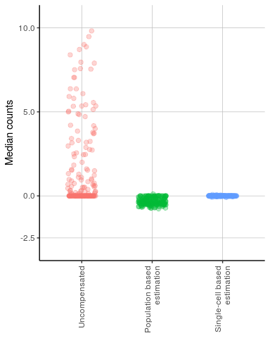
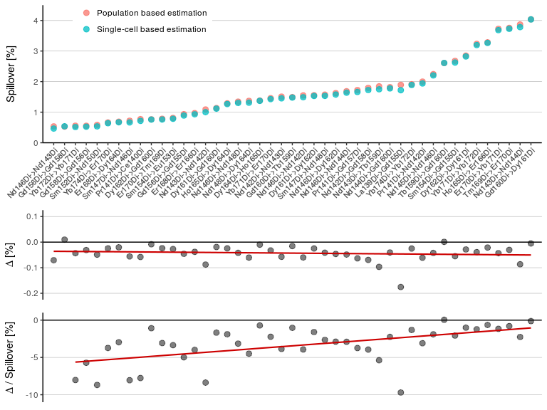
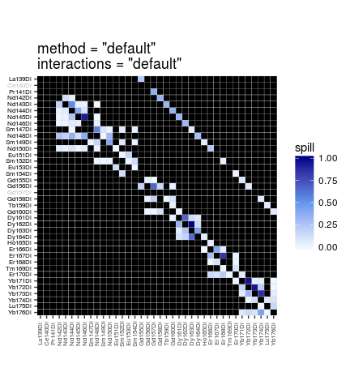
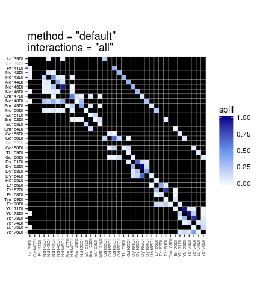
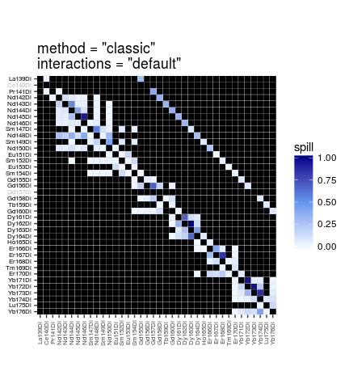
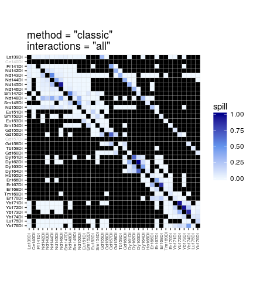

# Comparison of spill estimation methods
Helena L Crowell  

# Aim

This script investigates and compares different methods for spillover estimation and compensation:

* single-cell vs. population based estimation
* consideration of expected vs. all interactions
* classic vs. NNLS compensation


```r
# load required packages
library(CATALYST)
library(flowCore)
library(ggplot2)
library(gridExtra)
library(matrixStats)
library(reshape2)

# source helpers
source('plotting-wrappers.R')
```

### Population vs. single-cell based estimation


```r
# read in single-stained breads 
fcs_path <- '../data/Figure_S3/bead replicates/160805_beads.fcs'
ff <- read.FCS(fcs_path)

# assign preliminary IDs
ss_ms <- c(139, 141:156, 158:176)
res <- assignPrelim(ff, ss_ms, verbose=FALSE)

# apply deconvolution parameters
sep_cutoffs <- read.table('../data/Figure_S3/sep_cutoffs.txt', check.names=FALSE)
cutoffs <- c(.4, sep_cutoffs$`160805`)
res <- applyCutoffs(res, mhl_cutoff=20, cutoffs)

# estimate spillover matrices & compensate
sm_classic <- computeSpillmat(res, method="classic", trim=.01)
sm_default <- computeSpillmat(res, method="default")
sms <- list(sm_classic, sm_default)

comped_classic <- compCytof(ff, sm_classic)
comped_default <- compCytof(ff, sm_default)

# get indices of channels expected to receive spillover
chs <- colnames(ff)
ms <- get_ms(chs)
mets <- get_mets(chs)
spill_cols <- CATALYST:::get_spill_cols(ms, mets)

# helper to get medians
get_meds <- function(ff) {
    unlist(sapply(ss_ms, function(i) {
        inds <- bc_ids(res) == i
        cols <- spill_cols[[which(ms == i)]]
        cols <- cols[ms[cols] %in% 138:176]
        colMedians(as.matrix(exprs(ff[inds, cols])))
    }))
}
meds_uncomped <- get_meds(ff)
meds_comped_classic <- get_meds(comped_classic)
meds_comped_default <- get_meds(comped_default)
df <- data.frame(meds_uncomped, meds_comped_classic, meds_comped_default)
colnames(df) <- c("Uncompensated", 
    "Population based\nestimation", 
    "Single-cell based\nestimation")
df <- melt(df)
plot_method_comparison(df)
```

<!-- -->


```r
# (for convenience, we will use the same set of beads as above)
# get spill values for interactions in range of interest
idx <- which(ms %in% ss_ms)
from <- rep(idx, sapply(spill_cols[idx], length))
to <- unlist(spill_cols[idx])

spill_vals <- 100 * matrix(do.call(cbind, lapply(sms, function(i) 
    CATALYST:::make_symetric(i)[cbind(from, to)])), ncol=length(sms))

# plot only interactions above threshold
fil <- rowMeans(spill_vals) > .5
spill_vals <- spill_vals[fil, ]
# order increasingly
o <- order(rowMeans(spill_vals))
spill_vals <- spill_vals[o, ]
deltas <- apply(spill_vals, 1, diff) 

# get labels for interactions
from <- chs[from[fil][o]]
to <- chs[to[fil][o]]
rownames(spill_vals) <- factor(paste0(from, "->", to))
colnames(spill_vals) <- c("Population based estimation", "Single-cell based estimation")

df1 <- reshape2::melt(spill_vals) 
df2 <- data.frame(x=seq_len(sum(fil)), y=deltas)
df3 <- data.frame(x=seq_len(sum(fil)), y=100*deltas/rowMeans(spill_vals))
plot_classic_vs_default(df1, df2, df3)
```

<!-- -->

### Expected crosstalk interactions

The code snippet below highlights the interactions taken into consideration by the default method for spillover estimation with `computeSpillmat` in `CATALYST`.


```r
# read in examplary single-stains
data(ss_exp)

# for each channel, get indices of channels 
# that are expected to receive spillover
chs <- colnames(ss_exp)
ms <- get_ms(chs)
mets <- get_mets(chs)
spill_cols <- CATALYST:::get_spill_cols(ms, mets)

# initialize empty spillover matrix
sm <- diag(length(ms))
rownames(sm) <- colnames(sm) <- chs

# fill in some value where spillover is expected
ss_ms <- c(139, 141:156, 158:176)
for (m in ss_ms) {
    idx <- which(ms == m)
    sm[idx, spill_cols[[idx]]] <- .5
}

# plot spillover matrix
plotSpillmat(ss_ms, sm, annotate=FALSE)
```

<!--html_preserve--><div id="317550ee0bc5" style="width:720px;height:720px;" class="plotly html-widget"></div>
<script type="application/json" data-for="317550ee0bc5">{"x":{"data":[{"x":[1,2,3,4,5,6,7,8,9,10,11,12,13,14,15,16,17,18,19,20,21,22,23,24,25,26,27,28,29,30,31,32,33,34,35,36,37,38],"y":[1,2,3,4,5,6,7,8,9,10,11,12,13,14,15,16,17,18,19,20,21,22,23,24,25,26,27,28,29,30,31,32,33,34,35,36,37,38],"z":[[0,0,0,0,0,0,0,0,0,0,0,0,0,0,0,0,0,0,0,0,0,0,0,0,0,0,0,0,0,0.5,0,0.5,0.5,0.5,0.5,0.5,0.5,1],[0,0,0,0,0,0,0,0,0,0,0,0,0,0,0,0,0,0,0,0,0,0,0,0,0,0,0,0,0,0,0,0,0,0,0,0.5,1,0.5],[0,0,0,0,0,0,0,0,0,0,0,0,0,0,0,0,0,0,0,0,0,0,0,0,0,0,0,0,0,0.5,0,0.5,0.5,0.5,0.5,1,0.5,0.5],[0,0,0,0,0,0,0,0,0,0,0,0,0,0,0,0,0,0,0,0,0,0,0,0,0,0,0,0,0,0.5,0,0.5,0.5,0.5,1,0.5,0,0.5],[0,0,0,0,0,0,0,0,0,0,0,0,0,0,0,0,0,0,0,0,0,0,0,0,0,0,0,0,0,0.5,0,0.5,0.5,1,0.5,0.5,0,0.5],[0,0,0,0,0,0,0,0,0,0,0,0,0,0,0,0,0,0,0,0,0,0,0,0,0,0,0,0,0,0.5,0,0.5,1,0.5,0.5,0.5,0,0.5],[0,0,0,0,0,0,0,0,0,0,0,0,0,0,0,0,0,0,0,0,0,0,0,0.5,0,0.5,0,0.5,0.5,0.5,0.5,1,0.5,0,0,0,0,0],[0,0,0,0,0,0,0,0,0,0,0,0,0,0,0,0,0,0,0,0,0,0,0,0,0,0,0,0,0,0.5,1,0.5,0,0,0,0,0,0],[0,0,0,0,0,0,0,0,0,0,0,0,0,0,0,0,0,0,0,0,0,0,0,0.5,0,0.5,0,0.5,0.5,1,0.5,0.5,0,0,0,0,0,0],[0,0,0,0,0,0,0,0,0,0,0,0,0,0,0,0,0,0,0,0,0,0,0,0.5,0,0.5,0,0.5,1,0.5,0,0.5,0,0,0,0,0,0],[0,0,0,0,0,0,0,0,0,0,0,0,0,0,0,0,0,0,0,0,0,0,0,0.5,0,0.5,0.5,1,0.5,0.5,0,0.5,0,0,0,0,0,0],[0,0,0,0,0,0,0,0,0,0,0,0,0,0,0,0,0,0,0,0,0,0,0,0,0,0.5,1,0.5,0,0,0,0,0,0,0,0,0,0],[0,0,0,0,0,0,0,0,0,0,0,0,0,0,0,0,0,0.5,0,0.5,0,0.5,0.5,0.5,0.5,1,0.5,0,0,0,0,0,0,0,0,0,0,0],[0,0,0,0,0,0,0,0,0,0,0,0,0,0,0,0,0,0.5,0,0.5,0,0.5,0.5,0.5,1,0.5,0,0,0,0,0,0,0,0,0,0,0,0],[0,0,0,0,0,0,0,0,0,0,0,0,0,0,0,0,0,0.5,0,0.5,0,0.5,0.5,1,0.5,0.5,0,0,0,0,0,0,0,0,0,0,0,0],[0,0,0,0,0,0,0,0,0,0,0,0,0,0,0,0,0,0.5,0,0.5,0,0.5,1,0.5,0.5,0.5,0,0,0,0,0,0,0,0,0,0,0,0],[0,0,0,0,0,0,0,0,0,0,0,0,0,0.5,0,0.5,0.5,0.5,0.5,0.5,0.5,1,0.5,0,0,0,0,0,0,0,0,0,0,0,0,0,0,0.5],[0,0,0,0,0,0,0,0,0,0,0,0,0,0,0,0,0,0,0,0.5,1,0.5,0,0,0,0,0,0,0,0,0,0,0,0,0,0,0.5,0],[0,0,0,0,0,0,0,0,0,0,0,0,0,0.5,0,0.5,0.5,0.5,0.5,1,0.5,0.5,0,0,0,0,0,0,0,0,0,0,0,0,0,0.5,0,0],[0,0,0,0,0,0,0,0,0,0,0,0,0,0,0,0,0,0,1,0,0,0,0,0,0,0,0,0,0,0,0,0,0,0,0,0,0,0],[0,0,0,0,0,0,0,0,0,0,0,0,0,0.5,0,0.5,0.5,1,0.5,0.5,0,0.5,0,0,0,0,0,0,0,0,0,0,0,0.5,0,0,0,0],[0,0,0,0,0,0,0,0,0,0,0,0,0,0.5,0,0.5,1,0.5,0.5,0.5,0,0.5,0,0,0,0,0,0,0,0,0,0,0.5,0,0,0,0,0],[0,0,0,0,0,0.5,0,0,0.5,0.5,0.5,0.5,0,0.5,0.5,1,0.5,0,0,0,0,0,0,0,0,0,0,0,0,0,0,0.5,0,0,0,0,0,0],[0,0,0,0,0,0,0,0,0,0,0,0,0.5,0.5,1,0.5,0,0,0,0,0,0,0,0,0,0,0,0,0,0,0.5,0,0,0,0,0,0,0],[0,0,0,0,0,0.5,0,0,0.5,0.5,0.5,0.5,0.5,1,0.5,0.5,0,0,0,0,0,0,0,0,0,0,0,0,0,0.5,0,0,0,0,0,0,0,0],[0,0,0,0,0,0,0,0,0,0,0,0.5,1,0.5,0.5,0,0,0,0,0,0,0,0,0,0,0,0,0,0.5,0,0,0,0,0,0,0,0,0],[0,0,0,0.5,0.5,0.5,0.5,0.5,0,0.5,0.5,1,0.5,0,0,0,0,0,0,0,0,0,0,0,0,0,0,0.5,0,0,0,0,0,0,0,0,0,0],[0,0,0,0,0,0.5,0,0,0.5,0.5,1,0.5,0,0.5,0,0.5,0,0,0,0,0,0,0,0,0,0,0.5,0,0,0,0,0,0,0,0,0,0,0],[0,0,0,0.5,0.5,0.5,0.5,0.5,0.5,1,0.5,0.5,0,0,0,0,0,0,0,0,0,0,0,0,0,0.5,0,0,0,0,0,0,0,0,0,0,0,0],[0,0,0,0,0,0.5,0,0.5,1,0.5,0.5,0.5,0,0.5,0,0.5,0,0,0,0,0,0,0,0,0.5,0,0,0,0,0,0,0,0,0,0,0,0,0],[0,0,0,0.5,0.5,0.5,0.5,1,0.5,0.5,0,0.5,0,0,0,0,0,0,0,0,0,0,0,0.5,0,0,0,0,0,0,0,0,0,0,0,0,0,0],[0,0,0,0.5,0.5,0.5,1,0.5,0,0.5,0,0.5,0,0,0,0,0,0,0,0,0,0,0.5,0,0,0,0,0,0,0,0,0,0,0,0,0,0,0],[0,0,0,0.5,0.5,1,0.5,0.5,0,0.5,0,0.5,0,0,0,0,0,0,0,0,0,0.5,0,0,0,0,0,0,0,0,0,0,0,0,0,0,0,0],[0,0,0,0.5,1,0.5,0.5,0.5,0,0.5,0,0.5,0,0,0,0,0,0,0,0,0.5,0,0,0,0,0,0,0,0,0,0,0,0,0,0,0,0,0],[0,0,0.5,1,0.5,0.5,0.5,0.5,0,0.5,0,0.5,0,0,0,0,0,0,0,0.5,0,0,0,0,0,0,0,0,0,0,0,0,0,0,0,0,0,0],[0,0.5,1,0.5,0,0,0,0,0,0,0,0,0,0,0,0,0,0,0.5,0,0,0,0,0,0,0,0,0,0,0,0,0,0,0,0,0,0,0],[0,1,0,0,0,0,0,0,0,0,0,0,0,0,0,0,0,0,0,0,0,0,0,0,0,0,0,0,0,0,0,0,0,0,0,0,0,0],[1,0.5,0,0,0,0,0,0,0,0,0,0,0,0,0,0,0.5,0,0,0,0,0,0,0,0,0,0,0,0,0,0,0,0,0,0,0,0,0]],"text":[["Spillover: 0.000%<br />Receiving: La139Di<br />Emitting: Yb176Di","Spillover: 0.000%<br />Receiving: Ce140Di<br />Emitting: Yb176Di","Spillover: 0.000%<br />Receiving: Pr141Di<br />Emitting: Yb176Di","Spillover: 0.000%<br />Receiving: Nd142Di<br />Emitting: Yb176Di","Spillover: 0.000%<br />Receiving: Nd143Di<br />Emitting: Yb176Di","Spillover: 0.000%<br />Receiving: Nd144Di<br />Emitting: Yb176Di","Spillover: 0.000%<br />Receiving: Nd145Di<br />Emitting: Yb176Di","Spillover: 0.000%<br />Receiving: Nd146Di<br />Emitting: Yb176Di","Spillover: 0.000%<br />Receiving: Sm147Di<br />Emitting: Yb176Di","Spillover: 0.000%<br />Receiving: Nd148Di<br />Emitting: Yb176Di","Spillover: 0.000%<br />Receiving: Sm149Di<br />Emitting: Yb176Di","Spillover: 0.000%<br />Receiving: Nd150Di<br />Emitting: Yb176Di","Spillover: 0.000%<br />Receiving: Eu151Di<br />Emitting: Yb176Di","Spillover: 0.000%<br />Receiving: Sm152Di<br />Emitting: Yb176Di","Spillover: 0.000%<br />Receiving: Eu153Di<br />Emitting: Yb176Di","Spillover: 0.000%<br />Receiving: Sm154Di<br />Emitting: Yb176Di","Spillover: 0.000%<br />Receiving: Gd155Di<br />Emitting: Yb176Di","Spillover: 0.000%<br />Receiving: Gd156Di<br />Emitting: Yb176Di","Spillover: 0.000%<br />Receiving: Gd157Di<br />Emitting: Yb176Di","Spillover: 0.000%<br />Receiving: Gd158Di<br />Emitting: Yb176Di","Spillover: 0.000%<br />Receiving: Tb159Di<br />Emitting: Yb176Di","Spillover: 0.000%<br />Receiving: Gd160Di<br />Emitting: Yb176Di","Spillover: 0.000%<br />Receiving: Dy161Di<br />Emitting: Yb176Di","Spillover: 0.000%<br />Receiving: Dy162Di<br />Emitting: Yb176Di","Spillover: 0.000%<br />Receiving: Dy163Di<br />Emitting: Yb176Di","Spillover: 0.000%<br />Receiving: Dy164Di<br />Emitting: Yb176Di","Spillover: 0.000%<br />Receiving: Ho165Di<br />Emitting: Yb176Di","Spillover: 0.000%<br />Receiving: Er166Di<br />Emitting: Yb176Di","Spillover: 0.000%<br />Receiving: Er167Di<br />Emitting: Yb176Di","Spillover: 50.000%<br />Receiving: Er168Di<br />Emitting: Yb176Di","Spillover: 0.000%<br />Receiving: Tm169Di<br />Emitting: Yb176Di","Spillover: 50.000%<br />Receiving: Er170Di<br />Emitting: Yb176Di","Spillover: 50.000%<br />Receiving: Yb171Di<br />Emitting: Yb176Di","Spillover: 50.000%<br />Receiving: Yb172Di<br />Emitting: Yb176Di","Spillover: 50.000%<br />Receiving: Yb173Di<br />Emitting: Yb176Di","Spillover: 50.000%<br />Receiving: Yb174Di<br />Emitting: Yb176Di","Spillover: 50.000%<br />Receiving: Lu175Di<br />Emitting: Yb176Di","Spillover: 100.000%<br />Receiving: Yb176Di<br />Emitting: Yb176Di"],["Spillover: 0.000%<br />Receiving: La139Di<br />Emitting: Lu175Di","Spillover: 0.000%<br />Receiving: Ce140Di<br />Emitting: Lu175Di","Spillover: 0.000%<br />Receiving: Pr141Di<br />Emitting: Lu175Di","Spillover: 0.000%<br />Receiving: Nd142Di<br />Emitting: Lu175Di","Spillover: 0.000%<br />Receiving: Nd143Di<br />Emitting: Lu175Di","Spillover: 0.000%<br />Receiving: Nd144Di<br />Emitting: Lu175Di","Spillover: 0.000%<br />Receiving: Nd145Di<br />Emitting: Lu175Di","Spillover: 0.000%<br />Receiving: Nd146Di<br />Emitting: Lu175Di","Spillover: 0.000%<br />Receiving: Sm147Di<br />Emitting: Lu175Di","Spillover: 0.000%<br />Receiving: Nd148Di<br />Emitting: Lu175Di","Spillover: 0.000%<br />Receiving: Sm149Di<br />Emitting: Lu175Di","Spillover: 0.000%<br />Receiving: Nd150Di<br />Emitting: Lu175Di","Spillover: 0.000%<br />Receiving: Eu151Di<br />Emitting: Lu175Di","Spillover: 0.000%<br />Receiving: Sm152Di<br />Emitting: Lu175Di","Spillover: 0.000%<br />Receiving: Eu153Di<br />Emitting: Lu175Di","Spillover: 0.000%<br />Receiving: Sm154Di<br />Emitting: Lu175Di","Spillover: 0.000%<br />Receiving: Gd155Di<br />Emitting: Lu175Di","Spillover: 0.000%<br />Receiving: Gd156Di<br />Emitting: Lu175Di","Spillover: 0.000%<br />Receiving: Gd157Di<br />Emitting: Lu175Di","Spillover: 0.000%<br />Receiving: Gd158Di<br />Emitting: Lu175Di","Spillover: 0.000%<br />Receiving: Tb159Di<br />Emitting: Lu175Di","Spillover: 0.000%<br />Receiving: Gd160Di<br />Emitting: Lu175Di","Spillover: 0.000%<br />Receiving: Dy161Di<br />Emitting: Lu175Di","Spillover: 0.000%<br />Receiving: Dy162Di<br />Emitting: Lu175Di","Spillover: 0.000%<br />Receiving: Dy163Di<br />Emitting: Lu175Di","Spillover: 0.000%<br />Receiving: Dy164Di<br />Emitting: Lu175Di","Spillover: 0.000%<br />Receiving: Ho165Di<br />Emitting: Lu175Di","Spillover: 0.000%<br />Receiving: Er166Di<br />Emitting: Lu175Di","Spillover: 0.000%<br />Receiving: Er167Di<br />Emitting: Lu175Di","Spillover: 0.000%<br />Receiving: Er168Di<br />Emitting: Lu175Di","Spillover: 0.000%<br />Receiving: Tm169Di<br />Emitting: Lu175Di","Spillover: 0.000%<br />Receiving: Er170Di<br />Emitting: Lu175Di","Spillover: 0.000%<br />Receiving: Yb171Di<br />Emitting: Lu175Di","Spillover: 0.000%<br />Receiving: Yb172Di<br />Emitting: Lu175Di","Spillover: 0.000%<br />Receiving: Yb173Di<br />Emitting: Lu175Di","Spillover: 50.000%<br />Receiving: Yb174Di<br />Emitting: Lu175Di","Spillover: 100.000%<br />Receiving: Lu175Di<br />Emitting: Lu175Di","Spillover: 50.000%<br />Receiving: Yb176Di<br />Emitting: Lu175Di"],["Spillover: 0.000%<br />Receiving: La139Di<br />Emitting: Yb174Di","Spillover: 0.000%<br />Receiving: Ce140Di<br />Emitting: Yb174Di","Spillover: 0.000%<br />Receiving: Pr141Di<br />Emitting: Yb174Di","Spillover: 0.000%<br />Receiving: Nd142Di<br />Emitting: Yb174Di","Spillover: 0.000%<br />Receiving: Nd143Di<br />Emitting: Yb174Di","Spillover: 0.000%<br />Receiving: Nd144Di<br />Emitting: Yb174Di","Spillover: 0.000%<br />Receiving: Nd145Di<br />Emitting: Yb174Di","Spillover: 0.000%<br />Receiving: Nd146Di<br />Emitting: Yb174Di","Spillover: 0.000%<br />Receiving: Sm147Di<br />Emitting: Yb174Di","Spillover: 0.000%<br />Receiving: Nd148Di<br />Emitting: Yb174Di","Spillover: 0.000%<br />Receiving: Sm149Di<br />Emitting: Yb174Di","Spillover: 0.000%<br />Receiving: Nd150Di<br />Emitting: Yb174Di","Spillover: 0.000%<br />Receiving: Eu151Di<br />Emitting: Yb174Di","Spillover: 0.000%<br />Receiving: Sm152Di<br />Emitting: Yb174Di","Spillover: 0.000%<br />Receiving: Eu153Di<br />Emitting: Yb174Di","Spillover: 0.000%<br />Receiving: Sm154Di<br />Emitting: Yb174Di","Spillover: 0.000%<br />Receiving: Gd155Di<br />Emitting: Yb174Di","Spillover: 0.000%<br />Receiving: Gd156Di<br />Emitting: Yb174Di","Spillover: 0.000%<br />Receiving: Gd157Di<br />Emitting: Yb174Di","Spillover: 0.000%<br />Receiving: Gd158Di<br />Emitting: Yb174Di","Spillover: 0.000%<br />Receiving: Tb159Di<br />Emitting: Yb174Di","Spillover: 0.000%<br />Receiving: Gd160Di<br />Emitting: Yb174Di","Spillover: 0.000%<br />Receiving: Dy161Di<br />Emitting: Yb174Di","Spillover: 0.000%<br />Receiving: Dy162Di<br />Emitting: Yb174Di","Spillover: 0.000%<br />Receiving: Dy163Di<br />Emitting: Yb174Di","Spillover: 0.000%<br />Receiving: Dy164Di<br />Emitting: Yb174Di","Spillover: 0.000%<br />Receiving: Ho165Di<br />Emitting: Yb174Di","Spillover: 0.000%<br />Receiving: Er166Di<br />Emitting: Yb174Di","Spillover: 0.000%<br />Receiving: Er167Di<br />Emitting: Yb174Di","Spillover: 50.000%<br />Receiving: Er168Di<br />Emitting: Yb174Di","Spillover: 0.000%<br />Receiving: Tm169Di<br />Emitting: Yb174Di","Spillover: 50.000%<br />Receiving: Er170Di<br />Emitting: Yb174Di","Spillover: 50.000%<br />Receiving: Yb171Di<br />Emitting: Yb174Di","Spillover: 50.000%<br />Receiving: Yb172Di<br />Emitting: Yb174Di","Spillover: 50.000%<br />Receiving: Yb173Di<br />Emitting: Yb174Di","Spillover: 100.000%<br />Receiving: Yb174Di<br />Emitting: Yb174Di","Spillover: 50.000%<br />Receiving: Lu175Di<br />Emitting: Yb174Di","Spillover: 50.000%<br />Receiving: Yb176Di<br />Emitting: Yb174Di"],["Spillover: 0.000%<br />Receiving: La139Di<br />Emitting: Yb173Di","Spillover: 0.000%<br />Receiving: Ce140Di<br />Emitting: Yb173Di","Spillover: 0.000%<br />Receiving: Pr141Di<br />Emitting: Yb173Di","Spillover: 0.000%<br />Receiving: Nd142Di<br />Emitting: Yb173Di","Spillover: 0.000%<br />Receiving: Nd143Di<br />Emitting: Yb173Di","Spillover: 0.000%<br />Receiving: Nd144Di<br />Emitting: Yb173Di","Spillover: 0.000%<br />Receiving: Nd145Di<br />Emitting: Yb173Di","Spillover: 0.000%<br />Receiving: Nd146Di<br />Emitting: Yb173Di","Spillover: 0.000%<br />Receiving: Sm147Di<br />Emitting: Yb173Di","Spillover: 0.000%<br />Receiving: Nd148Di<br />Emitting: Yb173Di","Spillover: 0.000%<br />Receiving: Sm149Di<br />Emitting: Yb173Di","Spillover: 0.000%<br />Receiving: Nd150Di<br />Emitting: Yb173Di","Spillover: 0.000%<br />Receiving: Eu151Di<br />Emitting: Yb173Di","Spillover: 0.000%<br />Receiving: Sm152Di<br />Emitting: Yb173Di","Spillover: 0.000%<br />Receiving: Eu153Di<br />Emitting: Yb173Di","Spillover: 0.000%<br />Receiving: Sm154Di<br />Emitting: Yb173Di","Spillover: 0.000%<br />Receiving: Gd155Di<br />Emitting: Yb173Di","Spillover: 0.000%<br />Receiving: Gd156Di<br />Emitting: Yb173Di","Spillover: 0.000%<br />Receiving: Gd157Di<br />Emitting: Yb173Di","Spillover: 0.000%<br />Receiving: Gd158Di<br />Emitting: Yb173Di","Spillover: 0.000%<br />Receiving: Tb159Di<br />Emitting: Yb173Di","Spillover: 0.000%<br />Receiving: Gd160Di<br />Emitting: Yb173Di","Spillover: 0.000%<br />Receiving: Dy161Di<br />Emitting: Yb173Di","Spillover: 0.000%<br />Receiving: Dy162Di<br />Emitting: Yb173Di","Spillover: 0.000%<br />Receiving: Dy163Di<br />Emitting: Yb173Di","Spillover: 0.000%<br />Receiving: Dy164Di<br />Emitting: Yb173Di","Spillover: 0.000%<br />Receiving: Ho165Di<br />Emitting: Yb173Di","Spillover: 0.000%<br />Receiving: Er166Di<br />Emitting: Yb173Di","Spillover: 0.000%<br />Receiving: Er167Di<br />Emitting: Yb173Di","Spillover: 50.000%<br />Receiving: Er168Di<br />Emitting: Yb173Di","Spillover: 0.000%<br />Receiving: Tm169Di<br />Emitting: Yb173Di","Spillover: 50.000%<br />Receiving: Er170Di<br />Emitting: Yb173Di","Spillover: 50.000%<br />Receiving: Yb171Di<br />Emitting: Yb173Di","Spillover: 50.000%<br />Receiving: Yb172Di<br />Emitting: Yb173Di","Spillover: 100.000%<br />Receiving: Yb173Di<br />Emitting: Yb173Di","Spillover: 50.000%<br />Receiving: Yb174Di<br />Emitting: Yb173Di","Spillover: 0.000%<br />Receiving: Lu175Di<br />Emitting: Yb173Di","Spillover: 50.000%<br />Receiving: Yb176Di<br />Emitting: Yb173Di"],["Spillover: 0.000%<br />Receiving: La139Di<br />Emitting: Yb172Di","Spillover: 0.000%<br />Receiving: Ce140Di<br />Emitting: Yb172Di","Spillover: 0.000%<br />Receiving: Pr141Di<br />Emitting: Yb172Di","Spillover: 0.000%<br />Receiving: Nd142Di<br />Emitting: Yb172Di","Spillover: 0.000%<br />Receiving: Nd143Di<br />Emitting: Yb172Di","Spillover: 0.000%<br />Receiving: Nd144Di<br />Emitting: Yb172Di","Spillover: 0.000%<br />Receiving: Nd145Di<br />Emitting: Yb172Di","Spillover: 0.000%<br />Receiving: Nd146Di<br />Emitting: Yb172Di","Spillover: 0.000%<br />Receiving: Sm147Di<br />Emitting: Yb172Di","Spillover: 0.000%<br />Receiving: Nd148Di<br />Emitting: Yb172Di","Spillover: 0.000%<br />Receiving: Sm149Di<br />Emitting: Yb172Di","Spillover: 0.000%<br />Receiving: Nd150Di<br />Emitting: Yb172Di","Spillover: 0.000%<br />Receiving: Eu151Di<br />Emitting: Yb172Di","Spillover: 0.000%<br />Receiving: Sm152Di<br />Emitting: Yb172Di","Spillover: 0.000%<br />Receiving: Eu153Di<br />Emitting: Yb172Di","Spillover: 0.000%<br />Receiving: Sm154Di<br />Emitting: Yb172Di","Spillover: 0.000%<br />Receiving: Gd155Di<br />Emitting: Yb172Di","Spillover: 0.000%<br />Receiving: Gd156Di<br />Emitting: Yb172Di","Spillover: 0.000%<br />Receiving: Gd157Di<br />Emitting: Yb172Di","Spillover: 0.000%<br />Receiving: Gd158Di<br />Emitting: Yb172Di","Spillover: 0.000%<br />Receiving: Tb159Di<br />Emitting: Yb172Di","Spillover: 0.000%<br />Receiving: Gd160Di<br />Emitting: Yb172Di","Spillover: 0.000%<br />Receiving: Dy161Di<br />Emitting: Yb172Di","Spillover: 0.000%<br />Receiving: Dy162Di<br />Emitting: Yb172Di","Spillover: 0.000%<br />Receiving: Dy163Di<br />Emitting: Yb172Di","Spillover: 0.000%<br />Receiving: Dy164Di<br />Emitting: Yb172Di","Spillover: 0.000%<br />Receiving: Ho165Di<br />Emitting: Yb172Di","Spillover: 0.000%<br />Receiving: Er166Di<br />Emitting: Yb172Di","Spillover: 0.000%<br />Receiving: Er167Di<br />Emitting: Yb172Di","Spillover: 50.000%<br />Receiving: Er168Di<br />Emitting: Yb172Di","Spillover: 0.000%<br />Receiving: Tm169Di<br />Emitting: Yb172Di","Spillover: 50.000%<br />Receiving: Er170Di<br />Emitting: Yb172Di","Spillover: 50.000%<br />Receiving: Yb171Di<br />Emitting: Yb172Di","Spillover: 100.000%<br />Receiving: Yb172Di<br />Emitting: Yb172Di","Spillover: 50.000%<br />Receiving: Yb173Di<br />Emitting: Yb172Di","Spillover: 50.000%<br />Receiving: Yb174Di<br />Emitting: Yb172Di","Spillover: 0.000%<br />Receiving: Lu175Di<br />Emitting: Yb172Di","Spillover: 50.000%<br />Receiving: Yb176Di<br />Emitting: Yb172Di"],["Spillover: 0.000%<br />Receiving: La139Di<br />Emitting: Yb171Di","Spillover: 0.000%<br />Receiving: Ce140Di<br />Emitting: Yb171Di","Spillover: 0.000%<br />Receiving: Pr141Di<br />Emitting: Yb171Di","Spillover: 0.000%<br />Receiving: Nd142Di<br />Emitting: Yb171Di","Spillover: 0.000%<br />Receiving: Nd143Di<br />Emitting: Yb171Di","Spillover: 0.000%<br />Receiving: Nd144Di<br />Emitting: Yb171Di","Spillover: 0.000%<br />Receiving: Nd145Di<br />Emitting: Yb171Di","Spillover: 0.000%<br />Receiving: Nd146Di<br />Emitting: Yb171Di","Spillover: 0.000%<br />Receiving: Sm147Di<br />Emitting: Yb171Di","Spillover: 0.000%<br />Receiving: Nd148Di<br />Emitting: Yb171Di","Spillover: 0.000%<br />Receiving: Sm149Di<br />Emitting: Yb171Di","Spillover: 0.000%<br />Receiving: Nd150Di<br />Emitting: Yb171Di","Spillover: 0.000%<br />Receiving: Eu151Di<br />Emitting: Yb171Di","Spillover: 0.000%<br />Receiving: Sm152Di<br />Emitting: Yb171Di","Spillover: 0.000%<br />Receiving: Eu153Di<br />Emitting: Yb171Di","Spillover: 0.000%<br />Receiving: Sm154Di<br />Emitting: Yb171Di","Spillover: 0.000%<br />Receiving: Gd155Di<br />Emitting: Yb171Di","Spillover: 0.000%<br />Receiving: Gd156Di<br />Emitting: Yb171Di","Spillover: 0.000%<br />Receiving: Gd157Di<br />Emitting: Yb171Di","Spillover: 0.000%<br />Receiving: Gd158Di<br />Emitting: Yb171Di","Spillover: 0.000%<br />Receiving: Tb159Di<br />Emitting: Yb171Di","Spillover: 0.000%<br />Receiving: Gd160Di<br />Emitting: Yb171Di","Spillover: 0.000%<br />Receiving: Dy161Di<br />Emitting: Yb171Di","Spillover: 0.000%<br />Receiving: Dy162Di<br />Emitting: Yb171Di","Spillover: 0.000%<br />Receiving: Dy163Di<br />Emitting: Yb171Di","Spillover: 0.000%<br />Receiving: Dy164Di<br />Emitting: Yb171Di","Spillover: 0.000%<br />Receiving: Ho165Di<br />Emitting: Yb171Di","Spillover: 0.000%<br />Receiving: Er166Di<br />Emitting: Yb171Di","Spillover: 0.000%<br />Receiving: Er167Di<br />Emitting: Yb171Di","Spillover: 50.000%<br />Receiving: Er168Di<br />Emitting: Yb171Di","Spillover: 0.000%<br />Receiving: Tm169Di<br />Emitting: Yb171Di","Spillover: 50.000%<br />Receiving: Er170Di<br />Emitting: Yb171Di","Spillover: 100.000%<br />Receiving: Yb171Di<br />Emitting: Yb171Di","Spillover: 50.000%<br />Receiving: Yb172Di<br />Emitting: Yb171Di","Spillover: 50.000%<br />Receiving: Yb173Di<br />Emitting: Yb171Di","Spillover: 50.000%<br />Receiving: Yb174Di<br />Emitting: Yb171Di","Spillover: 0.000%<br />Receiving: Lu175Di<br />Emitting: Yb171Di","Spillover: 50.000%<br />Receiving: Yb176Di<br />Emitting: Yb171Di"],["Spillover: 0.000%<br />Receiving: La139Di<br />Emitting: Er170Di","Spillover: 0.000%<br />Receiving: Ce140Di<br />Emitting: Er170Di","Spillover: 0.000%<br />Receiving: Pr141Di<br />Emitting: Er170Di","Spillover: 0.000%<br />Receiving: Nd142Di<br />Emitting: Er170Di","Spillover: 0.000%<br />Receiving: Nd143Di<br />Emitting: Er170Di","Spillover: 0.000%<br />Receiving: Nd144Di<br />Emitting: Er170Di","Spillover: 0.000%<br />Receiving: Nd145Di<br />Emitting: Er170Di","Spillover: 0.000%<br />Receiving: Nd146Di<br />Emitting: Er170Di","Spillover: 0.000%<br />Receiving: Sm147Di<br />Emitting: Er170Di","Spillover: 0.000%<br />Receiving: Nd148Di<br />Emitting: Er170Di","Spillover: 0.000%<br />Receiving: Sm149Di<br />Emitting: Er170Di","Spillover: 0.000%<br />Receiving: Nd150Di<br />Emitting: Er170Di","Spillover: 0.000%<br />Receiving: Eu151Di<br />Emitting: Er170Di","Spillover: 0.000%<br />Receiving: Sm152Di<br />Emitting: Er170Di","Spillover: 0.000%<br />Receiving: Eu153Di<br />Emitting: Er170Di","Spillover: 0.000%<br />Receiving: Sm154Di<br />Emitting: Er170Di","Spillover: 0.000%<br />Receiving: Gd155Di<br />Emitting: Er170Di","Spillover: 0.000%<br />Receiving: Gd156Di<br />Emitting: Er170Di","Spillover: 0.000%<br />Receiving: Gd157Di<br />Emitting: Er170Di","Spillover: 0.000%<br />Receiving: Gd158Di<br />Emitting: Er170Di","Spillover: 0.000%<br />Receiving: Tb159Di<br />Emitting: Er170Di","Spillover: 0.000%<br />Receiving: Gd160Di<br />Emitting: Er170Di","Spillover: 0.000%<br />Receiving: Dy161Di<br />Emitting: Er170Di","Spillover: 50.000%<br />Receiving: Dy162Di<br />Emitting: Er170Di","Spillover: 0.000%<br />Receiving: Dy163Di<br />Emitting: Er170Di","Spillover: 50.000%<br />Receiving: Dy164Di<br />Emitting: Er170Di","Spillover: 0.000%<br />Receiving: Ho165Di<br />Emitting: Er170Di","Spillover: 50.000%<br />Receiving: Er166Di<br />Emitting: Er170Di","Spillover: 50.000%<br />Receiving: Er167Di<br />Emitting: Er170Di","Spillover: 50.000%<br />Receiving: Er168Di<br />Emitting: Er170Di","Spillover: 50.000%<br />Receiving: Tm169Di<br />Emitting: Er170Di","Spillover: 100.000%<br />Receiving: Er170Di<br />Emitting: Er170Di","Spillover: 50.000%<br />Receiving: Yb171Di<br />Emitting: Er170Di","Spillover: 0.000%<br />Receiving: Yb172Di<br />Emitting: Er170Di","Spillover: 0.000%<br />Receiving: Yb173Di<br />Emitting: Er170Di","Spillover: 0.000%<br />Receiving: Yb174Di<br />Emitting: Er170Di","Spillover: 0.000%<br />Receiving: Lu175Di<br />Emitting: Er170Di","Spillover: 0.000%<br />Receiving: Yb176Di<br />Emitting: Er170Di"],["Spillover: 0.000%<br />Receiving: La139Di<br />Emitting: Tm169Di","Spillover: 0.000%<br />Receiving: Ce140Di<br />Emitting: Tm169Di","Spillover: 0.000%<br />Receiving: Pr141Di<br />Emitting: Tm169Di","Spillover: 0.000%<br />Receiving: Nd142Di<br />Emitting: Tm169Di","Spillover: 0.000%<br />Receiving: Nd143Di<br />Emitting: Tm169Di","Spillover: 0.000%<br />Receiving: Nd144Di<br />Emitting: Tm169Di","Spillover: 0.000%<br />Receiving: Nd145Di<br />Emitting: Tm169Di","Spillover: 0.000%<br />Receiving: Nd146Di<br />Emitting: Tm169Di","Spillover: 0.000%<br />Receiving: Sm147Di<br />Emitting: Tm169Di","Spillover: 0.000%<br />Receiving: Nd148Di<br />Emitting: Tm169Di","Spillover: 0.000%<br />Receiving: Sm149Di<br />Emitting: Tm169Di","Spillover: 0.000%<br />Receiving: Nd150Di<br />Emitting: Tm169Di","Spillover: 0.000%<br />Receiving: Eu151Di<br />Emitting: Tm169Di","Spillover: 0.000%<br />Receiving: Sm152Di<br />Emitting: Tm169Di","Spillover: 0.000%<br />Receiving: Eu153Di<br />Emitting: Tm169Di","Spillover: 0.000%<br />Receiving: Sm154Di<br />Emitting: Tm169Di","Spillover: 0.000%<br />Receiving: Gd155Di<br />Emitting: Tm169Di","Spillover: 0.000%<br />Receiving: Gd156Di<br />Emitting: Tm169Di","Spillover: 0.000%<br />Receiving: Gd157Di<br />Emitting: Tm169Di","Spillover: 0.000%<br />Receiving: Gd158Di<br />Emitting: Tm169Di","Spillover: 0.000%<br />Receiving: Tb159Di<br />Emitting: Tm169Di","Spillover: 0.000%<br />Receiving: Gd160Di<br />Emitting: Tm169Di","Spillover: 0.000%<br />Receiving: Dy161Di<br />Emitting: Tm169Di","Spillover: 0.000%<br />Receiving: Dy162Di<br />Emitting: Tm169Di","Spillover: 0.000%<br />Receiving: Dy163Di<br />Emitting: Tm169Di","Spillover: 0.000%<br />Receiving: Dy164Di<br />Emitting: Tm169Di","Spillover: 0.000%<br />Receiving: Ho165Di<br />Emitting: Tm169Di","Spillover: 0.000%<br />Receiving: Er166Di<br />Emitting: Tm169Di","Spillover: 0.000%<br />Receiving: Er167Di<br />Emitting: Tm169Di","Spillover: 50.000%<br />Receiving: Er168Di<br />Emitting: Tm169Di","Spillover: 100.000%<br />Receiving: Tm169Di<br />Emitting: Tm169Di","Spillover: 50.000%<br />Receiving: Er170Di<br />Emitting: Tm169Di","Spillover: 0.000%<br />Receiving: Yb171Di<br />Emitting: Tm169Di","Spillover: 0.000%<br />Receiving: Yb172Di<br />Emitting: Tm169Di","Spillover: 0.000%<br />Receiving: Yb173Di<br />Emitting: Tm169Di","Spillover: 0.000%<br />Receiving: Yb174Di<br />Emitting: Tm169Di","Spillover: 0.000%<br />Receiving: Lu175Di<br />Emitting: Tm169Di","Spillover: 0.000%<br />Receiving: Yb176Di<br />Emitting: Tm169Di"],["Spillover: 0.000%<br />Receiving: La139Di<br />Emitting: Er168Di","Spillover: 0.000%<br />Receiving: Ce140Di<br />Emitting: Er168Di","Spillover: 0.000%<br />Receiving: Pr141Di<br />Emitting: Er168Di","Spillover: 0.000%<br />Receiving: Nd142Di<br />Emitting: Er168Di","Spillover: 0.000%<br />Receiving: Nd143Di<br />Emitting: Er168Di","Spillover: 0.000%<br />Receiving: Nd144Di<br />Emitting: Er168Di","Spillover: 0.000%<br />Receiving: Nd145Di<br />Emitting: Er168Di","Spillover: 0.000%<br />Receiving: Nd146Di<br />Emitting: Er168Di","Spillover: 0.000%<br />Receiving: Sm147Di<br />Emitting: Er168Di","Spillover: 0.000%<br />Receiving: Nd148Di<br />Emitting: Er168Di","Spillover: 0.000%<br />Receiving: Sm149Di<br />Emitting: Er168Di","Spillover: 0.000%<br />Receiving: Nd150Di<br />Emitting: Er168Di","Spillover: 0.000%<br />Receiving: Eu151Di<br />Emitting: Er168Di","Spillover: 0.000%<br />Receiving: Sm152Di<br />Emitting: Er168Di","Spillover: 0.000%<br />Receiving: Eu153Di<br />Emitting: Er168Di","Spillover: 0.000%<br />Receiving: Sm154Di<br />Emitting: Er168Di","Spillover: 0.000%<br />Receiving: Gd155Di<br />Emitting: Er168Di","Spillover: 0.000%<br />Receiving: Gd156Di<br />Emitting: Er168Di","Spillover: 0.000%<br />Receiving: Gd157Di<br />Emitting: Er168Di","Spillover: 0.000%<br />Receiving: Gd158Di<br />Emitting: Er168Di","Spillover: 0.000%<br />Receiving: Tb159Di<br />Emitting: Er168Di","Spillover: 0.000%<br />Receiving: Gd160Di<br />Emitting: Er168Di","Spillover: 0.000%<br />Receiving: Dy161Di<br />Emitting: Er168Di","Spillover: 50.000%<br />Receiving: Dy162Di<br />Emitting: Er168Di","Spillover: 0.000%<br />Receiving: Dy163Di<br />Emitting: Er168Di","Spillover: 50.000%<br />Receiving: Dy164Di<br />Emitting: Er168Di","Spillover: 0.000%<br />Receiving: Ho165Di<br />Emitting: Er168Di","Spillover: 50.000%<br />Receiving: Er166Di<br />Emitting: Er168Di","Spillover: 50.000%<br />Receiving: Er167Di<br />Emitting: Er168Di","Spillover: 100.000%<br />Receiving: Er168Di<br />Emitting: Er168Di","Spillover: 50.000%<br />Receiving: Tm169Di<br />Emitting: Er168Di","Spillover: 50.000%<br />Receiving: Er170Di<br />Emitting: Er168Di","Spillover: 0.000%<br />Receiving: Yb171Di<br />Emitting: Er168Di","Spillover: 0.000%<br />Receiving: Yb172Di<br />Emitting: Er168Di","Spillover: 0.000%<br />Receiving: Yb173Di<br />Emitting: Er168Di","Spillover: 0.000%<br />Receiving: Yb174Di<br />Emitting: Er168Di","Spillover: 0.000%<br />Receiving: Lu175Di<br />Emitting: Er168Di","Spillover: 0.000%<br />Receiving: Yb176Di<br />Emitting: Er168Di"],["Spillover: 0.000%<br />Receiving: La139Di<br />Emitting: Er167Di","Spillover: 0.000%<br />Receiving: Ce140Di<br />Emitting: Er167Di","Spillover: 0.000%<br />Receiving: Pr141Di<br />Emitting: Er167Di","Spillover: 0.000%<br />Receiving: Nd142Di<br />Emitting: Er167Di","Spillover: 0.000%<br />Receiving: Nd143Di<br />Emitting: Er167Di","Spillover: 0.000%<br />Receiving: Nd144Di<br />Emitting: Er167Di","Spillover: 0.000%<br />Receiving: Nd145Di<br />Emitting: Er167Di","Spillover: 0.000%<br />Receiving: Nd146Di<br />Emitting: Er167Di","Spillover: 0.000%<br />Receiving: Sm147Di<br />Emitting: Er167Di","Spillover: 0.000%<br />Receiving: Nd148Di<br />Emitting: Er167Di","Spillover: 0.000%<br />Receiving: Sm149Di<br />Emitting: Er167Di","Spillover: 0.000%<br />Receiving: Nd150Di<br />Emitting: Er167Di","Spillover: 0.000%<br />Receiving: Eu151Di<br />Emitting: Er167Di","Spillover: 0.000%<br />Receiving: Sm152Di<br />Emitting: Er167Di","Spillover: 0.000%<br />Receiving: Eu153Di<br />Emitting: Er167Di","Spillover: 0.000%<br />Receiving: Sm154Di<br />Emitting: Er167Di","Spillover: 0.000%<br />Receiving: Gd155Di<br />Emitting: Er167Di","Spillover: 0.000%<br />Receiving: Gd156Di<br />Emitting: Er167Di","Spillover: 0.000%<br />Receiving: Gd157Di<br />Emitting: Er167Di","Spillover: 0.000%<br />Receiving: Gd158Di<br />Emitting: Er167Di","Spillover: 0.000%<br />Receiving: Tb159Di<br />Emitting: Er167Di","Spillover: 0.000%<br />Receiving: Gd160Di<br />Emitting: Er167Di","Spillover: 0.000%<br />Receiving: Dy161Di<br />Emitting: Er167Di","Spillover: 50.000%<br />Receiving: Dy162Di<br />Emitting: Er167Di","Spillover: 0.000%<br />Receiving: Dy163Di<br />Emitting: Er167Di","Spillover: 50.000%<br />Receiving: Dy164Di<br />Emitting: Er167Di","Spillover: 0.000%<br />Receiving: Ho165Di<br />Emitting: Er167Di","Spillover: 50.000%<br />Receiving: Er166Di<br />Emitting: Er167Di","Spillover: 100.000%<br />Receiving: Er167Di<br />Emitting: Er167Di","Spillover: 50.000%<br />Receiving: Er168Di<br />Emitting: Er167Di","Spillover: 0.000%<br />Receiving: Tm169Di<br />Emitting: Er167Di","Spillover: 50.000%<br />Receiving: Er170Di<br />Emitting: Er167Di","Spillover: 0.000%<br />Receiving: Yb171Di<br />Emitting: Er167Di","Spillover: 0.000%<br />Receiving: Yb172Di<br />Emitting: Er167Di","Spillover: 0.000%<br />Receiving: Yb173Di<br />Emitting: Er167Di","Spillover: 0.000%<br />Receiving: Yb174Di<br />Emitting: Er167Di","Spillover: 0.000%<br />Receiving: Lu175Di<br />Emitting: Er167Di","Spillover: 0.000%<br />Receiving: Yb176Di<br />Emitting: Er167Di"],["Spillover: 0.000%<br />Receiving: La139Di<br />Emitting: Er166Di","Spillover: 0.000%<br />Receiving: Ce140Di<br />Emitting: Er166Di","Spillover: 0.000%<br />Receiving: Pr141Di<br />Emitting: Er166Di","Spillover: 0.000%<br />Receiving: Nd142Di<br />Emitting: Er166Di","Spillover: 0.000%<br />Receiving: Nd143Di<br />Emitting: Er166Di","Spillover: 0.000%<br />Receiving: Nd144Di<br />Emitting: Er166Di","Spillover: 0.000%<br />Receiving: Nd145Di<br />Emitting: Er166Di","Spillover: 0.000%<br />Receiving: Nd146Di<br />Emitting: Er166Di","Spillover: 0.000%<br />Receiving: Sm147Di<br />Emitting: Er166Di","Spillover: 0.000%<br />Receiving: Nd148Di<br />Emitting: Er166Di","Spillover: 0.000%<br />Receiving: Sm149Di<br />Emitting: Er166Di","Spillover: 0.000%<br />Receiving: Nd150Di<br />Emitting: Er166Di","Spillover: 0.000%<br />Receiving: Eu151Di<br />Emitting: Er166Di","Spillover: 0.000%<br />Receiving: Sm152Di<br />Emitting: Er166Di","Spillover: 0.000%<br />Receiving: Eu153Di<br />Emitting: Er166Di","Spillover: 0.000%<br />Receiving: Sm154Di<br />Emitting: Er166Di","Spillover: 0.000%<br />Receiving: Gd155Di<br />Emitting: Er166Di","Spillover: 0.000%<br />Receiving: Gd156Di<br />Emitting: Er166Di","Spillover: 0.000%<br />Receiving: Gd157Di<br />Emitting: Er166Di","Spillover: 0.000%<br />Receiving: Gd158Di<br />Emitting: Er166Di","Spillover: 0.000%<br />Receiving: Tb159Di<br />Emitting: Er166Di","Spillover: 0.000%<br />Receiving: Gd160Di<br />Emitting: Er166Di","Spillover: 0.000%<br />Receiving: Dy161Di<br />Emitting: Er166Di","Spillover: 50.000%<br />Receiving: Dy162Di<br />Emitting: Er166Di","Spillover: 0.000%<br />Receiving: Dy163Di<br />Emitting: Er166Di","Spillover: 50.000%<br />Receiving: Dy164Di<br />Emitting: Er166Di","Spillover: 50.000%<br />Receiving: Ho165Di<br />Emitting: Er166Di","Spillover: 100.000%<br />Receiving: Er166Di<br />Emitting: Er166Di","Spillover: 50.000%<br />Receiving: Er167Di<br />Emitting: Er166Di","Spillover: 50.000%<br />Receiving: Er168Di<br />Emitting: Er166Di","Spillover: 0.000%<br />Receiving: Tm169Di<br />Emitting: Er166Di","Spillover: 50.000%<br />Receiving: Er170Di<br />Emitting: Er166Di","Spillover: 0.000%<br />Receiving: Yb171Di<br />Emitting: Er166Di","Spillover: 0.000%<br />Receiving: Yb172Di<br />Emitting: Er166Di","Spillover: 0.000%<br />Receiving: Yb173Di<br />Emitting: Er166Di","Spillover: 0.000%<br />Receiving: Yb174Di<br />Emitting: Er166Di","Spillover: 0.000%<br />Receiving: Lu175Di<br />Emitting: Er166Di","Spillover: 0.000%<br />Receiving: Yb176Di<br />Emitting: Er166Di"],["Spillover: 0.000%<br />Receiving: La139Di<br />Emitting: Ho165Di","Spillover: 0.000%<br />Receiving: Ce140Di<br />Emitting: Ho165Di","Spillover: 0.000%<br />Receiving: Pr141Di<br />Emitting: Ho165Di","Spillover: 0.000%<br />Receiving: Nd142Di<br />Emitting: Ho165Di","Spillover: 0.000%<br />Receiving: Nd143Di<br />Emitting: Ho165Di","Spillover: 0.000%<br />Receiving: Nd144Di<br />Emitting: Ho165Di","Spillover: 0.000%<br />Receiving: Nd145Di<br />Emitting: Ho165Di","Spillover: 0.000%<br />Receiving: Nd146Di<br />Emitting: Ho165Di","Spillover: 0.000%<br />Receiving: Sm147Di<br />Emitting: Ho165Di","Spillover: 0.000%<br />Receiving: Nd148Di<br />Emitting: Ho165Di","Spillover: 0.000%<br />Receiving: Sm149Di<br />Emitting: Ho165Di","Spillover: 0.000%<br />Receiving: Nd150Di<br />Emitting: Ho165Di","Spillover: 0.000%<br />Receiving: Eu151Di<br />Emitting: Ho165Di","Spillover: 0.000%<br />Receiving: Sm152Di<br />Emitting: Ho165Di","Spillover: 0.000%<br />Receiving: Eu153Di<br />Emitting: Ho165Di","Spillover: 0.000%<br />Receiving: Sm154Di<br />Emitting: Ho165Di","Spillover: 0.000%<br />Receiving: Gd155Di<br />Emitting: Ho165Di","Spillover: 0.000%<br />Receiving: Gd156Di<br />Emitting: Ho165Di","Spillover: 0.000%<br />Receiving: Gd157Di<br />Emitting: Ho165Di","Spillover: 0.000%<br />Receiving: Gd158Di<br />Emitting: Ho165Di","Spillover: 0.000%<br />Receiving: Tb159Di<br />Emitting: Ho165Di","Spillover: 0.000%<br />Receiving: Gd160Di<br />Emitting: Ho165Di","Spillover: 0.000%<br />Receiving: Dy161Di<br />Emitting: Ho165Di","Spillover: 0.000%<br />Receiving: Dy162Di<br />Emitting: Ho165Di","Spillover: 0.000%<br />Receiving: Dy163Di<br />Emitting: Ho165Di","Spillover: 50.000%<br />Receiving: Dy164Di<br />Emitting: Ho165Di","Spillover: 100.000%<br />Receiving: Ho165Di<br />Emitting: Ho165Di","Spillover: 50.000%<br />Receiving: Er166Di<br />Emitting: Ho165Di","Spillover: 0.000%<br />Receiving: Er167Di<br />Emitting: Ho165Di","Spillover: 0.000%<br />Receiving: Er168Di<br />Emitting: Ho165Di","Spillover: 0.000%<br />Receiving: Tm169Di<br />Emitting: Ho165Di","Spillover: 0.000%<br />Receiving: Er170Di<br />Emitting: Ho165Di","Spillover: 0.000%<br />Receiving: Yb171Di<br />Emitting: Ho165Di","Spillover: 0.000%<br />Receiving: Yb172Di<br />Emitting: Ho165Di","Spillover: 0.000%<br />Receiving: Yb173Di<br />Emitting: Ho165Di","Spillover: 0.000%<br />Receiving: Yb174Di<br />Emitting: Ho165Di","Spillover: 0.000%<br />Receiving: Lu175Di<br />Emitting: Ho165Di","Spillover: 0.000%<br />Receiving: Yb176Di<br />Emitting: Ho165Di"],["Spillover: 0.000%<br />Receiving: La139Di<br />Emitting: Dy164Di","Spillover: 0.000%<br />Receiving: Ce140Di<br />Emitting: Dy164Di","Spillover: 0.000%<br />Receiving: Pr141Di<br />Emitting: Dy164Di","Spillover: 0.000%<br />Receiving: Nd142Di<br />Emitting: Dy164Di","Spillover: 0.000%<br />Receiving: Nd143Di<br />Emitting: Dy164Di","Spillover: 0.000%<br />Receiving: Nd144Di<br />Emitting: Dy164Di","Spillover: 0.000%<br />Receiving: Nd145Di<br />Emitting: Dy164Di","Spillover: 0.000%<br />Receiving: Nd146Di<br />Emitting: Dy164Di","Spillover: 0.000%<br />Receiving: Sm147Di<br />Emitting: Dy164Di","Spillover: 0.000%<br />Receiving: Nd148Di<br />Emitting: Dy164Di","Spillover: 0.000%<br />Receiving: Sm149Di<br />Emitting: Dy164Di","Spillover: 0.000%<br />Receiving: Nd150Di<br />Emitting: Dy164Di","Spillover: 0.000%<br />Receiving: Eu151Di<br />Emitting: Dy164Di","Spillover: 0.000%<br />Receiving: Sm152Di<br />Emitting: Dy164Di","Spillover: 0.000%<br />Receiving: Eu153Di<br />Emitting: Dy164Di","Spillover: 0.000%<br />Receiving: Sm154Di<br />Emitting: Dy164Di","Spillover: 0.000%<br />Receiving: Gd155Di<br />Emitting: Dy164Di","Spillover: 50.000%<br />Receiving: Gd156Di<br />Emitting: Dy164Di","Spillover: 0.000%<br />Receiving: Gd157Di<br />Emitting: Dy164Di","Spillover: 50.000%<br />Receiving: Gd158Di<br />Emitting: Dy164Di","Spillover: 0.000%<br />Receiving: Tb159Di<br />Emitting: Dy164Di","Spillover: 50.000%<br />Receiving: Gd160Di<br />Emitting: Dy164Di","Spillover: 50.000%<br />Receiving: Dy161Di<br />Emitting: Dy164Di","Spillover: 50.000%<br />Receiving: Dy162Di<br />Emitting: Dy164Di","Spillover: 50.000%<br />Receiving: Dy163Di<br />Emitting: Dy164Di","Spillover: 100.000%<br />Receiving: Dy164Di<br />Emitting: Dy164Di","Spillover: 50.000%<br />Receiving: Ho165Di<br />Emitting: Dy164Di","Spillover: 0.000%<br />Receiving: Er166Di<br />Emitting: Dy164Di","Spillover: 0.000%<br />Receiving: Er167Di<br />Emitting: Dy164Di","Spillover: 0.000%<br />Receiving: Er168Di<br />Emitting: Dy164Di","Spillover: 0.000%<br />Receiving: Tm169Di<br />Emitting: Dy164Di","Spillover: 0.000%<br />Receiving: Er170Di<br />Emitting: Dy164Di","Spillover: 0.000%<br />Receiving: Yb171Di<br />Emitting: Dy164Di","Spillover: 0.000%<br />Receiving: Yb172Di<br />Emitting: Dy164Di","Spillover: 0.000%<br />Receiving: Yb173Di<br />Emitting: Dy164Di","Spillover: 0.000%<br />Receiving: Yb174Di<br />Emitting: Dy164Di","Spillover: 0.000%<br />Receiving: Lu175Di<br />Emitting: Dy164Di","Spillover: 0.000%<br />Receiving: Yb176Di<br />Emitting: Dy164Di"],["Spillover: 0.000%<br />Receiving: La139Di<br />Emitting: Dy163Di","Spillover: 0.000%<br />Receiving: Ce140Di<br />Emitting: Dy163Di","Spillover: 0.000%<br />Receiving: Pr141Di<br />Emitting: Dy163Di","Spillover: 0.000%<br />Receiving: Nd142Di<br />Emitting: Dy163Di","Spillover: 0.000%<br />Receiving: Nd143Di<br />Emitting: Dy163Di","Spillover: 0.000%<br />Receiving: Nd144Di<br />Emitting: Dy163Di","Spillover: 0.000%<br />Receiving: Nd145Di<br />Emitting: Dy163Di","Spillover: 0.000%<br />Receiving: Nd146Di<br />Emitting: Dy163Di","Spillover: 0.000%<br />Receiving: Sm147Di<br />Emitting: Dy163Di","Spillover: 0.000%<br />Receiving: Nd148Di<br />Emitting: Dy163Di","Spillover: 0.000%<br />Receiving: Sm149Di<br />Emitting: Dy163Di","Spillover: 0.000%<br />Receiving: Nd150Di<br />Emitting: Dy163Di","Spillover: 0.000%<br />Receiving: Eu151Di<br />Emitting: Dy163Di","Spillover: 0.000%<br />Receiving: Sm152Di<br />Emitting: Dy163Di","Spillover: 0.000%<br />Receiving: Eu153Di<br />Emitting: Dy163Di","Spillover: 0.000%<br />Receiving: Sm154Di<br />Emitting: Dy163Di","Spillover: 0.000%<br />Receiving: Gd155Di<br />Emitting: Dy163Di","Spillover: 50.000%<br />Receiving: Gd156Di<br />Emitting: Dy163Di","Spillover: 0.000%<br />Receiving: Gd157Di<br />Emitting: Dy163Di","Spillover: 50.000%<br />Receiving: Gd158Di<br />Emitting: Dy163Di","Spillover: 0.000%<br />Receiving: Tb159Di<br />Emitting: Dy163Di","Spillover: 50.000%<br />Receiving: Gd160Di<br />Emitting: Dy163Di","Spillover: 50.000%<br />Receiving: Dy161Di<br />Emitting: Dy163Di","Spillover: 50.000%<br />Receiving: Dy162Di<br />Emitting: Dy163Di","Spillover: 100.000%<br />Receiving: Dy163Di<br />Emitting: Dy163Di","Spillover: 50.000%<br />Receiving: Dy164Di<br />Emitting: Dy163Di","Spillover: 0.000%<br />Receiving: Ho165Di<br />Emitting: Dy163Di","Spillover: 0.000%<br />Receiving: Er166Di<br />Emitting: Dy163Di","Spillover: 0.000%<br />Receiving: Er167Di<br />Emitting: Dy163Di","Spillover: 0.000%<br />Receiving: Er168Di<br />Emitting: Dy163Di","Spillover: 0.000%<br />Receiving: Tm169Di<br />Emitting: Dy163Di","Spillover: 0.000%<br />Receiving: Er170Di<br />Emitting: Dy163Di","Spillover: 0.000%<br />Receiving: Yb171Di<br />Emitting: Dy163Di","Spillover: 0.000%<br />Receiving: Yb172Di<br />Emitting: Dy163Di","Spillover: 0.000%<br />Receiving: Yb173Di<br />Emitting: Dy163Di","Spillover: 0.000%<br />Receiving: Yb174Di<br />Emitting: Dy163Di","Spillover: 0.000%<br />Receiving: Lu175Di<br />Emitting: Dy163Di","Spillover: 0.000%<br />Receiving: Yb176Di<br />Emitting: Dy163Di"],["Spillover: 0.000%<br />Receiving: La139Di<br />Emitting: Dy162Di","Spillover: 0.000%<br />Receiving: Ce140Di<br />Emitting: Dy162Di","Spillover: 0.000%<br />Receiving: Pr141Di<br />Emitting: Dy162Di","Spillover: 0.000%<br />Receiving: Nd142Di<br />Emitting: Dy162Di","Spillover: 0.000%<br />Receiving: Nd143Di<br />Emitting: Dy162Di","Spillover: 0.000%<br />Receiving: Nd144Di<br />Emitting: Dy162Di","Spillover: 0.000%<br />Receiving: Nd145Di<br />Emitting: Dy162Di","Spillover: 0.000%<br />Receiving: Nd146Di<br />Emitting: Dy162Di","Spillover: 0.000%<br />Receiving: Sm147Di<br />Emitting: Dy162Di","Spillover: 0.000%<br />Receiving: Nd148Di<br />Emitting: Dy162Di","Spillover: 0.000%<br />Receiving: Sm149Di<br />Emitting: Dy162Di","Spillover: 0.000%<br />Receiving: Nd150Di<br />Emitting: Dy162Di","Spillover: 0.000%<br />Receiving: Eu151Di<br />Emitting: Dy162Di","Spillover: 0.000%<br />Receiving: Sm152Di<br />Emitting: Dy162Di","Spillover: 0.000%<br />Receiving: Eu153Di<br />Emitting: Dy162Di","Spillover: 0.000%<br />Receiving: Sm154Di<br />Emitting: Dy162Di","Spillover: 0.000%<br />Receiving: Gd155Di<br />Emitting: Dy162Di","Spillover: 50.000%<br />Receiving: Gd156Di<br />Emitting: Dy162Di","Spillover: 0.000%<br />Receiving: Gd157Di<br />Emitting: Dy162Di","Spillover: 50.000%<br />Receiving: Gd158Di<br />Emitting: Dy162Di","Spillover: 0.000%<br />Receiving: Tb159Di<br />Emitting: Dy162Di","Spillover: 50.000%<br />Receiving: Gd160Di<br />Emitting: Dy162Di","Spillover: 50.000%<br />Receiving: Dy161Di<br />Emitting: Dy162Di","Spillover: 100.000%<br />Receiving: Dy162Di<br />Emitting: Dy162Di","Spillover: 50.000%<br />Receiving: Dy163Di<br />Emitting: Dy162Di","Spillover: 50.000%<br />Receiving: Dy164Di<br />Emitting: Dy162Di","Spillover: 0.000%<br />Receiving: Ho165Di<br />Emitting: Dy162Di","Spillover: 0.000%<br />Receiving: Er166Di<br />Emitting: Dy162Di","Spillover: 0.000%<br />Receiving: Er167Di<br />Emitting: Dy162Di","Spillover: 0.000%<br />Receiving: Er168Di<br />Emitting: Dy162Di","Spillover: 0.000%<br />Receiving: Tm169Di<br />Emitting: Dy162Di","Spillover: 0.000%<br />Receiving: Er170Di<br />Emitting: Dy162Di","Spillover: 0.000%<br />Receiving: Yb171Di<br />Emitting: Dy162Di","Spillover: 0.000%<br />Receiving: Yb172Di<br />Emitting: Dy162Di","Spillover: 0.000%<br />Receiving: Yb173Di<br />Emitting: Dy162Di","Spillover: 0.000%<br />Receiving: Yb174Di<br />Emitting: Dy162Di","Spillover: 0.000%<br />Receiving: Lu175Di<br />Emitting: Dy162Di","Spillover: 0.000%<br />Receiving: Yb176Di<br />Emitting: Dy162Di"],["Spillover: 0.000%<br />Receiving: La139Di<br />Emitting: Dy161Di","Spillover: 0.000%<br />Receiving: Ce140Di<br />Emitting: Dy161Di","Spillover: 0.000%<br />Receiving: Pr141Di<br />Emitting: Dy161Di","Spillover: 0.000%<br />Receiving: Nd142Di<br />Emitting: Dy161Di","Spillover: 0.000%<br />Receiving: Nd143Di<br />Emitting: Dy161Di","Spillover: 0.000%<br />Receiving: Nd144Di<br />Emitting: Dy161Di","Spillover: 0.000%<br />Receiving: Nd145Di<br />Emitting: Dy161Di","Spillover: 0.000%<br />Receiving: Nd146Di<br />Emitting: Dy161Di","Spillover: 0.000%<br />Receiving: Sm147Di<br />Emitting: Dy161Di","Spillover: 0.000%<br />Receiving: Nd148Di<br />Emitting: Dy161Di","Spillover: 0.000%<br />Receiving: Sm149Di<br />Emitting: Dy161Di","Spillover: 0.000%<br />Receiving: Nd150Di<br />Emitting: Dy161Di","Spillover: 0.000%<br />Receiving: Eu151Di<br />Emitting: Dy161Di","Spillover: 0.000%<br />Receiving: Sm152Di<br />Emitting: Dy161Di","Spillover: 0.000%<br />Receiving: Eu153Di<br />Emitting: Dy161Di","Spillover: 0.000%<br />Receiving: Sm154Di<br />Emitting: Dy161Di","Spillover: 0.000%<br />Receiving: Gd155Di<br />Emitting: Dy161Di","Spillover: 50.000%<br />Receiving: Gd156Di<br />Emitting: Dy161Di","Spillover: 0.000%<br />Receiving: Gd157Di<br />Emitting: Dy161Di","Spillover: 50.000%<br />Receiving: Gd158Di<br />Emitting: Dy161Di","Spillover: 0.000%<br />Receiving: Tb159Di<br />Emitting: Dy161Di","Spillover: 50.000%<br />Receiving: Gd160Di<br />Emitting: Dy161Di","Spillover: 100.000%<br />Receiving: Dy161Di<br />Emitting: Dy161Di","Spillover: 50.000%<br />Receiving: Dy162Di<br />Emitting: Dy161Di","Spillover: 50.000%<br />Receiving: Dy163Di<br />Emitting: Dy161Di","Spillover: 50.000%<br />Receiving: Dy164Di<br />Emitting: Dy161Di","Spillover: 0.000%<br />Receiving: Ho165Di<br />Emitting: Dy161Di","Spillover: 0.000%<br />Receiving: Er166Di<br />Emitting: Dy161Di","Spillover: 0.000%<br />Receiving: Er167Di<br />Emitting: Dy161Di","Spillover: 0.000%<br />Receiving: Er168Di<br />Emitting: Dy161Di","Spillover: 0.000%<br />Receiving: Tm169Di<br />Emitting: Dy161Di","Spillover: 0.000%<br />Receiving: Er170Di<br />Emitting: Dy161Di","Spillover: 0.000%<br />Receiving: Yb171Di<br />Emitting: Dy161Di","Spillover: 0.000%<br />Receiving: Yb172Di<br />Emitting: Dy161Di","Spillover: 0.000%<br />Receiving: Yb173Di<br />Emitting: Dy161Di","Spillover: 0.000%<br />Receiving: Yb174Di<br />Emitting: Dy161Di","Spillover: 0.000%<br />Receiving: Lu175Di<br />Emitting: Dy161Di","Spillover: 0.000%<br />Receiving: Yb176Di<br />Emitting: Dy161Di"],["Spillover: 0.000%<br />Receiving: La139Di<br />Emitting: Gd160Di","Spillover: 0.000%<br />Receiving: Ce140Di<br />Emitting: Gd160Di","Spillover: 0.000%<br />Receiving: Pr141Di<br />Emitting: Gd160Di","Spillover: 0.000%<br />Receiving: Nd142Di<br />Emitting: Gd160Di","Spillover: 0.000%<br />Receiving: Nd143Di<br />Emitting: Gd160Di","Spillover: 0.000%<br />Receiving: Nd144Di<br />Emitting: Gd160Di","Spillover: 0.000%<br />Receiving: Nd145Di<br />Emitting: Gd160Di","Spillover: 0.000%<br />Receiving: Nd146Di<br />Emitting: Gd160Di","Spillover: 0.000%<br />Receiving: Sm147Di<br />Emitting: Gd160Di","Spillover: 0.000%<br />Receiving: Nd148Di<br />Emitting: Gd160Di","Spillover: 0.000%<br />Receiving: Sm149Di<br />Emitting: Gd160Di","Spillover: 0.000%<br />Receiving: Nd150Di<br />Emitting: Gd160Di","Spillover: 0.000%<br />Receiving: Eu151Di<br />Emitting: Gd160Di","Spillover: 50.000%<br />Receiving: Sm152Di<br />Emitting: Gd160Di","Spillover: 0.000%<br />Receiving: Eu153Di<br />Emitting: Gd160Di","Spillover: 50.000%<br />Receiving: Sm154Di<br />Emitting: Gd160Di","Spillover: 50.000%<br />Receiving: Gd155Di<br />Emitting: Gd160Di","Spillover: 50.000%<br />Receiving: Gd156Di<br />Emitting: Gd160Di","Spillover: 50.000%<br />Receiving: Gd157Di<br />Emitting: Gd160Di","Spillover: 50.000%<br />Receiving: Gd158Di<br />Emitting: Gd160Di","Spillover: 50.000%<br />Receiving: Tb159Di<br />Emitting: Gd160Di","Spillover: 100.000%<br />Receiving: Gd160Di<br />Emitting: Gd160Di","Spillover: 50.000%<br />Receiving: Dy161Di<br />Emitting: Gd160Di","Spillover: 0.000%<br />Receiving: Dy162Di<br />Emitting: Gd160Di","Spillover: 0.000%<br />Receiving: Dy163Di<br />Emitting: Gd160Di","Spillover: 0.000%<br />Receiving: Dy164Di<br />Emitting: Gd160Di","Spillover: 0.000%<br />Receiving: Ho165Di<br />Emitting: Gd160Di","Spillover: 0.000%<br />Receiving: Er166Di<br />Emitting: Gd160Di","Spillover: 0.000%<br />Receiving: Er167Di<br />Emitting: Gd160Di","Spillover: 0.000%<br />Receiving: Er168Di<br />Emitting: Gd160Di","Spillover: 0.000%<br />Receiving: Tm169Di<br />Emitting: Gd160Di","Spillover: 0.000%<br />Receiving: Er170Di<br />Emitting: Gd160Di","Spillover: 0.000%<br />Receiving: Yb171Di<br />Emitting: Gd160Di","Spillover: 0.000%<br />Receiving: Yb172Di<br />Emitting: Gd160Di","Spillover: 0.000%<br />Receiving: Yb173Di<br />Emitting: Gd160Di","Spillover: 0.000%<br />Receiving: Yb174Di<br />Emitting: Gd160Di","Spillover: 0.000%<br />Receiving: Lu175Di<br />Emitting: Gd160Di","Spillover: 50.000%<br />Receiving: Yb176Di<br />Emitting: Gd160Di"],["Spillover: 0.000%<br />Receiving: La139Di<br />Emitting: Tb159Di","Spillover: 0.000%<br />Receiving: Ce140Di<br />Emitting: Tb159Di","Spillover: 0.000%<br />Receiving: Pr141Di<br />Emitting: Tb159Di","Spillover: 0.000%<br />Receiving: Nd142Di<br />Emitting: Tb159Di","Spillover: 0.000%<br />Receiving: Nd143Di<br />Emitting: Tb159Di","Spillover: 0.000%<br />Receiving: Nd144Di<br />Emitting: Tb159Di","Spillover: 0.000%<br />Receiving: Nd145Di<br />Emitting: Tb159Di","Spillover: 0.000%<br />Receiving: Nd146Di<br />Emitting: Tb159Di","Spillover: 0.000%<br />Receiving: Sm147Di<br />Emitting: Tb159Di","Spillover: 0.000%<br />Receiving: Nd148Di<br />Emitting: Tb159Di","Spillover: 0.000%<br />Receiving: Sm149Di<br />Emitting: Tb159Di","Spillover: 0.000%<br />Receiving: Nd150Di<br />Emitting: Tb159Di","Spillover: 0.000%<br />Receiving: Eu151Di<br />Emitting: Tb159Di","Spillover: 0.000%<br />Receiving: Sm152Di<br />Emitting: Tb159Di","Spillover: 0.000%<br />Receiving: Eu153Di<br />Emitting: Tb159Di","Spillover: 0.000%<br />Receiving: Sm154Di<br />Emitting: Tb159Di","Spillover: 0.000%<br />Receiving: Gd155Di<br />Emitting: Tb159Di","Spillover: 0.000%<br />Receiving: Gd156Di<br />Emitting: Tb159Di","Spillover: 0.000%<br />Receiving: Gd157Di<br />Emitting: Tb159Di","Spillover: 50.000%<br />Receiving: Gd158Di<br />Emitting: Tb159Di","Spillover: 100.000%<br />Receiving: Tb159Di<br />Emitting: Tb159Di","Spillover: 50.000%<br />Receiving: Gd160Di<br />Emitting: Tb159Di","Spillover: 0.000%<br />Receiving: Dy161Di<br />Emitting: Tb159Di","Spillover: 0.000%<br />Receiving: Dy162Di<br />Emitting: Tb159Di","Spillover: 0.000%<br />Receiving: Dy163Di<br />Emitting: Tb159Di","Spillover: 0.000%<br />Receiving: Dy164Di<br />Emitting: Tb159Di","Spillover: 0.000%<br />Receiving: Ho165Di<br />Emitting: Tb159Di","Spillover: 0.000%<br />Receiving: Er166Di<br />Emitting: Tb159Di","Spillover: 0.000%<br />Receiving: Er167Di<br />Emitting: Tb159Di","Spillover: 0.000%<br />Receiving: Er168Di<br />Emitting: Tb159Di","Spillover: 0.000%<br />Receiving: Tm169Di<br />Emitting: Tb159Di","Spillover: 0.000%<br />Receiving: Er170Di<br />Emitting: Tb159Di","Spillover: 0.000%<br />Receiving: Yb171Di<br />Emitting: Tb159Di","Spillover: 0.000%<br />Receiving: Yb172Di<br />Emitting: Tb159Di","Spillover: 0.000%<br />Receiving: Yb173Di<br />Emitting: Tb159Di","Spillover: 0.000%<br />Receiving: Yb174Di<br />Emitting: Tb159Di","Spillover: 50.000%<br />Receiving: Lu175Di<br />Emitting: Tb159Di","Spillover: 0.000%<br />Receiving: Yb176Di<br />Emitting: Tb159Di"],["Spillover: 0.000%<br />Receiving: La139Di<br />Emitting: Gd158Di","Spillover: 0.000%<br />Receiving: Ce140Di<br />Emitting: Gd158Di","Spillover: 0.000%<br />Receiving: Pr141Di<br />Emitting: Gd158Di","Spillover: 0.000%<br />Receiving: Nd142Di<br />Emitting: Gd158Di","Spillover: 0.000%<br />Receiving: Nd143Di<br />Emitting: Gd158Di","Spillover: 0.000%<br />Receiving: Nd144Di<br />Emitting: Gd158Di","Spillover: 0.000%<br />Receiving: Nd145Di<br />Emitting: Gd158Di","Spillover: 0.000%<br />Receiving: Nd146Di<br />Emitting: Gd158Di","Spillover: 0.000%<br />Receiving: Sm147Di<br />Emitting: Gd158Di","Spillover: 0.000%<br />Receiving: Nd148Di<br />Emitting: Gd158Di","Spillover: 0.000%<br />Receiving: Sm149Di<br />Emitting: Gd158Di","Spillover: 0.000%<br />Receiving: Nd150Di<br />Emitting: Gd158Di","Spillover: 0.000%<br />Receiving: Eu151Di<br />Emitting: Gd158Di","Spillover: 50.000%<br />Receiving: Sm152Di<br />Emitting: Gd158Di","Spillover: 0.000%<br />Receiving: Eu153Di<br />Emitting: Gd158Di","Spillover: 50.000%<br />Receiving: Sm154Di<br />Emitting: Gd158Di","Spillover: 50.000%<br />Receiving: Gd155Di<br />Emitting: Gd158Di","Spillover: 50.000%<br />Receiving: Gd156Di<br />Emitting: Gd158Di","Spillover: 50.000%<br />Receiving: Gd157Di<br />Emitting: Gd158Di","Spillover: 100.000%<br />Receiving: Gd158Di<br />Emitting: Gd158Di","Spillover: 50.000%<br />Receiving: Tb159Di<br />Emitting: Gd158Di","Spillover: 50.000%<br />Receiving: Gd160Di<br />Emitting: Gd158Di","Spillover: 0.000%<br />Receiving: Dy161Di<br />Emitting: Gd158Di","Spillover: 0.000%<br />Receiving: Dy162Di<br />Emitting: Gd158Di","Spillover: 0.000%<br />Receiving: Dy163Di<br />Emitting: Gd158Di","Spillover: 0.000%<br />Receiving: Dy164Di<br />Emitting: Gd158Di","Spillover: 0.000%<br />Receiving: Ho165Di<br />Emitting: Gd158Di","Spillover: 0.000%<br />Receiving: Er166Di<br />Emitting: Gd158Di","Spillover: 0.000%<br />Receiving: Er167Di<br />Emitting: Gd158Di","Spillover: 0.000%<br />Receiving: Er168Di<br />Emitting: Gd158Di","Spillover: 0.000%<br />Receiving: Tm169Di<br />Emitting: Gd158Di","Spillover: 0.000%<br />Receiving: Er170Di<br />Emitting: Gd158Di","Spillover: 0.000%<br />Receiving: Yb171Di<br />Emitting: Gd158Di","Spillover: 0.000%<br />Receiving: Yb172Di<br />Emitting: Gd158Di","Spillover: 0.000%<br />Receiving: Yb173Di<br />Emitting: Gd158Di","Spillover: 50.000%<br />Receiving: Yb174Di<br />Emitting: Gd158Di","Spillover: 0.000%<br />Receiving: Lu175Di<br />Emitting: Gd158Di","Spillover: 0.000%<br />Receiving: Yb176Di<br />Emitting: Gd158Di"],["Spillover: 0.000%<br />Receiving: La139Di<br />Emitting: Gd157Di","Spillover: 0.000%<br />Receiving: Ce140Di<br />Emitting: Gd157Di","Spillover: 0.000%<br />Receiving: Pr141Di<br />Emitting: Gd157Di","Spillover: 0.000%<br />Receiving: Nd142Di<br />Emitting: Gd157Di","Spillover: 0.000%<br />Receiving: Nd143Di<br />Emitting: Gd157Di","Spillover: 0.000%<br />Receiving: Nd144Di<br />Emitting: Gd157Di","Spillover: 0.000%<br />Receiving: Nd145Di<br />Emitting: Gd157Di","Spillover: 0.000%<br />Receiving: Nd146Di<br />Emitting: Gd157Di","Spillover: 0.000%<br />Receiving: Sm147Di<br />Emitting: Gd157Di","Spillover: 0.000%<br />Receiving: Nd148Di<br />Emitting: Gd157Di","Spillover: 0.000%<br />Receiving: Sm149Di<br />Emitting: Gd157Di","Spillover: 0.000%<br />Receiving: Nd150Di<br />Emitting: Gd157Di","Spillover: 0.000%<br />Receiving: Eu151Di<br />Emitting: Gd157Di","Spillover: 0.000%<br />Receiving: Sm152Di<br />Emitting: Gd157Di","Spillover: 0.000%<br />Receiving: Eu153Di<br />Emitting: Gd157Di","Spillover: 0.000%<br />Receiving: Sm154Di<br />Emitting: Gd157Di","Spillover: 0.000%<br />Receiving: Gd155Di<br />Emitting: Gd157Di","Spillover: 0.000%<br />Receiving: Gd156Di<br />Emitting: Gd157Di","Spillover: 100.000%<br />Receiving: Gd157Di<br />Emitting: Gd157Di","Spillover: 0.000%<br />Receiving: Gd158Di<br />Emitting: Gd157Di","Spillover: 0.000%<br />Receiving: Tb159Di<br />Emitting: Gd157Di","Spillover: 0.000%<br />Receiving: Gd160Di<br />Emitting: Gd157Di","Spillover: 0.000%<br />Receiving: Dy161Di<br />Emitting: Gd157Di","Spillover: 0.000%<br />Receiving: Dy162Di<br />Emitting: Gd157Di","Spillover: 0.000%<br />Receiving: Dy163Di<br />Emitting: Gd157Di","Spillover: 0.000%<br />Receiving: Dy164Di<br />Emitting: Gd157Di","Spillover: 0.000%<br />Receiving: Ho165Di<br />Emitting: Gd157Di","Spillover: 0.000%<br />Receiving: Er166Di<br />Emitting: Gd157Di","Spillover: 0.000%<br />Receiving: Er167Di<br />Emitting: Gd157Di","Spillover: 0.000%<br />Receiving: Er168Di<br />Emitting: Gd157Di","Spillover: 0.000%<br />Receiving: Tm169Di<br />Emitting: Gd157Di","Spillover: 0.000%<br />Receiving: Er170Di<br />Emitting: Gd157Di","Spillover: 0.000%<br />Receiving: Yb171Di<br />Emitting: Gd157Di","Spillover: 0.000%<br />Receiving: Yb172Di<br />Emitting: Gd157Di","Spillover: 0.000%<br />Receiving: Yb173Di<br />Emitting: Gd157Di","Spillover: 0.000%<br />Receiving: Yb174Di<br />Emitting: Gd157Di","Spillover: 0.000%<br />Receiving: Lu175Di<br />Emitting: Gd157Di","Spillover: 0.000%<br />Receiving: Yb176Di<br />Emitting: Gd157Di"],["Spillover: 0.000%<br />Receiving: La139Di<br />Emitting: Gd156Di","Spillover: 0.000%<br />Receiving: Ce140Di<br />Emitting: Gd156Di","Spillover: 0.000%<br />Receiving: Pr141Di<br />Emitting: Gd156Di","Spillover: 0.000%<br />Receiving: Nd142Di<br />Emitting: Gd156Di","Spillover: 0.000%<br />Receiving: Nd143Di<br />Emitting: Gd156Di","Spillover: 0.000%<br />Receiving: Nd144Di<br />Emitting: Gd156Di","Spillover: 0.000%<br />Receiving: Nd145Di<br />Emitting: Gd156Di","Spillover: 0.000%<br />Receiving: Nd146Di<br />Emitting: Gd156Di","Spillover: 0.000%<br />Receiving: Sm147Di<br />Emitting: Gd156Di","Spillover: 0.000%<br />Receiving: Nd148Di<br />Emitting: Gd156Di","Spillover: 0.000%<br />Receiving: Sm149Di<br />Emitting: Gd156Di","Spillover: 0.000%<br />Receiving: Nd150Di<br />Emitting: Gd156Di","Spillover: 0.000%<br />Receiving: Eu151Di<br />Emitting: Gd156Di","Spillover: 50.000%<br />Receiving: Sm152Di<br />Emitting: Gd156Di","Spillover: 0.000%<br />Receiving: Eu153Di<br />Emitting: Gd156Di","Spillover: 50.000%<br />Receiving: Sm154Di<br />Emitting: Gd156Di","Spillover: 50.000%<br />Receiving: Gd155Di<br />Emitting: Gd156Di","Spillover: 100.000%<br />Receiving: Gd156Di<br />Emitting: Gd156Di","Spillover: 50.000%<br />Receiving: Gd157Di<br />Emitting: Gd156Di","Spillover: 50.000%<br />Receiving: Gd158Di<br />Emitting: Gd156Di","Spillover: 0.000%<br />Receiving: Tb159Di<br />Emitting: Gd156Di","Spillover: 50.000%<br />Receiving: Gd160Di<br />Emitting: Gd156Di","Spillover: 0.000%<br />Receiving: Dy161Di<br />Emitting: Gd156Di","Spillover: 0.000%<br />Receiving: Dy162Di<br />Emitting: Gd156Di","Spillover: 0.000%<br />Receiving: Dy163Di<br />Emitting: Gd156Di","Spillover: 0.000%<br />Receiving: Dy164Di<br />Emitting: Gd156Di","Spillover: 0.000%<br />Receiving: Ho165Di<br />Emitting: Gd156Di","Spillover: 0.000%<br />Receiving: Er166Di<br />Emitting: Gd156Di","Spillover: 0.000%<br />Receiving: Er167Di<br />Emitting: Gd156Di","Spillover: 0.000%<br />Receiving: Er168Di<br />Emitting: Gd156Di","Spillover: 0.000%<br />Receiving: Tm169Di<br />Emitting: Gd156Di","Spillover: 0.000%<br />Receiving: Er170Di<br />Emitting: Gd156Di","Spillover: 0.000%<br />Receiving: Yb171Di<br />Emitting: Gd156Di","Spillover: 50.000%<br />Receiving: Yb172Di<br />Emitting: Gd156Di","Spillover: 0.000%<br />Receiving: Yb173Di<br />Emitting: Gd156Di","Spillover: 0.000%<br />Receiving: Yb174Di<br />Emitting: Gd156Di","Spillover: 0.000%<br />Receiving: Lu175Di<br />Emitting: Gd156Di","Spillover: 0.000%<br />Receiving: Yb176Di<br />Emitting: Gd156Di"],["Spillover: 0.000%<br />Receiving: La139Di<br />Emitting: Gd155Di","Spillover: 0.000%<br />Receiving: Ce140Di<br />Emitting: Gd155Di","Spillover: 0.000%<br />Receiving: Pr141Di<br />Emitting: Gd155Di","Spillover: 0.000%<br />Receiving: Nd142Di<br />Emitting: Gd155Di","Spillover: 0.000%<br />Receiving: Nd143Di<br />Emitting: Gd155Di","Spillover: 0.000%<br />Receiving: Nd144Di<br />Emitting: Gd155Di","Spillover: 0.000%<br />Receiving: Nd145Di<br />Emitting: Gd155Di","Spillover: 0.000%<br />Receiving: Nd146Di<br />Emitting: Gd155Di","Spillover: 0.000%<br />Receiving: Sm147Di<br />Emitting: Gd155Di","Spillover: 0.000%<br />Receiving: Nd148Di<br />Emitting: Gd155Di","Spillover: 0.000%<br />Receiving: Sm149Di<br />Emitting: Gd155Di","Spillover: 0.000%<br />Receiving: Nd150Di<br />Emitting: Gd155Di","Spillover: 0.000%<br />Receiving: Eu151Di<br />Emitting: Gd155Di","Spillover: 50.000%<br />Receiving: Sm152Di<br />Emitting: Gd155Di","Spillover: 0.000%<br />Receiving: Eu153Di<br />Emitting: Gd155Di","Spillover: 50.000%<br />Receiving: Sm154Di<br />Emitting: Gd155Di","Spillover: 100.000%<br />Receiving: Gd155Di<br />Emitting: Gd155Di","Spillover: 50.000%<br />Receiving: Gd156Di<br />Emitting: Gd155Di","Spillover: 50.000%<br />Receiving: Gd157Di<br />Emitting: Gd155Di","Spillover: 50.000%<br />Receiving: Gd158Di<br />Emitting: Gd155Di","Spillover: 0.000%<br />Receiving: Tb159Di<br />Emitting: Gd155Di","Spillover: 50.000%<br />Receiving: Gd160Di<br />Emitting: Gd155Di","Spillover: 0.000%<br />Receiving: Dy161Di<br />Emitting: Gd155Di","Spillover: 0.000%<br />Receiving: Dy162Di<br />Emitting: Gd155Di","Spillover: 0.000%<br />Receiving: Dy163Di<br />Emitting: Gd155Di","Spillover: 0.000%<br />Receiving: Dy164Di<br />Emitting: Gd155Di","Spillover: 0.000%<br />Receiving: Ho165Di<br />Emitting: Gd155Di","Spillover: 0.000%<br />Receiving: Er166Di<br />Emitting: Gd155Di","Spillover: 0.000%<br />Receiving: Er167Di<br />Emitting: Gd155Di","Spillover: 0.000%<br />Receiving: Er168Di<br />Emitting: Gd155Di","Spillover: 0.000%<br />Receiving: Tm169Di<br />Emitting: Gd155Di","Spillover: 0.000%<br />Receiving: Er170Di<br />Emitting: Gd155Di","Spillover: 50.000%<br />Receiving: Yb171Di<br />Emitting: Gd155Di","Spillover: 0.000%<br />Receiving: Yb172Di<br />Emitting: Gd155Di","Spillover: 0.000%<br />Receiving: Yb173Di<br />Emitting: Gd155Di","Spillover: 0.000%<br />Receiving: Yb174Di<br />Emitting: Gd155Di","Spillover: 0.000%<br />Receiving: Lu175Di<br />Emitting: Gd155Di","Spillover: 0.000%<br />Receiving: Yb176Di<br />Emitting: Gd155Di"],["Spillover: 0.000%<br />Receiving: La139Di<br />Emitting: Sm154Di","Spillover: 0.000%<br />Receiving: Ce140Di<br />Emitting: Sm154Di","Spillover: 0.000%<br />Receiving: Pr141Di<br />Emitting: Sm154Di","Spillover: 0.000%<br />Receiving: Nd142Di<br />Emitting: Sm154Di","Spillover: 0.000%<br />Receiving: Nd143Di<br />Emitting: Sm154Di","Spillover: 50.000%<br />Receiving: Nd144Di<br />Emitting: Sm154Di","Spillover: 0.000%<br />Receiving: Nd145Di<br />Emitting: Sm154Di","Spillover: 0.000%<br />Receiving: Nd146Di<br />Emitting: Sm154Di","Spillover: 50.000%<br />Receiving: Sm147Di<br />Emitting: Sm154Di","Spillover: 50.000%<br />Receiving: Nd148Di<br />Emitting: Sm154Di","Spillover: 50.000%<br />Receiving: Sm149Di<br />Emitting: Sm154Di","Spillover: 50.000%<br />Receiving: Nd150Di<br />Emitting: Sm154Di","Spillover: 0.000%<br />Receiving: Eu151Di<br />Emitting: Sm154Di","Spillover: 50.000%<br />Receiving: Sm152Di<br />Emitting: Sm154Di","Spillover: 50.000%<br />Receiving: Eu153Di<br />Emitting: Sm154Di","Spillover: 100.000%<br />Receiving: Sm154Di<br />Emitting: Sm154Di","Spillover: 50.000%<br />Receiving: Gd155Di<br />Emitting: Sm154Di","Spillover: 0.000%<br />Receiving: Gd156Di<br />Emitting: Sm154Di","Spillover: 0.000%<br />Receiving: Gd157Di<br />Emitting: Sm154Di","Spillover: 0.000%<br />Receiving: Gd158Di<br />Emitting: Sm154Di","Spillover: 0.000%<br />Receiving: Tb159Di<br />Emitting: Sm154Di","Spillover: 0.000%<br />Receiving: Gd160Di<br />Emitting: Sm154Di","Spillover: 0.000%<br />Receiving: Dy161Di<br />Emitting: Sm154Di","Spillover: 0.000%<br />Receiving: Dy162Di<br />Emitting: Sm154Di","Spillover: 0.000%<br />Receiving: Dy163Di<br />Emitting: Sm154Di","Spillover: 0.000%<br />Receiving: Dy164Di<br />Emitting: Sm154Di","Spillover: 0.000%<br />Receiving: Ho165Di<br />Emitting: Sm154Di","Spillover: 0.000%<br />Receiving: Er166Di<br />Emitting: Sm154Di","Spillover: 0.000%<br />Receiving: Er167Di<br />Emitting: Sm154Di","Spillover: 0.000%<br />Receiving: Er168Di<br />Emitting: Sm154Di","Spillover: 0.000%<br />Receiving: Tm169Di<br />Emitting: Sm154Di","Spillover: 50.000%<br />Receiving: Er170Di<br />Emitting: Sm154Di","Spillover: 0.000%<br />Receiving: Yb171Di<br />Emitting: Sm154Di","Spillover: 0.000%<br />Receiving: Yb172Di<br />Emitting: Sm154Di","Spillover: 0.000%<br />Receiving: Yb173Di<br />Emitting: Sm154Di","Spillover: 0.000%<br />Receiving: Yb174Di<br />Emitting: Sm154Di","Spillover: 0.000%<br />Receiving: Lu175Di<br />Emitting: Sm154Di","Spillover: 0.000%<br />Receiving: Yb176Di<br />Emitting: Sm154Di"],["Spillover: 0.000%<br />Receiving: La139Di<br />Emitting: Eu153Di","Spillover: 0.000%<br />Receiving: Ce140Di<br />Emitting: Eu153Di","Spillover: 0.000%<br />Receiving: Pr141Di<br />Emitting: Eu153Di","Spillover: 0.000%<br />Receiving: Nd142Di<br />Emitting: Eu153Di","Spillover: 0.000%<br />Receiving: Nd143Di<br />Emitting: Eu153Di","Spillover: 0.000%<br />Receiving: Nd144Di<br />Emitting: Eu153Di","Spillover: 0.000%<br />Receiving: Nd145Di<br />Emitting: Eu153Di","Spillover: 0.000%<br />Receiving: Nd146Di<br />Emitting: Eu153Di","Spillover: 0.000%<br />Receiving: Sm147Di<br />Emitting: Eu153Di","Spillover: 0.000%<br />Receiving: Nd148Di<br />Emitting: Eu153Di","Spillover: 0.000%<br />Receiving: Sm149Di<br />Emitting: Eu153Di","Spillover: 0.000%<br />Receiving: Nd150Di<br />Emitting: Eu153Di","Spillover: 50.000%<br />Receiving: Eu151Di<br />Emitting: Eu153Di","Spillover: 50.000%<br />Receiving: Sm152Di<br />Emitting: Eu153Di","Spillover: 100.000%<br />Receiving: Eu153Di<br />Emitting: Eu153Di","Spillover: 50.000%<br />Receiving: Sm154Di<br />Emitting: Eu153Di","Spillover: 0.000%<br />Receiving: Gd155Di<br />Emitting: Eu153Di","Spillover: 0.000%<br />Receiving: Gd156Di<br />Emitting: Eu153Di","Spillover: 0.000%<br />Receiving: Gd157Di<br />Emitting: Eu153Di","Spillover: 0.000%<br />Receiving: Gd158Di<br />Emitting: Eu153Di","Spillover: 0.000%<br />Receiving: Tb159Di<br />Emitting: Eu153Di","Spillover: 0.000%<br />Receiving: Gd160Di<br />Emitting: Eu153Di","Spillover: 0.000%<br />Receiving: Dy161Di<br />Emitting: Eu153Di","Spillover: 0.000%<br />Receiving: Dy162Di<br />Emitting: Eu153Di","Spillover: 0.000%<br />Receiving: Dy163Di<br />Emitting: Eu153Di","Spillover: 0.000%<br />Receiving: Dy164Di<br />Emitting: Eu153Di","Spillover: 0.000%<br />Receiving: Ho165Di<br />Emitting: Eu153Di","Spillover: 0.000%<br />Receiving: Er166Di<br />Emitting: Eu153Di","Spillover: 0.000%<br />Receiving: Er167Di<br />Emitting: Eu153Di","Spillover: 0.000%<br />Receiving: Er168Di<br />Emitting: Eu153Di","Spillover: 50.000%<br />Receiving: Tm169Di<br />Emitting: Eu153Di","Spillover: 0.000%<br />Receiving: Er170Di<br />Emitting: Eu153Di","Spillover: 0.000%<br />Receiving: Yb171Di<br />Emitting: Eu153Di","Spillover: 0.000%<br />Receiving: Yb172Di<br />Emitting: Eu153Di","Spillover: 0.000%<br />Receiving: Yb173Di<br />Emitting: Eu153Di","Spillover: 0.000%<br />Receiving: Yb174Di<br />Emitting: Eu153Di","Spillover: 0.000%<br />Receiving: Lu175Di<br />Emitting: Eu153Di","Spillover: 0.000%<br />Receiving: Yb176Di<br />Emitting: Eu153Di"],["Spillover: 0.000%<br />Receiving: La139Di<br />Emitting: Sm152Di","Spillover: 0.000%<br />Receiving: Ce140Di<br />Emitting: Sm152Di","Spillover: 0.000%<br />Receiving: Pr141Di<br />Emitting: Sm152Di","Spillover: 0.000%<br />Receiving: Nd142Di<br />Emitting: Sm152Di","Spillover: 0.000%<br />Receiving: Nd143Di<br />Emitting: Sm152Di","Spillover: 50.000%<br />Receiving: Nd144Di<br />Emitting: Sm152Di","Spillover: 0.000%<br />Receiving: Nd145Di<br />Emitting: Sm152Di","Spillover: 0.000%<br />Receiving: Nd146Di<br />Emitting: Sm152Di","Spillover: 50.000%<br />Receiving: Sm147Di<br />Emitting: Sm152Di","Spillover: 50.000%<br />Receiving: Nd148Di<br />Emitting: Sm152Di","Spillover: 50.000%<br />Receiving: Sm149Di<br />Emitting: Sm152Di","Spillover: 50.000%<br />Receiving: Nd150Di<br />Emitting: Sm152Di","Spillover: 50.000%<br />Receiving: Eu151Di<br />Emitting: Sm152Di","Spillover: 100.000%<br />Receiving: Sm152Di<br />Emitting: Sm152Di","Spillover: 50.000%<br />Receiving: Eu153Di<br />Emitting: Sm152Di","Spillover: 50.000%<br />Receiving: Sm154Di<br />Emitting: Sm152Di","Spillover: 0.000%<br />Receiving: Gd155Di<br />Emitting: Sm152Di","Spillover: 0.000%<br />Receiving: Gd156Di<br />Emitting: Sm152Di","Spillover: 0.000%<br />Receiving: Gd157Di<br />Emitting: Sm152Di","Spillover: 0.000%<br />Receiving: Gd158Di<br />Emitting: Sm152Di","Spillover: 0.000%<br />Receiving: Tb159Di<br />Emitting: Sm152Di","Spillover: 0.000%<br />Receiving: Gd160Di<br />Emitting: Sm152Di","Spillover: 0.000%<br />Receiving: Dy161Di<br />Emitting: Sm152Di","Spillover: 0.000%<br />Receiving: Dy162Di<br />Emitting: Sm152Di","Spillover: 0.000%<br />Receiving: Dy163Di<br />Emitting: Sm152Di","Spillover: 0.000%<br />Receiving: Dy164Di<br />Emitting: Sm152Di","Spillover: 0.000%<br />Receiving: Ho165Di<br />Emitting: Sm152Di","Spillover: 0.000%<br />Receiving: Er166Di<br />Emitting: Sm152Di","Spillover: 0.000%<br />Receiving: Er167Di<br />Emitting: Sm152Di","Spillover: 50.000%<br />Receiving: Er168Di<br />Emitting: Sm152Di","Spillover: 0.000%<br />Receiving: Tm169Di<br />Emitting: Sm152Di","Spillover: 0.000%<br />Receiving: Er170Di<br />Emitting: Sm152Di","Spillover: 0.000%<br />Receiving: Yb171Di<br />Emitting: Sm152Di","Spillover: 0.000%<br />Receiving: Yb172Di<br />Emitting: Sm152Di","Spillover: 0.000%<br />Receiving: Yb173Di<br />Emitting: Sm152Di","Spillover: 0.000%<br />Receiving: Yb174Di<br />Emitting: Sm152Di","Spillover: 0.000%<br />Receiving: Lu175Di<br />Emitting: Sm152Di","Spillover: 0.000%<br />Receiving: Yb176Di<br />Emitting: Sm152Di"],["Spillover: 0.000%<br />Receiving: La139Di<br />Emitting: Eu151Di","Spillover: 0.000%<br />Receiving: Ce140Di<br />Emitting: Eu151Di","Spillover: 0.000%<br />Receiving: Pr141Di<br />Emitting: Eu151Di","Spillover: 0.000%<br />Receiving: Nd142Di<br />Emitting: Eu151Di","Spillover: 0.000%<br />Receiving: Nd143Di<br />Emitting: Eu151Di","Spillover: 0.000%<br />Receiving: Nd144Di<br />Emitting: Eu151Di","Spillover: 0.000%<br />Receiving: Nd145Di<br />Emitting: Eu151Di","Spillover: 0.000%<br />Receiving: Nd146Di<br />Emitting: Eu151Di","Spillover: 0.000%<br />Receiving: Sm147Di<br />Emitting: Eu151Di","Spillover: 0.000%<br />Receiving: Nd148Di<br />Emitting: Eu151Di","Spillover: 0.000%<br />Receiving: Sm149Di<br />Emitting: Eu151Di","Spillover: 50.000%<br />Receiving: Nd150Di<br />Emitting: Eu151Di","Spillover: 100.000%<br />Receiving: Eu151Di<br />Emitting: Eu151Di","Spillover: 50.000%<br />Receiving: Sm152Di<br />Emitting: Eu151Di","Spillover: 50.000%<br />Receiving: Eu153Di<br />Emitting: Eu151Di","Spillover: 0.000%<br />Receiving: Sm154Di<br />Emitting: Eu151Di","Spillover: 0.000%<br />Receiving: Gd155Di<br />Emitting: Eu151Di","Spillover: 0.000%<br />Receiving: Gd156Di<br />Emitting: Eu151Di","Spillover: 0.000%<br />Receiving: Gd157Di<br />Emitting: Eu151Di","Spillover: 0.000%<br />Receiving: Gd158Di<br />Emitting: Eu151Di","Spillover: 0.000%<br />Receiving: Tb159Di<br />Emitting: Eu151Di","Spillover: 0.000%<br />Receiving: Gd160Di<br />Emitting: Eu151Di","Spillover: 0.000%<br />Receiving: Dy161Di<br />Emitting: Eu151Di","Spillover: 0.000%<br />Receiving: Dy162Di<br />Emitting: Eu151Di","Spillover: 0.000%<br />Receiving: Dy163Di<br />Emitting: Eu151Di","Spillover: 0.000%<br />Receiving: Dy164Di<br />Emitting: Eu151Di","Spillover: 0.000%<br />Receiving: Ho165Di<br />Emitting: Eu151Di","Spillover: 0.000%<br />Receiving: Er166Di<br />Emitting: Eu151Di","Spillover: 50.000%<br />Receiving: Er167Di<br />Emitting: Eu151Di","Spillover: 0.000%<br />Receiving: Er168Di<br />Emitting: Eu151Di","Spillover: 0.000%<br />Receiving: Tm169Di<br />Emitting: Eu151Di","Spillover: 0.000%<br />Receiving: Er170Di<br />Emitting: Eu151Di","Spillover: 0.000%<br />Receiving: Yb171Di<br />Emitting: Eu151Di","Spillover: 0.000%<br />Receiving: Yb172Di<br />Emitting: Eu151Di","Spillover: 0.000%<br />Receiving: Yb173Di<br />Emitting: Eu151Di","Spillover: 0.000%<br />Receiving: Yb174Di<br />Emitting: Eu151Di","Spillover: 0.000%<br />Receiving: Lu175Di<br />Emitting: Eu151Di","Spillover: 0.000%<br />Receiving: Yb176Di<br />Emitting: Eu151Di"],["Spillover: 0.000%<br />Receiving: La139Di<br />Emitting: Nd150Di","Spillover: 0.000%<br />Receiving: Ce140Di<br />Emitting: Nd150Di","Spillover: 0.000%<br />Receiving: Pr141Di<br />Emitting: Nd150Di","Spillover: 50.000%<br />Receiving: Nd142Di<br />Emitting: Nd150Di","Spillover: 50.000%<br />Receiving: Nd143Di<br />Emitting: Nd150Di","Spillover: 50.000%<br />Receiving: Nd144Di<br />Emitting: Nd150Di","Spillover: 50.000%<br />Receiving: Nd145Di<br />Emitting: Nd150Di","Spillover: 50.000%<br />Receiving: Nd146Di<br />Emitting: Nd150Di","Spillover: 0.000%<br />Receiving: Sm147Di<br />Emitting: Nd150Di","Spillover: 50.000%<br />Receiving: Nd148Di<br />Emitting: Nd150Di","Spillover: 50.000%<br />Receiving: Sm149Di<br />Emitting: Nd150Di","Spillover: 100.000%<br />Receiving: Nd150Di<br />Emitting: Nd150Di","Spillover: 50.000%<br />Receiving: Eu151Di<br />Emitting: Nd150Di","Spillover: 0.000%<br />Receiving: Sm152Di<br />Emitting: Nd150Di","Spillover: 0.000%<br />Receiving: Eu153Di<br />Emitting: Nd150Di","Spillover: 0.000%<br />Receiving: Sm154Di<br />Emitting: Nd150Di","Spillover: 0.000%<br />Receiving: Gd155Di<br />Emitting: Nd150Di","Spillover: 0.000%<br />Receiving: Gd156Di<br />Emitting: Nd150Di","Spillover: 0.000%<br />Receiving: Gd157Di<br />Emitting: Nd150Di","Spillover: 0.000%<br />Receiving: Gd158Di<br />Emitting: Nd150Di","Spillover: 0.000%<br />Receiving: Tb159Di<br />Emitting: Nd150Di","Spillover: 0.000%<br />Receiving: Gd160Di<br />Emitting: Nd150Di","Spillover: 0.000%<br />Receiving: Dy161Di<br />Emitting: Nd150Di","Spillover: 0.000%<br />Receiving: Dy162Di<br />Emitting: Nd150Di","Spillover: 0.000%<br />Receiving: Dy163Di<br />Emitting: Nd150Di","Spillover: 0.000%<br />Receiving: Dy164Di<br />Emitting: Nd150Di","Spillover: 0.000%<br />Receiving: Ho165Di<br />Emitting: Nd150Di","Spillover: 50.000%<br />Receiving: Er166Di<br />Emitting: Nd150Di","Spillover: 0.000%<br />Receiving: Er167Di<br />Emitting: Nd150Di","Spillover: 0.000%<br />Receiving: Er168Di<br />Emitting: Nd150Di","Spillover: 0.000%<br />Receiving: Tm169Di<br />Emitting: Nd150Di","Spillover: 0.000%<br />Receiving: Er170Di<br />Emitting: Nd150Di","Spillover: 0.000%<br />Receiving: Yb171Di<br />Emitting: Nd150Di","Spillover: 0.000%<br />Receiving: Yb172Di<br />Emitting: Nd150Di","Spillover: 0.000%<br />Receiving: Yb173Di<br />Emitting: Nd150Di","Spillover: 0.000%<br />Receiving: Yb174Di<br />Emitting: Nd150Di","Spillover: 0.000%<br />Receiving: Lu175Di<br />Emitting: Nd150Di","Spillover: 0.000%<br />Receiving: Yb176Di<br />Emitting: Nd150Di"],["Spillover: 0.000%<br />Receiving: La139Di<br />Emitting: Sm149Di","Spillover: 0.000%<br />Receiving: Ce140Di<br />Emitting: Sm149Di","Spillover: 0.000%<br />Receiving: Pr141Di<br />Emitting: Sm149Di","Spillover: 0.000%<br />Receiving: Nd142Di<br />Emitting: Sm149Di","Spillover: 0.000%<br />Receiving: Nd143Di<br />Emitting: Sm149Di","Spillover: 50.000%<br />Receiving: Nd144Di<br />Emitting: Sm149Di","Spillover: 0.000%<br />Receiving: Nd145Di<br />Emitting: Sm149Di","Spillover: 0.000%<br />Receiving: Nd146Di<br />Emitting: Sm149Di","Spillover: 50.000%<br />Receiving: Sm147Di<br />Emitting: Sm149Di","Spillover: 50.000%<br />Receiving: Nd148Di<br />Emitting: Sm149Di","Spillover: 100.000%<br />Receiving: Sm149Di<br />Emitting: Sm149Di","Spillover: 50.000%<br />Receiving: Nd150Di<br />Emitting: Sm149Di","Spillover: 0.000%<br />Receiving: Eu151Di<br />Emitting: Sm149Di","Spillover: 50.000%<br />Receiving: Sm152Di<br />Emitting: Sm149Di","Spillover: 0.000%<br />Receiving: Eu153Di<br />Emitting: Sm149Di","Spillover: 50.000%<br />Receiving: Sm154Di<br />Emitting: Sm149Di","Spillover: 0.000%<br />Receiving: Gd155Di<br />Emitting: Sm149Di","Spillover: 0.000%<br />Receiving: Gd156Di<br />Emitting: Sm149Di","Spillover: 0.000%<br />Receiving: Gd157Di<br />Emitting: Sm149Di","Spillover: 0.000%<br />Receiving: Gd158Di<br />Emitting: Sm149Di","Spillover: 0.000%<br />Receiving: Tb159Di<br />Emitting: Sm149Di","Spillover: 0.000%<br />Receiving: Gd160Di<br />Emitting: Sm149Di","Spillover: 0.000%<br />Receiving: Dy161Di<br />Emitting: Sm149Di","Spillover: 0.000%<br />Receiving: Dy162Di<br />Emitting: Sm149Di","Spillover: 0.000%<br />Receiving: Dy163Di<br />Emitting: Sm149Di","Spillover: 0.000%<br />Receiving: Dy164Di<br />Emitting: Sm149Di","Spillover: 50.000%<br />Receiving: Ho165Di<br />Emitting: Sm149Di","Spillover: 0.000%<br />Receiving: Er166Di<br />Emitting: Sm149Di","Spillover: 0.000%<br />Receiving: Er167Di<br />Emitting: Sm149Di","Spillover: 0.000%<br />Receiving: Er168Di<br />Emitting: Sm149Di","Spillover: 0.000%<br />Receiving: Tm169Di<br />Emitting: Sm149Di","Spillover: 0.000%<br />Receiving: Er170Di<br />Emitting: Sm149Di","Spillover: 0.000%<br />Receiving: Yb171Di<br />Emitting: Sm149Di","Spillover: 0.000%<br />Receiving: Yb172Di<br />Emitting: Sm149Di","Spillover: 0.000%<br />Receiving: Yb173Di<br />Emitting: Sm149Di","Spillover: 0.000%<br />Receiving: Yb174Di<br />Emitting: Sm149Di","Spillover: 0.000%<br />Receiving: Lu175Di<br />Emitting: Sm149Di","Spillover: 0.000%<br />Receiving: Yb176Di<br />Emitting: Sm149Di"],["Spillover: 0.000%<br />Receiving: La139Di<br />Emitting: Nd148Di","Spillover: 0.000%<br />Receiving: Ce140Di<br />Emitting: Nd148Di","Spillover: 0.000%<br />Receiving: Pr141Di<br />Emitting: Nd148Di","Spillover: 50.000%<br />Receiving: Nd142Di<br />Emitting: Nd148Di","Spillover: 50.000%<br />Receiving: Nd143Di<br />Emitting: Nd148Di","Spillover: 50.000%<br />Receiving: Nd144Di<br />Emitting: Nd148Di","Spillover: 50.000%<br />Receiving: Nd145Di<br />Emitting: Nd148Di","Spillover: 50.000%<br />Receiving: Nd146Di<br />Emitting: Nd148Di","Spillover: 50.000%<br />Receiving: Sm147Di<br />Emitting: Nd148Di","Spillover: 100.000%<br />Receiving: Nd148Di<br />Emitting: Nd148Di","Spillover: 50.000%<br />Receiving: Sm149Di<br />Emitting: Nd148Di","Spillover: 50.000%<br />Receiving: Nd150Di<br />Emitting: Nd148Di","Spillover: 0.000%<br />Receiving: Eu151Di<br />Emitting: Nd148Di","Spillover: 0.000%<br />Receiving: Sm152Di<br />Emitting: Nd148Di","Spillover: 0.000%<br />Receiving: Eu153Di<br />Emitting: Nd148Di","Spillover: 0.000%<br />Receiving: Sm154Di<br />Emitting: Nd148Di","Spillover: 0.000%<br />Receiving: Gd155Di<br />Emitting: Nd148Di","Spillover: 0.000%<br />Receiving: Gd156Di<br />Emitting: Nd148Di","Spillover: 0.000%<br />Receiving: Gd157Di<br />Emitting: Nd148Di","Spillover: 0.000%<br />Receiving: Gd158Di<br />Emitting: Nd148Di","Spillover: 0.000%<br />Receiving: Tb159Di<br />Emitting: Nd148Di","Spillover: 0.000%<br />Receiving: Gd160Di<br />Emitting: Nd148Di","Spillover: 0.000%<br />Receiving: Dy161Di<br />Emitting: Nd148Di","Spillover: 0.000%<br />Receiving: Dy162Di<br />Emitting: Nd148Di","Spillover: 0.000%<br />Receiving: Dy163Di<br />Emitting: Nd148Di","Spillover: 50.000%<br />Receiving: Dy164Di<br />Emitting: Nd148Di","Spillover: 0.000%<br />Receiving: Ho165Di<br />Emitting: Nd148Di","Spillover: 0.000%<br />Receiving: Er166Di<br />Emitting: Nd148Di","Spillover: 0.000%<br />Receiving: Er167Di<br />Emitting: Nd148Di","Spillover: 0.000%<br />Receiving: Er168Di<br />Emitting: Nd148Di","Spillover: 0.000%<br />Receiving: Tm169Di<br />Emitting: Nd148Di","Spillover: 0.000%<br />Receiving: Er170Di<br />Emitting: Nd148Di","Spillover: 0.000%<br />Receiving: Yb171Di<br />Emitting: Nd148Di","Spillover: 0.000%<br />Receiving: Yb172Di<br />Emitting: Nd148Di","Spillover: 0.000%<br />Receiving: Yb173Di<br />Emitting: Nd148Di","Spillover: 0.000%<br />Receiving: Yb174Di<br />Emitting: Nd148Di","Spillover: 0.000%<br />Receiving: Lu175Di<br />Emitting: Nd148Di","Spillover: 0.000%<br />Receiving: Yb176Di<br />Emitting: Nd148Di"],["Spillover: 0.000%<br />Receiving: La139Di<br />Emitting: Sm147Di","Spillover: 0.000%<br />Receiving: Ce140Di<br />Emitting: Sm147Di","Spillover: 0.000%<br />Receiving: Pr141Di<br />Emitting: Sm147Di","Spillover: 0.000%<br />Receiving: Nd142Di<br />Emitting: Sm147Di","Spillover: 0.000%<br />Receiving: Nd143Di<br />Emitting: Sm147Di","Spillover: 50.000%<br />Receiving: Nd144Di<br />Emitting: Sm147Di","Spillover: 0.000%<br />Receiving: Nd145Di<br />Emitting: Sm147Di","Spillover: 50.000%<br />Receiving: Nd146Di<br />Emitting: Sm147Di","Spillover: 100.000%<br />Receiving: Sm147Di<br />Emitting: Sm147Di","Spillover: 50.000%<br />Receiving: Nd148Di<br />Emitting: Sm147Di","Spillover: 50.000%<br />Receiving: Sm149Di<br />Emitting: Sm147Di","Spillover: 50.000%<br />Receiving: Nd150Di<br />Emitting: Sm147Di","Spillover: 0.000%<br />Receiving: Eu151Di<br />Emitting: Sm147Di","Spillover: 50.000%<br />Receiving: Sm152Di<br />Emitting: Sm147Di","Spillover: 0.000%<br />Receiving: Eu153Di<br />Emitting: Sm147Di","Spillover: 50.000%<br />Receiving: Sm154Di<br />Emitting: Sm147Di","Spillover: 0.000%<br />Receiving: Gd155Di<br />Emitting: Sm147Di","Spillover: 0.000%<br />Receiving: Gd156Di<br />Emitting: Sm147Di","Spillover: 0.000%<br />Receiving: Gd157Di<br />Emitting: Sm147Di","Spillover: 0.000%<br />Receiving: Gd158Di<br />Emitting: Sm147Di","Spillover: 0.000%<br />Receiving: Tb159Di<br />Emitting: Sm147Di","Spillover: 0.000%<br />Receiving: Gd160Di<br />Emitting: Sm147Di","Spillover: 0.000%<br />Receiving: Dy161Di<br />Emitting: Sm147Di","Spillover: 0.000%<br />Receiving: Dy162Di<br />Emitting: Sm147Di","Spillover: 50.000%<br />Receiving: Dy163Di<br />Emitting: Sm147Di","Spillover: 0.000%<br />Receiving: Dy164Di<br />Emitting: Sm147Di","Spillover: 0.000%<br />Receiving: Ho165Di<br />Emitting: Sm147Di","Spillover: 0.000%<br />Receiving: Er166Di<br />Emitting: Sm147Di","Spillover: 0.000%<br />Receiving: Er167Di<br />Emitting: Sm147Di","Spillover: 0.000%<br />Receiving: Er168Di<br />Emitting: Sm147Di","Spillover: 0.000%<br />Receiving: Tm169Di<br />Emitting: Sm147Di","Spillover: 0.000%<br />Receiving: Er170Di<br />Emitting: Sm147Di","Spillover: 0.000%<br />Receiving: Yb171Di<br />Emitting: Sm147Di","Spillover: 0.000%<br />Receiving: Yb172Di<br />Emitting: Sm147Di","Spillover: 0.000%<br />Receiving: Yb173Di<br />Emitting: Sm147Di","Spillover: 0.000%<br />Receiving: Yb174Di<br />Emitting: Sm147Di","Spillover: 0.000%<br />Receiving: Lu175Di<br />Emitting: Sm147Di","Spillover: 0.000%<br />Receiving: Yb176Di<br />Emitting: Sm147Di"],["Spillover: 0.000%<br />Receiving: La139Di<br />Emitting: Nd146Di","Spillover: 0.000%<br />Receiving: Ce140Di<br />Emitting: Nd146Di","Spillover: 0.000%<br />Receiving: Pr141Di<br />Emitting: Nd146Di","Spillover: 50.000%<br />Receiving: Nd142Di<br />Emitting: Nd146Di","Spillover: 50.000%<br />Receiving: Nd143Di<br />Emitting: Nd146Di","Spillover: 50.000%<br />Receiving: Nd144Di<br />Emitting: Nd146Di","Spillover: 50.000%<br />Receiving: Nd145Di<br />Emitting: Nd146Di","Spillover: 100.000%<br />Receiving: Nd146Di<br />Emitting: Nd146Di","Spillover: 50.000%<br />Receiving: Sm147Di<br />Emitting: Nd146Di","Spillover: 50.000%<br />Receiving: Nd148Di<br />Emitting: Nd146Di","Spillover: 0.000%<br />Receiving: Sm149Di<br />Emitting: Nd146Di","Spillover: 50.000%<br />Receiving: Nd150Di<br />Emitting: Nd146Di","Spillover: 0.000%<br />Receiving: Eu151Di<br />Emitting: Nd146Di","Spillover: 0.000%<br />Receiving: Sm152Di<br />Emitting: Nd146Di","Spillover: 0.000%<br />Receiving: Eu153Di<br />Emitting: Nd146Di","Spillover: 0.000%<br />Receiving: Sm154Di<br />Emitting: Nd146Di","Spillover: 0.000%<br />Receiving: Gd155Di<br />Emitting: Nd146Di","Spillover: 0.000%<br />Receiving: Gd156Di<br />Emitting: Nd146Di","Spillover: 0.000%<br />Receiving: Gd157Di<br />Emitting: Nd146Di","Spillover: 0.000%<br />Receiving: Gd158Di<br />Emitting: Nd146Di","Spillover: 0.000%<br />Receiving: Tb159Di<br />Emitting: Nd146Di","Spillover: 0.000%<br />Receiving: Gd160Di<br />Emitting: Nd146Di","Spillover: 0.000%<br />Receiving: Dy161Di<br />Emitting: Nd146Di","Spillover: 50.000%<br />Receiving: Dy162Di<br />Emitting: Nd146Di","Spillover: 0.000%<br />Receiving: Dy163Di<br />Emitting: Nd146Di","Spillover: 0.000%<br />Receiving: Dy164Di<br />Emitting: Nd146Di","Spillover: 0.000%<br />Receiving: Ho165Di<br />Emitting: Nd146Di","Spillover: 0.000%<br />Receiving: Er166Di<br />Emitting: Nd146Di","Spillover: 0.000%<br />Receiving: Er167Di<br />Emitting: Nd146Di","Spillover: 0.000%<br />Receiving: Er168Di<br />Emitting: Nd146Di","Spillover: 0.000%<br />Receiving: Tm169Di<br />Emitting: Nd146Di","Spillover: 0.000%<br />Receiving: Er170Di<br />Emitting: Nd146Di","Spillover: 0.000%<br />Receiving: Yb171Di<br />Emitting: Nd146Di","Spillover: 0.000%<br />Receiving: Yb172Di<br />Emitting: Nd146Di","Spillover: 0.000%<br />Receiving: Yb173Di<br />Emitting: Nd146Di","Spillover: 0.000%<br />Receiving: Yb174Di<br />Emitting: Nd146Di","Spillover: 0.000%<br />Receiving: Lu175Di<br />Emitting: Nd146Di","Spillover: 0.000%<br />Receiving: Yb176Di<br />Emitting: Nd146Di"],["Spillover: 0.000%<br />Receiving: La139Di<br />Emitting: Nd145Di","Spillover: 0.000%<br />Receiving: Ce140Di<br />Emitting: Nd145Di","Spillover: 0.000%<br />Receiving: Pr141Di<br />Emitting: Nd145Di","Spillover: 50.000%<br />Receiving: Nd142Di<br />Emitting: Nd145Di","Spillover: 50.000%<br />Receiving: Nd143Di<br />Emitting: Nd145Di","Spillover: 50.000%<br />Receiving: Nd144Di<br />Emitting: Nd145Di","Spillover: 100.000%<br />Receiving: Nd145Di<br />Emitting: Nd145Di","Spillover: 50.000%<br />Receiving: Nd146Di<br />Emitting: Nd145Di","Spillover: 0.000%<br />Receiving: Sm147Di<br />Emitting: Nd145Di","Spillover: 50.000%<br />Receiving: Nd148Di<br />Emitting: Nd145Di","Spillover: 0.000%<br />Receiving: Sm149Di<br />Emitting: Nd145Di","Spillover: 50.000%<br />Receiving: Nd150Di<br />Emitting: Nd145Di","Spillover: 0.000%<br />Receiving: Eu151Di<br />Emitting: Nd145Di","Spillover: 0.000%<br />Receiving: Sm152Di<br />Emitting: Nd145Di","Spillover: 0.000%<br />Receiving: Eu153Di<br />Emitting: Nd145Di","Spillover: 0.000%<br />Receiving: Sm154Di<br />Emitting: Nd145Di","Spillover: 0.000%<br />Receiving: Gd155Di<br />Emitting: Nd145Di","Spillover: 0.000%<br />Receiving: Gd156Di<br />Emitting: Nd145Di","Spillover: 0.000%<br />Receiving: Gd157Di<br />Emitting: Nd145Di","Spillover: 0.000%<br />Receiving: Gd158Di<br />Emitting: Nd145Di","Spillover: 0.000%<br />Receiving: Tb159Di<br />Emitting: Nd145Di","Spillover: 0.000%<br />Receiving: Gd160Di<br />Emitting: Nd145Di","Spillover: 50.000%<br />Receiving: Dy161Di<br />Emitting: Nd145Di","Spillover: 0.000%<br />Receiving: Dy162Di<br />Emitting: Nd145Di","Spillover: 0.000%<br />Receiving: Dy163Di<br />Emitting: Nd145Di","Spillover: 0.000%<br />Receiving: Dy164Di<br />Emitting: Nd145Di","Spillover: 0.000%<br />Receiving: Ho165Di<br />Emitting: Nd145Di","Spillover: 0.000%<br />Receiving: Er166Di<br />Emitting: Nd145Di","Spillover: 0.000%<br />Receiving: Er167Di<br />Emitting: Nd145Di","Spillover: 0.000%<br />Receiving: Er168Di<br />Emitting: Nd145Di","Spillover: 0.000%<br />Receiving: Tm169Di<br />Emitting: Nd145Di","Spillover: 0.000%<br />Receiving: Er170Di<br />Emitting: Nd145Di","Spillover: 0.000%<br />Receiving: Yb171Di<br />Emitting: Nd145Di","Spillover: 0.000%<br />Receiving: Yb172Di<br />Emitting: Nd145Di","Spillover: 0.000%<br />Receiving: Yb173Di<br />Emitting: Nd145Di","Spillover: 0.000%<br />Receiving: Yb174Di<br />Emitting: Nd145Di","Spillover: 0.000%<br />Receiving: Lu175Di<br />Emitting: Nd145Di","Spillover: 0.000%<br />Receiving: Yb176Di<br />Emitting: Nd145Di"],["Spillover: 0.000%<br />Receiving: La139Di<br />Emitting: Nd144Di","Spillover: 0.000%<br />Receiving: Ce140Di<br />Emitting: Nd144Di","Spillover: 0.000%<br />Receiving: Pr141Di<br />Emitting: Nd144Di","Spillover: 50.000%<br />Receiving: Nd142Di<br />Emitting: Nd144Di","Spillover: 50.000%<br />Receiving: Nd143Di<br />Emitting: Nd144Di","Spillover: 100.000%<br />Receiving: Nd144Di<br />Emitting: Nd144Di","Spillover: 50.000%<br />Receiving: Nd145Di<br />Emitting: Nd144Di","Spillover: 50.000%<br />Receiving: Nd146Di<br />Emitting: Nd144Di","Spillover: 0.000%<br />Receiving: Sm147Di<br />Emitting: Nd144Di","Spillover: 50.000%<br />Receiving: Nd148Di<br />Emitting: Nd144Di","Spillover: 0.000%<br />Receiving: Sm149Di<br />Emitting: Nd144Di","Spillover: 50.000%<br />Receiving: Nd150Di<br />Emitting: Nd144Di","Spillover: 0.000%<br />Receiving: Eu151Di<br />Emitting: Nd144Di","Spillover: 0.000%<br />Receiving: Sm152Di<br />Emitting: Nd144Di","Spillover: 0.000%<br />Receiving: Eu153Di<br />Emitting: Nd144Di","Spillover: 0.000%<br />Receiving: Sm154Di<br />Emitting: Nd144Di","Spillover: 0.000%<br />Receiving: Gd155Di<br />Emitting: Nd144Di","Spillover: 0.000%<br />Receiving: Gd156Di<br />Emitting: Nd144Di","Spillover: 0.000%<br />Receiving: Gd157Di<br />Emitting: Nd144Di","Spillover: 0.000%<br />Receiving: Gd158Di<br />Emitting: Nd144Di","Spillover: 0.000%<br />Receiving: Tb159Di<br />Emitting: Nd144Di","Spillover: 50.000%<br />Receiving: Gd160Di<br />Emitting: Nd144Di","Spillover: 0.000%<br />Receiving: Dy161Di<br />Emitting: Nd144Di","Spillover: 0.000%<br />Receiving: Dy162Di<br />Emitting: Nd144Di","Spillover: 0.000%<br />Receiving: Dy163Di<br />Emitting: Nd144Di","Spillover: 0.000%<br />Receiving: Dy164Di<br />Emitting: Nd144Di","Spillover: 0.000%<br />Receiving: Ho165Di<br />Emitting: Nd144Di","Spillover: 0.000%<br />Receiving: Er166Di<br />Emitting: Nd144Di","Spillover: 0.000%<br />Receiving: Er167Di<br />Emitting: Nd144Di","Spillover: 0.000%<br />Receiving: Er168Di<br />Emitting: Nd144Di","Spillover: 0.000%<br />Receiving: Tm169Di<br />Emitting: Nd144Di","Spillover: 0.000%<br />Receiving: Er170Di<br />Emitting: Nd144Di","Spillover: 0.000%<br />Receiving: Yb171Di<br />Emitting: Nd144Di","Spillover: 0.000%<br />Receiving: Yb172Di<br />Emitting: Nd144Di","Spillover: 0.000%<br />Receiving: Yb173Di<br />Emitting: Nd144Di","Spillover: 0.000%<br />Receiving: Yb174Di<br />Emitting: Nd144Di","Spillover: 0.000%<br />Receiving: Lu175Di<br />Emitting: Nd144Di","Spillover: 0.000%<br />Receiving: Yb176Di<br />Emitting: Nd144Di"],["Spillover: 0.000%<br />Receiving: La139Di<br />Emitting: Nd143Di","Spillover: 0.000%<br />Receiving: Ce140Di<br />Emitting: Nd143Di","Spillover: 0.000%<br />Receiving: Pr141Di<br />Emitting: Nd143Di","Spillover: 50.000%<br />Receiving: Nd142Di<br />Emitting: Nd143Di","Spillover: 100.000%<br />Receiving: Nd143Di<br />Emitting: Nd143Di","Spillover: 50.000%<br />Receiving: Nd144Di<br />Emitting: Nd143Di","Spillover: 50.000%<br />Receiving: Nd145Di<br />Emitting: Nd143Di","Spillover: 50.000%<br />Receiving: Nd146Di<br />Emitting: Nd143Di","Spillover: 0.000%<br />Receiving: Sm147Di<br />Emitting: Nd143Di","Spillover: 50.000%<br />Receiving: Nd148Di<br />Emitting: Nd143Di","Spillover: 0.000%<br />Receiving: Sm149Di<br />Emitting: Nd143Di","Spillover: 50.000%<br />Receiving: Nd150Di<br />Emitting: Nd143Di","Spillover: 0.000%<br />Receiving: Eu151Di<br />Emitting: Nd143Di","Spillover: 0.000%<br />Receiving: Sm152Di<br />Emitting: Nd143Di","Spillover: 0.000%<br />Receiving: Eu153Di<br />Emitting: Nd143Di","Spillover: 0.000%<br />Receiving: Sm154Di<br />Emitting: Nd143Di","Spillover: 0.000%<br />Receiving: Gd155Di<br />Emitting: Nd143Di","Spillover: 0.000%<br />Receiving: Gd156Di<br />Emitting: Nd143Di","Spillover: 0.000%<br />Receiving: Gd157Di<br />Emitting: Nd143Di","Spillover: 0.000%<br />Receiving: Gd158Di<br />Emitting: Nd143Di","Spillover: 50.000%<br />Receiving: Tb159Di<br />Emitting: Nd143Di","Spillover: 0.000%<br />Receiving: Gd160Di<br />Emitting: Nd143Di","Spillover: 0.000%<br />Receiving: Dy161Di<br />Emitting: Nd143Di","Spillover: 0.000%<br />Receiving: Dy162Di<br />Emitting: Nd143Di","Spillover: 0.000%<br />Receiving: Dy163Di<br />Emitting: Nd143Di","Spillover: 0.000%<br />Receiving: Dy164Di<br />Emitting: Nd143Di","Spillover: 0.000%<br />Receiving: Ho165Di<br />Emitting: Nd143Di","Spillover: 0.000%<br />Receiving: Er166Di<br />Emitting: Nd143Di","Spillover: 0.000%<br />Receiving: Er167Di<br />Emitting: Nd143Di","Spillover: 0.000%<br />Receiving: Er168Di<br />Emitting: Nd143Di","Spillover: 0.000%<br />Receiving: Tm169Di<br />Emitting: Nd143Di","Spillover: 0.000%<br />Receiving: Er170Di<br />Emitting: Nd143Di","Spillover: 0.000%<br />Receiving: Yb171Di<br />Emitting: Nd143Di","Spillover: 0.000%<br />Receiving: Yb172Di<br />Emitting: Nd143Di","Spillover: 0.000%<br />Receiving: Yb173Di<br />Emitting: Nd143Di","Spillover: 0.000%<br />Receiving: Yb174Di<br />Emitting: Nd143Di","Spillover: 0.000%<br />Receiving: Lu175Di<br />Emitting: Nd143Di","Spillover: 0.000%<br />Receiving: Yb176Di<br />Emitting: Nd143Di"],["Spillover: 0.000%<br />Receiving: La139Di<br />Emitting: Nd142Di","Spillover: 0.000%<br />Receiving: Ce140Di<br />Emitting: Nd142Di","Spillover: 50.000%<br />Receiving: Pr141Di<br />Emitting: Nd142Di","Spillover: 100.000%<br />Receiving: Nd142Di<br />Emitting: Nd142Di","Spillover: 50.000%<br />Receiving: Nd143Di<br />Emitting: Nd142Di","Spillover: 50.000%<br />Receiving: Nd144Di<br />Emitting: Nd142Di","Spillover: 50.000%<br />Receiving: Nd145Di<br />Emitting: Nd142Di","Spillover: 50.000%<br />Receiving: Nd146Di<br />Emitting: Nd142Di","Spillover: 0.000%<br />Receiving: Sm147Di<br />Emitting: Nd142Di","Spillover: 50.000%<br />Receiving: Nd148Di<br />Emitting: Nd142Di","Spillover: 0.000%<br />Receiving: Sm149Di<br />Emitting: Nd142Di","Spillover: 50.000%<br />Receiving: Nd150Di<br />Emitting: Nd142Di","Spillover: 0.000%<br />Receiving: Eu151Di<br />Emitting: Nd142Di","Spillover: 0.000%<br />Receiving: Sm152Di<br />Emitting: Nd142Di","Spillover: 0.000%<br />Receiving: Eu153Di<br />Emitting: Nd142Di","Spillover: 0.000%<br />Receiving: Sm154Di<br />Emitting: Nd142Di","Spillover: 0.000%<br />Receiving: Gd155Di<br />Emitting: Nd142Di","Spillover: 0.000%<br />Receiving: Gd156Di<br />Emitting: Nd142Di","Spillover: 0.000%<br />Receiving: Gd157Di<br />Emitting: Nd142Di","Spillover: 50.000%<br />Receiving: Gd158Di<br />Emitting: Nd142Di","Spillover: 0.000%<br />Receiving: Tb159Di<br />Emitting: Nd142Di","Spillover: 0.000%<br />Receiving: Gd160Di<br />Emitting: Nd142Di","Spillover: 0.000%<br />Receiving: Dy161Di<br />Emitting: Nd142Di","Spillover: 0.000%<br />Receiving: Dy162Di<br />Emitting: Nd142Di","Spillover: 0.000%<br />Receiving: Dy163Di<br />Emitting: Nd142Di","Spillover: 0.000%<br />Receiving: Dy164Di<br />Emitting: Nd142Di","Spillover: 0.000%<br />Receiving: Ho165Di<br />Emitting: Nd142Di","Spillover: 0.000%<br />Receiving: Er166Di<br />Emitting: Nd142Di","Spillover: 0.000%<br />Receiving: Er167Di<br />Emitting: Nd142Di","Spillover: 0.000%<br />Receiving: Er168Di<br />Emitting: Nd142Di","Spillover: 0.000%<br />Receiving: Tm169Di<br />Emitting: Nd142Di","Spillover: 0.000%<br />Receiving: Er170Di<br />Emitting: Nd142Di","Spillover: 0.000%<br />Receiving: Yb171Di<br />Emitting: Nd142Di","Spillover: 0.000%<br />Receiving: Yb172Di<br />Emitting: Nd142Di","Spillover: 0.000%<br />Receiving: Yb173Di<br />Emitting: Nd142Di","Spillover: 0.000%<br />Receiving: Yb174Di<br />Emitting: Nd142Di","Spillover: 0.000%<br />Receiving: Lu175Di<br />Emitting: Nd142Di","Spillover: 0.000%<br />Receiving: Yb176Di<br />Emitting: Nd142Di"],["Spillover: 0.000%<br />Receiving: La139Di<br />Emitting: Pr141Di","Spillover: 50.000%<br />Receiving: Ce140Di<br />Emitting: Pr141Di","Spillover: 100.000%<br />Receiving: Pr141Di<br />Emitting: Pr141Di","Spillover: 50.000%<br />Receiving: Nd142Di<br />Emitting: Pr141Di","Spillover: 0.000%<br />Receiving: Nd143Di<br />Emitting: Pr141Di","Spillover: 0.000%<br />Receiving: Nd144Di<br />Emitting: Pr141Di","Spillover: 0.000%<br />Receiving: Nd145Di<br />Emitting: Pr141Di","Spillover: 0.000%<br />Receiving: Nd146Di<br />Emitting: Pr141Di","Spillover: 0.000%<br />Receiving: Sm147Di<br />Emitting: Pr141Di","Spillover: 0.000%<br />Receiving: Nd148Di<br />Emitting: Pr141Di","Spillover: 0.000%<br />Receiving: Sm149Di<br />Emitting: Pr141Di","Spillover: 0.000%<br />Receiving: Nd150Di<br />Emitting: Pr141Di","Spillover: 0.000%<br />Receiving: Eu151Di<br />Emitting: Pr141Di","Spillover: 0.000%<br />Receiving: Sm152Di<br />Emitting: Pr141Di","Spillover: 0.000%<br />Receiving: Eu153Di<br />Emitting: Pr141Di","Spillover: 0.000%<br />Receiving: Sm154Di<br />Emitting: Pr141Di","Spillover: 0.000%<br />Receiving: Gd155Di<br />Emitting: Pr141Di","Spillover: 0.000%<br />Receiving: Gd156Di<br />Emitting: Pr141Di","Spillover: 50.000%<br />Receiving: Gd157Di<br />Emitting: Pr141Di","Spillover: 0.000%<br />Receiving: Gd158Di<br />Emitting: Pr141Di","Spillover: 0.000%<br />Receiving: Tb159Di<br />Emitting: Pr141Di","Spillover: 0.000%<br />Receiving: Gd160Di<br />Emitting: Pr141Di","Spillover: 0.000%<br />Receiving: Dy161Di<br />Emitting: Pr141Di","Spillover: 0.000%<br />Receiving: Dy162Di<br />Emitting: Pr141Di","Spillover: 0.000%<br />Receiving: Dy163Di<br />Emitting: Pr141Di","Spillover: 0.000%<br />Receiving: Dy164Di<br />Emitting: Pr141Di","Spillover: 0.000%<br />Receiving: Ho165Di<br />Emitting: Pr141Di","Spillover: 0.000%<br />Receiving: Er166Di<br />Emitting: Pr141Di","Spillover: 0.000%<br />Receiving: Er167Di<br />Emitting: Pr141Di","Spillover: 0.000%<br />Receiving: Er168Di<br />Emitting: Pr141Di","Spillover: 0.000%<br />Receiving: Tm169Di<br />Emitting: Pr141Di","Spillover: 0.000%<br />Receiving: Er170Di<br />Emitting: Pr141Di","Spillover: 0.000%<br />Receiving: Yb171Di<br />Emitting: Pr141Di","Spillover: 0.000%<br />Receiving: Yb172Di<br />Emitting: Pr141Di","Spillover: 0.000%<br />Receiving: Yb173Di<br />Emitting: Pr141Di","Spillover: 0.000%<br />Receiving: Yb174Di<br />Emitting: Pr141Di","Spillover: 0.000%<br />Receiving: Lu175Di<br />Emitting: Pr141Di","Spillover: 0.000%<br />Receiving: Yb176Di<br />Emitting: Pr141Di"],["Spillover: 0.000%<br />Receiving: La139Di<br />Emitting: Ce140Di","Spillover: 100.000%<br />Receiving: Ce140Di<br />Emitting: Ce140Di","Spillover: 0.000%<br />Receiving: Pr141Di<br />Emitting: Ce140Di","Spillover: 0.000%<br />Receiving: Nd142Di<br />Emitting: Ce140Di","Spillover: 0.000%<br />Receiving: Nd143Di<br />Emitting: Ce140Di","Spillover: 0.000%<br />Receiving: Nd144Di<br />Emitting: Ce140Di","Spillover: 0.000%<br />Receiving: Nd145Di<br />Emitting: Ce140Di","Spillover: 0.000%<br />Receiving: Nd146Di<br />Emitting: Ce140Di","Spillover: 0.000%<br />Receiving: Sm147Di<br />Emitting: Ce140Di","Spillover: 0.000%<br />Receiving: Nd148Di<br />Emitting: Ce140Di","Spillover: 0.000%<br />Receiving: Sm149Di<br />Emitting: Ce140Di","Spillover: 0.000%<br />Receiving: Nd150Di<br />Emitting: Ce140Di","Spillover: 0.000%<br />Receiving: Eu151Di<br />Emitting: Ce140Di","Spillover: 0.000%<br />Receiving: Sm152Di<br />Emitting: Ce140Di","Spillover: 0.000%<br />Receiving: Eu153Di<br />Emitting: Ce140Di","Spillover: 0.000%<br />Receiving: Sm154Di<br />Emitting: Ce140Di","Spillover: 0.000%<br />Receiving: Gd155Di<br />Emitting: Ce140Di","Spillover: 0.000%<br />Receiving: Gd156Di<br />Emitting: Ce140Di","Spillover: 0.000%<br />Receiving: Gd157Di<br />Emitting: Ce140Di","Spillover: 0.000%<br />Receiving: Gd158Di<br />Emitting: Ce140Di","Spillover: 0.000%<br />Receiving: Tb159Di<br />Emitting: Ce140Di","Spillover: 0.000%<br />Receiving: Gd160Di<br />Emitting: Ce140Di","Spillover: 0.000%<br />Receiving: Dy161Di<br />Emitting: Ce140Di","Spillover: 0.000%<br />Receiving: Dy162Di<br />Emitting: Ce140Di","Spillover: 0.000%<br />Receiving: Dy163Di<br />Emitting: Ce140Di","Spillover: 0.000%<br />Receiving: Dy164Di<br />Emitting: Ce140Di","Spillover: 0.000%<br />Receiving: Ho165Di<br />Emitting: Ce140Di","Spillover: 0.000%<br />Receiving: Er166Di<br />Emitting: Ce140Di","Spillover: 0.000%<br />Receiving: Er167Di<br />Emitting: Ce140Di","Spillover: 0.000%<br />Receiving: Er168Di<br />Emitting: Ce140Di","Spillover: 0.000%<br />Receiving: Tm169Di<br />Emitting: Ce140Di","Spillover: 0.000%<br />Receiving: Er170Di<br />Emitting: Ce140Di","Spillover: 0.000%<br />Receiving: Yb171Di<br />Emitting: Ce140Di","Spillover: 0.000%<br />Receiving: Yb172Di<br />Emitting: Ce140Di","Spillover: 0.000%<br />Receiving: Yb173Di<br />Emitting: Ce140Di","Spillover: 0.000%<br />Receiving: Yb174Di<br />Emitting: Ce140Di","Spillover: 0.000%<br />Receiving: Lu175Di<br />Emitting: Ce140Di","Spillover: 0.000%<br />Receiving: Yb176Di<br />Emitting: Ce140Di"],["Spillover: 100.000%<br />Receiving: La139Di<br />Emitting: La139Di","Spillover: 50.000%<br />Receiving: Ce140Di<br />Emitting: La139Di","Spillover: 0.000%<br />Receiving: Pr141Di<br />Emitting: La139Di","Spillover: 0.000%<br />Receiving: Nd142Di<br />Emitting: La139Di","Spillover: 0.000%<br />Receiving: Nd143Di<br />Emitting: La139Di","Spillover: 0.000%<br />Receiving: Nd144Di<br />Emitting: La139Di","Spillover: 0.000%<br />Receiving: Nd145Di<br />Emitting: La139Di","Spillover: 0.000%<br />Receiving: Nd146Di<br />Emitting: La139Di","Spillover: 0.000%<br />Receiving: Sm147Di<br />Emitting: La139Di","Spillover: 0.000%<br />Receiving: Nd148Di<br />Emitting: La139Di","Spillover: 0.000%<br />Receiving: Sm149Di<br />Emitting: La139Di","Spillover: 0.000%<br />Receiving: Nd150Di<br />Emitting: La139Di","Spillover: 0.000%<br />Receiving: Eu151Di<br />Emitting: La139Di","Spillover: 0.000%<br />Receiving: Sm152Di<br />Emitting: La139Di","Spillover: 0.000%<br />Receiving: Eu153Di<br />Emitting: La139Di","Spillover: 0.000%<br />Receiving: Sm154Di<br />Emitting: La139Di","Spillover: 50.000%<br />Receiving: Gd155Di<br />Emitting: La139Di","Spillover: 0.000%<br />Receiving: Gd156Di<br />Emitting: La139Di","Spillover: 0.000%<br />Receiving: Gd157Di<br />Emitting: La139Di","Spillover: 0.000%<br />Receiving: Gd158Di<br />Emitting: La139Di","Spillover: 0.000%<br />Receiving: Tb159Di<br />Emitting: La139Di","Spillover: 0.000%<br />Receiving: Gd160Di<br />Emitting: La139Di","Spillover: 0.000%<br />Receiving: Dy161Di<br />Emitting: La139Di","Spillover: 0.000%<br />Receiving: Dy162Di<br />Emitting: La139Di","Spillover: 0.000%<br />Receiving: Dy163Di<br />Emitting: La139Di","Spillover: 0.000%<br />Receiving: Dy164Di<br />Emitting: La139Di","Spillover: 0.000%<br />Receiving: Ho165Di<br />Emitting: La139Di","Spillover: 0.000%<br />Receiving: Er166Di<br />Emitting: La139Di","Spillover: 0.000%<br />Receiving: Er167Di<br />Emitting: La139Di","Spillover: 0.000%<br />Receiving: Er168Di<br />Emitting: La139Di","Spillover: 0.000%<br />Receiving: Tm169Di<br />Emitting: La139Di","Spillover: 0.000%<br />Receiving: Er170Di<br />Emitting: La139Di","Spillover: 0.000%<br />Receiving: Yb171Di<br />Emitting: La139Di","Spillover: 0.000%<br />Receiving: Yb172Di<br />Emitting: La139Di","Spillover: 0.000%<br />Receiving: Yb173Di<br />Emitting: La139Di","Spillover: 0.000%<br />Receiving: Yb174Di<br />Emitting: La139Di","Spillover: 0.000%<br />Receiving: Lu175Di<br />Emitting: La139Di","Spillover: 0.000%<br />Receiving: Yb176Di<br />Emitting: La139Di"]],"colorscale":[[0,"#FFFFFF"],[0.5,"#8B0000"],[1,"lightgrey"]],"type":"heatmap","showscale":false,"autocolorscale":false,"showlegend":false,"xaxis":"x","yaxis":"y","hoverinfo":"text","frame":null}],"layout":{"margin":{"t":21.8447488584475,"r":7.30593607305936,"b":58,"l":72},"plot_bgcolor":"rgba(255,255,255,1)","paper_bgcolor":"rgba(255,255,255,1)","font":{"color":"rgba(0,0,0,1)","family":"","size":14.6118721461187},"xaxis":{"domain":[0,1],"type":"linear","autorange":false,"tickmode":"array","range":[0.5,38.5],"ticktext":["La139Di","Ce140Di","Pr141Di","Nd142Di","Nd143Di","Nd144Di","Nd145Di","Nd146Di","Sm147Di","Nd148Di","Sm149Di","Nd150Di","Eu151Di","Sm152Di","Eu153Di","Sm154Di","Gd155Di","Gd156Di","Gd157Di","Gd158Di","Tb159Di","Gd160Di","Dy161Di","Dy162Di","Dy163Di","Dy164Di","Ho165Di","Er166Di","Er167Di","Er168Di","Tm169Di","Er170Di","Yb171Di","Yb172Di","Yb173Di","Yb174Di","Lu175Di","Yb176Di"],"tickvals":[1,2,3,4,5,6,7,8,9,10,11,12,13,14,15,16,17,18,19,20,21,22,23,24,25,26,27,28,29,30,31,32,33,34,35,36,37,38],"ticks":"outside","tickcolor":"rgba(51,51,51,1)","ticklen":3.65296803652968,"tickwidth":0.66417600664176,"showticklabels":true,"tickfont":{"color":"rgba(77,77,77,1)","family":"","size":11.689497716895},"tickangle":-45,"showline":false,"linecolor":null,"linewidth":0,"showgrid":false,"gridcolor":null,"gridwidth":0,"zeroline":false,"anchor":"y","title":"","titlefont":{"color":"rgba(0,0,0,1)","family":"","size":14.6118721461187},"hoverformat":".2f"},"yaxis":{"domain":[0,1],"type":"linear","autorange":false,"tickmode":"array","range":[0.5,38.5],"ticktext":["Yb176Di","Lu175Di","Yb174Di","Yb173Di","Yb172Di","Yb171Di","Er170Di","Tm169Di","Er168Di","Er167Di","Er166Di","Ho165Di","Dy164Di","Dy163Di","Dy162Di","Dy161Di","Gd160Di","Tb159Di","Gd158Di","Gd157Di","Gd156Di","Gd155Di","Sm154Di","Eu153Di","Sm152Di","Eu151Di","Nd150Di","Sm149Di","Nd148Di","Sm147Di","Nd146Di","Nd145Di","Nd144Di","Nd143Di","Nd142Di","Pr141Di","Ce140Di","La139Di"],"tickvals":[1,2,3,4,5,6,7,8,9,10,11,12,13,14,15,16,17,18,19,20,21,22,23,24,25,26,27,28,29,30,31,32,33,34,35,36,37,38],"ticks":"outside","tickcolor":"rgba(51,51,51,1)","ticklen":3.65296803652968,"tickwidth":0.66417600664176,"showticklabels":true,"tickfont":{"color":"rgba(77,77,77,1)","family":"","size":11.689497716895},"tickangle":-0,"showline":false,"linecolor":null,"linewidth":0,"showgrid":false,"gridcolor":null,"gridwidth":0,"zeroline":false,"anchor":"x","title":"","titlefont":{"color":"rgba(0,0,0,1)","family":"","size":14.6118721461187},"hoverformat":".2f"},"shapes":[{"type":"rect","fillcolor":null,"line":{"color":null,"width":0,"linetype":[]},"yref":"paper","xref":"paper","x0":0,"x1":1,"y0":0,"y1":1}],"showlegend":false,"legend":{"bgcolor":"rgba(255,255,255,1)","bordercolor":"transparent","borderwidth":1.88976377952756,"font":{"color":"rgba(0,0,0,1)","family":"","size":11.689497716895}},"hovermode":"closest","width":720,"height":720},"source":"A","attrs":{"3175114ed5c2":{"fill":{},"x":{},"y":{},"type":"ggplotly"}},"cur_data":"3175114ed5c2","visdat":{"3175114ed5c2":["function (y) ","x"]},"config":{"modeBarButtonsToAdd":[{"name":"Collaborate","icon":{"width":1000,"ascent":500,"descent":-50,"path":"M487 375c7-10 9-23 5-36l-79-259c-3-12-11-23-22-31-11-8-22-12-35-12l-263 0c-15 0-29 5-43 15-13 10-23 23-28 37-5 13-5 25-1 37 0 0 0 3 1 7 1 5 1 8 1 11 0 2 0 4-1 6 0 3-1 5-1 6 1 2 2 4 3 6 1 2 2 4 4 6 2 3 4 5 5 7 5 7 9 16 13 26 4 10 7 19 9 26 0 2 0 5 0 9-1 4-1 6 0 8 0 2 2 5 4 8 3 3 5 5 5 7 4 6 8 15 12 26 4 11 7 19 7 26 1 1 0 4 0 9-1 4-1 7 0 8 1 2 3 5 6 8 4 4 6 6 6 7 4 5 8 13 13 24 4 11 7 20 7 28 1 1 0 4 0 7-1 3-1 6-1 7 0 2 1 4 3 6 1 1 3 4 5 6 2 3 3 5 5 6 1 2 3 5 4 9 2 3 3 7 5 10 1 3 2 6 4 10 2 4 4 7 6 9 2 3 4 5 7 7 3 2 7 3 11 3 3 0 8 0 13-1l0-1c7 2 12 2 14 2l218 0c14 0 25-5 32-16 8-10 10-23 6-37l-79-259c-7-22-13-37-20-43-7-7-19-10-37-10l-248 0c-5 0-9-2-11-5-2-3-2-7 0-12 4-13 18-20 41-20l264 0c5 0 10 2 16 5 5 3 8 6 10 11l85 282c2 5 2 10 2 17 7-3 13-7 17-13z m-304 0c-1-3-1-5 0-7 1-1 3-2 6-2l174 0c2 0 4 1 7 2 2 2 4 4 5 7l6 18c0 3 0 5-1 7-1 1-3 2-6 2l-173 0c-3 0-5-1-8-2-2-2-4-4-4-7z m-24-73c-1-3-1-5 0-7 2-2 3-2 6-2l174 0c2 0 5 0 7 2 3 2 4 4 5 7l6 18c1 2 0 5-1 6-1 2-3 3-5 3l-174 0c-3 0-5-1-7-3-3-1-4-4-5-6z"},"click":"function(gd) { \n        // is this being viewed in RStudio?\n        if (location.search == '?viewer_pane=1') {\n          alert('To learn about plotly for collaboration, visit:\\n https://cpsievert.github.io/plotly_book/plot-ly-for-collaboration.html');\n        } else {\n          window.open('https://cpsievert.github.io/plotly_book/plot-ly-for-collaboration.html', '_blank');\n        }\n      }"}],"cloud":false},"highlight":{"on":"plotly_click","persistent":false,"dynamic":false,"selectize":false,"opacityDim":0.2,"selected":{"opacity":1}},"base_url":"https://plot.ly"},"evals":["config.modeBarButtonsToAdd.0.click"],"jsHooks":{"render":[{"code":"function(el, x) { var ctConfig = crosstalk.var('plotlyCrosstalkOpts').set({\"on\":\"plotly_click\",\"persistent\":false,\"dynamic\":false,\"selectize\":false,\"opacityDim\":0.2,\"selected\":{\"opacity\":1}}); }","data":null}]}}</script><!--/html_preserve-->

### Comparison of 4 estimation modes


```r
# deconvolution of single-stained beads
fcs_path <- '../data/Figure_S3/bead replicates/160616_beads.fcs'
ff <- read.FCS(fcs_path)
ss_ms <- c(139, 141:156, 158:176)
res <- assignPrelim(ff, ss_ms, verbose=FALSE)
sep_cutoffs <- read.table('../data/Figure_S3/sep_cutoffs.txt', check.names=FALSE)
cutoffs <- c(.4, sep_cutoffs$`160616`)
res <- applyCutoffs(res, mhl_cutoff=20, cutoffs)

# estimate SM with all modes (note: for method="classic", 
# the trim-value was selected manually via CATALYST::estTrim)
sm_default     <- computeSpillmat(res)
sm_default_all <- computeSpillmat(res, interactions="all")
sm_classic     <- computeSpillmat(res, method="classic", trim=.01)
sm_classic_all <- computeSpillmat(res, method="classic", interactions="all", trim=.01)
sms <- list(sm_default, sm_default_all, sm_classic, sm_classic_all)

# keep only range of interest
chs <- colnames(sms[[1]])
ms <- get_ms(chs)
keep <- ms %in% 139:176
sms <- lapply(sms, function(sm) sm[, keep])
# get highest off-diagonal spill
norm_fact <- max(sapply(sms, function(sm) {
    sm <- CATALYST:::make_symetric(sm)
    max(sm[row(sm) != col(sm)])
}))
labs1 <- paste("method =", rep(c("\"default\"", "\"classic\""), each=2))
labs2 <- paste("interactions =", rep(c("\"default\"", "\"all\""), 2))
mains <- paste0(paste(labs1, "\n"), labs2)
# wrapper plotSpillmat2 shows spill < 0.001% in black,
# and scales spill values from 0-1 for visualization
for (i in seq_along(sms))
    plotSpillmat2(ss_ms, sms[[i]], norm_fact, mains[i])
```

<!-- --><!-- --><!-- --><!-- -->
