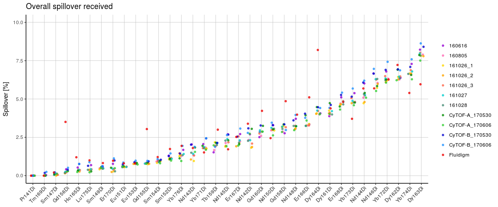

# Spillover matrix estimation & stability
Helena L Crowell et al.  

# Aim

This script aims to compare spillover matrices (SMs) across 11 single stained bead replicates, the one provided by Fluidigm, and 4 matrices obtained from 2 independent IMC measurements.

# Procedure

To investigate matrix stability over stainings, measurements, and instruments, we will first summarize

* the overall spill received and caused by each channel (Figure S3, E)
* spillover detected for specific types of interactions: M+/-1, M+16, isotopic impurities (Figure S3, D)
* estimates obtained from IMC as compared to those from flow mass cytometry (Figure S5, D-E)

Secondly, we compensate 2 single-stained bead replicates using

* a set of 7 SMs obtained from single-stained replicates acquired over 4 months (Figure S3, B)
* a set of 4 SMs obtained from replicates acquired on 2 instruments, and the one provided by Fluidigm (Figure S3, C)

respectively, and compare the median counts before and upon compensation. Here, we expect compensation to be most accurate when the applied SM was estimated from the replicate which medians are computed from. 


```r
# load required packages
library(CATALYST)
library(flowCore)
library(ggplot2)
library(matrixStats)
library(reshape2)

# source helpers
source('plotting-wrappers.R')
```

### Spillover estimation across 11 flow mass cytometry replicates

The code below estimates SMs across 11 single stained bead replicates using `CATALYST`, and reads in the one provided by Fluidigm in **Fluidigm_SM.csv**. We write out the resulting set of 12 SMs into the R object **SMs.RData** for further usage. The `sep_cutoffs` used for deconvolution of single-stained beads were set manually and are provided in **sep_cutoffs.txt**.


```r
fcs_path <- '../data/Figure_S3/bead replicates'
fcs_files <- list.files(fcs_path, ".fcs", full.names=TRUE)
n <- length(fcs_files)

# read in table of separation cutoffs for
# deconvolution of single-stained beads
sep_cutoffs <- read.table("../data/Figure_S3/sep_cutoffs.txt", check.names=FALSE)
nms <- names(sep_cutoffs)

# specify single-stain masses
ss_ms <- c(141:156, 158:176)
# initialize list to store spillover matrices
SMs <- vector("list", n)
names(SMs) <- names(fcs_files) <- nms

# estimate spillover matrices
for (i in nms) {
    # read in flowFrame
    ff <- read.FCS(fcs_files[[i]])
    # assign preliminary IDs
    res <- assignPrelim(ff, ss_ms, verbose=FALSE)
    # apply deconvolution parameters
    res <- applyCutoffs(res, mhl_cutoff=25, sep_cutoffs[[i]])
    # estimate spillover matrix
    SMs[[i]] <- computeSpillmat(res)
}

# read in Fluidigm matrix & reformat
sm <- read.csv2('../data/Figure_S3/Fluidigm_SM.csv', row.names=1)
sm[is.na(sm) | sm == ""] <- 0
sm <- matrix(as.numeric(as.matrix(sm)), nrow=nrow(sm), 
    dimnames=list(rownames(sm), colnames(sm)))
sm <- sm / 100
diag(sm) <- 1
SMs$Fluidigm <- sm

# save into RData-object
save(SMs, file='../data/Figure_S3/SMs.RData')
```


### Overall spillover received & caused


```r
# get total spill received & caused 
received <- sapply(SMs, function(i) {
    ms <- get_ms(colnames(i))
    spill <- colSums(i)[ms %in% c(141:156, 158:176)]
    (spill - 1) * 100
})
caused <- sapply(SMs, function(i) {
    ms <- get_ms(rownames(i))
    spill <- rowSums(i)[ms %in% c(141:156, 158:176)]
    (spill - 1) * 100
})

# reorder increasingly
fl <- names(SMs) == "Fluidigm"
received <- received[order(rowSums(received[, !fl])), ]
caused <- caused[order(rowSums(caused[, !fl])), ]

df_received <- melt(received)
df_caused <- melt(caused)

plot_overall_spill(df_received, "Overall spillover received")
```

<!-- -->

```r
plot_overall_spill(df_caused, "Overall spillover caused")
```

<!-- -->

### Spillover stratified by channel relationships

In the code below, we group interactions into M+/-1, M+16 and isotopic impurities. In the resulting scatter plots, interactions are ordering increasingly according to the mean spillover across all replicates.


```r
# initialize list to store spill values
spill <- vector("list", length(SMs))
for (i in seq_along(SMs)) {
    sm <- CATALYST:::make_symetric(SMs[[i]])
    chs <- rownames(sm)
    # get indices of channels expected to be effected by spill
    ms <- as.numeric(get_ms(chs))
    mets <- gsub("Di", "", get_mets(chs))
    idx <- which(ms %in% c(141:156, 158:176))
    spill_cols <- CATALYST:::get_spill_cols(ms, mets)[idx]
    for (j in seq_along(spill_cols)) {
        # keep only values that affect channels in range of interest
        spill_cols[[j]] <- spill_cols[[j]][ms[spill_cols[[j]]] %in% 141:176]
    }
    n_vals <- sapply(spill_cols, length)
    inds <- cbind(rep(idx, n_vals), unlist(spill_cols))
    spill_vals <- sm[inds]
    spill[[i]] <- spill_vals * 100
}
spill <- do.call(cbind, spill)

# get interaction labels
from <- chs[inds[, 1]]
to   <- chs[inds[, 2]]

colnames(spill) <- names(SMs)
rownames(spill) <- paste0(from, "->", to)

# reorder increasingly
o <- order(rowMeans(spill))
spill <- spill[o, ]
from <- from[o]            
to <- to[o]

# separate into 3 groups: 
# +/-1M, +16M, isotopic impurities
ms_from <- get_ms(from);     ms_to <- get_ms(to)
mets_from <- get_mets(from); mets_to <- get_mets(to)

m1  <- ms_from - 1  == ms_to
p1  <- ms_from + 1  == ms_to
ox <- ms_from + 16 == ms_to
imp <- (mets_from == mets_to) & (ms_from + 16 != ms_to) &
    (ms_from - 1 != ms_to) & (ms_from + 1 != ms_to)

groups <- list(m1, p1, imp, ox)
groups <- lapply(groups, which)

# compute mean, sd, min, max for each interaction
# (exclude Fluidigm matrix for this!)
means <- lapply(groups, function(i) apply(spill[i, !fl], 1, mean))
sds   <- lapply(groups, function(i) apply(spill[i, !fl], 1, sd))
mins  <- lapply(groups, function(i) apply(spill[i, !fl], 1, min))
maxs  <- lapply(groups, function(i) apply(spill[i, !fl], 1, max))

th <- c(.5, .5, .5, 0)
mains <- c("M-1 & Impurities", "M+1 & Impurities", "Impurities", "M+16")
for (i in seq_along(groups)) {
    # plot only interactions w/ mean above threshold
    df <- melt(spill[groups[[i]][means[[i]] > th[[i]]], ])
    plot_interactions(df, mains[i])
}
```

<!-- --><!-- --><!-- --><!-- -->

### Compensation matrix for IMC

Below we plot interaction specific signal interference for 2 independent IMC measurements, and compare these to spillover values obtained across the 11 replicates from flow mass cytomtery. Interactions are grouped and ordered as above.


```r
# read in IMC spillover matrices
csv_path <- '../data/Figure_S5'
sms_path <- list.files(csv_path, ".csv", full.names=TRUE) 
imc_sms <- lapply(sms_path, function(path) read.csv(path, row.names=1) * 100)

# separate into 3 groups: +/-1M, +16M, isotopic impurities
from_imc <- lapply(imc_sms, function(i) rep(rownames(i), ncol(i)))
to_imc   <- lapply(imc_sms, function(i) rep(colnames(i), each=nrow(i)))
from_to_imc <- lapply(seq_along(imc_sms), function(i) 
    paste0(from_imc[[i]], "->", to_imc[[i]]))
df_imc <- lapply(seq_along(imc_sms), function(i) 
    data.frame(x=from_to_imc[[i]], y=unlist(c(imc_sms[[i]])), id=i))
df_imc <- do.call(rbind, df_imc)

# get summary bars
bars <- lapply(seq_len(4), function(i) get_bars(i))

for (i in seq_along(groups)) {
    # filter interactions w/ mean above threshold
    fil <- means[[i]] > th[i]
    data <- spill[groups[[i]][fil], ]
    imc <- df_imc[df_imc$x %in% rownames(data), ]
    plot_interactions_imc(data, bars=bars[[i]][fil, ], imc, mains[i])
}
```

<!-- --><!-- --><!-- --><!-- -->

### define helper


```r
# the wrapper function get_meds() will return a list containing 2 data.frames: 
# the MSEs, and median counts before & upon compensation with a set of SMs
get_meds <- function(fcs_path, cutoffs, SMs, ymse) {
    n <- length(SMs)
    
    # read in single stained beads
    ss_beads <- read.FCS(fcs_path)

    # get indices of channels that are expected to receive spill
    chs <- colnames(ss_beads)
    ms <- get_ms(chs)
    mets <- get_mets(chs)
    spill_cols <- CATALYST:::get_spill_cols(ms, mets)

    # compensate single stains w/ 5 SMs
    ss_beads_comped <-  lapply(SMs, function(sm) compCytof(ss_beads, sm))

    # DECONVOLUTION         
    res_ss_beads <- assignPrelim(ss_beads, ss_ms, verbose=FALSE)
    res_ss_beads <- applyCutoffs(res_ss_beads, mhl_cutoff=25, cutoffs)

    # helper to get medians
    get_meds <- function(ff) {
        unlist(sapply(ss_ms, function(id) {
            inds <- bc_ids(res_ss_beads) == id
            cols <- spill_cols[[which(ms == id)]]
            colMedians(as.matrix(exprs(ff[inds, cols])))
        }))
    }
    uncomped <- get_meds(ss_beads)
    comped <- lapply(ss_beads_comped, get_meds)
    meds_ss_beads <- data.frame(Uncompensated=uncomped, 
        do.call(cbind, comped), check.names=FALSE)

    # compute MSE
    err <- data.frame(x=colnames(meds_ss_beads), y=rep(ymse, n+1), 
        z=sprintf("%.5s", round(colSums(meds_ss_beads^2)/nrow(meds_ss_beads), 5)))

    df <- reshape2::melt(meds_ss_beads)
    df$variable <- as.factor(df$variable)
    return(list(df, err))
}
```

### Stability across measurements

To demonstrate matrix stability over measurements, we compensate a single repliacte of single-stained beads with 7 matrices acquired over 4 months. For each dataset, the average sum of squares is shown on top of the graph.


```r
# subset matrices acquired over 4 months
SMs_sub <- SMs[1:7]
# specify path to FCS file
fcs_path <- '../data/Figure_S3/bead replicates/161026_2_beads.fcs'
# get separation cutoffs
cutoffs <- sep_cutoffs$`161026_2`

# get & plot medians before & upon compensation
res <- get_meds(fcs_path, cutoffs, SMs_sub, ymse=60)
df <- res[[1]]; err <- res[[2]]
yscale <- scale_y_continuous(limits=c(-30,70), breaks=seq(-25,50,25), expand=c(0,0))
plot_med_counts(df, vline=5, yscale)
```

<!-- -->

### Stability across instruments

To demonstrate matrix stability over instruments, we compensate a single repliacte of single-stained beads with 4 matrices acquired on 2 different instruments, and the matrix provided by Fluidigm.


```r
# subset: 2x CyTOF-A, 2x CyTOF-B, and Fluidigm
SMs_sub <- SMs[c(names(SMs)[grep("CyTOF", names(SMs))], "Fluidigm")]
# specify path to FCS file
fcs_path <- '../data/Figure_S3/bead replicates/CyTOF-A_170606_beads.fcs'
# get separation cutoffs
cutoffs <- sep_cutoffs$`CyTOF-A_170606`

# get & plot medians before & upon compensation
res <- get_meds(fcs_path, cutoffs, SMs_sub, ymse=90)
df <- res[[1]]; err <- res[[2]]
yscale <- scale_y_continuous(limits=c(-55,112.5), breaks=seq(-50,100,25), expand=c(0,0))
plot_med_counts(df, vline=3, yscale)
```

<!-- -->
